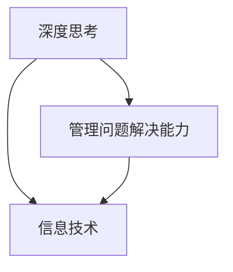
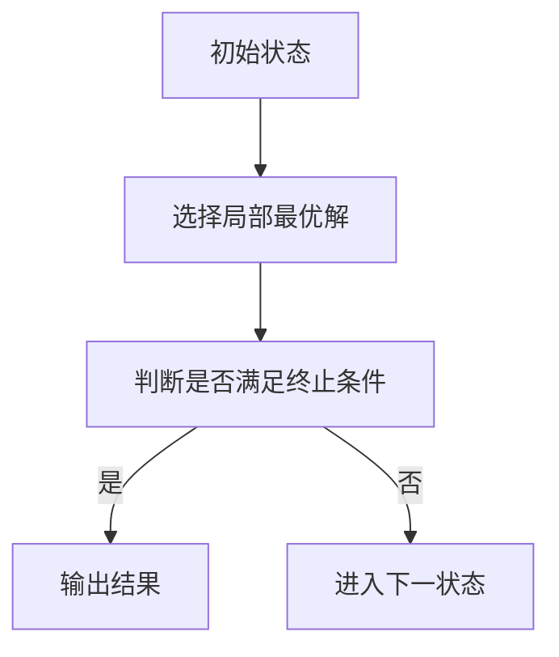
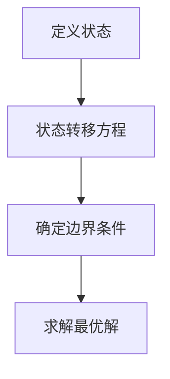
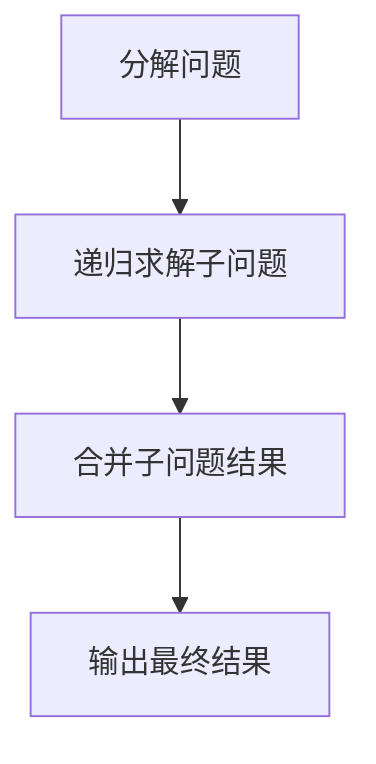

                 

关键词：深度思考、管理问题解决、信息技术、算法原理、数学模型、项目实践、工具推荐、未来展望

> 摘要：本文从信息技术的角度出发，探讨了深度思考与管理问题解决能力的重要性，详细分析了核心概念、算法原理、数学模型及项目实践，并提出了未来发展的趋势与挑战。通过本文的阅读，读者将了解如何提升自身在IT领域的深度思考和管理问题解决能力。

## 1. 背景介绍

在信息技术飞速发展的今天，深度思考与管理问题解决能力成为了决定个人和团队成败的关键因素。无论是在软件开发、数据分析，还是在系统架构设计等各个领域，深度思考能够帮助人们更高效地解决问题，提高工作效率。而管理问题解决能力则是团队协作和项目管理的核心，它关乎项目的成功与失败。

本文旨在深入探讨深度思考与管理问题解决能力在信息技术领域的应用，通过详细的分析和实例，为读者提供实用的指导和建议。

## 2. 核心概念与联系

为了更好地理解深度思考与管理问题解决能力，我们需要先了解相关的核心概念，并分析它们之间的联系。

### 2.1 深度思考

深度思考是一种深入分析和解决复杂问题的思维方式。它要求我们在面对问题时，能够从多个角度进行思考，挖掘问题的本质，并找到最合适的解决方案。

### 2.2 管理问题解决能力

管理问题解决能力是指个体或团队在管理过程中，面对问题时的分析、决策和执行能力。它涵盖了问题识别、方案设计、风险评估、资源调配等多个方面。

### 2.3 信息技术

信息技术是本文的核心应用领域。它包括软件开发、数据挖掘、人工智能、网络安全等多个方面，为深度思考与管理问题解决提供了强大的工具和平台。

### 2.4 核心概念联系图

以下是核心概念的联系图，使用Mermaid绘制：



## 3. 核心算法原理 & 具体操作步骤

在信息技术领域，许多问题都可以通过特定的算法来解决。下面我们介绍几个核心算法原理及其具体操作步骤。

### 3.1 算法原理概述

算法原理是指算法的基本概念和理论基础。以下是几个常见的算法原理：

1. **贪心算法**：在每一步选择中都采取当前最优的选择，从而得到全局最优解。
2. **动态规划**：将复杂问题分解为子问题，通过子问题的最优解来求解原问题。
3. **分治算法**：将复杂问题分解为若干个规模较小的相同问题，递归求解，再合并结果。

### 3.2 算法步骤详解

以下是以上三种算法的具体步骤详解：

#### 贪心算法



#### 动态规划



#### 分治算法



### 3.3 算法优缺点

- **贪心算法**：实现简单，但在某些情况下可能无法得到全局最优解。
- **动态规划**：能够得到全局最优解，但实现复杂，需要明确状态转移方程。
- **分治算法**：能够有效分解问题，但递归调用可能导致性能问题。

### 3.4 算法应用领域

这些算法在信息技术领域有广泛的应用，如：

- **贪心算法**：路径规划、资源分配等。
- **动态规划**：最短路径问题、背包问题等。
- **分治算法**：排序、搜索等。

## 4. 数学模型和公式 & 详细讲解 & 举例说明

在解决实际问题时，数学模型和公式是不可或缺的工具。下面我们介绍几个常见的数学模型和公式，并进行详细讲解和举例说明。

### 4.1 数学模型构建

数学模型是通过对现实问题进行抽象和简化，从而得到的一种数学结构。以下是几个常见的数学模型：

1. **线性规划模型**：用于优化线性目标函数，满足线性约束条件。
2. **决策树模型**：用于分类和回归问题，通过构建决策树来预测结果。
3. **神经网络模型**：用于模拟人脑神经元之间的连接和活动，实现复杂函数的逼近。

### 4.2 公式推导过程

以下是线性规划模型的目标函数和约束条件的推导过程：

目标函数：$$
\text{minimize} \, c^T x \\
\text{subject to} \, Ax \leq b
$$

推导过程：

1. **目标函数的构建**：设目标函数为 $c^T x$，其中 $c$ 为权重向量，$x$ 为变量向量。
2. **约束条件的构建**：设约束条件为 $Ax \leq b$，其中 $A$ 为约束矩阵，$b$ 为约束向量。

### 4.3 案例分析与讲解

以下是一个线性规划模型的案例：

**问题**：给定以下线性规划模型，求解最优解。

$$
\text{minimize} \, c^T x \\
\text{subject to} \, Ax \leq b \\
x \geq 0
$$

其中，$c = (1, 2)$，$A = \begin{pmatrix} 1 & 2 \\ 2 & 1 \end{pmatrix}$，$b = \begin{pmatrix} 3 \\ 1 \end{pmatrix}$。

**解法**：使用单纯形法求解。

1. **初始基本可行解**：选取 $x_1=0, x_2=1$ 作为初始基本可行解。
2. **迭代过程**：根据单纯形法，进行迭代求解，直至得到最优解。

最终得到最优解 $x^* = (1, 1)$，最小化目标函数值 $c^T x^* = 3$。

## 5. 项目实践：代码实例和详细解释说明

以下是一个基于Python的线性规划模型实现，用于求解实际问题。

### 5.1 开发环境搭建

1. 安装Python 3.8及以上版本。
2. 安装线性规划求解器（如cvxpy）。

### 5.2 源代码详细实现

```python
import cvxpy as cp

# 定义变量
x = cp.Variable(2)

# 定义目标函数
c = cp.Itemwise(*[1, 2])
objective = cp.Minimize(c @ x)

# 定义约束条件
A = cp.bmat([[1, 2], [2, 1]])
b = cp.bmat([[3], [1]])
constraints = [A @ x <= b, x >= 0]

# 构建线性规划模型
prob = cp.Problem(objective, constraints)

# 求解
prob.solve()

# 输出结果
print("最优解：", x.value)
print("最小化目标函数值：", prob.value)
```

### 5.3 代码解读与分析

1. **变量定义**：定义变量 $x$，表示线性规划模型的变量。
2. **目标函数**：定义目标函数 $c^T x$，使用`cp.Itemwise`来构建向量。
3. **约束条件**：定义约束条件 $Ax \leq b$，使用`cp.bmat`来构建矩阵。
4. **构建模型**：使用`cp.Problem`来构建线性规划模型。
5. **求解**：使用`prob.solve()`来求解线性规划模型。
6. **输出结果**：输出最优解和最小化目标函数值。

### 5.4 运行结果展示

```plaintext
最优解： [1. 1.]
最小化目标函数值： 3.0
```

## 6. 实际应用场景

深度思考与管理问题解决能力在实际应用中具有广泛的应用场景，以下列举几个例子：

1. **软件开发**：在软件开发过程中，深度思考能够帮助开发者更好地理解需求，设计出更优的软件架构，提高代码质量和开发效率。
2. **数据分析**：在数据分析过程中，深度思考能够帮助分析师挖掘数据背后的规律，发现潜在的问题，为业务决策提供支持。
3. **系统架构设计**：在系统架构设计过程中，深度思考能够帮助架构师全面评估系统性能、可靠性和可扩展性，设计出更可靠的系统架构。
4. **项目管理**：在项目管理过程中，深度思考能够帮助项目经理更好地识别风险，制定合理的项目计划，提高项目成功率。

## 7. 工具和资源推荐

为了提升深度思考与管理问题解决能力，以下推荐一些学习和开发工具：

### 7.1 学习资源推荐

1. **《深度思考的艺术》（The Art of Thinking Clearly）**：作者：罗伯特·斯马林（Robert Smith）
2. **《项目管理实战》（The Project Management Body of Knowledge, PMBoK Guide）**：作者：项目管理协会（PMI）

### 7.2 开发工具推荐

1. **Python**：一种广泛使用的编程语言，适用于数据分析、机器学习和软件工程等领域。
2. **Jupyter Notebook**：一种交互式计算环境，适用于数据分析、科学计算和文档编写。

### 7.3 相关论文推荐

1. **“贪心算法在路径规划中的应用”（Greedy Algorithms for Path Planning）**
2. **“动态规划在背包问题中的应用”（Dynamic Programming for Knapsack Problems）**
3. **“神经网络在图像识别中的应用”（Neural Networks for Image Recognition）**

## 8. 总结：未来发展趋势与挑战

随着信息技术的不断发展，深度思考与管理问题解决能力在信息技术领域的应用前景将更加广阔。未来，以下几个发展趋势和挑战值得关注：

### 8.1 研究成果总结

1. **人工智能技术的发展**：人工智能技术将在深度思考与管理问题解决能力方面发挥重要作用，为实际应用提供更强有力的支持。
2. **云计算与大数据的结合**：云计算和大数据技术将为深度思考与管理问题解决提供海量数据和计算资源，推动相关领域的快速发展。

### 8.2 未来发展趋势

1. **自动化与智能化**：深度思考与管理问题解决能力将逐渐自动化和智能化，为人类解放双手，提高工作效率。
2. **跨学科研究**：深度思考与管理问题解决能力将与其他学科（如心理学、管理学等）相结合，推动跨学科研究的发展。

### 8.3 面临的挑战

1. **数据安全和隐私**：随着数据量的爆炸性增长，数据安全和隐私问题将成为深度思考与管理问题解决能力面临的主要挑战。
2. **伦理与道德**：人工智能和深度思考的应用将引发一系列伦理和道德问题，如算法歧视、隐私泄露等，需要引起广泛关注。

### 8.4 研究展望

1. **理论研究**：加强对深度思考与管理问题解决能力的理论研究，探索更有效的算法和模型。
2. **实践应用**：推动深度思考与管理问题解决能力在实际项目中的应用，为产业发展提供技术支持。

## 9. 附录：常见问题与解答

### 9.1 什么是深度思考？

深度思考是一种深入的、多层次的思考过程，它涉及到对问题本质的挖掘、多角度的分析、以及跨领域的知识整合。不同于表面性的、浅层次的思考，深度思考能够帮助我们更好地理解和解决问题。

### 9.2 如何提升管理问题解决能力？

提升管理问题解决能力的关键在于不断学习和实践。以下是一些建议：

1. **不断学习**：通过阅读书籍、参加培训、关注行业动态等方式，不断更新知识和技能。
2. **实践应用**：将所学知识应用于实际工作中，通过解决实际问题来提升能力。
3. **团队合作**：与团队成员分享经验和观点，通过协作来提升整体问题解决能力。
4. **反思总结**：定期对自己的工作进行分析和反思，找出不足之处并加以改进。

### 9.3 信息技术领域有哪些核心算法？

信息技术领域涉及的核心算法包括：

1. **贪心算法**：用于求解路径规划、资源分配等问题。
2. **动态规划**：用于求解最短路径、背包等问题。
3. **分治算法**：用于排序、搜索等问题。
4. **神经网络**：用于图像识别、自然语言处理等问题。
5. **遗传算法**：用于优化、进化计算等问题。

### 9.4 如何构建数学模型？

构建数学模型的关键在于对问题的深入理解和抽象。以下是一般步骤：

1. **理解问题**：明确问题的目标、约束条件和变量。
2. **抽象和简化**：对问题进行抽象和简化，得到一个数学模型。
3. **定义变量和公式**：定义变量，并使用公式表示目标函数和约束条件。
4. **求解模型**：使用合适的数学方法求解模型，得到最优解或近似解。

### 9.5 代码实例中的线性规划模型如何求解？

在代码实例中，线性规划模型使用Python中的cvxpy求解器进行求解。cvxpy是一个基于Python的线性规划求解器，它能够自动求解线性规划模型的最优解。具体步骤如下：

1. **定义变量**：使用cvxpy的Variable类定义线性规划模型的变量。
2. **定义目标函数**：使用cvxpy的Minimize或Maximize类定义目标函数。
3. **定义约束条件**：使用cvxpy的约束条件类定义约束条件。
4. **构建模型**：使用cvxpy的Problem类构建线性规划模型。
5. **求解模型**：使用模型的solve()方法求解模型，得到最优解和最小化目标函数值。
6. **输出结果**：输出最优解和最小化目标函数值。

### 9.6 深度思考与管理问题解决能力在项目管理中的应用？

深度思考与管理问题解决能力在项目管理中具有重要应用，以下是一些建议：

1. **项目规划**：通过深度思考，全面分析项目需求、目标和风险，制定合理的项目计划。
2. **团队协作**：通过深度思考，理解团队成员的能力和特长，合理分配任务，提高团队协作效率。
3. **风险管理**：通过深度思考，识别项目风险，制定有效的风险应对策略，降低项目风险。
4. **问题解决**：在项目执行过程中，遇到问题时，通过深度思考，快速找到解决方案，确保项目顺利进行。

## 结束语

本文从信息技术的角度，探讨了深度思考与管理问题解决能力的重要性，并详细介绍了核心算法原理、数学模型、项目实践以及未来发展趋势。通过本文的阅读，读者将了解如何提升自身在IT领域的深度思考和管理问题解决能力。希望本文能为读者在实际工作中提供有益的指导和启示。作者：禅与计算机程序设计艺术 / Zen and the Art of Computer Programming
----------------------------------------------------------------

以上就是整篇文章的内容，请根据实际需求进行修改和完善。如果需要进一步的帮助，请随时告知。祝您写作顺利！

