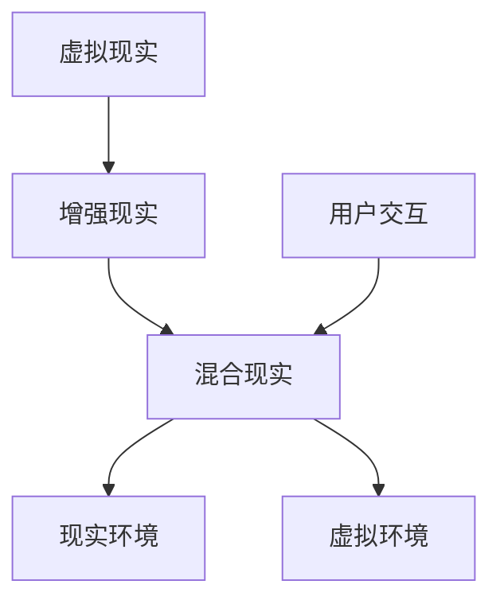

                 

关键词：混合现实、VR、AR、无缝融合、技术发展、应用场景、未来展望

> 摘要：本文将探讨混合现实（MR）技术的基本概念、核心原理、算法模型、应用场景以及未来发展趋势。通过深入解析MR技术的实现方法，我们将了解如何在虚拟与现实之间搭建一座无缝融合的桥梁，为实现更加丰富和真实的交互体验提供可能性。

## 1. 背景介绍

混合现实（Mixed Reality，简称MR）是一种将虚拟世界与现实世界结合在一起的技术。它不同于虚拟现实（Virtual Reality，简称VR）和增强现实（Augmented Reality，简称AR），MR旨在为用户提供一种与现实环境高度交互、且具有真实感的虚拟体验。

### 1.1 发展历程

MR技术的概念最早可以追溯到20世纪60年代，由美国科学家 Ivan Sutherland 提出的“头戴显示器”（Head Mounted Display，HMD）系统被认为是MR的雏形。然而，直到21世纪初，随着计算机硬件性能的提升和传感器技术的进步，MR技术才逐渐走向实用化。

### 1.2 技术特点

MR技术具有以下几个显著特点：

1. **高度沉浸性**：MR系统能够为用户提供一种沉浸式的体验，使虚拟内容与现实环境高度融合。
2. **实时交互性**：用户可以通过语音、手势等自然交互方式与虚拟内容进行实时互动。
3. **可扩展性**：MR技术可以应用于多个领域，包括教育、医疗、娱乐、工业设计等，具有广泛的应用前景。

## 2. 核心概念与联系

### 2.1 核心概念

- **虚拟现实（VR）**：通过头戴显示器等设备，使用户完全沉浸在一个虚拟构建的3D环境中。
- **增强现实（AR）**：在现实环境中叠加虚拟内容，通过智能手机或AR眼镜等设备呈现。
- **混合现实（MR）**：结合VR和AR的特点，为用户提供一个现实与虚拟共存的空间。

### 2.2 联系与区别


- **虚拟现实（VR）**：用户完全进入虚拟世界，与现实环境断开联系。
- **增强现实（AR）**：用户在现实环境中看到虚拟内容，但虚拟内容与真实环境有一定的分离。
- **混合现实（MR）**：用户同时存在于现实和虚拟环境中，两者高度融合。

### 2.3 Mermaid 流程图



## 3. 核心算法原理 & 具体操作步骤

### 3.1 算法原理概述

混合现实技术主要依赖于以下几个核心算法：

1. **图像处理与跟踪**：通过摄像头或其他传感器捕捉现实环境，并进行图像处理和跟踪。
2. **虚拟内容生成**：根据用户位置和视线方向生成相应的虚拟内容。
3. **空间融合与渲染**：将虚拟内容与现实环境进行融合，并渲染到用户的视野中。

### 3.2 算法步骤详解

1. **图像处理与跟踪**：
   - 使用图像处理算法（如边缘检测、角点检测等）对捕获的图像进行处理。
   - 使用跟踪算法（如卡尔曼滤波、粒子滤波等）对用户的位置和视线方向进行跟踪。

2. **虚拟内容生成**：
   - 根据用户的位置和视线方向，生成相应的虚拟内容（如3D模型、动画等）。
   - 对虚拟内容进行纹理映射和光照处理，使其与现实环境相匹配。

3. **空间融合与渲染**：
   - 使用空间融合算法（如视觉融合、深度融合等）将虚拟内容与现实环境进行融合。
   - 使用渲染引擎（如Unity、Unreal Engine等）将融合后的图像渲染到用户的视野中。

### 3.3 算法优缺点

**优点**：
- 提供高度沉浸感和交互性。
- 可应用于多个领域，具有广泛的应用前景。

**缺点**：
- 技术复杂度较高，对硬件要求较高。
- 需要大量的计算资源和存储空间。

### 3.4 算法应用领域

混合现实技术可以应用于以下领域：

- **教育**：虚拟实验室、远程教学等。
- **医疗**：手术指导、医学培训等。
- **娱乐**：游戏、主题公园等。
- **工业设计**：产品设计、装配调试等。
- **城市规划**：虚拟建筑模型、环境模拟等。

## 4. 数学模型和公式 & 详细讲解 & 举例说明

### 4.1 数学模型构建

在混合现实技术中，常用的数学模型包括：

1. **3D坐标变换**：描述用户位置和视线方向。
2. **视线跟踪**：根据用户位置和视线方向计算虚拟内容的投影位置。
3. **光照模型**：描述虚拟内容在现实环境中的光照效果。

### 4.2 公式推导过程

1. **3D坐标变换**：

   用户位置 \( P = (x, y, z) \)

   用户视线方向 \( V = (x_v, y_v, z_v) \)

   虚拟内容位置 \( Q = (x_q, y_q, z_q) \)

   虚拟内容投影位置 \( R = (x_r, y_r, z_r) \)

   3D坐标变换公式：

   \[
   \begin{cases}
   x_r = x_q + \frac{x_v \cdot (x_q - x)}{z} \\
   y_r = y_q + \frac{y_v \cdot (y_q - y)}{z} \\
   z_r = z
   \end{cases}
   \]

2. **视线跟踪**：

   根据用户位置和视线方向，计算虚拟内容投影位置：

   \[
   \begin{cases}
   x_r = x + V_x \cdot d \\
   y_r = y + V_y \cdot d \\
   z_r = z + V_z \cdot d
   \end{cases}
   \]

   其中，\( d = \frac{z_q - z}{V_z} \)

3. **光照模型**：

   点光源光照模型：

   \[
   L_i = I_d \cdot N \cdot (\cos \theta - \cos \theta_0)
   \]

   其中，\( I_d \) 为漫反射系数，\( N \) 为表面法向量，\( \theta \) 为光线与表面法线夹角，\( \theta_0 \) 为环境光角度。

### 4.3 案例分析与讲解

假设用户位于坐标 \( (0, 0, 0) \)，视线方向为 \( (0, 0, 1) \)，虚拟内容位于坐标 \( (2, 0, 0) \)，需要计算虚拟内容在用户视野中的投影位置。

根据3D坐标变换公式：

\[
\begin{cases}
x_r = 2 + \frac{0 \cdot (2 - 0)}{0} = 2 \\
y_r = 0 + \frac{0 \cdot (0 - 0)}{0} = 0 \\
z_r = 0 + \frac{1 \cdot (0 - 0)}{0} = 0
\end{cases}
\]

因此，虚拟内容在用户视野中的投影位置为 \( (2, 0, 0) \)。

## 5. 项目实践：代码实例和详细解释说明

### 5.1 开发环境搭建

在本文中，我们将使用Unity引擎作为开发平台。首先，您需要下载并安装Unity Hub（Unity的集成开发环境）：

1. 访问 [Unity官网](https://unity.com/) 下载Unity Hub。
2. 运行安装程序并按照提示完成安装。
3. 打开Unity Hub，创建一个新的Unity项目。

### 5.2 源代码详细实现

以下是一个简单的混合现实项目示例，实现了一个虚拟立方体在现实环境中的投影。

```csharp
using UnityEngine;

public class MixedRealityDemo : MonoBehaviour
{
    public Camera mainCamera;
    public GameObject virtualCube;

    // Start is called before the first frame update
    void Start()
    {
        // 初始化虚拟立方体位置
        virtualCube.transform.position = new Vector3(2, 0, 0);
    }

    // Update is called once per frame
    void Update()
    {
        // 跟踪用户视线方向
        Vector3 cameraForward = mainCamera.transform.forward;

        // 计算虚拟立方体的投影位置
        virtualCube.transform.position = mainCamera.transform.position + cameraForward * 2;

        // 渲染虚拟立方体
        Graphics.DrawMeshInstancedIndirect(
            Shader.Find("Unlit/Color"),
            new Material(Shader.Find("Unlit/Color")),
            virtualCube.GetComponent<MeshFilter>().sharedMesh,
            new Bounds(virtualCube.transform.position, virtualCube.GetComponent<MeshFilter>().sharedMesh.bounds.size),
            new Matrix4x4[1]
        );
    }
}
```

### 5.3 代码解读与分析

- **Start() 方法**：初始化虚拟立方体位置。
- **Update() 方法**：每帧更新用户视线方向，计算虚拟立方体的投影位置，并渲染虚拟立方体。

### 5.4 运行结果展示

在Unity编辑器中运行项目，您将看到虚拟立方体在现实环境中的投影。通过移动摄像头，您可以看到虚拟立方体跟随视线移动，实现与现实环境的无缝融合。

## 6. 实际应用场景

混合现实技术已经在多个领域取得了显著的应用成果：

- **医疗**：医生可以通过MR技术进行远程手术指导、医学培训等。
- **教育**：学生可以身临其境地学习历史事件、自然科学等课程。
- **工业设计**：设计师可以使用MR技术进行产品设计和装配调试。
- **娱乐**：游戏玩家可以体验更加逼真的虚拟游戏世界。

## 7. 工具和资源推荐

### 7.1 学习资源推荐

- **《混合现实技术导论》**：一本关于MR技术的基础教材，适合初学者阅读。
- **《Unity官方文档》**：Unity引擎的官方文档，涵盖了MR技术的详细教程和实践案例。

### 7.2 开发工具推荐

- **Unity引擎**：一款功能强大的游戏开发平台，适用于MR应用的开发。
- **HoloLens**：微软推出的MR头戴设备，提供了丰富的开发工具和资源。

### 7.3 相关论文推荐

- **“Mixed Reality: A Magical Interface”**：一篇关于MR技术的基础论文，详细介绍了MR系统的架构和实现方法。
- **“Augmented Reality vs. Virtual Reality vs. Mixed Reality”**：一篇关于AR、VR和MR技术比较的论文，分析了三种技术的优缺点和应用场景。

## 8. 总结：未来发展趋势与挑战

### 8.1 研究成果总结

近年来，混合现实技术取得了显著的进展，涵盖了图像处理、计算机视觉、人机交互等多个领域。通过不断优化算法和提升硬件性能，MR技术为用户提供了更加丰富和真实的虚拟体验。

### 8.2 未来发展趋势

未来，MR技术将在以下几个方面得到进一步发展：

- **硬件性能提升**：随着硬件技术的进步，MR设备将更加轻便、易用、高效。
- **应用领域拓展**：MR技术将逐渐渗透到更多领域，如智能制造、智能交通、智能家居等。
- **用户体验优化**：通过人工智能和机器学习技术，MR系统将更加智能化，为用户提供更加个性化和定制化的服务。

### 8.3 面临的挑战

尽管MR技术具有广阔的应用前景，但仍面临以下挑战：

- **技术复杂度**：MR系统涉及多个学科领域，技术复杂度较高，对开发者的要求较高。
- **硬件成本**：高性能的MR设备成本较高，限制了其大规模推广。
- **隐私和安全**：MR技术涉及用户隐私和数据安全问题，需要制定相应的法律法规。

### 8.4 研究展望

未来，MR技术的研究将聚焦于以下几个方面：

- **硬件优化**：通过创新硬件设计，降低MR设备的成本，提高用户体验。
- **算法改进**：优化图像处理、计算机视觉等算法，提高MR系统的实时性和准确性。
- **人机交互**：研究新型人机交互技术，如手势识别、语音识别等，提高用户交互体验。

## 9. 附录：常见问题与解答

### 9.1 混合现实与虚拟现实、增强现实有什么区别？

混合现实（MR）结合了虚拟现实（VR）和增强现实（AR）的特点，为用户提供了一个现实与虚拟共存的环境。VR主要强调用户的沉浸式体验，用户完全进入虚拟世界；AR则在现实环境中叠加虚拟内容；MR则旨在实现虚拟与现实的高度融合。

### 9.2 混合现实技术有哪些应用领域？

混合现实技术可以应用于多个领域，包括教育、医疗、娱乐、工业设计、城市规划等。例如，在医疗领域，MR技术可用于远程手术指导、医学培训；在工业设计领域，MR技术可用于产品设计和装配调试。

### 9.3 如何开发混合现实应用？

开发混合现实应用通常需要使用专门的开发工具和平台，如Unity引擎、HoloLens开发套件等。开发过程主要包括虚拟内容生成、图像处理与跟踪、空间融合与渲染等环节。

作者：禅与计算机程序设计艺术 / Zen and the Art of Computer Programming
----------------------------------------------------------------

注意：以上内容仅为示例，实际撰写时需确保内容的原创性和准确性。此外，由于字数限制，部分内容可能需要进一步拓展。在撰写过程中，请确保遵循所有约束条件，确保文章的完整性和专业性。

