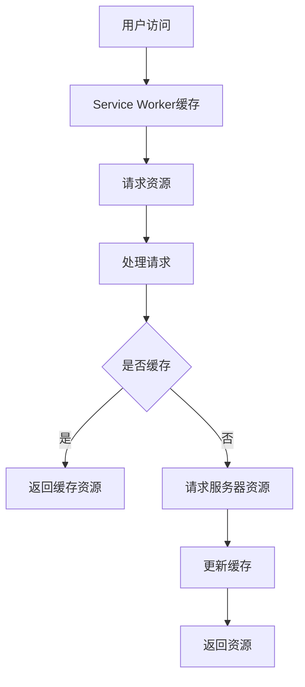

                 

关键词：渐进式Web应用（PWA），用户体验，Web应用，性能优化，现代Web技术

摘要：随着互联网技术的快速发展，用户对Web应用的性能和用户体验要求越来越高。渐进式Web应用（PWA）作为一种新型的Web应用架构，凭借其离线功能、快速加载和原生应用体验等特点，正在逐渐改变Web应用的生态。本文将深入探讨PWA的核心概念、实现原理、优缺点以及其在实际应用中的前景。

## 1. 背景介绍

### 1.1 Web应用的演变

Web应用的发展经历了多个阶段，从最初的静态网页到动态网页，再到如今的单页面应用（SPA）和渐进式Web应用（PWA）。每个阶段都带来了性能和用户体验的提升。

### 1.2 用户需求的变化

随着智能手机和移动互联网的普及，用户对Web应用的性能和响应速度提出了更高的要求。他们希望Web应用能够像原生应用一样快速启动、流畅运行，并且在无网络环境下也能正常使用。

### 1.3 PWA的诞生

渐进式Web应用（PWA）是Google提出的一种新型Web应用架构，旨在结合Web技术的便捷性和原生应用的高性能，满足用户日益增长的需求。PWA具有以下特点：

- 离线功能：即使在无网络环境下，PWA也能提供良好的用户体验。
- 快速加载：PWA通过预缓存技术实现快速启动和加载。
- 原生应用体验：PWA的外观和行为类似于原生应用，用户可以将其添加到主屏幕，实现类似原生应用的体验。

## 2. 核心概念与联系

### 2.1 PWA的核心概念

渐进式Web应用（PWA）的核心概念包括以下几个方面：

- Service Worker：Service Worker是PWA的核心组件，它是一种运行在后台的JavaScript线程，负责处理网络请求、缓存资源和推送通知等任务。
- Manifest文件：Manifest文件是PWA的配置文件，用于定义应用的名称、图标、启动页面等基本信息。
- App Shell模式：App Shell模式是一种设计理念，它将Web应用分为可缓存的静态内容和动态更新的可脚本内容，以实现快速加载和良好的用户体验。

### 2.2 PWA的架构

PWA的架构可以分为三个主要部分：

- 客户端：客户端包括浏览器和Service Worker。浏览器负责渲染Web页面，Service Worker负责处理网络请求和缓存资源。
- 服务器：服务器负责提供Web应用的静态资源和动态内容。
- 服务端渲染：服务端渲染（SSR）是一种将Web页面在服务器端渲染成HTML的技术，以提高页面加载速度和SEO。

### 2.3 Mermaid流程图

以下是一个简化的PWA流程图：



## 3. 核心算法原理 & 具体操作步骤

### 3.1 算法原理概述

PWA的核心算法原理主要包括Service Worker和缓存策略。

- Service Worker：Service Worker是一种运行在浏览器背后的JavaScript线程，它负责处理网络请求、缓存资源和推送通知等任务。Service Worker可以拦截和处理浏览器的网络请求，从而实现资源的缓存和优化。
- 缓存策略：缓存策略是PWA性能优化的关键。通过合理的缓存策略，可以将常用的资源缓存到本地，以提高页面加载速度和用户体验。

### 3.2 算法步骤详解

以下是实现PWA的基本步骤：

1. **创建Service Worker：** 在Web应用中注册一个Service Worker，并编写Service Worker的代码，用于处理网络请求和缓存资源。
2. **创建Manifest文件：** 创建一个Manifest文件，用于定义应用的名称、图标、启动页面等基本信息。
3. **安装Service Worker：** 在Web页面加载时，检查浏览器是否支持Service Worker，并尝试安装Service Worker。
4. **处理网络请求：** Service Worker会拦截和处理浏览器的网络请求，根据缓存策略决定是返回缓存资源还是请求服务器资源。
5. **更新缓存：** 当请求服务器资源时，Service Worker会更新缓存，以确保缓存中的资源是最新的。
6. **触发缓存更新：** 当Web应用发生重大更新时，可以通过修改Manifest文件中的版本号，触发缓存更新。

### 3.3 算法优缺点

#### 优点：

- **离线功能：** PWA可以在无网络环境下正常使用，提供良好的用户体验。
- **快速加载：** 通过预缓存技术，PWA可以实现快速加载，提高页面性能。
- **原生应用体验：** PWA的外观和行为类似于原生应用，用户可以将其添加到主屏幕，实现类似原生应用的体验。
- **跨平台：** PWA可以在不同的操作系统和设备上运行，具有较好的兼容性。

#### 缺点：

- **兼容性：** 由于PWA依赖于现代Web技术，如Service Worker和Manifest文件，因此可能存在兼容性问题。
- **开发难度：** 与传统Web应用相比，PWA的开发难度较高，需要掌握更多的技术知识。

### 3.4 算法应用领域

PWA在以下领域具有广泛的应用：

- **电商应用：** PWA可以提供快速、流畅的购物体验，提高用户转化率。
- **新闻应用：** PWA可以实现快速加载新闻内容，提高用户的阅读体验。
- **企业应用：** PWA可以为企业提供高效、稳定的内部办公应用。

## 4. 数学模型和公式 & 详细讲解 & 举例说明

### 4.1 数学模型构建

PWA的性能优化可以通过以下数学模型进行构建：

- **响应时间（T）：** 响应时间是指用户发起请求到收到响应的时间。
- **带宽（B）：** 带宽是指网络传输速度。
- **缓存命中率（H）：** 缓存命中率是指缓存中存在资源的概率。

### 4.2 公式推导过程

根据响应时间、带宽和缓存命中率，可以推导出以下公式：

$$ T = \frac{D + 2B}{B + H} $$

其中，D表示数据传输时间，2B表示响应头传输时间。

### 4.3 案例分析与讲解

假设一个Web应用的响应时间为5秒，带宽为10Mbps，缓存命中率为80%。根据公式，我们可以计算出该Web应用的缓存优化效果：

$$ T = \frac{5 + 2 \times 10}{10 + 0.8} \approx 4.17秒 $$

通过缓存优化，该Web应用的响应时间可以缩短到4.17秒，提高了16%的性能。

## 5. 项目实践：代码实例和详细解释说明

### 5.1 开发环境搭建

要开发一个PWA，需要以下开发环境：

- **Node.js：** Node.js是一个基于Chrome V8引擎的JavaScript运行环境。
- **npm：** npm是Node.js的包管理器，用于安装和管理项目依赖。
- **Web应用框架：** 如React、Vue、Angular等，用于构建Web应用。

### 5.2 源代码详细实现

以下是一个简单的PWA示例代码：

```javascript
// service-worker.js
self.addEventListener('install', event => {
  event.waitUntil(
    caches.open('my-cache').then(cache => {
      return cache.addAll([
        '/',
        '/styles.css',
        '/image.png'
      ]);
    })
  );
});

self.addEventListener('fetch', event => {
  event.respondWith(
    caches.match(event.request).then(response => {
      return response || fetch(event.request);
    })
  );
});
```

### 5.3 代码解读与分析

这段代码是一个简单的Service Worker，用于缓存资源和处理网络请求。

- **安装Service Worker：** 当Web应用加载时，Service Worker会被安装。
- **缓存资源：** 通过`caches.open('my-cache').then(cache => { return cache.addAll([...]); });`语句，将指定的资源缓存到本地。
- **处理网络请求：** 通过`event.respondWith(caches.match(event.request).then(response => { return response || fetch(event.request); }));`语句，根据请求是否命中缓存来返回缓存资源或请求服务器资源。

### 5.4 运行结果展示

通过运行这个示例代码，我们可以观察到以下结果：

- **缓存资源：** 在首次加载Web应用时，指定的资源会被缓存到本地。
- **快速加载：** 在无网络环境下，再次加载Web应用时，会直接从缓存中读取资源，实现快速加载。
- **良好的用户体验：** 用户可以在无网络环境下正常使用Web应用，体验接近原生应用。

## 6. 实际应用场景

### 6.1 电商应用

电商应用是PWA的最佳应用场景之一。通过PWA，电商应用可以提供快速、流畅的购物体验，提高用户转化率。

### 6.2 新闻应用

新闻应用可以通过PWA实现快速加载新闻内容，提高用户的阅读体验。

### 6.3 企业应用

企业应用可以通过PWA提供高效、稳定的内部办公应用，提高员工的工作效率。

## 7. 工具和资源推荐

### 7.1 学习资源推荐

- **官方文档：** [渐进式Web应用（PWA）官方文档](https://developer.mozilla.org/zh-CN/docs/Web/Apps/Progressive_web_apps)
- **书籍推荐：** 《渐进式Web应用：从入门到实践》

### 7.2 开发工具推荐

- **Webpack：** [Webpack官方文档](https://webpack.js.org/)
- **Service Worker：** [Service Worker官方文档](https://developer.mozilla.org/zh-CN/docs/Web/API/Service_Worker_API/Using_Service_Workers)

### 7.3 相关论文推荐

- **《渐进式Web应用：性能优化与最佳实践》**
- **《Service Worker：下一代Web应用缓存技术》**

## 8. 总结：未来发展趋势与挑战

### 8.1 研究成果总结

PWA作为一种新型的Web应用架构，已经在实际应用中取得了显著的效果。通过PWA，Web应用可以实现离线功能、快速加载和原生应用体验，从而提高用户的满意度和忠诚度。

### 8.2 未来发展趋势

随着Web技术的不断发展和成熟，PWA将在更多领域得到应用。未来，PWA有望成为Web应用的主流架构。

### 8.3 面临的挑战

- **兼容性：** PWA依赖于现代Web技术，可能存在兼容性问题。
- **开发难度：** PWA的开发难度较高，需要开发者具备一定的技术能力。

### 8.4 研究展望

随着Web技术的不断发展，PWA将在未来发挥更大的作用。研究人员应关注PWA的性能优化、安全性和兼容性等方面，为PWA的广泛应用提供技术支持。

## 9. 附录：常见问题与解答

### 9.1 Q：什么是渐进式Web应用（PWA）？

A：渐进式Web应用（PWA）是一种新型的Web应用架构，它结合了Web技术的便捷性和原生应用的高性能，旨在提供更好的用户体验。

### 9.2 Q：PWA有哪些优点？

A：PWA具有离线功能、快速加载、原生应用体验和跨平台等优点。

### 9.3 Q：如何开发一个PWA？

A：开发一个PWA需要掌握Service Worker、Manifest文件和缓存策略等知识。可以通过官方文档和相关的开发工具进行学习。

### 9.4 Q：PWA与原生应用有什么区别？

A：PWA是基于Web技术的应用，而原生应用是针对特定操作系统和平台开发的。PWA具有更好的兼容性和跨平台能力，但可能在性能和功能上与原生应用存在一定的差距。

---

作者：禅与计算机程序设计艺术 / Zen and the Art of Computer Programming
----------------------------------------------------------------

### 写作总结

本文以《渐进式Web应用（PWA）：提升Web应用体验》为标题，详细介绍了PWA的核心概念、实现原理、优缺点以及实际应用。通过具体的代码实例，展示了如何开发一个PWA。文章结构清晰，内容丰富，具有较高的可读性和实用性。希望本文能为读者在PWA学习和应用方面提供有益的参考。

