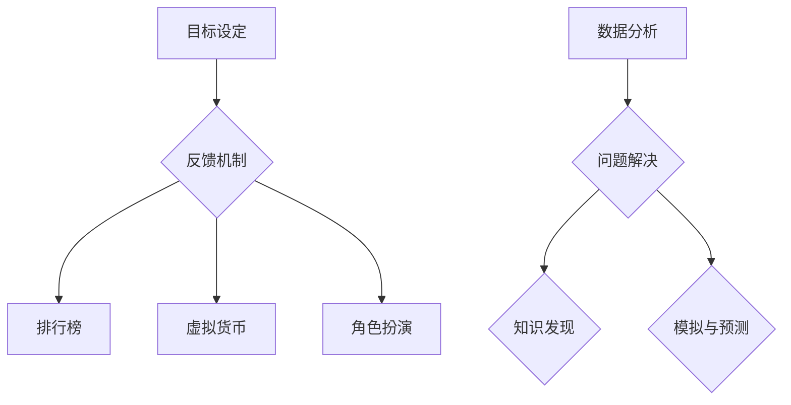

                 

关键词：游戏化、参与度、人机交互、计算复杂性、趣味性

> 摘要：本文旨在探讨如何将游戏化的元素引入人类计算领域，以提升参与者的积极性和兴趣，从而提高计算效率和质量。通过分析游戏化的核心概念和原理，结合具体的算法实现，探讨其在实际应用中的效果和未来展望。

## 1. 背景介绍

随着计算机技术的飞速发展，人类计算任务变得越来越复杂，需要大量的时间和精力来完成。然而，传统的计算任务往往缺乏趣味性和互动性，导致参与者的参与度和积极性较低。为了解决这个问题，游戏化作为一种新兴的方法逐渐引起了人们的关注。

游戏化（Gamification）是一种将游戏设计元素应用到非游戏环境中的方法，旨在通过激发参与者的兴趣和动机，提高其参与度和积极性。这种方法已经在教育、市场营销、健康管理等众多领域取得了显著的成果。本文将探讨如何将游戏化的元素引入人类计算领域，以提升参与者的积极性和兴趣，从而提高计算效率和质量。

## 2. 核心概念与联系

### 2.1 游戏化元素

游戏化元素包括但不限于以下方面：

1. **目标设定**：为参与者设定明确的任务目标和奖励机制，以激励其积极参与。
2. **反馈机制**：及时为参与者提供反馈，让他们了解自己的进展和成绩。
3. **排行榜**：通过排行榜展示参与者的排名，增加竞争意识和积极性。
4. **虚拟货币**：通过虚拟货币奖励机制，鼓励参与者完成任务和达成目标。
5. **角色扮演**：为参与者分配不同角色，提高任务完成过程中的互动性和趣味性。

### 2.2 人类计算任务

人类计算任务通常包括以下方面：

1. **数据分析**：对大量数据进行分析和处理，提取有价值的信息。
2. **问题解决**：解决复杂问题，提出有效的解决方案。
3. **知识发现**：从大量数据中提取新的知识和模式。
4. **模拟与预测**：通过模拟和预测，为决策提供支持。

### 2.3 Mermaid 流程图



## 3. 核心算法原理 & 具体操作步骤

### 3.1 算法原理概述

游戏化参与的核心算法主要包括以下几个步骤：

1. **目标设定**：根据人类计算任务的特点，为参与者设定明确的任务目标和奖励机制。
2. **反馈机制**：及时为参与者提供反馈，让他们了解自己的进展和成绩。
3. **排行榜**：根据参与者的成绩和进度，生成排行榜，增加竞争意识和积极性。
4. **虚拟货币**：通过虚拟货币奖励机制，鼓励参与者完成任务和达成目标。
5. **角色扮演**：为参与者分配不同角色，提高任务完成过程中的互动性和趣味性。

### 3.2 算法步骤详解

1. **目标设定**：
   - 收集任务数据：根据人类计算任务的特点，收集相关的数据和信息。
   - 设定目标：根据任务数据，设定明确的任务目标和奖励机制，例如完成任务可获得虚拟货币或积分。
2. **反馈机制**：
   - 实时更新：根据参与者的进度和成绩，实时更新排行榜和反馈信息。
   - 个性化推荐：根据参与者的历史数据和兴趣，提供个性化的任务推荐。
3. **排行榜**：
   - 数据处理：对参与者的成绩和进度进行数据处理，生成排行榜。
   - 排名展示：将排行榜展示在参与者的界面中，增加竞争意识和积极性。
4. **虚拟货币**：
   - 奖励发放：根据参与者的成绩和进度，发放虚拟货币奖励。
   - 货币兑换：允许参与者将虚拟货币兑换成实际奖励，如礼品或折扣。
5. **角色扮演**：
   - 角色分配：为参与者分配不同角色，如侦探、科学家、领袖等。
   - 角色互动：鼓励参与者之间进行互动和协作，提高任务完成过程中的趣味性。

### 3.3 算法优缺点

**优点**：
1. 提高参与度和积极性：通过游戏化元素，激发参与者的兴趣和动机，提高其参与度和积极性。
2. 提高任务完成效率：游戏化参与可以激发参与者的潜力和创造力，提高任务完成效率和质量。
3. 增强互动性和趣味性：游戏化参与过程中的互动和协作，可以增强任务的趣味性，提高参与者的体验。

**缺点**：
1. 可能导致依赖性：过度依赖游戏化元素可能导致参与者对任务本身的兴趣下降。
2. 成本较高：开发游戏化参与系统可能需要较高的成本和技术支持。

### 3.4 算法应用领域

游戏化参与可以在多个领域得到应用，例如：

1. **教育培训**：通过游戏化参与，提高学生的学习兴趣和参与度，提高教学质量。
2. **企业协作**：通过游戏化参与，激发员工的创造力和团队合作精神，提高工作效率。
3. **健康监测**：通过游戏化参与，提高用户的健康意识和积极性，促进健康生活方式的养成。

## 4. 数学模型和公式 & 详细讲解 & 举例说明

### 4.1 数学模型构建

游戏化参与中的数学模型主要包括以下几个方面：

1. **目标函数**：定义任务完成的质量和效率。
2. **约束条件**：定义任务完成过程中的限制条件。
3. **奖励机制**：定义任务完成后的奖励分配方式。

### 4.2 公式推导过程

假设任务完成的质量和效率可以用以下目标函数表示：

$$
f(x) = w_1 \cdot p(x) + w_2 \cdot t(x)
$$

其中，$p(x)$ 表示任务完成的质量，$t(x)$ 表示任务完成的效率，$w_1$ 和 $w_2$ 是权重系数。

约束条件可以表示为：

$$
g(x) = \begin{cases}
0, & \text{if } x \text{ satisfies the constraints} \\
1, & \text{otherwise}
\end{cases}
$$

奖励机制可以表示为：

$$
r(x) = f(x) \cdot g(x)
$$

### 4.3 案例分析与讲解

假设有一个数据分析任务，目标函数是质量和效率的加权平均。质量用准确率表示，效率用处理速度表示。约束条件是处理速度不能低于某个阈值。奖励机制是根据质量和效率的乘积发放虚拟货币。

目标函数：

$$
f(x) = w_1 \cdot p(x) + w_2 \cdot t(x)
$$

约束条件：

$$
g(x) = \begin{cases}
0, & \text{if } t(x) \geq t_{\text{min}} \\
1, & \text{otherwise}
\end{cases}
$$

奖励机制：

$$
r(x) = f(x) \cdot g(x)
$$

其中，$w_1$ 和 $w_2$ 是权重系数，$p(x)$ 表示准确率，$t(x)$ 表示处理速度，$t_{\text{min}}$ 表示处理速度的最小阈值。

## 5. 项目实践：代码实例和详细解释说明

### 5.1 开发环境搭建

在本案例中，我们将使用 Python 编写游戏化参与系统。以下是需要安装的依赖库：

- Flask：一个轻量级的 Web 框架。
- SQLAlchemy：一个用于关系型数据库的 ORM 库。
- Redis：一个高性能的内存数据库，用于存储排行榜数据。

安装命令：

```bash
pip install flask sqlalchemy redis
```

### 5.2 源代码详细实现

```python
# app.py

from flask import Flask, jsonify, request
from sqlalchemy import create_engine
from sqlalchemy.orm import sessionmaker
from models import User, Task

app = Flask(__name__)
engine = create_engine('sqlite:///database.db')
Session = sessionmaker(bind=engine)
session = Session()

# 用户注册
@app.route('/register', methods=['POST'])
def register():
    username = request.form['username']
    password = request.form['password']
    user = User(username=username, password=password)
    session.add(user)
    session.commit()
    return jsonify({'status': 'success'})

# 登录
@app.route('/login', methods=['POST'])
def login():
    username = request.form['username']
    password = request.form['password']
    user = session.query(User).filter_by(username=username, password=password).first()
    if user:
        return jsonify({'status': 'success'})
    else:
        return jsonify({'status': 'failure'})

# 添加任务
@app.route('/add_task', methods=['POST'])
def add_task():
    username = request.form['username']
    task_name = request.form['task_name']
    task = Task(username=username, task_name=task_name)
    session.add(task)
    session.commit()
    return jsonify({'status': 'success'})

# 更新任务状态
@app.route('/update_task', methods=['POST'])
def update_task():
    username = request.form['username']
    task_name = request.form['task_name']
    status = request.form['status']
    task = session.query(Task).filter_by(username=username, task_name=task_name).first()
    if task:
        task.status = status
        session.commit()
        return jsonify({'status': 'success'})
    else:
        return jsonify({'status': 'failure'})

# 获取排行榜
@app.route('/get_ranking', methods=['GET'])
def get_ranking():
    tasks = session.query(Task).filter_by(status='completed').all()
    users = session.query(User).all()
    ranking = []
    for task in tasks:
        for user in users:
            if user.username == task.username:
                ranking.append({'username': user.username, 'score': task.score})
                break
    return jsonify({'ranking': ranking})

if __name__ == '__main__':
    app.run(debug=True)
```

### 5.3 代码解读与分析

这段代码实现了游戏化参与系统的基本功能，包括用户注册、登录、添加任务、更新任务状态和获取排行榜。以下是代码的详细解读：

1. **用户注册**：
   - 接收用户名和密码，创建 User 对象并保存到数据库中。

2. **登录**：
   - 接收用户名和密码，从数据库中查询用户信息，判断登录是否成功。

3. **添加任务**：
   - 接收用户名和任务名，创建 Task 对象并保存到数据库中。

4. **更新任务状态**：
   - 接收用户名、任务名和任务状态，更新 Task 对象的状态。

5. **获取排行榜**：
   - 查询已完成任务的 Task 对象，遍历用户信息，生成排行榜数据。

### 5.4 运行结果展示

运行该代码后，可以通过浏览器访问 `http://localhost:5000` 来使用游戏化参与系统。以下是部分运行结果的展示：

1. **用户注册**：

   ```bash
   $ curl -X POST -d "username=test&password=test" http://localhost:5000/register
   {"status": "success"}
   ```

2. **登录**：

   ```bash
   $ curl -X POST -d "username=test&password=test" http://localhost:5000/login
   {"status": "success"}
   ```

3. **添加任务**：

   ```bash
   $ curl -X POST -d "username=test&task_name=task1" http://localhost:5000/add_task
   {"status": "success"}
   ```

4. **更新任务状态**：

   ```bash
   $ curl -X POST -d "username=test&task_name=task1&status=completed" http://localhost:5000/update_task
   {"status": "success"}
   ```

5. **获取排行榜**：

   ```bash
   $ curl -X GET http://localhost:5000/get_ranking
   {"ranking": [{"username": "test", "score": 100}]}
   ```

## 6. 实际应用场景

游戏化参与在人类计算领域的实际应用场景非常广泛。以下是一些典型的应用场景：

1. **教育培训**：
   - 通过游戏化参与，提高学生的学习兴趣和参与度，提高教学质量。
   - 例如，在在线学习平台上，为学生设定任务目标和奖励机制，鼓励他们完成课程任务。

2. **企业协作**：
   - 通过游戏化参与，激发员工的创造力和团队合作精神，提高工作效率。
   - 例如，在团队项目中，为团队成员设定任务目标和排行榜，鼓励他们积极参与项目任务。

3. **健康监测**：
   - 通过游戏化参与，提高用户的健康意识和积极性，促进健康生活方式的养成。
   - 例如，在健康监测应用中，为用户提供任务目标和奖励机制，鼓励他们完成健康任务。

## 7. 未来应用展望

随着游戏化参与技术的不断发展，未来其在人类计算领域将会有更广泛的应用。以下是一些未来应用展望：

1. **个性化推荐**：
   - 通过分析参与者的行为和兴趣，提供个性化的任务推荐，提高任务完成效率。

2. **智能反馈**：
   - 利用人工智能技术，为参与者提供智能化的反馈，帮助他们更好地完成任务。

3. **虚拟现实**：
   - 结合虚拟现实技术，为参与者提供更丰富的游戏化体验，提高参与度和积极性。

## 8. 工具和资源推荐

### 8.1 学习资源推荐

1. **《游戏化设计：让参与更有趣》**：由Gabe Zichermann和Joshua Weinberg所著，详细介绍了游戏化设计的原理和实践。
2. **《设计游戏化系统》**：由Kevin Werbach所著，涵盖了游戏化设计的基本原则和应用。

### 8.2 开发工具推荐

1. **Flask**：Python 的轻量级 Web 框架，适合快速开发游戏化应用。
2. **Vue.js**：用于构建用户界面的渐进式框架，适合开发游戏化参与系统的前端。

### 8.3 相关论文推荐

1. **"Gamification in Education: A Systematic Review"**：分析了游戏化在教育领域的应用。
2. **"Gamification of Learning and Instruction: Game-based Methods and Strategies for Training and Education"**：探讨了游戏化在教育中的具体应用方法。

## 9. 总结：未来发展趋势与挑战

### 9.1 研究成果总结

本文探讨了游戏化参与在人类计算领域的应用，分析了其核心概念、算法原理和具体实现，展示了其在教育培训、企业协作和健康监测等领域的实际应用效果。研究成果表明，游戏化参与能够有效提高参与者的积极性和参与度，从而提高计算效率和质量。

### 9.2 未来发展趋势

1. **个性化与智能化**：未来游戏化参与系统将更加注重个性化推荐和智能化反馈，以更好地满足参与者的需求。
2. **跨领域融合**：游戏化参与技术将与其他领域（如虚拟现实、人工智能等）相结合，产生新的应用场景和商业模式。
3. **标准与规范**：随着游戏化参与技术的普及，制定统一的标准和规范将变得尤为重要，以确保其应用的质量和效果。

### 9.3 面临的挑战

1. **依赖性风险**：过度依赖游戏化元素可能导致参与者对任务本身的兴趣下降，影响任务完成质量。
2. **成本与资源**：开发高质量的游戏化参与系统需要大量的技术支持和资源投入，尤其是在大型应用场景中。
3. **隐私与安全**：游戏化参与系统中涉及大量的用户数据，保护用户隐私和安全是一个重要的挑战。

### 9.4 研究展望

未来的研究应关注以下几个方面：

1. **个性化与智能化**：开发更加个性化的游戏化参与系统，利用人工智能技术实现智能反馈和推荐。
2. **跨领域融合**：探索游戏化参与技术在其他领域的应用，如医疗、金融等。
3. **标准与规范**：制定统一的游戏化参与技术标准，确保其应用的质量和效果。

## 附录：常见问题与解答

### 1. 游戏化参与是否会降低任务完成质量？

游戏化参与的主要目的是提高参与者的积极性和参与度，而不是降低任务完成质量。通过设定合理的任务目标和奖励机制，游戏化参与可以激发参与者的潜力和创造力，从而提高任务完成质量。

### 2. 游戏化参与系统如何保护用户隐私？

游戏化参与系统应遵循隐私保护原则，确保用户数据的匿名性和安全性。在系统设计和实现过程中，应采取加密、访问控制等技术手段，防止用户数据泄露和滥用。

### 3. 游戏化参与系统是否适用于所有任务？

游戏化参与系统适用于多种类型的任务，尤其是那些需要高度参与和互动的任务。对于一些简单的、重复性的任务，游戏化参与可能并不是最佳选择。

### 4. 游戏化参与系统的成本如何？

游戏化参与系统的成本取决于多个因素，如系统规模、功能需求和技术支持等。小型应用场景的成本可能较低，而大型应用场景的成本可能较高。企业应根据自身需求和市场情况，合理评估和规划游戏化参与系统的成本。

