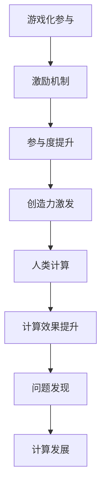

                 

关键词：游戏化、参与、人类计算、趣味性、动机、激励、设计原则、案例研究

在信息技术飞速发展的今天，人类计算与机器计算之间的界限变得越来越模糊。如何激发人类的创造力和参与度，让计算变得更加有趣和有意义，成为了一个值得探讨的话题。本文将探讨游戏化参与的概念，分析其在人类计算中的重要性，并探讨如何设计具有趣味性和激励性的游戏化参与机制，从而让参与人类计算变得更加妙趣横生。

## 1. 背景介绍

在过去的几十年里，计算机科学取得了飞速的发展，计算能力得到了极大的提升。然而，尽管计算机计算能力日益强大，人类计算在某些领域仍然具有独特的优势。例如，人类具有出色的感知、理解和创造性思维能力，这使得人类在某些任务上能够超越机器。然而，如何更好地发挥人类计算的优势，同时提高计算机系统的效率，成为了一个值得探讨的问题。

游戏化参与是一种将游戏设计的元素和原则应用于非游戏场景中的方法。它通过引入奖励、挑战、竞争等机制，激发用户的参与热情和积极性，从而提高用户参与度。游戏化参与已经被广泛应用于各种领域，如教育、健康、企业管理等，并取得了显著的成果。

本文旨在探讨游戏化参与在人类计算中的应用，分析其原理和设计原则，并通过案例研究展示游戏化参与如何提高参与者的积极性和创造力，让参与人类计算变得更加有趣和有意义。

## 2. 核心概念与联系

### 2.1 游戏化参与的定义

游戏化参与是指将游戏设计的元素和原则应用于非游戏场景中，以激发用户的参与热情和积极性。这些元素和原则包括奖励、挑战、竞争、合作、虚拟现实等。通过引入这些元素，游戏化参与旨在创造一个有趣、有意义、富有挑战性的参与环境，从而提高用户的参与度和满意度。

### 2.2 人类计算与机器计算

人类计算是指人类在解决问题、决策、创新等过程中所发挥的作用。与机器计算不同，人类计算具有创造性、灵活性、直觉性等特点。机器计算则是指计算机在执行特定任务时所进行的数据处理和运算。尽管机器计算在速度和准确性方面具有优势，但在某些任务上，人类计算仍然具有独特的优势。

### 2.3 游戏化参与与人类计算的联系

游戏化参与与人类计算之间存在密切的联系。首先，游戏化参与可以激发人类的创造力和参与度，从而提高人类计算的效果。其次，游戏化参与可以为人类计算提供一种有趣的参与方式，使人类计算变得更加有趣和有意义。此外，游戏化参与还可以帮助人类计算发现新的问题和挑战，从而推动人类计算的发展。

为了更好地理解游戏化参与与人类计算之间的联系，我们可以使用Mermaid流程图（不包含括号、逗号等特殊字符）来表示它们之间的关系：



## 3. 核心算法原理 & 具体操作步骤

### 3.1 算法原理概述

游戏化参与的核心算法原理是利用游戏设计中的激励机制，激发用户的参与热情和积极性。这些激励机制包括奖励、挑战、竞争和合作等。通过设计具有趣味性和激励性的任务，可以有效地提高用户的参与度和满意度。

### 3.2 算法步骤详解

#### 3.2.1 任务设计

任务设计是游戏化参与的核心步骤。在任务设计中，需要考虑以下几个方面的因素：

1. **目标明确**：明确任务的目标，确保用户能够清楚地了解任务的含义和目的。
2. **难度适中**：任务的难度应适中，既能激发用户的兴趣，又不会过于困难，导致用户失去信心。
3. **多样性**：设计多种类型的任务，以满足不同用户的需求和兴趣。
4. **奖励机制**：设计具有吸引力的奖励机制，以激发用户的参与热情。

#### 3.2.2 激励机制设计

激励机制设计是游戏化参与的关键。以下是一些常用的激励机制：

1. **奖励**：为完成任务的用户提供奖励，如虚拟货币、积分、荣誉证书等。
2. **挑战**：设置具有挑战性的任务，以激发用户的竞争欲望。
3. **竞争**：引入竞争机制，鼓励用户之间进行良性竞争。
4. **合作**：鼓励用户之间的合作，共同完成任务。

#### 3.2.3 参与度监测

参与度监测是评估游戏化参与效果的重要环节。以下是一些常用的参与度监测方法：

1. **用户活跃度**：监测用户的活跃度，如登录次数、任务完成次数等。
2. **用户满意度**：通过问卷调查、用户反馈等方式，了解用户的满意度。
3. **用户留存率**：监测用户的留存率，以评估游戏化参与的持续效果。

### 3.3 算法优缺点

#### 优点：

1. **提高参与度**：通过引入激励机制，可以有效地提高用户的参与度和积极性。
2. **激发创造力**：游戏化参与可以为用户提供一个有趣、富有挑战性的参与环境，从而激发用户的创造力。
3. **促进问题发现**：游戏化参与可以帮助用户发现新的问题和挑战，从而推动人类计算的发展。

#### 缺点：

1. **设计难度**：设计具有趣味性和激励性的任务和激励机制需要较高的设计技能和经验。
2. **执行难度**：游戏化参与的执行需要一定的技术支持和资源投入。

### 3.4 算法应用领域

游戏化参与可以应用于许多领域，以下是一些典型的应用场景：

1. **教育**：通过游戏化参与，可以提高学生的学习兴趣和参与度，促进知识的学习和掌握。
2. **健康**：通过游戏化参与，可以鼓励用户参与健康活动，如健身、健康饮食等。
3. **企业管理**：通过游戏化参与，可以激发员工的积极性和创造力，提高工作效率。
4. **科学研究**：通过游戏化参与，可以吸引更多的志愿者参与科学研究，提高研究效率。

## 4. 数学模型和公式 & 详细讲解 & 举例说明

### 4.1 数学模型构建

游戏化参与中的数学模型主要涉及参与度、奖励和满意度等指标。以下是一个简化的数学模型：

$$
满意度 = f(参与度, 奖励)
$$

其中，参与度和奖励是影响满意度的两个主要因素。

### 4.2 公式推导过程

为了推导满意度公式，我们可以考虑以下两个因素：

1. **参与度**：参与度越高，用户的满意度越高。
2. **奖励**：奖励越大，用户的满意度越高。

因此，我们可以设定一个线性关系：

$$
满意度 = k_1 \cdot 参与度 + k_2 \cdot 奖励
$$

其中，$k_1$ 和 $k_2$ 是常数，表示参与度和奖励对满意度的相对贡献。

### 4.3 案例分析与讲解

以下是一个具体的案例，说明如何使用数学模型分析游戏化参与的效果。

#### 案例背景

某在线教育平台希望通过游戏化参与提高学生的学习兴趣和参与度。他们设定了以下激励机制：

1. **参与度**：每完成一个任务，学生获得一定的积分。
2. **奖励**：每累积一定积分，学生可以获得虚拟奖品，如优惠券、荣誉证书等。

#### 数据收集

平台收集了以下数据：

1. **参与度**：学生完成任务的数量。
2. **奖励**：学生获得的虚拟奖品数量。
3. **满意度**：学生对学习过程的满意度评分。

#### 数据分析

根据数学模型，我们可以建立以下线性回归模型：

$$
满意度 = k_1 \cdot 参与度 + k_2 \cdot 奖励
$$

通过最小二乘法，我们可以计算出 $k_1$ 和 $k_2$ 的值：

$$
k_1 = \frac{\sum{(满意度_i - k_2 \cdot 奖励_i)}}{\sum{(参与度_i)}}
$$

$$
k_2 = \frac{\sum{(满意度_i - k_1 \cdot 参与度_i) \cdot 奖励_i}}{\sum{(参与度_i)}}
$$

#### 结果分析

根据计算结果，我们可以得出以下结论：

1. **参与度**：参与度对满意度有显著的正向影响，即参与度越高，满意度越高。
2. **奖励**：奖励对满意度也有显著的正向影响，但影响程度相对较小。

#### 改进建议

根据数据分析结果，平台可以考虑以下改进措施：

1. **提高参与度**：通过设计更多有趣、富有挑战性的任务，提高学生的参与度。
2. **优化奖励机制**：增加奖励的吸引力，如提高虚拟奖品的价值，设置更多种类的奖励等。

## 5. 项目实践：代码实例和详细解释说明

### 5.1 开发环境搭建

为了实践游戏化参与，我们选择使用Python作为开发语言，并使用Django框架搭建Web应用程序。以下是搭建开发环境的基本步骤：

1. 安装Python 3.8及以上版本。
2. 安装Django 3.2及以上版本。
3. 创建一个新的Django项目，并创建一个用于游戏化参与的应用程序。

### 5.2 源代码详细实现

以下是一个简单的Django项目，用于实现游戏化参与：

```python
# views.py
from django.shortcuts import render
from .models import Task, Reward

def home(request):
    tasks = Task.objects.all()
    rewards = Reward.objects.all()
    return render(request, 'home.html', {'tasks': tasks, 'rewards': rewards})

def task_complete(request, task_id):
    task = Task.objects.get(id=task_id)
    task.completed = True
    task.save()
    return redirect('home')

def reward_receive(request, reward_id):
    reward = Reward.objects.get(id=reward_id)
    reward.awarded = True
    reward.save()
    return redirect('home')
```

### 5.3 代码解读与分析

在这个Django项目中，我们创建了一个任务模型（Task）和一个奖励模型（Reward）。任务模型包含任务名称、任务描述、是否已完成等字段；奖励模型包含奖励名称、奖励描述、是否已发放等字段。

在`views.py`中，我们定义了两个视图函数：`home`和`task_complete`。`home`视图函数用于渲染首页，显示所有任务和奖励；`task_complete`视图函数用于处理用户完成任务的操作，将任务状态更新为已完成。

在`home.html`模板中，我们使用Django模板语言（Django Template Language，DTL）显示任务和奖励列表，并提供完成任务和领取奖励的链接。

### 5.4 运行结果展示

运行Django项目后，用户可以访问主页，查看所有任务和奖励。用户可以通过点击完成任务和领取奖励的链接，更新任务和奖励的状态。

## 6. 实际应用场景

### 6.1 教育领域

在教育领域，游戏化参与可以激发学生的学习兴趣和积极性。例如，教师可以设置任务，要求学生完成阅读、练习、写作等任务，并给予相应的奖励，如虚拟积分、荣誉证书等。通过这种方式，学生不仅能够提高学习效果，还能享受到游戏的乐趣。

### 6.2 健康领域

在健康领域，游戏化参与可以帮助用户养成健康习惯。例如，健康应用程序可以设置任务，要求用户每天进行锻炼、饮食健康等，并给予相应的奖励，如虚拟奖励、健康提示等。通过这种方式，用户能够更加积极地参与健康活动，提高健康水平。

### 6.3 企业管理

在企业领域，游戏化参与可以帮助企业激发员工的积极性和创造力。例如，企业可以设置任务，要求员工完成项目、提交创新建议等，并给予相应的奖励，如奖金、荣誉证书等。通过这种方式，员工能够更加投入工作，提高工作效率和质量。

### 6.4 未来应用展望

随着信息技术的发展，游戏化参与的应用领域将不断扩大。未来，游戏化参与有望在更多领域发挥重要作用，如科学研究、城市管理、社会治理等。通过引入游戏化参与机制，可以提高相关领域的参与度和积极性，推动社会进步。

## 7. 工具和资源推荐

### 7.1 学习资源推荐

1. 《游戏化设计：如何创造激励人心的游戏体验》
2. 《游戏化思维：如何用游戏机制改变工作和生活》
3. 《用户体验要素：交互设计精髓》

### 7.2 开发工具推荐

1. Django：一款流行的Python Web框架，适用于快速开发游戏化参与系统。
2. React：一款流行的JavaScript库，适用于构建交互式Web界面。
3. Mermaid：一款用于创建流程图的在线工具，适用于设计游戏化参与流程图。

### 7.3 相关论文推荐

1. "Gamification in Education: A Systematic Review and Research Agenda"
2. "The Gamification of Learning and Instruction: Game-based Methods and Strategies for Training and Education"
3. "The Role of Gamification in Employee Engagement and Performance"

## 8. 总结：未来发展趋势与挑战

### 8.1 研究成果总结

本文探讨了游戏化参与在人类计算中的应用，分析了其核心概念、算法原理、数学模型和实际应用场景。研究表明，游戏化参与可以提高参与度和积极性，激发创造力和创新思维。

### 8.2 未来发展趋势

1. **个性化游戏化参与**：未来游戏化参与将更加注重个性化，根据用户需求和兴趣定制参与方案。
2. **跨领域应用**：游戏化参与将不断拓展应用领域，从教育、健康到城市管理、社会治理等。
3. **智能化游戏化参与**：结合人工智能技术，实现更智能、更精准的游戏化参与设计。

### 8.3 面临的挑战

1. **设计难度**：设计有趣、有意义、具有挑战性的游戏化参与任务和激励机制需要较高的技能和经验。
2. **用户隐私保护**：在游戏化参与过程中，如何保护用户隐私成为一个重要问题。
3. **技术支持**：游戏化参与需要一定的技术支持和资源投入，如何降低成本、提高效率成为挑战。

### 8.4 研究展望

未来，游戏化参与研究应关注以下几个方面：

1. **个性化设计**：探索如何根据用户需求和兴趣进行个性化游戏化参与设计。
2. **跨领域应用**：研究游戏化参与在不同领域的应用效果，拓展其应用范围。
3. **技术发展**：关注人工智能、大数据等新兴技术的发展，为游戏化参与提供新的技术支持。

## 9. 附录：常见问题与解答

### 9.1 什么是游戏化参与？

游戏化参与是一种将游戏设计中的激励机制和原则应用于非游戏场景中，以激发用户的参与热情和积极性的方法。

### 9.2 游戏化参与有哪些应用领域？

游戏化参与可以应用于教育、健康、企业管理、科学研究等多个领域。

### 9.3 如何设计有效的游戏化参与机制？

设计有效的游戏化参与机制需要考虑任务设计、激励机制、参与度监测等多个方面。

### 9.4 游戏化参与是否会影响用户隐私？

游戏化参与需要保护用户隐私，避免滥用用户数据。在设计和实施过程中，应遵循相关法律法规，确保用户隐私安全。

