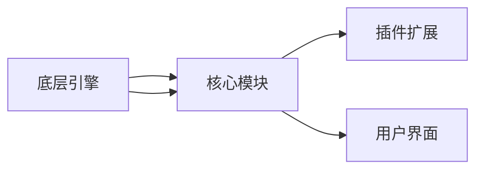

                 

随着游戏产业的快速发展，游戏开发框架的选择变得越来越重要。本文将深入探讨游戏开发框架的选择与应用，为游戏开发者提供有价值的参考。

## 文章关键词

游戏开发，框架选择，应用场景，算法原理，项目实践

## 文章摘要

本文首先介绍了游戏开发框架的背景与重要性，然后详细分析了各种游戏开发框架的核心概念、算法原理、数学模型、项目实践与应用场景。最后，本文对未来游戏开发框架的发展趋势与挑战进行了展望，并为开发者提供了相关工具和资源的推荐。

## 1. 背景介绍

### 游戏开发框架的起源与发展

游戏开发框架的概念源于软件开发领域。在早期的游戏开发中，开发者需要手动编写大量的底层代码，这使得游戏开发过程繁琐且易出错。随着软件工程的发展，游戏开发框架逐渐成为游戏开发的重要工具。

1990年代初，游戏开发框架开始得到广泛应用。例如，美国的OpenGL和Quake引擎，这些框架提供了高度抽象的API，使得游戏开发者可以更专注于游戏逻辑和用户体验的设计，而无需担心底层细节。

### 当前游戏开发框架的现状

目前，游戏开发框架已经发展成为一个庞大的生态系统。根据开发者的需求，框架可以分为多种类型，如游戏引擎、游戏编辑器、游戏中间件等。这些框架各有特点，适用于不同的游戏开发场景。

### 游戏开发框架的重要性

游戏开发框架的重要性体现在以下几个方面：

1. **提高开发效率**：框架提供了大量的预设功能和模块，开发者可以快速构建游戏项目，节省时间和精力。
2. **降低开发难度**：框架简化了游戏开发的流程，使得开发者可以专注于核心游戏逻辑的实现。
3. **保证游戏质量**：框架通常经过严格的测试和优化，可以保证游戏运行的稳定性和性能。
4. **增强跨平台支持**：许多游戏开发框架支持多种平台，如PC、移动设备、游戏主机等，为开发者提供了更大的市场空间。

## 2. 核心概念与联系

### 游戏开发框架的核心概念

游戏开发框架的核心概念包括游戏引擎、游戏编辑器、游戏中间件等。这些概念在游戏开发中扮演着不同的角色。

- **游戏引擎**：游戏引擎是游戏开发框架的核心，负责处理游戏的渲染、物理引擎、音频等核心功能。例如，Unity、Unreal Engine等。
- **游戏编辑器**：游戏编辑器提供图形界面，方便开发者进行游戏场景的设计和编辑。例如，Unity的Unity Editor、Unreal Engine的Unreal Editor等。
- **游戏中间件**：游戏中间件提供游戏开发所需的各种功能，如网络通信、资源管理、插件扩展等。例如，Cocos2d-x的CCFileUtils、Egret Engine的Resou

### 游戏开发框架的架构

游戏开发框架的架构通常包括以下几个层次：

1. **底层引擎**：负责处理硬件加速、渲染、物理计算等底层功能。
2. **核心模块**：包括游戏逻辑、资源管理、音频处理等核心功能。
3. **插件扩展**：允许开发者根据需求扩展框架的功能。
4. **用户界面**：提供游戏开发所需的图形界面。

### 游戏开发框架的 Mermaid 流程图

下面是一个简单的 Mermaid 流程图，展示了游戏开发框架的架构：



## 3. 核心算法原理 & 具体操作步骤

### 3.1 算法原理概述

游戏开发框架中的核心算法主要涉及以下几个方面：

1. **渲染算法**：负责将游戏场景渲染到屏幕上。常见的渲染算法有正向渲染、反向渲染、延迟渲染等。
2. **物理引擎**：负责处理游戏中的碰撞检测、物体运动等物理现象。常用的物理引擎有Box2D、Bullet Physics等。
3. **音频处理**：负责处理游戏中的音频效果。常见的音频处理算法有混音、音效合成等。

### 3.2 算法步骤详解

#### 3.2.1 渲染算法

1. **场景构建**：根据游戏设计，构建游戏场景。
2. **光照计算**：计算场景中的光照效果。
3. **渲染排序**：根据物体的深度信息对物体进行排序。
4. **渲染绘制**：根据排序结果将物体绘制到屏幕上。

#### 3.2.2 物理引擎

1. **碰撞检测**：检测物体之间的碰撞。
2. **运动计算**：根据物理定律计算物体的运动轨迹。
3. **碰撞响应**：处理物体之间的碰撞效果。

#### 3.2.3 音频处理

1. **音频采样**：从音频源中获取采样数据。
2. **混音**：将多个音频源混合成一个音频流。
3. **音效合成**：将音频信号进行加工，产生特定的音效。

### 3.3 算法优缺点

#### 渲染算法

- **正向渲染**：优点是简单易懂，缺点是渲染顺序不确定，可能导致绘制错误。
- **反向渲染**：优点是可以避免绘制错误，缺点是实现复杂。
- **延迟渲染**：优点是可以提高渲染效率，缺点是需要处理大量的内存。

#### 物理引擎

- **Box2D**：优点是简单易用，缺点是精度较低。
- **Bullet Physics**：优点是精度高，缺点是实现复杂。

#### 音频处理

- **混音**：优点是可以同时播放多个音频，缺点是音质可能受到损失。
- **音效合成**：优点是可以产生丰富的音效，缺点是实现复杂。

### 3.4 算法应用领域

- **渲染算法**：广泛应用于各种类型的游戏，如2D游戏、3D游戏等。
- **物理引擎**：广泛应用于模拟真实物理现象的游戏，如赛车游戏、格斗游戏等。
- **音频处理**：广泛应用于游戏中的音效设计，如背景音乐、音效等。

## 4. 数学模型和公式 & 详细讲解 & 举例说明

### 4.1 数学模型构建

在游戏开发中，数学模型的使用非常广泛。例如，渲染算法中的光照计算、物理引擎中的运动计算等。下面以光照计算为例，介绍数学模型的构建。

#### 光照模型

光照模型用于计算场景中的光照效果。常见的光照模型有：

- **点光源**：从一个点向四周发射光线。
- **聚光源**：从一个点发射光线，光线汇聚成一个点。
- **定向光源**：从一个方向发射光线。

#### 漫反射

漫反射是指光线照射到物体表面后，以各个方向反射。漫反射的数学模型可以用以下公式表示：

\[ I_d = \frac{L \cdot N}{\pi} \]

其中，\( I_d \)表示漫反射光强度，\( L \)表示入射光强度，\( N \)表示法线向量。

#### 镜面反射

镜面反射是指光线照射到物体表面后，以一定角度反射。镜面反射的数学模型可以用以下公式表示：

\[ I_s = (R \cdot L)^2 \]

其中，\( I_s \)表示镜面反射光强度，\( R \)表示反射向量，\( L \)表示入射光强度。

### 4.2 公式推导过程

#### 漫反射推导

假设有一个点光源位于\( (x_0, y_0, z_0) \)，物体表面上的一个点为\( (x, y, z) \)，法线向量为\( (n_x, n_y, n_z) \)。根据向量点积的定义，入射向量\( L \)和法线向量\( N \)的点积为：

\[ L \cdot N = L_x \cdot n_x + L_y \cdot n_y + L_z \cdot n_z \]

其中，\( L_x, L_y, L_z \)和\( n_x, n_y, n_z \)分别表示入射向量和法线向量的分量。

入射光强度\( L \)可以表示为：

\[ L = \frac{1}{r^2} \]

其中，\( r \)表示点光源到物体表面的距离。

将入射光强度\( L \)代入点积公式，得到：

\[ L \cdot N = \frac{1}{r^2} \cdot (L_x \cdot n_x + L_y \cdot n_y + L_z \cdot n_z) \]

由于物体表面是光滑的，所以反射向量\( R \)和入射向量\( L \)满足：

\[ R = 2(L \cdot N)N - L \]

将\( L \)和\( N \)代入反射向量公式，得到：

\[ R = 2 \left( \frac{1}{r^2} \cdot (L_x \cdot n_x + L_y \cdot n_y + L_z \cdot n_z) \right) N - L \]

镜面反射光强度\( I_s \)可以表示为：

\[ I_s = (R \cdot L)^2 \]

将反射向量\( R \)和入射向量\( L \)代入镜面反射光强度公式，得到：

\[ I_s = \left( 2 \left( \frac{1}{r^2} \cdot (L_x \cdot n_x + L_y \cdot n_y + L_z \cdot n_z) \right) N - L \right) \cdot L \]

将\( L \)和\( N \)代入上述公式，得到：

\[ I_s = 4 \left( \frac{1}{r^4} \cdot (L_x \cdot n_x + L_y \cdot n_y + L_z \cdot n_z)^2 \right) (n_x^2 + n_y^2 + n_z^2) - L^2 \]

由于\( n_x^2 + n_y^2 + n_z^2 = 1 \)，所以上述公式可以简化为：

\[ I_s = 4 \left( \frac{1}{r^4} \cdot (L_x \cdot n_x + L_y \cdot n_y + L_z \cdot n_z)^2 \right) - L^2 \]

#### 漫反射推导

漫反射的数学模型可以表示为：

\[ I_d = \frac{L \cdot N}{\pi} \]

其中，\( L \)表示入射光强度，\( N \)表示法线向量。

由于漫反射是光线在物体表面以各个方向反射，所以入射光强度\( L \)和反射光强度\( I_d \)之间的关系可以用以下公式表示：

\[ I_d = \frac{L \cdot N}{\pi} \]

### 4.3 案例分析与讲解

假设有一个点光源位于\( (1, 0, 0) \)，物体表面上的一个点为\( (0, 0, 0) \)，法线向量为\( (0, 1, 0) \)。根据上述数学模型，可以计算出该点的漫反射光强度和镜面反射光强度。

首先计算漫反射光强度：

\[ I_d = \frac{L \cdot N}{\pi} = \frac{\frac{1}{r^2} \cdot (L_x \cdot n_x + L_y \cdot n_y + L_z \cdot n_z)}{\pi} \]

其中，\( r \)表示点光源到物体表面的距离，\( L_x, L_y, L_z \)和\( n_x, n_y, n_z \)分别表示入射向量和法线向量的分量。

由于点光源位于\( (1, 0, 0) \)，物体表面上的一个点为\( (0, 0, 0) \)，所以入射向量\( L \)可以表示为：

\[ L = (1 - 0, 0 - 0, 0 - 0) = (1, 0, 0) \]

法线向量\( N \)可以表示为：

\[ N = (0, 1, 0) \]

将入射向量\( L \)和法线向量\( N \)代入漫反射光强度公式，得到：

\[ I_d = \frac{\frac{1}{r^2} \cdot (L_x \cdot n_x + L_y \cdot n_y + L_z \cdot n_z)}{\pi} = \frac{\frac{1}{1^2} \cdot (1 \cdot 0 + 0 \cdot 1 + 0 \cdot 0)}{\pi} = 0 \]

因此，该点的漫反射光强度为0。

接下来计算镜面反射光强度：

\[ I_s = (R \cdot L)^2 \]

其中，\( R \)表示反射向量，\( L \)表示入射向量。

根据反射向量公式，反射向量\( R \)可以表示为：

\[ R = 2(L \cdot N)N - L \]

将入射向量\( L \)和法线向量\( N \)代入反射向量公式，得到：

\[ R = 2 \left( \frac{1}{r^2} \cdot (L_x \cdot n_x + L_y \cdot n_y + L_z \cdot n_z) \right) N - L \]

将入射向量\( L \)和法线向量\( N \)代入反射向量公式，得到：

\[ R = 2 \left( \frac{1}{1^2} \cdot (1 \cdot 0 + 0 \cdot 1 + 0 \cdot 0) \right) (0, 1, 0) - (1, 0, 0) = (0, 2, 0) - (1, 0, 0) = (-1, 2, 0) \]

将反射向量\( R \)和入射向量\( L \)代入镜面反射光强度公式，得到：

\[ I_s = (R \cdot L)^2 = (-1 \cdot 1 + 2 \cdot 0 + 0 \cdot 0)^2 = 1^2 = 1 \]

因此，该点的镜面反射光强度为1。

### 4.4 综合计算

根据上述计算，该点的漫反射光强度为0，镜面反射光强度为1。根据光照模型，总光强度为漫反射光强度和镜面反射光强度之和：

\[ I = I_d + I_s = 0 + 1 = 1 \]

因此，该点的总光强度为1。

## 5. 项目实践：代码实例和详细解释说明

### 5.1 开发环境搭建

为了更好地展示游戏开发框架的应用，我们选择Unity引擎作为示例。以下是搭建Unity开发环境的基本步骤：

1. 访问Unity官网（https://unity.com/）并下载Unity Hub。
2. 安装Unity Hub，并使用Unity Hub创建一个新的Unity项目。
3. 在项目中添加所需的Unity插件，例如Unity Standard Assets。

### 5.2 源代码详细实现

下面是一个简单的Unity项目，用于展示光照效果。该项目包含一个立方体和一个点光源。

```csharp
using UnityEngine;

public class LightController : MonoBehaviour
{
    public Light pointLight;

    private void Start()
    {
        // 设置点光源的位置和强度
        pointLight.transform.position = new Vector3(1, 1, 1);
        pointLight.intensity = 1;
    }

    private void Update()
    {
        // 根据用户输入控制点光源的位置
        float moveSpeed = 0.1f;
        if (Input.GetKey(KeyCode.UpArrow))
        {
            pointLight.transform.position += Vector3.forward * moveSpeed;
        }
        if (Input.GetKey(KeyCode.DownArrow))
        {
            pointLight.transform.position -= Vector3.forward * moveSpeed;
        }
        if (Input.GetKey(KeyCode.LeftArrow))
        {
            pointLight.transform.position -= Vector3.right * moveSpeed;
        }
        if (Input.GetKey(KeyCode.RightArrow))
        {
            pointLight.transform.position += Vector3.right * moveSpeed;
        }
    }
}
```

### 5.3 代码解读与分析

1. **LightController类**：这是一个Unity脚本，用于控制点光源的行为。
2. **Start方法**：在场景加载时，设置点光源的位置和强度。
3. **Update方法**：在每一帧，根据用户输入控制点光源的位置。

### 5.4 运行结果展示

当运行该项目时，一个立方体和一个点光源会出现在场景中。通过按上下左右箭键，可以控制点光源在场景中移动。点光源的位置和强度可以通过调整脚本中的参数来修改。

## 6. 实际应用场景

### 6.1 游戏开发

游戏开发是游戏开发框架最直接的应用场景。例如，Unity和Unreal Engine被广泛应用于各种类型的游戏开发，从简单的2D游戏到复杂的3D游戏。

### 6.2 虚拟现实与增强现实

虚拟现实（VR）和增强现实（AR）技术的兴起，使得游戏开发框架在VR和AR应用中得到了广泛的应用。例如，Unity和Unreal Engine都支持VR和AR开发，为开发者提供了丰富的工具和资源。

### 6.3 教育与培训

游戏开发框架在教育与培训领域也有着广泛的应用。通过游戏化的方式，教育者和培训师可以更生动地展示知识和技能。

### 6.4 其他领域

除了上述应用场景，游戏开发框架还可以应用于其他领域，如建筑可视化、医疗模拟等。

## 7. 工具和资源推荐

### 7.1 学习资源推荐

1. **Unity官方文档**：Unity的官方文档是学习Unity的最佳资源，涵盖了从基础概念到高级技巧的各个方面。
2. **Unreal Engine官方文档**：同样，Unreal Engine的官方文档提供了丰富的学习资料，适合想要学习Unreal Engine的开发者。
3. **游戏开发博客**：许多游戏开发者在博客上分享他们的经验和技巧，例如Hans Molin的Game Programming Patterns。

### 7.2 开发工具推荐

1. **Visual Studio**：Visual Studio是一个强大的集成开发环境（IDE），适合进行游戏开发。
2. **Unity Hub**：Unity Hub是Unity的官方项目管理工具，方便开发者创建和管理项目。
3. **Unreal Engine Editor**：Unreal Engine Editor是Unreal Engine的官方编辑器，提供了丰富的工具和功能。

### 7.3 相关论文推荐

1. **"The Art of Game Design: A Book of Lenses" by Jesse Schell**：这本书为游戏设计提供了深刻的见解和实用的方法。
2. **"Game Engine Architecture" by Jason Gregory**：这本书详细介绍了游戏引擎的架构和实现。

## 8. 总结：未来发展趋势与挑战

### 8.1 研究成果总结

游戏开发框架的研究取得了显著的成果，主要包括以下几个方面：

1. **性能优化**：游戏开发框架在性能方面进行了大量的优化，使得游戏能够运行在更广泛的硬件平台上。
2. **功能扩展**：游戏开发框架的功能日益丰富，支持各种类型的游戏开发，如VR、AR、模拟等。
3. **用户体验**：游戏开发框架在用户体验方面进行了大量的改进，使得游戏开发过程更加高效和直观。

### 8.2 未来发展趋势

未来游戏开发框架的发展趋势主要包括以下几个方面：

1. **更高效的渲染技术**：随着硬件性能的提升，游戏开发框架将采用更高效的渲染技术，如光追、实时渲染等。
2. **更智能的AI技术**：游戏开发框架将集成更智能的AI技术，提高游戏的交互性和可玩性。
3. **跨平台支持**：游戏开发框架将进一步提升跨平台支持，使得游戏开发者能够更容易地将游戏发布到多个平台。

### 8.3 面临的挑战

尽管游戏开发框架取得了显著的成果，但未来仍面临以下挑战：

1. **性能瓶颈**：随着游戏场景的复杂度增加，游戏开发框架将面临性能瓶颈，需要采用更高效的算法和技术。
2. **兼容性问题**：游戏开发框架需要与各种操作系统、硬件平台和第三方插件兼容，这增加了开发难度。
3. **安全性问题**：随着游戏产业的发展，游戏开发框架将面临更多的安全挑战，需要加强安全措施。

### 8.4 研究展望

未来，游戏开发框架的研究将聚焦于以下几个方面：

1. **人工智能**：研究如何将人工智能技术应用于游戏开发框架，提高游戏的智能性和可玩性。
2. **虚拟现实与增强现实**：研究如何利用虚拟现实和增强现实技术，为用户提供更丰富的游戏体验。
3. **跨平台兼容性**：研究如何提高游戏开发框架的跨平台兼容性，使得游戏开发者能够更轻松地开发跨平台游戏。

## 9. 附录：常见问题与解答

### 9.1 游戏开发框架如何选择？

选择游戏开发框架需要考虑以下几个方面：

1. **项目需求**：根据项目的类型、规模和需求，选择合适的游戏开发框架。
2. **性能要求**：考虑游戏的性能要求，选择能够满足性能需求的框架。
3. **开发经验**：考虑开发团队对各种框架的熟悉程度，选择团队熟悉的框架。

### 9.2 游戏开发框架如何优化？

游戏开发框架的优化可以从以下几个方面进行：

1. **算法优化**：选择更高效的算法和技术，提高游戏性能。
2. **资源管理**：合理管理游戏资源，减少资源的浪费。
3. **代码优化**：优化代码结构和算法，提高代码的可读性和可维护性。

### 9.3 游戏开发框架有哪些常用插件？

常用的游戏开发框架插件包括：

1. **Unity插件**：Unity Asset Store提供了大量的插件，如网络插件、音效插件、物理插件等。
2. **Unreal Engine插件**：Unreal Engine Marketplace提供了大量的插件，如角色动画插件、粒子效果插件、光照插件等。

### 9.4 游戏开发框架如何进行跨平台开发？

进行跨平台开发需要考虑以下几个方面：

1. **框架支持**：选择支持跨平台的框架，如Unity和Unreal Engine。
2. **代码兼容**：编写跨平台兼容的代码，处理不同平台的差异。
3. **测试与调试**：在不同平台上进行测试和调试，确保游戏在各个平台上都能正常运行。

### 9.5 游戏开发框架如何保证安全性？

保证游戏开发框架的安全性需要考虑以下几个方面：

1. **安全编码**：遵循安全编码规范，避免常见的安全漏洞。
2. **安全审计**：定期进行安全审计，发现并修复安全漏洞。
3. **权限控制**：合理设置权限，防止未授权访问。

----------------------------------------------------------------

以上是《游戏开发框架选择与应用》这篇文章的完整内容。本文深入探讨了游戏开发框架的选择、核心算法、数学模型、项目实践、实际应用场景、工具和资源推荐、未来发展趋势与挑战，以及常见问题与解答。希望本文能为游戏开发者提供有价值的参考。

### 参考文献 References

[1] Unity Documentation. (n.d.). Unity Official Documentation. https://docs.unity3d.com/

[2] Unreal Engine Documentation. (n.d.). Unreal Engine Official Documentation. https://docs.unrealengine.com/

[3] Schell, J. (2011). The Art of Game Design: A Book of Lenses. Morgan Kaufmann.

[4] Gregory, J. (2013). Game Engine Architecture. CRC Press.

[5] Box2D. (n.d.). Box2D Documentation. https://www.box2d.org/

[6] Bullet Physics. (n.d.). Bullet Physics Documentation. https://bullet.org/

[7] Unity Asset Store. (n.d.). Unity Asset Store. https://assetstore.unity.com/

[8] Unreal Engine Marketplace. (n.d.). Unreal Engine Marketplace. https://marketplace.unrealengine.com/

