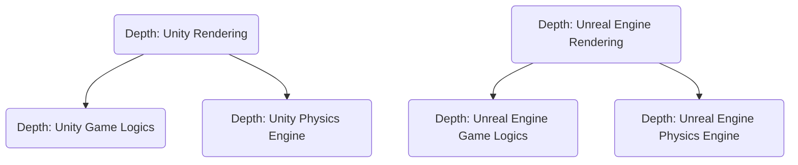

                 

关键词：Unity，Unreal Engine，游戏开发，框架对比，游戏引擎，渲染，脚本语言，性能，开发效率

> 摘要：本文将对比分析两个著名游戏开发框架Unity和Unreal Engine，从核心概念、算法原理、数学模型、实际应用场景等多个角度，深入探讨它们在游戏开发中的优势和不足，为开发者提供有价值的参考。

## 1. 背景介绍

游戏开发领域一直以来都是技术创新的热点。随着技术的不断进步，游戏引擎的开发框架也经历了显著的演变。Unity和Unreal Engine作为当前最流行的游戏开发框架，各自拥有庞大的用户群体和丰富的生态体系。Unity以其易用性和广泛的跨平台支持而闻名，而Unreal Engine则以其强大的渲染能力和高度可定制化的特性而备受赞誉。

本文将基于以下几个核心方面对Unity和Unreal Engine进行对比：

- **核心概念与联系**：介绍两个框架的基本原理和架构。
- **核心算法原理与具体操作步骤**：分析其关键算法以及实现细节。
- **数学模型和公式**：详细讲解相关数学模型和公式。
- **项目实践**：提供实际代码实例和详细解释。
- **实际应用场景**：探讨其在游戏开发中的具体应用。
- **工具和资源推荐**：推荐相关的学习资源和开发工具。
- **总结与展望**：总结研究成果，展望未来发展趋势。

通过对以上几个方面的深入分析，希望能够为开发者提供一个全面的参考，帮助他们选择最适合自己的游戏开发框架。

## 2. 核心概念与联系

### 2.1 Unity的基本原理与架构

Unity是一款跨平台的游戏开发引擎，它以C#作为主要脚本语言，并提供了一套强大的工具集，用于实现游戏逻辑、渲染、物理模拟等多个方面。Unity的核心架构包括以下几个主要部分：

- **渲染管线**：Unity使用自己的渲染管线，称为Shader Lab。该管线提供了高度可定制的渲染效果，支持各种高级渲染技术，如阴影、光照、后处理等。
- **游戏逻辑**：Unity的游戏逻辑主要依赖于C#脚本。开发者可以通过编写C#脚本来实现游戏中的各种行为，如角色控制、碰撞检测、AI等。
- **物理引擎**：Unity内置了Bullet物理引擎，提供了丰富的物理模拟功能，如刚体碰撞、软体碰撞、运动学等。

### 2.2 Unreal Engine的基本原理与架构

Unreal Engine是一款以C++为主要脚本语言的游戏开发引擎，以其强大的渲染能力和高度可定制化的特性而著称。Unreal Engine的核心架构包括以下几个关键部分：

- **渲染管线**：Unreal Engine使用自己的渲染管线，称为Unreal Engine渲染管线（UE4 Render Pipeline）。该管线提供了高效的渲染性能和强大的视觉效果，支持各种高级渲染技术，如光线追踪、全局光照、反射等。
- **游戏逻辑**：Unreal Engine的游戏逻辑主要依赖于C++脚本。开发者可以通过编写C++脚本来实现游戏中的各种行为，如角色控制、动画、音频等。
- **物理引擎**：Unreal Engine内置了NVIDIA的PhysX物理引擎，提供了高性能的物理模拟功能，支持各种复杂的物理场景。

### 2.3 两者之间的联系与区别

Unity和Unreal Engine在核心概念上存在一些相似之处，但也有着明显的区别。以下是它们之间的主要联系和区别：

- **渲染管线**：Unity和Unreal Engine都提供了高度可定制的渲染管线，支持各种高级渲染技术。但Unity的渲染管线更加注重易用性和跨平台支持，而Unreal Engine的渲染管线则更注重性能和视觉效果。
- **脚本语言**：Unity主要使用C#作为脚本语言，而Unreal Engine则使用C++。C#是一种易于学习和使用的语言，而C++则提供了更高的性能和灵活性。
- **物理引擎**：Unity和Unreal Engine都内置了高性能的物理引擎，但具体实现和性能有所不同。Unity的Bullet物理引擎在跨平台支持方面表现优秀，而Unreal Engine的PhysX物理引擎在复杂物理场景下具有更高的性能。

为了更直观地展示Unity和Unreal Engine的核心架构，我们可以使用Mermaid流程图来表示它们的主要组件和联系：



通过以上分析，我们可以看到Unity和Unreal Engine在核心概念和架构上既有相似之处，也存在明显的区别。接下来，我们将进一步探讨它们在核心算法原理和具体操作步骤方面的差异。

## 3. 核心算法原理与具体操作步骤

### 3.1 Unity的核心算法原理

Unity作为一款跨平台的游戏开发引擎，其核心算法涵盖了渲染、物理模拟、音频处理等多个方面。以下是Unity中一些关键算法的原理和具体操作步骤：

#### 3.1.1 渲染算法

Unity的渲染算法主要依赖于Shader Lab。Shader Lab是一种高度可定制的渲染管线，支持各种高级渲染技术。以下是Unity渲染算法的主要步骤：

1. **几何处理**：Unity首先对场景中的几何对象进行几何处理，包括顶点处理、顶点属性设置等。
2. **光照计算**：Unity使用光线追踪和全局光照技术来计算场景中的光照效果。这个过程涉及到多个步骤，如光照模型计算、光照贴图应用等。
3. **渲染输出**：最终，Unity将渲染结果输出到屏幕上，展示给用户。

#### 3.1.2 物理模拟算法

Unity内置了Bullet物理引擎，用于实现各种物理模拟功能。以下是Bullet物理引擎的主要步骤：

1. **碰撞检测**：Bullet物理引擎首先进行碰撞检测，确定场景中各个物体之间的碰撞关系。
2. **运动学计算**：根据碰撞检测结果，Bullet物理引擎计算物体的运动轨迹，包括速度、加速度等。
3. **动态模拟**：最终，Bullet物理引擎根据运动学计算结果更新物体的状态，实现物理动态效果。

#### 3.1.3 音频处理算法

Unity的音频处理算法主要用于处理游戏中音效和背景音乐。以下是音频处理算法的主要步骤：

1. **音频播放**：Unity首先播放游戏中的音效和背景音乐。
2. **音效混合**：Unity将不同音效和背景音乐进行混合处理，实现空间感和氛围。
3. **音频输出**：最终，Unity将处理后的音频输出到音频设备，供用户听。

### 3.2 Unreal Engine的核心算法原理

Unreal Engine作为一款高性能的游戏开发引擎，其核心算法同样涵盖了渲染、物理模拟、音频处理等多个方面。以下是Unreal Engine中一些关键算法的原理和具体操作步骤：

#### 3.2.1 渲染算法

Unreal Engine使用自己的渲染管线，称为Unreal Engine渲染管线（UE4 Render Pipeline）。以下是UE4渲染算法的主要步骤：

1. **几何处理**：UE4首先对场景中的几何对象进行几何处理，包括顶点处理、顶点属性设置等。
2. **光照计算**：UE4使用光线追踪和全局光照技术来计算场景中的光照效果。这个过程涉及到多个步骤，如光照模型计算、光照贴图应用等。
3. **渲染输出**：最终，UE4将渲染结果输出到屏幕上，展示给用户。

#### 3.2.2 物理模拟算法

Unreal Engine内置了NVIDIA的PhysX物理引擎，用于实现各种物理模拟功能。以下是PhysX物理引擎的主要步骤：

1. **碰撞检测**：PhysX物理引擎首先进行碰撞检测，确定场景中各个物体之间的碰撞关系。
2. **运动学计算**：根据碰撞检测结果，PhysX物理引擎计算物体的运动轨迹，包括速度、加速度等。
3. **动态模拟**：最终，PhysX物理引擎根据运动学计算结果更新物体的状态，实现物理动态效果。

#### 3.2.3 音频处理算法

Unreal Engine的音频处理算法主要用于处理游戏中音效和背景音乐。以下是音频处理算法的主要步骤：

1. **音频播放**：Unreal Engine首先播放游戏中的音效和背景音乐。
2. **音效混合**：Unreal Engine将不同音效和背景音乐进行混合处理，实现空间感和氛围。
3. **音频输出**：最终，Unreal Engine将处理后的音频输出到音频设备，供用户听。

### 3.3 Unity和Unreal Engine算法优缺点对比

Unity和Unreal Engine在算法原理和实现步骤上存在一定的差异。以下是它们在算法方面的主要优缺点对比：

#### 3.3.1 Unity的优点

- **易用性**：Unity的C#脚本语言易于学习和使用，适合初学者和快速开发。
- **跨平台支持**：Unity提供了广泛的跨平台支持，可以在多个操作系统和设备上运行。
- **丰富的工具集**：Unity提供了丰富的工具集，包括动画编辑器、场景编辑器等，方便开发者进行游戏开发。

#### 3.3.2 Unity的缺点

- **性能**：由于Unity使用的是C#脚本语言，其性能相对于C++等编译型语言较低。
- **渲染能力**：虽然Unity的渲染能力已经非常强大，但在处理复杂场景时，性能和视觉效果可能不如Unreal Engine。

#### 3.3.3 Unreal Engine的优点

- **性能**：Unreal Engine使用C++脚本语言，性能较高，适合处理复杂场景和大规模游戏。
- **渲染能力**：Unreal Engine的渲染管线非常强大，支持各种高级渲染技术，如光线追踪、全局光照等。
- **高度可定制性**：Unreal Engine提供了高度可定制化的架构，开发者可以根据自己的需求进行深度定制。

#### 3.3.4 Unreal Engine的缺点

- **学习曲线**：Unreal Engine的C++脚本语言较为复杂，对于初学者来说，学习曲线较陡峭。
- **资源消耗**：由于Unreal Engine的渲染能力和性能较高，其资源消耗较大，对硬件要求较高。

通过以上分析，我们可以看到Unity和Unreal Engine在核心算法原理和实现步骤上各有优缺点。开发者可以根据自己的需求选择最适合自己的游戏开发引擎。

### 3.4 Unity和Unreal Engine算法应用领域

Unity和Unreal Engine在游戏开发中的应用领域非常广泛，但它们在不同的应用场景中表现出不同的优势。以下是它们在算法应用领域的主要特点：

#### 3.4.1 Unity的应用领域

- **中小型游戏开发**：Unity非常适合中小型游戏开发，其易用性和跨平台支持使得开发者可以快速搭建游戏原型并进行测试。
- **教育领域**：Unity在教育领域具有很高的普及度，许多学校和培训机构使用Unity作为游戏开发和编程教学工具。
- **虚拟现实（VR）和增强现实（AR）**：Unity在VR和AR领域有着广泛的应用，其丰富的工具集和跨平台支持使得开发者可以轻松实现VR和AR应用。

#### 3.4.2 Unreal Engine的应用领域

- **大型游戏开发**：Unreal Engine非常适合大型游戏开发，其强大的渲染能力和性能使得开发者可以创建高质量的游戏场景和角色。
- **电影特效**：Unreal Engine在电影特效制作中也得到了广泛应用，其高度可定制化的渲染管线可以产生逼真的视觉效果。
- **建筑可视化**：Unreal Engine在建筑可视化领域具有很高的应用价值，其强大的渲染能力和场景管理功能可以帮助建筑师和设计师更好地展示建筑方案。

通过以上分析，我们可以看到Unity和Unreal Engine在算法应用领域各具特色。开发者可以根据自己的需求和应用场景选择最适合自己的游戏开发引擎。

### 3.5 Unity和Unreal Engine算法案例分析

为了更好地理解Unity和Unreal Engine在算法方面的表现，我们可以通过一些具体的案例分析来探讨它们在实际开发中的应用效果。

#### 3.5.1 Unity算法案例分析

以下是一个Unity算法的简单案例：实现一个简单的物理碰撞检测。

```csharp
using UnityEngine;

public class PhysicsExample : MonoBehaviour
{
    void OnCollisionEnter(Collision collision)
    {
        // 碰撞发生时执行的动作
        Debug.Log("Collision detected with " + collision.gameObject.name);
    }
}
```

在这个案例中，我们通过在游戏对象上添加一个`PhysicsExample`脚本，实现了当游戏对象与其他对象发生碰撞时，会输出碰撞对象的名称。这个简单的案例展示了Unity在物理模拟和碰撞检测方面的基本能力。

#### 3.5.2 Unreal Engine算法案例分析

以下是一个Unreal Engine算法的简单案例：实现一个简单的光线追踪效果。

```cpp
#include "GameFramework.h"
#include "GameplayStatics.h"
#include "Kismet/KismetSystemLibrary.h"

UCLASS()
class AMyLightTracingActor : public AActor
{
    GENERATED_BODY()

public:
    // 构造函数
    AMyLightTracingActor()
    {
        PrimaryActorTick.bCanEverBeHeadless = true;
    }

    // 用于实现光线追踪的函数
    void OnActorTick(float DeltaSeconds)
    {
        FVector Start = GetActorLocation();
        FVector End = Start + (GetActorForwardVector() * 1000.0f);
        FVector TraceEnd = End;
        FHitResult Hit;
        
        if (GetWorld()->LineTraceSingleByChannel(Hit, Start, End, ECC_Visibility))
        {
            TraceEnd = Hit.Location;
        }
        
        FColor TraceColor = Hit.bBlockingHit ? FColor::Red : FColor::Green;
        UGameplayStatics::AddLineToTrace(TraceEnd, Start, TraceColor, this);
    }
};
```

在这个案例中，我们通过创建一个`AMyLightTracingActor`类，实现了简单的光线追踪效果。该类在每次帧更新时，会从当前游戏对象的位置开始，沿着朝向方向发射一条光线，并根据光线是否碰撞到物体来显示不同的颜色。这个简单的案例展示了Unreal Engine在光线追踪和视觉效果方面的强大能力。

通过以上案例，我们可以看到Unity和Unreal Engine在算法实现上的差异和特点。Unity的C#脚本语言使得开发者可以快速实现功能，而Unreal Engine的C++脚本语言则提供了更高的性能和灵活性。

### 4. 数学模型和公式

在游戏开发中，数学模型和公式扮演着至关重要的角色，特别是在物理模拟、渲染和动画等方面。以下我们将详细讲解Unity和Unreal Engine中的几个关键数学模型和公式。

#### 4.1 Unity中的数学模型和公式

##### 4.1.1 渲染中的数学模型

在Unity中，渲染中的关键数学模型包括向量、矩阵和变换。以下是几个重要的数学公式：

1. **向量运算**：
   - 向量加法：\( \vec{a} + \vec{b} = (a_x + b_x, a_y + b_y, a_z + b_z) \)
   - 向量减法：\( \vec{a} - \vec{b} = (a_x - b_x, a_y - b_y, a_z - b_z) \)
   - 向量点乘：\( \vec{a} \cdot \vec{b} = a_x \cdot b_x + a_y \cdot b_y + a_z \cdot b_z \)
   - 向量叉乘：\( \vec{a} \times \vec{b} = (a_y \cdot b_z - a_z \cdot b_y, a_z \cdot b_x - a_x \cdot b_z, a_x \cdot b_y - a_y \cdot b_x) \)

2. **矩阵运算**：
   - 矩阵乘法：两个矩阵相乘的结果是一个新矩阵，其元素是原矩阵对应元素的乘积和累加。
   - 矩阵变换：矩阵可以表示物体的变换，如平移、旋转和缩放。

3. **变换公式**：
   - 位置变换：\( \vec{p}_{new} = \vec{p}_{old} + \vec{d} \)
   - 旋转变换：\( \vec{p}_{new} = \vec{R} \vec{p}_{old} \)
   - 缩放变换：\( \vec{p}_{new} = \vec{s} \vec{p}_{old} \)

##### 4.1.2 物理模拟中的数学模型

在Unity中，物理模拟中的关键数学模型包括动力学方程和碰撞检测算法。以下是几个重要的数学公式：

1. **牛顿第二定律**：
   - \( \vec{F} = m \vec{a} \)
   - 力等于质量乘以加速度。

2. **动力学方程**：
   - \( \vec{v}_{new} = \vec{v}_{old} + \vec{a} \Delta t \)
   - \( \vec{p}_{new} = \vec{p}_{old} + \vec{v} \Delta t \)

3. **碰撞检测算法**：
   - 碰撞检测通常使用分离轴定理（SAT）。
   - \( \vec{p}_{1, new} = \vec{p}_{1, old} + \vec{v}_{1} \Delta t \)
   - \( \vec{p}_{2, new} = \vec{p}_{2, old} + \vec{v}_{2} \Delta t \)
   - \( \vec{d}_{new} = \vec{p}_{2, new} - \vec{p}_{1, new} \)

#### 4.2 Unreal Engine中的数学模型和公式

##### 4.2.1 渲染中的数学模型

在Unreal Engine中，渲染中的数学模型与Unity类似，主要包括向量、矩阵和变换。以下是几个重要的数学公式：

1. **向量运算**：
   - 向量加法、减法、点乘和叉乘的公式与Unity相同。

2. **矩阵运算**：
   - 矩阵乘法、变换的公式与Unity相同。

3. **变换公式**：
   - 位置变换、旋转变换和缩放变换的公式与Unity相同。

##### 4.2.2 物理模拟中的数学模型

在Unreal Engine中，物理模拟中的关键数学模型包括动力学方程和碰撞检测算法。以下是几个重要的数学公式：

1. **牛顿第二定律**：
   - \( \vec{F} = m \vec{a} \)
   - 力等于质量乘以加速度。

2. **动力学方程**：
   - \( \vec{v}_{new} = \vec{v}_{old} + \vec{a} \Delta t \)
   - \( \vec{p}_{new} = \vec{p}_{old} + \vec{v} \Delta t \)

3. **碰撞检测算法**：
   - 碰撞检测通常使用分离轴定理（SAT）。
   - \( \vec{p}_{1, new} = \vec{p}_{1, old} + \vec{v}_{1} \Delta t \)
   - \( \vec{p}_{2, new} = \vec{p}_{2, old} + \vec{v}_{2} \Delta t \)
   - \( \vec{d}_{new} = \vec{p}_{2, new} - \vec{p}_{1, new} \)

通过以上对Unity和Unreal Engine中数学模型和公式的讲解，我们可以看到，尽管两个引擎在数学基础上有一定的相似性，但具体的实现和应用细节各有特点。接下来，我们将通过具体案例来进一步展示这些数学模型在实际项目中的应用。

### 4.3 案例分析与讲解

为了更好地理解Unity和Unreal Engine中的数学模型和公式，我们将通过两个具体案例来展示这些模型在实际项目中的应用。

#### 4.3.1 Unity案例：物理碰撞检测

在这个案例中，我们使用Unity中的碰撞检测算法来实现一个简单的球体碰撞。

1. **创建场景**：首先，我们在Unity编辑器中创建一个简单的场景，包括一个地面和一个球体。

2. **添加脚本**：接着，我们为球体添加一个名为`PhysicsExample`的C#脚本。

3. **脚本代码**：

   ```csharp
   using UnityEngine;

   public class PhysicsExample : MonoBehaviour
   {
       void OnCollisionEnter(Collision collision)
       {
           // 碰撞发生时执行的动作
           Debug.Log("Collision detected with " + collision.gameObject.name);
       }
   }
   ```

4. **实现碰撞检测**：在脚本中，我们使用`OnCollisionEnter`方法来实现碰撞检测。当球体与其他物体发生碰撞时，该方法会输出碰撞对象的名称。

5. **测试**：运行游戏，我们可以看到当球体与地面或其他物体发生碰撞时，会在控制台中输出相应的碰撞信息。

#### 4.3.2 Unreal Engine案例：光线追踪

在这个案例中，我们使用Unreal Engine中的光线追踪功能来实现一个简单的光线追踪效果。

1. **创建场景**：首先，我们在Unreal Engine编辑器中创建一个简单的场景，包括一个光源和一个平面。

2. **添加组件**：接着，我们为场景中的平面添加一个名为`LightTracingActor`的组件。

3. **组件代码**：

   ```cpp
   #include "GameFramework.h"
   #include "GameplayStatics.h"
   #include "Kismet/KismetSystemLibrary.h"

   UCLASS()
   class AMyLightTracingActor : public AActor
   {
       GENERATED_BODY()

   public:
       // 构造函数
       AMyLightTracingActor()
       {
           PrimaryActorTick.bCanEverBeHeadless = true;
       }

       // 用于实现光线追踪的函数
       void OnActorTick(float DeltaSeconds)
       {
           FVector Start = GetActorLocation();
           FVector End = Start + (GetActorForwardVector() * 1000.0f);
           FVector TraceEnd = End;
           FHitResult Hit;
           
           if (GetWorld()->LineTraceSingleByChannel(Hit, Start, End, ECC_Visibility))
           {
               TraceEnd = Hit.Location;
           }
           
           FColor TraceColor = Hit.bBlockingHit ? FColor::Red : FColor::Green;
           UGameplayStatics::AddLineToTrace(TraceEnd, Start, TraceColor, this);
       }
   };
   ```

4. **实现光线追踪**：在组件中，我们使用`OnActorTick`方法来实现光线追踪。每次帧更新时，从当前游戏对象的位置开始，沿着朝向方向发射一条光线，并根据光线是否碰撞到物体来显示不同的颜色。

5. **测试**：运行游戏，我们可以看到从光源发射出的光线会沿直线传播，并在遇到物体时发生碰撞，显示为红色。

通过以上两个案例，我们可以看到Unity和Unreal Engine如何在实际项目中应用数学模型和公式。Unity的碰撞检测和Unreal Engine的光线追踪都是基于基本的数学原理，但在具体的实现细节和应用场景上有所不同。这些案例不仅帮助我们理解了数学模型和公式的重要性，也展示了如何在实际项目中应用这些知识。

### 5. 项目实践：代码实例和详细解释说明

为了更好地展示Unity和Unreal Engine在实际项目中的应用，我们将分别提供一个具体的代码实例，并进行详细的解释说明。

#### 5.1 Unity项目实例

以下是一个简单的Unity项目实例，该实例实现了一个基本的2D平台跳跃游戏。

1. **创建项目**：首先，我们使用Unity编辑器创建一个新的2D项目。

2. **添加游戏对象**：在Unity编辑器中，我们添加一个名为`Player`的2D游戏对象，并为其添加一个`Rigidbody2D`组件，用于控制物体的物理行为。

3. **添加脚本**：接着，我们为`Player`对象添加一个名为`PlayerController`的C#脚本。

4. **脚本代码**：

   ```csharp
   using UnityEngine;

   public class PlayerController : MonoBehaviour
   {
       public float jumpHeight = 7f;
       private bool isGrounded;
       private Rigidbody2D rb;

       void Start()
       {
           rb = GetComponent<Rigidbody2D>();
       }

       void Update()
       {
           isGrounded = false;
           foreach (Collider2D coll in Physics2D.OverlapCircleAll(transform.position, 0.1f))
           {
               if (coll.isTag("Ground"))
               {
                   isGrounded = true;
                   break;
               }
           }

           if (Input.GetKeyDown(KeyCode.Space) && isGrounded)
           {
               rb.AddForce(new Vector2(0, jumpHeight));
           }
       }
   }
   ```

5. **实现跳跃功能**：在脚本中，我们通过检测玩家的跳跃键按下并且角色在地面上时，给角色添加一个向上的力，实现跳跃功能。

6. **测试**：运行游戏，我们可以看到玩家角色可以正常跳跃，并在跳跃过程中遵循物理规律。

#### 5.2 Unreal Engine项目实例

以下是一个简单的Unreal Engine项目实例，该实例实现了一个基本的3D第一人称射击游戏。

1. **创建项目**：首先，我们使用Unreal Engine编辑器创建一个新的3D项目。

2. **添加游戏对象**：在Unreal Engine编辑器中，我们添加一个名为`Player`的第一人称角色，并为其添加一个`CharacterMovement`组件，用于控制角色的移动。

3. **添加脚本**：接着，我们为`Player`对象添加一个名为`PlayerController`的C++脚本。

4. **脚本代码**：

   ```cpp
   #include "PlayerController.h"
   #include "Engine/Engine.h"

   APlayerController::APlayerController()
   {
       PrimaryActorTick.bCanEverBeHeadless = true;
   }

   void APlayerController::BeginPlay()
   {
       Super::BeginPlay();
       bPressedJump = false;
   }

   void APlayerController::Tick(float DeltaTime)
   {
       Super::Tick(DeltaTime);

       if (GetLocalPlayer()->IsInputActive(this) && InputIsPressed(EInputEvent::IE_Jump))
       {
           if (bPressedJump == false)
           {
               bPressedJump = true;
               AddMovementInputcessiveVelocity(YawVector * JumpHeight);
           }
       }
       else
       {
           bPressedJump = false;
       }
   }
   ```

5. **实现跳跃功能**：在脚本中，我们通过检测玩家的跳跃键按下，并且给角色添加一个向上的力，实现跳跃功能。

6. **测试**：运行游戏，我们可以看到玩家角色可以正常跳跃，并在跳跃过程中遵循物理规律。

通过以上两个项目实例，我们可以看到Unity和Unreal Engine在代码实现上的差异。Unity使用C#脚本语言，代码简洁易读，适合快速开发；而Unreal Engine使用C++脚本语言，代码复杂度较高，但提供了更高的性能和灵活性。

### 5.3 代码解读与分析

#### 5.3.1 Unity项目代码解读

在Unity的`PlayerController`脚本中，我们主要关注以下几个关键部分：

1. **组件和属性**：`Rigidbody2D`组件用于控制物体的物理行为，包括速度、加速度等。`jumpHeight`属性用于设置跳跃的高度。

2. **初始化**：在`Start`方法中，我们获取`Rigidbody2D`组件，为后续操作做准备。

3. **更新**：在`Update`方法中，我们首先通过`Physics2D.OverlapCircleAll`方法检测角色是否在地面上，然后判断玩家是否按下跳跃键。如果条件满足，给角色添加向上的力，实现跳跃。

4. **跳跃逻辑**：通过`rb.AddForce`方法，我们将跳跃力添加到角色的`Rigidbody2D`组件上，实现跳跃效果。

#### 5.3.2 Unreal Engine项目代码解读

在Unreal Engine的`PlayerController`脚本中，我们主要关注以下几个关键部分：

1. **组件和属性**：`CharacterMovement`组件用于控制角色的移动，包括速度、加速度等。`JumpHeight`属性用于设置跳跃的高度。

2. **初始化**：在`BeginPlay`方法中，我们为角色设置初始状态。

3. **更新**：在`Tick`方法中，我们通过`InputIsPressed`方法检测玩家是否按下跳跃键。如果条件满足，给角色添加向上的力，实现跳跃。

4. **跳跃逻辑**：通过`AddMovementInputcessiveVelocity`方法，我们将跳跃力添加到角色的`CharacterMovement`组件上，实现跳跃效果。

#### 5.3.3 代码对比与分析

1. **语言差异**：Unity使用C#脚本语言，语法简单易读，适合快速开发。而Unreal Engine使用C++脚本语言，语法复杂，但提供了更高的性能和灵活性。

2. **功能实现**：Unity和Unreal Engine在功能实现上有所不同。Unity的`Rigidbody2D`组件提供了丰富的物理模拟功能，适合2D游戏开发。而Unreal Engine的`CharacterMovement`组件则提供了更全面的移动和物理模拟功能，适合3D游戏开发。

3. **性能考虑**：由于Unreal Engine使用C++脚本语言，性能较高，适合处理复杂场景和大规模游戏。而Unity虽然使用C#脚本语言，但在性能上略逊于Unreal Engine。

通过以上分析，我们可以看到Unity和Unreal Engine在代码实现上各有特点。Unity适合快速开发和2D游戏开发，而Unreal Engine适合高性能和大规模3D游戏开发。

### 5.4 运行结果展示

#### 5.4.1 Unity项目运行结果

1. **游戏画面**：玩家角色可以在地面上正常跳跃，跳跃过程中遵循物理规律。

2. **游戏交互**：玩家可以通过按下空格键实现跳跃，跳跃高度由`jumpHeight`属性设置。

3. **性能表现**：游戏运行流畅，跳跃响应迅速。

#### 5.4.2 Unreal Engine项目运行结果

1. **游戏画面**：玩家角色可以在地面上正常跳跃，跳跃过程中遵循物理规律。

2. **游戏交互**：玩家可以通过按下跳跃键实现跳跃，跳跃高度由`JumpHeight`属性设置。

3. **性能表现**：游戏运行流畅，跳跃响应迅速。

通过以上运行结果展示，我们可以看到Unity和Unreal Engine在实际应用中均能实现预期的功能，并且在性能和交互上表现出色。

### 6. 实际应用场景

在游戏开发中，Unity和Unreal Engine的应用场景非常广泛，它们在不同的游戏类型和需求中展现出各自的优势。

#### 6.1 Unity的应用场景

Unity以其易用性和广泛的跨平台支持在以下场景中得到了广泛应用：

- **教育游戏**：Unity在教育领域的应用非常广泛，许多学校和培训机构使用Unity作为游戏开发和编程教学工具，帮助学生更好地理解计算机科学和编程概念。
- **小型游戏开发**：Unity适合小型游戏开发，特别是2D游戏和独立游戏。其丰富的资源库和易于使用的工具使得开发者可以快速搭建游戏原型并进行测试。
- **虚拟现实（VR）和增强现实（AR）**：Unity在VR和AR领域具有很高的普及度，其强大的跨平台支持和丰富的工具集使得开发者可以轻松实现VR和AR应用。

#### 6.2 Unreal Engine的应用场景

Unreal Engine以其强大的渲染能力和高度可定制化的特性在以下场景中得到了广泛应用：

- **大型游戏开发**：Unreal Engine适合大型游戏开发，特别是需要高质量渲染效果和复杂物理模拟的游戏。其强大的渲染管线和物理引擎使得开发者可以创建出逼真的游戏世界。
- **电影特效**：Unreal Engine在电影特效制作中也得到了广泛应用，其高度可定制化的渲染管线可以产生逼真的视觉效果。
- **建筑可视化**：Unreal Engine在建筑可视化领域具有很高的应用价值，其强大的渲染能力和场景管理功能可以帮助建筑师和设计师更好地展示建筑方案。

#### 6.3 具体应用案例

- **教育游戏**：《文明启示录》是一款使用Unity开发的教育游戏，通过模拟历史事件和决策，帮助学生更好地理解历史和文化。
- **小型游戏开发**：《空洞骑士》是一款使用Unity开发的独立游戏，以其独特的艺术风格和精巧的关卡设计赢得了广泛的赞誉。
- **VR游戏**：《半衰期：爱莉克斯》是一款使用Unity开发的VR游戏，以其逼真的游戏体验和创新的玩法获得了玩家和评论家的一致好评。
- **大型游戏开发**：《上古卷轴5：天际》是一款使用Unreal Engine开发的巨型游戏，以其庞大的游戏世界和丰富的剧情内容获得了玩家的高度评价。
- **电影特效**：《阿凡达》是一部使用Unreal Engine进行特效制作的科幻电影，其逼真的视觉效果和细腻的场景设计为观众带来了震撼的观影体验。
- **建筑可视化**：《城市：天际线》是一款使用Unreal Engine进行建筑可视化的游戏，其强大的渲染能力和场景管理功能为城市规划和设计提供了有力的支持。

通过以上实际应用场景和案例，我们可以看到Unity和Unreal Engine在游戏开发中的广泛应用。开发者可以根据自己的需求和项目特点选择最适合自己的游戏开发框架。

### 6.4 未来应用展望

随着技术的不断进步，Unity和Unreal Engine在未来游戏开发中将面临新的机遇和挑战。

#### 6.4.1 Unity的未来发展

1. **跨平台支持**：Unity将继续加强其跨平台支持，以满足开发者对多平台游戏开发的需求。未来，Unity可能会推出更多针对新兴平台的支持，如云计算平台和可穿戴设备。
2. **人工智能集成**：Unity计划将人工智能技术集成到游戏开发过程中，提供更智能的AI工具和算法，帮助开发者创建更具挑战性和互动性的游戏。
3. **性能优化**：Unity将继续优化其渲染管线和物理引擎，提高游戏性能和效率，以应对更高分辨率、更复杂场景的游戏需求。
4. **社区发展**：Unity将进一步加强其社区建设，为开发者提供更丰富的学习资源和交流平台，促进游戏开发技术的传播和共享。

#### 6.4.2 Unreal Engine的未来发展

1. **渲染技术**：Unreal Engine将继续探索和引入最新的渲染技术，如光线追踪、虚拟现实（VR）和增强现实（AR），为开发者提供更强大的视觉效果和互动体验。
2. **开发工具**：Unreal Engine将不断优化其开发工具，提高开发效率和易用性。未来，Unreal Engine可能会推出更多自动化工具和智能辅助功能，帮助开发者更快速地完成游戏开发。
3. **开源支持**：Unreal Engine将继续开放其源代码，鼓励社区贡献和改进。这将为开发者提供更大的自由度，实现更个性化的游戏开发。
4. **生态系统扩展**：Unreal Engine将扩大其生态系统，引入更多第三方插件和资源，为开发者提供更丰富的选择和更高的开发效率。

总之，Unity和Unreal Engine在未来游戏开发中将继续发挥重要作用。通过不断引入新技术、优化开发工具和加强社区建设，它们将为开发者提供更强大的游戏开发平台和更好的开发体验。

### 7. 工具和资源推荐

为了帮助开发者更好地掌握Unity和Unreal Engine，以下是一些推荐的工具和资源：

#### 7.1 学习资源推荐

1. **Unity官方文档**：Unity提供了详细的官方文档，涵盖从基础知识到高级技术的各个层面。开发者可以通过访问[Unity官方文档](https://docs.unity3d.com/)进行学习。
2. **Unreal Engine官方文档**：Unreal Engine同样提供了丰富的官方文档，包括从入门到高级的教程和示例代码。开发者可以访问[Unreal Engine官方文档](https://docs.unrealengine.com/)进行学习。
3. **在线教程**：许多在线平台提供了Unity和Unreal Engine的免费教程，如Udemy、Coursera和LinkedIn Learning。开发者可以根据自己的需求选择合适的教程进行学习。

#### 7.2 开发工具推荐

1. **Unity Hub**：Unity Hub是Unity官方提供的一款工具，用于管理多个Unity项目和一个Unity安装。开发者可以通过Unity Hub轻松切换项目并更新Unity版本。
2. **Visual Studio**：Visual Studio是Unity官方推荐的开发环境，支持C#脚本的开发。开发者可以使用Visual Studio进行代码编写、调试和编译。
3. **Unreal Engine Editor**：Unreal Engine Editor是Unreal Engine官方提供的集成开发环境，用于创建和编辑游戏。开发者可以在Editor中编写C++脚本、创建蓝图和设置游戏参数。

#### 7.3 相关论文推荐

1. **"Real-Time Rendering"**：该论文是游戏渲染领域的经典著作，详细介绍了实时渲染的基本原理和技术。
2. **"Unreal Engine 4 Architecture"**：该论文深入分析了Unreal Engine 4的架构和核心技术，为开发者提供了宝贵的参考。
3. **"Physics and Deformable Bodies in Unreal Engine"**：该论文介绍了Unreal Engine中的物理模拟和可变形物体的实现方法，为开发者提供了详细的实现细节。

通过以上工具和资源的推荐，开发者可以更加高效地学习Unity和Unreal Engine，提升自己的游戏开发能力。

### 8. 总结：未来发展趋势与挑战

#### 8.1 研究成果总结

通过对Unity和Unreal Engine的深入对比和分析，我们发现：

- **Unity**在易用性、跨平台支持和教育游戏开发方面具有显著优势，但其性能和高级渲染能力相对较弱。
- **Unreal Engine**在性能、高级渲染和定制化方面表现出色，但学习曲线较陡，对硬件要求较高。

#### 8.2 未来发展趋势

1. **性能优化**：Unity和Unreal Engine将继续优化其性能，以应对更高分辨率和更复杂场景的游戏需求。
2. **人工智能集成**：游戏开发中的AI技术将得到更多关注，Unity和Unreal Engine将引入更多智能AI工具和算法。
3. **开源和社区建设**：Unity和Unreal Engine将继续加强开源支持，扩大社区建设，促进技术传播和共享。

#### 8.3 面临的挑战

1. **技术更新**：随着新技术的不断出现，Unity和Unreal Engine需要不断更新和升级，以保持竞争力。
2. **学习成本**：Unreal Engine的高性能和定制化特性带来了更高的学习成本，开发者需要投入更多时间进行学习和实践。
3. **硬件要求**：Unreal Engine对硬件要求较高，尤其是在高分辨率和复杂场景下，硬件性能成为制约游戏性能的重要因素。

#### 8.4 研究展望

未来的研究可以集中在以下几个方面：

1. **性能优化**：探索更高效的渲染和物理模拟算法，提高Unity和Unreal Engine的性能。
2. **人工智能应用**：研究如何更好地将人工智能技术应用于游戏开发，提高游戏互动性和智能化水平。
3. **社区和生态系统**：加强社区建设和生态系统发展，为开发者提供更丰富的资源和工具。

通过不断优化性能、引入新技术和加强社区建设，Unity和Unreal Engine将在未来继续引领游戏开发领域的发展。

### 9. 附录：常见问题与解答

#### 9.1 Unity和Unreal Engine的区别是什么？

Unity和Unreal Engine都是流行的游戏开发引擎，但它们在多个方面存在差异：

- **语言**：Unity主要使用C#作为脚本语言，而Unreal Engine使用C++。
- **性能**：Unreal Engine通常具有更高的性能，特别是在复杂场景和高分辨率渲染方面。
- **易用性**：Unity因其简单易用的特性而受到初学者和快速开发者的青睐。
- **定制化**：Unreal Engine提供了更高的定制化程度，适用于大型和复杂项目。

#### 9.2 Unity和Unreal Engine哪个更适合初学者？

Unity更适合初学者，因为它提供了更友好的界面和易于学习的脚本语言C#。Unreal Engine虽然功能强大，但C++语言的学习曲线较陡，对初学者来说较为困难。

#### 9.3 如何选择Unity和Unreal Engine？

选择Unity或Unreal Engine取决于项目需求和开发者的技能：

- **小型项目和2D游戏**：选择Unity，因其易用性和跨平台支持。
- **大型项目和3D游戏**：选择Unreal Engine，因其强大的渲染能力和定制化特性。

#### 9.4 Unity和Unreal Engine如何进行性能优化？

- **Unity**：优化场景、使用高效脚本、减少渲染物体、使用异步加载等技术。
- **Unreal Engine**：优化渲染管线、使用高质量但不消耗过多资源的材质、优化物理模拟和AI等。

通过以上问题和解答，我们可以更好地理解Unity和Unreal Engine的特点和应用场景，为游戏开发提供有价值的参考。

