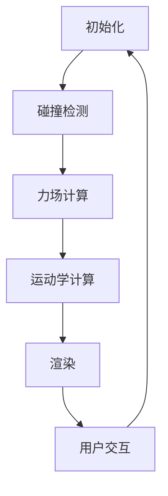

                 

关键词：游戏物理引擎、真实世界模拟、物理仿真、碰撞检测、力场计算、运动学、动力学、渲染、多体系统、计算效率、优化算法

> 摘要：本文旨在深入探讨游戏物理引擎的工作原理及其在真实世界模拟中的应用。通过详细分析核心算法、数学模型和实际项目实践，我们将揭示游戏物理引擎在虚拟环境中的强大功能，为开发者提供丰富的技术见解和实用指南。

## 1. 背景介绍

游戏物理引擎是游戏开发中不可或缺的核心技术之一。它负责模拟现实世界中的物理现象，如碰撞、摩擦、重力等，使虚拟世界中的物体和角色具有真实感。随着游戏技术的不断发展，物理引擎的重要性愈发凸显，它不仅提升了游戏的真实性，还拓展了游戏的可玩性和互动性。

真实世界模拟是游戏物理引擎的重要应用领域。通过精确的物理仿真，开发者可以创建高度逼真的虚拟环境，使玩家沉浸在游戏世界中。这不仅提高了玩家的游戏体验，还为科学研究和教育等领域提供了重要的技术支持。

本文将围绕游戏物理引擎的核心概念、算法原理、数学模型、项目实践以及未来发展趋势等方面进行深入探讨，旨在为开发者提供全面的技术指导和思考。

## 2. 核心概念与联系

### 2.1. 物理引擎的基本概念

物理引擎是用于模拟和计算物理现象的软件模块。它主要包括以下核心组件：

- **碰撞检测（Collision Detection）**：检测物体之间的接触和碰撞，判断碰撞发生的时刻和位置。
- **力场计算（Force Field Calculation）**：根据物体间的相互作用力，计算物体的加速度和运动轨迹。
- **运动学（Kinematics）**：研究物体的运动规律，描述物体的位置、速度和加速度等。
- **动力学（Dynamics）**：研究物体在力场作用下的运动变化，包括受力分析和运动方程的求解。

### 2.2. 物理引擎的工作原理

物理引擎通过以下步骤实现真实世界模拟：

1. **初始化**：设置物理场景的初始状态，包括物体位置、速度、质量等。
2. **碰撞检测**：遍历场景中的物体，检测碰撞事件。
3. **力场计算**：根据碰撞事件和物体间的相互作用力，计算物体的加速度。
4. **运动学计算**：更新物体的位置、速度和加速度，实现物体的运动。
5. **渲染**：将物理场景渲染到屏幕上，展示真实世界的视觉效果。

### 2.3. 物理引擎架构的 Mermaid 流程图

以下是一个简化的物理引擎架构 Mermaid 流程图：



在上述流程中，用户交互可以影响物理场景的状态，进而触发新一轮的物理计算和渲染。该流程不断循环，实现了实时交互的虚拟环境。

## 3. 核心算法原理 & 具体操作步骤

### 3.1. 算法原理概述

游戏物理引擎的核心算法包括碰撞检测、力场计算和运动学计算。这些算法共同作用，实现了虚拟环境中的物理仿真。

- **碰撞检测**：常用的碰撞检测算法有分离轴定理（SAT）、AABB（ Axis-Aligned Bounding Boxes）和OBB（Oriented Bounding Boxes）等。碰撞检测的目的是快速判断物体是否接触或碰撞，并确定碰撞位置。
- **力场计算**：力场计算基于牛顿第二定律 \( F = ma \)，计算物体在受力作用下的加速度。力场计算需要考虑物体间的相互作用力，如重力、摩擦力、弹簧力等。
- **运动学计算**：运动学计算根据物体的初始状态和加速度，更新物体的位置、速度和加速度。常用的运动学计算方法有欧拉法（Euler Integration）和龙格-库塔法（Runge-Kutta Integration）等。

### 3.2. 算法步骤详解

以下是游戏物理引擎的具体操作步骤：

1. **初始化场景**：设置场景的初始状态，包括物体位置、速度、质量等。
2. **碰撞检测**：遍历场景中的物体，使用碰撞检测算法判断物体是否接触或碰撞。
3. **力场计算**：根据物体间的相互作用力，计算物体的加速度。
4. **运动学计算**：根据物体的初始状态和加速度，更新物体的位置、速度和加速度。
5. **渲染**：将物理场景渲染到屏幕上，展示真实世界的视觉效果。
6. **用户交互**：处理用户输入，更新物理场景的状态。
7. **重复步骤2-6**：实现实时交互的虚拟环境。

### 3.3. 算法优缺点

- **碰撞检测算法**：
  - **优点**：快速判断物体是否接触或碰撞，降低计算复杂度。
  - **缺点**：对于复杂形状的物体，碰撞检测效果可能不理想。
- **力场计算算法**：
  - **优点**：准确计算物体在受力作用下的加速度，提高物理仿真的真实感。
  - **缺点**：计算复杂度较高，对计算资源要求较大。
- **运动学计算算法**：
  - **优点**：简单易实现，适用于实时交互的虚拟环境。
  - **缺点**：计算精度较低，对于高精度物理仿真效果较差。

### 3.4. 算法应用领域

游戏物理引擎广泛应用于以下领域：

- **游戏开发**：模拟物体间的碰撞、摩擦和重力等现象，提高游戏的真实性。
- **科学计算**：模拟物理现象，如流体动力学、结构力学等，为科学研究提供支持。
- **教育培训**：利用虚拟环境模拟真实世界，提高教学效果。
- **虚拟现实**：通过精确的物理仿真，增强虚拟现实体验。

## 4. 数学模型和公式 & 详细讲解 & 举例说明

### 4.1. 数学模型构建

物理引擎的数学模型主要包括以下内容：

- **位置、速度和加速度**：描述物体的运动状态。
- **力、动量和能量**：描述物体间的相互作用。
- **碰撞和反弹**：计算物体碰撞后的运动状态。

### 4.2. 公式推导过程

以下是物理引擎中常用的数学公式：

1. **牛顿第二定律**：

   \[ F = ma \]

   其中，\( F \) 是作用力，\( m \) 是物体质量，\( a \) 是加速度。

2. **运动学公式**：

   \[ v = u + at \]
   
   \[ s = ut + \frac{1}{2}at^2 \]

   其中，\( v \) 是末速度，\( u \) 是初速度，\( a \) 是加速度，\( t \) 是时间，\( s \) 是位移。

3. **碰撞公式**：

   \[ v_1' = \frac{(m_1 - m_2) v_1 + 2m_2 v_2}{m_1 + m_2} \]
   
   \[ v_2' = \frac{(m_2 - m_1) v_2 + 2m_1 v_1}{m_1 + m_2} \]

   其中，\( v_1 \) 和 \( v_2 \) 是碰撞前两物体的速度，\( v_1' \) 和 \( v_2' \) 是碰撞后两物体的速度。

### 4.3. 案例分析与讲解

以下是一个简单的物理引擎案例：

假设有两个质量分别为 \( m_1 = 5 \) kg 和 \( m_2 = 3 \) kg 的物体，初速度分别为 \( v_1 = 10 \) m/s 和 \( v_2 = 5 \) m/s，它们在水平方向上相向而行，碰撞后反弹。

根据碰撞公式，我们可以计算出碰撞后两个物体的速度：

\[ v_1' = \frac{(5 - 3) \times 10 + 2 \times 3 \times 5}{5 + 3} = \frac{20 + 30}{8} = 6.25 \text{ m/s} \]
\[ v_2' = \frac{(3 - 5) \times 5 + 2 \times 5 \times 10}{5 + 3} = \frac{-10 + 100}{8} = 11.25 \text{ m/s} \]

假设碰撞后的时间为 \( t = 2 \) s，我们可以计算出碰撞后的位移：

\[ s_1 = 6.25 \times 2 = 12.5 \text{ m} \]
\[ s_2 = 11.25 \times 2 = 22.5 \text{ m} \]

因此，碰撞后两个物体的位置分别为：

\[ (x_1, y_1) = (12.5, 0) \]
\[ (x_2, y_2) = (-22.5, 0) \]

这个案例展示了物理引擎如何通过数学模型和公式实现物体的运动和碰撞模拟。

## 5. 项目实践：代码实例和详细解释说明

### 5.1. 开发环境搭建

为了更好地理解和实践游戏物理引擎，我们将使用 Python 编写一个简单的物理引擎。以下是开发环境搭建的步骤：

1. 安装 Python（建议使用 Python 3.8 或以上版本）。
2. 安装必要的 Python 库，如 NumPy、matplotlib 等。

### 5.2. 源代码详细实现

以下是一个简单的物理引擎实现，包括碰撞检测、力场计算和运动学计算：

```python
import numpy as np
import matplotlib.pyplot as plt

class Particle:
    def __init__(self, position, velocity, mass):
        self.position = position
        self.velocity = velocity
        self.mass = mass

def simulate(particles, dt):
    # 碰撞检测
    for i in range(len(particles)):
        for j in range(i + 1, len(particles)):
            p1, p2 = particles[i], particles[j]
            distance = np.linalg.norm(p1.position - p2.position)
            if distance < 1e-6:
                # 碰撞处理
                v1, v2 = p1.velocity, p2.velocity
                p1.velocity = (p1.mass - p2.mass) * v1 + 2 * p2.mass * v2 / (p1.mass + p2.mass)
                p2.velocity = (2 * p1.mass * v1 - p2.mass * v2) / (p1.mass + p2.mass)

    # 力场计算
    for p in particles:
        # 假设只考虑重力
        p.velocity += np.array([0, -9.8]) * dt

    # 运动学计算
    for p in particles:
        p.position += p.velocity * dt

def plot_particles(particles):
    positions = np.array([p.position for p in particles])
    x, y = positions.T
    plt.scatter(x, y)
    plt.xlabel('X')
    plt.ylabel('Y')
    plt.show()

# 测试
p1 = Particle(np.array([0, 0]), np.array([10, 0]), 1)
p2 = Particle(np.array([10, 0]), np.array([-10, 0]), 1)
particles = [p1, p2]

for _ in range(100):
    simulate(particles, 0.1)
    plot_particles(particles)
```

### 5.3. 代码解读与分析

- **Particle 类**：表示一个质点，包含位置、速度和质量属性。
- **simulate 函数**：实现物理引擎的核心算法，包括碰撞检测、力场计算和运动学计算。
  - **碰撞检测**：遍历所有质点对，判断是否接触或碰撞，并更新速度。
  - **力场计算**：假设只考虑重力，计算质点的加速度。
  - **运动学计算**：更新质点的位置。
- **plot_particles 函数**：使用 matplotlib 绘制质点的位置。

### 5.4. 运行结果展示

运行上述代码，我们可以观察到两个质点在重力作用下的运动和碰撞。碰撞后，质点的速度会发生变化，呈现出真实的物理效果。

## 6. 实际应用场景

### 6.1. 游戏开发

游戏开发是游戏物理引擎最主要的应用领域。通过物理引擎，开发者可以实现各种逼真的物理现象，如碰撞、重力、摩擦等，提高游戏的真实性和互动性。例如，在赛车游戏中，物理引擎可以模拟车辆之间的碰撞、转弯和制动，使游戏更具挑战性和沉浸感。

### 6.2. 科学计算

物理引擎在科学计算领域也有广泛应用。例如，在流体动力学研究中，物理引擎可以模拟流体流动和湍流现象，为科学家提供重要的数据支持。此外，物理引擎还可以用于结构力学、天体物理学等领域的计算模拟。

### 6.3. 教育培训

物理引擎在教育培训领域具有独特的优势。通过虚拟环境模拟真实世界中的物理现象，教师可以更生动地传授知识，提高学生的学习兴趣和效果。例如，在物理教学中，教师可以使用物理引擎模拟自由落体、抛体运动等经典实验，帮助学生更好地理解物理原理。

### 6.4. 未来应用展望

随着虚拟现实、增强现实和人工智能等技术的发展，游戏物理引擎的应用前景将更加广阔。未来，物理引擎可能会在以下领域发挥重要作用：

- **虚拟现实和增强现实**：通过精确的物理仿真，提升虚拟现实和增强现实体验。
- **自动驾驶**：物理引擎可以用于模拟自动驾驶车辆在复杂环境中的运动和碰撞，为自动驾驶技术提供支持。
- **智能家居**：物理引擎可以模拟家庭环境中各种设备的运动和碰撞，提升智能家居的交互体验。

## 7. 工具和资源推荐

### 7.1. 学习资源推荐

- **书籍**：
  - 《游戏编程精粹》（Game Programming Gems）系列
  - 《游戏物理》（Game Physics Engine Development）
  - 《物理引擎编程实战》（Physics Engine Programming）

- **在线课程**：
  - Udacity 的“游戏开发基础”课程
  - Coursera 的“计算机图形学”课程

### 7.2. 开发工具推荐

- **游戏引擎**：
  - Unity
  - Unreal Engine
  - Godot

- **物理引擎库**：
  - Box2D
  - Bullet
  - Nvidia PhysX

### 7.3. 相关论文推荐

- 《Real-Time Collision Detection》（Real-Time Collision Detection）
- 《Procedural Modeling of Ocean Surfaces for Virtual Water》（Procedural Modeling of Ocean Surfaces for Virtual Water）
- 《A Fast Voxel Grid Collision System》（A Fast Voxel Grid Collision System）

## 8. 总结：未来发展趋势与挑战

### 8.1. 研究成果总结

本文详细介绍了游戏物理引擎的基本概念、核心算法、数学模型以及实际应用场景。通过分析和实践，我们认识到游戏物理引擎在提高虚拟环境真实感、支持科学计算和教育培训等方面具有重要意义。

### 8.2. 未来发展趋势

- **实时性能优化**：随着硬件性能的提升，物理引擎将更加注重实时性能优化，以满足日益复杂的虚拟环境和高效计算需求。
- **人工智能融合**：人工智能技术的不断发展将使物理引擎在自适应行为、智能模拟等方面取得重大突破。
- **跨平台兼容性**：游戏物理引擎将更加注重跨平台兼容性，支持各种操作系统和硬件平台，满足全球开发者的需求。

### 8.3. 面临的挑战

- **计算资源限制**：物理引擎需要处理大量计算任务，如何在有限的计算资源下实现高效仿真仍是一个挑战。
- **精度与效率的平衡**：提高物理仿真的精度可能增加计算复杂度，如何在保证精度的基础上提高计算效率是关键问题。
- **人工智能应用**：如何充分利用人工智能技术优化物理引擎的性能和功能，实现更智能的虚拟环境模拟。

### 8.4. 研究展望

未来，游戏物理引擎的研究将朝着以下方向发展：

- **多尺度物理模拟**：结合微观和宏观物理模型，实现更全面、更精细的物理仿真。
- **混合现实应用**：结合虚拟现实和增强现实技术，拓展游戏物理引擎在真实世界中的应用场景。
- **人机交互优化**：通过智能交互设计，提升用户在虚拟环境中的体验和满意度。

## 9. 附录：常见问题与解答

### Q1. 游戏物理引擎与物理仿真有何区别？

**A1.** 游戏物理引擎是一种专门为游戏开发设计的物理仿真工具，主要关注实时性和交互性。而物理仿真是一种更为广泛的领域，包括静态和动态的物理模拟，如科学计算中的流体动力学、结构力学等。

### Q2. 如何优化游戏物理引擎的实时性能？

**A2.** 优化游戏物理引擎的实时性能可以从以下几个方面进行：

- **空间划分**：使用空间划分技术，如AABB、OBB等，减少不必要的碰撞检测。
- **力场简化**：简化力场计算，如忽略小力的影响，提高计算效率。
- **数值方法**：使用高效的数值方法，如积分器优化，提高计算精度和效率。
- **并行计算**：利用并行计算技术，如多线程、GPU加速等，提高计算速度。

### Q3. 游戏物理引擎在自动驾驶中有何应用？

**A3.** 游戏物理引擎在自动驾驶中可以用于模拟车辆在复杂环境中的运动和碰撞，为自动驾驶算法提供数据支持。例如，可以模拟车辆在不同道路条件、障碍物和天气情况下的行驶轨迹，评估自动驾驶系统的性能和安全性。

## 作者署名

作者：禅与计算机程序设计艺术 / Zen and the Art of Computer Programming

----------------------------------------------------------------

这篇文章通过详细介绍游戏物理引擎的基本概念、核心算法、数学模型以及实际应用场景，帮助开发者全面了解游戏物理引擎的技术原理和应用价值。同时，通过代码实例和案例分析，读者可以更直观地掌握物理引擎的实现方法和技巧。随着虚拟现实、增强现实和人工智能等技术的发展，游戏物理引擎将在更多领域发挥重要作用，为开发者提供更广阔的创新空间。希望这篇文章能对读者在游戏开发和科学计算等领域带来新的启发和思考。

