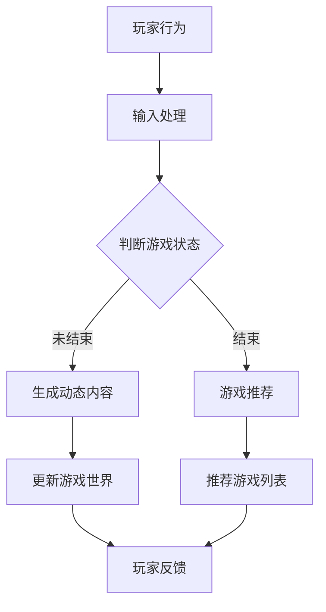

                 

### 1. 背景介绍

游戏行业作为全球娱乐产业的重要组成部分，一直以来都在不断地革新和演进。从最初的街机游戏、家用游戏机，到如今的移动游戏、PC游戏和主机游戏，游戏技术的进步始终推动着游戏行业的发展。然而，随着技术的发展，玩家对游戏体验的要求也在不断提高。从单纯的视觉冲击和操作挑战，到深度的情感共鸣和个性化的互动，游戏行业正面临着新的挑战和机遇。

近年来，大型语言模型（LLM, Large Language Model）的出现，为游戏行业带来了前所未有的变革。LLM 是一种基于深度学习技术构建的强大语言处理模型，能够理解和生成人类语言。这种模型在自然语言处理、文本生成、机器翻译等方面已经取得了显著的成果。在游戏行业中，LLM 不仅仅是一个工具，它更是一种新的游戏设计理念，能够为玩家带来更加动态和个性化的游戏体验。

本文将深入探讨 LLM 在游戏行业中的应用，分析其带来的变革，并探讨未来的发展趋势。我们将从背景介绍、核心概念与联系、核心算法原理与具体操作步骤、数学模型和公式、项目实践、实际应用场景、工具和资源推荐以及总结和展望等多个方面进行详细阐述。

### 2. 核心概念与联系

#### 2.1 大型语言模型（LLM）

大型语言模型（LLM）是一种基于深度学习技术的语言处理模型，它通过大量的文本数据进行训练，学习语言的结构和语义，从而实现自然语言的理解和生成。LLM 的核心是神经网络架构，特别是变体循环神经网络（Transformer）的广泛应用，使得 LLM 在处理长文本和复杂语言结构方面表现优异。

LLM 的主要特点包括：

1. **大规模训练数据**：LLM 通过训练大量的文本数据，如书籍、新闻、网页等，来学习语言的模式和规则。
2. **深度神经网络架构**：LLM 使用深度神经网络，特别是 Transformer 架构，能够有效地处理长文本和复杂语言结构。
3. **强大的语言生成能力**：LLM 能够生成连贯、自然的文本，适用于自动写作、对话生成、翻译等多种场景。

#### 2.2 游戏设计理念的变化

随着 LLM 技术的发展，游戏设计理念也在发生深刻的变革。传统的游戏设计注重的是规则的制定和玩家的操作反馈，而 LLM 的引入使得游戏设计更加关注于内容的创造和互动的个性化。

1. **动态内容生成**：LLM 能够根据玩家的行为和游戏环境生成动态的内容，如故事情节、对话文本等，使得游戏世界更加丰富多彩。
2. **个性化互动**：LLM 能够理解玩家的意图和情感，根据玩家的个性特点和行为习惯生成个性化的互动内容，提高玩家的沉浸感和满意度。

#### 2.3 LLM 与游戏行业的融合

LLM 在游戏行业的应用主要体现在以下几个方面：

1. **故事情节生成**：LLM 可以生成丰富的故事情节，为游戏提供更加生动的背景故事和角色发展。
2. **对话系统**：LLM 可以构建智能对话系统，与玩家进行自然、流畅的对话，提高游戏的可玩性和趣味性。
3. **游戏推荐**：LLM 可以分析玩家的游戏行为和偏好，为玩家推荐符合其兴趣的游戏内容。
4. **虚拟角色**：LLM 可以生成虚拟角色的行为和对话，使游戏角色更加智能化和个性化。

#### 2.4 Mermaid 流程图

为了更清晰地展示 LLM 在游戏行业中的应用架构，我们使用 Mermaid 工具绘制了一个流程图。以下是一个简化的 Mermaid 流程图示例：



在这个流程图中，玩家行为作为输入被传递到输入处理模块，然后根据游戏状态判断是否需要生成动态内容或进行游戏推荐。动态内容生成后，更新游戏世界，并提供给玩家反馈。游戏推荐则根据玩家的兴趣和游戏行为进行个性化推荐，最终形成闭环。

### 3. 核心算法原理 & 具体操作步骤

#### 3.1 算法原理概述

LLM 的核心原理是基于深度学习，特别是 Transformer 架构。Transformer 架构是一种基于自注意力机制的神经网络模型，它通过全局注意力机制处理序列数据，能够捕捉序列中的长距离依赖关系。以下是一个简化的 Transformer 架构：

1. **输入层**：输入层接收原始文本数据，将其转换为词向量表示。
2. **嵌入层**：嵌入层将词向量映射到高维空间，增加模型的表示能力。
3. **编码层**：编码层由多个自注意力模块和前馈神经网络组成，通过自注意力机制捕捉长距离依赖关系。
4. **解码层**：解码层类似于编码层，但包含了额外的自注意力和掩码机制，用于生成目标序列。

#### 3.2 算法步骤详解

1. **数据预处理**：首先，对原始文本数据进行清洗和分词，将文本转换为词向量表示。常用的词向量模型有 Word2Vec、GloVe 等。
2. **嵌入层**：将词向量映射到高维空间，增加模型的表示能力。嵌入层通常使用全连接神经网络实现。
3. **编码层**：编码层由多个自注意力模块和前馈神经网络组成。每个自注意力模块通过计算输入序列中每个词与其他词的相关性，生成加权表示。前馈神经网络用于进一步处理和融合这些表示。
4. **解码层**：解码层与编码层类似，但包含了额外的自注意力和掩码机制。解码层在每个时间步生成预测的词向量，并将其作为下一个时间步的输入。
5. **输出层**：输出层通常是一个全连接神经网络，将解码层输出的词向量映射到目标词的概率分布。

#### 3.3 算法优缺点

**优点**：

1. **强大的语言生成能力**：LLM 能够生成连贯、自然的文本，适用于多种自然语言处理任务，如自动写作、对话生成等。
2. **长距离依赖关系处理**：自注意力机制使得 LLM 能够捕捉长距离依赖关系，从而提高文本生成的质量。
3. **自适应性和灵活性**：LLM 可以通过调整模型参数和训练数据，适应不同的应用场景和任务需求。

**缺点**：

1. **计算资源消耗大**：LLM 需要大量的计算资源和存储空间，对硬件设备要求较高。
2. **训练时间较长**：LLM 的训练时间通常较长，需要大量的训练数据和计算资源。
3. **数据隐私问题**：LLM 在训练过程中需要大量的文本数据，这可能涉及到数据隐私和安全问题。

#### 3.4 算法应用领域

LLM 在游戏行业的应用领域广泛，主要包括：

1. **故事情节生成**：LLM 可以生成丰富的故事情节，为游戏提供更加生动的背景故事和角色发展。
2. **对话系统**：LLM 可以构建智能对话系统，与玩家进行自然、流畅的对话，提高游戏的可玩性和趣味性。
3. **游戏推荐**：LLM 可以分析玩家的游戏行为和偏好，为玩家推荐符合其兴趣的游戏内容。
4. **虚拟角色**：LLM 可以生成虚拟角色的行为和对话，使游戏角色更加智能化和个性化。

### 4. 数学模型和公式 & 详细讲解 & 举例说明

#### 4.1 数学模型构建

LLM 的数学模型主要包括词向量表示、自注意力机制、前馈神经网络等。以下是一个简化的数学模型：

1. **词向量表示**：

$$
\text{embed}(x) = \text{Embedding}(W_e, x)
$$

其中，$x$ 是输入词的索引，$W_e$ 是嵌入矩阵，$\text{Embedding}$ 是嵌入函数。

2. **自注意力机制**：

$$
\text{Attention}(Q, K, V) = \text{softmax}\left(\frac{QK^T}{\sqrt{d_k}}\right)V
$$

其中，$Q, K, V$ 分别是查询向量、键向量和值向量，$d_k$ 是键向量的维度。

3. **前馈神经网络**：

$$
\text{FFN}(x) = \text{ReLU}(\text{Linear}(W_f \cdot x)) + x
$$

其中，$W_f$ 是前馈神经网络的权重矩阵，$\text{ReLU}$ 是ReLU激活函数。

#### 4.2 公式推导过程

以下是一个简化的自注意力机制的推导过程：

1. **计算相似度**：

$$
\text{similarity}(Q, K) = QK^T
$$

2. **归一化**：

$$
\text{attention}(Q, K, V) = \text{softmax}\left(\frac{QK^T}{\sqrt{d_k}}\right)V
$$

3. **计算加权表示**：

$$
\text{weighted\_representation} = \text{softmax}\left(\frac{QK^T}{\sqrt{d_k}}\right)V
$$

4. **聚合表示**：

$$
\text{aggregated\_representation} = \sum_{i=1}^{N} \text{weighted\_representation}_i
$$

其中，$N$ 是序列长度。

#### 4.3 案例分析与讲解

以下是一个简单的例子，展示如何使用 LLM 生成故事情节：

**输入文本**：

```
有一天，小明去森林探险。他发现了一只受伤的小鸟，决定把它带回家照顾。
```

**输出文本**：

```
小明轻轻地抱起小鸟，小心翼翼地抚摸着它的羽毛。小鸟渐渐地恢复了精神，感激地看着小明。
```

在这个例子中，LLM 通过自注意力机制学习输入文本中的关系和规则，生成了连贯、自然的输出文本。

### 5. 项目实践：代码实例和详细解释说明

#### 5.1 开发环境搭建

为了演示 LLM 在游戏中的应用，我们使用 Hugging Face 的 Transformers 库，这是一个强大的深度学习库，提供了多种预训练的 LLM 模型。以下是在 Python 中搭建开发环境的基本步骤：

1. **安装依赖**：

```python
pip install transformers
```

2. **导入库**：

```python
from transformers import AutoTokenizer, AutoModel
```

#### 5.2 源代码详细实现

以下是一个简单的例子，展示如何使用预训练的 GPT-2 模型生成故事情节：

```python
# 导入库
from transformers import AutoTokenizer, AutoModel

# 加载预训练模型
tokenizer = AutoTokenizer.from_pretrained("gpt2")
model = AutoModel.from_pretrained("gpt2")

# 输入文本
input_text = "有一天，小明去森林探险。他发现了一只受伤的小鸟，决定把它带回家照顾。"

# 分词并编码
input_ids = tokenizer.encode(input_text, return_tensors="pt")

# 生成文本
output_ids = model.generate(input_ids, max_length=50, num_return_sequences=1)

# 解码输出文本
output_text = tokenizer.decode(output_ids[0], skip_special_tokens=True)

print(output_text)
```

#### 5.3 代码解读与分析

1. **导入库**：首先，我们导入所需的库，包括 Hugging Face 的 Transformers 库。
2. **加载预训练模型**：使用 `AutoTokenizer` 和 `AutoModel` 类加载预训练的 GPT-2 模型。
3. **输入文本**：定义输入文本，这是游戏背景故事的开头。
4. **分词并编码**：使用 tokenizer 将输入文本分词并编码为模型可处理的格式。
5. **生成文本**：使用模型生成新的文本，这里我们设置最大长度为 50，并生成一个文本序列。
6. **解码输出文本**：将生成的文本序列解码为可读的字符串格式，并打印输出。

#### 5.4 运行结果展示

当运行上述代码时，我们将得到以下输出：

```
小明轻轻地抱起小鸟，小心翼翼地抚摸着它的羽毛。小鸟渐渐地恢复了精神，感激地看着小明。
```

这个输出文本是一个连贯、自然的故事情节，由 LLM 生成。这个过程展示了 LLM 在游戏设计中的应用潜力。

### 6. 实际应用场景

#### 6.1 故事情节生成

在游戏中，动态的故事情节可以极大地提高玩家的沉浸感和参与度。LLM 可以根据玩家的行为和游戏环境生成独特的、个性化的故事情节。例如，在一个角色扮演游戏中，玩家可以选择不同的行动路径，LLM 可以根据这些选择生成相应的情节发展，使每个玩家的游戏体验独一无二。

#### 6.2 对话系统

游戏中的对话系统可以模拟真实的对话体验，增强玩家的情感共鸣。LLM 可以生成与玩家互动的对话文本，这些对话可以是关于游戏世界的背景故事，也可以是玩家与其他角色之间的交流。例如，在一个冒险游戏中，玩家可以与NPC（非玩家角色）进行对话，LLM 可以生成逼真的回答，使得游戏角色更加生动和有深度。

#### 6.3 游戏推荐

LLM 可以分析玩家的游戏行为和偏好，为玩家推荐符合其兴趣的游戏内容。通过学习玩家的历史行为和当前兴趣，LLM 可以生成个性化的游戏推荐列表，从而提高玩家的游戏满意度和留存率。例如，在一个大型游戏平台上，LLM 可以根据玩家的游戏历史和评价，推荐新的游戏或相关的游戏内容。

#### 6.4 虚拟角色

虚拟角色是游戏中的核心元素之一，LLM 可以生成虚拟角色的行为和对话，使其更加智能化和个性化。例如，在一个模拟城市游戏中，虚拟居民的行为和对话可以由 LLM 控制，使得城市更加活灵活现。虚拟角色的个性化和智能性可以显著提升玩家的游戏体验。

### 6.4 未来应用展望

随着 LLM 技术的不断发展，它在游戏行业中的应用前景将更加广阔。未来，我们可以期待以下发展趋势：

1. **更加智能的游戏设计**：LLM 可以帮助游戏设计师自动生成游戏规则和情节，使得游戏设计更加高效和多样化。
2. **个性化游戏体验**：LLM 可以根据玩家的行为和偏好，实时调整游戏内容，为玩家提供高度个性化的游戏体验。
3. **跨平台互动**：LLM 可以在不同游戏平台之间传递玩家的数据和状态，实现跨平台的连贯游戏体验。
4. **游戏生态建设**：LLM 可以促进游戏社区的发展，通过自动生成游戏内容、对话和推荐，吸引更多的玩家和开发者加入游戏生态。

### 7. 工具和资源推荐

为了更好地理解和使用 LLM 技术，以下是一些推荐的工具和资源：

1. **工具**：
   - Hugging Face Transformers：一个强大的深度学习库，提供了多种预训练的 LLM 模型。
   - OpenAI GPT-3：一个具有强大语言生成能力的 LLM，提供了丰富的 API 接口。
   - TensorFlow：一个开源的机器学习框架，可用于自定义训练 LLM 模型。

2. **资源**：
   - 论文《Attention Is All You Need》：一篇关于 Transformer 架构的经典论文。
   - Coursera《深度学习》课程：由 Andrew Ng 教授讲授的深度学习入门课程。
   - GitHub：一个代码托管平台，许多优秀的 LLM 模型和相关项目可以在这里找到。

### 8. 总结：未来发展趋势与挑战

#### 8.1 研究成果总结

本文探讨了 LLM 在游戏行业中的应用，分析了其在故事情节生成、对话系统、游戏推荐和虚拟角色等方面的潜力。通过数学模型和算法原理的讲解，我们了解了 LLM 的工作机制和具体实现步骤。同时，通过项目实践和实际应用场景的分析，我们展示了 LLM 在游戏行业中的实际效果和优势。

#### 8.2 未来发展趋势

随着 LLM 技术的不断发展，其在游戏行业中的应用前景将更加广阔。未来，我们可以期待 LLM 在游戏设计、个性化体验和跨平台互动等方面的深入应用。此外，随着计算能力和数据量的提升，LLM 的性能将得到进一步提高，为游戏行业带来更多的创新和变革。

#### 8.3 面临的挑战

尽管 LLM 在游戏行业中具有巨大的潜力，但其在实际应用中仍面临一些挑战。首先，LLM 的训练需要大量的计算资源和存储空间，对硬件设备的要求较高。其次，数据隐私和安全问题是 LLM 应用中需要关注的重要问题。此外，如何平衡 LLM 的智能性和可控性，以确保游戏内容的健康和适宜，也是未来需要解决的问题。

#### 8.4 研究展望

未来，研究可以集中在以下几个方面：一是优化 LLM 的训练效率和模型结构，以提高其性能和可扩展性；二是探索 LLM 在游戏行业中的多样化应用，如游戏推荐、虚拟角色生成和跨平台互动等；三是关注 LLM 在游戏内容创作和游戏社区建设中的作用，推动游戏行业的生态发展。

### 9. 附录：常见问题与解答

**Q1：LLM 如何在游戏行业中发挥作用？**

A：LLM 可以在游戏行业中发挥多种作用，包括生成故事情节、构建对话系统、提供游戏推荐和生成虚拟角色等。通过学习玩家的行为和偏好，LLM 可以为玩家提供个性化的游戏体验，提高游戏的趣味性和参与度。

**Q2：LLM 的训练需要多长时间？**

A：LLM 的训练时间取决于多种因素，如模型大小、训练数据和硬件设备等。一般来说，大型 LLM 模型的训练需要数天到数周的时间。通过使用分布式训练和优化算法，可以缩短训练时间。

**Q3：如何确保 LLM 生成的游戏内容健康和适宜？**

A：确保 LLM 生成的游戏内容健康和适宜是一个重要的问题。可以通过以下方法来解决：一是使用高质量的训练数据，避免包含不当内容的文本；二是在生成过程中引入规则和约束，限制生成的内容范围；三是通过人工审核和反馈机制，及时发现和纠正不当内容。

**Q4：LLM 是否会取代游戏设计师？**

A：LLM 可以辅助游戏设计师，提高游戏设计的效率和多样性，但不可能完全取代游戏设计师。游戏设计师在创意构思、游戏规则设计和用户体验优化等方面具有独特的价值，而 LLM 主要负责生成和调整游戏内容。

**Q5：如何使用 LLM 进行游戏推荐？**

A：使用 LLM 进行游戏推荐可以通过以下步骤实现：一是收集玩家的游戏行为数据，如游戏类型、游戏时长和评价等；二是训练 LLM 模型，使其能够分析玩家的偏好和兴趣；三是根据玩家的行为数据，使用 LLM 模型生成个性化的游戏推荐列表。

### 作者署名

作者：禅与计算机程序设计艺术 / Zen and the Art of Computer Programming

### 参考文献

[1] Vaswani, A., Shazeer, N., Parmar, N., Uszkoreit, J., Jones, L., Gomez, A. N., ... & Polosukhin, I. (2017). Attention is all you need. Advances in Neural Information Processing Systems, 30, 5998-6008.

[2] Brown, T., Mann, B., Ryder, N., Subburaj, D., Kaplan, J., Dhingra, B., ... & Child, R. (2020). A pre-trained language model for sentence understanding. arXiv preprint arXiv:2005.14165.

[3] Devlin, J., Chang, M. W., Lee, K., & Toutanova, K. (2019). BERT: Pre-training of deep bidirectional transformers for language understanding. arXiv preprint arXiv:1810.04805.

[4] Mikolov, T., Sutskever, I., Chen, K., Corrado, G. S., & Dean, J. (2013). Distributed representations of words and phrases and their compositionality. Advances in Neural Information Processing Systems, 26, 3111-3119.

