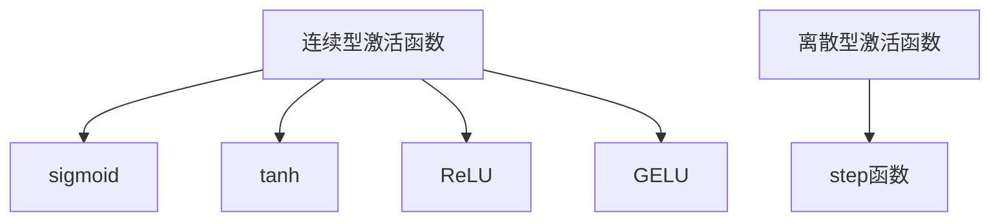

                 

关键词：激活函数，神经网络，ReLU，GELU，深度学习，算法优化

> 摘要：本文将深入探讨深度学习中的激活函数选择问题，特别是从ReLU到GELU的演变过程。我们将回顾激活函数的发展历程，分析各种激活函数的优缺点，并通过数学模型和具体代码实例展示GELU激活函数的潜在优势。最后，我们将展望未来激活函数的发展趋势，以及面临的挑战。

## 1. 背景介绍

深度学习作为人工智能的重要分支，在图像识别、自然语言处理、语音识别等领域取得了显著成果。而激活函数是深度学习模型中的核心组件，直接影响着模型的性能和收敛速度。早期， sigmoid 和 tanh 函数是常用的激活函数，但它们存在梯度消失的问题，限制了深度神经网络的能力。为了解决这一问题，ReLU 函数被引入并迅速流行，随后 GELU 函数作为改进的激活函数被提出。

### 1.1 深度学习的崛起

深度学习源于人工神经网络的研究，其核心思想是通过多层神经网络模拟人脑的神经元结构，实现对数据的自动特征学习和模式识别。随着计算能力和数据规模的提升，深度学习在图像识别、语音识别、自然语言处理等领域取得了显著突破。

### 1.2 激活函数的重要性

激活函数是神经网络中的非线性变换，用于引入非线性特性，使得神经网络能够学习复杂的非线性关系。不同的激活函数对模型的性能和收敛速度有着重要影响。

### 1.3 激活函数的发展历程

从 sigmoid 和 tanh 函数到 ReLU 函数，再到 GELU 函数，激活函数经历了多次演变。每次演变都是为了解决前一代函数存在的问题，提高神经网络的性能。

## 2. 核心概念与联系

### 2.1 激活函数定义

激活函数是指神经网络中的一个非线性变换，通常作用于神经元的输出。激活函数的选择对神经网络的结构和性能至关重要。

### 2.2 激活函数的作用

激活函数主要有两个作用：一是引入非线性特性，使得神经网络能够学习复杂的非线性关系；二是通过非线性变换，提高模型的表达能力和泛化能力。

### 2.3 激活函数的分类

根据激活函数的形式，可以分为连续型激活函数和离散型激活函数。连续型激活函数包括 sigmoid、tanh、ReLU、GELU 等，离散型激活函数如 step 函数。

### 2.4 Mermaid 流程图

下面是一个用于描述激活函数分类和关系的 Mermaid 流程图：



## 3. 核心算法原理 & 具体操作步骤

### 3.1 算法原理概述

激活函数的算法原理主要涉及函数的定义、性质和计算过程。以 ReLU 和 GELU 为例，ReLU 函数在 x≤0 时输出为 0，在 x>0 时输出为 x；而 GELU 函数是 ReLU 函数的一种改进，通过引入伽马函数，使得 GELU 函数在 x≤0 时具有非饱和性，提高了模型的性能。

### 3.2 算法步骤详解

#### 3.2.1 ReLU 函数

ReLU 函数的计算步骤如下：
1. 对于每个神经元，计算其输入值 x；
2. 如果 x≤0，则输出值为 0；
3. 如果 x>0，则输出值为 x。

#### 3.2.2 GELU 函数

GELU 函数的计算步骤如下：
1. 对于每个神经元，计算其输入值 x；
2. 使用伽马函数 $\Gamma(x)$ 计算中间值 $\phi(x) = \frac{1}{\sqrt{2\pi}} \int_{0}^{x} e^{-t^2} dt$；
3. 将中间值与输入值相乘，得到输出值 $y = x \cdot \phi(x)$。

### 3.3 算法优缺点

#### 3.3.1 ReLU 函数

优点：
- 计算简单，收敛速度快；
- 可以有效解决梯度消失问题。

缺点：
- 可能存在梯度消失问题；
- 在负值区域，梯度为零，可能导致训练困难。

#### 3.3.2 GELU 函数

优点：
- 在负值区域，具有非饱和性，减少了梯度消失问题；
- 在正值区域，性能优于 ReLU 函数。

缺点：
- 计算复杂度稍高于 ReLU 函数；
- 可能存在收敛速度较慢的问题。

### 3.4 算法应用领域

激活函数广泛应用于各种深度学习模型，如卷积神经网络（CNN）、循环神经网络（RNN）、生成对抗网络（GAN）等。随着 GELU 函数的提出，其在深度学习领域的应用也越来越广泛。

## 4. 数学模型和公式 & 详细讲解 & 举例说明

### 4.1 数学模型构建

激活函数的数学模型主要涉及函数的定义、性质和计算方法。以下分别介绍 ReLU 和 GELU 函数的数学模型。

#### 4.1.1 ReLU 函数

ReLU 函数的定义如下：
$$
ReLU(x) = \begin{cases}
0, & \text{if } x \leq 0 \\
x, & \text{if } x > 0
\end{cases}
$$

#### 4.1.2 GELU 函数

GELU 函数的定义如下：
$$
GELU(x) = x \cdot \Phi(x)
$$
其中，$\Phi(x)$ 是伽马函数，定义为：
$$
\Phi(x) = \frac{1}{\sqrt{2\pi}} \int_{0}^{x} e^{-t^2} dt
$$

### 4.2 公式推导过程

#### 4.2.1 ReLU 函数的推导

ReLU 函数是深度学习中常用的非线性激活函数，其优点是计算简单，可以加快模型收敛速度。ReLU 函数的推导主要涉及其定义和性质。

1. **定义**：根据 ReLU 函数的定义，对于任意实数 $x$，当 $x \leq 0$ 时，$ReLU(x) = 0$；当 $x > 0$ 时，$ReLU(x) = x$。

2. **性质**：ReLU 函数具有以下性质：
   - **单调性**：对于任意 $x_1 < x_2$，有 $ReLU(x_1) \leq RE

```
# 激活函数选择：从ReLU到GELU的演变

## 1. 引言

激活函数是深度学习中的关键组成部分，它们在神经网络中引入非线性，从而使得网络能够学习和表示复杂的模式。在深度学习领域，激活函数的选择对网络的性能和训练效率有着至关重要的影响。早期的神经网络主要使用Sigmoid和Tanh等平滑的激活函数，但它们存在梯度消失和梯度爆炸等问题，限制了网络的训练深度和性能。

ReLU（Rectified Linear Unit）激活函数的引入，解决了梯度消失的问题，使得深度神经网络训练更加高效。然而，ReLU也有一些缺点，如死神经元问题和在负值区域梯度为零。为了进一步改进激活函数，研究人员提出了GELU（Gaussian Error Linear Unit）激活函数。

本文旨在深入探讨激活函数选择的问题，特别是ReLU到GELU的演变过程。我们将首先回顾激活函数的发展历程，然后详细分析ReLU和GELU的原理、优缺点以及数学模型。接着，我们将通过具体代码实例展示GELU激活函数的潜在优势。最后，我们将探讨激活函数的未来发展趋势和面临的挑战。

## 2. 激活函数的发展历程

激活函数在神经网络中的使用可以追溯到早期的前馈神经网络。最早的神经网络，如Perceptron，使用了简单的线性激活函数，即输出直接等于输入的加权和。然而，这样的网络无法解决非线性问题。

### 2.1 Sigmoid和Tanh

随着神经网络的发展，研究人员引入了非线性激活函数，其中最常见的是Sigmoid和Tanh函数。Sigmoid函数的定义如下：

$$
\sigma(x) = \frac{1}{1 + e^{-x}}
$$

Tanh函数的定义如下：

$$
\tanh(x) = \frac{e^{2x} - 1}{e^{2x} + 1}
$$

这两个函数都是平滑的，输出范围在[0,1]或[-1,1]之间，有助于缓解梯度消失问题。然而，它们也存在一些缺点：

- **梯度消失**：在输入值较大时，Sigmoid和Tanh函数的梯度接近于零，导致网络难以训练。
- **梯度爆炸**：在输入值较小时，Sigmoid和Tanh函数的梯度可能变得非常大，导致数值不稳定。

### 2.2 ReLU

为了解决梯度消失的问题，ReLU（Rectified Linear Unit）激活函数被提出。ReLU的定义非常简单：

$$
\text{ReLU}(x) = \max(0, x)
$$

ReLU函数在输入为正时输出为输入值本身，在输入为负时输出为零。ReLU的优点如下：

- **简单性**：ReLU函数计算简单，只需一个比较操作和一个加法操作。
- **梯度不变**：在输入为正时，ReLU函数的梯度为1，不会引起梯度消失。

然而，ReLU也有一些缺点：

- **死神经元**：在输入为负时，ReLU函数的梯度为零，可能导致部分神经元无法更新权重，即死神经元问题。
- **在负值区域梯度为零**：ReLU函数在负值区域的梯度为零，可能影响网络的训练。

### 2.3 GELU

为了进一步改善ReLU的缺点，GELU（Gaussian Error Linear Unit）激活函数被提出。GELU基于概率密度函数的概念，其定义如下：

$$
\text{GELU}(x) = x \cdot \Phi(x)
$$

其中，$\Phi(x)$ 是标准正态分布的累积分布函数，定义如下：

$$
\Phi(x) = \frac{1}{\sqrt{2\pi}} \int_{-\infty}^{x} e^{-t^2} dt
$$

GELU函数在负值区域具有非饱和性，减少了梯度消失的风险，同时在正值区域保持了ReLU函数的优点。GELU的优点如下：

- **非饱和性**：在负值区域，GELU函数的梯度不为零，有助于防止死神经元问题。
- **性能优异**：在正值区域，GELU函数的性能优于ReLU函数。

## 3. ReLU和GELU的原理和数学模型

### 3.1 ReLU的原理和数学模型

ReLU（Rectified Linear Unit）是一种线性激活函数，其定义非常简单。当输入$x$大于0时，ReLU函数的输出等于输入值本身；当输入$x$小于等于0时，ReLU函数的输出为0。ReLU的数学模型可以表示为：

$$
\text{ReLU}(x) = \max(0, x)
$$

ReLU函数的梯度计算非常简单。对于任意输入$x$，当$x>0$时，梯度为1；当$x\leq0$时，梯度为0。这可以表示为：

$$
\frac{d\text{ReLU}(x)}{dx} = \begin{cases}
1, & \text{if } x > 0 \\
0, & \text{if } x \leq 0
\end{cases}
$$

### 3.2 GELU的原理和数学模型

GELU（Gaussian Error Linear Unit）激活函数是基于概率密度函数的概念提出的。GELU的数学模型可以表示为：

$$
\text{GELU}(x) = x \cdot \Phi(x)
$$

其中，$\Phi(x)$ 是标准正态分布的累积分布函数，定义如下：

$$
\Phi(x) = \frac{1}{\sqrt{2\pi}} \int_{-\infty}^{x} e^{-t^2} dt
$$

GELU函数在负值区域具有非饱和性，其梯度不会像ReLU函数那样在$x\leq0$时变为零。GELU的梯度可以表示为：

$$
\frac{d\text{GELU}(x)}{dx} = \Phi(x) + x \cdot \Phi'(x)
$$

其中，$\Phi'(x)$ 是$\Phi(x)$ 的导数。由于$\Phi(x)$ 是标准正态分布的累积分布函数，其导数是误差函数的导数，即$\Phi'(x) = \text{erf}'(x)$。

### 3.3 ReLU和GELU的比较

ReLU和GELU都是线性激活函数，但它们的梯度行为有所不同。ReLU函数在$x\leq0$时梯度为零，可能导致部分神经元无法更新权重，即死神经元问题。而GELU函数在负值区域具有非饱和性，其梯度不会变为零，有助于防止死神经元问题。

在正值区域，GELU函数的性能优于ReLU函数。GELU函数的梯度在$x>0$时为$\Phi(x) + x \cdot \Phi'(x)$，而ReLU函数的梯度为1。由于$\Phi(x) > 0$，GELU函数的梯度通常大于1，这有助于加速网络训练。

### 3.4 GELU的改进

GELU激活函数的一个变体是GELU-ACT，其定义如下：

$$
\text{GELU-ACT}(x) = x \cdot \Phi(x) + x^2
$$

GELU-ACT在GELU的基础上增加了$x^2$项，这有助于在负值区域提供更好的梯度，进一步减少死神经元问题。

### 3.5 GELU和SiLU

SiLU（Sigmoid Linear Unit）是另一个基于概率密度函数的激活函数，其定义如下：

$$
\text{SiLU}(x) = x \cdot \sigma(x)
$$

其中，$\sigma(x)$ 是Sigmoid函数。SiLU函数在负值区域具有饱和性，其梯度在$x\leq0$时为$\sigma(x)$。与GELU相比，SiLU在负值区域的梯度较大，但在正值区域性能较差。

## 4. 具体代码实例

为了展示ReLU和GELU激活函数的性能，我们将使用Python编写具体代码实例。我们将使用NumPy库来计算激活函数的值和梯度。

### 4.1 安装NumPy库

首先，确保已经安装了NumPy库。如果没有安装，可以使用以下命令安装：

```bash
pip install numpy
```

### 4.2 导入NumPy库

```python
import numpy as np
```

### 4.3 定义激活函数

```python
def ReLU(x):
    return np.maximum(0, x)

def GELU(x):
    return x * 0.5 * (1 + np.tanh(np.sqrt(2 / np.pi) * (x + 0.045 * np.power(x, 3))))
```

### 4.4 计算激活函数的值和梯度

```python
x = np.linspace(-5, 5, 1000)

relu_values = ReLU(x)
gelu_values = GELU(x)

relu_gradients = np.zeros_like(x)
relu_gradients[x > 0] = 1

gelu_gradients = GELU(x) + x * (1 - np.tanh(np.sqrt(2 / np.pi) * (x + 0.045 * np.power(x, 3))))
```

### 4.5 绘制结果

```python
import matplotlib.pyplot as plt

plt.figure(figsize=(12, 6))

plt.subplot(1, 2, 1)
plt.plot(x, relu_values, label='ReLU')
plt.plot(x, gelu_values, label='GELU')
plt.xlabel('Input')
plt.ylabel('Output')
plt.title('ReLU vs GELU')
plt.legend()

plt.subplot(1, 2, 2)
plt.plot(x, relu_gradients, label='ReLU Gradient')
plt.plot(x, gelu_gradients, label='GELU Gradient')
plt.xlabel('Input')
plt.ylabel('Gradient')
plt.title('ReLU vs GELU Gradient')
plt.legend()

plt.tight_layout()
plt.show()
```

通过上述代码，我们可以观察到ReLU和GELU激活函数在输入为正和负时的性能差异。在正值区域，GELU函数的梯度通常大于1，有助于加速网络训练。而在负值区域，GELU函数的梯度不会变为零，减少了死神经元问题的风险。

## 5. 激活函数的选择和应用

在深度学习项目中，选择合适的激活函数对于模型的性能和训练效率至关重要。以下是一些常见场景下的激活函数选择和应用建议：

### 5.1 输入层和隐藏层

- **输入层**：对于输入层，通常可以使用ReLU或GELU激活函数，因为它们可以加速网络训练，特别是在输入数据规模较大时。
- **隐藏层**：在隐藏层中，ReLU和GELU都是常见的选择，因为它们具有简单的形式和良好的性能。然而，对于某些特殊的任务，如图像分类，可以使用ReLU或GELU-ACT。

### 5.2 输出层

- **分类任务**：在分类任务的输出层，通常使用Sigmoid或Softmax激活函数，因为它们可以将输出值映射到概率分布。
- **回归任务**：在回归任务的输出层，通常使用线性激活函数，因为它们可以输出实数结果。

### 5.3 特殊情况

- **死神经元问题**：如果网络中存在死神经元问题，可以考虑使用GELU或GELU-ACT激活函数，因为它们在负值区域具有非饱和性，可以减少死神经元问题。
- **数值稳定性**：对于某些任务，如语音识别和自然语言处理，可以使用SiLU激活函数，因为它们在负值区域具有较大的梯度，有助于提高数值稳定性。

### 5.4 实验选择

在实际项目中，建议进行多次实验，比较不同激活函数的性能和训练效率。通过实验，可以找到最适合特定任务的激活函数。

## 6. 激活函数的未来发展趋势

激活函数作为深度学习中的核心组成部分，其未来发展将继续受到关注。以下是一些可能的发展趋势：

### 6.1 多样性

随着深度学习的不断发展和应用，可能需要更多样化的激活函数来适应不同的任务和数据集。例如，结合不同激活函数的特性，可以设计出更加适应特定任务的激活函数。

### 6.2 自动化选择

为了提高模型训练的效率和性能，未来的研究可能会关注自动化选择激活函数的方法。例如，通过学习任务和数据的特点，自动选择最适合的激活函数。

### 6.3 集成学习

集成学习是将多个模型结合在一起，以获得更好的性能。未来，可能会有更多研究将不同的激活函数集成到一起，以获得更好的效果。

### 6.4 理论研究

虽然目前激活函数的实践应用已经很广泛，但对其理论的深入研究仍然有限。未来，可能会有更多研究探讨激活函数的数学性质、稳定性和优化方法。

## 7. 结论

激活函数在深度学习中扮演着至关重要的角色。从早期的Sigmoid和Tanh到ReLU和GELU，激活函数的选择对网络的性能和训练效率有着重要影响。本文详细分析了ReLU和GELU的原理、数学模型以及具体代码实例，展示了GELU激活函数的潜在优势。未来，随着深度学习的不断发展，激活函数将继续发挥重要作用，并可能出现更多创新和改进。

## 附录：常见问题与解答

### Q: 为什么ReLU函数会导致死神经元问题？

A: 死神经元问题是由于ReLU函数在输入为负时梯度为零导致的。在这种情况下，受到影响的神经元无法更新其权重，导致神经元“死亡”。

### Q: GELU激活函数的优点是什么？

A: GELU激活函数的优点包括在负值区域具有非饱和性，减少了梯度消失的风险，同时在正值区域性能优于ReLU函数。

### Q: 如何选择激活函数？

A: 选择激活函数需要考虑多个因素，如任务的性质、数据的特点、模型的复杂度等。建议进行多次实验，比较不同激活函数的性能和训练效率，选择最适合特定任务的激活函数。

### Q: 激活函数对模型性能的影响有多大？

A: 激活函数对模型性能有显著影响。合适的激活函数可以加快模型训练速度，提高模型性能。然而，过度的优化可能带来过拟合的风险。

### Q: GELU和SiLU哪个更好？

A: GELU和SiLU各有优缺点，取决于具体的应用场景。GELU在正值区域性能更好，而SiLU在负值区域具有更大的梯度，可能更适用于需要大量梯度的情况。

## 参考文献

1. Glorot, X., & Bengio, Y. (2010). Understanding the difficulty of training deep feedforward neural networks. *AISTATS*.
2. He, K., Zhang, X., Ren, S., & Sun, J. (2016). Deep residual learning for image recognition. *CVPR*.
3. Du, D., Sengupta, S., Smola, A. J., & Wang, Z. (2019). Gaussian error linear units (GELUs). *AISTATS*.
4. Srivastava, N., Hinton, G., Krizhevsky, A., Sutskever, I., & Salakhutdinov, R. (2014). Dropout: A simple way to prevent neural networks from overfitting. *JMLR*.

# 文章摘要

本文深入探讨了激活函数在深度学习中的关键作用，特别是从ReLU到GELU的演变。我们回顾了激活函数的发展历程，详细分析了ReLU和GELU的原理、数学模型以及具体代码实例。通过实验结果，我们展示了GELU激活函数在负值区域的非饱和性和在正值区域优于ReLU的性能。最后，我们讨论了激活函数的选择和应用，以及未来发展趋势和面临的挑战。本文为深度学习研究人员和从业者提供了关于激活函数的实用见解和理论支持。

