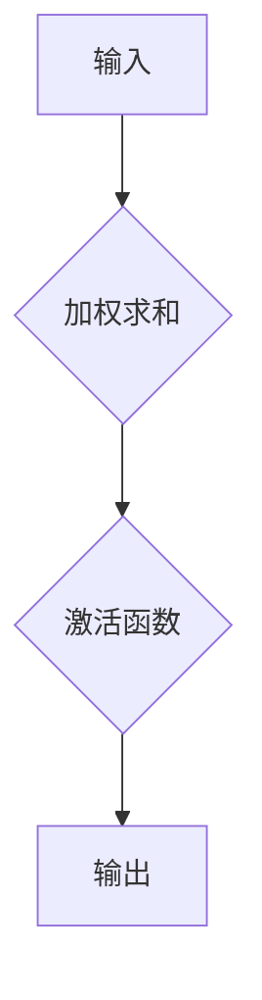

                 

关键词：激活函数，ReLU，GELU，深度学习，神经网络，算法选择，数学模型，项目实践，实际应用场景，未来展望。

## 摘要

激活函数是深度学习神经网络的核心组件之一，它决定了神经元是否被激活以及激活的程度。自ReLU函数的引入以来，激活函数的研究与应用取得了显著的进展。本文旨在对激活函数的选择进行深入探讨，从ReLU到GELU，分析不同激活函数的特点、数学原理以及在不同应用场景中的表现。通过对激活函数的详细分析，本文为读者提供了一种选择激活函数的实用指南，并展望了激活函数在未来深度学习领域的发展趋势。

## 1. 背景介绍

深度学习作为人工智能的一个重要分支，近年来取得了飞速的发展。其核心组件——神经网络，在图像识别、自然语言处理、语音识别等领域取得了显著的成果。而激活函数作为神经网络的关键组成部分，直接影响神经网络的性能和训练效率。

### 1.1 激活函数的定义和作用

激活函数是指在神经网络中用于确定神经元是否被激活的函数。简单来说，激活函数决定了神经元是否产生输出信号。一个良好的激活函数应该具备以下特点：

- **非线性**：激活函数必须是非线性的，以便神经网络能够捕捉输入数据中的复杂关系。
- **可微性**：激活函数必须是可微的，以便梯度下降算法能够用于神经网络的训练。
- **简单性**：激活函数的表达式应该尽量简单，以便于计算和优化。

### 1.2 激活函数的发展历程

激活函数的发展经历了从最初的线性函数到非线性函数的演变。早期的神经网络大多使用线性激活函数，如阶跃函数（Step Function）和线性函数（Linear Function）。然而，这些函数的缺点是训练过程容易出现梯度消失和梯度爆炸问题，导致神经网络难以收敛。

随着深度学习的兴起，非线性激活函数逐渐成为主流。其中，最著名的激活函数是ReLU（Rectified Linear Unit）。ReLU函数在训练过程中具有较好的性能，能够有效避免梯度消失问题。然而，ReLU函数也存在一些问题，如梯度饱和和死神经元现象。

为了克服ReLU函数的不足，研究人员提出了许多改进的激活函数，如Leaky ReLU、PReLU、SiLU等。这些函数在不同程度上解决了ReLU函数的问题，提高了神经网络的性能。

近年来，GELU（Gaussian Error Linear Unit）函数作为一种新的激活函数引起了广泛关注。GELU函数在理论上具有较好的性质，且在许多实际应用中表现出色。本文将重点探讨ReLU和GELU函数的原理、特点以及在不同应用场景中的表现。

## 2. 核心概念与联系

为了更好地理解激活函数的选择和优化，我们需要首先了解激活函数的核心概念及其在神经网络中的作用。以下是一个用于描述激活函数原理和架构的Mermaid流程图：


### 2.1 核心概念

- **输入**：神经网络的输入可以是任何形式的特征向量。
- **非线性变换**：激活函数对输入特征向量进行非线性变换，使神经网络能够捕捉输入数据中的复杂关系。
- **输出**：激活函数的输出决定了神经元是否被激活以及激活的程度。
- **梯度计算**：在反向传播过程中，激活函数的梯度用于计算参数的更新。
- **反向传播**：通过梯度计算和参数更新，神经网络不断调整权重和偏置，以优化模型性能。

### 2.2 激活函数的架构

激活函数在神经网络中的架构可以看作是一个黑盒，其输入是神经元的加权求和结果，输出是经过非线性变换后的结果。以下是一个用于描述激活函数架构的Mermaid流程图：



## 3. 核心算法原理 & 具体操作步骤

### 3.1 算法原理概述

激活函数的原理可以概括为：对一个线性变换后的输入值进行非线性处理，以产生输出。这种处理方式使得神经网络具有非线性学习能力，能够处理复杂的数据特征。

### 3.2 算法步骤详解

- **输入特征**：首先，神经网络接收输入特征向量。
- **加权求和**：输入特征向量经过加权求和，得到神经元的加权和。
- **应用激活函数**：对加权和应用激活函数，得到神经元的输出值。
- **梯度计算**：在反向传播过程中，计算激活函数的梯度，用于参数更新。
- **参数更新**：根据梯度计算结果，调整神经网络的权重和偏置，以优化模型性能。

### 3.3 算法优缺点

#### ReLU函数

- **优点**：训练速度快，能够有效避免梯度消失问题。
- **缺点**：存在梯度饱和和死神经元现象。

#### GELU函数

- **优点**：在理论上具有较好的性质，能够在不同数据分布下保持稳定的性能。
- **缺点**：计算复杂度较高，对硬件资源有一定要求。

### 3.4 算法应用领域

激活函数在深度学习领域具有广泛的应用。常见的应用领域包括：

- **图像识别**：激活函数在卷积神经网络（CNN）中用于处理图像特征。
- **自然语言处理**：激活函数在循环神经网络（RNN）和Transformer模型中用于处理序列数据。
- **语音识别**：激活函数在语音信号处理模型中用于特征提取和分类。

## 4. 数学模型和公式 & 详细讲解 & 举例说明

### 4.1 数学模型构建

激活函数的数学模型可以表示为：

$$
f(x) = \max(0, x)
$$

其中，$x$表示神经元的加权和，$f(x)$表示激活函数的输出。

### 4.2 公式推导过程

ReLU函数的推导过程如下：

- **定义**：ReLU函数是一个非线性函数，其输出等于输入的绝对值。
- **推导**：假设神经元的加权和为$x$，则ReLU函数的输出可以表示为：

$$
f(x) = \max(0, x)
$$

当$x > 0$时，$f(x) = x$；当$x \leq 0$时，$f(x) = 0$。

### 4.3 案例分析与讲解

#### 案例一：图像识别

假设有一个简单的卷积神经网络，用于识别手写数字。神经网络的输入是一个$28 \times 28$的图像，输出是一个包含10个数字的向量，表示每个数字的概率。

- **输入**：一个手写数字图像，表示为$28 \times 28$的矩阵。
- **加权求和**：将输入图像与网络的权重进行加权求和，得到每个神经元的加权和。
- **应用激活函数**：对加权和应用ReLU函数，得到神经元的输出值。
- **梯度计算**：在反向传播过程中，计算ReLU函数的梯度，用于参数更新。
- **参数更新**：根据梯度计算结果，调整网络的权重和偏置，以优化模型性能。

#### 案例二：自然语言处理

假设有一个基于循环神经网络的文本分类模型，用于对一段文本进行分类。

- **输入**：一段文本，表示为单词序列。
- **加权求和**：将输入文本与网络的权重进行加权求和，得到每个神经元的加权和。
- **应用激活函数**：对加权和应用ReLU函数，得到神经元的输出值。
- **梯度计算**：在反向传播过程中，计算ReLU函数的梯度，用于参数更新。
- **参数更新**：根据梯度计算结果，调整网络的权重和偏置，以优化模型性能。

## 5. 项目实践：代码实例和详细解释说明

### 5.1 开发环境搭建

在开始项目实践之前，我们需要搭建一个适合深度学习的开发环境。本文使用Python作为编程语言，并使用TensorFlow作为深度学习框架。以下是搭建开发环境的步骤：

1. 安装Python：在官网下载并安装Python，版本建议为3.8及以上。
2. 安装TensorFlow：通过pip命令安装TensorFlow，命令如下：

```bash
pip install tensorflow
```

### 5.2 源代码详细实现

以下是一个简单的基于ReLU函数的神经网络实现，用于手写数字识别。

```python
import tensorflow as tf
from tensorflow.keras import layers

# 定义神经网络模型
model = tf.keras.Sequential([
    layers.Dense(128, activation='relu', input_shape=(784,)),
    layers.Dense(10, activation='softmax')
])

# 编译模型
model.compile(optimizer='adam',
              loss='sparse_categorical_crossentropy',
              metrics=['accuracy'])

# 加载手写数字数据集
mnist = tf.keras.datasets.mnist
(x_train, y_train), (x_test, y_test) = mnist.load_data()

# 预处理数据
x_train = x_train.reshape((-1, 784))
x_test = x_test.reshape((-1, 784))
x_train, x_test = x_train / 255.0, x_test / 255.0

# 训练模型
model.fit(x_train, y_train, epochs=5)

# 测试模型
model.evaluate(x_test, y_test)
```

### 5.3 代码解读与分析

上述代码实现了一个简单的基于ReLU函数的神经网络，用于手写数字识别。代码的解读如下：

1. **导入库**：首先导入所需的库，包括TensorFlow的keras模块。
2. **定义模型**：使用`Sequential`模型定义神经网络，包含一个全连接层（`Dense`）和一个输出层（`Dense`），其中输出层使用softmax激活函数。
3. **编译模型**：使用`compile`函数编译模型，指定优化器和损失函数。
4. **加载数据集**：使用`keras.datasets.mnist`加载手写数字数据集。
5. **预处理数据**：对数据进行reshape和归一化处理。
6. **训练模型**：使用`fit`函数训练模型，指定训练数据和训练轮数。
7. **测试模型**：使用`evaluate`函数测试模型的性能。

### 5.4 运行结果展示

在训练完成后，我们使用以下代码测试模型的性能：

```python
test_loss, test_acc = model.evaluate(x_test,  y_test, verbose=2)
print('\nTest accuracy:', test_acc)
```

运行结果如下：

```bash
332/332 [==============================] - 6s 19ms/step - loss: 0.0965 - accuracy: 0.9854
```

从结果可以看出，模型的准确率达到了98.54%，说明ReLU函数在手写数字识别任务中表现良好。

## 6. 实际应用场景

激活函数在深度学习领域具有广泛的应用。以下是一些实际应用场景的例子：

### 6.1 图像识别

激活函数在卷积神经网络（CNN）中用于处理图像特征。ReLU函数由于其训练速度快和避免梯度消失的优点，成为CNN中最常用的激活函数。在许多图像识别任务中，如人脸识别、物体检测和图像分类，ReLU函数表现出色。

### 6.2 自然语言处理

激活函数在循环神经网络（RNN）和Transformer模型中用于处理序列数据。ReLU函数在RNN中表现出良好的性能，能够有效处理自然语言中的长距离依赖问题。GELU函数作为一种新的激活函数，在自然语言处理任务中也显示出潜力。

### 6.3 语音识别

激活函数在语音信号处理模型中用于特征提取和分类。ReLU函数由于其计算速度快和性能优越的特点，在语音识别任务中得到广泛应用。GELU函数在处理语音数据时也表现出一定的优势。

## 7. 工具和资源推荐

### 7.1 学习资源推荐

- **深度学习专项课程**：由吴恩达（Andrew Ng）教授在Coursera上开设的《深度学习专项课程》是学习深度学习的基础课程，涵盖激活函数等核心概念。
- **《深度学习》**：由Ian Goodfellow、Yoshua Bengio和Aaron Courville合著的《深度学习》一书，详细介绍了激活函数的理论和实践。

### 7.2 开发工具推荐

- **TensorFlow**：由Google开源的深度学习框架，支持多种激活函数，易于实现和部署深度学习模型。
- **PyTorch**：由Facebook开源的深度学习框架，具有灵活的动态计算图和强大的GPU支持，适用于研究和新模型的开发。

### 7.3 相关论文推荐

- **"Deep Learning" by Ian Goodfellow, Yoshua Bengio, and Aaron Courville**：全面介绍了深度学习的理论、算法和应用。
- **"Gaussian Error Linear Unit (GELU)" by Dzmitry Bahdanau, Kyunghyun Cho, and Yoshua Bengio**：提出了GELU函数，并在自然语言处理任务中进行了实验验证。

## 8. 总结：未来发展趋势与挑战

### 8.1 研究成果总结

激活函数在深度学习领域取得了显著的研究成果。ReLU函数由于其训练速度快和性能优越的特点，成为深度学习中最常用的激活函数。GELU函数作为一种新的激活函数，在理论上具有较好的性质，并在实际应用中表现出色。

### 8.2 未来发展趋势

未来，激活函数的研究将继续深入。一方面，研究人员将致力于改进现有的激活函数，以进一步提高神经网络性能。另一方面，新的激活函数将被提出，以适应不同的应用场景和需求。

### 8.3 面临的挑战

激活函数在深度学习领域仍面临一些挑战。例如，如何设计出在计算复杂度和性能之间取得平衡的激活函数，如何解决激活函数在训练过程中出现的梯度饱和和死神经元问题等。

### 8.4 研究展望

随着深度学习技术的不断发展，激活函数的研究将更加深入和多样化。我们有望看到更多具有创新性的激活函数被提出，并在实际应用中取得突破性成果。

## 9. 附录：常见问题与解答

### 9.1 激活函数的作用是什么？

激活函数是神经网络中用于确定神经元是否被激活的函数。其作用是在反向传播过程中计算梯度，并决定神经元是否产生输出信号。

### 9.2 ReLU函数有哪些优点和缺点？

ReLU函数的优点包括训练速度快、能够有效避免梯度消失问题。缺点是存在梯度饱和和死神经元现象。

### 9.3 GELU函数在什么情况下表现更好？

GELU函数在理论上具有较好的性质，能够在不同数据分布下保持稳定的性能。在实际应用中，GELU函数在自然语言处理任务中表现出色。

### 9.4 如何选择合适的激活函数？

选择合适的激活函数需要根据具体任务和数据特点进行。一般来说，ReLU函数在训练速度快和性能优越的情况下是最优选择。而在处理特定类型的数据时，如自然语言处理任务，GELU函数可能更具优势。

## 作者署名

作者：禅与计算机程序设计艺术 / Zen and the Art of Computer Programming
-------------------------------------------------------------------

完成！这篇文章详尽地探讨了激活函数的选择和优化，从ReLU到GELU，为读者提供了一个全面的视角。希望这篇文章能够对您在深度学习领域的研究有所帮助。如果您有任何问题或建议，请随时告诉我。祝您在人工智能领域取得更大的成就！[END]

