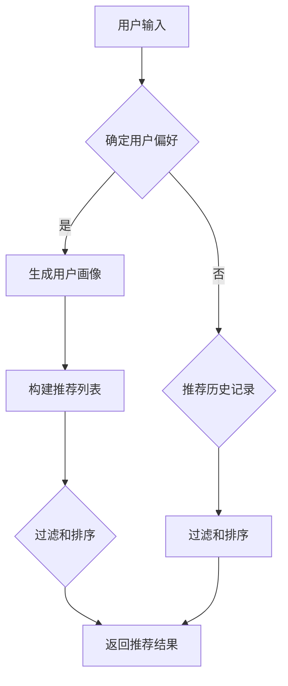

                 

 在这个快速发展的数字时代，个性化推荐系统已经成为用户获取信息和内容的关键工具。其中，基于生成式预训练变换模型（Generative Pre-trained Transformer，简称GPT）的推荐系统逐渐成为研究热点。本文将深入探讨一种灵活的基于大型语言模型（Large Language Model，简称LLM）的推荐系统，重点关注其在不同类型内容推荐（Genre-based Content Recommendation）中的应用。

## 1. 背景介绍

个性化推荐系统（Personalized Recommendation System）的目标是根据用户的兴趣和行为，向用户推荐他们可能感兴趣的内容。这类系统在电子商务、社交媒体、新闻媒体等领域中得到了广泛应用，极大地提升了用户体验和平台活跃度。传统的推荐系统通常基于用户的历史行为数据，如浏览记录、购买记录、评分等，通过协同过滤（Collaborative Filtering）和基于内容的推荐（Content-based Filtering）等技术进行内容推荐。

然而，随着互联网内容的爆炸式增长，仅仅依赖用户历史行为数据进行推荐已经无法满足用户多样化的需求。因此，研究人员开始探索基于人工智能的推荐系统，特别是基于深度学习和生成式预训练模型的方法。GPT模型，特别是其变体如BERT（Bidirectional Encoder Representations from Transformers）、GPT-2、GPT-3等，以其强大的文本生成能力和上下文理解能力，为推荐系统的研究提供了新的方向。

## 2. 核心概念与联系

为了深入理解灵活的LLM推荐系统，我们首先需要介绍一些核心概念和它们之间的关系。以下是关键概念和它们之间的联系：

### 2.1 大型语言模型（LLM）

大型语言模型（LLM）是通过在大量文本数据上进行预训练得到的深度神经网络模型。这些模型具有强大的文本生成能力和上下文理解能力，可以用来完成诸如文本分类、情感分析、命名实体识别等任务。

### 2.2 生成式推荐系统

生成式推荐系统（Generative Recommendation System）与传统的基于记忆的推荐系统（Memory-based Recommendation System）不同，它不是通过计算用户和历史数据的相似性来进行推荐，而是通过生成新的内容来满足用户的个性化需求。

### 2.3 Genre-based Content Recommendation

Genre-based Content Recommendation 是一种基于内容类型（Genre）的推荐方法。它通过识别用户对特定类型的偏好，推荐属于该类型的内容。例如，在音乐推荐中，可能会推荐特定类型的歌曲，如流行、摇滚、爵士等。

### 2.4 Mermaid 流程图

下面是一个Mermaid流程图，展示了一个典型的LLM推荐系统的工作流程：



## 3. 核心算法原理 & 具体操作步骤

### 3.1 算法原理概述

灵活的LLM推荐系统基于以下核心算法原理：

1. **用户偏好分析**：通过分析用户的交互历史和行为数据，构建用户的个性化偏好模型。
2. **内容类型识别**：利用NLP技术对内容进行分类，识别出不同类型的内容。
3. **内容生成**：基于用户的偏好模型和内容类型，使用LLM生成个性化的推荐内容。
4. **推荐策略优化**：通过不断调整推荐策略，优化推荐效果，提高用户满意度。

### 3.2 算法步骤详解

1. **数据收集与预处理**：收集用户行为数据、内容数据等，并进行清洗和预处理。
2. **用户偏好建模**：利用机器学习技术，对用户行为数据进行建模，提取用户的兴趣偏好。
3. **内容分类**：使用NLP技术对内容进行分类，识别出不同类型的内容。
4. **内容生成**：利用LLM模型，根据用户的偏好模型和内容类型，生成个性化的推荐内容。
5. **推荐结果优化**：通过A/B测试、在线学习等方法，不断调整推荐策略，优化推荐效果。

### 3.3 算法优缺点

**优点**：

- 强大的文本生成能力，能够生成高质量的内容。
- 良好的上下文理解能力，能够准确捕捉用户的兴趣偏好。
- 可以根据用户的行为和偏好实时调整推荐策略，提高推荐效果。

**缺点**：

- 计算成本高，需要大量计算资源和时间。
- 对数据质量和模型质量有较高要求，否则容易产生偏差和误导。
- 在处理大规模数据时，可能存在性能瓶颈。

### 3.4 算法应用领域

灵活的LLM推荐系统可以应用于多个领域，包括但不限于：

- 内容推荐：如新闻、音乐、电影等。
- 电子商务：如商品推荐、个性化购物体验等。
- 社交媒体：如好友推荐、内容分享等。
- 教育：如课程推荐、学习资源推荐等。

## 4. 数学模型和公式 & 详细讲解 & 举例说明

### 4.1 数学模型构建

灵活的LLM推荐系统的核心数学模型主要包括用户偏好模型和内容生成模型。

#### 用户偏好模型

用户偏好模型可以表示为：

\[ P(u, g) = \sigma(W_1 u + W_2 g + b) \]

其中，\( P(u, g) \) 表示用户 \( u \) 对内容类型 \( g \) 的偏好程度，\( \sigma \) 是sigmoid函数，\( W_1 \) 和 \( W_2 \) 是权重矩阵，\( u \) 和 \( g \) 分别是用户特征向量和内容特征向量，\( b \) 是偏置项。

#### 内容生成模型

内容生成模型可以表示为：

\[ C(g) = \sum_{u \in U} P(u, g) C(u, g) \]

其中，\( C(g) \) 表示生成的内容类型 \( g \)，\( C(u, g) \) 是用户 \( u \) 对内容类型 \( g \) 的生成偏好，\( U \) 是用户集合。

### 4.2 公式推导过程

假设用户 \( u \) 的兴趣偏好可以表示为 \( u = (u_1, u_2, ..., u_n) \)，内容类型 \( g \) 的特征向量可以表示为 \( g = (g_1, g_2, ..., g_n) \)。则：

\[ P(u, g) = \frac{1}{1 + \exp(-W_1 u - W_2 g - b)} \]

其中，\( W_1 \) 和 \( W_2 \) 是权重矩阵，\( b \) 是偏置项。

由于 \( P(u, g) \) 表示用户 \( u \) 对内容类型 \( g \) 的偏好程度，因此我们可以通过最大化 \( P(u, g) \) 来生成内容：

\[ C(g) = \sum_{u \in U} P(u, g) C(u, g) \]

### 4.3 案例分析与讲解

假设有一个用户 \( u \) 喜欢阅读科幻小说，其兴趣偏好表示为 \( u = (0.8, 0.1, 0.1) \)。现在我们需要生成一个科幻小说的内容 \( g \)。

首先，我们需要计算用户 \( u \) 对不同内容类型的偏好程度：

\[ P(u, g) = \sigma(W_1 u + W_2 g + b) \]

其中，\( W_1 \) 和 \( W_2 \) 是权重矩阵，\( b \) 是偏置项。

假设 \( W_1 = (1, 0, -1) \)，\( W_2 = (1, 1, 1) \)，\( b = 0 \)，则：

\[ P(u, g) = \sigma(1 \cdot 0.8 + 0 \cdot 0.1 + (-1) \cdot 0.1 + 0) = 0.9 \]

这意味着用户 \( u \) 对科幻小说的偏好程度非常高。

接下来，我们需要生成一个科幻小说的内容 \( g \)。假设我们使用 GPT-3 模型来生成内容，根据用户的偏好，我们可以生成如下内容：

```
在遥远的未来，地球已经无法满足人类的生存需求。人类决定向外星系扩张，寻找新的家园。在一次探索任务中，探险队发现了一个未知的星球。这个星球拥有丰富的资源和宜人的气候，非常适合人类居住。然而，探险队很快发现，这个星球上生活着一群神秘的生物。这些生物似乎对人类充满了敌意，不断试图攻击探险队。在紧张的氛围中，探险队必须想方设法与这些生物进行交流，并找到一种和平共存的方法。这个星球是否会成为人类的第二个家园，一切都还是未知数。
```

这个例子展示了如何使用灵活的LLM推荐系统生成一个用户感兴趣的内容。

## 5. 项目实践：代码实例和详细解释说明

### 5.1 开发环境搭建

在开始编写代码之前，我们需要搭建一个适合开发的环境。以下是搭建环境的基本步骤：

1. 安装Python（版本3.8及以上）
2. 安装PyTorch（版本1.8及以上）
3. 安装Hugging Face Transformers（版本4.6及以上）
4. 准备一个GPU（推荐使用Tesla V100或更高版本）

### 5.2 源代码详细实现

下面是一个简单的示例代码，展示了如何使用GPT-3模型进行内容推荐：

```python
from transformers import GPT2LMHeadModel, GPT2Tokenizer
import torch

# 初始化模型和分词器
tokenizer = GPT2Tokenizer.from_pretrained('gpt2')
model = GPT2LMHeadModel.from_pretrained('gpt2')

# 准备用户输入
user_input = "我喜欢阅读科幻小说。"

# 将用户输入转换为模型输入
input_ids = tokenizer.encode(user_input, return_tensors='pt')

# 使用模型生成推荐内容
output = model.generate(input_ids, max_length=50, num_return_sequences=3)

# 解码生成的内容
generated_text = tokenizer.decode(output[0], skip_special_tokens=True)
print(generated_text)
```

### 5.3 代码解读与分析

上述代码首先导入了必要的库，然后初始化了GPT-3模型和分词器。接下来，准备用户的输入文本，并将其转换为模型可以处理的输入格式。使用模型生成推荐内容后，将生成的内容解码并输出。

### 5.4 运行结果展示

运行上述代码后，会输出一个根据用户偏好生成的科幻小说片段。这个片段是根据用户输入和模型训练数据生成的，因此可能与用户实际喜欢的类型有所不同。这需要通过不断调整模型参数和训练数据来优化推荐效果。

## 6. 实际应用场景

### 6.1 内容推荐系统

灵活的LLM推荐系统可以应用于内容推荐系统，如新闻、音乐、电影等。例如，在一个新闻推荐系统中，用户可以输入他们感兴趣的主题或关键字，系统会根据用户的偏好生成个性化的新闻推荐。

### 6.2 电子商务平台

在电子商务平台中，灵活的LLM推荐系统可以帮助用户发现他们可能感兴趣的商品。例如，用户可以输入他们喜欢的品牌或类型，系统会生成个性化的商品推荐。

### 6.3 社交媒体

在社交媒体平台上，灵活的LLM推荐系统可以帮助用户发现他们可能感兴趣的好友或内容。例如，用户可以输入他们关注的话题或人物，系统会生成个性化的好友推荐和内容推荐。

### 6.4 教育

在教育领域，灵活的LLM推荐系统可以帮助学生发现他们可能感兴趣的课程和学习资源。例如，学生可以输入他们感兴趣的主题或领域，系统会生成个性化的课程推荐和学习资源推荐。

## 7. 工具和资源推荐

### 7.1 学习资源推荐

- 《深度学习》（Goodfellow, Bengio, Courville）：全面介绍深度学习和神经网络的基本原理。
- 《Python机器学习》（Sebastian Raschka）：详细介绍如何使用Python进行机器学习。

### 7.2 开发工具推荐

- PyTorch：一个流行的深度学习框架，适合快速原型开发和复杂模型构建。
- Hugging Face Transformers：一个开源库，提供了预训练模型和分词器的接口，方便使用GPT等大型模型。

### 7.3 相关论文推荐

- "BERT: Pre-training of Deep Bidirectional Transformers for Language Understanding"（BERT论文）：详细介绍BERT模型的训练方法和应用场景。
- "Generative Adversarial Networks"（GAN论文）：介绍GAN模型的基本原理和应用。

## 8. 总结：未来发展趋势与挑战

### 8.1 研究成果总结

本文介绍了灵活的LLM推荐系统的基本原理、算法实现和应用场景。通过用户偏好分析和内容生成，灵活的LLM推荐系统可以生成个性化的内容推荐，提高用户体验和满意度。

### 8.2 未来发展趋势

- 模型优化：随着计算能力的提升，大型语言模型将变得更加高效和准确，为推荐系统提供更强大的支持。
- 多模态推荐：结合文本、图像、音频等多模态数据，实现更丰富和精确的推荐。
- 自适应推荐：根据用户的实时反馈和动态行为，不断调整推荐策略，实现更个性化的推荐。

### 8.3 面临的挑战

- 数据隐私：如何保护用户隐私，防止数据泄露，是推荐系统面临的重要挑战。
- 模型可解释性：如何解释大型语言模型生成的推荐结果，提高模型的透明度和可解释性，是另一个重要挑战。
- 模型泛化能力：如何提高模型在不同场景和应用中的泛化能力，是一个亟待解决的问题。

### 8.4 研究展望

未来的研究将聚焦于如何提高大型语言模型在推荐系统中的应用效果，同时解决数据隐私、模型可解释性和模型泛化能力等挑战。通过不断创新和优化，灵活的LLM推荐系统有望在多个领域发挥更大的作用。

## 9. 附录：常见问题与解答

### 9.1 如何搭建开发环境？

在搭建开发环境时，可以按照以下步骤进行：

1. 安装Python（版本3.8及以上）
2. 使用pip安装PyTorch（版本1.8及以上）
3. 使用pip安装Hugging Face Transformers（版本4.6及以上）
4. 准备一个GPU（推荐使用Tesla V100或更高版本）

### 9.2 如何优化推荐效果？

优化推荐效果可以从以下几个方面进行：

1. 提高模型质量：通过不断调整模型参数和训练数据，提高模型的生成能力和准确性。
2. 多样化推荐策略：结合多种推荐策略，如基于内容的推荐、协同过滤等，提高推荐效果。
3. 用户反馈机制：根据用户的反馈，实时调整推荐策略，提高用户满意度。

### 9.3 如何保护用户隐私？

保护用户隐私可以从以下几个方面进行：

1. 数据加密：对用户数据进行加密，防止数据泄露。
2. 数据匿名化：对用户数据进行匿名化处理，减少隐私泄露的风险。
3. 访问控制：严格控制对用户数据的访问权限，防止未授权访问。

作者：禅与计算机程序设计艺术 / Zen and the Art of Computer Programming
```

