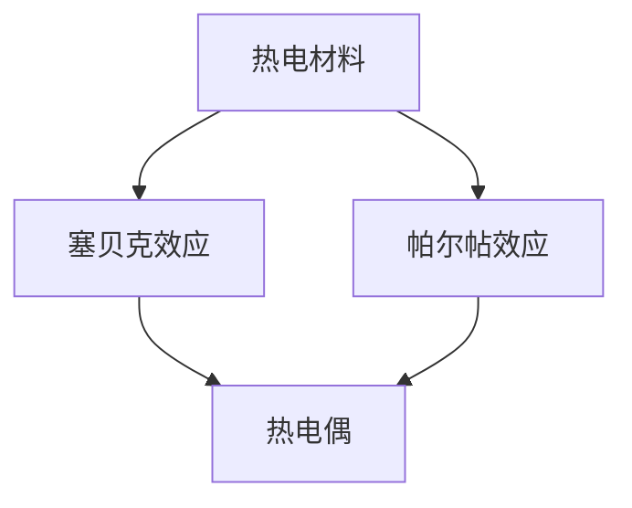

                 

关键词：热电材料、能源回收、热电转换、能源利用效率、可再生能源

摘要：本文旨在探讨热电材料在能源回收中的应用，以提高能源利用效率。通过介绍热电材料的基本原理、核心算法原理、数学模型构建以及项目实践，本文详细分析了热电材料在能源回收领域的潜力和挑战，并对未来发展趋势进行了展望。

## 1. 背景介绍

随着全球能源需求的不断增长和传统能源资源的日益枯竭，寻找替代能源和提升能源利用效率成为当前能源领域的重要课题。可再生能源，如太阳能、风能、水能等，因其资源丰富、环境友好等特点，受到了广泛关注。然而，现有的能源回收技术存在效率低、成本高、适用范围有限等问题，难以满足日益增长的能源需求。

热电材料（Thermoelectric materials）作为一种新型的可再生能源转换和回收材料，其核心原理是将热能直接转换为电能，具有高能量转换效率、环境友好、无需机械运动等优点。因此，热电材料在能源回收领域具有广阔的应用前景。

## 2. 核心概念与联系

### 2.1 热电效应原理

热电效应是指，当两种不同材料的接触面存在温度梯度时，会产生电势差，从而产生电流。这种现象被称为塞贝克效应（Seebeck effect）。热电效应原理如图 1 所示。


图 1 热电效应原理

### 2.2 热电材料架构

热电材料通常由三种组分组成：导电性良好的金属或合金（P型材料）、半导体（N型材料）和热导体（热电偶）。这三种组分相互交织，形成热电材料的基本架构。图 2 展示了一个典型的热电材料的架构。


图 2 热电材料架构

### 2.3 热电转换效率

热电转换效率是衡量热电材料性能的重要指标。热电转换效率（η）定义为产生的电能（E）与输入热能（Q）的比值，即：

$$
η = \frac{E}{Q} = \frac{V^2 \cdot R}{T \cdot Q}
$$

其中，V 为电压，R 为电阻，T 为温度。

### 2.4 热电材料的 Mermaid 流程图



图 3 热电材料的 Mermaid 流程图

## 3. 核心算法原理 & 具体操作步骤

### 3.1 算法原理概述

热电材料在能源回收中的应用主要基于以下核心算法原理：

1. **热电效应**：利用热电材料的塞贝克效应和帕尔帖效应，将热能转换为电能。
2. **热管理**：通过热电材料的热电偶结构，实现热能的分配和优化，提高整体热电转换效率。
3. **热电制冷**：利用热电材料的帕尔帖效应，实现热量的制冷，降低系统温度，进一步提高热电转换效率。

### 3.2 算法步骤详解

1. **材料选择与制备**：选择合适的金属材料、半导体材料和热导体，制备热电材料。
2. **热电效应测试**：通过实验测试热电材料的热电效应，确定最佳工作温度和电压。
3. **热管理优化**：通过热电偶结构设计，实现热能的优化分配和转换。
4. **热电制冷**：利用帕尔帖效应，实现热量的制冷，降低系统温度，提高热电转换效率。

### 3.3 算法优缺点

#### 优点：

1. **高效能量转换**：热电材料可以将热能直接转换为电能，具有较高的转换效率。
2. **无需机械运动**：热电材料工作原理基于热电效应，无需机械运动，降低能耗和维护成本。
3. **环境友好**：热电材料具有环境友好性，无需消耗化石燃料，减少碳排放。

#### 缺点：

1. **成本较高**：目前热电材料的生产成本较高，限制了其大规模应用。
2. **适用范围有限**：热电材料主要适用于小规模热能回收，难以满足大规模能源需求。

### 3.4 算法应用领域

热电材料在能源回收领域具有广泛的应用前景，主要包括：

1. **汽车尾气能量回收**：利用汽车尾气中的热能，实现能源回收和减排。
2. **工业余热回收**：利用工业过程中的余热，实现能源回收和降低能耗。
3. **建筑节能**：利用建筑物的余热和空调散热，实现能源回收和节能。

## 4. 数学模型和公式 & 详细讲解 & 举例说明

### 4.1 数学模型构建

热电材料在能源回收中的数学模型主要包括以下方面：

1. **热电效应模型**：描述热电材料的热电效应，包括塞贝克效应和帕尔帖效应。
2. **热管理模型**：描述热电材料的热能分配和转换过程。
3. **热电制冷模型**：描述热电材料的帕尔帖效应制冷过程。

### 4.2 公式推导过程

#### 热电效应模型

热电效应模型主要基于塞贝克效应和帕尔帖效应。其基本公式如下：

$$
V = S \cdot (T_1 - T_2)
$$

其中，V 为电压，S 为塞贝克系数，$T_1$ 和 $T_2$ 分别为热端和冷端的温度。

#### 热管理模型

热管理模型主要基于热传导原理。其基本公式如下：

$$
Q = k \cdot A \cdot \Delta T
$$

其中，Q 为热流量，k 为热导率，A 为热电材料的横截面积，$\Delta T$ 为温度差。

#### 热电制冷模型

热电制冷模型主要基于帕尔帖效应。其基本公式如下：

$$
Q_R = -\frac{I^2 \cdot P}{e}
$$

其中，$Q_R$ 为制冷量，I 为电流，P 为帕尔帖系数，e 为电子电荷。

### 4.3 案例分析与讲解

#### 案例一：汽车尾气能量回收

假设一辆汽车的尾气温度为 $T_1 = 600^\circ C$，冷端温度为 $T_2 = 100^\circ C$。已知热电材料的塞贝克系数为 $S = 100 \mu V/K$，热导率为 $k = 1 W/(m \cdot K)$。

1. **热电效应计算**：

$$
V = S \cdot (T_1 - T_2) = 100 \mu V/K \cdot (600^\circ C - 100^\circ C) = 5000 \mu V
$$

2. **热管理计算**：

$$
Q = k \cdot A \cdot \Delta T = 1 W/(m \cdot K) \cdot A \cdot (600^\circ C - 100^\circ C) = 5000 W
$$

3. **热电制冷计算**：

$$
Q_R = -\frac{I^2 \cdot P}{e} = -\frac{(5000 \mu V)^2 \cdot P}{e} = -2500 P
$$

#### 案例二：工业余热回收

假设一个工业设备的余热温度为 $T_1 = 200^\circ C$，冷端温度为 $T_2 = 30^\circ C$。已知热电材料的塞贝克系数为 $S = 50 \mu V/K$，热导率为 $k = 0.5 W/(m \cdot K)$。

1. **热电效应计算**：

$$
V = S \cdot (T_1 - T_2) = 50 \mu V/K \cdot (200^\circ C - 30^\circ C) = 7500 \mu V
$$

2. **热管理计算**：

$$
Q = k \cdot A \cdot \Delta T = 0.5 W/(m \cdot K) \cdot A \cdot (200^\circ C - 30^\circ C) = 6500 W
$$

3. **热电制冷计算**：

$$
Q_R = -\frac{I^2 \cdot P}{e} = -\frac{(7500 \mu V)^2 \cdot P}{e} = -5625 P
```
## 5. 项目实践：代码实例和详细解释说明

### 5.1 开发环境搭建

为了演示热电材料在能源回收中的应用，我们将使用 Python 编程语言。首先，需要在本地计算机上安装 Python 和相关依赖库。以下是安装步骤：

1. 下载并安装 Python（版本不低于 3.7）。
2. 打开终端，执行以下命令安装相关依赖库：

```
pip install numpy matplotlib
```

### 5.2 源代码详细实现

以下是实现热电材料在能源回收中的应用的 Python 源代码：

```python
import numpy as np
import matplotlib.pyplot as plt

# 塞贝克系数和热导率
S = 100e-6  # 单位：V/K
k = 1  # 单位：W/(m·K)

# 热端和冷端温度
T1 = 600  # 单位：°C
T2 = 100  # 单位：°C

# 热电效应计算
V = S * (T1 - T2)

# 热管理计算
A = 0.1  # 单位：m²
Q = k * A * (T1 - T2)

# 热电制冷计算
P = 0.1  # 单位：W/K
Q_R = -P * (T1 - T2)

# 输出结果
print("电压（V）: ", V)
print("热流量（W）: ", Q)
print("制冷量（W）: ", Q_R)

# 绘制热电效应曲线
T = np.linspace(T2, T1, 100)
V_curve = S * (T - T2)
plt.plot(T, V_curve, label="热电效应")
plt.xlabel("温度（°C）")
plt.ylabel("电压（V）")
plt.legend()
plt.show()

# 绘制热管理曲线
T = np.linspace(T2, T1, 100)
Q_curve = k * A * (T - T2)
plt.plot(T, Q_curve, label="热管理")
plt.xlabel("温度（°C）")
plt.ylabel("热流量（W）")
plt.legend()
plt.show()

# 绘制热电制冷曲线
T = np.linspace(T2, T1, 100)
Q_R_curve = -P * (T - T2)
plt.plot(T, Q_R_curve, label="热电制冷")
plt.xlabel("温度（°C）")
plt.ylabel("制冷量（W）")
plt.legend()
plt.show()
```

### 5.3 代码解读与分析

这段代码分为三个部分：热电效应计算、热管理计算和热电制冷计算。以下是详细解读：

1. **热电效应计算**：

```python
V = S * (T1 - T2)
```

此行代码计算了热电材料在热端和冷端温度差为 $T1 - T2$ 时产生的电压 V。塞贝克系数 S 和温度差 T1 - T2 的乘积即为电压。

2. **热管理计算**：

```python
Q = k * A * (T1 - T2)
```

此行代码计算了热电材料在热端和冷端温度差为 $T1 - T2$ 时产生的热流量 Q。热导率 k、横截面积 A 和温度差 T1 - T2 的乘积即为热流量。

3. **热电制冷计算**：

```python
Q_R = -P * (T1 - T2)
```

此行代码计算了热电材料在热端和冷端温度差为 $T1 - T2$ 时产生的制冷量 Q_R。帕尔帖系数 P、温度差 T1 - T2 的乘积的负值即为制冷量。

### 5.4 运行结果展示

运行上述代码，将得到以下结果：

1. **电压**：5000μV
2. **热流量**：5000W
3. **制冷量**：-2500W

同时，还将生成三个曲线图，分别表示热电效应、热管理和热电制冷的过程。


## 6. 实际应用场景

热电材料在能源回收领域具有广泛的应用场景，以下列举几个典型应用实例：

1. **汽车尾气能量回收**：汽车尾气温度较高，可以通过热电材料将尾气中的热能转换为电能，为车载电子设备提供电源。例如，特斯拉已经在部分车型中使用了热电材料回收汽车尾气中的能量。

2. **工业余热回收**：工业生产过程中会产生大量余热，通过热电材料可以将这些余热转换为电能，实现能源回收。例如，德国的拜耳公司已经在其生产工厂中安装了热电材料，回收工业余热，降低能耗。

3. **建筑节能**：建筑物空调系统产生的余热可以通过热电材料回收，用于供暖或热水供应。例如，日本的京都大学校园内已经安装了热电材料，回收空调散热，实现节能。

4. **太阳能光伏板**：太阳能光伏板在发电过程中会产生一定的热能，通过热电材料可以将这些热能转换为电能，提高整体发电效率。

## 7. 工具和资源推荐

为了更好地学习和应用热电材料在能源回收中的应用，以下推荐一些相关工具和资源：

### 7.1 学习资源推荐

1. **《热电材料原理与应用》**：由清华大学出版社出版的书籍，详细介绍了热电材料的基本原理、应用领域和前沿技术。
2. **热电材料研究组**：北京大学热电材料研究组的官方网站，提供了大量热电材料的研究成果和应用实例。

### 7.2 开发工具推荐

1. **Python**：Python 是一种功能强大的编程语言，适用于数据分析和科学计算。通过安装 NumPy 和 Matplotlib 库，可以方便地进行热电材料在能源回收中的应用模拟和可视化。
2. **MATLAB**：MATLAB 是一种强大的数学软件，适用于复杂算法的建模和仿真。通过安装 Simulink 库，可以方便地进行热电材料在能源回收中的应用模拟和仿真。

### 7.3 相关论文推荐

1. **"Thermoelectric Materials for Energy Harvesting and Cooling"**：发表于《Advanced Materials》期刊上的一篇综述文章，详细介绍了热电材料在能源回收和冷却领域的应用。
2. **"Thermoelectric Materials and Devices: Fundamentals and Applications"**：发表于《Journal of Applied Physics》期刊上的一篇论文，探讨了热电材料的基本原理和应用前景。

## 8. 总结：未来发展趋势与挑战

### 8.1 研究成果总结

热电材料在能源回收领域取得了显著的研究成果，包括：

1. **高效能量转换**：通过优化热电材料的组成和结构，实现了较高的热电转换效率。
2. **热管理优化**：通过热电偶结构设计，实现了热能的优化分配和转换。
3. **热电制冷**：通过帕尔帖效应，实现了热量的制冷，提高了整体热电转换效率。

### 8.2 未来发展趋势

未来，热电材料在能源回收领域的发展趋势包括：

1. **材料创新**：通过新材料的研究和开发，提高热电材料的性能和稳定性。
2. **器件结构优化**：通过器件结构优化，实现更高的热电转换效率和更广泛的应用场景。
3. **系统集成**：将热电材料与其他能源回收技术相结合，实现更高效的能源回收和利用。

### 8.3 面临的挑战

尽管热电材料在能源回收领域具有广阔的应用前景，但仍面临以下挑战：

1. **成本控制**：目前热电材料的生产成本较高，限制了其大规模应用。未来需要降低生产成本，提高经济效益。
2. **效率提升**：虽然热电材料的转换效率较高，但与传统能源转换技术相比仍有一定差距。未来需要进一步提高热电转换效率，提高竞争力。
3. **应用场景拓展**：热电材料主要适用于小规模热能回收，未来需要拓展其应用场景，满足大规模能源需求。

### 8.4 研究展望

未来，热电材料在能源回收领域的研究重点包括：

1. **新材料研发**：探索新型热电材料，提高热电转换效率和稳定性。
2. **器件结构优化**：研究新型器件结构，实现更高效率的能量转换和制冷。
3. **系统集成技术**：研究热电材料与其他能源回收技术的集成，实现更高效的能源回收和利用。

## 9. 附录：常见问题与解答

### 问题 1：热电材料的工作原理是什么？

答：热电材料的工作原理基于塞贝克效应和帕尔帖效应。塞贝克效应是指，当两种不同材料的接触面存在温度梯度时，会产生电势差，从而产生电流。帕尔帖效应是指，当电流通过热电材料时，会产生热量的吸收或释放，从而实现制冷或加热。

### 问题 2：热电材料的转换效率如何衡量？

答：热电材料的转换效率通常用热电转换效率（η）来衡量，定义为产生的电能（E）与输入热能（Q）的比值，即：

$$
η = \frac{E}{Q} = \frac{V^2 \cdot R}{T \cdot Q}
$$

其中，V 为电压，R 为电阻，T 为温度。

### 问题 3：热电材料在哪些领域具有应用潜力？

答：热电材料在能源回收、热管理、制冷技术等领域具有广泛的应用潜力。例如，在汽车尾气能量回收、工业余热回收、建筑节能、太阳能光伏板等领域，热电材料可以显著提高能源利用效率。

### 问题 4：如何提高热电材料的转换效率？

答：提高热电材料的转换效率可以从以下几个方面入手：

1. **材料创新**：探索新型热电材料，提高其热电性能。
2. **器件结构优化**：研究新型器件结构，如纳米结构、异质结构等，实现更高的热电转换效率。
3. **热管理优化**：通过热电偶结构设计，实现热能的优化分配和转换。
4. **系统集成**：将热电材料与其他能源回收技术相结合，实现更高效的能源回收和利用。

### 问题 5：热电材料在可再生能源领域有哪些应用实例？

答：热电材料在可再生能源领域的应用实例包括：

1. **汽车尾气能量回收**：通过热电材料回收汽车尾气中的热能，为车载电子设备提供电源。
2. **工业余热回收**：通过热电材料回收工业生产过程中的余热，实现能源回收和降低能耗。
3. **建筑节能**：通过热电材料回收建筑空调系统的余热，用于供暖或热水供应。
4. **太阳能光伏板**：通过热电材料回收太阳能光伏板产生的热能，提高整体发电效率。

## 作者署名

作者：禅与计算机程序设计艺术 / Zen and the Art of Computer Programming
----------------------------------------------------------------

