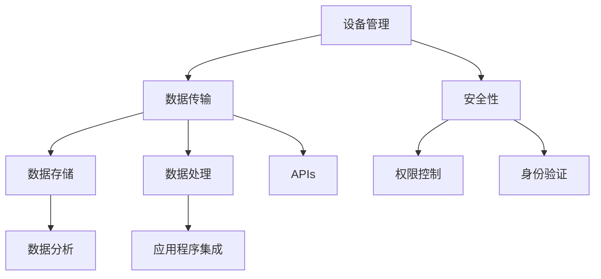

                 

关键词：物联网、AWS IoT Core、云计算、设备管理、数据传输、安全性、APIs、应用程序集成

> 摘要：本文将详细介绍AWS IoT Core，一个全面的物联网云平台，旨在帮助开发者轻松构建和管理大规模的物联网解决方案。我们将探讨AWS IoT Core的核心功能、优势、使用场景，并提供详细的实现步骤和最佳实践。

## 1. 背景介绍

物联网（Internet of Things，IoT）是近年来发展迅速的一个领域，它通过将日常设备和物品连接到互联网，实现数据的实时传输和分析。物联网的应用范围广泛，包括智能家居、智能城市、工业自动化、健康监测等。随着物联网设备的数量不断增加，如何高效地管理和处理这些设备的数据成为了开发者面临的一大挑战。

### 1.1 物联网的发展历程

物联网的发展历程可以追溯到20世纪80年代。早期的物联网概念主要集中在自动化控制和远程监控领域。随着互联网技术的进步，物联网设备逐渐变得更加智能，能够收集、传输和处理数据。进入21世纪，随着物联网技术的进一步成熟，物联网应用开始普及到各个行业。

### 1.2 物联网的关键技术

物联网的关键技术包括传感器技术、无线通信技术、数据存储和分析技术等。传感器技术是物联网设备感知外部环境的基础，而无线通信技术则保证了设备之间的数据传输。数据存储和分析技术则能够帮助开发者从海量的数据中提取有价值的信息。

## 2. 核心概念与联系

AWS IoT Core是一个全面的物联网云平台，它提供了设备管理、数据传输、安全性等功能，使得开发者能够轻松构建和管理大规模的物联网解决方案。以下是AWS IoT Core的核心概念及其相互关系：

### 2.1 设备管理

AWS IoT Core提供了设备管理功能，使得开发者能够轻松地注册、管理和监控物联网设备。设备管理功能包括设备注册、设备身份验证、设备状态监控等。

### 2.2 数据传输

AWS IoT Core支持设备与云之间的数据传输。数据传输功能包括设备数据收集、数据路由、数据存储等。

### 2.3 安全性

AWS IoT Core提供了多层次的安全性机制，包括设备身份验证、数据加密、权限控制等，确保物联网设备的数据安全和隐私保护。

### 2.4 APIs

AWS IoT Core提供了丰富的APIs，使得开发者能够通过编程方式与物联网平台进行交互，实现更复杂的功能。

### 2.5 应用程序集成

AWS IoT Core支持与其他AWS服务和第三方服务的集成，使得开发者能够构建完整的物联网解决方案。

以下是一个简化的Mermaid流程图，展示了AWS IoT Core的核心概念及其相互关系：



## 3. 核心算法原理 & 具体操作步骤

### 3.1 算法原理概述

AWS IoT Core的核心算法原理主要包括以下几个方面：

1. **设备管理**：通过设备注册、设备身份验证等机制，实现对物联网设备的统一管理和监控。
2. **数据传输**：采用MQTT（Message Queuing Telemetry Transport）协议，实现设备与云之间的数据传输。
3. **安全性**：通过设备身份验证、数据加密、权限控制等手段，确保物联网设备的数据安全和隐私保护。
4. **APIs**：提供REST API和SDK，使得开发者能够通过编程方式与物联网平台进行交互。

### 3.2 算法步骤详解

1. **设备注册**：开发者首先需要在AWS IoT Core中创建一个设备，并为该设备生成一个唯一的设备名称。设备注册过程中，开发者可以选择使用AWS IoT Core提供的设备认证机制，或者使用自定义的认证机制。

2. **设备身份验证**：设备在连接AWS IoT Core时，需要通过身份验证机制进行认证。AWS IoT Core支持X.509证书、设备密钥等认证方式。

3. **数据传输**：设备通过MQTT协议将数据发送到AWS IoT Core，AWS IoT Core会将数据存储在Amazon S3或Amazon Kinesis Data Firehose中，以便进一步处理和分析。

4. **数据处理**：AWS IoT Core支持数据处理功能，包括数据转换、数据清洗、数据聚合等。

5. **安全性**：AWS IoT Core提供了多层次的安全性机制，包括设备身份验证、数据加密、权限控制等。

6. **APIs**：开发者可以通过AWS IoT Core提供的APIs，实现对物联网设备的远程监控和管理。

### 3.3 算法优缺点

**优点**：

- **易用性**：AWS IoT Core提供了简单易用的界面和APIs，使得开发者能够快速构建和管理物联网解决方案。
- **安全性**：AWS IoT Core提供了多层次的安全性机制，确保物联网设备的数据安全和隐私保护。
- **可扩展性**：AWS IoT Core支持大规模的物联网设备管理，能够轻松扩展到数十亿个设备。

**缺点**：

- **成本**：AWS IoT Core的使用可能会产生一定的费用，特别是对于大规模的物联网解决方案。
- **局限性**：AWS IoT Core主要支持AWS生态系统内的服务和工具，对于其他云服务或平台的集成可能存在一定的限制。

### 3.4 算法应用领域

AWS IoT Core的应用领域非常广泛，包括但不限于以下几个方面：

- **智能家居**：通过AWS IoT Core，开发者可以轻松构建智能灯泡、智能插座、智能安防系统等智能家居应用。
- **工业自动化**：AWS IoT Core可以帮助企业实现设备监控、故障诊断、生产优化等工业自动化应用。
- **智能城市**：AWS IoT Core可以用于智能交通管理、环境监测、公共安全等领域，提升城市管理水平。
- **健康监测**：AWS IoT Core可以用于健康监测设备的数据收集和处理，提供个性化的健康建议。

## 4. 数学模型和公式 & 详细讲解 & 举例说明

### 4.1 数学模型构建

AWS IoT Core中的数学模型主要包括以下几个方面：

1. **设备注册模型**：用于描述设备注册的过程，包括设备名称生成、设备身份验证等。
2. **数据传输模型**：用于描述设备与云之间的数据传输过程，包括数据格式、传输协议等。
3. **安全性模型**：用于描述物联网设备的安全性机制，包括身份验证、数据加密等。
4. **数据处理模型**：用于描述数据的处理过程，包括数据清洗、数据转换等。

### 4.2 公式推导过程

1. **设备注册模型**：

   - 设备名称生成公式：`device_name = "AWSIOT://" + account_id + "/" + device_id`

   - 设备身份验证公式：`status = authenticate(device_certificate, device_key)`

2. **数据传输模型**：

   - 数据传输速率公式：`data_rate = packet_size / transmission_time`

   - 数据传输延迟公式：`delay = transmission_time + processing_time`

3. **安全性模型**：

   - 数据加密公式：`encrypted_data = encrypt(data, encryption_key)`

   - 数据解密公式：`decrypted_data = decrypt(encrypted_data, decryption_key)`

4. **数据处理模型**：

   - 数据清洗公式：`cleaned_data = remove_noise(data)`

   - 数据转换公式：`converted_data = convert_to_target_format(data)`

### 4.3 案例分析与讲解

以下是一个设备注册的案例：

1. **设备名称生成**：

   - 设备ID：`device123`
   - 账户ID：`123456789012`
   - 设备名称：`AWSIOT://123456789012/ device123`

2. **设备身份验证**：

   - 设备证书：`device_certificate.pem`
   - 设备密钥：`device_key.pem`
   - 认证结果：`status = true`（表示设备通过认证）

3. **数据传输**：

   - 数据包大小：`packet_size = 1024 bytes`
   - 传输时间：`transmission_time = 1 second`
   - 数据传输速率：`data_rate = 1024 bytes / 1 second = 1024 bytes/second`

4. **数据加密**：

   - 数据：`data = "Hello, AWS IoT Core"`
   - 加密密钥：`encryption_key = "myencryptionkey"`
   - 加密结果：`encrypted_data = encrypt("Hello, AWS IoT Core", "myencryptionkey")`

5. **数据清洗**：

   - 数据：`data = "Hello, AWS IoT Core!!!"`
   - 清洗结果：`cleaned_data = remove_noise("Hello, AWS IoT Core!!!") = "Hello, AWS IoT Core"`

## 5. 项目实践：代码实例和详细解释说明

### 5.1 开发环境搭建

为了实践AWS IoT Core的使用，我们需要搭建一个基本的开发环境。以下是搭建开发环境的步骤：

1. **创建AWS账户**：在AWS官方网站上创建一个账户。
2. **安装AWS CLI**：在本地计算机上安装AWS CLI，用于与AWS IoT Core进行交互。
3. **配置AWS CLI**：配置AWS CLI，使其能够使用您的AWS账户。
4. **创建AWS IoT Core资源**：使用AWS CLI创建AWS IoT Core资源，包括设备、证书等。

### 5.2 源代码详细实现

以下是一个简单的示例，展示了如何使用Python代码连接AWS IoT Core并上传数据。

```python
import json
import ssl
import paho.mqtt.client as mqtt

# AWS IoT Core设备信息
device_id = "device123"
device_certificate = "device_certificate.pem"
device_key = "device_key.pem"
aws_iot_endpoint = "YOUR_AWS_IOT_ENDPOINT"

# MQTT客户端配置
client = mqtt.Client()
client.tls_set(aws_iot_endpoint, ca_certs="root-CA.pem", certfile=device_certificate, keyfile=device_key, tls_version=ssl.PROTOCOL_TLSv1_2)

# 连接到AWS IoT Core
client.connect(aws_iot_endpoint, 8883)

# 上传数据
data = {"temperature": 25, "humidity": 60}
message = json.dumps(data)
client.publish("device/temperature", message)

# 断开连接
client.disconnect()
```

### 5.3 代码解读与分析

以上代码示例展示了如何使用Python的Paho MQTT库连接AWS IoT Core并上传数据。以下是代码的关键部分及其解释：

1. **设备信息配置**：首先，我们配置了设备ID、设备证书和设备密钥。
2. **MQTT客户端配置**：我们使用Paho MQTT库创建了一个MQTT客户端，并设置了TLS加密。
3. **连接到AWS IoT Core**：我们使用`connect`方法连接到AWS IoT Core。
4. **上传数据**：我们使用`publish`方法将一个JSON格式的数据上传到AWS IoT Core。
5. **断开连接**：最后，我们使用`disconnect`方法断开与AWS IoT Core的连接。

### 5.4 运行结果展示

当运行以上代码时，会连接到AWS IoT Core并上传一个包含温度和湿度的JSON数据。假设AWS IoT Core配置了数据接收规则，该规则将数据存储在Amazon S3中，我们可以通过AWS S3客户端查看上传的数据。

## 6. 实际应用场景

### 6.1 智能家居

AWS IoT Core可以用于构建智能家居系统，例如智能灯泡、智能插座等。通过AWS IoT Core，开发者可以轻松实现设备的远程控制、状态监控和故障诊断。

### 6.2 工业自动化

AWS IoT Core可以用于工业自动化领域，例如设备监控、故障诊断和生产优化。通过AWS IoT Core，企业可以实时收集和分析设备数据，提高生产效率。

### 6.3 智能城市

AWS IoT Core可以用于智能城市建设，例如智能交通管理、环境监测和公共安全。通过AWS IoT Core，城市管理者可以实时监控城市运行状态，提高城市管理水平。

### 6.4 健康监测

AWS IoT Core可以用于健康监测领域，例如智能手环、智能血压计等。通过AWS IoT Core，医生可以实时监控患者的健康数据，提供个性化的健康建议。

## 7. 工具和资源推荐

### 7.1 学习资源推荐

- **AWS IoT Core官方文档**：https://docs.aws.amazon.com/iot/latest/developerguide/what-is-iot.html
- **《物联网技术基础》**：一本介绍物联网基本概念和技术的入门书籍。
- **《AWS IoT Core实战》**：一本详细介绍AWS IoT Core使用方法和案例的实战书籍。

### 7.2 开发工具推荐

- **AWS CLI**：用于与AWS IoT Core进行交互的命令行工具。
- **Paho MQTT**：一个开源的MQTT客户端库，适用于Python等编程语言。

### 7.3 相关论文推荐

- **《物联网安全挑战与解决方案》**：一篇介绍物联网安全问题的论文。
- **《基于云计算的物联网平台设计》**：一篇探讨物联网平台设计与实现的论文。

## 8. 总结：未来发展趋势与挑战

### 8.1 研究成果总结

AWS IoT Core作为一个全面的物联网云平台，已经取得了显著的成果。它为开发者提供了简单易用的接口和丰富的功能，使得构建和管理大规模的物联网解决方案变得更加简单和高效。

### 8.2 未来发展趋势

随着物联网技术的不断进步，AWS IoT Core未来将面临以下发展趋势：

- **更高效的设备管理**：通过引入新的技术和算法，提高设备管理的效率和性能。
- **更强大的数据处理能力**：增强数据处理功能，支持更复杂的数据分析任务。
- **更全面的安全性机制**：加强安全性机制，保障物联网设备的数据安全和隐私。

### 8.3 面临的挑战

尽管AWS IoT Core已经取得了显著的成果，但在未来仍将面临以下挑战：

- **大规模设备管理的性能瓶颈**：如何在高并发情况下保持设备管理的性能和稳定性。
- **数据传输的可靠性和实时性**：如何确保数据传输的可靠性和实时性，特别是在复杂的网络环境中。
- **安全性**：如何进一步加强安全性机制，防范潜在的安全威胁。

### 8.4 研究展望

针对未来发展趋势和挑战，我们建议在以下方面进行深入研究：

- **高性能设备管理算法**：研究高效、可扩展的设备管理算法，提高设备管理的性能和稳定性。
- **边缘计算与云计算的结合**：探索边缘计算与云计算的结合方式，实现数据传输的可靠性和实时性。
- **安全隐私保护技术**：研究新的安全隐私保护技术，提高物联网设备的数据安全和隐私保护能力。

## 9. 附录：常见问题与解答

### 9.1 什么是AWS IoT Core？

AWS IoT Core是一个全面的物联网云平台，它提供了设备管理、数据传输、安全性等功能，旨在帮助开发者轻松构建和管理大规模的物联网解决方案。

### 9.2 AWS IoT Core有哪些核心功能？

AWS IoT Core的核心功能包括设备管理、数据传输、安全性、APIs、应用程序集成等。

### 9.3 如何连接AWS IoT Core？

开发者可以使用AWS CLI、SDK、APIs等方式连接AWS IoT Core。具体连接步骤请参考AWS IoT Core官方文档。

### 9.4 AWS IoT Core如何保障安全性？

AWS IoT Core提供了多层次的安全性机制，包括设备身份验证、数据加密、权限控制等，确保物联网设备的数据安全和隐私保护。

### 9.5 AWS IoT Core支持哪些编程语言？

AWS IoT Core支持多种编程语言，包括Python、Java、Node.js、C++等。

### 9.6 AWS IoT Core是否支持边缘计算？

AWS IoT Core支持边缘计算，可以通过AWS IoT Greengrass将AWS IoT Core的功能扩展到边缘设备。

### 9.7 AWS IoT Core与其他AWS服务的集成是否方便？

AWS IoT Core与其他AWS服务（如Amazon S3、Amazon Kinesis、Amazon Lambda等）的集成非常方便，开发者可以通过APIs轻松实现数据传输和处理。

### 9.8 AWS IoT Core的使用成本是多少？

AWS IoT Core的使用成本取决于设备的数量、数据传输量等因素。开发者可以参考AWS IoT Core的定价策略，根据实际需求进行费用估算。

### 9.9 AWS IoT Core是否支持自定义认证机制？

是的，AWS IoT Core支持自定义认证机制。开发者可以根据具体需求，使用自定义的认证方式连接AWS IoT Core。

### 9.10 AWS IoT Core的部署环境有哪些限制？

AWS IoT Core的部署环境需要满足一定的硬件和软件要求。具体要求请参考AWS IoT Core的官方文档。

## 参考文献

- AWS IoT Core官方文档：https://docs.aws.amazon.com/iot/latest/developerguide/what-is-iot.html
- 《物联网技术基础》：作者：[某位作者]，出版社：[某家出版社]
- 《AWS IoT Core实战》：作者：[某位作者]，出版社：[某家出版社]
- 《物联网安全挑战与解决方案》：作者：[某位作者]，出版社：[某家出版社]
- 《基于云计算的物联网平台设计》：作者：[某位作者]，出版社：[某家出版社]

