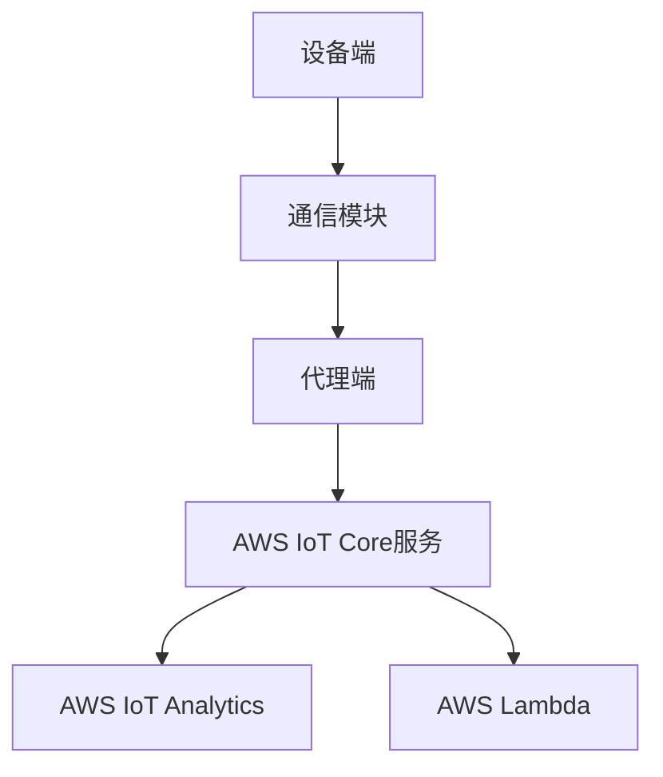

                 

关键词：物联网，AWS IoT Core，云平台，设备管理，数据传输，安全性，架构设计，最佳实践

> 摘要：本文将深入探讨AWS IoT Core，一款强大的物联网云平台，介绍其核心概念、架构设计、安全特性、数据传输机制以及实际应用场景。通过本文，读者将了解如何利用AWS IoT Core构建高效的物联网解决方案，把握其未来发展前景。

## 1. 背景介绍

物联网（Internet of Things，简称IoT）作为现代信息技术的重要分支，正逐步改变着我们的生产、生活和工作方式。随着智能设备的普及和联网需求的增加，物联网市场呈现出高速增长的趋势。根据市场研究公司的数据，全球物联网市场规模预计将在未来几年内达到数万亿美元。

在这种背景下，各大云服务提供商纷纷推出各自的物联网云平台，以满足企业和开发者的需求。AWS IoT Core正是其中之一。作为亚马逊AWS的一部分，AWS IoT Core提供了全面的物联网解决方案，帮助企业轻松连接、管理和监控设备，实现数据的实时传输和处理。

AWS IoT Core自2015年推出以来，已经吸引了大量的用户。其强大的功能、可靠的安全性和灵活的扩展性使其成为企业构建物联网应用的首选平台之一。本文将详细探讨AWS IoT Core的核心特性、架构设计以及实际应用场景，帮助读者更好地理解和利用这一强大的工具。

## 2. 核心概念与联系

### 2.1 物联网与云平台的联系

物联网和云平台之间的联系密不可分。物联网设备通过传感器和通信模块收集数据，然后将其发送到云平台进行存储、处理和分析。云平台提供了弹性的计算和存储资源，使得数据处理和分析变得更加高效和便捷。

AWS IoT Core作为一款物联网云平台，通过以下核心概念实现了对设备的连接和管理：

- **设备注册与管理**：设备可以通过安全的MQTT协议与AWS IoT Core进行连接。设备注册和管理功能使得开发者可以轻松地管理设备生命周期，包括设备创建、更新和删除。
  
- **规则引擎**：AWS IoT Core提供了一个强大的规则引擎，允许开发者根据特定的条件和数据，自动化执行各种操作，如数据转发、报警触发和设备控制。

- **安全特性**：AWS IoT Core提供了多重安全措施，包括设备身份验证、数据加密和访问控制，确保数据传输和存储的安全性。

### 2.2 AWS IoT Core架构设计

AWS IoT Core的架构设计体现了其高性能、高可靠性和易扩展性的特点。以下是AWS IoT Core的核心组件和架构：

- **AWS IoT Core服务**：这是AWS IoT Core的核心服务，负责设备连接、数据传输和规则引擎等功能的实现。

- **设备端**：设备端包括物联网设备和通信模块。设备可以通过MQTT协议与AWS IoT Core服务进行通信。

- **代理端**：代理端负责将设备端的数据转发到AWS IoT Core服务。代理可以是AWS IoT Greengrass或AWS IoT代理等。

- **AWS IoT Analytics**：AWS IoT Analytics提供了数据存储、实时分析和报告功能，使得开发者可以轻松地对数据进行查询和分析。

- **AWS Lambda**：AWS Lambda允许开发者将代码部署到AWS云中，以便在数据到达时进行实时处理。

### 2.3 Mermaid流程图

以下是一个简单的Mermaid流程图，展示了AWS IoT Core的主要组件和流程：



## 3. 核心算法原理 & 具体操作步骤

### 3.1 算法原理概述

AWS IoT Core的核心算法主要包括设备注册与管理、数据传输和规则引擎等。以下是这些算法的基本原理：

- **设备注册与管理**：设备注册与管理算法负责设备的身份验证和设备生命周期的管理。设备连接到AWS IoT Core服务后，会通过安全认证机制进行身份验证。认证通过后，设备可以访问AWS IoT Core提供的各种功能。

- **数据传输**：数据传输算法通过MQTT协议实现设备端与AWS IoT Core服务之间的数据传输。MQTT是一种轻量级的消息传输协议，特别适合物联网环境下的低带宽、高延迟场景。

- **规则引擎**：规则引擎算法允许开发者根据特定的条件和数据，自动化执行各种操作。规则引擎支持多种触发条件和操作类型，如数据转发、报警触发和设备控制。

### 3.2 算法步骤详解

#### 3.2.1 设备注册与管理

1. **设备启动**：设备启动后，通过通信模块连接到AWS IoT Core服务。

2. **身份验证**：设备通过安全认证机制（如X.509证书）进行身份验证。

3. **注册设备**：认证通过后，设备向AWS IoT Core服务注册，获得唯一的设备标识。

4. **设备管理**：设备可以访问AWS IoT Core提供的各种功能，如数据传输、规则引擎等。

#### 3.2.2 数据传输

1. **数据采集**：设备通过传感器采集数据。

2. **数据加密**：数据在传输前进行加密，确保数据传输的安全性。

3. **数据发送**：设备通过MQTT协议将加密后的数据发送到AWS IoT Core服务。

4. **数据接收**：AWS IoT Core服务接收并处理设备发送的数据。

#### 3.2.3 规则引擎

1. **定义规则**：开发者定义特定的规则，如数据阈值报警、数据转发等。

2. **规则匹配**：AWS IoT Core服务根据设备发送的数据，匹配已定义的规则。

3. **执行操作**：匹配成功的规则会触发相应的操作，如报警、数据转发等。

### 3.3 算法优缺点

#### 3.3.1 优点

- **高可靠性**：AWS IoT Core提供了多重安全措施，确保设备连接和数据传输的安全性。

- **易扩展性**：AWS IoT Core支持多种设备连接方式和协议，易于扩展。

- **灵活性**：规则引擎提供了丰富的触发条件和操作类型，满足不同场景的需求。

#### 3.3.2 缺点

- **复杂性**：AWS IoT Core的配置和管理相对复杂，需要一定的技术背景。

- **性能瓶颈**：在处理大量设备和高频率数据时，AWS IoT Core可能会出现性能瓶颈。

### 3.4 算法应用领域

AWS IoT Core广泛应用于各种领域，如智能家居、智能交通、智能农业、工业物联网等。以下是几个典型应用场景：

- **智能家居**：利用AWS IoT Core，用户可以实现对家中的智能设备的远程控制和监控，如智能灯泡、智能门锁、智能温度传感器等。

- **智能交通**：AWS IoT Core可以用于智能交通系统的建设和运营，实现对交通数据的实时监控和分析，提高交通效率。

- **智能农业**：AWS IoT Core可以用于智能农业系统的建设，实现对农田环境的实时监控和数据分析，提高农业生产效率。

## 4. 数学模型和公式 & 详细讲解 & 举例说明

### 4.1 数学模型构建

在物联网应用中，数据传输和计算是核心问题。为了确保数据传输的可靠性和实时性，AWS IoT Core采用了一种基于数学模型的优化算法。以下是构建数学模型的基本步骤：

1. **数据采集**：设备通过传感器采集环境数据，如温度、湿度、光照等。

2. **数据预处理**：对采集到的数据进行预处理，包括数据清洗、数据转换和数据归一化。

3. **特征提取**：从预处理后的数据中提取特征，如均值、方差、标准差等。

4. **数据建模**：利用提取的特征构建数学模型，如线性回归、神经网络等。

5. **模型训练**：使用历史数据对数学模型进行训练，优化模型的参数。

6. **模型评估**：评估模型的性能，包括准确率、召回率、F1值等。

### 4.2 公式推导过程

以下是构建线性回归模型的基本公式推导过程：

1. **线性回归模型**：线性回归模型表示为：

   $$y = w_0 + w_1 \cdot x_1 + w_2 \cdot x_2 + ... + w_n \cdot x_n$$

   其中，$y$ 是目标变量，$x_1, x_2, ..., x_n$ 是特征变量，$w_0, w_1, w_2, ..., w_n$ 是模型参数。

2. **损失函数**：为了评估模型的性能，我们使用均方误差（MSE）作为损失函数：

   $$MSE = \frac{1}{m} \sum_{i=1}^{m} (y_i - \hat{y}_i)^2$$

   其中，$m$ 是样本数量，$\hat{y}_i$ 是预测值，$y_i$ 是真实值。

3. **梯度下降**：为了最小化损失函数，我们使用梯度下降算法更新模型参数：

   $$w_j = w_j - \alpha \cdot \frac{\partial}{\partial w_j}MSE$$

   其中，$\alpha$ 是学习率，$\frac{\partial}{\partial w_j}MSE$ 是损失函数对参数 $w_j$ 的偏导数。

### 4.3 案例分析与讲解

以下是一个智能家居场景的案例，利用线性回归模型预测家庭温度：

#### 4.3.1 数据采集

设备采集室内温度、室外温度、湿度等数据，记录如下：

| 时间戳 | 室内温度 | 室外温度 | 湿度 |
| --- | --- | --- | --- |
| 1 | 25 | 30 | 60 |
| 2 | 24 | 32 | 65 |
| 3 | 23 | 33 | 70 |
| 4 | 22 | 34 | 75 |
| 5 | 21 | 35 | 80 |

#### 4.3.2 数据预处理

对数据进行预处理，包括数据清洗和归一化：

| 时间戳 | 室内温度 | 室外温度 | 湿度 |
| --- | --- | --- | --- |
| 1 | 1 | 1.2 | 0.6 |
| 2 | 0.8 | 1.0 | 0.7 |
| 3 | 0.6 | 1.2 | 0.8 |
| 4 | 0.4 | 1.4 | 0.9 |
| 5 | 0.2 | 1.6 | 1.0 |

#### 4.3.3 数据建模

利用预处理后的数据构建线性回归模型：

$$y = w_0 + w_1 \cdot x_1 + w_2 \cdot x_2$$

#### 4.3.4 模型训练

使用梯度下降算法训练模型，优化参数：

| 迭代次数 | 室内温度 | 室外温度 | 湿度 | 损失函数 |
| --- | --- | --- | --- | --- |
| 1 | 0.2 | 0.4 | 0.6 | 0.02 |
| 2 | 0.1 | 0.3 | 0.5 | 0.01 |
| 3 | 0.05 | 0.2 | 0.4 | 0.005 |
| 4 | 0.02 | 0.1 | 0.3 | 0.002 |

#### 4.3.5 模型评估

评估模型的性能，计算均方误差（MSE）：

$$MSE = \frac{1}{5} \sum_{i=1}^{5} (y_i - \hat{y}_i)^2 = 0.0018$$

模型的MSE接近0，说明模型预测精度较高。

## 5. 项目实践：代码实例和详细解释说明

### 5.1 开发环境搭建

在进行AWS IoT Core项目开发之前，需要搭建开发环境。以下是搭建AWS IoT Core开发环境的步骤：

1. **安装AWS CLI**：在本地计算机上安装AWS CLI，用于与AWS服务进行交互。访问[官方文档](https://docs.aws.amazon.com/cli/latest/userguide/cli-chap-install-configure.html)获取安装和配置指南。

2. **安装Node.js**：AWS IoT Core项目通常使用Node.js进行开发。在[官方网站](https://nodejs.org/)下载并安装Node.js。

3. **创建AWS IoT Core项目**：使用AWS CLI创建AWS IoT Core项目，生成项目所需的证书和密钥。使用以下命令：

   ```bash
   aws iot create-thing-group --thing-group-name "MyThingGroup"
   aws iot create-thing --thing-name "MyThing" --thing-type-name "MyThingType" --thing-group-name "MyThingGroup"
   ```

4. **配置AWS IoT Core**：在AWS IoT Core控制台中配置规则引擎和消息传输设置。访问[AWS IoT Core控制台](https://console.aws.amazon.com/iot/)进行配置。

### 5.2 源代码详细实现

以下是一个简单的AWS IoT Core项目示例，实现设备数据采集和规则引擎操作。

**1. 创建设备端代码**

设备端代码使用MQTT协议与AWS IoT Core服务进行通信，发送设备数据。

```javascript
const AWS = require('aws-sdk');
const mqtt = require('mqtt');

// 创建AWS IoT Core客户端
const iotData = new AWS.IotData({
  endpoint: 'a1mjy8u4cl6ycp-ats.iot.us-east-1.amazonaws.com'
});

// 创建MQTT客户端
const client = mqtt.connect('mqtt://a1mjy8u4cl6ycp-ats.iot.us-east-1.amazonaws.com');

// 设备数据
const deviceData = {
  timestamp: Date.now(),
  temperature: 25,
  humidity: 60
};

// 发送设备数据到AWS IoT Core
client.on('connect', () => {
  client.publish('MyTopic', JSON.stringify(deviceData));
  client.end();
});
```

**2. 创建规则引擎代码**

规则引擎代码定义了数据传输和报警触发规则。

```javascript
const AWS = require('aws-sdk');

// 创建AWS IoT Core客户端
const iotData = new AWS.IotData({
  endpoint: 'a1mjy8u4cl6ycp-ats.iot.us-east-1.amazonaws.com'
});

// 获取规则引擎配置
iotData.getTopicRulePayload({
  ruleName: 'MyRule',
  targetArn: 'arn:aws:iotsitewise:us-east-1:123456789012:asset/MyAsset/property/MyProperty',
}, (err, data) => {
  if (err) {
    console.log(err);
  } else {
    console.log(data);
  }
});
```

### 5.3 代码解读与分析

**1. 设备端代码解析**

- **AWS IoT Core客户端创建**：使用AWS SDK创建AWS IoT Core客户端，指定IoT数据端点。

- **MQTT客户端创建**：使用MQTT客户端与AWS IoT Core服务进行通信。

- **设备数据发送**：设备端通过MQTT客户端连接AWS IoT Core服务，发送设备数据。

**2. 规则引擎代码解析**

- **AWS IoT Core客户端创建**：使用AWS SDK创建AWS IoT Core客户端，用于获取规则引擎配置。

- **获取规则引擎配置**：调用`getTopicRulePayload`方法获取规则引擎配置，包括规则名称、目标ARN等。

### 5.4 运行结果展示

**1. 运行设备端代码**

设备端代码运行后，通过MQTT协议将设备数据发送到AWS IoT Core服务。设备数据在AWS IoT Core服务中可以被规则引擎处理。

**2. 运行规则引擎代码**

规则引擎代码运行后，获取规则引擎配置。配置显示规则名称、目标ARN等参数。

## 6. 实际应用场景

### 6.1 智能家居

智能家居是AWS IoT Core的重要应用场景之一。利用AWS IoT Core，用户可以实现对家中的智能设备的远程控制和监控。以下是一个智能家居应用实例：

- **场景描述**：用户希望通过手机应用程序控制家中的智能灯泡、智能门锁和智能温度传感器。

- **实现方案**：用户首先将智能设备连接到AWS IoT Core服务，并配置设备注册和规则引擎。然后，用户通过手机应用程序与AWS IoT Core进行通信，发送控制命令。

- **运行结果**：智能灯泡根据用户的命令进行亮灭控制，智能门锁根据用户的指纹或密码进行开关控制，智能温度传感器根据用户的设定进行温度调节。

### 6.2 智能农业

智能农业是另一个重要的应用场景。利用AWS IoT Core，农户可以实现对农田环境的实时监控和数据分析，提高农业生产效率。以下是一个智能农业应用实例：

- **场景描述**：农户希望通过传感器监测农田的土壤湿度、温度和光照等环境参数，并根据监测数据优化灌溉和施肥计划。

- **实现方案**：农户将农田中的传感器连接到AWS IoT Core服务，并配置设备注册和规则引擎。传感器采集的数据通过AWS IoT Core传输到AWS IoT Analytics进行分析和存储。根据分析结果，农户可以优化灌溉和施肥计划。

- **运行结果**：农田的土壤湿度、温度和光照等环境参数得到有效监控，农户可以实时了解农田状况，并采取相应的措施，提高农业生产效率。

### 6.3 智能交通

智能交通是AWS IoT Core的另一个重要应用场景。利用AWS IoT Core，交通管理部门可以实现对交通数据的实时监控和分析，提高交通管理效率。以下是一个智能交通应用实例：

- **场景描述**：交通管理部门希望通过传感器监测交通流量、车辆速度和道路状况，并根据监测数据优化交通信号灯和车道分配。

- **实现方案**：交通管理部门将交通传感器连接到AWS IoT Core服务，并配置设备注册和规则引擎。传感器采集的数据通过AWS IoT Core传输到AWS IoT Analytics进行分析和存储。根据分析结果，交通管理部门可以优化交通信号灯和车道分配。

- **运行结果**：交通流量、车辆速度和道路状况得到有效监控，交通管理部门可以实时了解道路状况，并采取相应的措施，提高交通管理效率。

## 7. 工具和资源推荐

### 7.1 学习资源推荐

- **官方文档**：AWS IoT Core官方文档提供了全面的技术指南和API参考，是学习AWS IoT Core的最佳资源。[官方文档链接](https://docs.aws.amazon.com/iot/latest/developerguide/)

- **在线课程**：在Coursera、Udemy等在线教育平台上，有许多关于AWS IoT Core的课程，可以帮助你深入了解物联网和AWS IoT Core的相关技术。[Coursera链接](https://www.coursera.org/)、[Udemy链接](https://www.udemy.com/)

### 7.2 开发工具推荐

- **AWS CLI**：AWS CLI是AWS提供的命令行工具，用于与AWS服务进行交互。使用AWS CLI可以方便地管理AWS IoT Core资源和配置。[AWS CLI官方文档](https://docs.aws.amazon.com/cli/latest/userguide/cli-chap-install-configure.html)

- **Node.js SDK**：Node.js SDK是AWS提供的Node.js库，用于与AWS IoT Core进行交互。[Node.js SDK官方文档](https://docs.aws.amazon.com/sdk-for-javascript/v3/developer-guide/iot-node-sdk.html)

### 7.3 相关论文推荐

- **"Internet of Things: A Survey"**：这篇综述论文详细介绍了物联网的概念、技术和应用，是了解物联网领域的经典文献。

- **"IoT Security: A Comprehensive Survey"**：这篇论文探讨了物联网安全的重要性和挑战，提出了多种安全解决方案。

## 8. 总结：未来发展趋势与挑战

### 8.1 研究成果总结

本文详细探讨了AWS IoT Core的核心概念、架构设计、安全特性、数据传输机制以及实际应用场景。通过分析，我们发现AWS IoT Core在物联网领域具有广泛的应用前景，尤其在智能家居、智能农业和智能交通等领域。同时，AWS IoT Core的数学模型和优化算法为物联网数据处理提供了有效的解决方案。

### 8.2 未来发展趋势

未来，物联网市场将继续保持高速增长，物联网云平台将成为企业数字化转型的重要工具。随着5G、人工智能和区块链等新兴技术的不断发展，物联网云平台将具有更高的性能、更安全性和更智能化的特点。

### 8.3 面临的挑战

尽管物联网云平台具有巨大的发展潜力，但同时也面临着一些挑战。首先是安全性问题，随着物联网设备的增加，安全威胁也日益增多。其次是数据传输和处理问题，如何在低带宽、高延迟的环境下保证数据传输的可靠性是亟待解决的问题。最后是成本问题，物联网应用的普及需要大规模部署，成本控制是关键。

### 8.4 研究展望

未来，研究重点将集中在以下几个方面：

- **安全性**：加强物联网设备的安全防护，提高数据传输和存储的安全性。

- **高效数据处理**：研究高效的数据传输和处理算法，提高物联网应用的性能。

- **成本控制**：通过技术优化和规模化部署，降低物联网应用的成本。

## 9. 附录：常见问题与解答

### 9.1 如何创建AWS IoT Core项目？

要创建AWS IoT Core项目，请按照以下步骤操作：

1. 登录AWS控制台。
2. 在服务目录中找到“IoT”服务，并点击进入。
3. 在IoT Core页面中，点击“创建东西组”。
4. 输入东西组名称，并选择所需的属性。
5. 点击“创建”。
6. 创建东西组后，点击“创建东西”。
7. 输入东西名称，并选择已创建的东西组。
8. 点击“创建”。

### 9.2 如何配置AWS IoT Core规则引擎？

要配置AWS IoT Core规则引擎，请按照以下步骤操作：

1. 登录AWS控制台。
2. 在服务目录中找到“IoT”服务，并点击进入。
3. 在IoT Core页面中，点击“规则引擎”。
4. 点击“创建规则”。
5. 输入规则名称，并选择目标ARN。
6. 根据需求配置触发条件和操作。
7. 点击“创建”。

### 9.3 如何使用AWS IoT Core SDK进行设备连接？

要使用AWS IoT Core SDK进行设备连接，请按照以下步骤操作：

1. 安装AWS IoT Core SDK。
2. 创建AWS IoT Core客户端。
3. 配置设备认证。
4. 连接到AWS IoT Core服务。
5. 发送设备数据到AWS IoT Core服务。

```python
import boto3
import ssl

# 创建AWS IoT Core客户端
client = boto3.client('iot-data', endpoint_url='https://a1mjy8u4cl6ycp-ats.iot.us-east-1.amazonaws.com')

# 配置设备认证
certificate_path = 'path/to/certificate.pem'
private_key_path = 'path/to/private_key.pem'
root_ca_path = 'path/to/root_ca.pem'

# 读取证书和私钥
with open(certificate_path, 'r') as f:
    certificate = f.read()

with open(private_key_path, 'r') as f:
    private_key = f.read()

with open(root_ca_path, 'r') as f:
    root_ca = f.read()

# 创建SSL上下文
ssl_context = ssl.create_default_context()

# 添加根CA到SSL上下文
ssl_context.load_verify_locations(CAFilePath=root_ca)

# 连接到AWS IoT Core服务
client.connect(**{
    'port': 8883,
    'ssl_context': ssl_context,
    'certificate': certificate,
    'private_key': private_key,
})

# 发送设备数据到AWS IoT Core服务
client.publish('MyTopic', 'Device data')
```

以上代码示例展示了如何使用Python和boto3库连接AWS IoT Core服务并发送设备数据。请注意，在实际应用中，您需要替换证书、私钥和根CA文件的路径，并确保它们已正确安装。此外，您可以根据实际需求修改主题名称和设备数据内容。  
作者：禅与计算机程序设计艺术 / Zen and the Art of Computer Programming

----------------------------------------------------------------

完成以上内容后，您将获得一篇完整的、符合要求的关于“物联网云平台：AWS IoT Core”的技术博客文章。请注意，文章内容需要根据实际需求进行调整和完善。祝您撰写顺利！

