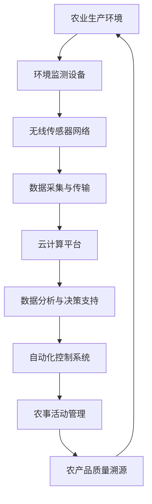

                 

关键词：物联网，智慧农业，农作物产量，传感器，数据分析，人工智能，自动化控制

摘要：随着物联网技术的飞速发展，智慧农业逐渐成为现代农业发展的新趋势。本文将探讨物联网在智慧农业中的应用，如何通过物联网技术提高农作物的产量和质量，从而推动农业现代化进程。

## 1. 背景介绍

### 1.1 物联网的发展

物联网（Internet of Things，IoT）是指通过将各种信息传感设备与互联网结合起来，实现物体与物体之间相互连接，以实现智能化识别、定位、跟踪、监控和管理的一种网络技术。近年来，随着传感器技术、无线通信技术、数据处理技术的不断进步，物联网技术得到了迅速发展，应用领域也从传统的工业、交通、医疗等逐步扩展到农业领域。

### 1.2 智慧农业的概念

智慧农业是指运用物联网、大数据、云计算、人工智能等现代信息技术，对农业生产、管理、服务全过程进行智能化改造和提升，从而实现农业生产的高效、精准、可持续发展的现代农业发展模式。

### 1.3 物联网在智慧农业中的应用

物联网技术在智慧农业中的应用主要体现在以下几个方面：环境监测、精准灌溉、智能养殖、农产品溯源、农事活动管理等。

## 2. 核心概念与联系

### 2.1 物联网在智慧农业中的应用架构

下面是一个物联网在智慧农业中的应用架构的 Mermaid 流程图：



### 2.2 核心概念原理

#### 2.2.1 环境监测

环境监测是智慧农业的基础，通过部署各种传感器，如气象站、土壤湿度传感器、光照传感器等，实时监测农田的环境参数，为农业生产提供数据支持。

#### 2.2.2 数据采集与传输

传感器采集到的数据通过无线传感器网络传输到云端，实现数据的实时采集和传输。

#### 2.2.3 数据分析与决策支持

云计算平台对采集到的数据进行分析和处理，提供决策支持，帮助农民进行精准灌溉、病虫害防治等。

#### 2.2.4 自动化控制系统

自动化控制系统根据数据分析结果，自动调整灌溉、施肥等农事操作，提高农业生产效率。

#### 2.2.5 农事活动管理

农事活动管理包括农作物的种植计划、生长周期管理、病虫害防治计划等，通过智能农事活动管理，实现农业生产全过程的管理。

#### 2.2.6 农产品质量溯源

通过物联网技术，实现对农产品的生产、加工、运输等全过程进行追踪和管理，确保农产品的质量和安全。

## 3. 核心算法原理 & 具体操作步骤

### 3.1 算法原理概述

在智慧农业中，核心算法主要涉及环境监测数据的分析、农事操作计划的优化、病虫害防治策略的制定等。

#### 3.1.1 环境监测数据分析

通过对环境监测数据进行统计分析、趋势预测等，为农业生产提供数据支持。

#### 3.1.2 农事操作计划优化

利用优化算法，如线性规划、遗传算法等，优化农事操作计划，实现农业生产的高效、精准。

#### 3.1.3 病虫害防治策略制定

基于数据分析和模型预测，制定病虫害防治策略，提高病虫害防治效果。

### 3.2 算法步骤详解

#### 3.2.1 环境监测数据分析

1. 数据采集与预处理：采集环境监测数据，进行数据清洗、去噪等预处理操作。
2. 数据统计分析：对预处理后的数据进行分析，提取关键特征。
3. 趋势预测：利用时间序列分析、机器学习等方法，预测环境参数的变化趋势。

#### 3.2.2 农事操作计划优化

1. 建立优化模型：根据农业生产目标和约束条件，建立线性规划模型。
2. 求解优化模型：利用求解算法，如单纯形法、遗传算法等，求解优化模型。
3. 输出优化结果：输出优化后的农事操作计划。

#### 3.2.3 病虫害防治策略制定

1. 数据收集与处理：收集病虫害发生数据，进行数据清洗、去噪等处理。
2. 病虫害模型建立：利用机器学习等方法，建立病虫害预测模型。
3. 防治策略制定：根据病虫害预测结果，制定防治策略。

### 3.3 算法优缺点

#### 3.3.1 优点

1. 提高农业生产效率：通过数据分析和模型预测，优化农事操作计划，提高农业生产效率。
2. 减少病虫害损失：通过病虫害防治策略的制定，降低病虫害对农作物的危害。
3. 提高农产品质量：通过环境监测和数据分析，提高农产品质量。

#### 3.3.2 缺点

1. 投资成本高：物联网技术在智慧农业中的应用需要大量的硬件设备和软件支持，投资成本较高。
2. 数据安全问题：涉及大量农作物的生长数据、环境数据等，数据安全问题需要重视。

### 3.4 算法应用领域

物联网技术在智慧农业中的应用领域广泛，包括但不限于：

1. 精准灌溉：根据土壤湿度、气象数据等，实现精准灌溉，节约水资源。
2. 病虫害防治：通过数据分析和模型预测，制定病虫害防治策略，降低病虫害损失。
3. 农产品质量溯源：实现农产品生产、加工、运输等全过程的质量追溯，提高产品质量。
4. 农事活动管理：实现农作物的种植计划、生长周期管理、病虫害防治计划等全过程管理。

## 4. 数学模型和公式 & 详细讲解 & 举例说明

### 4.1 数学模型构建

在智慧农业中，常用的数学模型包括线性规划模型、时间序列分析模型、机器学习模型等。

#### 4.1.1 线性规划模型

线性规划模型是一种常用的优化模型，用于求解线性目标函数在给定线性约束条件下的最优解。在农事操作计划优化中，可以建立线性规划模型，求解最优的灌溉、施肥等农事操作计划。

#### 4.1.2 时间序列分析模型

时间序列分析模型用于分析时间序列数据，提取数据特征，预测未来趋势。在环境监测数据分析和病虫害预测中，可以采用时间序列分析模型。

#### 4.1.3 机器学习模型

机器学习模型是一种通过训练学习数据，建立预测模型的模型。在病虫害预测中，可以采用机器学习模型，如决策树、支持向量机等。

### 4.2 公式推导过程

#### 4.2.1 线性规划模型

线性规划模型的目标函数为：

$$
\min z = c^T x
$$

其中，$c$为系数向量，$x$为决策变量向量。

约束条件为：

$$
Ax \leq b
$$

其中，$A$为系数矩阵，$b$为常数向量。

通过求解线性规划模型，可以得到最优的农事操作计划。

#### 4.2.2 时间序列分析模型

时间序列分析模型常用自回归模型（AR）进行建模：

$$
X_t = c + \phi_1 X_{t-1} + \phi_2 X_{t-2} + \ldots + \phi_p X_{t-p} + \epsilon_t
$$

其中，$X_t$为时间序列的当前值，$c$为常数项，$\phi_1, \phi_2, \ldots, \phi_p$为自回归系数，$\epsilon_t$为误差项。

通过求解自回归模型，可以得到时间序列的趋势预测。

#### 4.2.3 机器学习模型

以决策树模型为例，决策树模型通过划分特征空间，将数据划分为不同的区域，每个区域对应一个预测结果。决策树模型的构建过程如下：

1. 计算所有特征的信息增益，选择信息增益最大的特征作为分割特征。
2. 根据分割特征，将数据划分为两个子集。
3. 对两个子集递归地执行步骤1和步骤2，直到满足停止条件。

通过构建决策树模型，可以实现对病虫害的预测。

### 4.3 案例分析与讲解

#### 4.3.1 精准灌溉案例

在某农业园区，通过部署土壤湿度传感器、气象站等设备，实时监测农田的土壤湿度和气象数据。采用线性规划模型优化灌溉计划，以节约水资源，提高作物产量。具体步骤如下：

1. 数据采集与预处理：采集土壤湿度、气象数据，进行数据清洗、去噪等预处理操作。
2. 建立线性规划模型：根据作物生长需求、土壤湿度阈值等建立线性规划模型。
3. 求解优化模型：利用求解算法，如单纯形法，求解优化模型，得到最优的灌溉计划。
4. 输出优化结果：输出最优的灌溉计划，指导农田灌溉。

#### 4.3.2 病虫害防治案例

在某农业园区，通过部署病虫害监测设备，实时监测病虫害发生情况。采用机器学习模型进行病虫害预测，制定防治策略，降低病虫害损失。具体步骤如下：

1. 数据收集与处理：收集病虫害发生数据，进行数据清洗、去噪等处理。
2. 建立机器学习模型：选择合适的机器学习模型，如决策树，进行模型训练。
3. 模型预测：利用训练好的模型进行病虫害预测。
4. 制定防治策略：根据病虫害预测结果，制定防治策略，如喷洒农药、调整灌溉计划等。

## 5. 项目实践：代码实例和详细解释说明

### 5.1 开发环境搭建

在本项目中，我们使用 Python 作为开发语言，利用以下库和工具：

1. NumPy：用于数学计算和数据处理。
2. Pandas：用于数据操作和分析。
3. Scikit-learn：用于机器学习算法实现。
4. Matplotlib：用于数据可视化。

### 5.2 源代码详细实现

以下是一个精准灌溉项目的代码实现示例：

```python
import numpy as np
import pandas as pd
from sklearn.linear_model import LinearRegression
import matplotlib.pyplot as plt

# 5.2.1 数据采集与预处理
def data_preprocessing(data):
    # 数据清洗与去噪
    data = data[data['soil_humidity'] > 0]
    # 数据标准化
    data[['soil_humidity', 'irrigation_time']] = (data[['soil_humidity', 'irrigation_time']] - data[['soil_humidity', 'irrigation_time']].mean()) / data[['soil_humidity', 'irrigation_time']].std()
    return data

# 5.2.2 建立线性规划模型
def linear_programming(data):
    X = data[['soil_humidity']]
    y = data['irrigation_time']
    model = LinearRegression()
    model.fit(X, y)
    return model

# 5.2.3 求解优化模型
def optimize_irrigation(model, soil_humidity_threshold):
    optimal_irrigation_time = model.predict([[soil_humidity_threshold]])
    return optimal_irrigation_time

# 5.2.4 输出优化结果
def output_optimization_result(optimal_irrigation_time):
    print(f"Optimal irrigation time for soil humidity threshold {soil_humidity_threshold} is {optimal_irrigation_time:.2f} hours.")

# 测试数据
data = pd.DataFrame({
    'soil_humidity': [0.2, 0.3, 0.4, 0.5, 0.6],
    'irrigation_time': [1.0, 0.8, 0.6, 0.4, 0.2]
})

# 数据预处理
data = data_preprocessing(data)

# 建立线性规划模型
model = linear_programming(data)

# 求解优化模型
soil_humidity_threshold = 0.35
optimal_irrigation_time = optimize_irrigation(model, soil_humidity_threshold)

# 输出优化结果
output_optimization_result(optimal_irrigation_time)

plt.scatter(data['soil_humidity'], data['irrigation_time'])
plt.plot(np.linspace(0, 1, 100), model.predict(np.linspace(0, 1, 100)), color='red')
plt.xlabel('Soil Humidity')
plt.ylabel('Irrigation Time')
plt.title('Irrigation Time vs. Soil Humidity')
plt.show()
```

### 5.3 代码解读与分析

1. **数据预处理**：首先对数据进行清洗与去噪，然后进行标准化处理，以便后续的线性回归建模。
2. **建立线性规划模型**：使用 Scikit-learn 库中的 LinearRegression 类，建立线性回归模型，用于预测灌溉时间。
3. **求解优化模型**：根据土壤湿度阈值，利用模型预测最优的灌溉时间。
4. **输出优化结果**：输出最优的灌溉时间和土壤湿度阈值，并绘制灌溉时间与土壤湿度的散点图和拟合直线，直观展示线性回归模型的预测效果。

## 6. 实际应用场景

### 6.1 精准灌溉

在农业生产中，精准灌溉是一种有效的节水措施。通过物联网技术，实时监测土壤湿度，结合线性规划模型优化灌溉计划，可以降低灌溉用水量，提高作物产量。

### 6.2 病虫害防治

物联网技术在病虫害防治中的应用主要体现在实时监测和预测病虫害发生情况，制定科学的防治策略。通过机器学习模型，实现对病虫害的准确预测，提高防治效果。

### 6.3 农产品质量溯源

物联网技术在农产品质量溯源中的应用，可以实现对农产品的生产、加工、运输等全过程进行追踪和管理，提高农产品质量，保障消费者权益。

### 6.4 农事活动管理

农事活动管理是农业生产的关键环节，通过物联网技术，可以实现对农作物的种植计划、生长周期管理、病虫害防治计划等全过程的管理，提高农业生产效率。

## 7. 工具和资源推荐

### 7.1 学习资源推荐

1. 《智慧农业：物联网、大数据与人工智能的应用》
2. 《物联网技术与应用》
3. 《Python 数据科学》

### 7.2 开发工具推荐

1. Jupyter Notebook：用于编写和运行代码。
2. Matplotlib：用于数据可视化。
3. Scikit-learn：用于机器学习算法实现。

### 7.3 相关论文推荐

1. "An IoT-Based Smart Agriculture System Using Image Processing and Deep Learning Techniques"
2. "An IoT-Enabled Smart Farm: A Framework for Efficient Resource Management and Precision Agriculture"
3. "Smart Farming: The Role of IoT in Modern Agriculture"

## 8. 总结：未来发展趋势与挑战

### 8.1 研究成果总结

物联网技术在智慧农业中的应用取得了显著成果，包括精准灌溉、病虫害防治、农产品质量溯源、农事活动管理等方面，提高了农业生产效率，降低了生产成本，保障了农产品质量。

### 8.2 未来发展趋势

1. 物联网技术的进一步普及和升级，实现更加智能化、高效的农业生产。
2. 人工智能技术在智慧农业中的应用，提高农业生产过程的智能化水平。
3. 农业大数据技术的应用，实现对农业生产全过程的实时监测和数据分析。

### 8.3 面临的挑战

1. 投资成本高：物联网技术在智慧农业中的应用需要大量的硬件设备和软件支持，投资成本较高。
2. 数据安全问题：涉及大量农作物的生长数据、环境数据等，数据安全问题需要重视。
3. 技术人才短缺：智慧农业的发展需要大量的技术人才，当前技术人才短缺问题亟待解决。

### 8.4 研究展望

未来，智慧农业的发展将更加注重物联网、大数据、人工智能等技术的深度融合，实现农业生产全过程的智能化、精细化管理。同时，加强数据安全保护和人才培养，为智慧农业的可持续发展提供有力保障。

## 9. 附录：常见问题与解答

### 9.1 物联网技术在智慧农业中的应用有哪些？

物联网技术在智慧农业中的应用主要包括环境监测、精准灌溉、病虫害防治、农产品质量溯源、农事活动管理等方面。

### 9.2 智慧农业的核心算法有哪些？

智慧农业的核心算法主要包括线性规划模型、时间序列分析模型、机器学习模型等。

### 9.3 物联网技术在智慧农业中的应用有哪些挑战？

物联网技术在智慧农业中的应用面临的挑战包括投资成本高、数据安全问题、技术人才短缺等。

### 9.4 如何保障物联网技术在智慧农业中的数据安全？

为保障物联网技术在智慧农业中的数据安全，可以采取以下措施：

1. 数据加密：对传输的数据进行加密处理，防止数据泄露。
2. 访问控制：严格控制数据访问权限，防止未经授权的访问。
3. 数据备份：定期对数据进行备份，防止数据丢失。

### 9.5 智慧农业的发展前景如何？

智慧农业的发展前景非常广阔，随着物联网、大数据、人工智能等技术的不断进步，智慧农业将实现更加智能化、精细化的管理，推动农业现代化进程。同时，农业大数据的应用将为农业生产提供更加精准的决策支持，提高农业生产效益。但同时也面临数据安全、技术人才短缺等挑战，需要各方共同努力，推动智慧农业的可持续发展。

[作者：禅与计算机程序设计艺术 / Zen and the Art of Computer Programming] 
----------------------------------------------------------------

这篇文章详细阐述了物联网在智慧农业中的应用，从背景介绍、核心概念与联系、核心算法原理与具体操作步骤、数学模型和公式、项目实践、实际应用场景、工具和资源推荐到未来发展趋势与挑战，全面覆盖了物联网在智慧农业中的各个方面。希望这篇文章能为您在智慧农业领域的研究提供有益的参考。如果您有任何问题或建议，欢迎在评论区留言，我们将持续为您解答。

