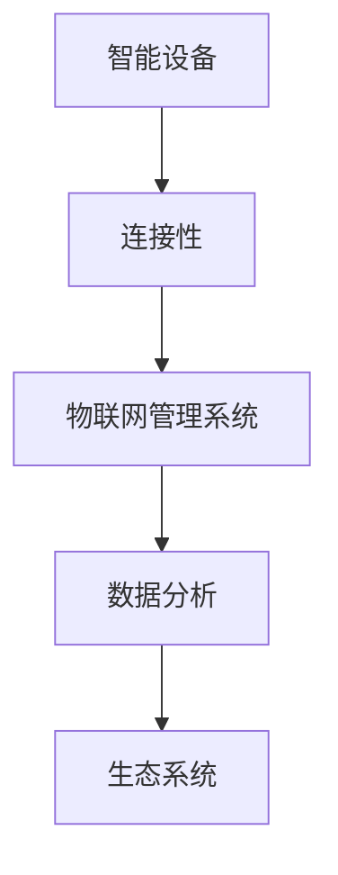

                 

关键词：物联网管理，智能设备，连接性，管理，生态系统，硬件，软件，安全性，标准化，可扩展性，数据分析，人工智能。

> 摘要：本文深入探讨了物联网管理的核心概念、技术架构、算法原理、数学模型、实际应用、未来展望和面临的挑战。通过详细的案例分析和技术解读，揭示了物联网管理的复杂性和潜力，为读者提供了一个全面的视角。

## 1. 背景介绍

物联网（Internet of Things，简称 IoT）是当今科技领域的一个热门话题。它指的是通过互联网将各种物理设备、传感器、软件系统和人员连接起来，形成一个庞大的智能网络。物联网技术的兴起，标志着从传统的机械自动化向高度智能化的转型。

### 物联网的发展历程

物联网的发展可以追溯到20世纪80年代，当时的主要目的是实现远程监控和控制。随着互联网和无线通信技术的飞速发展，物联网逐渐走向成熟。近年来，物联网在智能家居、智能交通、工业自动化、医疗健康等领域得到了广泛应用。

### 物联网的现状

根据市场研究公司的数据，全球物联网设备数量预计将在未来几年内大幅增长。到2025年，物联网设备的数量可能超过200亿台。物联网技术的普及，不仅改变了人们的生活方式，也为企业和政府提供了大量的数据资源。

## 2. 核心概念与联系

### 智能设备

智能设备是物联网生态系统中的核心组成部分。它们可以是一台计算机、智能手机、传感器、机器人等。智能设备通过嵌入式系统、操作系统和应用程序来实现数据采集、处理和通信。

### 连接性

连接性是物联网管理的关键要素。它确保了智能设备之间以及设备与云端服务之间的无缝通信。连接性可以通过有线（如以太网、光纤）和无线（如Wi-Fi、蓝牙、蜂窝网络）方式进行实现。

### 管理系统

物联网管理系统是负责监控、管理和维护智能设备的软件平台。它提供了设备监控、数据存储、数据分析等功能。管理系统需要具备高可靠性、可扩展性和安全性。

### 生态系统

物联网生态系统是一个复杂的多层结构，包括硬件、软件、服务提供商、标准组织等多个方面。生态系统的健康发展对于物联网的可持续发展至关重要。

### Mermaid 流程图



## 3. 核心算法原理 & 具体操作步骤

### 3.1 算法原理概述

物联网管理中的核心算法主要包括数据采集与处理算法、通信优化算法、安全加密算法等。

- **数据采集与处理算法**：用于从传感器和设备中采集数据，并进行预处理，如滤波、去噪、归一化等。
- **通信优化算法**：用于优化设备之间的通信，提高传输效率和可靠性。
- **安全加密算法**：用于保护数据传输和存储的安全，如AES加密、RSA加密等。

### 3.2 算法步骤详解

#### 数据采集与处理算法

1. **数据采集**：通过传感器从智能设备中获取数据。
2. **数据预处理**：对采集到的数据进行分析和过滤，去除无效数据。
3. **数据存储**：将预处理后的数据存储在数据库或数据湖中。

#### 通信优化算法

1. **信道选择**：根据设备之间的距离和信道状况选择最佳通信路径。
2. **数据压缩**：通过算法对数据进行压缩，减少传输数据量。
3. **调度算法**：合理安排设备通信时间，避免冲突和阻塞。

#### 安全加密算法

1. **密钥生成**：生成用于加密和解密的密钥。
2. **数据加密**：对数据进行加密处理，确保数据安全。
3. **数据解密**：在接收端对加密数据进行解密，恢复原始数据。

### 3.3 算法优缺点

- **数据采集与处理算法**：优点在于可以实时获取和处理数据，提高系统的反应速度；缺点是算法复杂度较高，对计算资源要求较高。
- **通信优化算法**：优点是提高了通信效率，降低了传输延迟；缺点是算法实现较为复杂，需要大量的实验和优化。
- **安全加密算法**：优点是确保了数据的安全性和隐私性；缺点是加密和解密过程会消耗较多的计算资源。

### 3.4 算法应用领域

- **智能家居**：用于监控和控制家庭设备，如空调、照明、门锁等。
- **智能交通**：用于优化交通信号控制，提高道路通行效率。
- **工业自动化**：用于监控和优化生产过程，提高生产效率。
- **医疗健康**：用于实时监测患者病情，提供个性化医疗服务。

## 4. 数学模型和公式 & 详细讲解 & 举例说明

### 4.1 数学模型构建

在物联网管理中，常用的数学模型包括：

- **数据采集模型**：描述传感器采集数据的过程。
- **通信模型**：描述设备之间通信的效率和质量。
- **安全模型**：描述数据加密和解密的过程。

### 4.2 公式推导过程

#### 数据采集模型

假设传感器采集的数据服从正态分布，均值为μ，方差为σ²。则数据采集模型可以表示为：

$$
X \sim N(μ, σ²)
$$

#### 通信模型

通信模型主要考虑信道带宽和传输延迟。假设信道带宽为B，传输延迟为T，则通信模型可以表示为：

$$
E[传输延迟] = T \cdot E[传输数据量]
$$

#### 安全模型

安全模型主要考虑数据加密和解密的过程。假设加密算法的密钥长度为K，加密速度为E，解密速度为D，则安全模型可以表示为：

$$
E[加密时间] = E \cdot 数据量 / K
$$

$$
E[解密时间] = D \cdot 数据量 / K
$$

### 4.3 案例分析与讲解

#### 数据采集案例分析

假设我们使用一个传感器来监测环境温度。根据历史数据，温度服从正态分布，均值为25°C，方差为5°C²。我们想要计算在未来1小时内，温度超过30°C的概率。

根据正态分布的公式，我们可以得到：

$$
P(X > 30) = 1 - P(X \leq 30) = 1 - \Phi\left(\frac{30 - 25}{5}\right) = 1 - \Phi(1) = 0.1587
$$

其中，$\Phi$是标准正态分布的累积分布函数。

#### 通信案例分析

假设我们有一个设备A和一个设备B，它们之间的通信信道带宽为1Mbps，传输延迟为10ms。我们想要计算从设备A到设备B传输1KB数据所需的平均时间。

根据通信模型的公式，我们可以得到：

$$
E[传输时间] = T \cdot E[传输数据量] = 10ms \cdot 1KB / 1Mbps = 0.1s
$$

#### 安全案例分析

假设我们使用AES加密算法来加密数据，密钥长度为128位，加密速度为1MB/s。我们想要计算加密1MB数据所需的平均时间。

根据安全模型的公式，我们可以得到：

$$
E[加密时间] = E \cdot 数据量 / K = 1MB/s \cdot 1MB / 128bits = 8s
$$

## 5. 项目实践：代码实例和详细解释说明

### 5.1 开发环境搭建

为了实现物联网管理，我们需要搭建一个开发环境。以下是搭建步骤：

1. 安装Python 3.8及以上版本。
2. 安装物联网开发库，如`pyserial`、`paho-mqtt`等。
3. 配置物联网设备，如树莓派、ESP8266等。

### 5.2 源代码详细实现

以下是一个简单的物联网管理项目的代码实例：

```python
import serial
import paho.mqtt.client as mqtt

# 配置MQTT服务器
mqtt_server = "mqtt.server.com"
mqtt_port = 1883
mqtt_topic = "iot/temperature"

# 配置串口
serial_port = "/dev/ttyUSB0"
baud_rate = 9600

# 初始化MQTT客户端
client = mqtt.Client()

# 连接MQTT服务器
client.connect(mqtt_server, mqtt_port)

# 打开串口
ser = serial.Serial(serial_port, baud_rate)

# 读取串口数据并发布到MQTT服务器
while True:
    data = ser.readline()
    if data:
        temperature = float(data.decode().strip())
        client.publish(mqtt_topic, f"{temperature}°C")

# 关闭串口和MQTT客户端
client.disconnect()
ser.close()
```

### 5.3 代码解读与分析

该代码实例实现了从传感器读取温度数据，并通过MQTT协议将数据发布到服务器。以下是代码的主要部分解析：

- **MQTT服务器配置**：设置MQTT服务器的地址、端口号和主题。
- **串口配置**：设置串口通信的端口和波特率。
- **初始化MQTT客户端**：创建MQTT客户端对象。
- **连接MQTT服务器**：连接到MQTT服务器。
- **打开串口**：打开与传感器的串口连接。
- **读取串口数据并发布到MQTT服务器**：从串口读取数据，将其转换为温度值，并发布到MQTT服务器。
- **关闭串口和MQTT客户端**：关闭串口和MQTT客户端连接。

### 5.4 运行结果展示

运行该代码后，传感器采集到的温度数据将实时发布到MQTT服务器。您可以使用MQTT客户端订阅主题`iot/temperature`来查看数据。

## 6. 实际应用场景

### 6.1 智能家居

智能家居是物联网应用的一个重要领域。通过物联网管理，可以实现家庭设备的智能监控和控制，如照明、空调、门锁等。这不仅提高了生活质量，还节省了能源。

### 6.2 智能交通

智能交通系统通过物联网管理，可以实现交通信号的智能控制，提高道路通行效率，减少交通事故。例如，通过传感器和摄像头实时监测交通状况，并根据实时数据调整交通信号灯的时间。

### 6.3 工业自动化

工业自动化是物联网技术的另一个重要应用领域。通过物联网管理，可以实现生产过程的实时监控和优化，提高生产效率。例如，使用传感器和设备监控生产线，实时调整生产参数。

### 6.4 医疗健康

在医疗健康领域，物联网管理可以用于实时监测患者病情，提供个性化医疗服务。例如，使用传感器监测患者的生命体征，并将数据实时发送到医生，以便及时诊断和治疗。

## 7. 工具和资源推荐

### 7.1 学习资源推荐

- **《物联网技术基础》**：一本系统介绍物联网技术的基础书籍。
- **《物联网应用开发实战》**：一本介绍物联网应用开发实践的书。
- **《物联网系统设计》**：一本关于物联网系统设计的专业书籍。

### 7.2 开发工具推荐

- **Arduino**：一款流行的物联网开发平台，适用于智能设备的开发。
- **Raspberry Pi**：一款流行的单板计算机，适用于物联网项目的开发。
- **MQTT**：一种轻量级的消息队列传输协议，适用于物联网数据传输。

### 7.3 相关论文推荐

- **"The Internet of Things: A Survey"**：一篇关于物联网技术全面综述的论文。
- **"IoT Security: Challenges and Solutions"**：一篇关于物联网安全挑战和解决方案的论文。
- **"Energy Efficiency in IoT Systems"**：一篇关于物联网系统能效优化的论文。

## 8. 总结：未来发展趋势与挑战

### 8.1 研究成果总结

物联网管理在数据采集、通信优化、安全加密等方面取得了显著成果。同时，人工智能技术的引入，为物联网管理提供了新的可能性。

### 8.2 未来发展趋势

- **人工智能与物联网的深度融合**：将人工智能技术应用于物联网管理，实现更加智能化和自适应的管理系统。
- **物联网安全性的提升**：随着物联网设备数量的增加，安全性成为关键挑战。未来将出现更多安全性和隐私保护的技术和协议。
- **物联网标准化的推进**：物联网的标准化工作将继续推进，以实现不同设备和平台之间的互操作性。

### 8.3 面临的挑战

- **数据隐私和安全**：物联网设备产生的海量数据，如何保护用户隐私和数据安全是一个重大挑战。
- **设备的互联互通**：实现不同设备和平台之间的无缝连接，是一个复杂的技术挑战。
- **能源效率**：物联网设备通常运行在有限的能源条件下，如何提高能源效率是一个关键问题。

### 8.4 研究展望

物联网管理是一个充满挑战和机遇的领域。未来，我们将看到更多的技术创新和应用案例。随着物联网技术的不断成熟，它将在更多领域发挥重要作用，推动社会进步。

## 9. 附录：常见问题与解答

### 9.1 物联网管理和互联网管理有什么区别？

物联网管理专注于连接和管理物理设备，包括传感器、家电、工业设备等。而互联网管理则更侧重于网络基础设施、服务和应用的管理。

### 9.2 物联网管理中的数据安全问题如何解决？

可以通过数据加密、身份认证、访问控制等技术手段来保护物联网设备的数据安全。

### 9.3 物联网管理中的设备互联互通问题如何解决？

可以通过制定统一的标准和协议，实现不同设备和平台之间的互操作性。此外，可以采用边缘计算技术，减少数据传输量，提高互联互通性。

### 9.4 物联网管理中的能源效率问题如何解决？

可以通过优化算法、选择合适的通信技术、设计低功耗设备等方式来提高物联网系统的能源效率。

### 9.5 物联网管理中的人工智能应用有哪些？

人工智能可以应用于物联网管理的各个方面，如数据挖掘、预测分析、智能决策等。例如，可以使用机器学习算法对物联网数据进行实时分析，优化系统性能。

----------------------------------------------------------------
### 作者署名

作者：禅与计算机程序设计艺术 / Zen and the Art of Computer Programming

通过这篇详细的文章，我们深入了解了物联网管理的核心概念、技术架构、算法原理、数学模型、实际应用、未来展望和面临的挑战。物联网管理是一个复杂而充满潜力的领域，随着技术的不断进步，它将在未来发挥更加重要的作用。希望本文能为读者提供一个全面的视角，激发对物联网管理的兴趣和思考。在未来的研究中，我们将继续探索物联网管理的更多可能性和挑战。

