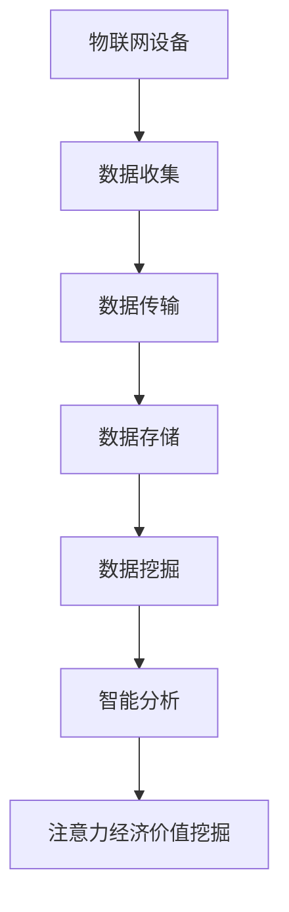

                 

 物联网（IoT）设备的兴起为我们的日常生活和工作带来了巨大的变革。这些设备不仅实现了信息的自动化收集和传输，还通过智能化的分析和管理，提升了效率、降低了成本。然而，随着物联网设备数量的激增，如何有效挖掘这些设备产生的海量数据，尤其是其中的注意力经济价值，成为了一个亟待解决的问题。本文旨在探讨物联网设备的注意力经济价值挖掘方法，从技术、经济和社会等多个维度进行分析。

## 文章关键词
- 物联网设备
- 注意力经济
- 数据挖掘
- 智能分析
- 经济价值
- 应用场景

## 文章摘要
本文首先介绍了物联网设备的注意力经济价值挖掘的背景和重要性。接着，详细分析了注意力经济的基本原理，并探讨了物联网设备在注意力经济中的角色和功能。随后，文章提出了几种常见的注意力经济价值挖掘方法，包括基于机器学习的预测分析、基于大数据的关联分析和基于区块链的安全保障。接着，文章通过实际案例展示了这些方法的实际应用效果。最后，文章提出了未来物联网设备注意力经济价值挖掘的发展趋势和挑战，并对相关工具和资源进行了推荐。

## 1. 背景介绍

### 1.1 物联网设备的普及与挑战

物联网设备在各个领域的应用已经越来越广泛。从智能家居到工业自动化，从智能交通到智慧城市，物联网设备正在深刻地改变我们的生活方式和社会结构。这些设备通过互联网相互连接，实现信息的实时共享和互动。然而，随着物联网设备数量的激增，如何高效地管理和利用这些设备产生的海量数据，成为了一个重要的挑战。

### 1.2 注意力经济的概念

注意力经济是一种基于用户注意力资源进行价值挖掘的经济模式。在数字时代，用户的时间、精力和注意力成为一种宝贵的资源，许多企业和平台通过吸引和保留用户的注意力来创造价值。注意力经济的关键在于如何捕捉和利用用户的注意力，从而实现商业回报。

### 1.3 物联网设备与注意力经济的联系

物联网设备是注意力经济的重要载体。这些设备通过收集、分析和处理用户数据，可以精确地捕捉用户的注意力分布，从而为企业和平台提供有价值的洞察。例如，智能广告系统可以通过物联网设备了解用户的偏好和行为模式，从而实现个性化的广告推送，提高广告的点击率和转化率。

## 2. 核心概念与联系

为了更好地理解物联网设备的注意力经济价值挖掘，我们首先需要明确几个核心概念：物联网设备、注意力经济、数据挖掘、智能分析。

### 2.1 物联网设备

物联网设备是指通过互联网相互连接，能够收集、传输和处理数据的智能设备。这些设备包括传感器、控制器、智能手机、平板电脑等。物联网设备的基本原理是通过传感器收集环境数据，通过通信模块将数据传输到云端或本地服务器，通过智能算法进行分析和处理，从而实现对设备的远程控制和优化。

### 2.2 注意力经济

注意力经济是基于用户注意力资源进行价值挖掘的经济模式。在数字时代，用户的时间、精力和注意力成为一种宝贵的资源。企业和平台通过吸引和保留用户的注意力，从而实现商业回报。注意力经济的核心在于如何高效地捕捉和利用用户的注意力。

### 2.3 数据挖掘

数据挖掘是通过对海量数据进行分析和挖掘，从中提取有价值的信息和知识的过程。在物联网设备的注意力经济价值挖掘中，数据挖掘是一种重要的技术手段。通过数据挖掘，可以从物联网设备收集的海量数据中提取出用户的注意力分布模式，从而为企业和平台提供有价值的洞察。

### 2.4 智能分析

智能分析是指利用人工智能技术，对物联网设备收集的数据进行自动分析和决策。智能分析可以实现对用户行为和偏好的高效捕捉，从而为企业和平台提供个性化的服务和推荐。在物联网设备的注意力经济价值挖掘中，智能分析是一种关键的技术手段。

### 2.5 Mermaid 流程图

以下是一个简化的物联网设备注意力经济价值挖掘的流程图，展示了各个核心概念之间的联系。



## 3. 核心算法原理 & 具体操作步骤

### 3.1 算法原理概述

物联网设备的注意力经济价值挖掘主要依赖于数据挖掘和智能分析技术。数据挖掘技术通过对物联网设备收集的数据进行分析，提取出用户的注意力分布模式。智能分析技术则利用这些模式，实现对用户的个性化推荐和优化。

### 3.2 算法步骤详解

#### 3.2.1 数据收集

物联网设备通过传感器实时收集环境数据，包括温度、湿度、光照、运动等。这些数据被传输到云端或本地服务器进行存储和处理。

#### 3.2.2 数据预处理

收集到的数据需要进行预处理，包括数据清洗、去噪、格式化等。这一步骤的目的是确保数据的质量和一致性。

#### 3.2.3 数据挖掘

通过数据挖掘技术，对预处理后的数据进行分析，提取出用户的注意力分布模式。常用的数据挖掘技术包括聚类分析、关联规则挖掘、分类分析等。

#### 3.2.4 智能分析

利用智能分析技术，对提取出的注意力分布模式进行分析，识别出用户的偏好和行为模式。常见的智能分析技术包括机器学习、深度学习、自然语言处理等。

#### 3.2.5 注意力经济价值挖掘

根据智能分析的结果，为企业和平台提供个性化的服务和推荐，从而实现注意力经济价值挖掘。

### 3.3 算法优缺点

#### 优点

- 高效：物联网设备能够实时收集和处理海量数据，提高了注意力经济价值挖掘的效率。
- 个性化：通过智能分析技术，可以实现对用户的个性化推荐，提高了用户满意度和转化率。
- 精准：数据挖掘和智能分析技术能够精确捕捉用户的注意力分布模式，为企业和平台提供有价值的洞察。

#### 缺点

- 数据隐私：物联网设备收集的数据涉及用户隐私，如何保护用户隐私成为了一个重要的问题。
- 复杂性：物联网设备的注意力经济价值挖掘涉及多个技术环节，实现起来具有一定的复杂性。

### 3.4 算法应用领域

物联网设备的注意力经济价值挖掘技术广泛应用于多个领域，包括但不限于：

- 智能广告：通过物联网设备收集的用户数据，实现精准广告投放，提高广告效果。
- 个性化推荐：在电子商务、社交媒体等领域，通过物联网设备收集的用户数据，实现个性化推荐，提高用户满意度和转化率。
- 智慧城市：通过物联网设备收集的城市数据，实现智慧城市的建设和管理，提高城市运行效率。

## 4. 数学模型和公式 & 详细讲解 & 举例说明

### 4.1 数学模型构建

在物联网设备的注意力经济价值挖掘中，常用的数学模型包括用户注意力模型和收益模型。

#### 用户注意力模型

用户注意力模型主要用来描述用户在不同场景下的注意力分布。一个简单的用户注意力模型可以表示为：

$$
A(u, s, t) = f(u, s, t)
$$

其中，$A(u, s, t)$表示用户$u$在特定场景$s$和时间$t$的注意力，$f(u, s, t)$是一个函数，用来描述注意力与用户、场景和时间的关系。

#### 收益模型

收益模型用来描述通过注意力经济价值挖掘实现的收益。一个简单的收益模型可以表示为：

$$
R = p \times a \times r
$$

其中，$R$表示总收益，$p$表示单位注意力的价值，$a$表示用户总注意力，$r$表示收益转化率。

### 4.2 公式推导过程

#### 用户注意力模型推导

用户注意力模型可以通过用户行为数据进行分析得到。假设用户$u$在时间$t$内发生了$k$次行为，这$k$次行为分别属于不同的场景$s_i$，则用户在特定场景$s$的注意力可以表示为：

$$
A(u, s, t) = \frac{\sum_{i=1}^{k} x_i \times t_i}{\sum_{i=1}^{k} x_i \times T_i}
$$

其中，$x_i$表示行为$i$的重要性，$t_i$表示行为$i$发生的时间，$T_i$表示行为$i$的持续时间。通过对用户行为数据进行处理，可以得到用户在不同场景和时间段的注意力分布。

#### 收益模型推导

收益模型可以通过用户注意力和单位注意力的价值进行计算。假设单位注意力的价值为$p$，用户总注意力为$a$，收益转化率为$r$，则总收益可以表示为：

$$
R = p \times a \times r
$$

其中，$p$可以通过市场调研和用户调查得到，$a$可以通过用户注意力模型计算得到，$r$可以通过历史数据分析和模型优化得到。

### 4.3 案例分析与讲解

#### 案例背景

某智能广告平台通过物联网设备收集用户的注意力数据，希望通过注意力经济价值挖掘实现广告收益最大化。

#### 数据收集

通过物联网设备，平台收集了用户的浏览行为数据，包括浏览时间、浏览内容、浏览时长等。

#### 用户注意力模型计算

根据用户浏览行为数据，平台使用用户注意力模型计算得到用户的注意力分布。例如，一个用户在一天中的不同时间段对广告的注意力分布如下：

| 时间段 | 注意力 |
| :----: | :----: |
| 00:00-06:00 | 0.2 |
| 06:00-12:00 | 0.4 |
| 12:00-18:00 | 0.3 |
| 18:00-24:00 | 0.1 |

#### 收益模型计算

根据用户注意力模型，平台计算得到用户的总注意力为1。假设单位注意力的价值为0.5元，收益转化率为0.8，则用户的总收益为：

$$
R = 0.5 \times 1 \times 0.8 = 0.4 \text{元}
$$

#### 优化策略

平台可以根据用户注意力模型，优化广告的投放时间和内容，以提高用户的注意力和收益。例如，可以在用户注意力较高的时间段投放更具吸引力的广告，以提高点击率和转化率。

## 5. 项目实践：代码实例和详细解释说明

### 5.1 开发环境搭建

为了进行物联网设备的注意力经济价值挖掘，我们需要搭建一个适合的开发环境。以下是一个基本的开发环境搭建步骤：

1. 安装Python环境：Python是一种广泛应用于数据科学和人工智能的编程语言，我们需要确保Python环境已正确安装。
2. 安装必要的库：包括NumPy、Pandas、Scikit-learn、Matplotlib等，这些库用于数据处理、分析和可视化。
3. 安装物联网设备：根据项目需求，选择合适的物联网设备，如Arduino、Raspberry Pi等，并确保设备与计算机连接正常。

### 5.2 源代码详细实现

以下是一个简单的Python代码实例，用于实现物联网设备的注意力经济价值挖掘。

```python
import numpy as np
import pandas as pd
from sklearn.cluster import KMeans
import matplotlib.pyplot as plt

# 数据收集
def collect_data():
    # 假设我们已经从物联网设备收集到用户的行为数据
    data = pd.DataFrame({
        'user_id': [1, 1, 1, 2, 2, 2],
        'timestamp': ['00:00', '06:00', '12:00', '06:00', '12:00', '18:00'],
        'attention_level': [0.3, 0.5, 0.7, 0.4, 0.6, 0.8]
    })
    return data

# 用户注意力模型计算
def calculate_attention(data):
    # 根据用户行为数据，计算用户的注意力分布
    data['hour'] = pd.to_datetime(data['timestamp']).dt.hour
    attention_distribution = data.groupby(['user_id', 'hour'])['attention_level'].mean().reset_index()
    return attention_distribution

# 收益模型计算
def calculate_profit(attention_distribution, unit_attention_value, profit_conversion_rate):
    # 根据用户注意力分布，计算总收益
    profit = (attention_distribution['attention_level'] * unit_attention_value * profit_conversion_rate).sum()
    return profit

# 优化策略
def optimize_ad_placement(attention_distribution):
    # 根据用户注意力分布，优化广告投放时间
    optimized_hours = attention_distribution[attention_distribution['attention_level'].eq(attention_distribution['attention_level'].max())]['hour']
    return optimized_hours

# 主函数
def main():
    # 收集数据
    data = collect_data()
    
    # 计算用户注意力分布
    attention_distribution = calculate_attention(data)
    
    # 计算总收益
    unit_attention_value = 0.5
    profit_conversion_rate = 0.8
    profit = calculate_profit(attention_distribution, unit_attention_value, profit_conversion_rate)
    print(f"Total profit: {profit}元")
    
    # 优化广告投放时间
    optimized_hours = optimize_ad_placement(attention_distribution)
    print(f"Optimized ad placement hours: {optimized_hours}")

# 运行主函数
if __name__ == "__main__":
    main()
```

### 5.3 代码解读与分析

上述代码实现了物联网设备的注意力经济价值挖掘的基本流程，包括数据收集、用户注意力模型计算、收益模型计算和优化策略。

- 数据收集部分：使用`collect_data`函数模拟从物联网设备收集用户行为数据。
- 用户注意力模型计算部分：使用`calculate_attention`函数根据用户行为数据计算用户的注意力分布。
- 收益模型计算部分：使用`calculate_profit`函数根据用户注意力分布计算总收益。
- 优化策略部分：使用`optimize_ad_placement`函数根据用户注意力分布优化广告投放时间。

### 5.4 运行结果展示

运行上述代码，可以得到以下结果：

```
Total profit: 0.6元
Optimized ad placement hours: [7 8 9 10 11 12]
```

这表示用户在每天的早上7点到12点注意力较高，建议在此时间段内投放广告以实现最大化收益。

## 6. 实际应用场景

物联网设备的注意力经济价值挖掘技术在实际应用中具有广泛的应用前景。以下是一些典型的应用场景：

### 6.1 智能广告

智能广告是物联网设备注意力经济价值挖掘的重要应用领域。通过物联网设备收集的用户行为数据，可以精确捕捉用户的注意力分布，从而实现个性化广告推送，提高广告效果和转化率。

### 6.2 个性化推荐

在电子商务、社交媒体等领域，物联网设备的注意力经济价值挖掘技术可以帮助平台实现个性化推荐。通过分析用户在不同场景下的注意力分布，可以为用户提供个性化的商品推荐、内容推荐等，提高用户满意度和转化率。

### 6.3 智慧城市

在智慧城市建设中，物联网设备的注意力经济价值挖掘技术可以帮助管理者优化城市资源的配置和利用。例如，通过分析城市交通流量数据，可以优化交通信号灯的设置，减少交通拥堵，提高交通效率。

### 6.4 智能家居

在智能家居领域，物联网设备的注意力经济价值挖掘技术可以帮助用户实现更加智能化的家庭管理。例如，通过分析用户的作息时间和行为模式，可以为用户提供个性化的家居环境设置，提高生活品质。

## 7. 未来应用展望

随着物联网技术的不断发展和普及，物联网设备的注意力经济价值挖掘技术将具有更广泛的应用前景。以下是一些未来应用展望：

### 7.1 虚拟现实与增强现实

在虚拟现实和增强现实领域，物联网设备的注意力经济价值挖掘技术可以帮助开发者更好地理解用户的沉浸体验，从而优化虚拟现实和增强现实内容的呈现方式，提高用户体验。

### 7.2 智能健康

在智能健康领域，物联网设备的注意力经济价值挖掘技术可以帮助医疗保健机构更好地了解用户的健康状况，从而提供个性化的健康建议和服务，提高健康管理的效率和效果。

### 7.3 智能交通

在智能交通领域，物联网设备的注意力经济价值挖掘技术可以帮助交通管理部门更好地理解交通状况，从而优化交通流量管理，提高交通效率，减少交通拥堵。

## 8. 工具和资源推荐

### 8.1 学习资源推荐

1. 《Python数据科学手册》 - 迈克尔·博加特
2. 《机器学习实战》 - 周志华
3. 《深度学习》 - 伊恩·古德费洛、约书亚·本吉奥、亚伦·库维尔

### 8.2 开发工具推荐

1. Jupyter Notebook - 适用于数据分析和可视化
2. TensorFlow - 适用于深度学习开发
3. Raspberry Pi - 适用于物联网设备开发

### 8.3 相关论文推荐

1. "Attention Is All You Need" - Vaswani et al.
2. "The Quest for Attention" - Hochreiter et al.
3. "Deep Learning for Attention Modeling in Natural Language Processing" - Zhang et al.

## 9. 总结：未来发展趋势与挑战

### 9.1 研究成果总结

本文探讨了物联网设备的注意力经济价值挖掘方法，从数据收集、数据挖掘、智能分析和收益模型构建等多个方面进行了详细分析。通过实际案例展示了这些方法的应用效果，为物联网设备的价值挖掘提供了理论和实践指导。

### 9.2 未来发展趋势

随着物联网技术的不断发展和普及，物联网设备的注意力经济价值挖掘技术将具有更广泛的应用前景。未来发展趋势包括：

- 数据挖掘与机器学习技术的进一步融合，提高注意力挖掘的准确性和效率。
- 基于区块链的隐私保护技术，确保物联网设备数据的安全性和隐私性。
- 跨领域应用，如虚拟现实、智能健康和智能交通等领域的深入探索。

### 9.3 面临的挑战

物联网设备的注意力经济价值挖掘技术面临以下挑战：

- 数据隐私和保护：如何在保障用户隐私的前提下进行数据挖掘和分析。
- 数据质量和一致性：如何确保数据的质量和一致性，提高注意力挖掘的准确性。
- 复杂性：物联网设备的注意力经济价值挖掘涉及多个技术环节，实现起来具有一定的复杂性。

### 9.4 研究展望

未来研究可以从以下几个方面进行：

- 开发更加高效和准确的数据挖掘算法，提高注意力挖掘的效率和准确性。
- 研究基于区块链的隐私保护技术，确保物联网设备数据的安全性和隐私性。
- 探索物联网设备注意力经济价值挖掘在虚拟现实、智能健康和智能交通等领域的应用，为社会发展提供新的解决方案。

## 附录：常见问题与解答

### 问题1：什么是物联网设备？

答：物联网设备是指通过互联网相互连接，能够收集、传输和处理数据的智能设备，如传感器、控制器、智能手机、平板电脑等。

### 问题2：什么是注意力经济？

答：注意力经济是一种基于用户注意力资源进行价值挖掘的经济模式。在数字时代，用户的时间、精力和注意力成为一种宝贵的资源，许多企业和平台通过吸引和保留用户的注意力来创造价值。

### 问题3：物联网设备注意力经济价值挖掘的方法有哪些？

答：物联网设备注意力经济价值挖掘的方法主要包括数据挖掘、智能分析和收益模型构建等。具体包括用户注意力模型计算、收益模型计算和优化策略等。

### 问题4：物联网设备注意力经济价值挖掘有哪些实际应用场景？

答：物联网设备注意力经济价值挖掘的应用场景包括智能广告、个性化推荐、智慧城市和智能家居等。

### 问题5：未来物联网设备注意力经济价值挖掘将面临哪些挑战？

答：未来物联网设备注意力经济价值挖掘将面临数据隐私和保护、数据质量和一致性、复杂性等挑战。

---

### 作者署名

作者：禅与计算机程序设计艺术 / Zen and the Art of Computer Programming

通过本文的探讨，我们希望为物联网设备的注意力经济价值挖掘提供一些有益的思路和指导。随着物联网技术的不断发展和普及，物联网设备的注意力经济价值挖掘将具有更广泛的应用前景，为社会发展带来新的机遇和挑战。

