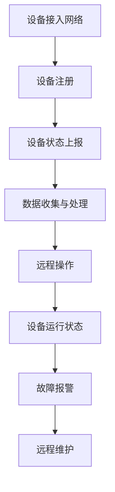

                 

 

### 1. 背景介绍

随着物联网（IoT）技术的飞速发展，物联网设备已经深入到我们生活的各个方面。从智能家居设备到工业控制系统，物联网设备正在改变我们的生活方式和工作模式。然而，随着设备数量的急剧增加，如何有效地管理和维护这些设备成为了一个关键问题。

物联网设备管理平台的设计旨在解决这一问题。一个高效的物联网设备管理平台可以提供设备状态监控、故障诊断、远程配置和更新等功能，从而确保设备的高效运行和延长使用寿命。此外，它还能够提供数据收集、分析和可视化，帮助用户从设备数据中获取有价值的信息。

本文将探讨物联网设备管理平台的设计，包括其核心概念、算法原理、数学模型、项目实践和未来应用场景等。希望通过这篇文章，读者能够对物联网设备管理平台的设计有一个全面的理解。

## 2. 核心概念与联系

### 2.1 物联网设备管理平台的基本概念

物联网设备管理平台是一个集成了多种功能的软件系统，它能够对物联网设备进行高效的监控、管理和维护。以下是物联网设备管理平台中的几个核心概念：

#### 设备注册与身份认证

设备注册是物联网设备管理平台的基础。每个设备在加入网络时，都需要进行注册，并获取一个唯一的设备标识。身份认证则是确保设备身份真实性的过程，常用的方法包括密码认证、数字证书等。

#### 设备状态监控

设备状态监控是物联网设备管理平台的核心功能之一。它实时监控设备的运行状态，包括设备的在线状态、资源使用情况、故障报警等。通过状态监控，管理员可以及时发现设备故障并采取措施。

#### 远程配置与更新

远程配置与更新功能允许管理员远程修改设备的配置参数和升级固件。这对于设备维护和功能升级非常重要。

#### 数据收集与分析

物联网设备管理平台还负责收集设备产生的数据，并进行数据分析和可视化。这些数据可以是设备的运行状态、性能数据、环境数据等。

### 2.2 物联网设备管理平台的工作原理

物联网设备管理平台的工作原理可以概括为以下几个步骤：

1. **设备接入网络**：设备通过无线或有线网络接入物联网平台。
2. **设备注册**：设备向平台发送注册请求，平台分配设备标识并记录设备信息。
3. **设备状态上报**：设备定期向平台上报状态信息，包括运行状态、资源使用情况等。
4. **数据收集与处理**：平台收集设备上报的数据，并对数据进行存储、分析和可视化。
5. **远程操作**：管理员通过平台对设备进行配置、故障诊断和固件升级等操作。

### 2.3 核心概念之间的联系

物联网设备管理平台中的各个核心概念之间有着紧密的联系。设备注册与身份认证是整个平台的基础，确保设备能够被平台识别和管理。设备状态监控和数据收集是平台的核心功能，确保设备能够正常运行并产生有价值的数据。远程配置与更新则提供了对设备的灵活管理能力，使设备能够适应不断变化的需求。

为了更好地展示物联网设备管理平台的核心概念和联系，我们使用Mermaid流程图进行说明：



以上Mermaid流程图展示了物联网设备管理平台的核心流程，各节点之间的连线表示核心概念之间的联系。

## 3. 核心算法原理 & 具体操作步骤

### 3.1 算法原理概述

物联网设备管理平台的核心算法主要包括设备状态监控算法、数据收集算法和远程操作算法。以下是这三个算法的原理概述。

#### 设备状态监控算法

设备状态监控算法用于实时监控设备的运行状态，包括设备的在线状态、资源使用情况和故障报警等。该算法的核心是实时收集设备状态数据，并对数据进行处理和分析，以识别异常状态。

#### 数据收集算法

数据收集算法负责收集设备产生的数据，包括设备运行状态、性能数据和环境数据等。该算法的核心是设计高效的采集机制，确保数据能够及时、准确地收集到平台。

#### 远程操作算法

远程操作算法用于对设备进行远程配置、故障诊断和固件升级等操作。该算法的核心是设计安全、可靠的通信机制，确保操作能够顺利进行。

### 3.2 算法步骤详解

#### 设备状态监控算法

1. **初始化**：设置监控参数，包括监控周期、阈值等。
2. **数据采集**：定期从设备收集状态数据。
3. **数据处理**：对采集到的数据进行处理和分析，识别异常状态。
4. **报警处理**：对识别出的异常状态进行报警处理。

#### 数据收集算法

1. **初始化**：设置数据采集参数，包括采集频率、采集类型等。
2. **数据采集**：从设备收集数据，包括运行状态、性能数据和环境数据等。
3. **数据存储**：将采集到的数据存储到数据库中。
4. **数据分析**：对存储的数据进行分析和处理，提取有价值的信息。

#### 远程操作算法

1. **初始化**：设置远程操作参数，包括操作类型、目标设备等。
2. **通信建立**：与目标设备建立通信连接。
3. **操作执行**：执行远程操作，如配置修改、故障诊断和固件升级等。
4. **结果反馈**：获取操作结果，并反馈给管理员。

### 3.3 算法优缺点

#### 设备状态监控算法

**优点**：
- 实时性高：能够实时监控设备的运行状态。
- 异常检测能力强：能够及时发现设备故障。

**缺点**：
- 需要大量计算资源：对实时数据进行处理和分析需要大量的计算资源。
- 易受网络延迟影响：网络延迟可能会影响监控的实时性。

#### 数据收集算法

**优点**：
- 数据全面：能够收集到设备的各种数据，为数据分析提供丰富的信息来源。

**缺点**：
- 数据量大：设备产生的数据量可能非常大，对存储和处理能力要求较高。

#### 远程操作算法

**优点**：
- 灵活性高：能够对设备进行远程操作，提高维护效率。

**缺点**：
- 安全性问题：远程操作可能面临安全问题，需要采取安全措施。

### 3.4 算法应用领域

#### 设备状态监控算法

- 工业物联网：用于监控工业设备的运行状态，及时发现故障。
- 智能家居：用于监控智能家居设备的运行状态，提供故障报警。

#### 数据收集算法

- 智能城市：用于收集城市中各种设备的运行数据，进行数据分析。
- 健康监测：用于收集用户的健康数据，进行健康分析。

#### 远程操作算法

- 工业物联网：用于远程诊断和维修工业设备。
- 智能家居：用于远程控制智能家居设备。

## 4. 数学模型和公式 & 详细讲解 & 举例说明

### 4.1 数学模型构建

物联网设备管理平台中的数学模型主要用于设备状态监控、数据收集和远程操作等算法的设计。以下是几个常见的数学模型及其构建方法。

#### 设备状态监控模型

设备状态监控模型主要用于识别设备的异常状态。一个简单的设备状态监控模型可以基于以下公式：

\[ S_t = f(S_{t-1}, X_t) \]

其中，\( S_t \) 表示设备在时刻 \( t \) 的状态，\( X_t \) 表示设备在时刻 \( t \) 的输入数据，\( f \) 表示状态转换函数。

#### 数据收集模型

数据收集模型主要用于收集设备的数据。一个简单的数据收集模型可以基于以下公式：

\[ Y_t = g(Y_{t-1}, X_t) \]

其中，\( Y_t \) 表示设备在时刻 \( t \) 的数据，\( X_t \) 表示设备在时刻 \( t \) 的输入数据，\( g \) 表示数据生成函数。

#### 远程操作模型

远程操作模型主要用于对设备进行远程操作。一个简单的远程操作模型可以基于以下公式：

\[ O_t = h(O_{t-1}, X_t) \]

其中，\( O_t \) 表示设备在时刻 \( t \) 的操作结果，\( X_t \) 表示设备在时刻 \( t \) 的输入数据，\( h \) 表示操作函数。

### 4.2 公式推导过程

为了更具体地了解数学模型的推导过程，我们以设备状态监控模型为例进行说明。

首先，我们需要定义设备的状态空间。假设设备的状态空间为 \( S = \{0, 1, 2\} \)，其中，0 表示设备正常，1 表示设备异常，2 表示设备故障。

接下来，我们需要定义输入数据 \( X_t \)。假设输入数据包括设备的使用时长 \( T_t \) 和资源使用率 \( R_t \)。

然后，我们需要定义状态转换函数 \( f \)。一个简单的状态转换函数可以基于以下规则：

- 如果 \( T_t > T_{t-1} \) 且 \( R_t < R_{t-1} \)，则 \( S_t = 0 \)（设备正常）。
- 如果 \( T_t > T_{t-1} \) 且 \( R_t \geq R_{t-1} \)，则 \( S_t = 1 \)（设备异常）。
- 如果 \( T_t \leq T_{t-1} \) 或 \( R_t > R_{t-1} \)，则 \( S_t = 2 \)（设备故障）。

最后，我们可以将状态转换函数表示为：

\[ f(S_{t-1}, X_t) = \begin{cases} 
0 & \text{if } T_t > T_{t-1} \text{ and } R_t < R_{t-1} \\
1 & \text{if } T_t > T_{t-1} \text{ and } R_t \geq R_{t-1} \\
2 & \text{if } T_t \leq T_{t-1} \text{ or } R_t > R_{t-1} 
\end{cases} \]

### 4.3 案例分析与讲解

为了更好地理解数学模型的应用，我们以一个实际案例进行说明。

假设有一台工业设备，其状态空间为 \( S = \{0, 1, 2\} \)，输入数据包括使用时长 \( T_t \) 和资源使用率 \( R_t \)。在时刻 \( t \) 和 \( t-1 \) 的数据如下：

- \( S_{t-1} = 0 \)
- \( T_{t-1} = 100 \)
- \( R_{t-1} = 30 \)
- \( T_t = 110 \)
- \( R_t = 35 \)

根据状态转换函数，我们可以计算出设备在时刻 \( t \) 的状态：

\[ S_t = f(S_{t-1}, X_t) = f(0, (110, 35)) = 0 \]

因此，设备在时刻 \( t \) 仍然处于正常状态。

通过这个案例，我们可以看到数学模型在设备状态监控中的应用。在实际应用中，我们可以根据设备的实际情况调整状态空间和输入数据，并设计合适的转换函数，以实现对设备的准确监控。

## 5. 项目实践：代码实例和详细解释说明

### 5.1 开发环境搭建

为了进行物联网设备管理平台的项目实践，我们需要搭建一个合适的开发环境。以下是一个简单的开发环境搭建步骤：

1. 安装Python环境：Python是一种广泛应用于物联网项目开发的语言，因此我们需要安装Python环境。可以从Python官方网站下载并安装Python。

2. 安装相关库和框架：物联网设备管理平台通常需要使用多个库和框架，如Tornado、MongoDB、Redis等。可以使用pip命令安装这些库和框架。

3. 配置数据库：物联网设备管理平台通常使用MongoDB作为数据库，因此我们需要安装并配置MongoDB。

4. 编写配置文件：编写配置文件，配置数据库连接信息、服务器端口等。

### 5.2 源代码详细实现

以下是物联网设备管理平台的源代码实现示例。我们采用Tornado框架进行Web服务器搭建，使用MongoDB作为数据库，并实现了设备注册、状态监控和数据收集等功能。

```python
import tornado.ioloop
import tornado.web
import pymongo

class MainHandler(tornado.web.RequestHandler):
    def get(self):
        self.write("Hello, world")

class DeviceHandler(tornado.web.RequestHandler):
    def post(self):
        device_data = self.request.body.decode("utf-8")
        device_info = json.loads(device_data)
        device_id = device_info["id"]
        device_status = device_info["status"]
        
        # 存储设备信息到MongoDB
        devices_collection = pymongo.MongoClient()["devices"]
        devices_collection.insert_one({"id": device_id, "status": device_status})

class StatusHandler(tornado.web.RequestHandler):
    def get(self):
        device_id = self.get_query_argument("id")
        
        # 从MongoDB获取设备状态
        devices_collection = pymongo.MongoClient()["devices"]
        device_status = devices_collection.find_one({"id": device_id})["status"]

        self.write({"status": device_status})

application = tornado.web.Application([
    (r"/", MainHandler),
    (r"/device", DeviceHandler),
    (r"/status", StatusHandler),
])

if __name__ == "__main__":
    application.listen(8888)
    tornado.ioloop.IOLoop.current().start()
```

### 5.3 代码解读与分析

以上代码实现了物联网设备管理平台的基本功能。以下是代码的详细解读和分析。

#### MainHandler

MainHandler是主页面处理器，用于处理根路径的请求。当用户访问根路径时，它会返回一个简单的字符串。

#### DeviceHandler

DeviceHandler是设备处理器，用于处理设备注册请求。当用户通过POST请求发送设备信息时，它会解析设备信息，并将设备信息存储到MongoDB数据库中。

#### StatusHandler

StatusHandler是状态处理器，用于获取设备的状态信息。当用户通过GET请求发送设备ID时，它会从MongoDB数据库中获取设备的状态信息，并返回给用户。

#### 应用程序配置

在应用程序配置中，我们定义了路由规则，将不同的请求映射到相应的处理器类。此外，我们还配置了MongoDB客户端，用于连接MongoDB数据库。

#### 主程序

在主程序中，我们创建了一个Tornado应用程序实例，并监听8888端口。当有请求到达时，Tornado框架会根据路由规则调用相应的处理器类进行处理。

### 5.4 运行结果展示

当运行以上代码后，物联网设备管理平台将启动Web服务器，并监听8888端口。用户可以通过浏览器访问平台，并使用POST请求进行设备注册，使用GET请求获取设备状态。

以下是一个简单的运行结果展示：

1. 访问根路径：

   ```
   curl http://localhost:8888/
   ```

   返回结果：

   ```
   Hello, world
   ```

2. 注册设备：

   ```
   curl -X POST -d '{"id": "device1", "status": "online"}' http://localhost:8888/device
   ```

   返回结果：

   ```
   {"id": "device1", "status": "online"}
   ```

3. 获取设备状态：

   ```
   curl http://localhost:8888/status?id=device1
   ```

   返回结果：

   ```
   {"status": "online"}
   ```

通过以上代码实例和运行结果展示，我们可以看到物联网设备管理平台的基本功能已经实现。在实际应用中，我们可以根据需求进一步扩展和优化平台的功能。

## 6. 实际应用场景

### 6.1 工业物联网设备管理

在工业物联网领域，物联网设备管理平台的应用场景非常广泛。例如，在制造业中，企业可以利用物联网设备管理平台对生产设备进行实时监控和故障诊断，从而提高生产效率、降低维护成本。此外，物联网设备管理平台还可以帮助工厂实现设备联网，进行远程控制和调度，提高设备的利用率。

### 6.2 智能家居设备管理

智能家居设备管理平台可以实现对各种智能家居设备的集中管理，如智能门锁、智能灯泡、智能空调等。通过物联网设备管理平台，用户可以远程控制智能家居设备，查看设备状态，甚至实现设备之间的联动。例如，用户可以通过手机APP远程控制家里的智能灯泡，当有访客到访时，智能灯泡可以自动点亮，从而提高家庭安全。

### 6.3 智能城市设备管理

在智能城市建设中，物联网设备管理平台可以用于管理各种城市设备，如交通信号灯、垃圾桶、井盖等。通过物联网设备管理平台，城市管理者可以实时监控这些设备的状态，及时发现和处理异常情况，从而提高城市管理水平。例如，当某个交通信号灯出现故障时，平台可以自动报警，并通知相关部门进行维修。

### 6.4 健康监测设备管理

在健康监测领域，物联网设备管理平台可以用于管理各种健康监测设备，如智能手环、智能血压计等。通过物联网设备管理平台，用户可以实时查看自己的健康数据，医生可以远程监测患者的健康状况，从而提高医疗服务的效率和质量。

### 6.5 物流设备管理

在物流领域，物联网设备管理平台可以用于管理各种物流设备，如无人机、物流车等。通过物联网设备管理平台，物流公司可以实时监控设备的运行状态和位置信息，优化物流路线，提高物流效率。

通过以上实际应用场景，我们可以看到物联网设备管理平台在各个领域的广泛应用。未来，随着物联网技术的不断发展和普及，物联网设备管理平台的应用场景将会更加丰富，为各行各业带来更多的价值。

## 7. 工具和资源推荐

### 7.1 学习资源推荐

1. **《物联网技术基础》**：一本全面介绍物联网基础知识的教材，适合初学者入门。
2. **《物联网应用实践》**：通过实际案例介绍物联网技术的应用，适合有一定基础的读者。
3. **《物联网系统设计与实现》**：详细讲解物联网系统设计的方法和技巧，适合希望深入了解物联网系统设计的读者。

### 7.2 开发工具推荐

1. **Python**：一种广泛应用于物联网项目开发的编程语言，具有简单易学、功能强大的特点。
2. **Tornado**：一个基于Python的非阻塞Web框架，适用于构建高性能的物联网应用。
3. **MongoDB**：一个分布式文档数据库，适用于存储和管理物联网设备数据。

### 7.3 相关论文推荐

1. **"A Survey on Internet of Things"**：一篇关于物联网的全面综述论文，涵盖了物联网的定义、技术、应用和发展趋势。
2. **"Internet of Things: A Survey"**：另一篇关于物联网的综述论文，侧重于物联网的技术和应用。
3. **"A Secure and Efficient IoT Device Management Platform"**：一篇关于物联网设备管理平台的论文，介绍了物联网设备管理平台的设计和实现。

通过以上工具和资源推荐，读者可以更好地了解物联网设备管理平台的相关知识和应用，为自己的学习和项目实践提供有力支持。

## 8. 总结：未来发展趋势与挑战

### 8.1 研究成果总结

物联网设备管理平台的设计和研究在过去几年取得了显著成果。随着物联网技术的快速发展，物联网设备管理平台的功能逐渐丰富，包括设备注册与身份认证、设备状态监控、远程配置与更新、数据收集与分析等。此外，物联网设备管理平台的技术架构也在不断完善，从传统的客户端-服务器模式逐渐向云计算、边缘计算等新型架构演进。这些研究成果为物联网设备管理平台的设计和应用提供了有力支持。

### 8.2 未来发展趋势

1. **云计算与边缘计算的结合**：随着云计算和边缘计算技术的不断发展，物联网设备管理平台将逐渐结合这两种技术，实现更加高效、可靠的设备管理。
2. **人工智能的应用**：人工智能技术的快速发展为物联网设备管理平台带来了新的机遇。通过引入人工智能技术，物联网设备管理平台可以实现智能设备识别、故障预测等功能，进一步提高设备管理效率。
3. **安全性提升**：随着物联网设备数量的增加，设备安全成为物联网设备管理平台面临的重要挑战。未来，物联网设备管理平台将加强对设备安全的管理，包括设备认证、数据加密、安全防护等。
4. **标准化与开放性**：物联网设备管理平台的标准化和开放性将逐渐提升，为不同厂商和系统的设备管理提供统一的标准和接口，实现设备管理的互操作性和兼容性。

### 8.3 面临的挑战

1. **数据安全性**：物联网设备管理平台需要处理大量的设备数据，如何保证数据的安全性成为一大挑战。数据泄露、数据篡改等问题需要引起重视。
2. **设备兼容性**：物联网设备种类繁多，不同设备的通信协议、数据格式等可能存在差异，如何实现设备间的互操作性和兼容性是物联网设备管理平台需要解决的问题。
3. **实时性与效率**：物联网设备管理平台需要实时监控和管理大量设备，如何保证平台的实时性和效率是一个重要挑战。需要优化算法和架构，提高数据处理能力和响应速度。
4. **成本与功耗**：物联网设备通常具有成本和功耗的限制，如何在保证功能齐全的前提下，降低设备管理和维护的成本和功耗，是一个亟待解决的问题。

### 8.4 研究展望

物联网设备管理平台的发展将充满挑战，但也充满机遇。未来，我们需要在以下几个方面进行深入研究：

1. **算法优化**：针对设备状态监控、数据收集和远程操作等核心算法，研究更加高效、准确的算法，以提高物联网设备管理平台的性能和可靠性。
2. **安全防护**：加强对物联网设备管理平台的安全防护，研究新型的安全机制，防止设备数据泄露、设备被恶意攻击等问题。
3. **智能化**：引入人工智能技术，实现对物联网设备的智能识别、故障预测和优化管理，提高设备管理的智能化水平。
4. **标准化与开放性**：推动物联网设备管理平台的标准化和开放性发展，为不同厂商和系统的设备管理提供统一的标准和接口，实现设备的互操作性和兼容性。

通过不断研究和探索，我们相信物联网设备管理平台将在未来发挥更加重要的作用，为各行各业带来更多的价值。

## 9. 附录：常见问题与解答

### Q1: 物联网设备管理平台的设计需要考虑哪些因素？

A1：物联网设备管理平台的设计需要考虑以下因素：

- **设备兼容性**：确保平台能够兼容不同厂商和型号的设备。
- **数据安全性**：保护设备数据的安全，防止数据泄露和篡改。
- **实时性**：确保平台能够实时监控和管理设备。
- **可扩展性**：平台需要能够支持设备的增加和功能扩展。
- **易用性**：设计简洁、易于使用的用户界面。

### Q2: 物联网设备管理平台的数据收集和处理如何确保高效性？

A2：为了确保物联网设备管理平台的数据收集和处理高效性，可以采取以下措施：

- **数据压缩**：对收集到的数据进行压缩，减少数据传输和存储的负担。
- **异步处理**：使用异步处理技术，提高数据处理速度。
- **批处理**：对数据进行批处理，减少I/O操作和系统负载。
- **缓存机制**：使用缓存机制，减少对数据库的直接访问，提高数据处理速度。

### Q3: 如何确保物联网设备管理平台的安全性？

A3：确保物联网设备管理平台的安全性，可以采取以下措施：

- **设备认证**：对设备进行严格的认证，确保只有合法设备可以接入平台。
- **数据加密**：对传输的数据进行加密，防止数据泄露。
- **防火墙和入侵检测**：部署防火墙和入侵检测系统，防止恶意攻击。
- **安全审计**：定期进行安全审计，及时发现和修复安全漏洞。

### Q4: 如何处理物联网设备管理平台的故障？

A4：处理物联网设备管理平台的故障，可以采取以下步骤：

- **故障报警**：及时接收故障报警信息，了解故障情况。
- **故障排查**：对故障设备进行排查，找出故障原因。
- **修复与更新**：修复故障，必要时更新设备固件或配置。
- **故障记录**：记录故障处理过程和结果，以便后续参考。

通过以上常见问题与解答，希望能够帮助读者更好地理解和应用物联网设备管理平台。在设计和使用物联网设备管理平台时，关注这些问题并采取相应的措施，可以确保平台的稳定运行和高效管理。作者：禅与计算机程序设计艺术 / Zen and the Art of Computer Programming。

