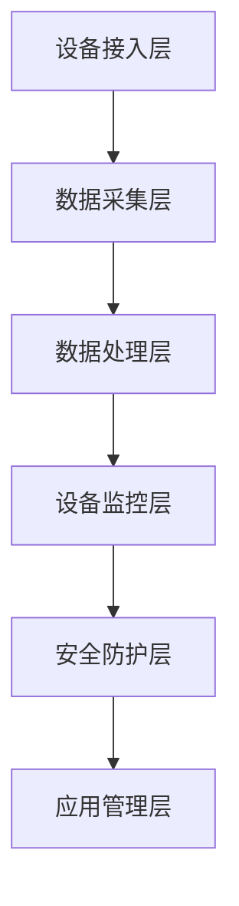

                 

关键词：物联网，设备管理，平台设计，架构，API，安全性，分布式系统

> 摘要：本文将探讨物联网设备管理平台的设计原则、架构、核心组件以及安全性等关键要素。通过对物联网设备管理平台的深入分析，我们希望能够为开发者提供有价值的指导，助力他们在设计和管理物联网设备方面取得成功。

## 1. 背景介绍

物联网（Internet of Things，IoT）技术正在全球范围内迅速发展，它将各种物理设备、传感器和软件系统连接到互联网，实现了数据的实时采集、传输和处理。随着物联网设备数量的急剧增加，如何对这些设备进行高效管理和监控成为了一个亟待解决的问题。

物联网设备管理平台作为物联网生态系统的重要组成部分，其设计质量直接影响到整个物联网系统的稳定性和可靠性。本文旨在介绍物联网设备管理平台的设计原则、核心组件及其关键技术，以期为开发者提供有价值的参考。

## 2. 核心概念与联系

### 2.1 物联网设备管理平台的概念

物联网设备管理平台（IoT Device Management Platform）是一个集成了多种功能的系统，用于管理、监控和优化物联网设备。其主要功能包括设备接入、设备配置、数据采集、设备监控、安全防护、远程控制等。

### 2.2 物联网设备管理平台的架构

物联网设备管理平台通常采用分布式系统架构，具有高扩展性、高可用性和高可靠性。其核心架构包括以下几个部分：

- **设备接入层**：负责设备接入平台，包括设备注册、设备认证等。
- **数据采集层**：负责采集设备产生的数据，并将其传输到平台。
- **数据处理层**：负责对采集到的数据进行处理、存储和查询。
- **设备监控层**：负责对设备状态进行实时监控，包括设备运行状态、性能指标、故障报警等。
- **安全防护层**：负责保护平台的安全，包括设备认证、数据加密、访问控制等。
- **应用管理层**：负责对设备进行配置、远程控制、策略管理等功能。

### 2.3 核心概念原理和架构的 Mermaid 流程图



## 3. 核心算法原理 & 具体操作步骤

### 3.1 算法原理概述

物联网设备管理平台的核心算法主要包括设备接入算法、数据采集算法、数据处理算法、设备监控算法和安全防护算法等。

- **设备接入算法**：用于实现设备与平台的注册和认证过程。
- **数据采集算法**：用于实现设备数据的实时采集和传输。
- **数据处理算法**：用于实现设备数据的处理、存储和查询。
- **设备监控算法**：用于实现设备状态的实时监控和故障报警。
- **安全防护算法**：用于实现平台的安全防护，包括设备认证、数据加密和访问控制等。

### 3.2 算法步骤详解

#### 3.2.1 设备接入算法

1. 设备发送接入请求到平台。
2. 平台验证设备身份和权限。
3. 如果验证通过，平台为设备分配一个唯一标识符。
4. 设备使用该标识符与平台进行后续通信。

#### 3.2.2 数据采集算法

1. 设备采集数据。
2. 设备将数据发送到平台。
3. 平台对数据进行预处理，如去噪、滤波等。
4. 平台将预处理后的数据存储到数据库。

#### 3.2.3 数据处理算法

1. 平台从数据库中查询数据。
2. 平台对数据进行可视化展示。
3. 平台根据需求对数据进行分析和预测。

#### 3.2.4 设备监控算法

1. 平台定期采集设备状态数据。
2. 平台根据预设的阈值对设备状态进行判断。
3. 如果设备状态异常，平台发出故障报警。

#### 3.2.5 安全防护算法

1. 平台使用加密算法对数据进行加密。
2. 平台使用认证算法对设备进行认证。
3. 平台使用访问控制算法对用户访问进行限制。

### 3.3 算法优缺点

#### 3.3.1 设备接入算法

- **优点**：简化设备接入流程，提高接入效率。
- **缺点**：需要消耗一定的计算资源和存储资源。

#### 3.3.2 数据采集算法

- **优点**：实现数据的实时采集和传输，提高数据利用率。
- **缺点**：对网络带宽有一定要求。

#### 3.3.3 数据处理算法

- **优点**：实现数据的可视化展示和分析，提高数据价值。
- **缺点**：数据处理复杂度高，需要消耗较多的计算资源。

#### 3.3.4 设备监控算法

- **优点**：实现设备状态的实时监控和故障报警，提高设备可靠性。
- **缺点**：需要定期采集设备状态数据，可能影响设备性能。

#### 3.3.5 安全防护算法

- **优点**：提高平台的安全性，防止数据泄露和设备被非法控制。
- **缺点**：加密算法和认证算法的实现复杂度较高。

### 3.4 算法应用领域

物联网设备管理平台的核心算法广泛应用于智能家居、智能城市、工业自动化、医疗健康等领域。通过这些算法，可以实现对物联网设备的实时监控、数据分析和远程控制，从而提高物联网系统的智能化水平和用户体验。

## 4. 数学模型和公式 & 详细讲解 & 举例说明

### 4.1 数学模型构建

在物联网设备管理平台中，常用的数学模型包括数据采集模型、数据处理模型和设备监控模型。

#### 4.1.1 数据采集模型

数据采集模型可以表示为：

$$
X_t = f(X_{t-1}, U_t, W_t)
$$

其中，$X_t$ 表示第 $t$ 时刻采集到的数据，$U_t$ 表示第 $t$ 时刻的输入，$W_t$ 表示第 $t$ 时刻的噪声。

#### 4.1.2 数据处理模型

数据处理模型可以表示为：

$$
Y_t = g(X_t, V_t)
$$

其中，$Y_t$ 表示第 $t$ 时刻处理后的数据，$V_t$ 表示第 $t$ 时刻的处理参数。

#### 4.1.3 设备监控模型

设备监控模型可以表示为：

$$
Z_t = h(Y_t, T_t)
$$

其中，$Z_t$ 表示第 $t$ 时刻的设备状态，$T_t$ 表示第 $t$ 时刻的阈值。

### 4.2 公式推导过程

#### 4.2.1 数据采集模型推导

根据数据采集模型的定义，我们可以推导出：

$$
X_t = f(X_{t-1}, U_t, W_t) = X_{t-1} + U_t + W_t
$$

#### 4.2.2 数据处理模型推导

根据数据处理模型的定义，我们可以推导出：

$$
Y_t = g(X_t, V_t) = X_t \cdot V_t
$$

#### 4.2.3 设备监控模型推导

根据设备监控模型的定义，我们可以推导出：

$$
Z_t = h(Y_t, T_t) = \begin{cases}
1, & \text{if } Y_t > T_t \\
0, & \text{otherwise}
\end{cases}
$$

### 4.3 案例分析与讲解

假设我们有一个智能家居系统，其中包含一个智能灯具。智能灯具可以接收远程控制指令，并根据指令调整亮度。我们希望设计一个数据采集模型、数据处理模型和设备监控模型，实现对智能灯具的实时监控和远程控制。

#### 4.3.1 数据采集模型

我们可以将数据采集模型表示为：

$$
X_t = f(X_{t-1}, U_t, W_t) = X_{t-1} + U_t + W_t
$$

其中，$X_t$ 表示第 $t$ 时刻智能灯具的亮度，$U_t$ 表示第 $t$ 时刻的亮度调整指令，$W_t$ 表示第 $t$ 时刻的噪声。

#### 4.3.2 数据处理模型

我们可以将数据处理模型表示为：

$$
Y_t = g(X_t, V_t) = X_t \cdot V_t
$$

其中，$Y_t$ 表示第 $t$ 时刻处理后的亮度，$V_t$ 表示第 $t$ 时刻的亮度调整系数。

#### 4.3.3 设备监控模型

我们可以将设备监控模型表示为：

$$
Z_t = h(Y_t, T_t) = \begin{cases}
1, & \text{if } Y_t > T_t \\
0, & \text{otherwise}
\end{cases}
$$

其中，$Z_t$ 表示第 $t$ 时刻的设备状态，$T_t$ 表示第 $t$ 时刻的亮度阈值。

通过上述模型，我们可以实现对智能灯具的实时监控和远程控制。例如，当用户发送一个亮度调整指令时，系统会根据当前亮度值和调整系数计算出新的亮度值，并根据预设的亮度阈值判断设备状态是否正常。如果设备状态异常，系统会发出警报通知用户。

## 5. 项目实践：代码实例和详细解释说明

### 5.1 开发环境搭建

在开始编写物联网设备管理平台代码之前，我们需要搭建一个合适的开发环境。以下是一个简单的开发环境搭建步骤：

1. 安装 Python 3.8 及以上版本。
2. 安装 PyCharm 或 VSCode 等代码编辑器。
3. 安装 Flask 框架和 requests 库。

### 5.2 源代码详细实现

以下是一个简单的物联网设备管理平台代码示例：

```python
from flask import Flask, request, jsonify
import requests

app = Flask(__name__)

# 设备列表
devices = []

# 注册设备
@app.route('/register', methods=['POST'])
def register_device():
    device_data = request.get_json()
    device_id = device_data['device_id']
    device_type = device_data['device_type']
    devices.append({'device_id': device_id, 'device_type': device_type})
    return jsonify({'status': 'success', 'message': 'Device registered successfully.'})

# 控制设备
@app.route('/control', methods=['POST'])
def control_device():
    device_data = request.get_json()
    device_id = device_data['device_id']
    command = device_data['command']
    # 这里可以根据 device_id 和 command 向对应设备发送控制指令
    response = requests.post(f'http://device_ip:port/control', json={'device_id': device_id, 'command': command})
    return jsonify({'status': 'success', 'message': 'Command sent successfully.'})

# 监控设备
@app.route('/monitor', methods=['GET'])
def monitor_device():
    device_id = request.args.get('device_id')
    # 这里可以根据 device_id 向对应设备发送监控请求
    response = requests.get(f'http://device_ip:port/monitor?device_id={device_id}')
    return jsonify(response.json())

if __name__ == '__main__':
    app.run(debug=True)
```

### 5.3 代码解读与分析

1. **设备注册**：通过 POST 请求向 `/register` 路径发送设备信息，包括设备 ID 和设备类型。平台接收到请求后，将设备信息添加到设备列表中。
2. **控制设备**：通过 POST 请求向 `/control` 路径发送控制指令，包括设备 ID 和指令。平台接收到请求后，向指定设备的 IP 地址和端口发送控制指令。
3. **监控设备**：通过 GET 请求向 `/monitor` 路径发送监控请求，包括设备 ID。平台接收到请求后，向指定设备的 IP 地址和端口发送监控请求，并返回监控结果。

### 5.4 运行结果展示

运行上述代码后，平台将启动一个 Flask 服务，并在本地 127.0.0.1:5000 端口监听 HTTP 请求。我们可以使用以下命令启动服务：

```bash
python app.py
```

然后，我们可以在浏览器或 Postman 中向平台发送请求，查看运行结果。

## 6. 实际应用场景

物联网设备管理平台在各个领域具有广泛的应用。以下是一些实际应用场景：

1. **智能家居**：通过物联网设备管理平台，用户可以远程监控和控制家庭设备，如智能灯、智能锁、智能空调等。
2. **智能城市**：物联网设备管理平台可以用于监控和管理城市中的各种设备，如交通信号灯、垃圾箱、公共设施等，以提高城市管理效率。
3. **工业自动化**：物联网设备管理平台可以用于监控和管理生产线设备，如传感器、执行器、机器人等，以提高生产效率和产品质量。
4. **医疗健康**：物联网设备管理平台可以用于监控和管理医疗设备，如监护仪、心率监测器、血糖仪等，为医生提供实时数据支持，以提高诊断和治疗效果。

## 7. 工具和资源推荐

### 7.1 学习资源推荐

- 《物联网技术与应用》
- 《物联网架构设计与实践》
- 《Python物联网开发实战》

### 7.2 开发工具推荐

- PyCharm
- VSCode
- Flask
- requests

### 7.3 相关论文推荐

- "A Survey on Internet of Things: Architecture, Enabling Technologies, Security and Privacy Challenges"
- "IoT Security: A Comprehensive Survey"
- "An Overview of IoT Device Management Platforms"

## 8. 总结：未来发展趋势与挑战

### 8.1 研究成果总结

物联网设备管理平台在近年来取得了显著的研究成果，主要包括以下几个方面：

1. **分布式系统架构**：分布式系统架构的广泛应用提高了物联网设备管理平台的高可用性和可扩展性。
2. **边缘计算**：边缘计算的兴起使得物联网设备管理平台能够更加高效地处理和传输数据，降低延迟。
3. **安全性**：物联网设备管理平台在安全性方面取得了重要突破，包括设备认证、数据加密和访问控制等。

### 8.2 未来发展趋势

未来，物联网设备管理平台将朝着以下方向发展：

1. **智能化**：通过人工智能技术，物联网设备管理平台将实现更智能的设备监控、故障诊断和预测性维护。
2. **安全化**：随着物联网设备的数量和种类不断增加，物联网设备管理平台的安全性问题将得到更加深入的探索和研究。
3. **标准化**：物联网设备管理平台的标准化将为开发者提供更统一的开发标准和接口，降低开发成本。

### 8.3 面临的挑战

物联网设备管理平台在发展过程中也面临着一些挑战：

1. **数据安全和隐私保护**：如何保障物联网设备管理平台的数据安全和隐私保护是当前亟待解决的问题。
2. **设备兼容性**：不同设备和平台之间的兼容性问题会影响物联网设备管理平台的推广和应用。
3. **性能优化**：随着物联网设备数量的增加，物联网设备管理平台的性能优化成为一项重要任务。

### 8.4 研究展望

未来，物联网设备管理平台的研究重点将包括以下几个方面：

1. **智能监控与故障诊断**：通过引入人工智能技术，实现设备状态的智能监控和故障诊断，提高设备管理效率。
2. **边缘计算与云计算结合**：结合边缘计算和云计算的优势，实现物联网设备管理平台的高效数据传输和处理。
3. **安全防护**：加强物联网设备管理平台的安全防护能力，包括设备认证、数据加密和访问控制等方面。

## 9. 附录：常见问题与解答

### 9.1 物联网设备管理平台的作用是什么？

物联网设备管理平台的主要作用是对物联网设备进行高效管理和监控，包括设备接入、数据采集、数据处理、设备监控和安全防护等功能。

### 9.2 物联网设备管理平台需要具备哪些核心功能？

物联网设备管理平台需要具备以下核心功能：

- 设备接入与认证
- 数据采集与处理
- 设备监控与报警
- 安全防护与访问控制
- 设备配置与远程控制

### 9.3 如何保证物联网设备管理平台的数据安全和隐私保护？

为了保证物联网设备管理平台的数据安全和隐私保护，可以采取以下措施：

- 使用加密算法对数据进行加密存储和传输。
- 引入设备认证和访问控制机制，限制非法访问。
- 定期进行安全审计和漏洞修复。

### 9.4 物联网设备管理平台与传统设备管理平台的区别是什么？

物联网设备管理平台与传统设备管理平台的区别主要体现在以下几个方面：

- **连接方式**：物联网设备管理平台通过网络连接，而传统设备管理平台通常通过局域网或专用网络连接。
- **功能丰富**：物联网设备管理平台不仅具备传统设备管理平台的功能，还具备数据采集、处理、分析和监控等功能。
- **智能化**：物联网设备管理平台能够通过人工智能技术实现智能监控、故障诊断和预测性维护。

## 作者署名

作者：禅与计算机程序设计艺术 / Zen and the Art of Computer Programming

----------------------------------------------------------------

以上就是本文的完整内容，希望对您在物联网设备管理平台设计方面有所启发和帮助。如有任何疑问，请随时提出，我会为您解答。祝您阅读愉快！

