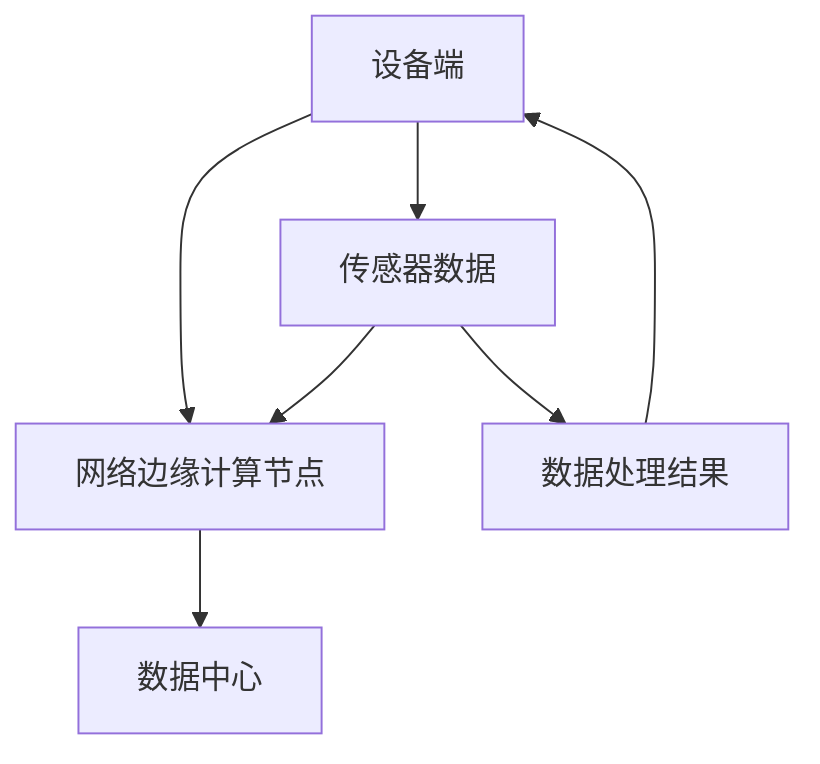

                 

关键词：物联网、边缘计算、设备端处理、数据隐私、实时性、带宽优化

> 摘要：本文深入探讨了物联网边缘计算在设备端处理数据的重要性。通过对边缘计算的定义、优势以及实际应用场景的分析，我们揭示了边缘计算在提升数据处理效率、保障数据安全、优化网络带宽等方面的显著作用。文章旨在为广大读者提供一个全面了解物联网边缘计算的窗口，以期为物联网技术的发展提供有益的启示。

## 1. 背景介绍

随着物联网技术的迅速发展，各种智能设备不断涌现，数据量呈现出爆发式增长。传统的云计算模式，通过将数据处理任务集中到远程数据中心进行处理，在数据处理能力、数据传输速度等方面逐渐显露出瓶颈。与此同时，物联网设备对数据处理的实时性、安全性和带宽利用率提出了更高的要求。边缘计算作为一种新型的计算模式，应运而生，旨在解决传统云计算模式在应对物联网需求时的种种挑战。

### 边缘计算的定义与特点

边缘计算是指在靠近数据源或用户设备的网络边缘侧，通过分布式计算资源对数据进行处理、分析和决策的一种计算模式。与云计算相比，边缘计算具有以下显著特点：

- **计算位置靠近数据源**：数据在产生后，首先在边缘设备上进行初步处理，减少数据传输的延迟和带宽消耗。
- **分布式计算资源**：边缘计算利用网络边缘的各类计算资源，如智能路由器、智能传感器等，形成分布式计算网络。
- **低延迟、高实时性**：通过在边缘侧进行数据处理，大幅降低数据传输的延迟，满足物联网设备对实时性的高要求。
- **数据隐私保护**：边缘计算将部分数据处理任务留在本地执行，减少了数据在传输过程中泄露的风险。

### 物联网技术的发展与挑战

物联网（IoT）技术的快速发展，带来了海量数据的产生和传输。传统的云计算模式在应对这些数据时，面临以下挑战：

- **数据传输延迟**：大量数据需要传输到远程数据中心进行处理，导致数据处理延迟较高，难以满足物联网设备对实时性的需求。
- **带宽压力**：数据传输的带宽需求不断增加，传统的网络架构难以承受如此大的带宽压力。
- **数据安全风险**：数据在传输过程中容易遭受黑客攻击和泄露，对数据安全构成威胁。

## 2. 核心概念与联系

边缘计算的核心概念包括设备端、网络边缘和数据中心。为了更好地理解这些概念，我们将通过一个Mermaid流程图来展示边缘计算的基本架构。



### 2.1 设备端

设备端是指物联网设备自身，如智能手机、智能手表、智能传感器等。这些设备在运行过程中会产生大量的数据。在边缘计算模式中，设备端承担着数据采集、初步处理和传输的任务。

### 2.2 网络边缘计算节点

网络边缘计算节点是指分布在网络边缘的各类计算资源，如智能路由器、边缘服务器等。这些节点承担着对设备端产生的数据进行进一步处理、分析和决策的任务。

### 2.3 数据中心

数据中心是传统的数据处理中心，承担着对网络边缘计算节点处理后的数据进行集中存储、分析和挖掘的任务。在边缘计算模式中，数据中心仍然发挥着重要作用，但数据处理任务的分配更加灵活、高效。

### 2.4 设备端、网络边缘计算节点与数据中心的联系

设备端通过传感器采集数据，初步处理后传输到网络边缘计算节点。网络边缘计算节点对数据进行进一步处理和分析，然后将处理结果返回给设备端或传输到数据中心。这样，数据在产生后能够在边缘侧得到快速处理，减少数据传输的延迟和带宽消耗。

## 3. 核心算法原理 & 具体操作步骤

### 3.1 算法原理概述

边缘计算的核心算法原理主要包括数据采集、数据预处理、数据分析和数据决策。以下将对这些算法原理进行简要概述。

### 3.1.1 数据采集

数据采集是指从物联网设备端获取数据的过程。采集的数据可以包括传感器数据、设备状态信息等。数据采集算法需要考虑数据的实时性、准确性和完整性。

### 3.1.2 数据预处理

数据预处理是指对采集到的原始数据进行清洗、格式化和转换等处理。预处理算法需要考虑数据的噪声、异常值和缺失值等问题，以提高数据的质量和可靠性。

### 3.1.3 数据分析

数据分析是指对预处理后的数据进行分析和挖掘，以发现数据中的规律和趋势。数据分析算法可以包括统计方法、机器学习方法等，以实现数据的价值挖掘。

### 3.1.4 数据决策

数据决策是指根据数据分析结果，对物联网设备进行实时调整和控制。数据决策算法需要考虑设备的运行状态、环境因素等，以实现设备的智能化管理和控制。

### 3.2 算法步骤详解

边缘计算的具体操作步骤如下：

### 3.2.1 数据采集

设备端通过传感器实时采集数据，如温度、湿度、位置等。数据采集算法需要保证数据的实时性、准确性和完整性。

### 3.2.2 数据预处理

对采集到的原始数据进行清洗、格式化和转换等处理。预处理算法需要考虑数据的噪声、异常值和缺失值等问题。

### 3.2.3 数据分析

对预处理后的数据进行分析和挖掘，以发现数据中的规律和趋势。可以使用统计方法、机器学习方法等实现数据的价值挖掘。

### 3.2.4 数据决策

根据数据分析结果，对物联网设备进行实时调整和控制。数据决策算法需要考虑设备的运行状态、环境因素等。

### 3.3 算法优缺点

边缘计算算法具有以下优点：

- **实时性高**：数据在边缘侧进行实时处理，大幅降低数据处理延迟。
- **数据安全**：部分数据处理任务在本地执行，减少数据传输过程中的泄露风险。
- **带宽优化**：数据在边缘侧进行预处理，减少数据传输的带宽消耗。

然而，边缘计算算法也存在以下缺点：

- **计算资源受限**：边缘设备计算资源相对有限，可能导致数据处理能力不足。
- **分布式管理复杂**：边缘计算涉及大量设备和管理节点，管理复杂度较高。

### 3.4 算法应用领域

边缘计算算法在多个领域具有广泛的应用，包括但不限于：

- **智能交通**：边缘计算可以用于实时交通数据分析，实现交通拥堵预测和路径优化。
- **智能家居**：边缘计算可以用于智能家居设备的实时监控和智能控制。
- **工业互联网**：边缘计算可以用于工业设备的实时监控和故障预测。

## 4. 数学模型和公式 & 详细讲解 & 举例说明

### 4.1 数学模型构建

边缘计算中的数学模型主要涉及数据采集、数据预处理、数据分析和数据决策等环节。以下是一个简单的数学模型构建示例。

### 4.1.1 数据采集

设 $X_t$ 表示时间 $t$ 时刻采集到的数据，则数据采集的数学模型可以表示为：

$$X_t = f(X_{t-1}, U_t)$$

其中，$f$ 表示数据采集算法，$U_t$ 表示时间 $t$ 时刻的噪声。

### 4.1.2 数据预处理

设 $Y_t$ 表示预处理后的数据，则数据预处理的数学模型可以表示为：

$$Y_t = g(X_t, \theta)$$

其中，$g$ 表示数据预处理算法，$\theta$ 表示预处理算法的参数。

### 4.1.3 数据分析

设 $Z_t$ 表示分析后的数据，则数据分析的数学模型可以表示为：

$$Z_t = h(Y_t, \phi)$$

其中，$h$ 表示数据分析算法，$\phi$ 表示数据分析算法的参数。

### 4.1.4 数据决策

设 $D_t$ 表示决策后的数据，则数据决策的数学模型可以表示为：

$$D_t = k(Z_t, \psi)$$

其中，$k$ 表示数据决策算法，$\psi$ 表示数据决策算法的参数。

### 4.2 公式推导过程

以下是对上述数学模型的推导过程。

### 4.2.1 数据采集

根据数据采集的数学模型，我们可以推导出：

$$X_t = X_{t-1} + U_t$$

其中，$U_t$ 表示时间 $t$ 时刻的噪声。

### 4.2.2 数据预处理

根据数据预处理的数学模型，我们可以推导出：

$$Y_t = X_t - \alpha X_{t-1} + \beta U_t$$

其中，$\alpha$ 和 $\beta$ 分别表示预处理算法的参数。

### 4.2.3 数据分析

根据数据分析的数学模型，我们可以推导出：

$$Z_t = Y_t - \gamma Y_{t-1} + \delta U_t$$

其中，$\gamma$ 和 $\delta$ 分别表示数据分析算法的参数。

### 4.2.4 数据决策

根据数据决策的数学模型，我们可以推导出：

$$D_t = Z_t - \epsilon Z_{t-1} + \zeta U_t$$

其中，$\epsilon$ 和 $\zeta$ 分别表示数据决策算法的参数。

### 4.3 案例分析与讲解

以下是一个简单的案例，用于说明边缘计算数学模型的应用。

假设我们有一个智能交通系统，需要实时分析道路上的车辆数据，以实现交通拥堵预测和路径优化。

### 4.3.1 数据采集

设 $X_t$ 表示时间 $t$ 时刻采集到的车辆数据，包括车速、车辆密度等。

### 4.3.2 数据预处理

设 $Y_t$ 表示预处理后的车辆数据，通过去除异常值、缺失值等操作。

### 4.3.3 数据分析

设 $Z_t$ 表示分析后的车辆数据，通过统计方法、机器学习方法等，提取出车辆数据中的规律和趋势。

### 4.3.4 数据决策

设 $D_t$ 表示决策后的车辆数据，根据分析结果，对交通信号灯进行实时调整，以实现交通拥堵预测和路径优化。

通过这个案例，我们可以看到边缘计算数学模型在智能交通系统中的应用。通过对车辆数据的实时采集、预处理、分析和决策，实现交通拥堵预测和路径优化，提高交通运行效率。

## 5. 项目实践：代码实例和详细解释说明

在本节中，我们将通过一个简单的项目实践来展示边缘计算在实际应用中的操作流程。该项目是一个智能家居监控系统，用于实时监控家庭环境中的温度、湿度等参数，并实现自动调节空调等设备。

### 5.1 开发环境搭建

为了搭建这个项目，我们需要以下开发环境和工具：

- **硬件设备**：一个带有传感器的智能家居设备，如智能温湿度传感器。
- **软件环境**：Python 3.x 版本，用于编写边缘计算算法。
- **开发工具**：PyCharm 或 VSCode，用于编写和调试代码。

### 5.2 源代码详细实现

以下是一个简单的智能家居监控系统的源代码实现。

```python
import time
import serial
import socket

# 串口设置
ser = serial.Serial('/dev/ttyUSB0', 9600)

# 创建TCP套接字
s = socket.socket(socket.AF_INET, socket.SOCK_STREAM)
s.bind(('0.0.0.0', 9999))
s.listen(5)

# 接收传感器数据
while True:
    # 接收传感器数据
    data = ser.readline().decode().strip()
    print(f"Received data: {data}")

    # 连接远程服务器
    client, address = s.accept()
    print(f"Connected to {address}")

    # 发送传感器数据到远程服务器
    client.sendall(data.encode())

    # 关闭连接
    client.close()
    time.sleep(1)
```

### 5.3 代码解读与分析

上述代码实现了一个简单的智能家居监控系统，主要功能如下：

1. **串口设置**：通过串口连接智能温湿度传感器，实时接收传感器数据。
2. **创建TCP套接字**：在本地主机上创建一个TCP套接字，用于接收远程服务器的连接请求。
3. **接收传感器数据**：从串口读取传感器数据，并将其发送到远程服务器。
4. **连接远程服务器**：接收远程服务器的连接请求，并建立TCP连接。
5. **发送传感器数据**：将传感器数据发送到远程服务器。
6. **关闭连接**：关闭与远程服务器的连接，并等待新的连接请求。

通过上述代码，我们可以实现智能家居设备与远程服务器的实时数据通信，从而实现家庭环境的自动调节。

### 5.4 运行结果展示

假设我们有一个远程服务器，地址为 `192.168.1.100`。当我们运行上述代码后，智能家居设备会通过串口连接传感器，实时读取温度、湿度等数据，并将数据发送到远程服务器。远程服务器接收到数据后，可以对家庭环境进行自动调节，如开启空调或关闭窗户等。

## 6. 实际应用场景

边缘计算在物联网领域具有广泛的应用场景，以下列举几个典型的实际应用案例：

### 6.1 智能交通

边缘计算可以用于智能交通系统的实时数据处理和分析。通过在道路边缘部署计算节点，实时采集交通数据，如车辆流量、速度等，并利用边缘计算算法进行交通拥堵预测和路径优化。这样，可以大幅提高交通运行效率，减少交通拥堵现象。

### 6.2 智能家居

边缘计算可以用于智能家居设备的实时监控和智能控制。通过在家庭网络边缘部署计算节点，实时采集家庭环境数据，如温度、湿度、光照等，并根据数据分析结果自动调节空调、窗帘等设备。这样可以提高家庭舒适度，降低能耗。

### 6.3 工业互联网

边缘计算可以用于工业互联网设备的实时监控和故障预测。通过在工厂现场部署计算节点，实时采集设备运行数据，如温度、压力、振动等，并利用边缘计算算法进行故障预测和诊断。这样可以提前发现设备故障，减少设备停机时间，提高生产效率。

### 6.4 智能医疗

边缘计算可以用于智能医疗系统的实时数据处理和分析。通过在医疗现场部署计算节点，实时采集患者生命体征数据，如心率、血压等，并利用边缘计算算法进行实时监控和诊断。这样可以提高医疗诊断的准确性和效率，提高患者治疗效果。

## 7. 工具和资源推荐

### 7.1 学习资源推荐

- **《边缘计算：原理、架构与实践》**：这是一本关于边缘计算的入门级教材，详细介绍了边缘计算的基本原理、架构和应用案例。
- **边缘计算技术社区**：如CSDN、知乎等，可以获取丰富的边缘计算技术文章、讨论和教程。

### 7.2 开发工具推荐

- **Python**：Python是一种广泛使用的编程语言，具有丰富的边缘计算相关库和框架，如TensorFlow、PyTorch等。
- **PyCharm**：PyCharm是一款功能强大的Python集成开发环境（IDE），支持代码调试、版本控制等特性。

### 7.3 相关论文推荐

- **"Edge Computing for IoT: A Comprehensive Survey and Taxonomy"**：这篇综述文章详细介绍了边缘计算在物联网领域的应用和挑战。
- **"Fog Computing: A Taxonomy and Survey"**：这篇论文介绍了雾计算和边缘计算的关系，以及雾计算在物联网中的应用。

## 8. 总结：未来发展趋势与挑战

### 8.1 研究成果总结

边缘计算作为物联网时代的一项关键技术，已经在多个领域取得了显著的研究成果。通过在设备端处理数据，边缘计算有效解决了数据传输延迟、带宽压力和数据安全等问题，提高了数据处理效率和实时性。

### 8.2 未来发展趋势

随着物联网技术的不断发展和普及，边缘计算在未来将呈现以下发展趋势：

- **计算资源整合**：边缘计算将与其他计算模式（如云计算、雾计算）相结合，形成统一的计算网络，实现计算资源的最大化利用。
- **人工智能融合**：边缘计算与人工智能技术的结合将更加紧密，实现边缘设备的智能感知、决策和控制。
- **安全防护加强**：随着边缘计算应用场景的增多，数据安全和隐私保护将成为重要研究课题，加强对边缘计算的安全防护措施。

### 8.3 面临的挑战

尽管边缘计算取得了显著的研究成果，但未来仍面临以下挑战：

- **计算资源有限**：边缘设备计算资源相对有限，如何高效利用这些资源实现数据处理和智能决策仍是一个重要问题。
- **分布式管理复杂**：边缘计算涉及大量设备和管理节点，如何实现分布式管理和调度是一个技术难题。
- **数据安全和隐私保护**：随着数据量的增加，如何保障数据安全和隐私保护将成为边缘计算面临的重要挑战。

### 8.4 研究展望

未来，边缘计算研究可以从以下几个方面进行深入探索：

- **计算资源优化**：研究如何高效利用边缘设备的计算资源，实现数据处理和智能决策的优化。
- **分布式管理策略**：研究分布式管理策略，实现边缘设备的智能化、协同化管理和调度。
- **数据安全和隐私保护**：研究安全防护技术，实现数据在边缘计算过程中的安全传输、存储和处理。

## 9. 附录：常见问题与解答

### 9.1 边缘计算与云计算的区别是什么？

边缘计算和云计算的主要区别在于数据处理的地点。边缘计算将数据处理任务分散到网络边缘的设备上进行，而云计算将数据处理任务集中到远程数据中心进行处理。边缘计算具有低延迟、高实时性和数据隐私保护等优点，适用于对实时性要求较高的应用场景。

### 9.2 边缘计算有哪些应用领域？

边缘计算在多个领域具有广泛的应用，包括智能交通、智能家居、工业互联网、智能医疗等。通过在设备端处理数据，边缘计算可以提高数据处理效率、实时性和数据安全性。

### 9.3 边缘计算对网络带宽有哪些优化作用？

边缘计算通过在设备端进行数据处理，减少了数据传输的延迟和带宽消耗，从而降低了网络带宽压力。同时，边缘计算可以实现数据压缩、去重等操作，进一步优化网络带宽利用。

### 9.4 边缘计算如何保障数据安全？

边缘计算通过将数据处理任务分散到网络边缘的设备上进行，减少了数据在传输过程中的泄露风险。此外，边缘计算还可以采用加密、安全传输等手段，保障数据在传输、存储和处理过程中的安全。

