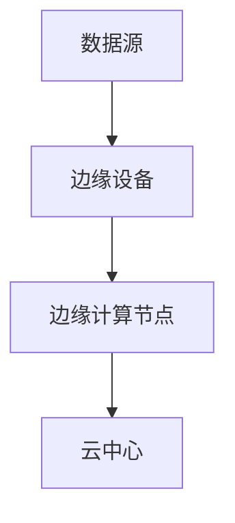

                 

关键词：物联网、边缘计算、应用开发、数据处理、实时性、安全性

> 摘要：随着物联网（IoT）技术的飞速发展，边缘计算作为一种分布式计算架构，正日益成为物联网应用开发的关键。本文将深入探讨物联网边缘计算的概念、原理、核心算法以及实际应用，为开发者提供一套完整的应用开发指南。

## 1. 背景介绍

### 物联网与边缘计算的概念

物联网（Internet of Things，IoT）是指通过互联网将各种物理设备连接起来，实现设备之间的信息交换和通信。这些设备可以包括智能家电、工业传感器、车辆、医疗设备等。物联网的愿景是实现全球范围内的设备互联，实现智能化和自动化。

边缘计算（Edge Computing）是一种分布式计算架构，它将数据处理的任务从云中心转移到网络的边缘，即靠近数据源的位置。边缘计算的目标是降低网络延迟、减少带宽消耗，并提高数据处理的实时性和安全性。

### 物联网边缘计算的发展历程

物联网边缘计算的概念最早可以追溯到20世纪80年代。随着物联网技术的兴起，边缘计算逐渐成为研究热点。近年来，随着5G、人工智能（AI）和大数据等技术的发展，边缘计算的应用场景和市场需求大幅增长，推动了边缘计算技术的快速发展。

## 2. 核心概念与联系

### 边缘计算的基本原理

边缘计算的基本原理是将数据处理任务从云中心转移到网络的边缘，即在靠近数据源的地方进行数据处理。这样可以显著降低数据传输的延迟，提高系统的实时性和响应速度。

#### Mermaid 流程图



### 边缘计算的优势

- **降低延迟**：边缘计算将数据处理任务放在靠近数据源的位置，可以大大减少数据传输的延迟。
- **减少带宽消耗**：通过在边缘设备上处理数据，可以减少需要传输到云中心的数据量，从而减少带宽消耗。
- **提高安全性**：在边缘设备上处理数据可以降低数据泄露的风险，提高系统的安全性。
- **增强可靠性**：边缘计算可以减少对中心化云服务的依赖，提高系统的可靠性。

### 边缘计算的应用场景

- **智能交通**：通过边缘计算，可以实时分析交通数据，优化交通信号，减少交通拥堵。
- **工业物联网**：边缘计算可以实时监控生产线上的设备状态，进行预测性维护，提高生产效率。
- **智能家居**：边缘计算可以实现智能设备的实时交互和自动化控制，提高居住的舒适度。
- **智慧医疗**：边缘计算可以实时处理医疗数据，进行疾病预测和诊断，提高医疗服务的质量。

## 3. 核心算法原理 & 具体操作步骤

### 3.1 算法原理概述

边缘计算的核心算法主要包括数据收集、数据处理和数据存储。这些算法需要满足实时性、高效性和可扩展性等要求。

### 3.2 算法步骤详解

1. **数据收集**：边缘设备通过传感器、摄像头等设备收集数据。
2. **数据处理**：边缘计算节点对收集到的数据进行处理，包括数据清洗、数据融合、特征提取等。
3. **数据存储**：处理后的数据可以存储在本地数据库或者上传到云中心。

### 3.3 算法优缺点

#### 优点

- **实时性**：边缘计算可以实时处理数据，降低延迟。
- **高效性**：边缘计算节点可以充分利用本地资源，提高数据处理效率。
- **可扩展性**：边缘计算架构可以方便地扩展，支持大规模数据处理。

#### 缺点

- **安全性**：边缘计算节点可能面临安全威胁，需要加强安全防护。
- **维护成本**：边缘设备的维护和升级可能增加成本。

### 3.4 算法应用领域

- **智能制造**：边缘计算可以实时监控生产线，进行预测性维护，提高生产效率。
- **智能交通**：边缘计算可以实时分析交通数据，优化交通信号，减少交通拥堵。
- **智慧医疗**：边缘计算可以实时处理医疗数据，进行疾病预测和诊断，提高医疗服务质量。

## 4. 数学模型和公式 & 详细讲解 & 举例说明

### 4.1 数学模型构建

边缘计算中的数学模型主要包括数据收集、数据处理和数据存储的模型。这些模型通常使用概率统计、机器学习等方法进行构建。

### 4.2 公式推导过程

在边缘计算中，常用的数学模型包括：

- **贝叶斯公式**：用于概率推理。
- **支持向量机（SVM）**：用于分类问题。
- **决策树**：用于回归和分类问题。

### 4.3 案例分析与讲解

以智能制造为例，假设我们要预测生产线上的故障，可以使用SVM模型进行分类。首先，收集生产线上的传感器数据，然后进行特征提取，最后使用SVM模型进行训练和预测。

## 5. 项目实践：代码实例和详细解释说明

### 5.1 开发环境搭建

为了实现边缘计算应用，我们需要搭建一个开发环境。以下是一个简单的开发环境搭建步骤：

1. 安装Python环境。
2. 安装边缘计算框架，如Kubernetes。
3. 安装所需的数据处理和机器学习库，如Pandas、Scikit-learn。

### 5.2 源代码详细实现

以下是一个简单的边缘计算应用示例，使用Kubernetes和Scikit-learn实现故障预测。

```python
# edge.py
import pandas as pd
from sklearn.svm import SVC

# 加载数据集
data = pd.read_csv('data.csv')

# 特征提取
X = data[['feature1', 'feature2', 'feature3']]
y = data['fault']

# 训练模型
model = SVC()
model.fit(X, y)

# 预测
X_new = pd.read_csv('new_data.csv')
X_new = X_new[['feature1', 'feature2', 'feature3']]
predictions = model.predict(X_new)

# 输出结果
print(predictions)
```

### 5.3 代码解读与分析

该示例中，我们首先加载数据集，然后进行特征提取，接着使用SVM模型进行训练和预测。最后，输出预测结果。

### 5.4 运行结果展示

运行代码后，我们可以在控制台看到预测结果。

## 6. 实际应用场景

### 6.1 智能制造

在智能制造领域，边缘计算可以实时监控生产线，预测设备故障，提高生产效率。

### 6.2 智能交通

在智能交通领域，边缘计算可以实时分析交通数据，优化交通信号，减少交通拥堵。

### 6.3 智慧医疗

在智慧医疗领域，边缘计算可以实时处理医疗数据，进行疾病预测和诊断，提高医疗服务质量。

## 7. 工具和资源推荐

### 7.1 学习资源推荐

- 《边缘计算：技术与应用》
- 《边缘计算实战》

### 7.2 开发工具推荐

- Kubernetes
- Docker

### 7.3 相关论文推荐

- "Edge Computing: A Comprehensive Survey"
- "Edge Computing for IoT Applications: A Survey"

## 8. 总结：未来发展趋势与挑战

### 8.1 研究成果总结

边缘计算作为一种分布式计算架构，正日益成为物联网应用开发的关键。通过边缘计算，可以实现数据的实时处理和智能分析，提高系统的实时性和安全性。

### 8.2 未来发展趋势

未来，边缘计算将朝着更高效、更智能、更安全的方向发展。随着5G、人工智能和大数据等技术的发展，边缘计算的应用场景将更加广泛，市场规模也将不断扩大。

### 8.3 面临的挑战

边缘计算在发展过程中仍面临一些挑战，包括：

- **安全性**：如何确保边缘设备的安全，防止数据泄露和攻击。
- **可靠性**：如何保证边缘计算系统的稳定运行，提高系统的可靠性。
- **标准化**：如何制定统一的边缘计算标准，推动技术的普及和应用。

### 8.4 研究展望

未来，我们需要进一步研究边缘计算的安全性和可靠性，开发更高效、更智能的边缘计算架构，推动边缘计算技术的广泛应用。

## 9. 附录：常见问题与解答

### Q：什么是边缘计算？

A：边缘计算是一种分布式计算架构，它将数据处理任务从云中心转移到网络的边缘，即靠近数据源的位置。这样可以显著降低数据传输的延迟，提高系统的实时性和响应速度。

### Q：边缘计算有哪些优势？

A：边缘计算的优势包括降低延迟、减少带宽消耗、提高安全性和增强可靠性。

### Q：边缘计算有哪些应用场景？

A：边缘计算的应用场景包括智能制造、智能交通、智慧医疗等。

### Q：如何实现边缘计算应用？

A：实现边缘计算应用需要搭建边缘计算框架，如Kubernetes，并使用合适的编程语言和数据处理库进行开发。

# 作者：禅与计算机程序设计艺术 / Zen and the Art of Computer Programming

---

本文旨在为开发者提供一套完整的物联网边缘计算应用开发指南。通过深入探讨边缘计算的概念、原理、核心算法和实际应用，读者可以更好地理解和掌握边缘计算技术。希望本文能对读者的物联网边缘计算应用开发提供有益的参考。

