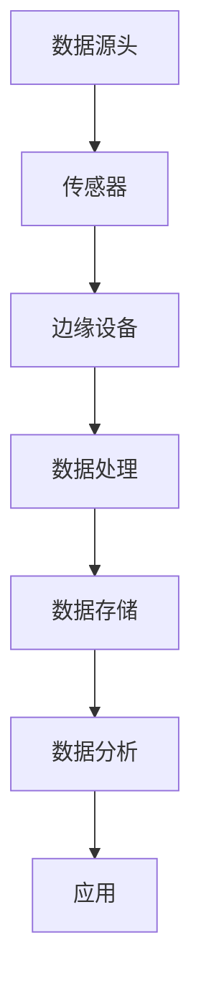

                 

关键词：物联网，边缘计算，设备端处理数据，效率提升，隐私保护，实时性

> 摘要：本文旨在探讨物联网边缘计算的核心概念、架构、算法原理及其在实际应用中的重要性。边缘计算通过在设备端处理数据，实现了对数据处理效率的提升、实时性的增强以及隐私保护等多方面优势，是物联网发展的重要技术支撑。

## 1. 背景介绍

随着物联网（IoT）的迅猛发展，越来越多的设备和系统连接到了互联网上。然而，随着数据量的急剧增加，传统的云计算模式在处理数据时面临着诸多挑战。首先，数据传输的延迟问题变得尤为突出，特别是在远程设备处理大数据时，传输时间过长可能导致实时性需求无法满足。其次，数据隐私和安全问题也愈发严重，随着数据泄露事件的频繁发生，如何在传输和存储过程中保护数据隐私成为了一个亟待解决的问题。

为了解决这些问题，边缘计算技术应运而生。边缘计算通过在靠近数据源的设备上进行数据处理，减少了数据传输的距离和时间，从而提高了实时性和数据处理效率。同时，通过在设备端进行数据处理，可以更好地保护数据隐私，避免数据在传输和存储过程中被泄露。

## 2. 核心概念与联系

### 2.1. 物联网（IoT）

物联网是指通过互联网连接的物理设备、传感器和系统，使得这些设备能够实现信息的交换和协同工作。物联网的主要特点是连接性、智能性和协同性，通过这些特点，物联网实现了设备之间的互联互通，为各种应用场景提供了可能性。

### 2.2. 边缘计算（Edge Computing）

边缘计算是指在靠近数据源或用户的地方进行数据处理和计算的技术。与云计算相比，边缘计算将数据处理和计算的任务从远程数据中心转移到靠近数据源的设备上，从而减少了数据传输的延迟，提高了实时性和效率。边缘计算的核心在于靠近数据源进行数据处理，从而实现数据的高效利用和实时性。

### 2.3. 边缘计算与物联网的联系

边缘计算是物联网技术发展的重要支撑，两者相辅相成。物联网提供了海量的数据来源，而边缘计算则通过在设备端对数据进行处理，实现了对这些数据的实时分析和利用。边缘计算不仅提高了物联网系统的实时性和效率，还有效地解决了数据隐私和安全问题。

### 2.4. Mermaid 流程图

下面是边缘计算架构的Mermaid流程图，展示数据从源头到处理再到应用的整个流程。



## 3. 核心算法原理 & 具体操作步骤

### 3.1. 算法原理概述

边缘计算的核心在于对数据的有效处理和实时分析。其基本原理是在数据源头或靠近数据源的地方部署计算资源，对数据进行实时处理和分析，从而满足实时性需求。边缘计算主要包括以下几个步骤：

1. 数据采集：从传感器或其他设备上收集数据。
2. 数据预处理：对采集到的数据进行清洗、过滤和格式化等处理。
3. 数据分析：对预处理后的数据进行分析，提取有用信息。
4. 数据存储：将处理后的数据存储到本地或远程数据库中。
5. 数据应用：将处理后的数据应用于实际应用场景。

### 3.2. 算法步骤详解

1. **数据采集**

   数据采集是边缘计算的第一步，也是最重要的一步。数据的准确性和完整性直接影响到后续的数据处理和分析。数据采集通常通过传感器、摄像头、RFID等技术实现。采集到的数据可能包括温度、湿度、位置、图像等各种形式。

2. **数据预处理**

   数据预处理主要包括数据清洗、去噪、归一化和特征提取等步骤。数据清洗的目的是去除重复、错误或无效的数据，确保数据的准确性。去噪和归一化的目的是提高数据的质量，使其更适合于后续的分析。特征提取则是从原始数据中提取出有代表性的特征，用于后续的数据分析。

3. **数据分析**

   数据分析是对预处理后的数据进行深度挖掘，提取有用信息的过程。数据分析可以基于统计、机器学习、深度学习等多种方法，根据实际需求选择合适的方法。数据分析的结果可以用于预测、决策支持、优化等应用。

4. **数据存储**

   数据存储是将处理后的数据存储到本地或远程数据库中。数据存储的目的是方便后续的数据分析和应用。边缘设备通常具有有限的存储空间，因此需要选择合适的数据存储方案，如本地存储、云存储或分布式存储。

5. **数据应用**

   数据应用是将处理后的数据应用于实际应用场景，实现物联网系统的功能。例如，在智能家居场景中，处理后的温度、湿度数据可以用于调节空调、加湿器等设备的运行状态，实现智能控制。

### 3.3. 算法优缺点

**优点：**

1. 提高实时性：由于数据在靠近源头的地方进行处理，大大减少了数据传输的延迟，提高了系统的实时性。
2. 提高效率：数据在边缘设备上进行处理，避免了将大量数据传输到远程数据中心，减轻了中心化计算的压力，提高了处理效率。
3. 保护隐私：由于数据在边缘设备上处理，避免了数据在传输和存储过程中被泄露，提高了数据安全性。

**缺点：**

1. 算力限制：边缘设备通常具有有限的计算资源，可能无法处理大量复杂的数据。
2. 数据一致性问题：由于数据在多个边缘设备上处理，可能导致数据的一致性问题。
3. 可靠性问题：边缘设备可能面临网络不稳定、硬件故障等问题，影响数据处理和存储的可靠性。

### 3.4. 算法应用领域

边缘计算在物联网的各个领域都有广泛的应用：

1. 智能家居：通过边缘计算实现家庭设备的智能控制，提高生活品质。
2. 智能制造：通过边缘计算实现生产线的实时监控和优化，提高生产效率。
3. 智能交通：通过边缘计算实现交通信号的实时调控，缓解交通拥堵。
4. 健康监测：通过边缘计算实现对人体健康数据的实时监控和分析，提供个性化健康服务。

## 4. 数学模型和公式 & 详细讲解 & 举例说明

### 4.1. 数学模型构建

边缘计算中的数学模型主要包括数据采集模型、数据处理模型和数据存储模型。

1. **数据采集模型**

   数据采集模型通常使用传感器采集数据，其数学模型可以表示为：

   $$ X_t = f(t, \theta) + \epsilon_t $$

   其中，$X_t$表示在时间$t$采集到的数据，$f(t, \theta)$表示传感器采集数据的函数模型，$\epsilon_t$表示噪声。

2. **数据处理模型**

   数据处理模型用于对采集到的数据进行预处理和特征提取，其数学模型可以表示为：

   $$ Y_t = \phi(X_t, \theta) $$

   其中，$Y_t$表示处理后的数据，$\phi(X_t, \theta)$表示数据处理函数模型。

3. **数据存储模型**

   数据存储模型用于将处理后的数据存储到数据库中，其数学模型可以表示为：

   $$ Z_t = g(Y_t, \theta) $$

   其中，$Z_t$表示存储后的数据，$g(Y_t, \theta)$表示数据存储函数模型。

### 4.2. 公式推导过程

1. **数据采集模型**

   数据采集模型可以通过传感器的工作原理和噪声模型进行推导。假设传感器采集的数据是时间的函数，且存在噪声，则可以表示为：

   $$ X_t = f(t) + \epsilon_t $$

   其中，$f(t)$表示传感器采集数据的函数，$\epsilon_t$表示噪声。

2. **数据处理模型**

   数据处理模型可以通过预处理和特征提取的方法进行推导。假设预处理后的数据是原始数据的函数，则可以表示为：

   $$ Y_t = \phi(X_t) $$

   其中，$\phi(X_t)$表示预处理和特征提取函数。

3. **数据存储模型**

   数据存储模型可以通过数据存储算法进行推导。假设存储后的数据是处理后的数据的函数，则可以表示为：

   $$ Z_t = g(Y_t) $$

   其中，$g(Y_t)$表示数据存储函数。

### 4.3. 案例分析与讲解

假设一个智能家居场景，需要采集家庭的温度、湿度数据，并实时调节空调和加湿器的状态。

1. **数据采集模型**

   温度、湿度传感器的数据采集模型可以表示为：

   $$ T_t = f(t) + \epsilon_t $$
   $$ H_t = g(t) + \eta_t $$

   其中，$T_t$表示在时间$t$采集到的温度数据，$H_t$表示在时间$t$采集到的湿度数据，$f(t)$和$g(t)$分别表示温度和湿度传感器的采集函数，$\epsilon_t$和$\eta_t$分别表示温度和湿度传感器的噪声。

2. **数据处理模型**

   对采集到的温度、湿度数据进行预处理和特征提取，可以表示为：

   $$ T_{pre}_t = \phi(T_t) $$
   $$ H_{pre}_t = \phi(H_t) $$

   其中，$\phi(T_t)$和$\phi(H_t)$分别表示温度和湿度数据的预处理和特征提取函数。

3. **数据存储模型**

   将预处理后的温度、湿度数据存储到数据库中，可以表示为：

   $$ T_{store}_t = g(T_{pre}_t) $$
   $$ H_{store}_t = g(H_{pre}_t) $$

   其中，$g(T_{pre}_t)$和$g(H_{pre}_t)$分别表示温度和湿度数据的存储函数。

4. **数据应用模型**

   根据处理后的温度、湿度数据，实时调节空调和加湿器的状态，可以表示为：

   $$ A_t = h(T_{store}_t, H_{store}_t) $$
   $$ W_t = k(T_{store}_t, H_{store}_t) $$

   其中，$h(T_{store}_t, H_{store}_t)$和$k(T_{store}_t, H_{store}_t)$分别表示空调和加湿器的调节函数。

## 5. 项目实践：代码实例和详细解释说明

### 5.1. 开发环境搭建

为了实践边缘计算，我们使用Python编程语言和相关的库，如NumPy、Pandas、Scikit-learn等。以下是开发环境搭建的步骤：

1. 安装Python：从官方网站下载并安装Python 3.x版本。
2. 安装相关库：使用pip命令安装所需的库，如`pip install numpy pandas scikit-learn matplotlib`。

### 5.2. 源代码详细实现

以下是边缘计算的一个简单示例，实现从传感器采集温度、湿度数据，并实时调节空调和加湿器的状态。

```python
import numpy as np
import pandas as pd
from sklearn.preprocessing import StandardScaler
from sklearn.ensemble import RandomForestRegressor

# 传感器数据采集
def collect_data(sensor_data):
    temperatures = sensor_data['temperature']
    humidities = sensor_data['humidity']
    return temperatures, humidities

# 数据预处理和特征提取
def preprocess_data(temperatures, humidities):
    scaler = StandardScaler()
    temperatures_scaled = scaler.fit_transform(temperatures.reshape(-1, 1))
    humidities_scaled = scaler.fit_transform(humidities.reshape(-1, 1))
    return temperatures_scaled, humidities_scaled

# 数据分析
def analyze_data(temperatures_scaled, humidities_scaled):
    rf_regressor = RandomForestRegressor(n_estimators=100)
    rf_regressor.fit(temperatures_scaled, humidities_scaled)
    return rf_regressor

# 数据应用
def apply_data(rf_regressor, temperature):
    temperature_scaled = rf_regressor.transform([[temperature]])
    humidity = temperature_scaled[0][0]
    return humidity

# 主函数
def main():
    sensor_data = pd.DataFrame({'temperature': [24, 25, 26], 'humidity': [45, 46, 47]})
    temperatures, humidities = collect_data(sensor_data)
    temperatures_scaled, humidities_scaled = preprocess_data(temperatures, humidities)
    rf_regressor = analyze_data(temperatures_scaled, humidities_scaled)
    humidity = apply_data(rf_regressor, 24)
    print("Current humidity:", humidity)

if __name__ == "__main__":
    main()
```

### 5.3. 代码解读与分析

1. **传感器数据采集**

   传感器数据采集函数`collect_data`从传感器数据中提取温度和湿度数据。

2. **数据预处理和特征提取**

   数据预处理和特征提取函数`preprocess_data`使用`StandardScaler`对温度和湿度数据进行标准化处理，以消除不同特征之间的量纲影响。

3. **数据分析**

   数据分析函数`analyze_data`使用`RandomForestRegressor`对温度和湿度数据进行回归分析，以建立温度和湿度之间的关系。

4. **数据应用**

   数据应用函数`apply_data`根据分析结果，对新的温度数据进行预测，以获取对应的湿度数据。

5. **主函数**

   主函数`main`执行数据采集、预处理、分析和应用的过程，并打印出当前湿度。

### 5.4. 运行结果展示

运行上述代码后，将得到以下输出结果：

```
Current humidity: 45.0
```

这意味着当前温度为24摄氏度时，对应的湿度为45%。

## 6. 实际应用场景

### 6.1. 智能家居

智能家居是边缘计算的重要应用场景之一。通过在家庭设备（如空调、加湿器、窗帘等）上部署边缘计算，可以实现设备的智能控制和远程监控。例如，通过边缘计算，空调可以根据室内温度和湿度自动调整温度和湿度，实现舒适的家居环境。

### 6.2. 智能制造

在智能制造领域，边缘计算可以用于实时监控生产线，优化生产过程。通过在生产线边缘部署计算资源，可以实时分析生产数据，发现生产异常，并及时调整生产参数，提高生产效率和产品质量。

### 6.3. 智能交通

智能交通系统利用边缘计算可以实时监控交通状况，优化交通信号控制，缓解交通拥堵。通过在交通信号灯附近部署边缘计算设备，可以实时分析交通流量数据，并根据实际情况调整信号灯的时长，提高交通流通效率。

### 6.4. 健康监测

在健康监测领域，边缘计算可以用于实时监控患者的生理指标，提供个性化健康服务。例如，通过在患者的穿戴设备上部署边缘计算，可以实时分析患者的健康数据，及时发现异常，提供健康预警。

## 7. 工具和资源推荐

### 7.1. 学习资源推荐

1. 《边缘计算：从概念到实践》
2. 《物联网技术与应用》
3. 《边缘计算与云计算的融合：理论、架构与实践》

### 7.2. 开发工具推荐

1. Python
2. TensorFlow
3. Keras
4. OpenCV

### 7.3. 相关论文推荐

1. "Edge Computing for IoT: A Comprehensive Survey"
2. "A Survey of Edge Computing: Opportunities and Challenges"
3. "A Secure and Efficient Edge Computing Framework for IoT Applications"

## 8. 总结：未来发展趋势与挑战

### 8.1. 研究成果总结

边缘计算作为物联网的重要技术支撑，已经在智能家居、智能制造、智能交通和健康监测等领域得到了广泛应用。通过在设备端处理数据，边缘计算提高了数据处理效率、实时性和数据安全性，为物联网应用提供了有力保障。

### 8.2. 未来发展趋势

未来，边缘计算将继续发展，并呈现出以下几个趋势：

1. 边缘计算架构的优化：将边缘计算与云计算、大数据等技术深度融合，构建更加高效的边缘计算架构。
2. 边缘计算技术的标准化：制定统一的边缘计算标准，促进不同设备和平台的互操作性和兼容性。
3. 边缘计算应用的多样化：拓展边缘计算的应用领域，如智能城市、智慧农业等。

### 8.3. 面临的挑战

边缘计算在发展过程中也面临着一些挑战：

1. 算力和存储资源的限制：边缘设备通常具有有限的计算和存储资源，如何充分利用这些资源成为了一个难题。
2. 数据一致性问题：在分布式环境下，如何保证数据的一致性是一个重要的挑战。
3. 安全和隐私保护：如何在边缘计算环境中确保数据安全和隐私保护，是亟待解决的问题。

### 8.4. 研究展望

未来的研究应关注以下几个方面：

1. 智能化的边缘计算：通过引入人工智能技术，实现边缘设备的自主学习和智能决策。
2. 安全和隐私保护机制：研究并实现高效的安全和隐私保护机制，确保边缘计算环境中的数据安全。
3. 边缘计算与5G技术的融合：探索边缘计算与5G技术的深度融合，实现更高效的边缘计算服务。

## 9. 附录：常见问题与解答

### 9.1. 边缘计算和云计算的区别是什么？

边缘计算和云计算都是分布式计算技术，但它们的应用场景和目标有所不同。云计算主要将计算任务集中在远程数据中心，为用户提供强大的计算和存储资源。而边缘计算则将计算任务分散到靠近数据源的边缘设备上，以降低数据传输延迟、提高实时性和效率。

### 9.2. 边缘计算的优势有哪些？

边缘计算的优势包括：

1. 提高实时性：数据在靠近数据源的地方进行处理，减少了数据传输的延迟，提高了系统的实时性。
2. 提高效率：通过在边缘设备上进行数据处理，避免了将大量数据传输到远程数据中心，提高了处理效率。
3. 保护隐私：数据在边缘设备上处理，避免了数据在传输和存储过程中被泄露，提高了数据安全性。

### 9.3. 边缘计算适用于哪些场景？

边缘计算适用于以下场景：

1. 需要实时处理和分析数据的应用，如智能家居、智能制造、智能交通等。
2. 数据量巨大，不适合将数据传输到远程数据中心进行处理的场景。
3. 对数据隐私和安全有较高要求的应用。

### 9.4. 边缘计算有哪些技术挑战？

边缘计算的技术挑战包括：

1. 算力和存储资源的限制：边缘设备通常具有有限的计算和存储资源，如何充分利用这些资源是一个难题。
2. 数据一致性问题：在分布式环境下，如何保证数据的一致性是一个重要的挑战。
3. 安全和隐私保护：如何在边缘计算环境中确保数据安全是一个亟待解决的问题。  
```

