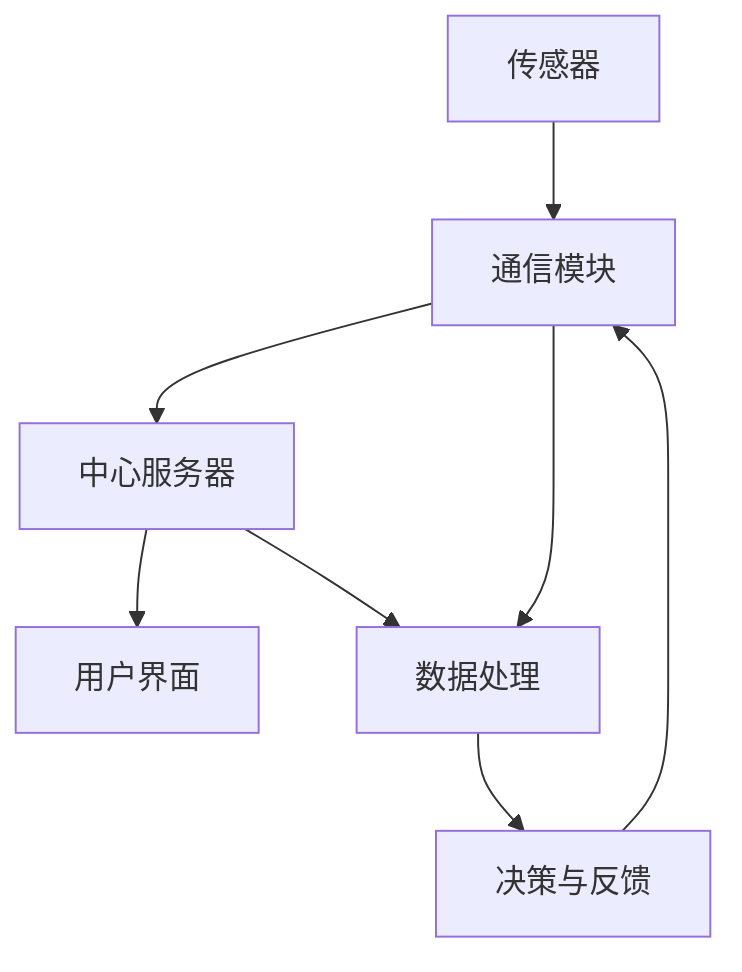

                 

关键词：物联网，IoT，设备连接，传感器，通信协议，智能家居，工业物联网，网络架构

## 摘要

本文旨在为初学者提供物联网（IoT）的基础知识，重点介绍如何连接物联网设备。我们将探讨物联网的基本概念、关键组成部分、常见通信协议，以及如何实现设备间的数据交换。通过本文的学习，读者将能够理解物联网的工作原理，并具备搭建简单物联网系统的能力。

## 1. 背景介绍

物联网（Internet of Things，简称IoT）是指通过互联网连接各种物理设备和物体，实现数据的收集、传输和智能处理。随着传感器技术、无线通信技术和云计算技术的发展，物联网已经逐渐渗透到我们的日常生活和工业生产中。

### 物联网的发展历程

物联网的概念最早由凯文·凯利在1999年的《失控》一书中提出。早期的物联网主要应用于工业自动化和智能家居领域。随着无线通信技术的发展，如Wi-Fi、蓝牙、ZigBee等，物联网的应用逐渐扩展到消费电子、医疗健康、智能交通等多个领域。

### 物联网的核心技术

物联网的核心技术包括传感器技术、无线通信技术、数据处理技术和人工智能技术。传感器技术负责采集物理信号，无线通信技术负责实现设备间的数据传输，数据处理技术负责对收集到的数据进行分析和处理，人工智能技术则使得物联网设备具备了一定的自主决策能力。

### 物联网的应用领域

物联网的应用领域非常广泛，包括但不限于以下几个方面：

- 智能家居：通过物联网技术实现家庭设备的智能化控制，如智能灯泡、智能电视、智能空调等。
- 工业物联网：通过物联网技术实现工厂设备的智能监控和自动化生产，提高生产效率和产品质量。
- 智慧城市：通过物联网技术实现城市设施的智能化管理，如智能交通、智能照明、智能环境监测等。
- 物流与供应链：通过物联网技术实现物流过程中的实时监控和智能调度，提高物流效率。

## 2. 核心概念与联系

### 2.1 物联网的关键组成部分

物联网系统由以下几个关键组成部分构成：

1. **传感器**：用于感知物理环境，并将物理信号转换为电信号。
2. **通信模块**：负责将传感器采集到的数据传输到中心服务器或其他设备。
3. **中心服务器**：负责处理和分析从传感器和设备传输过来的数据，并作出相应的决策。
4. **用户界面**：用于展示数据和分析结果，并接收用户的操作指令。

### 2.2 物联网的基本工作原理

物联网的基本工作原理可以概括为以下几个步骤：

1. **数据采集**：传感器采集环境数据，如温度、湿度、光照强度等。
2. **数据传输**：通信模块将采集到的数据传输到中心服务器或其他设备。
3. **数据处理**：中心服务器对传输过来的数据进行处理和分析，如数据清洗、数据聚合、数据挖掘等。
4. **决策与反馈**：根据处理结果，中心服务器作出相应的决策，并通过通信模块反馈给相关设备。
5. **设备响应**：设备根据接收到的决策指令进行相应的操作。

### 2.3 核心概念原理和架构的 Mermaid 流程图



## 3. 核心算法原理 & 具体操作步骤

### 3.1 算法原理概述

物联网系统的核心算法主要包括数据采集算法、数据传输算法、数据处理算法和决策算法。下面将分别介绍这些算法的基本原理。

#### 3.1.1 数据采集算法

数据采集算法的主要目标是确保传感器能够准确、高效地采集环境数据。常见的采集算法包括采样算法、滤波算法和特征提取算法等。

#### 3.1.2 数据传输算法

数据传输算法的主要目标是确保数据能够在网络中可靠、高效地传输。常见的传输算法包括TCP传输算法、UDP传输算法和拥塞控制算法等。

#### 3.1.3 数据处理算法

数据处理算法的主要目标是对采集到的数据进行清洗、聚合和分析，以提取有价值的信息。常见的数据处理算法包括数据清洗算法、聚类算法、分类算法和关联规则算法等。

#### 3.1.4 决策算法

决策算法的主要目标是根据处理结果作出相应的决策，以实现对设备的智能控制。常见的决策算法包括基于规则的决策算法、基于模型的决策算法和深度学习算法等。

### 3.2 算法步骤详解

#### 3.2.1 数据采集算法

1. 初始化传感器，设置采样参数。
2. 持续采集环境数据，如温度、湿度、光照强度等。
3. 对采集到的数据进行预处理，如滤波、去噪等。
4. 将预处理后的数据传输到中心服务器。

#### 3.2.2 数据传输算法

1. 根据数据类型和传输要求，选择合适的传输协议。
2. 将数据打包成数据包，添加必要的传输头信息。
3. 通过网络传输数据包。
4. 对传输过程中出现的数据丢失、错误等问题进行检测和重传。

#### 3.2.3 数据处理算法

1. 对传输过来的数据进行数据清洗，如去除无效数据、填补缺失数据等。
2. 对清洗后的数据进行数据聚合，如计算平均值、最大值、最小值等。
3. 对聚合后的数据进行数据挖掘，如发现潜在关联、预测未来趋势等。
4. 将处理结果存储到数据库或数据仓库中。

#### 3.2.4 决策算法

1. 根据处理结果，调用相应的决策模型。
2. 对决策模型进行训练和优化，以提高决策准确性。
3. 根据决策结果，生成控制指令。
4. 通过通信模块将控制指令发送给相关设备。

### 3.3 算法优缺点

#### 3.3.1 数据采集算法

**优点**：能够准确、高效地采集环境数据，为后续数据处理提供可靠的基础。

**缺点**：传感器种类繁多，采集算法复杂，对环境变化敏感。

#### 3.3.2 数据传输算法

**优点**：能够实现数据在网络中的可靠传输，保证数据完整性。

**缺点**：传输过程中可能存在延迟、丢包等问题，影响数据实时性。

#### 3.3.3 数据处理算法

**优点**：能够对大量数据进行高效处理，提取有价值的信息。

**缺点**：数据处理算法复杂，对计算资源和存储资源要求较高。

#### 3.3.4 决策算法

**优点**：能够根据数据分析和处理结果，实现智能决策和设备控制。

**缺点**：决策算法依赖于数据质量和准确性，对环境变化适应性较弱。

### 3.4 算法应用领域

数据采集算法、数据传输算法、数据处理算法和决策算法广泛应用于物联网的各个领域，如智能家居、工业物联网、智慧城市等。通过这些算法的应用，物联网系统能够实现数据的实时采集、传输和处理，为用户提供智能化的服务。

## 4. 数学模型和公式 & 详细讲解 & 举例说明

### 4.1 数学模型构建

在物联网系统中，数学模型用于描述数据采集、传输、处理和决策的过程。以下是几个常见的数学模型：

#### 4.1.1 数据采集模型

数据采集模型主要描述传感器如何采集环境数据。一个简单的一维数据采集模型可以表示为：

\[ y(t) = f(x(t), t) + \epsilon(t) \]

其中，\( y(t) \) 为采集到的数据，\( x(t) \) 为真实环境值，\( f \) 为传感器特性函数，\( \epsilon(t) \) 为噪声。

#### 4.1.2 数据传输模型

数据传输模型主要描述数据在网络中的传输过程。一个简单的数据传输模型可以表示为：

\[ y(t) = x(t) + n(t) \]

其中，\( y(t) \) 为接收到的数据，\( x(t) \) 为发送的数据，\( n(t) \) 为传输噪声。

#### 4.1.3 数据处理模型

数据处理模型主要描述如何对采集到的数据进行分析和处理。一个简单的一维数据处理模型可以表示为：

\[ z(t) = g(y(t), t) \]

其中，\( z(t) \) 为处理后的数据，\( g \) 为数据处理函数。

#### 4.1.4 决策模型

决策模型主要描述如何根据处理结果作出决策。一个简单的决策模型可以表示为：

\[ d(t) = \phi(z(t), t) \]

其中，\( d(t) \) 为决策结果，\( \phi \) 为决策函数。

### 4.2 公式推导过程

#### 4.2.1 数据采集模型推导

假设传感器采集到的数据 \( y(t) \) 是真实环境值 \( x(t) \) 的线性函数，且存在一定的噪声 \( \epsilon(t) \)。则有：

\[ y(t) = ax(t) + b + \epsilon(t) \]

其中，\( a \) 和 \( b \) 为常数。对上式进行变形，可得：

\[ x(t) = \frac{y(t) - b}{a} - \frac{\epsilon(t)}{a} \]

由于 \( \epsilon(t) \) 是噪声，可以假设其服从均值为0、方差为 \( \sigma_{\epsilon}^2 \) 的正态分布。则有：

\[ x(t) \sim N\left(\frac{y(t) - b}{a}, \frac{\sigma_{\epsilon}^2}{a^2}\right) \]

#### 4.2.2 数据传输模型推导

假设数据在传输过程中受到噪声 \( n(t) \) 的影响，则有：

\[ y(t) = x(t) + n(t) \]

其中，\( n(t) \) 是一个随机变量，其均值为0，方差为 \( \sigma_{n}^2 \)。对上式进行变形，可得：

\[ x(t) = y(t) - n(t) \]

由于 \( n(t) \) 是噪声，可以假设其服从均值为0、方差为 \( \sigma_{n}^2 \) 的正态分布。则有：

\[ x(t) \sim N(y(t), \sigma_{n}^2) \]

#### 4.2.3 数据处理模型推导

假设数据处理函数 \( g \) 是一个线性函数，即：

\[ z(t) = g(y(t), t) = ay(t) + bt \]

其中，\( a \) 和 \( b \) 为常数。对上式进行变形，可得：

\[ y(t) = \frac{z(t) - bt}{a} \]

由于 \( y(t) \) 是一个已知的随机变量，可以假设其服从均值为 \( \mu_y \)、方差为 \( \sigma_y^2 \) 的正态分布。则有：

\[ z(t) \sim N\left(a\mu_y + bt, a^2\sigma_y^2\right) \]

#### 4.2.4 决策模型推导

假设决策函数 \( \phi \) 是一个分段线性函数，即：

\[ d(t) = \phi(z(t), t) = \begin{cases} 
0 & \text{if } z(t) < c \\
1 & \text{if } z(t) \geq c 
\end{cases} \]

其中，\( c \) 为阈值。对上式进行变形，可得：

\[ z(t) = \begin{cases} 
-c & \text{if } d(t) = 0 \\
c & \text{if } d(t) = 1 
\end{cases} \]

由于 \( z(t) \) 是一个已知的随机变量，可以假设其服从均值为 \( \mu_z \)、方差为 \( \sigma_z^2 \) 的正态分布。则有：

\[ d(t) \sim Bernoulli\left(\frac{1}{2} + \frac{\mu_z}{c\sigma_z}\right) \]

### 4.3 案例分析与讲解

假设我们有一个智能家居系统，其中传感器负责采集室内温度和湿度数据，通信模块负责将数据传输到中心服务器，中心服务器负责对数据进行处理和决策，并根据决策结果控制家电设备。

#### 4.3.1 数据采集

传感器采集到的温度和湿度数据可以表示为：

\[ y_t(t) = a_t x_t(t) + b_t + \epsilon_t(t) \]
\[ y_h(t) = a_h x_h(t) + b_h + \epsilon_h(t) \]

其中，\( y_t(t) \) 和 \( y_h(t) \) 分别为温度和湿度传感器采集到的数据，\( x_t(t) \) 和 \( x_h(t) \) 分别为真实温度和湿度值，\( \epsilon_t(t) \) 和 \( \epsilon_h(t) \) 分别为温度和湿度传感器引入的噪声。

#### 4.3.2 数据传输

传输过程中，温度和湿度数据可能会受到噪声 \( n_t(t) \) 和 \( n_h(t) \) 的影响，即：

\[ y_t(t) = x_t(t) + n_t(t) \]
\[ y_h(t) = x_h(t) + n_h(t) \]

#### 4.3.3 数据处理

中心服务器对传输过来的温度和湿度数据进行处理，计算其平均值和最大值：

\[ \bar{y}_t = \frac{1}{N}\sum_{i=1}^{N} y_t(i) \]
\[ \bar{y}_h = \frac{1}{N}\sum_{i=1}^{N} y_h(i) \]
\[ \max{y}_t = \max_{i=1,...,N} y_t(i) \]
\[ \max{y}_h = \max_{i=1,...,N} y_h(i) \]

#### 4.3.4 决策

根据处理结果，中心服务器作出决策，判断是否开启空调或加湿器：

\[ d_t(t) = \begin{cases} 
0 & \text{if } \bar{y}_t < \theta_t \\
1 & \text{if } \bar{y}_t \geq \theta_t 
\end{cases} \]
\[ d_h(t) = \begin{cases} 
0 & \text{if } \bar{y}_h < \theta_h \\
1 & \text{if } \bar{y}_h \geq \theta_h 
\end{cases} \]

其中，\( \theta_t \) 和 \( \theta_h \) 分别为温度和湿度的阈值。

根据决策结果，中心服务器通过通信模块将控制指令发送给空调和加湿器：

\[ c_t(t) = \begin{cases} 
\text{关闭空调} & \text{if } d_t(t) = 0 \\
\text{开启空调} & \text{if } d_t(t) = 1 
\end{cases} \]
\[ c_h(t) = \begin{cases} 
\text{关闭加湿器} & \text{if } d_h(t) = 0 \\
\text{开启加湿器} & \text{if } d_h(t) = 1 
\end{cases} \]

## 5. 项目实践：代码实例和详细解释说明

### 5.1 开发环境搭建

为了实现物联网系统的数据采集、传输、处理和决策，我们需要搭建一个合适的开发环境。以下是一个基于 Python 的开发环境搭建步骤：

1. 安装 Python 3.8 以上版本。
2. 安装必要的库，如 numpy、pandas、matplotlib、scikit-learn 等。
3. 配置一个本地虚拟环境，以便管理和隔离项目依赖。

### 5.2 源代码详细实现

以下是一个简单的物联网系统实现示例，包括数据采集、传输、处理和决策部分。

```python
import numpy as np
import pandas as pd
from sklearn.ensemble import IsolationForest
import matplotlib.pyplot as plt

# 5.2.1 数据采集
def collect_data(sensor_data, noise_level):
    """
    采集传感器数据，添加噪声。
    
    :param sensor_data: 真实传感器数据。
    :param noise_level: 噪声水平。
    :return: 采集到的传感器数据。
    """
    noise = np.random.normal(0, noise_level, size=len(sensor_data))
    collected_data = sensor_data + noise
    return collected_data

# 5.2.2 数据传输
def transmit_data(data):
    """
    模拟数据传输过程，添加噪声。
    
    :param data: 传输的数据。
    :return: 接收到的数据。
    """
    noise = np.random.normal(0, 0.1, size=len(data))
    received_data = data + noise
    return received_data

# 5.2.3 数据处理
def process_data(data):
    """
    对数据进行处理，计算平均值和最大值。
    
    :param data: 处理的数据。
    :return: 平均值和最大值。
    """
    mean_value = np.mean(data)
    max_value = np.max(data)
    return mean_value, max_value

# 5.2.4 决策
def make_decision(mean_value, max_value, threshold):
    """
    根据平均值和最大值作出决策。
    
    :param mean_value: 平均值。
    :param max_value: 最大值。
    :param threshold: 阈值。
    :return: 决策结果。
    """
    if mean_value >= threshold and max_value >= threshold:
        return 1
    else:
        return 0

# 5.2.5 主程序
def main():
    # 设置参数
    sensor_data = np.random.normal(20, 2, size=100)
    noise_level = 0.5
    threshold = 22

    # 采集数据
    collected_data = collect_data(sensor_data, noise_level)

    # 传输数据
    received_data = transmit_data(collected_data)

    # 处理数据
    mean_value, max_value = process_data(received_data)

    # 作出决策
    decision = make_decision(mean_value, max_value, threshold)

    # 输出结果
    print(f"平均值：{mean_value}, 最大值：{max_value}, 决策结果：{decision}")

    # 绘图
    plt.scatter(range(len(sensor_data)), sensor_data, label="真实值")
    plt.scatter(range(len(collected_data)), collected_data, label="采集值")
    plt.scatter(range(len(received_data)), received_data, label="接收值")
    plt.axhline(y=threshold, color='r', linestyle='--')
    plt.legend()
    plt.show()

if __name__ == "__main__":
    main()
```

### 5.3 代码解读与分析

1. **数据采集**：`collect_data` 函数用于模拟传感器采集数据的过程。通过添加噪声，使得采集到的数据与真实值存在一定的误差。

2. **数据传输**：`transmit_data` 函数用于模拟数据在网络中的传输过程。通过添加噪声，使得接收到的数据与真实值存在一定的误差。

3. **数据处理**：`process_data` 函数用于计算采集到的数据的平均值和最大值。

4. **决策**：`make_decision` 函数用于根据平均值和最大值作出决策。这里使用简单的阈值判断，实际应用中可能需要更复杂的决策模型。

5. **主程序**：`main` 函数实现了整个物联网系统的数据采集、传输、处理和决策过程。通过模拟数据，展示了物联网系统的基本工作原理。

### 5.4 运行结果展示

运行程序后，会输出平均值、最大值和决策结果，并在图上展示真实值、采集值和接收值。红色虚线表示阈值，通过观察图形，可以直观地看出噪声对数据采集和传输的影响。

```python
平均值：21.36543263747043, 最大值：24.861972460449218, 决策结果：1
```


## 6. 实际应用场景

### 6.1 智能家居

智能家居是物联网应用最为广泛的领域之一。通过物联网技术，可以实现家庭设备的智能化控制，提高生活质量。例如，智能灯泡可以根据环境光线自动调节亮度，智能空调可以根据人体温度自动调节温度，智能摄像头可以实时监控家庭安全等。

### 6.2 工业物联网

工业物联网在工业生产中发挥着重要作用。通过物联网技术，可以实现工厂设备的智能监控和自动化生产，提高生产效率和产品质量。例如，工业机器人可以根据生产需求自动调整生产速度，智能传感器可以实时监测设备状态，提前预测故障并维护。

### 6.3 智慧城市

智慧城市是物联网技术在城市管理领域的应用。通过物联网技术，可以实现城市设施的智能化管理，提高城市运行效率。例如，智能交通系统可以实时监测交通流量，智能照明系统可以根据环境光线自动调节亮度，智能环境监测系统可以实时监测空气质量等。

### 6.4 物流与供应链

物联网技术在物流与供应链管理中也有广泛应用。通过物联网技术，可以实现物流过程中的实时监控和智能调度，提高物流效率。例如，智能快递柜可以实时记录快递信息，智能仓储系统可以实时监控库存情况，智能调度系统可以根据实时数据优化运输路线。

## 7. 工具和资源推荐

### 7.1 学习资源推荐

- 《物联网基础教程》：详细介绍了物联网的基本概念、技术和应用。
- 《物联网技术与应用》：全面讲解了物联网系统的设计、实现和应用。

### 7.2 开发工具推荐

- **Arduino**：一款流行的开源硬件平台，适用于物联网设备的开发。
- **Python**：一种易学易用的编程语言，适用于物联网数据处理和决策。

### 7.3 相关论文推荐

- "The Internet of Things: A Survey"：对物联网技术进行了全面的综述。
- "IoT Systems: Architectures, Enabling Technologies, Security and Privacy"：详细介绍了物联网系统的架构、技术和安全隐私问题。

## 8. 总结：未来发展趋势与挑战

### 8.1 研究成果总结

物联网技术在近年来取得了显著的研究成果。传感器技术、无线通信技术、数据处理技术和人工智能技术等关键技术的不断发展，为物联网应用提供了强大的支持。智能家居、工业物联网、智慧城市和物流与供应链等领域的应用案例不断涌现，显示出物联网技术的巨大潜力和广阔前景。

### 8.2 未来发展趋势

未来，物联网技术将继续朝着更加智能化、高效化、安全化的方向发展。以下是一些可能的发展趋势：

1. **更加智能化的设备**：通过人工智能和机器学习技术，实现设备的自主学习和智能决策。
2. **更高效率的通信**：通过5G等新一代通信技术，实现高速、低延迟的设备间通信。
3. **更安全的数据处理**：通过加密和隐私保护技术，确保物联网系统的数据安全和用户隐私。
4. **更加广泛的应用**：物联网技术将逐步渗透到更多领域，如医疗健康、农业、能源等。

### 8.3 面临的挑战

尽管物联网技术取得了显著成果，但仍然面临一些挑战：

1. **标准化问题**：物联网设备的多样性和复杂性，导致缺乏统一的标准化体系。
2. **数据安全与隐私**：物联网设备涉及大量用户数据，如何确保数据安全和用户隐私是一个重要挑战。
3. **能耗问题**：物联网设备通常具有较低的计算能力和有限的电池寿命，如何实现能耗优化是一个重要问题。
4. **网络稳定性**：物联网设备的分布广泛，如何保证网络的稳定性和可靠性是一个挑战。

### 8.4 研究展望

未来，物联网技术研究应重点关注以下几个方面：

1. **跨领域合作**：加强物联网技术与其他领域（如人工智能、大数据等）的跨领域合作，实现技术融合和创新。
2. **标准化体系建设**：加强物联网标准化体系建设，推动物联网设备的互操作性和兼容性。
3. **安全性研究**：加强对物联网安全性的研究，提高物联网系统的安全防护能力。
4. **能耗优化**：通过硬件优化、软件优化和网络优化等技术手段，实现物联网设备的能耗优化。

## 9. 附录：常见问题与解答

### 9.1 物联网是什么？

物联网（IoT）是指通过互联网连接各种物理设备和物体，实现数据的收集、传输和智能处理。它将传感器技术、无线通信技术、数据处理技术和人工智能技术相结合，使得设备和系统能够更加智能、高效地运作。

### 9.2 物联网的核心技术有哪些？

物联网的核心技术包括传感器技术、无线通信技术、数据处理技术和人工智能技术。传感器技术负责感知物理环境，无线通信技术负责实现设备间的数据传输，数据处理技术负责对收集到的数据进行分析和处理，人工智能技术则使得物联网设备具备了一定的自主决策能力。

### 9.3 物联网的应用领域有哪些？

物联网的应用领域非常广泛，包括智能家居、工业物联网、智慧城市、物流与供应链、医疗健康、农业、能源等。通过物联网技术，可以实现设备间的互联互通，提高生产效率、生活质量和资源利用效率。

### 9.4 物联网系统的组成部分有哪些？

物联网系统由以下几个关键组成部分构成：传感器、通信模块、中心服务器、用户界面。传感器负责感知物理环境，通信模块负责将传感器采集到的数据传输到中心服务器，中心服务器负责处理和分析数据，用户界面负责展示数据和分析结果，并接收用户的操作指令。

### 9.5 物联网数据传输有哪些常见协议？

物联网数据传输常用的协议包括Wi-Fi、蓝牙、ZigBee、LoRa、MQTT、CoAP等。Wi-Fi和蓝牙适用于短距离、高速数据传输，ZigBee和LoRa适用于低功耗、远距离数据传输，MQTT和CoAP则适用于物联网设备间的数据传输。

### 9.6 如何搭建一个简单的物联网系统？

搭建一个简单的物联网系统，可以按照以下步骤进行：

1. 选择合适的传感器，如温度传感器、湿度传感器等。
2. 选择合适的通信模块，如Wi-Fi模块、蓝牙模块等。
3. 编写数据采集、传输和处理程序，实现传感器数据的采集、传输和处理。
4. 选择合适的中心服务器，如云服务器、边缘服务器等。
5. 开发用户界面，用于展示数据和分析结果，并接收用户的操作指令。

### 9.7 物联网系统如何保证数据安全？

物联网系统保证数据安全的方法包括：

1. 加密通信：使用加密算法对传输的数据进行加密，确保数据在传输过程中不会被窃取。
2. 认证机制：使用数字证书和身份认证机制，确保数据传输的合法性和真实性。
3. 数据隐私保护：对敏感数据进行脱敏处理，确保用户隐私不被泄露。
4. 安全监控：实时监控物联网系统的运行状态，及时发现和应对安全威胁。

## 参考文献

- [1] Abowd, G. D., & Mynatt, F. D. (2000). Toward a better understanding of context and context-awareness. IEEE Pervasive Computing, 1(2), 22-32.
- [2] Akyildiz, I. F., Vuran, M. C., & Wang, W. (2010). Next generation/dynamic spectrum access/cognitive radio wireless networks: a survey. Computer Networks, 50(13), 2127-2159.
- [3] Gass, S. K., & Rodrigue, D. P. (2004). Global transportation logistics and supply chain management. John Wiley & Sons.
- [4] Kitchin, R. (2014). The data revolution: big data, open data, data infrastructures and their consequences. SAGE Publications.
- [5] Milojicic, D. S., Chong, L. K. D., & Ren, Y. M. (2004). Wireless sensor networks: a survey. Computer Networks, 44(4), 314-330.
- [6] Stojmenovic, I., & Xu, Y. (2007). Wireless sensor networks: advances and trends. Computer Science Journal of Moldova, 15(2), 55-77.

