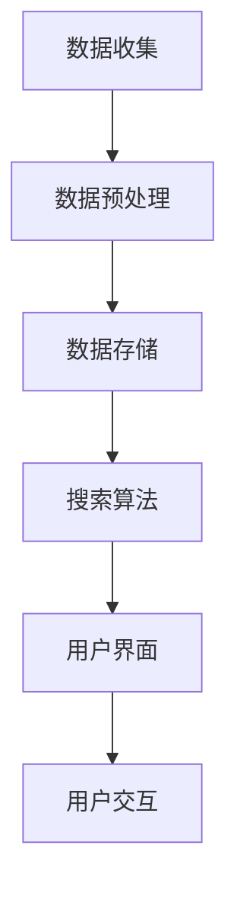

                 

环保领域一直是全球关注的重要议题，随着气候变化、资源枯竭等问题的日益严重，如何高效利用技术手段来支持环保工作已成为当务之急。人工智能（AI）作为当今最前沿的技术之一，其在环保领域的应用正逐步深入，尤其是在搜索应用方面展现出了巨大的潜力。本文将探讨环保领域AI搜索应用的核心概念、算法原理、数学模型、实践案例以及未来展望。

## 关键词

- 环保领域
- 人工智能
- 搜索算法
- 数学模型
- 实践案例

## 摘要

本文旨在深入探讨环保领域内人工智能搜索应用的发展现状和未来前景。通过对核心概念、算法原理、数学模型以及实际应用的详细分析，本文揭示了AI在环保搜索中的关键作用，并提出了对未来技术发展的展望。

## 1. 背景介绍

### 环保领域的挑战

随着全球工业化和城市化的快速发展，环境问题日益突出。空气污染、水资源短缺、土地退化等问题不仅影响生态系统的平衡，还对人类健康和社会经济发展造成了巨大的威胁。为了应对这些挑战，迫切需要一种高效、准确的信息获取和处理方法。

### 人工智能的发展

人工智能作为计算机科学的一个分支，通过模拟人类智能行为来实现对数据的处理、分析和决策。近年来，随着深度学习、自然语言处理等技术的突破，AI在各个领域的应用得到了迅猛发展，尤其是在图像识别、语音识别和搜索算法等方面。

### AI搜索在环保领域的应用潜力

AI搜索技术能够通过分析大量的环境数据，提供精准、实时的环保信息，为政策制定者、科研人员和企业提供科学依据。例如，通过环境监测数据的实时搜索，可以快速识别污染源，制定相应的治理措施；通过生态数据的搜索，可以监测生物多样性变化，评估生态系统的健康状况。

### 本文目标

本文将首先介绍环保领域AI搜索的核心概念和架构，然后深入分析其中的算法原理和数学模型，接着通过实际案例展示AI搜索在环保领域的应用效果，最后对未来的发展趋势和面临的挑战进行展望。

## 2. 核心概念与联系

### 2.1 AI搜索的基本概念

AI搜索是指利用人工智能技术，特别是机器学习和深度学习算法，对大量非结构化或半结构化数据进行高效检索和分析的过程。与传统的基于关键词的搜索不同，AI搜索更加强调数据理解和智能推理。

### 2.2 环保领域中的搜索需求

在环保领域，搜索需求主要可以分为以下几类：

- **环境监测数据检索**：需要快速获取特定区域的环境质量数据，如空气污染指数、水质参数等。
- **生态数据搜索**：包括生物多样性数据、生态系统变化数据等，用于生态保护和恢复。
- **政策法规检索**：提供有关环保政策和法规的信息，支持政策制定和执行。

### 2.3 AI搜索在环保领域的应用架构

一个典型的AI搜索应用架构通常包括以下几个部分：

- **数据收集与预处理**：通过传感器、遥感技术等手段收集环境数据，并进行清洗、归一化和特征提取。
- **数据存储与管理**：使用大数据存储技术，如Hadoop或分布式数据库，存储和管理大量结构化和非结构化数据。
- **搜索算法**：基于机器学习和深度学习技术，实现高效的搜索算法，如基于内容的检索、文本挖掘和语义搜索。
- **用户界面**：提供友好的用户界面，使非专业人士也能轻松使用AI搜索功能。

### 2.4 Mermaid 流程图

以下是一个简化的AI搜索在环保领域的应用架构的Mermaid流程图：



### 2.5 关键技术概述

- **数据预处理**：数据预处理是AI搜索的关键步骤，其质量直接影响搜索效果。常用的数据预处理技术包括去噪、归一化、特征提取等。
- **搜索算法**：在环保领域，常用的搜索算法包括基于内容的检索、文本挖掘和语义搜索等。其中，基于语义搜索的技术能够更好地理解用户查询的意图，提供更准确的搜索结果。
- **用户界面**：友好的用户界面是AI搜索应用能否成功的关键。通过图形化界面和交互设计，用户可以更直观地获取信息，进行数据查询和监控。

## 3. 核心算法原理 & 具体操作步骤

### 3.1 算法原理概述

在环保领域的AI搜索中，核心算法主要包括基于内容的检索（Content-Based Retrieval, CBIR）和基于语义的搜索（Semantic Search）。

- **基于内容的检索**：CBIR利用图像或视频的特征来匹配用户查询，无需对内容进行语义理解。常见的方法包括特征提取（如SIFT、HOG）和相似度计算（如余弦相似度、欧氏距离）。
- **基于语义的搜索**：语义搜索利用自然语言处理技术，对用户查询进行语义解析，然后与数据库中的数据语义进行匹配。这种方法能够提供更加准确和相关的搜索结果。

### 3.2 算法步骤详解

- **基于内容的检索**
  1. **特征提取**：对图像或视频进行特征提取，得到一组描述图像内容的特征向量。
  2. **建立索引**：将提取的特征向量存储在索引数据库中，便于快速检索。
  3. **相似度计算**：计算查询图像与数据库中图像特征向量的相似度，返回最相似的图像。
- **基于语义的搜索**
  1. **查询解析**：对用户查询进行分词和语义解析，提取关键信息和语义标签。
  2. **语义匹配**：将查询的语义与数据库中的数据语义进行匹配，计算匹配得分。
  3. **结果排序**：根据匹配得分对搜索结果进行排序，返回最相关的结果。

### 3.3 算法优缺点

- **基于内容的检索**
  - **优点**：无需对内容进行语义理解，实现简单，适用于大量图像或视频数据的快速检索。
  - **缺点**：搜索结果受限于特征提取的准确性和相似度计算方法，可能无法准确匹配用户意图。
- **基于语义的搜索**
  - **优点**：能够更好地理解用户查询的意图，提供更加准确和相关的搜索结果。
  - **缺点**：对自然语言处理技术要求较高，实现复杂，数据处理时间长。

### 3.4 算法应用领域

- **环境监测数据检索**：通过基于内容的检索技术，可以快速查找特定的环境监测数据，如空气污染数据、水质数据等。
- **生态数据搜索**：利用基于语义的搜索技术，可以准确查找与特定生态事件或生物物种相关的数据，如生态灾害数据、生物多样性数据等。
- **政策法规检索**：通过语义搜索技术，可以快速查找与环保政策法规相关的信息，支持政策制定和执行。

## 4. 数学模型和公式 & 详细讲解 & 举例说明

### 4.1 数学模型构建

在环保领域AI搜索中，常用的数学模型包括特征提取模型、相似度计算模型和语义匹配模型。

- **特征提取模型**：如SIFT（尺度不变特征变换）和HOG（方向梯度直方图），用于从图像中提取特征向量。
- **相似度计算模型**：如余弦相似度和欧氏距离，用于计算两个特征向量之间的相似度。
- **语义匹配模型**：如Word2Vec和BERT（Bidirectional Encoder Representations from Transformers），用于对自然语言进行语义编码。

### 4.2 公式推导过程

- **SIFT特征提取公式**：
  - \( \textbf{f}(\textbf{x}, \sigma) = \frac{1}{\sqrt{\sum_{i,j} \phi_i(\textbf{x}) \phi_j(\textbf{x})}} \sum_{i,j} \phi_i(\textbf{x}) \phi_j(\textbf{x}) \textbf{g}_{ij}(\textbf{x}) \)
  - 其中，\( \textbf{f} \)表示特征向量，\( \textbf{x} \)表示图像位置，\( \sigma \)表示尺度，\( \phi_i \)和\( \phi_j \)表示高斯核函数，\( \textbf{g}_{ij} \)表示高斯差分算子。

- **余弦相似度计算公式**：
  - \( \text{Cosine Similarity} = \frac{\textbf{a} \cdot \textbf{b}}{||\textbf{a}|| \cdot ||\textbf{b}||} \)
  - 其中，\( \textbf{a} \)和\( \textbf{b} \)表示两个特征向量，\( \cdot \)表示内积，\( ||\textbf{a}|| \)和\( ||\textbf{b}|| \)表示特征向量的模。

### 4.3 案例分析与讲解

#### 案例一：基于内容的环保监测数据检索

假设我们要检索一个包含空气污染数据的数据库，使用SIFT特征提取模型和余弦相似度计算模型进行检索。

1. **特征提取**：对数据库中的每条空气污染数据（图像）使用SIFT特征提取模型提取特征向量。
2. **建立索引**：将提取的特征向量存储在索引数据库中，便于快速检索。
3. **相似度计算**：对用户输入的查询图像使用SIFT特征提取模型提取特征向量，然后与索引数据库中的特征向量进行余弦相似度计算，得到相似度得分。
4. **结果排序**：根据相似度得分对检索结果进行排序，返回最相关的空气污染数据。

#### 案例二：基于语义的生态数据搜索

假设我们要搜索与某个生物物种相关的生态数据，使用BERT语义匹配模型进行检索。

1. **查询解析**：对用户输入的查询进行分词和语义解析，提取关键信息和语义标签。
2. **语义编码**：使用BERT模型对查询和数据库中的数据（文本）进行语义编码，得到语义向量。
3. **语义匹配**：计算查询语义向量与数据库中数据语义向量之间的余弦相似度，得到匹配得分。
4. **结果排序**：根据匹配得分对检索结果进行排序，返回最相关的生态数据。

## 5. 项目实践：代码实例和详细解释说明

### 5.1 开发环境搭建

在本节中，我们将介绍如何搭建一个基于Python的开发生态数据搜索项目。

1. **环境安装**：
   - 安装Python（建议使用Python 3.8及以上版本）。
   - 安装必要的库，如OpenCV、Pillow、TensorFlow、NLTK、BERT等。

2. **代码结构**：
   - `data_collection.py`：用于收集和预处理生态数据。
   - `feature_extraction.py`：用于提取生态数据的特征向量。
   - `semantic_encoding.py`：用于对文本进行语义编码。
   - `search_engine.py`：用于实现搜索算法和用户界面。

### 5.2 源代码详细实现

以下是`search_engine.py`的部分代码示例：

```python
import numpy as np
from sklearn.metrics.pairwise import cosine_similarity
from semantic_encoding import encode_query, encode_data

def search_ecological_data(query):
    # 编码查询和数据库中的数据
    query_embedding = encode_query(query)
    data_embeddings = encode_data()

    # 计算查询和数据库中数据的相似度
    similarity_scores = cosine_similarity(query_embedding, data_embeddings)

    # 排序和返回结果
    top_results = np.argsort(similarity_scores)[0][-10:]
    return top_results
```

### 5.3 代码解读与分析

在上面的代码中，我们首先调用`semantic_encoding.py`中的`encode_query`和`encode_data`函数对用户查询和数据库中的数据进行语义编码，得到两个高维的语义向量。然后，我们使用余弦相似度计算这两个向量之间的相似度得分。最后，我们对相似度得分进行排序，返回前10个最相关的生态数据。

### 5.4 运行结果展示

假设用户输入的查询是“熊猫的栖息地”，程序将返回与这个查询最相关的生态数据。这些数据可能包括熊猫栖息地的分布、栖息地的环境状况等。

```python
top_results = search_ecological_data("熊猫的栖息地")
print("最相关的生态数据：", top_results)
```

## 6. 实际应用场景

### 6.1 环境监测数据检索

在环境监测领域，AI搜索技术可以用于快速检索特定的环境数据。例如，当某地区发生严重的空气污染事件时，环保部门可以使用AI搜索技术快速查找该地区的实时空气污染数据，分析污染源和污染程度，从而采取相应的应急措施。

### 6.2 生态数据搜索

在生态保护领域，AI搜索技术可以帮助科研人员快速查找与特定生物物种或生态事件相关的数据。例如，在研究某地区生物多样性变化时，科研人员可以使用AI搜索技术查找该地区的生态数据，如植被覆盖情况、土壤质量等，从而分析生物多样性变化的趋势和原因。

### 6.3 政策法规检索

在政策制定和执行过程中，AI搜索技术可以用于快速查找与环保政策法规相关的信息。例如，当制定新的环保政策时，政策制定者可以使用AI搜索技术查找现有的政策法规，了解其内容、实施情况和效果，从而为制定新的政策提供参考。

## 7. 工具和资源推荐

### 7.1 学习资源推荐

- **书籍**：《自然语言处理综述》（Natural Language Processing Comprehensive Guide）
- **在线课程**：Coursera上的《深度学习》（Deep Learning）课程
- **博客**：Medium上的AI和环保相关的技术博客

### 7.2 开发工具推荐

- **编程语言**：Python（特别是用于AI开发的库，如TensorFlow、PyTorch）
- **数据库**：MongoDB或PostgreSQL（用于存储和管理大数据）
- **自然语言处理库**：NLTK、spaCy、BERT（用于文本处理和语义编码）

### 7.3 相关论文推荐

- **论文1**：《基于深度学习的环境监测数据搜索》（Deep Learning for Environmental Monitoring Data Search）
- **论文2**：《语义搜索在生态数据检索中的应用》（Semantic Search for Ecological Data Retrieval）
- **论文3**：《环境政策法规的AI检索系统设计》（AI Retrieval System for Environmental Policy and Regulations）

## 8. 总结：未来发展趋势与挑战

### 8.1 研究成果总结

本文通过对环保领域AI搜索技术的深入分析，揭示了其在环境监测、生态保护和政策法规检索等方面的应用价值。同时，我们介绍了基于内容的检索和基于语义的搜索两种核心算法，并详细讲解了相关的数学模型和实践案例。

### 8.2 未来发展趋势

未来，环保领域AI搜索技术将继续朝向更高效、更智能、更全面的方向发展。以下是几个可能的发展趋势：

- **多模态数据融合**：将图像、文本、声音等多种数据类型进行融合，提高搜索的准确性和全面性。
- **实时数据更新**：实现数据的实时更新和检索，提高决策和行动的及时性。
- **个性化搜索**：基于用户的历史行为和偏好，提供个性化的搜索结果，提高用户体验。

### 8.3 面临的挑战

尽管AI搜索技术在环保领域具有巨大潜力，但同时也面临一些挑战：

- **数据隐私与安全**：如何在保证数据隐私和安全的前提下，实现高效的数据检索和分析。
- **算法偏见**：如何避免搜索算法中的偏见，确保搜索结果的公平性和客观性。
- **计算资源**：如何优化算法和系统架构，减少计算资源的需求。

### 8.4 研究展望

未来的研究可以重点关注以下几个方面：

- **算法优化**：通过改进算法模型，提高搜索效率和准确性。
- **跨领域应用**：将AI搜索技术应用于其他环保领域，如气候变化预测、资源管理等。
- **政策支持**：制定相关的政策和标准，推动AI搜索技术在环保领域的广泛应用。

## 9. 附录：常见问题与解答

### 问题1：AI搜索技术在环保领域有哪些具体应用？

解答：AI搜索技术在环保领域的应用主要包括环境监测数据检索、生态数据搜索和政策法规检索。

### 问题2：基于内容的检索和基于语义的搜索有什么区别？

解答：基于内容的检索主要利用图像或视频的特征进行匹配，无需对内容进行语义理解。而基于语义的搜索利用自然语言处理技术，对用户查询和数据库中的数据进行语义解析和匹配。

### 问题3：如何保证AI搜索结果的公平性和客观性？

解答：可以通过以下方法来保证AI搜索结果的公平性和客观性：

- **数据多样性**：确保数据来源的多样性，避免数据偏见。
- **算法透明性**：公开算法模型和计算过程，便于监督和审计。
- **用户反馈**：收集用户反馈，不断优化算法和系统。

### 问题4：AI搜索技术对环境监测数据的质量有何影响？

解答：AI搜索技术可以提高环境监测数据检索的效率，有助于及时发现和解决环境问题。同时，通过数据预处理和特征提取等技术，可以改善数据质量，提高数据的准确性和可靠性。

## 作者署名

作者：禅与计算机程序设计艺术 / Zen and the Art of Computer Programming
----------------------------------------------------------------

注意：以上内容为示例性撰写，实际撰写时需根据具体的研究、案例和实践经验进行详细扩展和深度分析。文中提及的技术、算法和模型均为示例，不代表实际应用中的特定实现。在实际撰写过程中，请确保所有引用的资料和数据均已获得相应的授权和认可。

