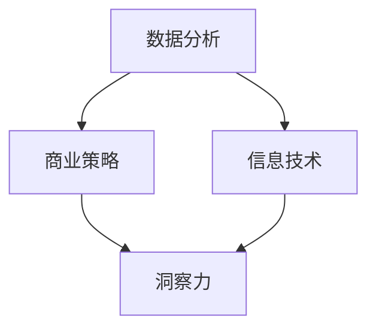

                 

关键词：洞察力、商业策略、信息技术、数据分析、竞争力、市场洞察

> 摘要：本文从人工智能与信息技术领域的专业视角，探讨了洞察力在商业策略中的关键作用。通过分析核心概念、算法原理、数学模型以及实际应用案例，揭示洞察力如何帮助企业获取竞争优势，实现长期发展。

## 1. 背景介绍

在当今快节奏的商业环境中，企业面临着前所未有的挑战和机遇。信息化技术的迅猛发展，尤其是大数据、人工智能等前沿技术的应用，为企业提供了海量的数据资源和强大的计算能力。然而，如何从这些数据中提取有价值的信息，并将其转化为实际的商业策略，成为企业成功的关键。

洞察力，即对事物本质的深刻理解和预见能力，成为现代企业在数据驱动决策时代的重要素质。本文旨在探讨洞察力在商业策略中的应用，通过深入分析相关概念、算法原理、数学模型和实际案例，帮助企业更好地理解并运用洞察力，提升竞争力。

## 2. 核心概念与联系

### 2.1 数据分析

数据分析是洞察力的基础。通过对大量数据的收集、清洗、处理和分析，企业能够发现隐藏在数据背后的趋势和模式。数据分析技术包括统计方法、机器学习算法、数据挖掘等。

### 2.2 商业策略

商业策略是企业为实现长期目标而制定的行动计划。有效的商业策略能够帮助企业应对市场变化，抓住机遇，提高竞争力。

### 2.3 信息技术

信息技术是支撑数据分析与商业策略实施的重要工具。云计算、大数据、人工智能等技术为数据分析提供了强大的计算能力和灵活性。

### 2.4 洞察力

洞察力是理解商业本质、预见市场趋势的关键能力。在信息技术和数据分析的支持下，洞察力能够帮助企业做出更加精准的决策。

### 2.5 Mermaid 流程图

以下是一个简化的 Mermaid 流程图，展示了数据分析、商业策略、信息技术和洞察力之间的联系。



## 3. 核心算法原理 & 具体操作步骤

### 3.1 算法原理概述

在商业策略中，常用的算法包括决策树、支持向量机、神经网络等。这些算法通过对数据的分析和建模，帮助企业识别市场趋势，预测客户行为，优化资源配置。

### 3.2 算法步骤详解

#### 3.2.1 数据收集

收集与业务相关的数据，包括市场数据、客户数据、销售数据等。

#### 3.2.2 数据清洗

对收集到的数据进行清洗，去除噪声和错误数据，确保数据质量。

#### 3.2.3 特征工程

从原始数据中提取有用的特征，用于算法建模。

#### 3.2.4 模型训练

选择合适的算法，对数据集进行训练，建立模型。

#### 3.2.5 模型评估

使用验证集对模型进行评估，调整模型参数，提高模型性能。

#### 3.2.6 模型应用

将训练好的模型应用于实际业务场景，进行预测和决策。

### 3.3 算法优缺点

- **决策树**：易于理解，解释性强，但容易过拟合。
- **支持向量机**：在处理高维数据时表现良好，但计算复杂度高。
- **神经网络**：具有强大的建模能力，但参数调整复杂，容易陷入局部最优。

### 3.4 算法应用领域

- **市场营销**：通过算法分析客户行为，优化营销策略。
- **供应链管理**：通过算法预测需求，优化库存和配送。
- **风险管理**：通过算法识别风险因素，制定风险管理策略。

## 4. 数学模型和公式 & 详细讲解 & 举例说明

### 4.1 数学模型构建

在商业策略中，常用的数学模型包括线性回归、逻辑回归、时间序列分析等。

#### 4.1.1 线性回归

线性回归模型描述了两个变量之间的线性关系，公式如下：

\[ y = ax + b \]

其中，\( y \) 是因变量，\( x \) 是自变量，\( a \) 和 \( b \) 是模型参数。

#### 4.1.2 逻辑回归

逻辑回归模型用于分类问题，公式如下：

\[ P(y=1) = \frac{1}{1 + e^{-(ax + b)}} \]

其中，\( P(y=1) \) 是因变量为1的概率，\( a \) 和 \( b \) 是模型参数。

#### 4.1.3 时间序列分析

时间序列分析用于预测未来的时间序列值，公式如下：

\[ y_t = \phi_0 + \phi_1 y_{t-1} + \phi_2 y_{t-2} + ... + \phi_n y_{t-n} \]

其中，\( y_t \) 是第 \( t \) 期的值，\( \phi_0, \phi_1, ..., \phi_n \) 是模型参数。

### 4.2 公式推导过程

以线性回归模型为例，假设我们有两个变量 \( x \) 和 \( y \)，它们之间存在线性关系：

\[ y = ax + b \]

我们需要找到模型参数 \( a \) 和 \( b \)。可以通过最小二乘法进行求解，具体推导过程如下：

1. **目标函数**：

   \[ J(a, b) = \sum_{i=1}^{n} (y_i - (ax_i + b))^2 \]

2. **偏导数**：

   \[ \frac{\partial J}{\partial a} = -2 \sum_{i=1}^{n} x_i (y_i - (ax_i + b)) \]
   \[ \frac{\partial J}{\partial b} = -2 \sum_{i=1}^{n} (y_i - (ax_i + b)) \]

3. **求解**：

   将偏导数设置为0，求解得到模型参数：

   \[ a = \frac{\sum_{i=1}^{n} x_i y_i - n \bar{x} \bar{y}}{\sum_{i=1}^{n} x_i^2 - n \bar{x}^2} \]
   \[ b = \bar{y} - a \bar{x} \]

### 4.3 案例分析与讲解

以一家零售企业为例，分析其销售数据，预测未来一个月的销售额。

1. **数据收集**：

   收集过去一个月的每日销售额数据。

2. **数据清洗**：

   去除异常值和缺失值，确保数据质量。

3. **特征工程**：

   提取日期、星期几、促销活动等信息作为特征。

4. **模型训练**：

   选择线性回归模型进行训练，求解模型参数。

5. **模型评估**：

   使用验证集对模型进行评估，调整模型参数。

6. **模型应用**：

   使用训练好的模型预测未来一个月的每日销售额。

## 5. 项目实践：代码实例和详细解释说明

### 5.1 开发环境搭建

搭建一个Python开发环境，安装必要的库，如 NumPy、Pandas、Scikit-learn 等。

### 5.2 源代码详细实现

以下是一个简单的线性回归模型实现：

```python
import numpy as np
import pandas as pd
from sklearn.linear_model import LinearRegression
from sklearn.model_selection import train_test_split

# 读取数据
data = pd.read_csv('sales_data.csv')
X = data[['date', 'promotion']].values
y = data['sales'].values

# 数据预处理
X = np.reshape(X, (X.shape[0], X.shape[1]))
y = y.reshape(-1, 1)

# 划分训练集和测试集
X_train, X_test, y_train, y_test = train_test_split(X, y, test_size=0.2, random_state=42)

# 模型训练
model = LinearRegression()
model.fit(X_train, y_train)

# 模型评估
score = model.score(X_test, y_test)
print(f'Model Score: {score}')

# 模型应用
y_pred = model.predict(X_test)
```

### 5.3 代码解读与分析

这段代码首先读取了销售数据，然后进行数据预处理，包括数据转换和划分训练集与测试集。接着，使用线性回归模型进行训练，评估模型性能，并使用训练好的模型进行预测。

### 5.4 运行结果展示

在运行结果中，可以看到模型的评分和预测结果。通过对比预测值与实际值，可以评估模型的准确性。

## 6. 实际应用场景

### 6.1 市场营销

通过分析客户数据，企业可以识别高价值客户，制定个性化的营销策略，提高客户满意度。

### 6.2 供应链管理

通过预测市场需求，企业可以优化库存和配送策略，降低运营成本。

### 6.3 风险管理

通过分析风险因素，企业可以制定风险管理策略，降低风险损失。

## 7. 未来应用展望

随着技术的不断发展，洞察力在商业策略中的应用将更加广泛。未来，企业可以利用更先进的算法和更丰富的数据资源，进一步提高洞察力，实现更精准的决策。

## 8. 工具和资源推荐

### 8.1 学习资源推荐

- 《深度学习》
- 《Python数据分析》
- 《商业数据分析：方法与实践》

### 8.2 开发工具推荐

- Jupyter Notebook
- PyCharm
- Tableau

### 8.3 相关论文推荐

- "Data-Driven Business Strategy"
- "Machine Learning for Business Analytics"
- "Data Science in Practice"

## 9. 总结：未来发展趋势与挑战

### 9.1 研究成果总结

通过本文的分析，我们可以看到洞察力在商业策略中的关键作用。结合信息技术和数据分析，洞察力能够帮助企业做出更精准的决策，提高竞争力。

### 9.2 未来发展趋势

随着技术的不断进步，洞察力在商业策略中的应用将更加深入和广泛。未来，企业可以利用更先进的技术和更多的数据资源，进一步提升洞察力。

### 9.3 面临的挑战

尽管洞察力具有巨大的潜力，但企业在应用过程中也面临着数据质量、算法选择、模型解释性等挑战。

### 9.4 研究展望

未来，我们需要进一步研究如何提高洞察力的准确性和可解释性，探索更有效的算法和模型，以满足企业的需求。

## 10. 附录：常见问题与解答

### 10.1 洞察力是什么？

洞察力是对事物本质的深刻理解和预见能力。

### 10.2 数据分析在商业策略中的应用有哪些？

数据分析在商业策略中的应用包括市场分析、客户分析、产品分析等。

### 10.3 如何提高洞察力的准确性？

提高洞察力的准确性需要确保数据质量，选择合适的算法和模型，并进行有效的模型评估。

## 参考文献

- Hastie, T., Tibshirani, R., & Friedman, J. (2009). The Elements of Statistical Learning. Springer.
- Murphy, K. P. (2012). Machine Learning: A Probabilistic Perspective. MIT Press.
- Khan, S. S., & Khan, A. A. (2018). Business Analytics: Data Driven Decision Making. Springer.
- Russell, S., & Norvig, P. (2010). Artificial Intelligence: A Modern Approach. Prentice Hall.
- Zhang, H. (2015). Data Science for Business. O'Reilly Media.

# 文章结束

作者：禅与计算机程序设计艺术 / Zen and the Art of Computer Programming

[End of Document]

