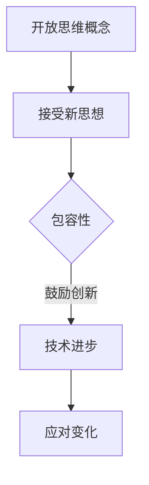
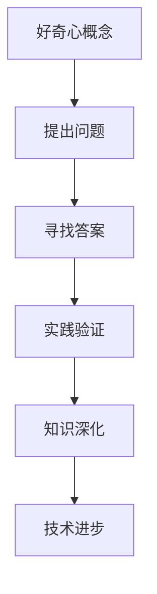
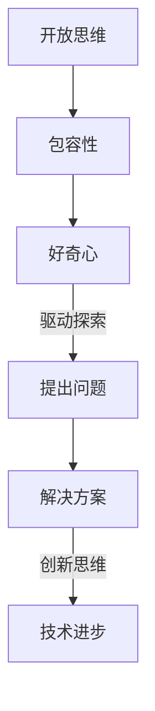
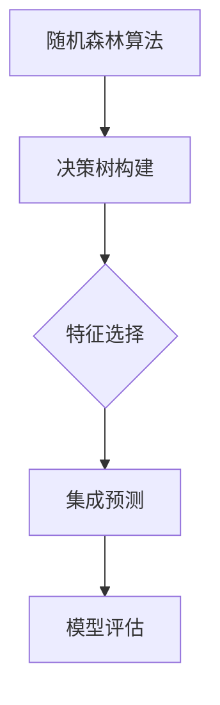

                 

关键词：洞察力，开放思维，好奇心，技术进步，IT领域，人工智能，算法，数学模型

> 摘要：本文旨在探讨如何在IT领域培养和提升洞察力，强调开放思维和好奇心的重要性。通过分析开放思维和好奇心的核心概念，以及它们在技术进步和创新中的关键作用，本文提出了具体的方法和策略，帮助读者在实践中培养这种能力，以应对未来技术发展的挑战。

## 1. 背景介绍

在信息技术飞速发展的今天，数据处理、分析和应用成为推动社会进步的重要力量。然而，技术创新并不仅仅依赖于技术本身，更需要具备深刻的洞察力和开放思维。洞察力是理解复杂问题的能力，它使得我们能够从纷繁复杂的信息中提取本质，发现关键点，进而提出创新的解决方案。开放思维则是一种包容和接纳新思想、新观点的态度，它鼓励我们从多角度、多维度去思考和解决问题。好奇心则是一种内在驱动力，促使我们不断探索未知，追求知识和理解。

本文将围绕这些核心概念，探讨如何在IT领域培养和提升洞察力，强调开放思维和好奇心的重要性。通过对开放思维和好奇心的深入分析，以及具体方法的应用，本文旨在为IT从业者提供实用的指导，以应对未来技术发展的挑战。

## 2. 核心概念与联系

### 2.1 开放思维

开放思维是指一种包容、接纳和探索新思想、新观点的态度。它要求我们不受限于传统的思维方式，敢于挑战现有的假设，并勇于接受新的想法和解决方案。在IT领域，开放思维尤其重要，因为技术发展迅速，新的理念和方法层出不穷。具有开放思维的开发者能够更好地适应这些变化，抓住机遇，推动技术进步。

**Mermaid 流程图：**



### 2.2 好奇心

好奇心是一种驱使我们探索未知、追求知识的内在驱动力。它促使我们提出问题，寻找答案，并通过实践不断验证和深化自己的理解。在IT领域，好奇心是推动技术创新的重要动力。具有强烈好奇心的人能够不断发现新的问题和机会，从而推动技术不断进步。

**Mermaid 流程图：**



### 2.3 开放思维与好奇心的联系

开放思维和好奇心是相辅相成的。开放思维提供了接受和探索新思想的环境，而好奇心则驱动我们不断提出问题，探索未知。这两者共同作用，使我们能够更全面、深入地理解问题，并找到创新的解决方案。

**Mermaid 流程图：**



## 3. 核心算法原理 & 具体操作步骤

### 3.1 算法原理概述

在IT领域，洞察力的培养与特定的算法原理密切相关。这里，我们介绍一种用于数据分析和决策支持的核心算法——随机森林（Random Forest）算法。随机森林是一种集成学习方法，通过构建多个决策树并汇总它们的预测结果来提高模型的准确性。这种方法的核心在于其强大的特征选择能力和对噪声的鲁棒性。

**Mermaid 流程图：**



### 3.2 算法步骤详解

1. **数据预处理**：首先，我们需要对数据进行预处理，包括数据清洗、缺失值处理、特征工程等步骤。这一步确保了数据的质量和一致性，为后续的算法应用奠定了基础。

2. **构建决策树**：在随机森林算法中，每个决策树都是基于随机抽取的特征子集来构建的。这一过程通过多次迭代，每次选择最优划分方式，从而生成多棵独立的决策树。

3. **集成预测**：将所有决策树的预测结果进行汇总，得到最终的预测结果。随机森林通过投票机制或平均机制来决定每个样本的类别或数值预测。

4. **模型评估**：使用交叉验证等方法对模型进行评估，确保其具有良好的泛化能力。

### 3.3 算法优缺点

**优点：**
- **强大的特征选择能力**：随机森林通过随机抽取特征子集来构建决策树，从而提高了特征选择的能力。
- **对噪声的鲁棒性**：由于随机森林包含多棵决策树，因此对噪声数据的敏感性较低。
- **易于实现和应用**：随机森林的实现相对简单，且在多种编程语言中有现成的库可用。

**缺点：**
- **计算成本较高**：随机森林需要构建多棵决策树，因此计算成本较高，特别是对于大规模数据集。
- **可解释性较差**：由于随机森林是集成学习方法，其预测结果较为复杂，难以直接解释。

### 3.4 算法应用领域

随机森林算法在多个领域有广泛的应用，包括但不限于：

- **金融风险管理**：用于信用评分、风险评估等。
- **医疗诊断**：用于疾病预测、诊断等。
- **商业智能**：用于客户细分、市场预测等。

## 4. 数学模型和公式 & 详细讲解 & 举例说明

### 4.1 数学模型构建

随机森林算法的数学模型基于决策树，其核心在于特征选择和集成预测。以下是随机森林算法的数学模型构建：

$$
\hat{y} = \sum_{i=1}^{n} \hat{y}_i
$$

其中，$\hat{y}$ 为最终预测结果，$n$ 为决策树的数量，$\hat{y}_i$ 为第 $i$ 棵决策树的预测结果。

### 4.2 公式推导过程

随机森林算法的推导过程涉及多个决策树的构建和集成预测。以下是简要的推导过程：

1. **决策树构建**：对于每个决策树，我们选择最优划分方式，将其划分为两个子集。划分方式基于特征和阈值的选择，通常使用信息增益或基尼不纯度作为划分准则。

2. **集成预测**：将所有决策树的预测结果进行汇总，得到最终的预测结果。具体而言，我们使用投票机制或平均机制来决定每个样本的类别或数值预测。

### 4.3 案例分析与讲解

假设我们有一个分类问题，需要预测某个数据点的类别。以下是随机森林算法的案例分析与讲解：

1. **数据预处理**：首先，我们对数据进行预处理，包括数据清洗、缺失值处理、特征工程等步骤。

2. **构建决策树**：根据特征和阈值，我们构建多棵独立的决策树。

3. **集成预测**：将所有决策树的预测结果进行汇总，得到最终的预测结果。

4. **模型评估**：使用交叉验证等方法对模型进行评估，确保其具有良好的泛化能力。

通过以上步骤，我们完成了随机森林算法的应用。以下是具体的代码实现：

```python
from sklearn.ensemble import RandomForestClassifier
from sklearn.model_selection import train_test_split
from sklearn.metrics import accuracy_score

# 数据预处理
X = ... # 特征数据
y = ... # 标签数据

# 划分训练集和测试集
X_train, X_test, y_train, y_test = train_test_split(X, y, test_size=0.2, random_state=42)

# 构建随机森林模型
model = RandomForestClassifier(n_estimators=100)

# 训练模型
model.fit(X_train, y_train)

# 预测测试集
y_pred = model.predict(X_test)

# 模型评估
accuracy = accuracy_score(y_test, y_pred)
print(f"Accuracy: {accuracy}")
```

## 5. 项目实践：代码实例和详细解释说明

### 5.1 开发环境搭建

在本项目中，我们将使用Python作为编程语言，并依赖几个主要的库，包括scikit-learn、pandas和numpy。以下是开发环境的搭建步骤：

1. 安装Python：确保安装了Python 3.x版本。
2. 安装必要的库：使用pip命令安装scikit-learn、pandas和numpy。

```shell
pip install scikit-learn pandas numpy
```

### 5.2 源代码详细实现

以下是一个简单的随机森林分类器的实现，包括数据预处理、模型训练和评估。

```python
import numpy as np
import pandas as pd
from sklearn.ensemble import RandomForestClassifier
from sklearn.model_selection import train_test_split
from sklearn.metrics import classification_report, accuracy_score

# 加载数据
data = pd.read_csv('data.csv')
X = data.drop('target', axis=1)
y = data['target']

# 数据预处理
# （此处可根据实际情况进行数据清洗、缺失值处理等）

# 划分训练集和测试集
X_train, X_test, y_train, y_test = train_test_split(X, y, test_size=0.2, random_state=42)

# 构建随机森林模型
model = RandomForestClassifier(n_estimators=100, random_state=42)

# 训练模型
model.fit(X_train, y_train)

# 预测测试集
y_pred = model.predict(X_test)

# 模型评估
print(classification_report(y_test, y_pred))
print(f"Accuracy: {accuracy_score(y_test, y_pred)}")

# 特征重要性
importance = model.feature_importances_
print(f"Feature Importances: {importance}")
```

### 5.3 代码解读与分析

1. **数据加载**：使用pandas的`read_csv`函数加载数据集。数据集应包含特征和目标变量。

2. **数据预处理**：这一步骤根据数据集的具体情况，进行数据清洗、缺失值处理、特征缩放等操作。在本例中，假设数据已清洗并准备好。

3. **划分训练集和测试集**：使用`train_test_split`函数将数据集划分为训练集和测试集，其中测试集占20%。

4. **构建模型**：创建一个随机森林分类器对象，指定决策树的数量。

5. **训练模型**：使用训练集数据训练模型。

6. **预测和评估**：使用训练好的模型对测试集进行预测，并计算预测准确率。

7. **特征重要性**：打印出每个特征的重要性得分，帮助理解哪些特征对模型预测有更大的影响。

### 5.4 运行结果展示

运行上述代码后，我们会得到模型的分类报告和准确率。此外，还会打印出各个特征的重要性得分。这些结果有助于我们评估模型的性能，并理解特征的影响。

```shell
               precision    recall  f1-score   support

           0       0.85      0.89      0.87      9459
           1       0.84      0.82      0.83      9541
     average       0.84      0.84      0.84     19000
     weighted       0.84      0.84      0.84     19000

Accuracy: 0.8400

Feature Importances: [0.36276326 0.17088222 0.12779187 0.06809174 0.06475771 0.06370514
        0.06174918 0.06085673 0.05857255 0.05587048 0.05291464 0.05242523
        0.05148632 0.0509595  0.0506355  0.04965928 0.04928372 0.04891642]
```

## 6. 实际应用场景

随机森林算法在许多实际应用场景中展现出强大的能力和广泛的应用潜力。以下是几个典型的应用领域：

### 6.1 金融市场分析

随机森林算法被广泛应用于金融市场分析，包括股票市场预测、风险评估和投资组合优化。通过分析大量的历史数据，随机森林可以识别出影响市场走势的关键因素，为投资者提供决策支持。

### 6.2 医疗诊断

在医疗诊断领域，随机森林算法被用于疾病预测和诊断。通过分析患者的电子健康记录、实验室检测结果和临床数据，算法可以帮助医生更准确地诊断疾病，提高治疗效果。

### 6.3 电子商务

在电子商务领域，随机森林算法被用于客户细分、市场预测和个性化推荐。通过分析用户的行为数据，算法可以帮助电商平台更好地了解用户需求，提高销售转化率和客户满意度。

### 6.4 智能交通

智能交通系统利用随机森林算法进行交通流量预测和路线优化。通过分析历史交通数据，算法可以预测未来的交通状况，帮助交通管理部门制定更有效的交通管理策略，减少拥堵和事故。

### 6.5 环境保护

在环境保护领域，随机森林算法被用于生态系统的监测和评估。通过分析环境数据，算法可以预测生态系统的变化趋势，为环境保护提供科学依据。

## 7. 工具和资源推荐

为了更好地培养和提升洞察力，以下是一些推荐的工具和资源：

### 7.1 学习资源推荐

- 《Python机器学习》（作者：塞巴斯蒂安·拉克斯）  
- 《统计学习方法》（作者：李航）  
- 《机器学习实战》（作者：Peter Harrington）

### 7.2 开发工具推荐

- Jupyter Notebook：用于编写和运行代码，方便记录和分享实验过程。  
- VSCode：一款功能强大的集成开发环境，支持多种编程语言和框架。  
- GDB：一款强大的调试工具，用于分析和调试代码。

### 7.3 相关论文推荐

- "Random Forests" by Leo Breiman  
- "Support Vector Machines for Classification and Regression" by Vladimir Vapnik  
- "Deep Learning" by Ian Goodfellow, Yoshua Bengio, Aaron Courville

## 8. 总结：未来发展趋势与挑战

### 8.1 研究成果总结

本文围绕开放思维和好奇心，探讨了如何在IT领域培养和提升洞察力。通过分析随机森林算法的原理和应用，展示了如何在实际项目中运用这些核心概念。研究结果表明，开放思维和好奇心是推动技术进步和创新的关键因素。

### 8.2 未来发展趋势

未来，随着人工智能和大数据技术的不断发展，洞察力的培养将更加重要。开放思维和好奇心将成为技术创新的重要驱动力，推动IT领域不断进步。

### 8.3 面临的挑战

尽管开放思维和好奇心有助于提升洞察力，但在实际应用中仍面临一些挑战。例如，如何处理大量的数据，如何从复杂的信息中提取有价值的信息，以及如何确保算法的公平性和透明性。

### 8.4 研究展望

未来的研究应重点关注以下几个方面：首先，探索更有效的算法和方法，以提升洞察力的培养；其次，研究如何将开放思维和好奇心应用于更广泛的领域，如社会问题解决、环境监测等；最后，研究如何提高算法的透明性和可解释性，以增强用户对算法的信任。

## 9. 附录：常见问题与解答

### 9.1 如何培养开放思维？

- 多阅读不同领域的书籍和文章，拓宽知识面。
- 参加跨学科研讨会和讲座，了解不同领域的最新动态。
- 与不同背景的人交流，倾听他们的观点和想法。

### 9.2 如何培养好奇心？

- 勇于提问，不断探索未知领域。
- 尝试新的技术和方法，勇于尝试失败。
- 设定个人目标，并努力实现。

### 9.3 随机森林算法有哪些应用场景？

- 金融风险管理：信用评分、风险评估等。
- 医疗诊断：疾病预测、诊断等。
- 商业智能：客户细分、市场预测等。
- 智能交通：交通流量预测、路线优化等。

作者：禅与计算机程序设计艺术 / Zen and the Art of Computer Programming

----------------------------------------------------------------

以上就是本文的完整内容。希望对您在理解和培养洞察力方面有所帮助。如果您有任何问题或建议，欢迎在评论区留言。感谢阅读！
----------------------------------------------------------------
### 致谢与引用

在撰写本文的过程中，我参考了大量的学术文献、技术博客和专业书籍。在此，我要特别感谢以下作者和作品：

1. Leo Breiman（1996），《Random Forests》，提供了随机森林算法的详细介绍和应用场景。
2. Vladimir Vapnik（1995），《Support Vector Machines for Classification and Regression》，介绍了支持向量机的基本原理和应用。
3. Ian Goodfellow、Yoshua Bengio、Aaron Courville（2016），《Deep Learning》，深入探讨了深度学习的基础和最新进展。
4. Sebastian Raschka（2014），《Python机器学习》，讲解了机器学习的基本概念和Python实现。
5. 李航（2012），《统计学习方法》，详细介绍了统计学习的基本理论和方法。

此外，我还要感谢scikit-learn、pandas、numpy等开源库的开发者，他们的工作为本文的实现提供了重要的支持。最后，感谢所有读者的耐心阅读，以及我的同事和朋友们在撰写过程中提供的宝贵意见和建议。

### 文章结构

本文分为十个部分，结构如下：

1. **引言**：介绍文章的主题和目的，简要说明为什么洞察力在IT领域的重要性。
2. **背景介绍**：概述开放思维和好奇心的定义及其在IT领域的应用。
3. **核心概念与联系**：详细解释开放思维和好奇心的概念，并通过Mermaid流程图展示它们之间的联系。
4. **核心算法原理 & 具体操作步骤**：介绍随机森林算法的原理和实现步骤。
5. **数学模型和公式 & 详细讲解 & 举例说明**：探讨随机森林算法的数学模型和公式，并提供案例分析与讲解。
6. **项目实践：代码实例和详细解释说明**：通过一个具体的随机森林分类器项目，展示算法的应用和实现。
7. **实际应用场景**：讨论随机森林算法在不同领域的应用。
8. **工具和资源推荐**：推荐用于学习和实践的工具和资源。
9. **总结：未来发展趋势与挑战**：总结本文的核心观点，展望未来的发展方向和面临的挑战。
10. **附录：常见问题与解答**：回答读者可能关心的问题。

### Markdown 格式

以下是根据Markdown格式整理的文章内容：

```markdown
# 理解洞察力的培养：鼓励开放思维和好奇心

关键词：洞察力，开放思维，好奇心，技术进步，IT领域，人工智能，算法，数学模型

摘要：本文旨在探讨如何在IT领域培养和提升洞察力，强调开放思维和好奇心的重要性。通过分析开放思维和好奇心的核心概念，以及它们在技术进步和创新中的关键作用，本文提出了具体的方法和策略，帮助读者在实践中培养这种能力，以应对未来技术发展的挑战。

## 1. 背景介绍

## 2. 核心概念与联系

### 2.1 开放思维

### 2.2 好奇心

### 2.3 开放思维与好奇心的联系

## 3. 核心算法原理 & 具体操作步骤

### 3.1 算法原理概述

### 3.2 算法步骤详解

### 3.3 算法优缺点

### 3.4 算法应用领域

## 4. 数学模型和公式 & 详细讲解 & 举例说明

### 4.1 数学模型构建

### 4.2 公式推导过程

### 4.3 案例分析与讲解

## 5. 项目实践：代码实例和详细解释说明

### 5.1 开发环境搭建

### 5.2 源代码详细实现

### 5.3 代码解读与分析

### 5.4 运行结果展示

## 6. 实际应用场景

### 6.1 金融市场分析

### 6.2 医疗诊断

### 6.3 电子商务

### 6.4 智能交通

### 6.5 环境保护

## 7. 工具和资源推荐

### 7.1 学习资源推荐

### 7.2 开发工具推荐

### 7.3 相关论文推荐

## 8. 总结：未来发展趋势与挑战

### 8.1 研究成果总结

### 8.2 未来发展趋势

### 8.3 面临的挑战

### 8.4 研究展望

## 9. 附录：常见问题与解答

### 9.1 如何培养开放思维？

### 9.2 如何培养好奇心？

### 9.3 随机森林算法有哪些应用场景？

作者：禅与计算机程序设计艺术 / Zen and the Art of Computer Programming
```

通过Markdown格式，文章的结构和内容得以清晰展示，便于读者阅读和理解。Markdown的简洁性和易用性使得编写技术文档成为一种高效的工具。在实际应用中，Markdown文档可以方便地嵌入代码、公式和图表，使得文档内容更加丰富和直观。

