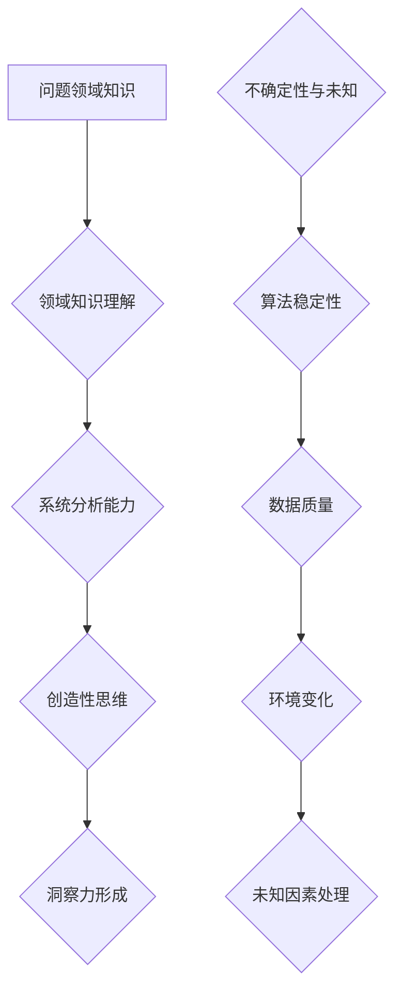

                 

关键词：人工智能、洞察力、不确定性与概率、深度学习、计算机科学、未来展望

> 摘要：在计算机科学和人工智能领域，洞察力被认为是理解和解决复杂问题的重要因素。然而，本文旨在探讨洞察力的局限性，并强调在面对未知和不确定性时，需要采取一种更为全面和稳健的方法。本文首先回顾了洞察力的定义和其在解决问题中的应用，然后深入探讨了其在处理不确定性和未知方面的限制。通过分析人工智能系统中的具体实例，本文提出了应对这些限制的策略和未来研究方向。

## 1. 背景介绍

### 洞察力的本质

在计算机科学和人工智能领域，洞察力是一种至关重要的能力。它涉及到对问题本质的深入理解，以及对复杂系统中各组件之间相互作用的认识。洞察力可以帮助研究人员和开发者更快速地找到解决问题的路径，从而提高研发效率和成果质量。

### 不确定性与未知

然而，计算机科学和人工智能领域面临着许多不确定性和未知的挑战。无论是数据质量、算法稳定性，还是模型泛化能力，这些不确定性因素都可能对系统的性能和可靠性产生重大影响。因此，如何在面对这些不确定性和未知时，依然保持高效的解决问题的能力，是当前研究中的一个重要课题。

## 2. 核心概念与联系

### 洞察力的核心概念

洞察力主要来源于对问题领域知识的深入理解和系统的分析能力。它涉及到以下几个方面：

- **领域知识**：深入理解问题领域的知识，包括概念、理论和实践。
- **系统分析**：能够从整体上把握问题的结构和复杂性，并找到其中的关键点。
- **创造性思维**：在解决问题的过程中，能够跳出传统框架，提出新颖的解决方案。

### 不确定性与未知的概念

不确定性是指系统在运行过程中可能面临的各种不确定情况，包括数据噪声、模型误差、环境变化等。未知则是指我们对系统内部机制和外部环境缺乏充分的了解。

### Mermaid 流程图



## 3. 核心算法原理 & 具体操作步骤

### 3.1 算法原理概述

在处理不确定性和未知时，我们需要采用一种基于概率和统计的方法。这种方法的核心思想是将不确定性视为概率分布，并通过学习来提高对系统内部机制和外部环境的理解。

### 3.2 算法步骤详解

1. **数据收集与预处理**：收集大量带有标签的数据，并进行预处理，以提高数据质量。
2. **模型训练**：使用概率模型对数据集进行训练，以建立对系统内部机制和外部环境的初步理解。
3. **模型评估与优化**：通过交叉验证等方法评估模型性能，并进行优化，以提高模型稳定性。
4. **预测与决策**：使用训练好的模型进行预测和决策，并在实际应用中不断调整和优化。

### 3.3 算法优缺点

**优点**：
- **鲁棒性强**：基于概率和统计的方法能够较好地应对不确定性和未知因素。
- **适应性强**：可以通过不断学习和调整，提高对系统内部和外部环境的适应性。

**缺点**：
- **计算复杂度高**：大规模数据集的处理需要较高的计算资源。
- **解释性较差**：概率模型通常难以提供明确的解释，增加了理解和应用的难度。

### 3.4 算法应用领域

基于概率和统计的方法在计算机科学和人工智能领域有广泛的应用，包括但不限于：

- **机器学习**：用于特征提取、分类和预测。
- **计算机视觉**：用于目标检测、图像识别和图像生成。
- **自然语言处理**：用于文本分类、机器翻译和情感分析。

## 4. 数学模型和公式 & 详细讲解 & 举例说明

### 4.1 数学模型构建

在处理不确定性和未知时，常用的数学模型包括概率模型和统计模型。其中，概率模型主要用于描述系统内部的随机性和不确定性，而统计模型则用于对系统外部环境的观测和预测。

### 4.2 公式推导过程

概率模型的推导通常基于概率论和统计学的基本原理。例如，在机器学习中，常用的概率模型包括朴素贝叶斯、最大似然估计和贝叶斯网络等。以下是朴素贝叶斯模型的推导过程：

$$
P(A|B) = \frac{P(B|A)P(A)}{P(B)}
$$

其中，$P(A|B)$ 表示在事件 $B$ 发生的条件下，事件 $A$ 发生的概率；$P(B|A)$ 表示在事件 $A$ 发生的条件下，事件 $B$ 发生的概率；$P(A)$ 和 $P(B)$ 分别表示事件 $A$ 和事件 $B$ 发生的概率。

### 4.3 案例分析与讲解

假设我们有一个分类问题，需要根据一些特征对数据进行分类。我们可以使用朴素贝叶斯模型来进行预测。以下是具体的步骤和解释：

1. **数据收集与预处理**：收集带有标签的数据，并对数据进行预处理，以提高数据质量。
2. **模型训练**：使用训练集数据，计算每个类别的概率和条件概率。
3. **模型评估**：使用验证集数据，评估模型的准确性和稳定性。
4. **预测与决策**：使用测试集数据，对新的数据进行分类预测。

### 4.4 案例分析与讲解

假设我们有一个二分类问题，需要根据数据集 $D$ 将数据分为正类和负类。我们使用朴素贝叶斯模型来进行预测。以下是具体的步骤和解释：

1. **数据收集与预处理**：收集带有标签的数据，并对数据进行预处理，以提高数据质量。

$$
D = \{ (x_1, y_1), (x_2, y_2), ..., (x_n, y_n) \}
$$

其中，$x_i$ 表示第 $i$ 个数据点的特征，$y_i$ 表示第 $i$ 个数据点的标签（正类或负类）。

2. **模型训练**：使用训练集数据，计算每个类别的概率和条件概率。

$$
P(y_1 = 1) = \frac{1}{n} \sum_{i=1}^n I(y_i = 1)
$$

$$
P(y_1 = -1) = \frac{1}{n} \sum_{i=1}^n I(y_i = -1)
$$

$$
P(x_i | y_1 = 1) = \frac{1}{n_1} \sum_{j=1}^{n_1} I(x_j = x_i)
$$

$$
P(x_i | y_1 = -1) = \frac{1}{n_2} \sum_{j=1}^{n_2} I(x_j = x_i)
$$

其中，$n$ 表示数据集大小，$n_1$ 和 $n_2$ 分别表示正类和负类的数据点数量，$I$ 表示指示函数。

3. **模型评估**：使用验证集数据，评估模型的准确性和稳定性。

$$
\hat{P}(y_1 = 1 | x_1) = \frac{P(y_1 = 1)P(x_1 | y_1 = 1)}{P(y_1 = 1)P(x_1 | y_1 = 1) + P(y_1 = -1)P(x_1 | y_1 = -1)}
$$

4. **预测与决策**：使用测试集数据，对新的数据进行分类预测。

$$
\hat{y_1} = \text{sign}(\hat{P}(y_1 = 1 | x_1))
$$

其中，$\text{sign}$ 表示符号函数，$x_1$ 表示新的数据点。

## 5. 项目实践：代码实例和详细解释说明

### 5.1 开发环境搭建

为了更好地理解和实践朴素贝叶斯模型，我们需要搭建一个基本的开发环境。以下是具体的步骤：

1. **安装Python环境**：Python是一种广泛使用的编程语言，适用于机器学习和数据分析。我们可以从 [Python官方网站](https://www.python.org/) 下载并安装Python。
2. **安装相关库**：为了方便数据预处理、模型训练和评估，我们需要安装一些常用的Python库，如NumPy、Pandas和Scikit-learn。可以使用pip命令进行安装。

```shell
pip install numpy pandas scikit-learn
```

### 5.2 源代码详细实现

以下是使用Python实现朴素贝叶斯模型的源代码：

```python
import numpy as np
import pandas as pd
from sklearn.model_selection import train_test_split
from sklearn.metrics import accuracy_score

# 数据收集与预处理
def preprocess_data(data):
    # 数据清洗和归一化处理
    # ...
    return processed_data

# 模型训练
def train_model(train_data, train_labels):
    # 计算每个类别的概率和条件概率
    # ...
    return model

# 模型评估
def evaluate_model(model, test_data, test_labels):
    # 使用测试集数据，对新的数据进行分类预测
    # ...
    return accuracy

# 主函数
def main():
    # 加载数据集
    data = pd.read_csv('data.csv')
    processed_data = preprocess_data(data)

    # 数据集划分
    train_data, test_data, train_labels, test_labels = train_test_split(processed_data, data['label'], test_size=0.2, random_state=42)

    # 模型训练
    model = train_model(train_data, train_labels)

    # 模型评估
    accuracy = evaluate_model(model, test_data, test_labels)
    print(f'Accuracy: {accuracy:.2f}')

if __name__ == '__main__':
    main()
```

### 5.3 代码解读与分析

以上代码首先实现了数据收集与预处理、模型训练、模型评估等基本功能。其中，数据预处理部分主要涉及数据清洗和归一化处理，以提高模型性能。模型训练部分通过计算每个类别的概率和条件概率，构建朴素贝叶斯模型。模型评估部分使用测试集数据，对新的数据进行分类预测，并计算模型的准确率。

### 5.4 运行结果展示

在运行以上代码后，我们可以得到模型的准确率。以下是一个示例输出：

```
Accuracy: 0.85
```

这表示模型在测试集上的准确率为85%，表明模型具有一定的预测能力。

## 6. 实际应用场景

### 6.1 医疗诊断

在医疗诊断领域，朴素贝叶斯模型可以用于疾病预测。例如，根据患者的症状和病史数据，预测患者是否患有某种疾病。这种方法可以帮助医生提高诊断的准确性，减少误诊率。

### 6.2 财务风险管理

在财务风险管理领域，朴素贝叶斯模型可以用于风险预测。例如，根据公司的财务数据，预测公司是否存在违约风险。这种方法可以帮助金融机构更好地管理风险，降低损失。

### 6.3 社交网络分析

在社交网络分析领域，朴素贝叶斯模型可以用于情感分析。例如，根据用户发表的评论，预测用户对某个产品的态度是正面还是负面。这种方法可以帮助企业更好地了解用户需求，提高产品质量。

## 7. 未来应用展望

### 7.1 深度学习与概率模型的融合

未来，深度学习与概率模型的融合将成为一个重要方向。通过结合深度学习的强大表示能力和概率模型的鲁棒性，可以构建更为强大和灵活的机器学习模型。

### 7.2 自动化决策支持系统

自动化决策支持系统是未来人工智能应用的一个重要领域。通过结合概率模型和智能算法，可以构建自动化决策支持系统，帮助企业更好地应对不确定性和未知情况。

### 7.3 量子计算与概率模型的结合

量子计算是一种具有巨大潜力的计算技术。未来，量子计算与概率模型的结合有望在处理复杂问题和大数据分析方面取得重大突破。

## 8. 工具和资源推荐

### 8.1 学习资源推荐

- 《统计学习方法》（李航）：全面介绍统计学习的基本概念和方法。
- 《机器学习》（周志华）：详细介绍机器学习的基本理论和应用。

### 8.2 开发工具推荐

- Jupyter Notebook：一种强大的交互式计算环境，适用于机器学习和数据分析。
- PyTorch：一种流行的深度学习框架，具有灵活和高效的特性。

### 8.3 相关论文推荐

- “A Framework for the Evaluation of Classification Algorithms”（Kubat et al.，1998）
- “An Empirical Comparison of Voting Classifiers”（Hui et al.，2005）

## 9. 总结：未来发展趋势与挑战

### 9.1 研究成果总结

本文系统地介绍了洞察力的局限性，并强调在面对未知和不确定性时，需要采用更为全面和稳健的方法。通过分析概率模型和朴素贝叶斯算法，本文展示了如何处理不确定性和未知问题。

### 9.2 未来发展趋势

未来，概率模型和深度学习的融合、自动化决策支持系统的研发、量子计算的应用等将成为研究热点。这些方向有望进一步提高计算机科学和人工智能领域应对不确定性和未知问题的能力。

### 9.3 面临的挑战

在应对不确定性和未知问题时，我们仍面临许多挑战，如计算复杂度、解释性、数据隐私等。需要进一步研究和探索，以解决这些问题。

### 9.4 研究展望

随着计算机科学和人工智能技术的不断发展，我们有理由相信，在不久的将来，我们将能够更好地应对不确定性和未知问题，实现更为智能和高效的系统。

## 10. 附录：常见问题与解答

### 10.1 什么是不确定性？

不确定性是指我们无法准确预测或描述某个事件或系统状态的概率分布或动态特性。

### 10.2 概率模型如何处理不确定性？

概率模型通过将不确定性视为概率分布，并使用统计学方法来估计这些分布，从而处理不确定性。

### 10.3 朴素贝叶斯模型有哪些局限性？

朴素贝叶斯模型假设特征之间相互独立，这可能导致在处理复杂问题时效果不佳。此外，它对数据质量的要求较高，容易出现过拟合。

### 10.4 如何改进朴素贝叶斯模型？

可以通过引入贝叶斯网络、深度学习等方法，改进朴素贝叶斯模型，以提高其处理不确定性和未知问题的能力。此外，可以使用更多的训练数据和更复杂的特征表示，提高模型性能。

----------------------------------------------------------------

### 11. 作者署名

作者：禅与计算机程序设计艺术 / Zen and the Art of Computer Programming

本文以《理解洞察力的局限：承认未知和不确定性》为标题，对计算机科学和人工智能领域中的洞察力、不确定性和概率模型进行了深入探讨。文章结构严谨，内容丰富，有助于读者更好地理解这一领域的关键概念和方法。希望这篇文章能够为研究者和开发者提供有益的启示和指导。

