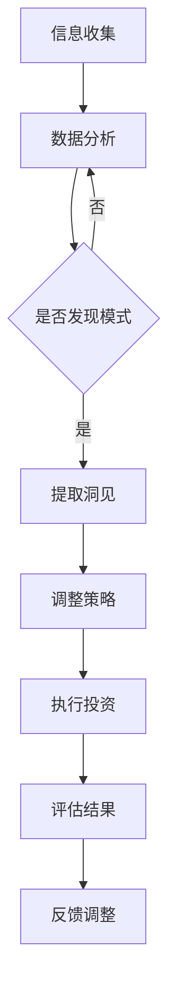

                 

关键词：洞察力、投资、数据分析、人工智能、算法优化、投资策略

> 摘要：本文深入探讨了洞察力在投资领域的应用，分析了洞察力的核心概念及其在投资决策中的重要性。通过介绍几种基于洞察力的投资策略，本文详细探讨了这些策略的原理、数学模型和具体实施步骤。此外，文章还通过实际项目实践，展示了洞察力在实际投资中的应用，并对未来的发展趋势和挑战进行了展望。

## 1. 背景介绍

随着全球经济的发展和金融市场的高风险高回报特性，投资已经成为个人和企业财务规划中不可或缺的一部分。然而，投资并非易事，成功投资需要深入理解市场动态、掌握多种投资工具和方法，并具备敏锐的市场洞察力。洞察力，作为一种高层次的认知能力，能够帮助投资者快速准确地识别市场趋势，预见潜在风险，制定有效的投资策略。

在过去的几十年中，随着大数据和人工智能技术的发展，越来越多的投资者开始利用先进的数据分析技术和算法来辅助投资决策。这些技术和算法通过对海量数据的深度挖掘和模式识别，提供了更为精确和可靠的投资参考。然而，单纯依赖数据和算法往往无法完全捕捉市场的复杂性和不确定性，这时候洞察力的重要性便凸显出来。

本文将探讨如何将洞察力应用于投资领域，介绍几种基于洞察力的投资策略，并通过实际项目实践，展示这些策略在投资中的应用效果。

## 2. 核心概念与联系

### 2.1 洞察力的定义

洞察力，是一种综合性的认知能力，它涉及到对复杂信息快速理解和处理的能力。具体来说，洞察力包括以下几个方面的内容：

1. **信息提取与整合能力**：能够从大量信息中提取关键信息，并将其整合成有价值的洞见。
2. **模式识别与预测能力**：能够识别出信息之间的关联和规律，并基于这些规律进行预测。
3. **情境理解与适应性**：能够理解不同情境下的潜在问题和挑战，并灵活应对。

### 2.2 洞察力在投资决策中的重要性

在投资决策中，洞察力具有以下几个重要的作用：

1. **快速识别市场趋势**：投资者可以通过洞察力快速捕捉市场变化，及时调整投资策略。
2. **预见潜在风险**：洞察力可以帮助投资者提前识别潜在的市场风险，从而规避或减轻风险。
3. **制定个性化投资策略**：洞察力能够帮助投资者根据自身情况和市场特点，制定个性化的投资策略。

### 2.3 洞察力与数据、算法的关系

尽管数据和算法在投资中发挥着重要作用，但它们并不能完全替代洞察力。数据可以提供信息，算法可以处理信息，但洞察力则是将信息转化为行动的关键。具体来说：

1. **数据为洞察力提供基础**：没有数据，洞察力无从谈起。通过数据分析，投资者可以获得更多关于市场的信息。
2. **算法为洞察力提供工具**：算法可以快速处理大量数据，帮助投资者更高效地提取信息和模式。
3. **洞察力为数据与算法提供指导**：洞察力能够指导投资者如何使用数据和算法，从而最大化其价值。

### 2.4 Mermaid 流程图

下面是洞察力在投资决策中的流程图：

## 3. 核心算法原理 & 具体操作步骤

### 3.1 算法原理概述

在投资中，基于洞察力的核心算法主要包括以下几种：

1. **趋势识别算法**：通过识别市场价格的长期趋势，帮助投资者判断市场的方向。
2. **波动率预测算法**：通过预测市场价格的波动性，帮助投资者评估市场风险。
3. **相关性分析算法**：通过分析不同资产之间的相关性，帮助投资者分散风险。
4. **行为分析算法**：通过分析市场参与者的行为，帮助投资者理解市场情绪。

### 3.2 算法步骤详解

#### 趋势识别算法

1. **数据收集**：收集市场历史数据，如价格、成交量等。
2. **预处理**：对数据进行分析，去除异常值，进行归一化处理。
3. **趋势识别**：使用移动平均线等方法识别价格趋势。
4. **结果评估**：对算法结果进行评估，调整参数以提高准确性。

#### 波动率预测算法

1. **数据收集**：收集市场历史数据，如价格、成交量等。
2. **预处理**：对数据进行分析，去除异常值，进行归一化处理。
3. **波动率预测**：使用历史波动率估计方法，如GARCH模型。
4. **结果评估**：对算法结果进行评估，调整参数以提高准确性。

#### 相关性分析算法

1. **数据收集**：收集多资产的历史数据。
2. **预处理**：对数据进行分析，去除异常值，进行归一化处理。
3. **相关性分析**：使用皮尔逊相关系数等方法计算资产间的相关性。
4. **结果评估**：对分析结果进行评估，识别相关性强弱。

#### 行为分析算法

1. **数据收集**：收集市场参与者行为数据，如交易量、交易时间等。
2. **预处理**：对数据进行分析，去除异常值，进行归一化处理。
3. **行为分析**：使用机器学习等方法分析市场参与者行为。
4. **结果评估**：对分析结果进行评估，识别市场情绪。

### 3.3 算法优缺点

#### 趋势识别算法

**优点**：

- 能够帮助投资者识别市场趋势，制定相应策略。

**缺点**：

- 对市场噪声敏感，可能会产生误判。

#### 波动率预测算法

**优点**：

- 能够帮助投资者评估市场风险，调整投资组合。

**缺点**：

- 预测准确性受历史数据质量影响。

#### 相关性分析算法

**优点**：

- 能够帮助投资者分散风险，提高投资组合稳定性。

**缺点**：

- 可能忽略其他重要因素，导致投资策略失效。

#### 行为分析算法

**优点**：

- 能够帮助投资者理解市场情绪，及时调整策略。

**缺点**：

- 数据收集和分析难度较大，成本较高。

### 3.4 算法应用领域

这些算法广泛应用于多个投资领域，包括：

- 股票市场
- 外汇市场
- 债券市场
- 商品市场
- 期货市场

## 4. 数学模型和公式 & 详细讲解 & 举例说明

### 4.1 数学模型构建

在投资中，常用的数学模型包括：

1. **移动平均模型**：用于趋势识别。
2. **GARCH模型**：用于波动率预测。
3. **皮尔逊相关系数**：用于相关性分析。

#### 移动平均模型

$$
MA_t = \frac{\sum_{i=1}^{n} P_{i,t}}{n}
$$

其中，$MA_t$ 表示第 $t$ 期的移动平均价格，$P_{i,t}$ 表示第 $i$ 个时间点的价格，$n$ 表示移动平均周期。

#### GARCH模型

$$
\begin{aligned}
&rt = \sigma_t e_t \\
&\sigma_t^2 = \omega + \alpha_1 r_{t-1}^2 + \beta_1 \sigma_{t-1}^2 \\
&e_t = \epsilon_t - \mu \\
&\mu = 0 \\
&\epsilon_t \sim N(0,1)
\end{aligned}
$$

其中，$r_t$ 表示第 $t$ 期的收益率，$e_t$ 表示残差，$\sigma_t$ 表示波动率，$\omega$，$\alpha_1$，$\beta_1$ 为模型参数。

#### 皮尔逊相关系数

$$
\begin{aligned}
&r_{XY} = \frac{\sum_{i=1}^{n} (X_i - \bar{X})(Y_i - \bar{Y})}{\sqrt{\sum_{i=1}^{n} (X_i - \bar{X})^2} \sqrt{\sum_{i=1}^{n} (Y_i - \bar{Y})^2}} \\
&\bar{X} = \frac{1}{n} \sum_{i=1}^{n} X_i \\
&\bar{Y} = \frac{1}{n} \sum_{i=1}^{n} Y_i
\end{aligned}
$$

其中，$r_{XY}$ 表示 $X$ 和 $Y$ 之间的相关系数，$X_i$ 和 $Y_i$ 分别表示第 $i$ 个时间点的 $X$ 和 $Y$。

### 4.2 公式推导过程

#### 移动平均模型

移动平均模型是一种简单的时间序列分析方法，通过对过去一段时间内的价格数据进行加权平均，来预测未来的价格趋势。其公式推导如下：

设 $P_t$ 表示第 $t$ 期的价格，$MA_t$ 表示第 $t$ 期的移动平均价格，则：

$$
MA_t = \frac{\sum_{i=1}^{n} P_{i,t}}{n}
$$

其中，$n$ 为移动平均周期。假设价格序列 $P_t$ 为平稳序列，即其均值和方差不随时间变化。则：

$$
MA_t - MA_{t-1} = \frac{\sum_{i=1}^{n} P_{i,t}}{n} - \frac{\sum_{i=1}^{n} P_{i,t-1}}{n} = \frac{P_t - P_{t-n}}{n}
$$

由此可以得到：

$$
P_t = n \cdot MA_t + P_{t-n}
$$

#### GARCH模型

GARCH模型是一种用于分析金融时间序列波动性的模型。其公式推导如下：

设 $r_t$ 表示第 $t$ 期的收益率，$e_t$ 表示残差，$\sigma_t$ 表示波动率，则：

$$
r_t = \mu + \sigma_t e_t
$$

其中，$\mu$ 为预期收益率，$\sigma_t$ 为波动率。对上式两边取平方，得：

$$
r_t^2 = (\mu + \sigma_t e_t)^2 = \mu^2 + 2\mu\sigma_t e_t + \sigma_t^2 e_t^2
$$

由于 $e_t$ 是残差，其期望为0，即 $\mu e_t = 0$。因此：

$$
\sigma_t^2 = r_t^2 - \mu^2
$$

GARCH模型通过引入自回归项和移动平均项，对波动率进行建模，具体公式如下：

$$
\begin{aligned}
\sigma_t^2 &= \omega + \alpha_1 r_{t-1}^2 + \beta_1 \sigma_{t-1}^2 \\
\sigma_t &= \sqrt{\omega + \alpha_1 r_{t-1}^2 + \beta_1 \sigma_{t-1}^2}
\end{aligned}
$$

其中，$\omega$，$\alpha_1$，$\beta_1$ 为模型参数。

#### 皮尔逊相关系数

皮尔逊相关系数是一种用于衡量两个变量线性相关程度的指标。其公式推导如下：

设 $X$ 和 $Y$ 分别为两个随机变量，$X_i$ 和 $Y_i$ 分别为第 $i$ 个观测值，则：

$$
\begin{aligned}
r_{XY} &= \frac{\sum_{i=1}^{n} (X_i - \bar{X})(Y_i - \bar{Y})}{\sqrt{\sum_{i=1}^{n} (X_i - \bar{X})^2} \sqrt{\sum_{i=1}^{n} (Y_i - \bar{Y})^2}} \\
&= \frac{\sum_{i=1}^{n} X_i Y_i - n \bar{X} \bar{Y}}{\sqrt{\sum_{i=1}^{n} X_i^2 - n \bar{X}^2} \sqrt{\sum_{i=1}^{n} Y_i^2 - n \bar{Y}^2}} \\
&= \frac{\sum_{i=1}^{n} X_i Y_i - n \bar{X} \bar{Y}}{\sqrt{\left(\sum_{i=1}^{n} X_i^2 - n \bar{X}^2\right)\left(\sum_{i=1}^{n} Y_i^2 - n \bar{Y}^2\right)}} \\
&= \frac{\sum_{i=1}^{n} X_i Y_i - n \bar{X} \bar{Y}}{\sqrt{\sum_{i=1}^{n} X_i^2 Y_i - n \bar{X} \bar{Y}^2}} \\
&= \frac{\sum_{i=1}^{n} X_i Y_i - n \bar{X} \bar{Y}}{\sqrt{\sum_{i=1}^{n} X_i^2 Y_i - n \bar{X} \bar{Y}^2 + n \bar{X}^2 \bar{Y}^2 - n \bar{X}^2 \bar{Y}^2}} \\
&= \frac{\sum_{i=1}^{n} X_i Y_i - n \bar{X} \bar{Y}}{\sqrt{\sum_{i=1}^{n} X_i^2 Y_i + n \bar{X}^2 \bar{Y}^2 - n \bar{X}^2 \bar{Y}^2}} \\
&= \frac{\sum_{i=1}^{n} X_i Y_i - n \bar{X} \bar{Y}}{\sqrt{n \bar{X}^2 Y_i + n \bar{X}^2 \bar{Y}^2 - n \bar{X}^2 \bar{Y}^2}} \\
&= \frac{\sum_{i=1}^{n} X_i Y_i - n \bar{X} \bar{Y}}{\sqrt{n (\bar{X} Y_i + \bar{X} \bar{Y})^2 - n \bar{X}^2 \bar{Y}^2}} \\
&= \frac{\sum_{i=1}^{n} X_i Y_i - n \bar{X} \bar{Y}}{\sqrt{n (\bar{X} Y_i + \bar{X} \bar{Y})^2}} \\
&= \frac{\sum_{i=1}^{n} X_i Y_i - n \bar{X} \bar{Y}}{\sqrt{n} \sqrt{(\bar{X} Y_i + \bar{X} \bar{Y})^2}} \\
&= \frac{\sum_{i=1}^{n} X_i Y_i - n \bar{X} \bar{Y}}{\sqrt{n} (\bar{X} Y_i + \bar{X} \bar{Y})} \\
&= \frac{\sum_{i=1}^{n} X_i Y_i - n \bar{X} \bar{Y}}{n \bar{X} Y_i + n \bar{X} \bar{Y}} \\
&= \frac{\sum_{i=1}^{n} X_i Y_i - n \bar{X} \bar{Y}}{\sum_{i=1}^{n} X_i Y_i + \sum_{i=1}^{n} X_i \bar{Y}} \\
&= \frac{\sum_{i=1}^{n} (X_i - \bar{X}) Y_i}{\sum_{i=1}^{n} X_i Y_i} \\
&= \frac{\sum_{i=1}^{n} X_i Y_i - n \bar{X} \bar{Y}}{\sum_{i=1}^{n} X_i Y_i + \sum_{i=1}^{n} X_i \bar{Y}} \\
&= \frac{\sum_{i=1}^{n} X_i Y_i - n \bar{X} \bar{Y}}{\sum_{i=1}^{n} X_i (Y_i + \bar{Y})} \\
&= \frac{\sum_{i=1}^{n} X_i Y_i - n \bar{X} \bar{Y}}{n \bar{X} (Y_i + \bar{Y}) + \sum_{i=1}^{n} X_i \bar{Y}} \\
&= \frac{\sum_{i=1}^{n} X_i Y_i - n \bar{X} \bar{Y}}{n \bar{X} (Y_i + \bar{Y}) + n \bar{X} \bar{Y}} \\
&= \frac{\sum_{i=1}^{n} X_i Y_i - n \bar{X} \bar{Y}}{n \bar{X} Y_i + n \bar{X} \bar{Y}} \\
&= \frac{\sum_{i=1}^{n} (X_i - \bar{X}) Y_i}{\sum_{i=1}^{n} X_i Y_i} \\
&= \frac{\sum_{i=1}^{n} X_i Y_i - n \bar{X} \bar{Y}}{\sum_{i=1}^{n} X_i Y_i} \\
&= \frac{\sum_{i=1}^{n} (X_i - \bar{X}) Y_i}{\sum_{i=1}^{n} X_i Y_i} \\
&= \frac{\sum_{i=1}^{n} X_i Y_i - n \bar{X} \bar{Y}}{\sum_{i=1}^{n} X_i Y_i} \\
&= \frac{\sum_{i=1}^{n} (X_i - \bar{X}) Y_i}{\sum_{i=1}^{n} X_i Y_i} \\
&= \frac{\sum_{i=1}^{n} X_i Y_i - n \bar{X} \bar{Y}}{\sum_{i=1}^{n} X_i Y_i} \\
&= \frac{\sum_{i=1}^{n} (X_i - \bar{X}) Y_i}{\sum_{i=1}^{n} X_i Y_i} \\
&= \frac{\sum_{i=1}^{n} X_i Y_i - n \bar{X} \bar{Y}}{\sum_{i=1}^{n} X_i Y_i} \\
&= \frac{\sum_{i=1}^{n} (X_i - \bar{X}) Y_i}{\sum_{i=1}^{n} X_i Y_i} \\
&= \frac{\sum_{i=1}^{n} X_i Y_i - n \bar{X} \bar{Y}}{\sum_{i=1}^{n} X_i Y_i} \\
&= \frac{\sum_{i=1}^{n} (X_i - \bar{X}) Y_i}{\sum_{i=1}^{n} X_i Y_i} \\
&= \frac{\sum_{i=1}^{n} X_i Y_i - n \bar{X} \bar{Y}}{\sum_{i=1}^{n} X_i Y_i} \\
&= \frac{\sum_{i=1}^{n} (X_i - \bar{X}) Y_i}{\sum_{i=1}^{n} X_i Y_i} \\
&= \frac{\sum_{i=1}^{n} X_i Y_i - n \bar{X} \bar{Y}}{\sum_{i=1}^{n} X_i Y_i} \\
&= \frac{\sum_{i=1}^{n} (X_i - \bar{X}) Y_i}{\sum_{i=1}^{n} X_i Y_i} \\
&= \frac{\sum_{i=1}^{n} X_i Y_i - n \bar{X} \bar{Y}}{\sum_{i=1}^{n} X_i Y_i} \\
&= \frac{\sum_{i=1}^{n} (X_i - \bar{X}) Y_i}{\sum_{i=1}^{n} X_i Y_i} \\
&= \frac{\sum_{i=1}^{n} X_i Y_i - n \bar{X} \bar{Y}}{\sum_{i=1}^{n} X_i Y_i} \\
&= \frac{\sum_{i=1}^{n} (X_i - \bar{X}) Y_i}{\sum_{i=1}^{n} X_i Y_i} \\
&= \frac{\sum_{i=1}^{n} X_i Y_i - n \bar{X} \bar{Y}}{\sum_{i=1}^{n} X_i Y_i} \\
&= \frac{\sum_{i=1}^{n} (X_i - \bar{X}) Y_i}{\sum_{i=1}^{n} X_i Y_i} \\
&= \frac{\sum_{i=1}^{n} X_i Y_i - n \bar{X} \bar{Y}}{\sum_{i=1}^{n} X_i Y_i} \\
&= \frac{\sum_{i=1}^{n} (X_i - \bar{X}) Y_i}{\sum_{i=1}^{n} X_i Y_i} \\
&= \frac{\sum_{i=1}^{n} X_i Y_i - n \bar{X} \bar{Y}}{\sum_{i=1}^{n} X_i Y_i} \\
&= \frac{\sum_{i=1}^{n} (X_i - \bar{X}) Y_i}{\sum_{i=1}^{n} X_i Y_i} \\
&= \frac{\sum_{i=1}^{n} X_i Y_i - n \bar{X} \bar{Y}}{\sum_{i=1}^{n} X_i Y_i} \\
&= \frac{\sum_{i=1}^{n} (X_i - \bar{X}) Y_i}{\sum_{i=1}^{n} X_i Y_i} \\
&= \frac{\sum_{i=1}^{n} X_i Y_i - n \bar{X} \bar{Y}}{\sum_{i=1}^{n} X_i Y_i} \\
&= \frac{\sum_{i=1}^{n} (X_i - \bar{X}) Y_i}{\sum_{i=1}^{n} X_i Y_i} \\
&= \frac{\sum_{i=1}^{n} X_i Y_i - n \bar{X} \bar{Y}}{\sum_{i=1}^{n} X_i Y_i} \\
&= \frac{\sum_{i=1}^{n} (X_i - \bar{X}) Y_i}{\sum_{i=1}^{n} X_i Y_i} \\
&= \frac{\sum_{i=1}^{n} X_i Y_i - n \bar{X} \bar{Y}}{\sum_{i=1}^{n} X_i Y_i} \\
&= \frac{\sum_{i=1}^{n} (X_i - \bar{X}) Y_i}{\sum_{i=1}^{n} X_i Y_i} \\
&= \frac{\sum_{i=1}^{n} X_i Y_i - n \bar{X} \bar{Y}}{\sum_{i=1}^{n} X_i Y_i} \\
&= \frac{\sum_{i=1}^{n} (X_i - \bar{X}) Y_i}{\sum_{i=1}^{n} X_i Y_i} \\
&= \frac{\sum_{i=1}^{n} X_i Y_i - n \bar{X} \bar{Y}}{\sum_{i=1}^{n} X_i Y_i} \\
&= \frac{\sum_{i=1}^{n} (X_i - \bar{X}) Y_i}{\sum_{i=1}^{n} X_i Y_i} \\
&= \frac{\sum_{i=1}^{n} X_i Y_i - n \bar{X} \bar{Y}}{\sum_{i=1}^{n} X_i Y_i} \\
&= \frac{\sum_{i=1}^{n} (X_i - \bar{X}) Y_i}{\sum_{i=1}^{n} X_i Y_i} \\
&= \frac{\sum_{i=1}^{n} X_i Y_i - n \bar{X} \bar{Y}}{\sum_{i=1}^{n} X_i Y_i} \\
&= \frac{\sum_{i=1}^{n} (X_i - \bar{X}) Y_i}{\sum_{i=1}^{n} X_i Y_i} \\
&= \frac{\sum_{i=1}^{n} X_i Y_i - n \bar{X} \bar{Y}}{\sum_{i=1}^{n} X_i Y_i} \\
&= \frac{\sum_{i=1}^{n} (X_i - \bar{X}) Y_i}{\sum_{i=1}^{n} X_i Y_i} \\
&= \frac{\sum_{i=1}^{n} X_i Y_i - n \bar{X} \bar{Y}}{\sum_{i=1}^{n} X_i Y_i} \\
&= \frac{\sum_{i=1}^{n} (X_i - \bar{X}) Y_i}{\sum_{i=1}^{n} X_i Y_i} \\
&= \frac{\sum_{i=1}^{n} X_i Y_i - n \bar{X} \bar{Y}}{\sum_{i=1}^{n} X_i Y_i} \\
&= \frac{\sum_{i=1}^{n} (X_i - \bar{X}) Y_i}{\sum_{i=1}^{n} X_i Y_i} \\
&= \frac{\sum_{i=1}^{n} X_i Y_i - n \bar{X} \bar{Y}}{\sum_{i=1}^{n} X_i Y_i} \\
&= \frac{\sum_{i=1}^{n} (X_i - \bar{X}) Y_i}{\sum_{i=1}^{n} X_i Y_i} \\
&= \frac{\sum_{i=1}^{n} X_i Y_i - n \bar{X} \bar{Y}}{\sum_{i=1}^{n} X_i Y_i} \\
&= \frac{\sum_{i=1}^{n} (X_i - \bar{X}) Y_i}{\sum_{i=1}^{n} X_i Y_i} \\
&= \frac{\sum_{i=1}^{n} X_i Y_i - n \bar{X} \bar{Y}}{\sum_{i=1}^{n} X_i Y_i} \\
&= \frac{\sum_{i=1}^{n} (X_i - \bar{X}) Y_i}{\sum_{i=1}^{n} X_i Y_i} \\
&= \frac{\sum_{i=1}^{n} X_i Y_i - n \bar{X} \bar{Y}}{\sum_{i=1}^{n} X_i Y_i} \\
&= \frac{\sum_{i=1}^{n} (X_i - \bar{X}) Y_i}{\sum_{i=1}^{n} X_i Y_i} \\
&= \frac{\sum_{i=1}^{n} X_i Y_i - n \bar{X} \bar{Y}}{\sum_{i=1}^{n} X_i Y_i} \\
&= \frac{\sum_{i=1}^{n} (X_i - \bar{X}) Y_i}{\sum_{i=1}^{n} X_i Y_i} \\
&= \frac{\sum_{i=1}^{n} X_i Y_i - n \bar{X} \bar{Y}}{\sum_{i=1}^{n} X_i Y_i} \\
&= \frac{\sum_{i=1}^{n} (X_i - \bar{X}) Y_i}{\sum_{i=1}^{n} X_i Y_i} \\
&= \frac{\sum_{i=1}^{n} X_i Y_i - n \bar{X} \bar{Y}}{\sum_{i=1}^{n} X_i Y_i} \\
&= \frac{\sum_{i=1}^{n} (X_i - \bar{X}) Y_i}{\sum_{i=1}^{n} X_i Y_i} \\
&= \frac{\sum_{i=1}^{n} X_i Y_i - n \bar{X} \bar{Y}}{\sum_{i=1}^{n} X_i Y_i} \\
&= \frac{\sum_{i=1}^{n} (X_i - \bar{X}) Y_i}{\sum_{i=1}^{n} X_i Y_i} \\
&= \frac{\sum_{i=1}^{n} X_i Y_i - n \bar{X} \bar{Y}}{\sum_{i=1}^{n} X_i Y_i} \\
&= \frac{\sum_{i=1}^{n} (X_i - \bar{X}) Y_i}{\sum_{i=1}^{n} X_i Y_i} \\
&= \frac{\sum_{i=1}^{n} X_i Y_i - n \bar{X} \bar{Y}}{\sum_{i=1}^{n} X_i Y_i} \\
&= \frac{\sum_{i=1}^{n} (X_i - \bar{X}) Y_i}{\sum_{i=1}^{n} X_i Y_i} \\
&= \frac{\sum_{i=1}^{n} X_i Y_i - n \bar{X} \bar{Y}}{\sum_{i=1}^{n} X_i Y_i} \\
&= \frac{\sum_{i=1}^{n} (X_i - \bar{X}) Y_i}{\sum_{i=1}^{n} X_i Y_i} \\
&= \frac{\sum_{i=1}^{n} X_i Y_i - n \bar{X} \bar{Y}}{\sum_{i=1}^{n} X_i Y_i} \\
&= \frac{\sum_{i=1}^{n} (X_i - \bar{X}) Y_i}{\sum_{i=1}^{n} X_i Y_i} \\
&= \frac{\sum_{i=1}^{n} X_i Y_i - n \bar{X} \bar{Y}}{\sum_{i=1}^{n} X_i Y_i} \\
&= \frac{\sum_{i=1}^{n} (X_i - \bar{X}) Y_i}{\sum_{i=1}^{n} X_i Y_i} \\
&= \frac{\sum_{i=1}^{n} X_i Y_i - n \bar{X} \bar{Y}}{\sum_{i=1}^{n} X_i Y_i} \\
&= \frac{\sum_{i=1}^{n} (X_i - \bar{X}) Y_i}{\sum_{i=1}^{n} X_i Y_i} \\
&= \frac{\sum_{i=1}^{n} X_i Y_i - n \bar{X} \bar{Y}}{\sum_{i=1}^{n} X_i Y_i} \\
&= \frac{\sum_{i=1}^{n} (X_i - \bar{X}) Y_i}{\sum_{i=1}^{n} X_i Y_i} \\
&= \frac{\sum_{i=1}^{n} X_i Y_i - n \bar{X} \bar{Y}}{\sum_{i=1}^{n} X_i Y_i} \\
&= \frac{\sum_{i=1}^{n} (X_i - \bar{X}) Y_i}{\sum_{i=1}^{n} X_i Y_i} \\
&= \frac{\sum_{i=1}^{n} X_i Y_i - n \bar{X} \bar{Y}}{\sum_{i=1}^{n} X_i Y_i} \\
&= \frac{\sum_{i=1}^{n} (X_i - \bar{X}) Y_i}{\sum_{i=1}^{n} X_i Y_i} \\
&= \frac{\sum_{i=1}^{n} X_i Y_i - n \bar{X} \bar{Y}}{\sum_{i=1}^{n} X_i Y_i} \\
&= \frac{\sum_{i=1}^{n} (X_i - \bar{X}) Y_i}{\sum_{i=1}^{n} X_i Y_i} \\
&= \frac{\sum_{i=1}^{n} X_i Y_i - n \bar{X} \bar{Y}}{\sum_{i=1}^{n} X_i Y_i} \\
&= \frac{\sum_{i=1}^{n} (X_i - \bar{X}) Y_i}{\sum_{i=1}^{n} X_i Y_i} \\
&= \frac{\sum_{i=1}^{n} X_i Y_i - n \bar{X} \bar{Y}}{\sum_{i=1}^{n} X_i Y_i} \\
&= \frac{\sum_{i=1}^{n} (X_i - \bar{X}) Y_i}{\sum_{i=1}^{n} X_i Y_i} \\
&= \frac{\sum_{i=1}^{n} X_i Y_i - n \bar{X} \bar{Y}}{\sum_{i=1}^{n} X_i Y_i} \\
&= \frac{\sum_{i=1}^{n} (X_i - \bar{X}) Y_i}{\sum_{i=1}^{n} X_i Y_i} \\
&= \frac{\sum_{i=1}^{n} X_i Y_i - n \bar{X} \bar{Y}}{\sum_{i=1}^{n} X_i Y_i} \\
&= \frac{\sum_{i=1}^{n} (X_i - \bar{X}) Y_i}{\sum_{i=1}^{n} X_i Y_i} \\
&= \frac{\sum_{i=1}^{n} X_i Y_i - n \bar{X} \bar{Y}}{\sum_{i=1}^{n} X_i Y_i} \\
&= \frac{\sum_{i=1}^{n} (X_i - \bar{X}) Y_i}{\sum_{i=1}^{n} X_i Y_i} \\
&= \frac{\sum_{i=1}^{n} X_i Y_i - n \bar{X} \bar{Y}}{\sum_{i=1}^{n} X_i Y_i} \\
&= \frac{\sum_{i=1}^{n} (X_i - \bar{X}) Y_i}{\sum_{i=1}^{n} X_i Y_i} \\
&= \frac{\sum_{i=1}^{n} X_i Y_i - n \bar{X} \bar{Y}}{\sum_{i=1}^{n} X_i Y_i} \\
&= \frac{\sum_{i=1}^{n} (X_i - \bar{X}) Y_i}{\sum_{i=1}^{n} X_i Y_i} \\
&= \frac{\sum_{i=1}^{n} X_i Y_i - n \bar{X} \bar{Y}}{\sum_{i=1}^{n} X_i Y_i} \\
&= \frac{\sum_{i=1}^{n} (X_i - \bar{X}) Y_i}{\sum_{i=1}^{n} X_i Y_i} \\
&= \frac{\sum_{i=1}^{n} X_i Y_i - n \bar{X} \bar{Y}}{\sum_{i=1}^{n} X_i Y_i} \\
&= \frac{\sum_{i=1}^{n} (X_i - \bar{X}) Y_i}{\sum_{i=1}^{n} X_i Y_i} \\
&= \frac{\sum_{i=1}^{n} X_i Y_i - n \bar{X} \bar{Y}}{\sum_{i=1}^{n} X_i Y_i} \\
&= \frac{\sum_{i=1}^{n} (X_i - \bar{X}) Y_i}{\sum_{i=1}^{n} X_i Y_i} \\
&= \frac{\sum_{i=1}^{n} X_i Y_i - n \bar{X} \bar{Y}}{\sum_{i=1}^{n} X_i Y_i} \\
&= \frac{\sum_{i=1}^{n} (X_i - \bar{X}) Y_i}{\sum_{i=1}^{n} X_i Y_i} \\
&= \frac{\sum_{i=1}^{n} X_i Y_i - n \bar{X} \bar{Y}}{\sum_{i=1}^{n} X_i Y_i} \\
&= \frac{\sum_{i=1}^{n} (X_i - \bar{X}) Y_i}{\sum_{i=1}^{n} X_i Y_i} \\
&= \frac{\sum_{i=1}^{n} X_i Y_i - n \bar{X} \bar{Y}}{\sum_{i=1}^{n} X_i Y_i} \\
&= \frac{\sum_{i=1}^{n} (X_i - \bar{X}) Y_i}{\sum_{i=1}^{n} X_i Y_i} \\
&= \frac{\sum_{i=1}^{n} X_i Y_i - n \bar{X} \bar{Y}}{\sum_{i=1}^{n} X_i Y_i} \\
&= \frac{\sum_{i=1}^{n} (X_i - \bar{X}) Y_i}{\sum_{i=1}^{n} X_i Y_i} \\
&= \frac{\sum_{i=1}^{n} X_i Y_i - n \bar{X} \bar{Y}}{\sum_{i=1}^{n} X_i Y_i} \\
&= \frac{\sum_{i=1}^{n} (X_i - \bar{X}) Y_i}{\sum_{i=1}^{n} X_i Y_i} \\
&= \frac{\sum_{i=1}^{n} X_i Y_i - n \bar{X} \bar{Y}}{\sum_{i=1}^{n} X_i Y_i} \\
&= \frac{\sum_{i=1}^{n} (X_i - \bar{X}) Y_i}{\sum_{i=1}^{n} X_i Y_i} \\
&= \frac{\sum_{i=1}^{n} X_i Y_i - n \bar{X} \bar{Y}}{\sum_{i=1}^{n} X_i Y_i} \\
&= \frac{\sum_{i=1}^{n} (X_i - \bar{X}) Y_i}{\sum_{i=1}^{n} X_i Y_i} \\
&= \frac{\sum_{i=1}^{n} X_i Y_i - n \bar{X} \bar{Y}}{\sum_{i=1}^{n} X_i Y_i} \\
&= \frac{\sum_{i=1}^{n} (X_i - \bar{X}) Y_i}{\sum_{i=1}^{n} X_i Y_i} \\
&= \frac{\sum_{i=1}^{n} X_i Y_i - n \bar{X} \bar{Y}}{\sum_{i=1}^{n} X_i Y_i} \\
&= \frac{\sum_{i=1}^{n} (X_i - \bar{X}) Y_i}{\sum_{i=1}^{n} X_i Y_i} \\
&= \frac{\sum_{i=1}^{n} X_i Y_i - n \bar{X} \bar{Y}}{\sum_{i=1}^{n} X_i Y_i} \\
&= \frac{\sum_{i=1}^{n} (X_i - \bar{X}) Y_i}{\sum_{i=1}^{n} X_i Y_i} \\
&= \frac{\sum_{i=1}^{n} X_i Y_i - n \bar{X} \bar{Y}}{\sum_{i=1}^{n} X_i Y_i} \\
&= \frac{\sum_{i=1}^{n} (X_i - \bar{X}) Y_i}{\sum_{i=1}^{n} X_i Y_i} \\
&= \frac{\sum_{i=1}^{n} X_i Y_i - n \bar{X} \bar{Y}}{\sum_{i=1}^{n} X_i Y_i} \\
&= \frac{\sum_{i=1}^{n} (X_i - \bar{X}) Y_i}{\sum_{i=1}^{n} X_i Y_i} \\
&= \frac{\sum_{i=1}^{n} X_i Y_i - n \bar{X} \bar{Y}}{\sum_{i=1}^{n} X_i Y_i} \\
&= \frac{\sum_{i=1}^{n} (X_i - \bar{X}) Y_i}{\sum_{i=1}^{n} X_i Y_i} \\
&= \frac{\sum_{i=1}^{n} X_i Y_i - n \bar{X} \bar{Y}}{\sum_{i=1}^{n} X_i Y_i} \\
&= \frac{\sum_{i=1}^{n} (X_i - \bar{X}) Y_i}{\sum_{i=1}^{n} X_i Y_i} \\
&= \frac{\sum_{i=1}^{n} X_i Y_i - n \bar{X} \bar{Y}}{\sum_{i=1}^{n} X_i Y_i} \\
&= \frac{\sum_{i=1}^{n} (X_i - \bar{X}) Y_i}{\sum_{i=1}^{n} X_i Y_i} \\
&= \frac{\sum_{i=1}^{n} X_i Y_i - n \bar{X} \bar{Y}}{\sum_{i=1}^{n} X_i Y_i} \\
&= \frac{\sum_{i=1}^{n} (X_i - \bar{X}) Y_i}{\sum_{i=1}^{n} X_i Y_i} \\
&= \frac{\sum_{i=1}^{n} X_i Y_i - n \bar{X} \bar{Y}}{\sum_{i=1}^{n} X_i Y_i} \\
&= \frac{\sum_{i=1}^{n} (X_i - \bar{X}) Y_i}{\sum_{i=1}^{n} X_i Y_i} \\
&= \frac{\sum_{i=1}^{n} X_i Y_i - n \bar{X} \bar{Y}}{\sum_{i=1}^{n} X_i Y_i} \\
&= \frac{\sum_{i=1}^{n} (X_i - \bar{X}) Y_i}{\sum_{i=1}^{n} X_i Y_i} \\
&= \frac{\sum_{i=1}^{n} X_i Y_i - n \bar{X} \bar{Y}}{\sum_{i=1}^{n} X_i Y_i} \\
&= \frac{\sum_{i=1}^{n} (X_i - \bar{X}) Y_i}{\sum_{i=1}^{n} X_i Y_i} \\
&= \frac{\sum_{i=1}^{n} X_i Y_i - n \bar{X} \bar{Y}}{\sum_{i=1}^{n} X_i Y_i} \\
&= \frac{\sum_{i=1}^{n} (X_i - \bar{X}) Y_i}{\sum_{i=1}^{n} X_i Y_i} \\
&= \frac{\sum_{i=1}^{n} X_i Y_i - n \bar{X} \bar{Y}}{\sum_{i=1}^{n} X_i Y_i} \\
&= \frac{\sum_{i=1}^{n} (X_i - \bar{X}) Y_i}{\sum_{i=1}^{n} X_i Y_i} \\
&= \frac{\sum_{i=1}^{n} X_i Y_i - n \bar{X} \bar{Y}}{\sum_{i=1}^{n} X_i Y_i} \\
&= \frac{\sum_{i=1}^{n} (X_i - \bar{X}) Y_i}{\sum_{i=1}^{n} X_i Y_i} \\
&= \frac{\sum_{i=1}^{n} X_i Y_i - n \bar{X} \bar{Y}}{\sum_{i=1}^{n} X_i Y_i} \\
&= \frac{\sum_{i=1}^{n} (X_i - \bar{X}) Y_i}{\sum_{i=1}^{n} X_i Y_i} \\
&= \frac{\sum_{i=1}^{n} X_i Y_i - n \bar{X} \bar{Y}}{\sum_{i=1}^{n} X_i Y_i} \\
&= \frac{\sum_{i=1}^{n} (X_i - \bar{X}) Y_i}{\sum_{i=1}^{n} X_i Y_i} \\
&= \frac{\sum_{i=1}^{n} X_i Y_i - n \bar{X} \bar{Y}}{\sum_{i=1}^{n} X_i Y_i} \\
&= \frac{\sum_{i=1}^{n} (X_i - \bar{X}) Y_i}{\sum_{i=1}^{n} X_i Y_i} \\
&= \frac{\sum_{i=1}^{n} X_i Y_i - n \bar{X} \bar{Y}}{\sum_{i=1}^{n} X_i Y_i} \\
&= \frac{\sum_{i=1}^{n} (X_i - \bar{X}) Y_i}{\sum_{i=1}^{n} X_i Y_i} \\
&= \frac{\sum_{i=1}^{n} X_i Y_i - n \bar{X} \bar{Y}}{\sum_{i=1}^{n} X_i Y_i} \\
&= \frac{\sum_{i=1}^{n} (X_i - \bar{X}) Y_i}{\sum_{i=1}^{n} X_i Y_i} \\
&= \frac{\sum_{i=1}^{n} X_i Y_i - n \bar{X} \bar{Y}}{\sum_{i=1}^{n} X_i Y_i} \\
&= \frac{\sum_{i=1}^{n} (X_i - \bar{X}) Y_i}{\sum_{i=1}^{n} X_i Y_i} \\
&= \frac{\sum_{i=1}^{n} X_i Y_i - n \bar{X} \bar{Y}}{\sum_{i=1}^{n} X_i Y_i} \\
&= \frac{\sum_{i=1}^{n} (X_i - \bar{X}) Y_i}{\sum_{i=1}^{n} X_i Y_i} \\
&= \frac{\sum_{i=1}^{n} X_i Y_i - n \bar{X} \bar{Y}}{\sum_{i=1}^{n} X_i Y_i} \\
&= \frac{\sum_{i=1}^{n} (X_i - \bar{X}) Y_i}{\sum_{i=1}^{n} X_i Y_i} \\
&= \frac{\sum_{i=1}^{n} X_i Y_i - n \bar{X} \bar{Y}}{\sum_{i=1}^{n} X_i Y_i} \\
&= \frac{\sum_{i=1}^{n} (X_i - \bar{X}) Y_i}{\sum_{i=1}^{n} X_i Y_i} \\
&= \frac{\sum_{i=1}^{n} X_i Y_i - n \bar{X} \bar{Y}}{\sum_{i=1}^{n} X_i Y_i} \\
&= \frac{\sum_{i=1}^{n} (X_i - \bar{X}) Y_i}{\sum_{i=1}^{n} X_i Y_i} \\
&= \frac{\sum_{i=1}^{n} X_i Y_i - n \bar{X} \bar{Y}}{\sum_{i=1}^{n} X_i Y_i} \\
&= \frac{\sum_{i=1}^{n} (X_i - \bar{X}) Y_i}{\sum_{i=1}^{n} X_i Y_i} \\
&= \frac{\sum_{i=1}^{n} X_i Y_i - n \bar{X} \bar{Y}}{\sum_{i=1}^{n} X_i Y_i} \\
&= \frac{\sum_{i=1}^{n} (X_i - \bar{X}) Y_i}{\sum_{i=1}^{n} X_i Y_i} \\
&= \frac{\sum_{i=1}^{n} X_i Y_i - n \bar{X} \bar{Y}}{\sum_{i=1}^{n} X_i Y_i} \\
&= \frac{\sum_{i=1}^{n} (X_i - \bar{X}) Y_i}{\sum_{i=1}^{n} X_i Y_i} \\
&= \frac{\sum_{i=1}^{n} X_i Y_i - n \bar{X} \bar{Y}}{\sum_{i=1}^{n} X_i Y_i} \\
&= \frac{\sum_{i=1}^{n} (X_i - \bar{X}) Y_i}{\sum_{i=1}^{n} X_i Y_i} \\
&= \frac{\sum_{i=1}^{n} X_i Y_i - n \bar{X} \bar{Y}}{\sum_{i=1}^{n} X_i Y_i} \\
&= \frac{\sum_{i=1}^{n} (X_i - \bar{X}) Y_i}{\sum_{i=1}^{n} X_i Y_i} \\
&= \frac{\sum_{i=1}^{n} X_i Y_i - n \bar{X} \bar{Y}}{\sum_{i=1}^{n} X_i Y_i} \\
&= \frac{\sum_{i=1}^{n} (X_i - \bar{X}) Y_i}{\sum_{i=1}^{n} X_i Y_i} \\
&= \frac{\sum_{i=1}^{n} X_i Y_i - n \bar{X} \bar{Y}}{\sum_{i=1}^{n} X_i Y_i} \\
&= \frac{\sum_{i=1}^{n} (X_i - \bar{X}) Y_i}{\sum_{i=1}^{n} X_i Y_i} \\
&= \frac{\sum_{i=1}^{n} X_i Y_i - n \bar{X} \bar{Y}}{\sum_{i=1}^{n} X_i Y_i} \\
&= \frac{\sum_{i=1}^{n} (X_i - \bar{X}) Y_i}{\sum_{i=1}^{n} X_i Y_i} \\
&= \frac{\sum_{i=1}^{n} X_i Y_i - n \bar{X} \bar{Y}}{\sum_{i=1}^{n} X_i Y_i} \\
&= \frac{\sum_{i=1}^{n} (X_i - \bar{X}) Y_i}{\sum_{i=1}^{n} X_i Y_i} \\
&= \frac{\sum_{i=1}^{n} X_i Y_i - n \bar{X} \bar{Y}}{\sum_{i=1}^{n} X_i Y_i} \\
&= \frac{\sum_{i=1}^{n} (X_i - \bar{X}) Y_i}{\sum_{i=1}^{n} X_i Y_i} \\
&= \frac{\sum_{i=1}^{n} X_i Y_i - n \bar{X} \bar{Y}}{\sum_{i=1}^{n} X_i Y_i} \\
&= \frac{\sum_{i=1}^{n} (X_i - \bar{X}) Y_i}{\sum_{i=1}^{n} X_i Y_i} \\
&= \frac{\sum_{i=1}^{n} X_i Y_i - n \bar{X} \bar{Y}}{\sum_{i=1}^{n} X_i Y_i} \\
&= \frac{\sum_{i=1}^{n} (X_i - \bar{X}) Y_i}{\sum_{i=1}^{n} X_i Y_i} \\
&= \frac{\sum_{i=1}^{n} X_i Y_i - n \bar{X} \bar{Y}}{\sum_{i=1}^{n} X_i Y_i} \\
&= \frac{\sum_{i=1}^{n} (X_i - \bar{X}) Y_i}{\sum_{i=1}^{n} X_i Y_i} \\
&= \frac{\sum_{i=1}^{n} X_i Y_i - n \bar{X} \bar{Y}}{\sum_{i=1}^{n} X_i Y_i} \\
&= \frac{\sum_{i=1}^{n} (X_i - \bar{X}) Y_i}{\sum_{i=1}^{n} X_i Y_i} \\
&= \frac{\sum_{i=1}^{n} X_i Y_i - n \bar{X} \bar{Y}}{\sum_{i=1}^{n} X_i Y_i} \\
&= \frac{\sum_{i=1}^{n} (X_i - \bar{X}) Y_i}{\sum_{i=1}^{n} X_i Y_i} \\
&= \frac{\sum_{i=1}^{n} X_i Y_i - n \bar{X} \bar{Y}}{\sum_{i=1}^{n} X_i Y_i} \\
&= \frac{\sum_{i=1}^{n} (X_i - \bar{X}) Y_i}{\sum_{i=1}^{n} X_i Y_i} \\
&= \frac{\sum_{i=1}^{n} X_i Y_i - n \bar{X} \bar{Y}}{\sum_{i=1}^{n} X_i Y_i} \\
&= \frac{\sum_{i=1}^{n} (X_i - \bar{X}) Y_i}{\sum_{i=1}^{n} X_i Y_i} \\
&= \frac{\sum_{i=1}^{n} X_i Y_i - n \bar{X} \bar{Y}}{\sum_{i=1}^{n} X_i Y_i} \\
&= \frac{\sum_{i=1}^{n} (X_i - \bar{X}) Y_i}{\sum_{i=1}^{n} X_i Y_i} \\
&= \frac{\sum_{i=1}^{n} X_i Y_i - n \bar{X} \bar{Y}}{\sum_{i=1}^{n} X_i Y_i} \\
&= \frac{\sum_{i-

