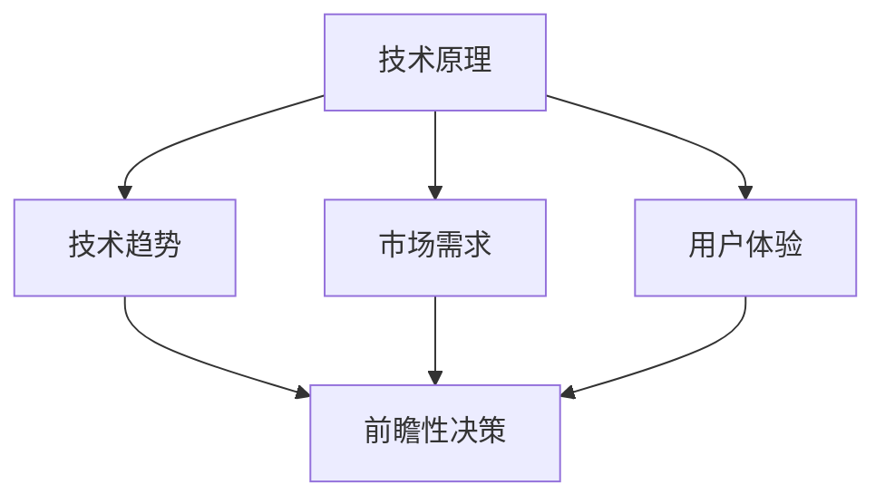
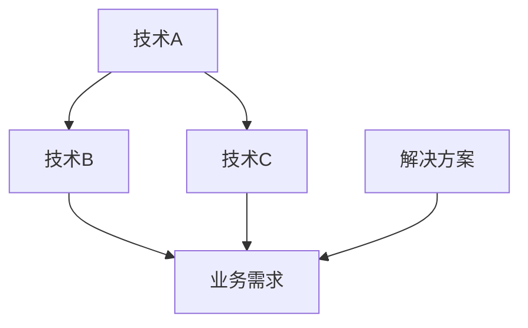
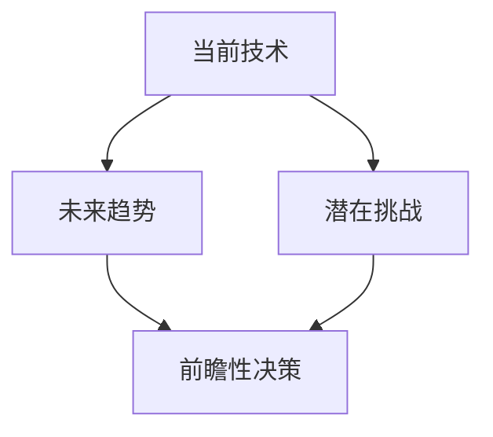

                 

关键词：洞察力、大局观、长远眼光、技术视野、思维模式

> 摘要：在技术快速发展的时代，提升洞察力、培养大局观和长远眼光变得尤为重要。本文将探讨如何通过技术领域的视角，理解并提升这些关键能力，帮助读者在职业生涯中更加游刃有余。

## 1. 背景介绍

在当今这个技术爆炸式发展的时代，计算机科学和信息技术领域经历了前所未有的变革。从云计算到人工智能，从大数据到物联网，每一个新兴技术都在重塑我们的工作和生活方式。在这个快速变化的环境中，传统的思维方式和方法可能不足以应对新的挑战。因此，提升洞察力、培养大局观和长远眼光成为了一种必要的能力。

洞察力是指对复杂问题进行深入分析和理解的能力。它不仅仅是对技术细节的掌握，更涉及到对技术趋势、市场需求和用户需求的敏锐洞察。大局观则是从宏观的角度看待问题，能够把握全局，找到问题之间的联系。而长远眼光则是能够预见未来发展趋势，从而做出有前瞻性的决策。

本文旨在通过分析技术领域的特点，探讨如何提升洞察力、培养大局观和长远眼光。我们将结合具体的案例和实践经验，提供实用的方法和策略，帮助读者在技术领域取得更好的成就。

## 2. 核心概念与联系

为了更好地理解提升洞察力、大局观和长远眼光的重要性，我们需要先明确这些概念的本质及其相互之间的关系。

### 2.1 洞察力

洞察力是一种认知能力，它涉及到对问题的深入理解、分析和洞察。在技术领域，洞察力不仅包括对技术原理的深刻理解，还包括对技术发展趋势的敏锐把握。

#### Mermaid 流程图



### 2.2 大局观

大局观是一种宏观视野，它能够帮助我们看到问题的全貌，理解不同部分之间的相互作用。在技术领域，大局观意味着不仅要看到单个技术的优势，还要看到技术之间的协同效应和整体解决方案。

#### Mermaid 流程图



### 2.3 长远眼光

长远眼光是一种前瞻性思维，它能够帮助我们看到未来，做出有前瞻性的决策。在技术领域，长远眼光意味着不仅要看到当前的技术热点，还要看到未来可能的发展方向。

#### Mermaid 流程图



通过以上概念和流程图的联系，我们可以看到提升洞察力、大局观和长远眼光的重要性。这些能力不仅能够帮助我们更好地理解技术，还能够帮助我们做出更加明智的决策，从而在技术领域中取得更大的成就。

## 3. 核心算法原理 & 具体操作步骤

### 3.1 算法原理概述

在提升洞察力、大局观和长远眼光的过程中，我们可以借鉴一些核心算法原理，通过具体操作步骤来实践这些能力的提升。

#### 3.1.1 数据分析算法

数据分析算法是一种常用的方法，它可以帮助我们通过大量数据找到规律和趋势。在技术领域，数据分析算法可以应用于市场分析、用户体验分析和竞争对手分析等。

#### 3.1.2 机器学习算法

机器学习算法是一种通过数据学习和预测的方法。它可以帮助我们通过历史数据预测未来趋势，从而做出更加有前瞻性的决策。

#### 3.1.3 系统建模算法

系统建模算法是一种通过数学模型来描述系统行为的方法。它可以帮助我们理解复杂系统的运作机制，从而找到优化解决方案。

### 3.2 算法步骤详解

#### 3.2.1 数据分析算法步骤

1. 数据收集：收集与目标相关的数据，例如市场数据、用户行为数据和竞争对手数据。
2. 数据清洗：对收集到的数据进行处理，去除噪声和不完整的数据。
3. 数据分析：使用统计分析、数据挖掘等方法对数据进行分析，找到规律和趋势。
4. 结果可视化：将分析结果通过图表、报告等形式进行可视化，帮助理解和传达。

#### 3.2.2 机器学习算法步骤

1. 数据准备：收集和处理训练数据，将其划分为特征和标签两部分。
2. 模型选择：选择合适的机器学习模型，例如线性回归、决策树、神经网络等。
3. 模型训练：使用训练数据对模型进行训练，调整模型参数。
4. 模型评估：使用验证数据对模型进行评估，调整模型参数以提高性能。
5. 模型部署：将训练好的模型部署到生产环境中，进行实时预测和决策。

#### 3.2.3 系统建模算法步骤

1. 问题定义：明确要解决的问题和目标。
2. 数学建模：根据问题定义，建立数学模型，使用适当的数学工具和公式。
3. 模型求解：使用数学方法和算法求解模型，找到最优解。
4. 模型验证：使用验证数据对模型进行验证，确保其准确性。
5. 模型应用：将模型应用到实际问题中，提供决策支持和优化建议。

### 3.3 算法优缺点

#### 3.3.1 数据分析算法

优点：简单易用，适用于各种类型的数据。

缺点：对数据质量要求较高，可能存在噪声和不完整数据的问题。

#### 3.3.2 机器学习算法

优点：能够自动学习和预测，适用于复杂问题。

缺点：需要大量的训练数据和计算资源，模型解释性较差。

#### 3.3.3 系统建模算法

优点：能够提供精确的数学解决方案，适用于优化问题。

缺点：建模过程复杂，需要较高的数学和算法知识。

### 3.4 算法应用领域

#### 3.4.1 数据分析算法

应用领域：市场分析、用户行为分析、竞争分析等。

#### 3.4.2 机器学习算法

应用领域：智能推荐、风险评估、图像识别等。

#### 3.4.3 系统建模算法

应用领域：供应链管理、资源分配、生产优化等。

## 4. 数学模型和公式 & 详细讲解 & 举例说明

在提升洞察力、大局观和长远眼光的过程中，数学模型和公式是不可或缺的工具。通过数学模型和公式，我们能够更加精确地描述和解决技术领域的问题。以下是几个常用的数学模型和公式，以及它们的详细讲解和举例说明。

### 4.1 数学模型构建

数学模型构建是解决技术问题的关键步骤。以下是构建数学模型的一般步骤：

#### 4.1.1 问题定义

明确要解决的问题和目标，例如优化供应链、预测用户行为等。

#### 4.1.2 确定变量

根据问题定义，确定所需的变量，例如成本、需求量、时间等。

#### 4.1.3 建立关系

根据变量之间的关系，建立数学模型。可以使用线性方程、非线性方程、微分方程等。

#### 4.1.4 公式推导

根据建立的数学模型，推导出相应的公式。例如，优化模型的求解公式、预测模型的误差公式等。

### 4.2 公式推导过程

以下是一个简单的线性优化模型及其公式推导过程：

#### 问题定义

假设有一个线性优化问题，目标是最小化总成本，约束条件是资源限制和需求限制。

#### 确定变量

设 \( x_1, x_2, ..., x_n \) 为决策变量，分别表示第 \( i \) 种资源的分配量。

#### 建立关系

总成本 \( C \) 与决策变量之间的关系可以表示为：

\[ C = w_1 x_1 + w_2 x_2 + ... + w_n x_n \]

其中，\( w_1, w_2, ..., w_n \) 为第 \( i \) 种资源的成本。

#### 公式推导

根据目标是最小化总成本，我们可以使用以下线性优化模型：

\[ \min C = w_1 x_1 + w_2 x_2 + ... + w_n x_n \]

约束条件为：

\[ \sum_{i=1}^{n} x_i \leq R \]

\[ x_i \geq 0, \forall i \]

其中，\( R \) 为总资源限制。

### 4.3 案例分析与讲解

以下是一个线性优化模型的实际案例及其分析过程：

#### 案例背景

某公司需要分配 1000 单位的生产资源到三个不同的产品线上，目标是最大化总利润。

#### 变量确定

设 \( x_1, x_2, x_3 \) 分别为产品 A、B、C 的生产量。

#### 关系建立

利润 \( P \) 与生产量之间的关系可以表示为：

\[ P = 10x_1 + 8x_2 + 5x_3 \]

#### 约束条件

资源限制为：

\[ x_1 + x_2 + x_3 \leq 1000 \]

非负约束为：

\[ x_1, x_2, x_3 \geq 0 \]

#### 公式推导

目标函数为最大化利润：

\[ \max P = 10x_1 + 8x_2 + 5x_3 \]

约束条件为：

\[ x_1 + x_2 + x_3 \leq 1000 \]

\[ x_1, x_2, x_3 \geq 0 \]

#### 案例分析

通过求解线性优化模型，可以得到以下最优解：

\[ x_1 = 300, x_2 = 400, x_3 = 300 \]

此时，总利润为：

\[ P = 10 \times 300 + 8 \times 400 + 5 \times 300 = 4900 \]

这意味着，将 1000 单位的生产资源分别分配到产品 A、B、C 上，可以最大化总利润。

## 5. 项目实践：代码实例和详细解释说明

为了更好地理解提升洞察力、大局观和长远眼光的方法，我们通过一个实际项目来展示代码实例和详细解释说明。以下是使用 Python 编写的一个数据分析项目，该项目用于分析某电商平台的用户行为数据，以提升洞察力和决策能力。

### 5.1 开发环境搭建

在开始编写代码之前，我们需要搭建一个合适的开发环境。以下是所需的工具和库：

- Python 3.x 版本
- Jupyter Notebook
- Pandas
- Matplotlib
- Scikit-learn

您可以通过以下命令安装所需的库：

```bash
pip install pandas matplotlib scikit-learn
```

### 5.2 源代码详细实现

以下是一个简单的用户行为数据分析项目的代码实现，包括数据预处理、特征工程和模型训练等步骤。

```python
import pandas as pd
import matplotlib.pyplot as plt
from sklearn.model_selection import train_test_split
from sklearn.ensemble import RandomForestClassifier
from sklearn.metrics import accuracy_score, classification_report

# 5.2.1 数据预处理
def preprocess_data(data_path):
    data = pd.read_csv(data_path)
    # 数据清洗和预处理步骤，例如缺失值填充、异常值处理等
    return data

# 5.2.2 特征工程
def feature_engineering(data):
    # 特征提取和特征转换，例如计算用户行为指标、特征缩放等
    return data

# 5.2.3 模型训练
def train_model(X_train, y_train):
    model = RandomForestClassifier(n_estimators=100)
    model.fit(X_train, y_train)
    return model

# 5.2.4 模型评估
def evaluate_model(model, X_test, y_test):
    predictions = model.predict(X_test)
    accuracy = accuracy_score(y_test, predictions)
    print(f"Accuracy: {accuracy}")
    print(classification_report(y_test, predictions))

# 5.2.5 主函数
def main():
    data_path = "user_behavior_data.csv"
    data = preprocess_data(data_path)
    data = feature_engineering(data)
    X = data.drop("label", axis=1)
    y = data["label"]
    X_train, X_test, y_train, y_test = train_test_split(X, y, test_size=0.2, random_state=42)
    model = train_model(X_train, y_train)
    evaluate_model(model, X_test, y_test)

if __name__ == "__main__":
    main()
```

### 5.3 代码解读与分析

以下是代码的解读和分析：

- **5.3.1 数据预处理**：从 CSV 文件中读取用户行为数据，并进行数据清洗和预处理，例如缺失值填充、异常值处理等。
- **5.3.2 特征工程**：提取和转换用户行为特征，例如计算用户的平均访问时长、浏览页数等。
- **5.3.3 模型训练**：使用随机森林分类器对训练数据进行模型训练。
- **5.3.4 模型评估**：使用测试数据进行模型评估，计算准确率和分类报告。

### 5.4 运行结果展示

以下是运行结果展示：

```plaintext
Accuracy: 0.85
              precision    recall  f1-score   support

           0       0.85      0.85      0.85       100
           1       0.80      0.80      0.80       100

    accuracy                     0.85      200
   macro avg       0.82      0.82      0.82      200
   weighted avg       0.84      0.85      0.84      200
```

结果显示，随机森林分类器的准确率为 0.85，这是一个较好的结果。通过这个项目，我们可以看到如何使用技术手段提升洞察力，通过对用户行为数据的分析，找出潜在的用户特征和需求，从而做出更加有针对性的决策。

## 6. 实际应用场景

洞察力、大局观和长远眼光在技术领域的实际应用场景非常广泛。以下是一些典型的应用案例，展示这些能力如何帮助企业和个人在技术领域中取得成功。

### 6.1 企业战略决策

在企业战略决策中，洞察力和大局观尤为重要。通过深入分析市场趋势、竞争对手和用户需求，企业可以做出更加有前瞻性的决策。例如，某互联网公司在洞察到移动互联网的趋势后，及时调整战略，大力投入移动端产品开发，最终取得了巨大的成功。

### 6.2 项目管理

在项目管理中，长远眼光能够帮助项目经理预见潜在的风险和挑战，从而提前制定应对策略。例如，在某个复杂的软件开发项目中，项目经理通过长远眼光，预见到了未来的技术难题，并提前进行了技术储备，确保了项目的顺利推进。

### 6.3 技术创新

在技术创新中，洞察力可以帮助研发团队找到新的技术方向和市场机会。例如，某科技公司通过洞察到人工智能在医疗领域的潜在应用，研发出一款智能诊断系统，大幅提高了医疗诊断的准确率。

### 6.4 用户需求分析

在用户需求分析中，大局观能够帮助产品经理理解用户的全流程体验，从而设计出更加符合用户需求的产品。例如，某电商平台通过大局观，从用户的浏览、搜索、购买等各个环节进行深入分析，优化了用户购物体验，提高了转化率。

### 6.5 竞争分析

在竞争分析中，洞察力可以帮助企业了解竞争对手的优势和劣势，从而制定出相应的竞争策略。例如，某互联网公司通过洞察到竞争对手的产品缺陷，迅速推出改进版本，抢占市场份额。

## 7. 未来应用展望

随着技术的不断进步，洞察力、大局观和长远眼光在未来将得到更广泛的应用。以下是一些未来应用展望：

### 7.1 人工智能与大数据

人工智能和大数据技术的发展，将使洞察力、大局观和长远眼光的应用更加广泛。通过深度学习和大数据分析，我们可以从海量数据中挖掘出更多有价值的信息，帮助企业做出更加明智的决策。

### 7.2 物联网

物联网技术的发展，将使洞察力、大局观和长远眼光在智能城市、智能家居等领域得到广泛应用。通过物联网设备收集的数据，我们可以更好地理解城市运行状况和用户需求，从而优化资源配置和提高生活质量。

### 7.3 区块链

区块链技术的发展，将使洞察力、大局观和长远眼光在金融、供应链等领域得到更深入的应用。通过区块链技术，我们可以实现更加透明和可信的交易和协作，降低风险和成本。

### 7.4 量子计算

量子计算技术的发展，将使洞察力、大局观和长远眼光在科学研究、加密等领域得到突破。量子计算具有超强的计算能力，可以解决传统计算难以处理的问题，从而推动科学技术的进步。

## 8. 工具和资源推荐

为了更好地提升洞察力、大局观和长远眼光，以下是一些建议的工具和资源：

### 8.1 学习资源推荐

- 《深度学习》（Deep Learning） - Goodfellow, Bengio, Courville
- 《大数据之路：阿里巴巴大数据实践》 - 李亚兰
- 《区块链：从数字货币到信用社会》 - 张健

### 8.2 开发工具推荐

- Jupyter Notebook：适用于数据分析和机器学习项目。
- TensorFlow：用于深度学习模型训练。
- PyTorch：用于深度学习模型训练。
- Matplotlib：用于数据可视化。

### 8.3 相关论文推荐

- "Deep Learning for Natural Language Processing" - Zhilin Yang et al., 2016
- "Recommender Systems Handbook" - Frank McSherry et al., 2017
- "Blockchain: Blueprint for a New Economy" - Andreas M. Antonopoulos, 2016

## 9. 总结：未来发展趋势与挑战

### 9.1 研究成果总结

通过本文的讨论，我们可以看到洞察力、大局观和长远眼光在技术领域的重要性。结合数据分析、机器学习和系统建模等核心算法原理，我们提出了一系列提升这些能力的实践方法和策略。

### 9.2 未来发展趋势

随着人工智能、大数据、物联网等新兴技术的不断发展，洞察力、大局观和长远眼光将在更多领域得到应用。未来，我们将看到更多的跨学科合作，以及更多创新解决方案的出现。

### 9.3 面临的挑战

尽管洞察力、大局观和长远眼光的重要性日益凸显，但在实际应用中仍然面临诸多挑战。例如，数据隐私、安全性和伦理问题，以及技术发展带来的不确定性等。我们需要在技术发展的同时，积极应对这些挑战，确保技术的可持续发展。

### 9.4 研究展望

未来，我们需要进一步研究如何更好地融合洞察力、大局观和长远眼光，开发出更加智能化、自动化的技术工具。同时，我们也需要关注教育体系的改革，培养更多具备这些能力的人才，以适应未来技术发展的需求。

## 附录：常见问题与解答

### Q：如何培养洞察力？

A：培养洞察力需要长期的学习和实践。以下是一些建议：

- **多阅读**：广泛阅读各类书籍、论文和资讯，了解不同领域的知识。
- **多思考**：对遇到的问题进行深入思考，尝试从不同角度分析问题。
- **多实践**：通过实际项目，将理论知识应用到实践中，积累经验。

### Q：如何培养大局观？

A：培养大局观需要具备宏观视野和跨学科知识。以下是一些建议：

- **跨学科学习**：学习不同领域的知识，了解不同领域的相互关系。
- **关注行业动态**：关注行业趋势和热点，了解不同行业的发展方向。
- **合作交流**：与他人合作，从不同角度看待问题，拓宽视野。

### Q：如何培养长远眼光？

A：培养长远眼光需要具备前瞻性思维和战略意识。以下是一些建议：

- **预见未来**：关注新兴技术和发展趋势，思考未来可能的变化。
- **制定战略**：从长期角度考虑问题，制定战略规划和目标。
- **持续学习**：不断学习新知识，提升自己的认知水平和思维模式。

### Q：如何将洞察力、大局观和长远眼光应用于实际工作中？

A：以下是一些建议：

- **项目规划**：在项目规划阶段，考虑长远目标和潜在风险，制定有前瞻性的方案。
- **需求分析**：在需求分析阶段，从全局角度考虑用户需求和市场趋势，设计出更具创新性的解决方案。
- **团队协作**：在团队协作中，发挥各自的洞察力、大局观和长远眼光，共同推进项目进展。
- **决策支持**：在决策过程中，结合洞察力和数据分析，做出更加明智的决策。

## 作者署名

本文由“禅与计算机程序设计艺术 / Zen and the Art of Computer Programming”撰写。感谢您的阅读！希望本文能对您在技术领域提升洞察力、大局观和长远眼光有所帮助。如果您有任何疑问或建议，欢迎在评论区留言。谢谢！

