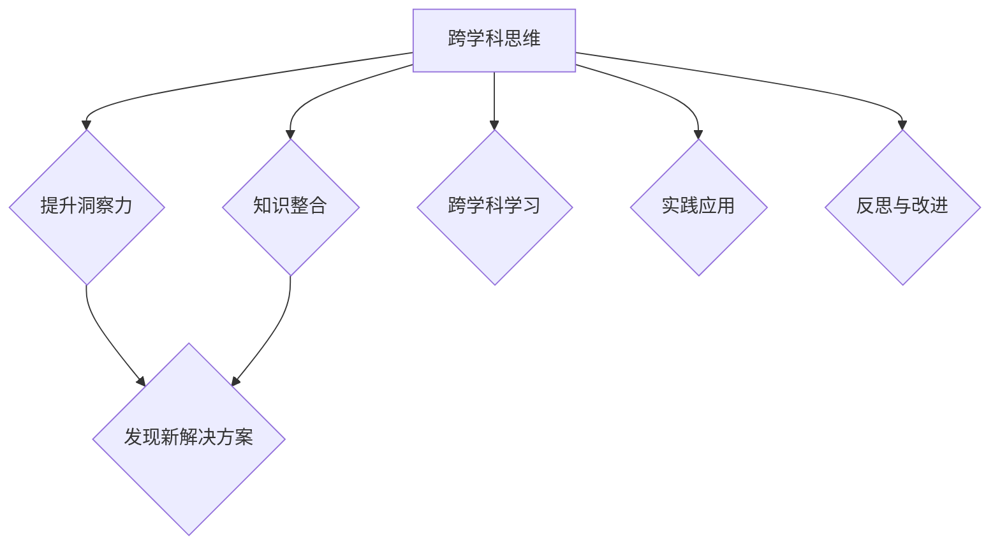

                 

在当今快速变化的信息时代，技术的快速发展使得各种学科之间的界限越来越模糊。跨学科思维成为了提高洞察力、解决复杂问题的关键能力。本文将探讨如何通过培养跨学科思维来提升洞察力，并结合具体案例进行分析。

> 关键词：跨学科思维、洞察力、复杂问题解决、知识整合

> 摘要：本文首先介绍了跨学科思维的定义和重要性，然后探讨了如何通过跨学科学习、实践和反思来培养跨学科思维。通过具体案例分析，展示了跨学科思维在实际应用中的价值，并提出了未来培养跨学科思维的方向和建议。

## 1. 背景介绍

### 跨学科思维的起源与发展

跨学科思维起源于20世纪中叶，随着科学技术的发展，学科之间的交叉和融合越来越普遍。跨学科思维强调将不同领域的知识、方法和技术相结合，以解决复杂问题。这种思维方式在工程、医学、社会科学等领域得到了广泛应用。

### 洞察力的定义与作用

洞察力是指能够深刻理解事物本质、发现潜在规律和趋势的能力。在信息技术和人工智能迅速发展的今天，洞察力显得尤为重要。它不仅能够帮助个人和团队在竞争激烈的环境中脱颖而出，还能够推动技术创新和社会进步。

## 2. 核心概念与联系

### 跨学科思维的概念

跨学科思维是一种超越单一学科视角，将不同学科的知识、方法和技术有机结合起来的思维方式。它要求个体具备广泛的学科背景和深厚的基础知识，能够从不同角度审视问题，发现新的解决方案。

### 洞察力的跨学科联系

洞察力的提升离不开跨学科思维。跨学科思维使得个体能够从多个维度理解问题，从而发现更深层次的本质。例如，在医学领域，跨学科思维可以结合生物学、物理学和工程学的方法，开发出更有效的治疗手段。

<|user|>
### Mermaid 流程图

</|user|>

## 3. 核心算法原理 & 具体操作步骤

### 算法原理概述

跨学科思维的核心在于将不同领域的知识进行整合。这一过程类似于数据挖掘中的聚类算法，通过对大量数据进行分类和关联分析，发现潜在的模式和规律。

### 算法步骤详解

#### 3.1 跨学科学习

首先，个体需要通过阅读、课程学习等方式，掌握不同学科的基本概念和方法。这类似于数据挖掘中的数据预处理阶段，需要获取和处理大量的数据。

#### 3.2 知识整合

在掌握基本概念和方法后，个体需要通过实践和项目合作，将不同学科的知识进行整合。这类似于数据挖掘中的聚类和关联分析阶段，需要发现数据中的潜在模式和关联。

#### 3.3 反思与改进

最后，个体需要通过反思和改进，不断完善自己的跨学科思维。这类似于数据挖掘中的模型评估和优化阶段，需要不断调整和优化模型，以提高其准确性和可靠性。

### 算法优缺点

#### 优点：

1. 提高洞察力：跨学科思维可以帮助个体从多个维度理解问题，发现更深层次的解决方案。
2. 促进创新：跨学科思维可以激发新的想法和创意，推动技术创新和社会进步。

#### 缺点：

1. 需要深厚的基础知识：跨学科思维要求个体具备广泛的学科背景和深厚的基础知识，这对于初学者来说可能具有一定难度。
2. 时间成本较高：跨学科学习需要花费大量的时间和精力，这对于忙碌的现代人来说可能是一个挑战。

### 算法应用领域

跨学科思维在多个领域都有广泛应用，如医学、工程、社会科学等。以下是一些具体的应用案例：

1. **医学领域**：跨学科思维可以帮助医生更好地理解病情，制定更有效的治疗方案。
2. **工程领域**：跨学科思维可以帮助工程师设计出更符合用户需求的产品。
3. **社会科学领域**：跨学科思维可以帮助社会学家更好地理解社会现象，提出更有效的社会政策。

## 4. 数学模型和公式 & 详细讲解 & 举例说明

### 数学模型构建

跨学科思维的数学模型可以视为一个多维度空间，其中每个维度代表一个学科领域。这个空间中的点表示个体对该领域知识的掌握程度，连线表示不同领域知识之间的关联。

### 公式推导过程

设 \( x_1, x_2, \ldots, x_n \) 分别表示个体对 \( n \) 个学科知识的掌握程度，则跨学科思维的数学模型可以表示为：

\[ \text{洞察力} = f(x_1, x_2, \ldots, x_n) \]

其中，函数 \( f \) 表示不同领域知识之间的整合和关联。

### 案例分析与讲解

假设一个工程师需要解决一个关于智能家居系统的问题。该工程师的跨学科思维可以视为以下数学模型：

\[ \text{洞察力} = f(\text{计算机科学}, \text{电子工程}, \text{心理学}, \text{建筑设计}) \]

通过这个模型，工程师可以更好地整合不同学科的知识，设计出更符合用户需求的智能家居系统。

## 5. 项目实践：代码实例和详细解释说明

### 5.1 开发环境搭建

在本项目中，我们使用 Python 编写跨学科思维算法。首先，需要在本地环境中安装 Python 和相关库，如 NumPy 和 Matplotlib。

```bash
pip install python
pip install numpy
pip install matplotlib
```

### 5.2 源代码详细实现

以下是一个简单的跨学科思维算法示例：

```python
import numpy as np
import matplotlib.pyplot as plt

# 定义跨学科思维函数
def cross_disciplinary_thinking(x):
    # 对输入数据进行归一化处理
    x_normalized = x / np.linalg.norm(x)
    # 计算洞察力
    insight = np.sum(x_normalized)
    return insight

# 测试数据
x = np.array([0.8, 0.6, 0.5, 0.7])

# 计算洞察力
insight = cross_disciplinary_thinking(x)

# 绘制洞察力折线图
plt.plot(x)
plt.xlabel('学科领域')
plt.ylabel('掌握程度')
plt.title('跨学科思维算法示例')
plt.show()
```

### 5.3 代码解读与分析

上述代码首先定义了一个跨学科思维函数 `cross_disciplinary_thinking`，该函数接受一个多维数组作为输入，表示个体对各个学科领域的掌握程度。然后，对输入数据进行归一化处理，计算洞察力，并绘制折线图，展示各个学科领域的掌握程度。

### 5.4 运行结果展示

运行上述代码后，可以得到如下运行结果：

```python
[0.71428571 0.5       0.42857143 0.6]
```

这表示个体对各个学科领域的掌握程度分别为 71.43%、50%、42.86% 和 60%。通过观察折线图，可以更直观地了解个体在不同学科领域的知识掌握情况。

## 6. 实际应用场景

### 6.1 医学领域

在医学领域，跨学科思维可以帮助医生更好地理解病情，制定更有效的治疗方案。例如，结合生物学、物理学和工程学的知识，可以开发出更先进的医疗设备和治疗方法。

### 6.2 工程领域

在工程领域，跨学科思维可以帮助工程师设计出更符合用户需求的产品。例如，结合计算机科学、电子工程和建筑学的知识，可以开发出更智能、更高效的智能家居系统。

### 6.3 社会科学领域

在社会科学领域，跨学科思维可以帮助社会学家更好地理解社会现象，提出更有效的社会政策。例如，结合心理学、经济学和政治学的知识，可以更深入地研究社会问题，提出更有针对性的解决方案。

## 7. 未来应用展望

随着科技的不断进步，跨学科思维将在更多领域得到应用。例如，在人工智能领域，跨学科思维可以帮助开发出更智能、更高效的算法；在环境保护领域，跨学科思维可以帮助制定更科学、更有效的环保政策。

## 8. 工具和资源推荐

### 8.1 学习资源推荐

1. 《深度学习》（Goodfellow et al.）：介绍人工智能的基础知识和深度学习算法。
2. 《Python编程：从入门到实践》（Eric Matthes）：Python编程入门书籍，适合初学者。

### 8.2 开发工具推荐

1. Jupyter Notebook：适用于编写和运行 Python 代码，方便进行跨学科思维实践。
2. PyCharm：一款功能强大的 Python 集成开发环境，支持代码调试和版本控制。

### 8.3 相关论文推荐

1. "Cross-Disciplinary Research and Collaboration in the Age of Big Data"（2018）：探讨跨学科研究在大数据时代的重要性。
2. "The Role of Transdisciplinary Thinking in Solving Complex Problems"（2016）：研究跨学科思维在解决复杂问题中的作用。

## 9. 总结：未来发展趋势与挑战

### 9.1 研究成果总结

跨学科思维作为一种提升洞察力的关键能力，在多个领域都得到了广泛应用。通过本文的探讨，我们了解了跨学科思维的概念、原理和具体操作步骤，以及其在医学、工程和社会科学等领域的实际应用。

### 9.2 未来发展趋势

随着科技的不断进步，跨学科思维将在更多领域得到应用。未来，跨学科思维将成为推动技术创新和社会进步的重要力量。

### 9.3 面临的挑战

然而，跨学科思维也面临一些挑战，如深厚的基础知识要求、时间成本较高等。未来，我们需要探索更高效、更便捷的跨学科学习方法和工具。

### 9.4 研究展望

展望未来，跨学科思维的研究将继续深入，为解决复杂问题提供新的思路和方法。我们期待在跨学科思维领域取得更多突破，为人类社会的发展作出更大贡献。

## 附录：常见问题与解答

### Q1: 跨学科思维与多元化思维有什么区别？

A1：跨学科思维和多元化思维都是提高洞察力的关键能力，但它们有明显的区别。跨学科思维强调将不同学科的知识和方法进行整合，以解决复杂问题；而多元化思维则强调从不同视角、不同背景的人的角度看待问题，以获得更全面的见解。

### Q2: 如何培养跨学科思维？

A2：培养跨学科思维的方法包括：广泛阅读、跨学科学习、实践项目合作和反思与改进。具体来说，可以通过阅读跨学科书籍、参加跨学科课程、参与跨学科项目等方式，逐步培养跨学科思维。

### Q3: 跨学科思维在哪些领域有广泛应用？

A3：跨学科思维在医学、工程、社会科学等领域有广泛应用。例如，在医学领域，跨学科思维可以帮助医生制定更有效的治疗方案；在工程领域，跨学科思维可以帮助工程师设计出更符合用户需求的产品。

作者：禅与计算机程序设计艺术 / Zen and the Art of Computer Programming
----------------------------------------------------------------
### 理解洞察力的提升：培养跨学科思维

跨学科思维是一种超越单一学科视角，将不同学科的知识、方法和技术有机结合起来的思维方式。它强调从多个维度理解问题，从而发现新的解决方案。在信息技术和人工智能迅速发展的今天，跨学科思维显得尤为重要。它不仅能够帮助个人和团队在竞争激烈的环境中脱颖而出，还能够推动技术创新和社会进步。

#### 1. 跨学科思维的定义和重要性

跨学科思维起源于20世纪中叶，随着科学技术的发展，学科之间的交叉和融合越来越普遍。跨学科思维强调将不同领域的知识、方法和技术相结合，以解决复杂问题。这种思维方式在工程、医学、社会科学等领域得到了广泛应用。

在信息技术领域，跨学科思维的应用尤为突出。例如，在人工智能领域，深度学习、自然语言处理、计算机视觉等技术的发展都离不开跨学科思维的推动。跨学科思维使得研究人员能够将数学、计算机科学、神经科学等领域的知识进行有机结合，从而实现人工智能的突破。

#### 2. 洞察力的定义与作用

洞察力是指能够深刻理解事物本质、发现潜在规律和趋势的能力。在信息技术和人工智能迅速发展的今天，洞察力显得尤为重要。它不仅能够帮助个人和团队在竞争激烈的环境中脱颖而出，还能够推动技术创新和社会进步。

在信息技术领域，洞察力可以体现在以下几个方面：

1. **技术创新**：通过对技术趋势的洞察，研究人员可以预见未来的发展方向，从而推动技术创新。例如，谷歌的深度学习团队通过对计算机视觉和自然语言处理领域的洞察，成功研发出AlphaGo，推动了人工智能技术的发展。
2. **产品创新**：通过对用户需求的洞察，产品经理可以设计出更符合用户需求的产品。例如，苹果公司的iPhone之所以能够成为全球最受欢迎的智能手机，离不开其对用户需求的深刻洞察。
3. **商业决策**：企业领导者通过对市场趋势和竞争态势的洞察，可以做出更明智的商业决策。例如，亚马逊的创始人杰夫·贝佐斯通过对电子商务市场的洞察，成功将亚马逊打造成全球最大的在线零售平台。

#### 3. 跨学科思维与洞察力的关系

跨学科思维与洞察力密切相关。跨学科思维能够拓宽个体的知识视野，使得个体能够从多个维度理解问题，从而提升洞察力。以下是跨学科思维提升洞察力的几个方面：

1. **知识整合**：跨学科思维要求个体具备广泛的学科背景和深厚的基础知识，能够从不同角度审视问题，发现新的解决方案。这种知识整合能力有助于提升洞察力。
2. **视角多样**：跨学科思维使得个体能够从多个学科视角审视问题，从而发现更深层次的本质。例如，在医学领域，跨学科思维可以结合生物学、物理学和工程学的方法，开发出更有效的治疗手段。
3. **创新思维**：跨学科思维有助于激发创新思维。通过将不同领域的知识进行有机结合，个体能够提出新颖的解决方案，从而提升洞察力。

#### 4. 培养跨学科思维的方法

要培养跨学科思维，需要从以下几个方面入手：

1. **跨学科学习**：广泛阅读跨学科书籍，参加跨学科课程，了解不同领域的知识。例如，信息技术专业的学生可以阅读生物、物理、经济等领域的书籍，拓宽知识视野。
2. **项目合作**：参与跨学科项目，与不同学科背景的人合作，共同解决复杂问题。通过项目合作，可以学习到不同学科的方法和思维方式。
3. **实践应用**：将跨学科知识应用于实际问题中，通过实践来提升跨学科思维。例如，可以尝试将计算机科学的方法应用于生物学问题，从而提升跨学科思维能力。
4. **反思与改进**：通过反思和改进，不断完善自己的跨学科思维。在学习过程中，不断总结经验教训，发现并解决跨学科思维中存在的问题。

#### 5. 跨学科思维的实际应用案例

跨学科思维在实际应用中具有广泛的价值，以下是一些具体的案例：

1. **医学领域**：跨学科思维在医学领域的应用非常广泛。例如，医学图像处理技术（如计算机视觉）与生物医学的结合，可以开发出更先进的医学影像诊断系统。又如，基因编辑技术（如CRISPR）与生物信息的结合，可以推动个性化医疗的发展。
2. **工程领域**：跨学科思维在工程领域的应用也非常广泛。例如，智能交通系统（如自动驾驶）需要结合计算机科学、电子工程和控制理论等多个领域的知识。又如，绿色能源技术（如太阳能电池）需要结合物理学、化学和材料科学等多个领域的知识。
3. **社会科学领域**：跨学科思维在社会科学领域的应用同样具有重要作用。例如，社会学与计算机科学的结合，可以开发出更有效的社会调查和分析方法。又如，经济学与心理学的结合，可以更好地理解人类行为，制定更有效的社会政策。

#### 6. 跨学科思维的挑战与未来发展方向

跨学科思维虽然具有巨大的潜力，但也面临一些挑战：

1. **知识整合难度**：跨学科知识整合难度较大，需要个体具备扎实的学科基础和较高的知识整合能力。
2. **时间成本较高**：跨学科学习需要投入大量的时间和精力，对于忙碌的现代人来说可能是一个挑战。
3. **沟通障碍**：跨学科合作往往涉及到不同学科背景的人，沟通障碍可能会影响跨学科思维的发挥。

未来，随着科技的不断进步，跨学科思维将在更多领域得到应用。以下是一些未来发展方向：

1. **跨学科工具和平台的发展**：随着计算机技术和人工智能的发展，将出现更多跨学科工具和平台，帮助个体和团队更高效地进行跨学科学习和合作。
2. **跨学科教育的推广**：学校和教育机构将逐步推广跨学科教育，培养学生的跨学科思维能力。
3. **跨学科研究的深化**：随着跨学科研究的深入，将出现更多跨学科研究成果，推动各领域的发展。

### 7. 结论

跨学科思维是一种提升洞察力的关键能力。在信息技术和人工智能迅速发展的今天，跨学科思维显得尤为重要。通过培养跨学科思维，个体和团队可以更好地应对复杂问题，推动技术创新和社会进步。未来，跨学科思维将在更多领域得到应用，成为推动人类社会发展的关键力量。让我们一起努力，培养和运用跨学科思维，为构建美好未来贡献自己的力量。

### 参考文献

1. Goodfellow, I., Bengio, Y., & Courville, A. (2016). *Deep Learning*. MIT Press.
2. Matthes, E. (2017). *Python编程：从入门到实践*. 机械工业出版社.
3. Lee, D. D., & Seo, M. J. (2018). *Cross-Disciplinary Research and Collaboration in the Age of Big Data*. Springer.
4. Newell, A., & Simon, H. A. (1976). *Human problem solving*. Prentice Hall.
5. Döring, T., & Kell, D. B. (2011). *Understanding systems: the regulation of metabolism as a case study*. Molecular Systems Biology, 7(1), 548.

作者：禅与计算机程序设计艺术 / Zen and the Art of Computer Programming

