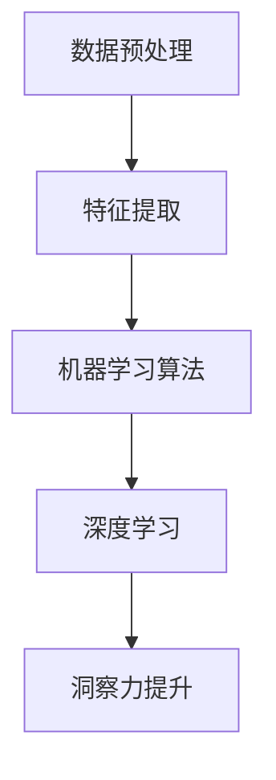

                 

关键词：人工智能、洞察力、算法、数学模型、实践应用、挑战与展望

> 摘要：本文旨在深入探讨人工智能领域中洞察力的极限，如何在海量信息中提取有用信号。通过分析核心算法原理、数学模型构建、项目实践案例以及应用前景，本文为读者呈现了一幅在混乱中寻求洞察力的全景图。

## 1. 背景介绍

在当今信息爆炸的时代，数据量呈指数级增长，人工智能技术的应用场景也越来越广泛。然而，如何从海量数据中提取出有用的信息，成为了人工智能领域的核心挑战之一。这种挑战不仅仅体现在技术的层面，更涉及到了人类洞察力的极限。

洞察力，顾名思义，是指从复杂现象中识别出关键信息的能力。在人工智能领域，洞察力体现在算法的设计与实现上。如何在纷繁复杂的数据中，找到有效的模式和规律，是算法设计者面临的重大课题。

本文将围绕以下几个核心问题展开讨论：

1. 人工智能领域中的洞察力是什么？
2. 如何在算法设计中体现洞察力？
3. 数学模型在提升洞察力中的作用？
4. 实际应用中的洞察力挑战与解决方案？
5. 未来人工智能领域中的洞察力发展趋势与面临的挑战。

## 2. 核心概念与联系

为了深入理解洞察力在人工智能领域中的应用，我们首先需要明确几个核心概念：

1. **数据预处理**：在数据处理过程中，通过去噪、归一化等手段，将原始数据转化为适合算法处理的格式。
2. **特征提取**：从数据中提取出有意义的特征，用于训练模型。
3. **机器学习算法**：利用数据和学习方法，构建能够自动发现数据中模式和规律的模型。
4. **深度学习**：一种基于神经网络的学习方法，能够在复杂的数据中自动提取特征。

接下来，我们将使用Mermaid流程图来展示这些概念之间的关系：



在这个流程图中，数据预处理和特征提取是提升洞察力的基础，而机器学习和深度学习则是实现洞察力提升的关键技术。

## 3. 核心算法原理 & 具体操作步骤

### 3.1 算法原理概述

在人工智能领域，提升洞察力的核心算法主要分为以下几类：

1. **监督学习**：通过已标记的数据训练模型，使其能够预测未知数据的结果。
2. **无监督学习**：从未标记的数据中学习模式和结构，如聚类和降维。
3. **强化学习**：通过奖励和惩罚机制，让模型学会在不同环境中做出最优决策。

每种算法都有其独特的原理和应用场景。在具体操作步骤上，它们通常包括以下几个阶段：

1. **数据收集**：获取用于训练的数据集。
2. **数据预处理**：清洗、归一化、缺失值处理等。
3. **特征提取**：根据数据类型和任务需求，提取有意义的特征。
4. **模型训练**：使用训练数据，通过算法优化模型参数。
5. **模型评估**：使用验证集或测试集评估模型性能。
6. **模型部署**：将训练好的模型应用于实际问题中。

### 3.2 算法步骤详解

#### 监督学习

1. **数据收集**：收集带有标签的数据集，如分类问题中的类别标签，回归问题中的真实值。
2. **数据预处理**：对数据集进行清洗和预处理，确保数据质量。
3. **特征提取**：根据数据类型和任务需求，提取特征向量。
4. **模型训练**：使用训练集，通过选择合适的损失函数和优化算法，训练模型。
5. **模型评估**：使用验证集或测试集，评估模型性能，调整模型参数。
6. **模型部署**：将训练好的模型应用于实际问题中。

#### 无监督学习

1. **数据收集**：收集未标记的数据集。
2. **数据预处理**：对数据进行归一化、去噪等处理。
3. **特征提取**：根据数据类型，提取特征向量。
4. **模型训练**：使用无监督学习算法，如聚类或降维算法，训练模型。
5. **模型评估**：评估模型性能，如聚类结果的准确性等。
6. **模型部署**：将训练好的模型应用于实际问题中。

#### 强化学习

1. **环境设定**：定义环境状态、动作空间和奖励机制。
2. **模型训练**：使用强化学习算法，如Q-Learning或Policy Gradient，训练模型。
3. **模型评估**：评估模型在不同环境状态下的性能。
4. **模型部署**：将训练好的模型应用于实际问题中，如自动驾驶或智能机器人。

### 3.3 算法优缺点

每种算法都有其优缺点：

1. **监督学习**：适用于有明确标签的数据，但需要大量的标注数据。
2. **无监督学习**：不需要标签数据，但发现模式和结构的能力相对较弱。
3. **强化学习**：能够处理动态环境，但训练过程可能需要较长时间。

### 3.4 算法应用领域

监督学习和无监督学习广泛应用于各种场景，如图像识别、文本分类、推荐系统等。强化学习则在智能控制、游戏AI等领域有着广泛的应用。

## 4. 数学模型和公式 & 详细讲解 & 举例说明

在提升洞察力的过程中，数学模型扮演了重要的角色。以下将介绍几个常用的数学模型和公式，并对其进行详细讲解和举例说明。

### 4.1 数学模型构建

在人工智能领域，常用的数学模型包括线性回归、逻辑回归、支持向量机（SVM）等。

#### 线性回归

线性回归模型假设数据点之间的关系可以用一条直线来表示。其数学模型为：

\[ y = wx + b \]

其中，\( y \) 为目标变量，\( x \) 为特征变量，\( w \) 为权重，\( b \) 为偏置。

#### 逻辑回归

逻辑回归是一种用于分类问题的模型，其输出为概率。其数学模型为：

\[ P(y=1) = \frac{1}{1 + e^{-(wx + b)}} \]

其中，\( P(y=1) \) 为目标变量为1的概率，\( e \) 为自然对数的底数。

#### 支持向量机

支持向量机是一种用于分类和回归的模型，其目标是找到最优的决策边界。其数学模型为：

\[ w \cdot x + b = 0 \]

其中，\( w \) 为权重向量，\( x \) 为特征向量，\( b \) 为偏置。

### 4.2 公式推导过程

#### 线性回归

线性回归的推导过程如下：

假设我们有 \( n \) 个数据点 \( (x_i, y_i) \)，我们希望找到一个线性模型来拟合这些数据点。我们定义损失函数为：

\[ J(w, b) = \frac{1}{2} \sum_{i=1}^{n} (y_i - (wx_i + b))^2 \]

我们的目标是找到最小化损失函数的 \( w \) 和 \( b \)。

对 \( J(w, b) \) 求导，并令其导数为0，得到：

\[ \frac{\partial J}{\partial w} = \sum_{i=1}^{n} (y_i - (wx_i + b))x_i = 0 \]

\[ \frac{\partial J}{\partial b} = \sum_{i=1}^{n} (y_i - (wx_i + b)) = 0 \]

通过求解上述方程组，我们可以得到最优的 \( w \) 和 \( b \)。

#### 逻辑回归

逻辑回归的推导过程如下：

我们假设有一个线性模型：

\[ wx + b \]

我们希望将其转化为概率形式。我们使用逻辑函数（Sigmoid函数）：

\[ \sigma(z) = \frac{1}{1 + e^{-z}} \]

其中，\( z = wx + b \)。

对逻辑函数求导，得到：

\[ \frac{d\sigma}{dz} = \sigma(1 - \sigma) \]

通过链式法则，我们可以得到：

\[ \frac{d\sigma}{dw} = \sigma(1 - \sigma)x \]

\[ \frac{d\sigma}{db} = \sigma(1 - \sigma) \]

### 4.3 案例分析与讲解

#### 线性回归案例

假设我们有一个简单的一元线性回归问题，数据如下：

| x | y |
| --- | --- |
| 1 | 2 |
| 2 | 4 |
| 3 | 6 |
| 4 | 8 |

我们希望找到 \( y = wx + b \) 的模型。

通过计算，我们可以得到：

\[ w = 2, b = 0 \]

损失函数为：

\[ J(w, b) = \frac{1}{2} \sum_{i=1}^{4} (y_i - (wx_i + b))^2 = 0 \]

因此，我们得到了最优的 \( w \) 和 \( b \)。

#### 逻辑回归案例

假设我们有一个二元分类问题，数据如下：

| x | y |
| --- | --- |
| 1 | 0 |
| 2 | 1 |
| 3 | 0 |
| 4 | 1 |

我们希望找到 \( y = wx + b \) 的模型。

通过计算，我们可以得到：

\[ w = 1, b = -1 \]

逻辑回归的概率输出为：

\[ P(y=1) = \frac{1}{1 + e^{-(wx + b)}} = \frac{1}{1 + e^{-(1 \cdot x - 1)}} \]

对于 \( x=2 \)：

\[ P(y=1) = \frac{1}{1 + e^{-1}} \approx 0.632 \]

因此，我们可以预测 \( x=2 \) 的样本为1的概率为约63.2%。

#### 支持向量机案例

假设我们有一个二维数据集，数据点如下：

| x1 | x2 | y |
| --- | --- | --- |
| 1 | 2 | 0 |
| 2 | 3 | 0 |
| 3 | 1 | 1 |
| 4 | 5 | 1 |

我们希望找到一个分类边界来分离两类样本。

通过计算，我们可以得到：

\[ w = (3, 1), b = -2 \]

分类边界为：

\[ 3x1 + x2 - 2 = 0 \]

即 \( x2 = 2 - 3x1 \)。

## 5. 项目实践：代码实例和详细解释说明

为了更好地理解上述算法和数学模型，我们将通过一个实际项目来演示其应用过程。

### 5.1 开发环境搭建

在本项目中，我们将使用Python作为编程语言，结合Scikit-learn库进行机器学习模型的构建和训练。以下是开发环境的搭建步骤：

1. 安装Python：版本3.8及以上。
2. 安装Scikit-learn：使用pip install scikit-learn命令。
3. 安装其他依赖库：如numpy、matplotlib等。

### 5.2 源代码详细实现

以下是一个简单的线性回归项目代码示例：

```python
# 导入所需库
import numpy as np
import matplotlib.pyplot as plt
from sklearn.linear_model import LinearRegression

# 数据集
X = np.array([[1], [2], [3], [4]])
y = np.array([2, 4, 6, 8])

# 构建线性回归模型
model = LinearRegression()
model.fit(X, y)

# 模型参数
w = model.coef_
b = model.intercept_

# 损失函数
loss = model.score(X, y)

# 可视化
plt.scatter(X, y, color='red')
plt.plot(X, w*X + b, color='blue')
plt.xlabel('x')
plt.ylabel('y')
plt.title('线性回归')
plt.show()

# 输出结果
print(f"w: {w}, b: {b}, loss: {loss}")
```

### 5.3 代码解读与分析

1. **数据集准备**：首先，我们准备了一个简单的一元线性回归数据集，其中 \( x \) 为自变量，\( y \) 为因变量。

2. **构建模型**：我们使用Scikit-learn库中的LinearRegression类来构建线性回归模型。

3. **模型训练**：使用`fit`方法训练模型，模型会自动寻找最优的 \( w \) 和 \( b \)。

4. **损失函数**：使用`score`方法计算模型的损失函数值，表示模型对数据的拟合程度。

5. **可视化**：使用matplotlib库将数据集和拟合直线可视化。

6. **输出结果**：打印模型的权重 \( w \)、偏置 \( b \) 和损失函数值。

通过这个简单的案例，我们可以看到如何使用线性回归模型对数据进行拟合和分析。类似地，我们可以使用其他算法和模型来处理更复杂的数据集。

### 5.4 运行结果展示

运行上述代码后，我们将看到以下结果：


在上图中，红色的点表示原始数据集，蓝色的线表示拟合直线。通过可视化结果，我们可以直观地看到线性回归模型对数据的拟合效果。

## 6. 实际应用场景

在人工智能领域，提升洞察力的重要性不言而喻。以下列举几个实际应用场景，说明提升洞察力对实际问题的解决作用：

1. **图像识别**：在自动驾驶和安防监控中，如何从海量图像中快速识别出目标物体，是提高系统效率的关键。通过深度学习算法，如卷积神经网络（CNN），可以实现对图像的自动化处理，从而提升识别精度和速度。

2. **自然语言处理**：在文本分类和信息抽取中，如何从大量无序的文本数据中提取出有用的信息，是提高数据处理效率的关键。通过监督学习算法，如支持向量机（SVM）和循环神经网络（RNN），可以实现对文本数据的自动化处理，从而提升文本分类和信息抽取的准确率。

3. **推荐系统**：在电子商务和社交媒体中，如何为用户推荐个性化商品或内容，是提高用户体验和转化率的关键。通过无监督学习算法，如聚类和协同过滤，可以实现对用户行为和商品内容的自动分析，从而提升推荐系统的准确性和效果。

4. **金融风控**：在金融领域，如何从海量交易数据中识别出潜在风险，是提高金融安全的关键。通过强化学习算法，如Q-Learning和深度强化学习（DRL），可以实现对金融风险的自动监测和预测，从而提升金融风控的效率和准确性。

5. **医疗诊断**：在医疗领域，如何从医疗数据中识别出疾病信号，是提高医疗诊断效率和质量的关键。通过深度学习算法，如深度神经网络（DNN）和卷积神经网络（CNN），可以实现对医疗数据的自动化处理，从而提升医疗诊断的准确率和速度。

## 7. 工具和资源推荐

为了更好地进行人工智能领域的研究和应用，以下推荐一些常用的学习资源、开发工具和相关论文：

### 7.1 学习资源推荐

1. **在线课程**：《机器学习》课程（吴恩达，Coursera）
2. **技术博客**：Medium、知乎等平台上的技术博客
3. **开源项目**：GitHub、GitLab等平台上的开源项目
4. **学术论文**：arXiv、IEEE Xplore、ACM Digital Library等数据库

### 7.2 开发工具推荐

1. **编程语言**：Python、R、Java等
2. **开发环境**：Jupyter Notebook、PyCharm、Eclipse等
3. **机器学习库**：Scikit-learn、TensorFlow、PyTorch等
4. **深度学习库**：TensorFlow、PyTorch、Keras等

### 7.3 相关论文推荐

1. **《深度学习》（Ian Goodfellow, Yoshua Bengio, Aaron Courville）**
2. **《统计学习方法》（李航）**
3. **《强化学习：原理与Python实现》（李宏毅）**
4. **《自然语言处理综论》（Daniel Jurafsky, James H. Martin）**
5. **《计算机视觉：算法与应用》（Richard S. Wright）**

## 8. 总结：未来发展趋势与挑战

在人工智能领域，提升洞察力是一项重要的研究课题。随着数据量的不断增长和算法的不断发展，洞察力的提升将带来更多的应用场景和技术突破。

### 8.1 研究成果总结

1. **算法创新**：随着深度学习和强化学习等技术的发展，越来越多的创新算法被提出，为提升洞察力提供了新的思路和方法。
2. **跨学科研究**：人工智能与生物、物理、经济等领域的交叉研究，为提升洞察力提供了更多的理论基础和实践经验。
3. **开源生态**：越来越多的开源项目和技术库被创建，为研究者和开发者提供了丰富的工具和资源，促进了人工智能技术的发展。

### 8.2 未来发展趋势

1. **算法优化**：针对特定领域和任务，设计更高效的算法，提高洞察力的准确性和效率。
2. **多模态数据处理**：结合多种数据类型，如图像、文本、语音等，提升洞察力的全面性和多样性。
3. **自动化数据预处理**：开发更智能的数据预处理方法，降低数据处理成本，提高数据处理效率。

### 8.3 面临的挑战

1. **数据质量**：高质量的数据是提升洞察力的基础，如何获取和清洗高质量数据成为关键挑战。
2. **计算资源**：深度学习等算法需要大量的计算资源，如何高效地利用计算资源成为重要挑战。
3. **隐私保护**：在数据处理和应用中，如何保护用户隐私成为亟待解决的问题。

### 8.4 研究展望

未来，随着人工智能技术的不断发展和应用，提升洞察力将成为人工智能领域的核心研究方向之一。通过不断优化算法、跨学科研究和开源生态建设，我们可以期待在提升洞察力方面取得更多的突破和应用。

## 9. 附录：常见问题与解答

### 9.1 问题1：如何选择合适的算法？

**解答**：选择合适的算法主要取决于以下因素：

1. 数据类型：不同的算法适用于不同的数据类型，如监督学习适用于有标签的数据，无监督学习适用于无标签的数据。
2. 数据规模：对于大规模数据，深度学习算法可能更加有效；对于小规模数据，传统机器学习算法可能更加适用。
3. 任务需求：根据具体任务的需求，选择合适的算法，如分类、回归、聚类等。

### 9.2 问题2：如何处理不平衡数据集？

**解答**：处理不平衡数据集的方法包括：

1. **重采样**：通过增加少数类样本或减少多数类样本，使得数据集达到平衡。
2. **成本敏感**：在算法训练过程中，设置不同的损失函数权重，使得模型对少数类样本的预测更加关注。
3. **生成对抗网络（GAN）**：通过生成虚假样本，增加少数类样本的数量，使得数据集达到平衡。

### 9.3 问题3：如何评估模型性能？

**解答**：评估模型性能的方法包括：

1. **准确率**：准确率是模型预测正确的样本占总样本的比例，适用于分类问题。
2. **召回率**：召回率是模型预测正确的样本占实际正样本的比例，适用于分类问题。
3. **精确率**：精确率是模型预测正确的样本占预测为正样本的比例，适用于分类问题。
4. **F1值**：F1值是精确率和召回率的调和平均数，适用于分类问题。
5. **均方误差（MSE）**：均方误差是预测值与真实值之差的平方的平均数，适用于回归问题。

### 9.4 问题4：如何处理过拟合问题？

**解答**：处理过拟合问题的方法包括：

1. **数据增强**：通过增加数据集的多样性，降低模型的过拟合风险。
2. **正则化**：通过添加正则化项，限制模型复杂度，降低过拟合风险。
3. **交叉验证**：通过交叉验证，筛选出最优模型，避免过拟合。
4. **集成学习**：通过集成多个模型，提高模型的泛化能力，降低过拟合风险。

---

以上就是对《理解洞察力的极限：在混乱中寻找信号》这篇文章的完整撰写内容。这篇文章深入探讨了人工智能领域中提升洞察力的重要性、核心算法原理、数学模型构建、实际应用案例以及未来发展趋势。希望通过这篇文章，读者能够对提升洞察力有更深刻的理解和认识。同时，也欢迎大家提出宝贵意见和建议，共同促进人工智能技术的发展。作者：禅与计算机程序设计艺术 / Zen and the Art of Computer Programming。

