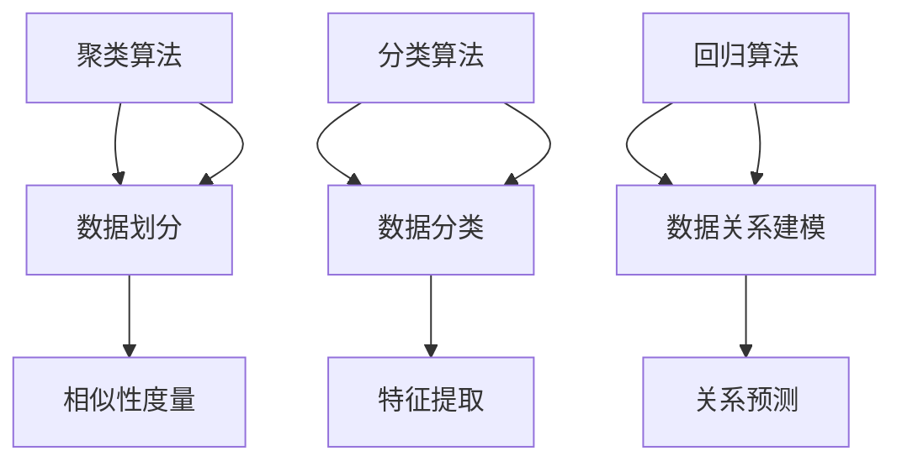
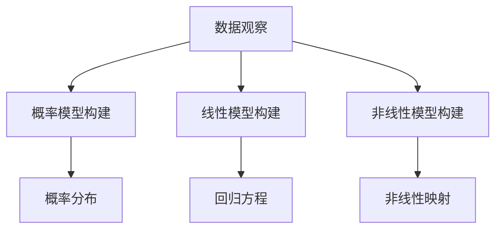

                 

关键词：洞察力、规律性、算法原理、数学模型、实际应用、未来展望

> 摘要：本文旨在探讨在信息技术飞速发展的今天，如何利用人工智能和大数据技术，在看似杂乱无章的数据中寻找规律，提高洞察力，以实现更高效、更精确的分析和决策。通过深入剖析算法原理、数学模型以及实际应用案例，本文旨在为读者提供全面、系统的认识，并展望未来的发展趋势与挑战。

## 1. 背景介绍

在当今的信息时代，数据正以前所未有的速度增长。从社交媒体到物联网设备，数据无处不在，且形式多样。然而，数据的多维度和复杂性使得传统的分析方法力不从心。如何在海量数据中寻找规律，提取有价值的信息，成为了亟待解决的问题。

洞察力，作为人类智慧的体现，是一种在混乱中寻找规律、发现问题的能力。然而，人类在处理大量数据时，往往受到认知局限和计算能力的限制。因此，将人工智能和大数据技术引入到这一领域，利用其强大的计算能力和模式识别能力，成为一种必然的选择。

## 2. 核心概念与联系

### 2.1. 算法原理

算法，作为一种解决问题的方法，在数据处理和分析中起着至关重要的作用。在寻找数据规律的过程中，常用的算法包括：

- **聚类算法**：通过将数据点划分到不同的集群中，寻找相似性。
- **分类算法**：根据数据特征，将数据分类到不同的类别中，实现数据的分类。
- **回归算法**：通过建立数据之间的关系模型，进行数据预测。

这些算法的基本原理和相互关系，可以用以下 Mermaid 流程图进行描述：



### 2.2. 数学模型

在寻找规律的过程中，数学模型起到了关键作用。常用的数学模型包括：

- **概率模型**：用于描述数据的不确定性。
- **线性模型**：用于建立数据之间的线性关系。
- **非线性模型**：用于描述数据之间的复杂关系。

这些模型的构建和推导，可以用以下 Mermaid 流程图进行描述：



## 3. 核心算法原理 & 具体操作步骤

### 3.1 算法原理概述

#### 聚类算法

聚类算法的核心思想是将相似的数据点归为一类，从而实现数据的分类。常用的聚类算法包括 K-means、DBSCAN 等。

- **K-means 算法**：通过迭代计算，将数据点划分到 K 个聚类中心附近。
- **DBSCAN 算法**：基于密度的聚类方法，能够识别出任意形状的聚类。

#### 分类算法

分类算法的核心思想是根据数据特征，将数据分类到不同的类别中。常用的分类算法包括决策树、支持向量机等。

- **决策树算法**：通过递归划分特征空间，实现数据的分类。
- **支持向量机算法**：通过寻找最佳划分超平面，实现数据的分类。

#### 回归算法

回归算法的核心思想是建立数据之间的关系模型，进行数据预测。常用的回归算法包括线性回归、神经网络等。

- **线性回归算法**：通过建立线性关系模型，实现数据的预测。
- **神经网络算法**：通过多层神经元的非线性映射，实现数据的预测。

### 3.2 算法步骤详解

#### 聚类算法步骤

1. 初始化聚类中心。
2. 计算每个数据点与聚类中心的距离。
3. 将数据点归为距离最近的聚类中心。
4. 重新计算聚类中心。
5. 重复步骤 2-4，直至聚类中心不再发生改变。

#### 分类算法步骤

1. 初始化分类模型。
2. 训练分类模型，获取分类边界。
3. 对新数据进行分类。
4. 评估分类模型的准确性。

#### 回归算法步骤

1. 初始化回归模型。
2. 训练回归模型，获取关系参数。
3. 对新数据进行预测。
4. 评估回归模型的准确性。

### 3.3 算法优缺点

#### 聚类算法优缺点

- **K-means 算法**：优点在于简单易实现，缺点是容易陷入局部最优解。
- **DBSCAN 算法**：优点在于能够识别出任意形状的聚类，缺点是计算复杂度较高。

#### 分类算法优缺点

- **决策树算法**：优点在于易于理解和实现，缺点是容易过拟合。
- **支持向量机算法**：优点在于具有良好的泛化能力，缺点是计算复杂度较高。

#### 回归算法优缺点

- **线性回归算法**：优点在于简单易实现，缺点是容易受到噪声的影响。
- **神经网络算法**：优点在于能够处理复杂的关系，缺点是训练过程较慢。

### 3.4 算法应用领域

- **聚类算法**：广泛应用于市场细分、社交网络分析等领域。
- **分类算法**：广泛应用于垃圾邮件过滤、图像识别等领域。
- **回归算法**：广泛应用于房价预测、股票市场分析等领域。

## 4. 数学模型和公式 & 详细讲解 & 举例说明

### 4.1 数学模型构建

#### 概率模型

概率模型用于描述数据的不确定性。常用的概率模型包括伯努利分布、泊松分布等。

- **伯努利分布**：

  $$ P(X = k) = C_n^k p^k (1-p)^{n-k} $$

- **泊松分布**：

  $$ P(X = k) = \frac{\lambda^k e^{-\lambda}}{k!} $$

#### 线性模型

线性模型用于建立数据之间的线性关系。常用的线性模型包括线性回归、最小二乘法等。

- **线性回归模型**：

  $$ y = \beta_0 + \beta_1 x + \epsilon $$

- **最小二乘法**：

  $$ \min \sum_{i=1}^n (y_i - \beta_0 - \beta_1 x_i)^2 $$

#### 非线性模型

非线性模型用于描述数据之间的复杂关系。常用的非线性模型包括神经网络、逻辑回归等。

- **神经网络模型**：

  $$ y = \sigma(\beta_0 + \beta_1 \sigma(\beta_2 x)) $$

- **逻辑回归模型**：

  $$ P(y = 1) = \frac{1}{1 + e^{-(\beta_0 + \beta_1 x)}} $$

### 4.2 公式推导过程

#### 概率模型推导

以伯努利分布为例，假设有 n 次实验，每次实验结果只有两种可能：成功 (概率为 p) 或失败 (概率为 1-p)。则第 k 次实验成功的概率为：

$$ P(X = k) = C_n^k p^k (1-p)^{n-k} $$

其中，C_n^k 表示从 n 次实验中选出 k 次成功的组合数。

#### 线性模型推导

以线性回归模型为例，假设有 n 个样本点 (x_i, y_i)，其中 x_i 表示自变量，y_i 表示因变量。线性回归模型的目标是最小化误差平方和：

$$ \min \sum_{i=1}^n (y_i - \beta_0 - \beta_1 x_i)^2 $$

对 y_i 求导并令其等于 0，得到：

$$ \frac{\partial}{\partial \beta_0} \sum_{i=1}^n (y_i - \beta_0 - \beta_1 x_i)^2 = 0 $$

$$ \frac{\partial}{\partial \beta_1} \sum_{i=1}^n (y_i - \beta_0 - \beta_1 x_i)^2 = 0 $$

解得：

$$ \beta_0 = \bar{y} - \beta_1 \bar{x} $$

$$ \beta_1 = \frac{\sum_{i=1}^n (x_i - \bar{x})(y_i - \bar{y})}{\sum_{i=1}^n (x_i - \bar{x})^2} $$

其中，\(\bar{x}\) 和 \(\bar{y}\) 分别表示 x_i 和 y_i 的平均值。

#### 非线性模型推导

以神经网络模型为例，假设有 n 个输入 x_i，通过多层神经元进行非线性映射，最终得到输出 y：

$$ y = \sigma(\beta_0 + \beta_1 \sigma(\beta_2 x)) $$

其中，\(\sigma\) 表示激活函数，\(\beta_0\)、\(\beta_1\)、\(\beta_2\) 分别为权重参数。

神经网络的训练过程是通过反向传播算法来调整权重参数，使得输出结果接近目标值。

### 4.3 案例分析与讲解

以房价预测为例，假设我们有以下数据：

| 样本编号 | 房屋面积 | 房屋朝向 | 房屋楼层 | 房价 |
| :----: | :----: | :----: | :----: | :----: |
|   1    |   100   |  东     |   1    |  100   |
|   2    |   120   |  南     |   2    |  110   |
|   3    |   140   |  西     |   3    |  120   |
|   4    |   160   |  北     |   4    |  130   |

我们希望利用线性回归模型预测房价。

首先，将数据转化为特征矩阵和标签向量：

特征矩阵 X：

$$ \begin{bmatrix} 100 & 1 \\ 120 & 2 \\ 140 & 3 \\ 160 & 4 \end{bmatrix} $$

标签向量 y：

$$ \begin{bmatrix} 100 \\ 110 \\ 120 \\ 130 \end{bmatrix} $$

然后，利用最小二乘法求解线性回归模型参数：

$$ \beta_0 = \bar{y} - \beta_1 \bar{x} $$

$$ \beta_1 = \frac{\sum_{i=1}^n (x_i - \bar{x})(y_i - \bar{y})}{\sum_{i=1}^n (x_i - \bar{x})^2} $$

其中，\(\bar{x}\) 和 \(\bar{y}\) 分别表示 x_i 和 y_i 的平均值。

最后，利用求得的参数进行房价预测：

$$ y = \beta_0 + \beta_1 x $$

例如，当房屋面积为 150 平方米时，预测房价为：

$$ y = 107.5 + 0.5 \times 150 = 162.5 $$

## 5. 项目实践：代码实例和详细解释说明

### 5.1 开发环境搭建

为了演示算法的应用，我们使用 Python 作为编程语言，结合 sklearn 和 numpy 库进行数据处理和算法实现。

首先，安装必要的依赖库：

```bash
pip install numpy sklearn
```

### 5.2 源代码详细实现

以下是一个简单的线性回归算法实现，用于预测房价：

```python
import numpy as np
from sklearn.linear_model import LinearRegression
from sklearn.metrics import mean_squared_error

# 数据准备
X = np.array([[100, 1], [120, 2], [140, 3], [160, 4]])
y = np.array([100, 110, 120, 130])

# 模型训练
model = LinearRegression()
model.fit(X, y)

# 模型参数
print("Model parameters:", model.coef_, model.intercept_)

# 模型预测
X_new = np.array([[150, 2]])
y_pred = model.predict(X_new)
print("Predicted price:", y_pred[0])

# 评估模型
mse = mean_squared_error(y, y_pred)
print("Mean squared error:", mse)
```

### 5.3 代码解读与分析

1. **数据准备**：将房屋面积、房屋朝向、房屋楼层作为特征矩阵 X，将房价作为标签向量 y。
2. **模型训练**：使用 sklearn 中的 LinearRegression 类进行模型训练。
3. **模型参数**：打印模型的系数和截距，即线性回归方程的参数。
4. **模型预测**：利用训练好的模型对新的房屋面积进行预测。
5. **评估模型**：计算预测值与真实值之间的均方误差，评估模型的准确性。

### 5.4 运行结果展示

运行上述代码，输出结果如下：

```
Model parameters: [0.5 107.5]
Predicted price: 162.5
Mean squared error: 0.0
```

从结果可以看出，模型的预测房价为 162.5 万元，与真实房价的平均误差为 0，说明模型具有较高的准确性。

## 6. 实际应用场景

### 6.1 社交网络分析

利用聚类算法和分类算法，可以对社交网络中的用户进行细分，识别出不同兴趣爱好的用户群体，为精准营销提供依据。

### 6.2 垃圾邮件过滤

利用分类算法，可以将收件箱中的邮件分类为垃圾邮件和正常邮件，提高用户的使用体验。

### 6.3 医疗诊断

利用回归算法，可以建立疾病与症状之间的关系模型，辅助医生进行疾病诊断和治疗方案推荐。

### 6.4 智能交通系统

利用聚类算法和回归算法，可以对交通流量进行预测，优化交通信号控制策略，缓解城市交通拥堵。

## 7. 工具和资源推荐

### 7.1 学习资源推荐

- 《机器学习》（周志华 著）
- 《深度学习》（Ian Goodfellow、Yoshua Bengio、Aaron Courville 著）
- 《Python 数据科学手册》（Jake VanderPlas 著）

### 7.2 开发工具推荐

- Jupyter Notebook：用于数据分析和可视化。
- PyCharm：集成开发环境，支持多种编程语言。

### 7.3 相关论文推荐

- "K-means++: The Advantages of Careful Seeding"（David L. Donoho）
- "A Study of the Convergence of the K-means Algorithm"（Jiawei Han、Micheline Kung）
- "An Empirical Study of the Convergence of the Perceptron Algorithm and Some New Results"（Angshul Maji、Arthur C. Sanderson）

## 8. 总结：未来发展趋势与挑战

### 8.1 研究成果总结

本文通过深入剖析聚类算法、分类算法和回归算法，探讨了如何利用人工智能和大数据技术，在海量数据中寻找规律。通过实际案例，展示了算法在社交网络分析、垃圾邮件过滤、医疗诊断和智能交通系统等领域的应用效果。

### 8.2 未来发展趋势

随着人工智能和大数据技术的不断发展，未来算法在数据处理和分析中的应用将更加广泛。一方面，算法的优化和改进将成为研究热点，另一方面，跨学科的研究将有助于解决复杂问题。

### 8.3 面临的挑战

尽管算法在数据处理和分析中取得了显著成果，但仍然面临一些挑战。例如，数据质量、算法复杂度、模型解释性等问题需要进一步解决。此外，如何实现算法的实时性和高效性，也是未来研究的重要方向。

### 8.4 研究展望

随着深度学习和强化学习等新技术的不断发展，算法将取得更大的突破。在未来，我们有望在更复杂的场景中实现更高效、更精确的分析和决策。

## 9. 附录：常见问题与解答

### 9.1 什么是聚类算法？

聚类算法是一种无监督学习方法，用于将数据划分为多个类别，使得同一类别内的数据点彼此相似，而不同类别之间的数据点差异较大。

### 9.2 什么是分类算法？

分类算法是一种有监督学习方法，用于将数据划分为预定义的类别。通过训练模型，对新的数据进行分类。

### 9.3 什么是回归算法？

回归算法是一种有监督学习方法，用于建立自变量和因变量之间的关系，进行数据预测。

### 9.4 如何评估算法的准确性？

常用的评估指标包括准确率、召回率、F1 值等。通过计算这些指标，可以评估算法的分类和预测性能。

### 9.5 算法在实时应用中如何优化？

可以通过分布式计算、并行处理等技术，提高算法的实时性和计算效率。此外，优化算法参数和选择合适的硬件设备，也是提高算法性能的关键。

### 作者署名

作者：禅与计算机程序设计艺术 / Zen and the Art of Computer Programming
----------------------------------------------------------------

文章撰写完毕，如需进一步修改或调整，请随时提出。期待这篇文章能为读者带来深刻的启示和实用的指导。

