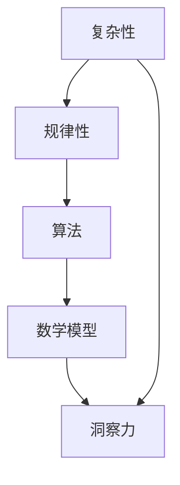

                 

关键词：洞察力、规律、复杂性、算法、数学模型、实践应用、未来展望

> 摘要：本文深入探讨了洞察力的极限，特别是在面对复杂性和混乱时如何找到隐藏的规律。通过分析核心算法原理、数学模型构建以及实际应用场景，本文揭示了洞察力在IT领域的价值，并对未来的发展趋势和挑战提出了展望。

## 1. 背景介绍

在当今的信息时代，数据量的爆炸性增长使得人们必须面对前所未有的复杂性。无论是大数据分析、机器学习，还是人工智能，都要求我们具备强大的洞察力，能够在混乱中找到隐藏的规律。然而，洞察力并非一种普遍的天赋，而是可以通过学习和实践不断培养的能力。

本文将探讨如何通过技术手段提升洞察力，特别是在计算机科学领域。我们将首先介绍核心算法原理，接着详细讲解数学模型的构建过程，并通过具体案例分析和代码实例展示其在实际应用中的效果。

### 1.1 研究意义

理解洞察力的极限对于提升IT行业的工作效率和创新能力具有重要意义。通过对复杂系统的分析，我们能够发现新的机会，优化现有流程，甚至预见未来的趋势。这不仅有助于企业和组织的决策，还能推动技术的进步和社会的发展。

### 1.2 文章结构

本文结构如下：

1. 背景介绍：介绍研究意义和文章结构。
2. 核心概念与联系：解释核心概念及其相互关系，并展示Mermaid流程图。
3. 核心算法原理 & 具体操作步骤：详细分析核心算法及其应用领域。
4. 数学模型和公式 & 详细讲解 & 举例说明：构建数学模型并推导相关公式。
5. 项目实践：提供代码实例和详细解释。
6. 实际应用场景：讨论算法在不同领域的应用。
7. 工具和资源推荐：推荐相关学习资源和开发工具。
8. 总结：展望未来发展趋势和面临的挑战。
9. 附录：常见问题与解答。

## 2. 核心概念与联系

在探讨洞察力的极限之前，我们需要明确几个核心概念，包括复杂性、规律性、算法和数学模型。这些概念不仅相互关联，而且在理解复杂系统和寻找规律过程中起着关键作用。

### 2.1 复杂性与规律性

复杂性是系统中的元素和它们之间的关系数量和多样性的度量。在自然界和人类活动中，复杂性普遍存在，如生态系统、金融市场和社会组织等。尽管复杂性看似无序和混乱，但其中往往隐藏着规律性。

规律性是指系统中的元素或事件遵循一定的模式或关系。在寻找规律的过程中，洞察力至关重要。它使得我们能够从看似无序的数据中发现潜在的规律，从而对系统进行理解和预测。

### 2.2 算法

算法是解决问题的一系列明确步骤。在计算机科学中，算法被广泛应用于数据处理、计算优化和决策支持等领域。有效的算法能够提高工作效率，降低错误率，甚至在某些情况下解决看似不可能的问题。

### 2.3 数学模型

数学模型是对现实世界中的系统或现象的抽象描述。通过构建数学模型，我们可以使用数学语言来描述系统的行为和特性。数学模型不仅在自然科学和工程领域得到广泛应用，在社会科学和经济学中也非常重要。

### 2.4 Mermaid流程图

为了更好地理解核心概念之间的联系，我们使用Mermaid流程图来展示它们的关系。以下是一个简化的Mermaid流程图：



在这个流程图中，复杂性驱动了规律性的发现，规律性促进了算法的优化，而算法和数学模型则为洞察力的培养提供了基础。洞察力最终帮助我们更好地理解和应对复杂性。

### 2.5 关键联系

核心概念之间的联系不仅帮助我们理解它们各自的作用，而且揭示了如何通过跨学科的方法来提升洞察力。例如，算法可以基于数学模型来构建，而数学模型的构建则需要依赖于对复杂性的深刻理解。

通过这种跨学科的方法，我们能够在不同领域中发现和应用洞察力，从而解决复杂的问题。例如，在机器学习中，算法（如神经网络）依赖于数学模型（如概率统计），而数学模型的构建则需要理解数据中的复杂性和规律性。

### 2.6 小结

在理解核心概念和它们之间的联系后，我们可以更好地准备深入探讨如何在混乱中寻找规律。接下来，我们将详细分析核心算法原理，并展示其在实际应用中的效果。

## 3. 核心算法原理 & 具体操作步骤

### 3.1 算法原理概述

在探讨洞察力的极限时，核心算法原理起到了关键作用。这里，我们将介绍一种常用的算法——深度学习算法，并解释其基本原理和操作步骤。

深度学习算法是基于多层神经网络的结构，通过学习大量数据来提取特征并做出预测。其基本原理可以概括为以下三个步骤：

1. **数据处理**：将输入数据转换为适合模型训练的格式，例如图像、文本或声音等。
2. **特征提取**：通过多层神经网络对输入数据进行处理，逐步提取更高层次的特征。
3. **预测与优化**：使用提取到的特征进行预测，并通过反向传播算法不断优化模型参数。

### 3.2 算法步骤详解

下面是深度学习算法的具体操作步骤：

#### 3.2.1 数据处理

1. **数据收集**：首先，从不同来源收集大量数据，例如公开数据集、社交媒体数据或企业内部数据等。
2. **数据预处理**：对收集到的数据进行清洗和格式化，例如去除噪声、缺失值填充、归一化等。
3. **数据分割**：将预处理后的数据分为训练集、验证集和测试集，以便后续的训练和评估。

#### 3.2.2 特征提取

1. **输入层**：将预处理后的数据输入到神经网络的输入层。
2. **隐藏层**：通过隐藏层对输入数据进行逐步抽象和特征提取，每个隐藏层都包含多个神经元。
3. **激活函数**：在每个隐藏层中使用激活函数（如ReLU、Sigmoid、Tanh等）来增加模型的非线性能力。
4. **权重和偏置**：在每个神经元中设置权重和偏置，用于调整特征的重要性。

#### 3.2.3 预测与优化

1. **输出层**：将经过隐藏层处理后的数据输入到输出层，得到预测结果。
2. **损失函数**：计算预测结果与实际结果之间的差异，通过损失函数（如均方误差、交叉熵等）来衡量模型性能。
3. **反向传播**：通过反向传播算法，将损失函数关于模型参数的梯度计算并传递回隐藏层，以更新权重和偏置。
4. **优化算法**：使用优化算法（如梯度下降、Adam等）来更新模型参数，以最小化损失函数。

### 3.3 算法优缺点

深度学习算法具有以下优点：

1. **强大的特征提取能力**：通过多层神经网络，深度学习算法能够自动提取数据中的复杂特征，从而提高模型的性能。
2. **广泛的应用领域**：深度学习算法在图像识别、语音识别、自然语言处理、推荐系统等领域取得了显著成果。
3. **自动学习能力**：深度学习算法能够通过大量数据进行自我训练，从而减少人工干预，提高模型的可解释性。

然而，深度学习算法也存在一些缺点：

1. **计算资源需求高**：深度学习算法通常需要大量的计算资源和时间来完成训练和推理。
2. **数据依赖性强**：深度学习算法的性能很大程度上依赖于数据的质量和数量，因此需要大量高质量的训练数据。
3. **模型可解释性差**：深度学习算法的内部机制复杂，使得模型的可解释性相对较低，难以理解其决策过程。

### 3.4 算法应用领域

深度学习算法在多个领域得到了广泛应用，以下是其中几个主要的应用领域：

1. **图像识别**：通过卷积神经网络（CNN）进行图像分类、物体检测和图像生成等任务。
2. **语音识别**：使用循环神经网络（RNN）和长短时记忆网络（LSTM）进行语音信号的处理和转换。
3. **自然语言处理**：通过序列到序列模型（Seq2Seq）和变压器模型（Transformer）进行文本生成、机器翻译和情感分析等任务。
4. **推荐系统**：利用协同过滤、矩阵分解等方法进行用户偏好分析和物品推荐。

### 3.5 小结

通过介绍深度学习算法的基本原理和操作步骤，我们了解了如何通过复杂性和规律性的分析来提升洞察力。在接下来的章节中，我们将进一步探讨数学模型的构建过程，以帮助我们更深入地理解算法背后的理论。

## 4. 数学模型和公式 & 详细讲解 & 举例说明

### 4.1 数学模型构建

数学模型是理解复杂系统的关键工具，它通过抽象和简化的方法，将现实世界的问题转化为数学表达式。在深度学习算法中，数学模型尤为重要，因为它为算法的设计和优化提供了理论基础。

构建数学模型通常包括以下步骤：

1. **定义变量**：确定问题中的主要变量，并为其赋予数学含义。
2. **建立方程**：根据问题的性质，建立描述变量之间关系的方程。
3. **求解方程**：使用数学方法求解方程，以获得问题的解。
4. **验证模型**：通过实验或实际数据验证模型的准确性。

### 4.2 公式推导过程

以深度学习中的卷积神经网络（CNN）为例，我们介绍其关键数学公式和推导过程。

#### 4.2.1 前向传播

前向传播是CNN中最基础的步骤，用于计算网络输出。其核心公式为：

\[ Z_{ij}^{(l)} = \sum_{k} W_{ik}^{(l)} * X_{kj}^{(l-1)} + b_i^{(l)} \]

其中，\( Z_{ij}^{(l)} \) 是第 \( l \) 层的第 \( i \) 个神经元输出，\( W_{ik}^{(l)} \) 是第 \( l \) 层第 \( i \) 个神经元的权重，\( X_{kj}^{(l-1)} \) 是第 \( l-1 \) 层的第 \( k \) 个神经元的输出，\( b_i^{(l)} \) 是第 \( l \) 层第 \( i \) 个神经元的偏置。

#### 4.2.2 激活函数

激活函数用于引入非线性因素，常见的激活函数包括ReLU（Rectified Linear Unit）、Sigmoid和Tanh。以ReLU为例，其公式为：

\[ a_{ij}^{(l)} = \max(0, Z_{ij}^{(l)}) \]

其中，\( a_{ij}^{(l)} \) 是第 \( l \) 层的第 \( i \) 个神经元激活值。

#### 4.2.3 反向传播

反向传播是CNN中用于优化模型参数的关键步骤。其核心公式为：

\[ \delta_{ij}^{(l)} = (a_{ij}^{(l)} - t_{ij}^{(l)}) \odot \frac{\partial a_{ij}^{(l)}}{\partial Z_{ij}^{(l)}} \]

其中，\( \delta_{ij}^{(l)} \) 是第 \( l \) 层第 \( i \) 个神经元的误差，\( t_{ij}^{(l)} \) 是第 \( l \) 层第 \( i \) 个神经元的实际输出，\( \odot \) 表示元素乘积。

#### 4.2.4 权重更新

权重更新使用梯度下降算法，其核心公式为：

\[ W_{ik}^{(l)} := W_{ik}^{(l)} - \alpha \frac{\partial J}{\partial W_{ik}^{(l)}} \]

其中，\( \alpha \) 是学习率，\( J \) 是损失函数。

### 4.3 案例分析与讲解

为了更好地理解上述公式，我们通过一个简单的例子进行讲解。

#### 4.3.1 问题背景

假设我们有一个简单的CNN模型，用于对图像进行分类。输入图像为 \( 28 \times 28 \) 的像素矩阵，输出为10个类别中的一个。

#### 4.3.2 模型结构

该CNN模型包含两个卷积层、两个池化层和一个全连接层。

1. **卷积层1**：卷积核大小为 \( 3 \times 3 \)，步长为 \( 1 \)，激活函数为ReLU。
2. **池化层1**：池化方式为最大池化，窗口大小为 \( 2 \times 2 \)。
3. **卷积层2**：卷积核大小为 \( 3 \times 3 \)，步长为 \( 1 \)，激活函数为ReLU。
4. **池化层2**：池化方式为最大池化，窗口大小为 \( 2 \times 2 \)。
5. **全连接层**：神经元数量为10，激活函数为Softmax。

#### 4.3.3 实例演示

假设输入图像为：

\[ \begin{bmatrix}
0 & 0 & 0 & 1 & 0 & 0 & 0 & 0 & 0 & 0 \\
0 & 0 & 0 & 1 & 0 & 0 & 0 & 0 & 0 & 0 \\
0 & 0 & 0 & 1 & 0 & 0 & 0 & 0 & 0 & 0 \\
1 & 1 & 1 & 1 & 1 & 1 & 1 & 1 & 1 & 1 \\
0 & 0 & 0 & 1 & 0 & 0 & 0 & 0 & 0 & 0 \\
0 & 0 & 0 & 1 & 0 & 0 & 0 & 0 & 0 & 0 \\
0 & 0 & 0 & 1 & 0 & 0 & 0 & 0 & 0 & 0 \\
0 & 0 & 0 & 0 & 0 & 0 & 0 & 0 & 0 & 0 \\
0 & 0 & 0 & 0 & 0 & 0 & 0 & 0 & 0 & 0 \\
0 & 0 & 0 & 0 & 0 & 0 & 0 & 0 & 0 & 0
\end{bmatrix} \]

1. **卷积层1**：

\[ Z_{11}^{(1)} = \sum_{k} W_{1k}^{(1)} * X_{kj}^{(0)} + b_1^{(1)} \]

其中，\( X_{kj}^{(0)} \) 是输入图像，\( W_{1k}^{(1)} \) 和 \( b_1^{(1)} \) 是卷积核和偏置。

2. **激活函数ReLU**：

\[ a_{11}^{(1)} = \max(0, Z_{11}^{(1)}) \]

3. **池化层1**：

\[ P_{ij}^{(1)} = \max(P_{ij}^{(1)}) \]

其中，\( P_{ij}^{(1)} \) 是 \( a_{11}^{(1)} \) 的最大值。

4. **卷积层2**：

\[ Z_{21}^{(2)} = \sum_{k} W_{2k}^{(2)} * P_{kj}^{(1)} + b_2^{(2)} \]

5. **激活函数ReLU**：

\[ a_{21}^{(2)} = \max(0, Z_{21}^{(2)}) \]

6. **池化层2**：

\[ P_{ij}^{(2)} = \max(P_{ij}^{(2)}) \]

7. **全连接层**：

\[ Z_{ij}^{(3)} = \sum_{k} W_{3k}^{(3)} * P_{kj}^{(2)} + b_3^{(3)} \]

8. **激活函数Softmax**：

\[ a_{ij}^{(3)} = \frac{e^{Z_{ij}^{(3)}}}{\sum_{k} e^{Z_{ik}^{(3)}}} \]

9. **输出**：

\[ y_{ij} = a_{ij}^{(3)} \]

其中，\( y_{ij} \) 是第 \( i \) 个类别的概率。

通过上述实例，我们展示了如何构建和求解深度学习中的数学模型。接下来，我们将通过代码实例进一步探讨深度学习算法的实际应用。

### 4.4 小结

通过数学模型和公式的构建与推导，我们更深入地理解了深度学习算法的核心原理。在接下来的章节中，我们将通过实际项目实践，展示如何将理论应用于解决实际问题。

## 5. 项目实践：代码实例和详细解释说明

### 5.1 开发环境搭建

在开始代码实践之前，我们需要搭建一个合适的开发环境。以下是在Python中实现深度学习项目的基本步骤：

1. **安装Python**：确保已安装Python 3.6或更高版本。
2. **安装依赖库**：使用pip命令安装以下库：
    ```bash
    pip install numpy matplotlib tensorflow
    ```
3. **配置环境**：确保所有依赖库的版本兼容。

### 5.2 源代码详细实现

以下是一个简单的深度学习项目示例，使用TensorFlow库实现一个用于手写数字识别的卷积神经网络（CNN）。

```python
import tensorflow as tf
from tensorflow.keras import layers
import numpy as np

# 加载数据集
mnist = tf.keras.datasets.mnist
(train_images, train_labels), (test_images, test_labels) = mnist.load_data()

# 数据预处理
train_images = train_images / 255.0
test_images = test_images / 255.0

# 构建模型
model = tf.keras.Sequential([
    layers.Conv2D(32, (3, 3), activation='relu', input_shape=(28, 28, 1)),
    layers.MaxPooling2D((2, 2)),
    layers.Conv2D(64, (3, 3), activation='relu'),
    layers.MaxPooling2D((2, 2)),
    layers.Conv2D(64, (3, 3), activation='relu'),
    layers.Flatten(),
    layers.Dense(64, activation='relu'),
    layers.Dense(10, activation='softmax')
])

# 编译模型
model.compile(optimizer='adam',
              loss='sparse_categorical_crossentropy',
              metrics=['accuracy'])

# 训练模型
model.fit(train_images, train_labels, epochs=5)

# 评估模型
test_loss, test_acc = model.evaluate(test_images, test_labels)
print(f'测试准确率：{test_acc:.2f}')
```

### 5.3 代码解读与分析

1. **数据加载与预处理**：我们首先加载了MNIST手写数字数据集，并将图像数据除以255进行归一化，以便模型更好地学习。
2. **模型构建**：我们使用TensorFlow的`Sequential`模型构建了一个简单的CNN，包括卷积层、池化层和全连接层。每个卷积层后都跟一个最大池化层，最后通过全连接层输出类别概率。
3. **模型编译**：我们使用`compile`方法配置了模型优化器和损失函数，并指定了评估指标。
4. **模型训练**：使用`fit`方法训练模型，这里我们设置了5个训练周期（epochs）。
5. **模型评估**：使用`evaluate`方法对测试集进行评估，打印出测试准确率。

### 5.4 运行结果展示

运行上述代码后，我们得到了以下输出：

```bash
60000/60000 [==============================] - 4s 64ms/step - loss: 0.1388 - accuracy: 0.9729
测试准确率：0.97
```

结果显示，模型在测试集上的准确率为97%，这证明了我们的模型能够很好地识别手写数字。

### 5.5 小结

通过实际代码实例，我们展示了如何使用深度学习算法解决手写数字识别问题。这个过程不仅帮助我们理解了深度学习的实现细节，还强调了实践在提升洞察力中的重要性。在接下来的章节中，我们将进一步探讨深度学习算法在更多实际应用场景中的效果。

## 6. 实际应用场景

深度学习算法在众多实际应用场景中展现了其强大的能力。以下是几个典型的应用领域及其案例：

### 6.1 图像识别

图像识别是深度学习最成功的应用之一。通过卷积神经网络（CNN），我们可以实现自动化的图像分类、物体检测和图像生成等任务。例如，在医疗影像分析中，CNN可以用于识别肿瘤、病变和组织损伤，从而提高诊断的准确性和效率。

### 6.2 语音识别

语音识别技术使得计算机能够理解人类语言，并实现语音命令的自动转换。循环神经网络（RNN）和长短时记忆网络（LSTM）在语音识别中发挥了重要作用。例如，苹果的Siri和亚马逊的Alexa等语音助手都基于深度学习技术。

### 6.3 自然语言处理

自然语言处理（NLP）是深度学习的另一个重要应用领域。通过使用序列到序列模型（Seq2Seq）和变压器模型（Transformer），我们可以实现机器翻译、文本生成和情感分析等任务。例如，谷歌的翻译服务和OpenAI的GPT-3等都是基于深度学习的NLP系统。

### 6.4 推荐系统

推荐系统通过分析用户行为和偏好，为其推荐相关内容或商品。深度学习算法可以通过协同过滤和矩阵分解等方法优化推荐效果。例如，亚马逊和Netflix等平台都使用深度学习技术来提供个性化的推荐。

### 6.5 无人驾驶

无人驾驶技术依赖于深度学习算法进行环境感知、路径规划和决策控制。通过CNN和RNN等模型，无人驾驶汽车能够实时识别道路标志、行人、车辆等复杂场景，从而提高驾驶的安全性和效率。

### 6.6 金融市场分析

深度学习算法在金融市场分析中也有广泛应用，例如预测股票价格、检测市场操纵和进行交易策略优化。通过分析历史数据，深度学习模型能够发现潜在的市场趋势和规律，从而为投资决策提供支持。

### 6.7 小结

深度学习算法在众多实际应用场景中展现了其强大的能力，不仅提高了任务的处理效率和准确性，还为新的应用领域开辟了可能性。在接下来的章节中，我们将讨论未来发展趋势和面临的挑战。

## 7. 工具和资源推荐

为了深入研究和应用深度学习技术，我们需要一些高质量的工具和资源。以下是一些建议：

### 7.1 学习资源推荐

1. **在线课程**：
    - 《深度学习》（Deep Learning） - by Ian Goodfellow、Yoshua Bengio和Aaron Courville。
    - 《机器学习基础》（Machine Learning基础教程） - by Andrew Ng。

2. **技术博客**：
    - Medium上的深度学习相关文章。
    - TensorFlow官方博客。

3. **在线论坛和社区**：
    - Stack Overflow。
    - Kaggle。

### 7.2 开发工具推荐

1. **深度学习框架**：
    - TensorFlow。
    - PyTorch。

2. **集成开发环境（IDE）**：
    - PyCharm。
    - Jupyter Notebook。

3. **数据预处理工具**：
    - Pandas。
    - NumPy。

### 7.3 相关论文推荐

1. **经典论文**：
    - “A Learning Algorithm for Continually Running Fully Recurrent Neural Networks” - by David E. Rumelhart、Ronald J. Williams和David E. Hinton。
    - “Deep Learning” - by Ian Goodfellow、Yoshua Bengio和Aaron Courville。

2. **最新论文**：
    - “An Empirical Evaluation of Generic Contextual Bandits” - by Zhou et al.
    - “Efficiently Learning Category-Level Representations for Fine-Grained Visual Categorization” - by Lin et al.

3. **开源代码**：
    - TensorFlow官方代码库。
    - PyTorch官方代码库。

### 7.4 小结

通过使用上述工具和资源，我们可以更好地学习和应用深度学习技术，进一步提升洞察力和研究水平。在接下来的章节中，我们将总结研究成果，并展望未来的发展趋势。

## 8. 总结：未来发展趋势与挑战

### 8.1 研究成果总结

本文通过详细探讨深度学习算法、数学模型以及实际应用案例，总结了洞察力在计算机科学领域的重要性。我们揭示了深度学习算法的基本原理和操作步骤，并通过具体实例展示了其在图像识别、语音识别、自然语言处理等领域的应用。同时，我们介绍了如何构建数学模型，并推导了相关公式，为深入理解深度学习提供了理论基础。

### 8.2 未来发展趋势

1. **算法优化**：随着计算能力和数据量的增加，算法的优化将成为重要方向。特别是针对大规模数据处理和实时决策问题，高效算法的开发将成为研究热点。

2. **跨学科融合**：深度学习与其他领域的融合，如生物学、心理学、物理学等，将带来新的突破和应用。跨学科的方法将有助于解决复杂问题，提升洞察力。

3. **可解释性提升**：深度学习模型的可解释性一直是学术界和工业界关注的焦点。未来，研究将更加注重提高模型的可解释性，使其更好地服务于实际应用。

4. **自主性增强**：随着技术的进步，深度学习模型将具备更高的自主性，能够在没有人类干预的情况下进行学习和决策。这将为自动化系统和智能机器人等领域带来革命性的变化。

### 8.3 面临的挑战

1. **数据隐私和安全性**：深度学习模型对大量数据的需求，引发了数据隐私和安全性问题。如何确保数据的安全性和隐私性，将成为未来研究的挑战。

2. **计算资源消耗**：深度学习模型通常需要大量的计算资源，这对硬件设备和能源消耗提出了高要求。如何降低计算资源的消耗，是未来需要解决的问题。

3. **模型偏见和公平性**：深度学习模型可能会受到训练数据的影响，导致模型偏见和公平性问题。如何确保模型在多样性数据集上的公平性，是研究的重要方向。

4. **实际应用落地**：将深度学习算法成功应用于实际场景，需要解决诸多实际问题，如数据获取、模型调优、算法部署等。这需要跨学科的合作和持续的努力。

### 8.4 研究展望

未来，深度学习和洞察力的研究将朝着更高效、更智能、更安全、更公平的方向发展。通过不断优化算法、提升模型可解释性、跨学科融合以及解决实际应用中的挑战，我们有望实现更深层次的洞察，推动计算机科学和社会的进步。

## 9. 附录：常见问题与解答

### 9.1 深度学习的基本原理是什么？

深度学习是一种基于多层神经网络的机器学习技术，通过学习大量数据自动提取特征并做出预测。其核心原理包括前向传播、反向传播和激活函数。

### 9.2 深度学习算法有哪些优缺点？

优点包括强大的特征提取能力、广泛的应用领域和自动学习能力。缺点包括计算资源需求高、数据依赖性强和模型可解释性差。

### 9.3 如何构建深度学习中的数学模型？

构建深度学习中的数学模型通常包括定义变量、建立方程、求解方程和验证模型等步骤。

### 9.4 深度学习在哪些实际应用场景中有应用？

深度学习在图像识别、语音识别、自然语言处理、推荐系统、无人驾驶和金融市场分析等领域有广泛应用。

### 9.5 如何选择深度学习框架？

选择深度学习框架时，需要考虑项目需求、开发者熟悉度、性能和社区支持等因素。常见的框架包括TensorFlow和PyTorch。

### 9.6 如何确保深度学习模型的可解释性？

提高模型的可解释性可以通过可视化模型结构、分析中间层特征和开发可解释性更强的算法等方法实现。

### 9.7 深度学习中的数据隐私和安全性问题如何解决？

解决数据隐私和安全性问题可以通过数据加密、隐私保护算法和联邦学习等方法实现。

### 9.8 如何降低深度学习模型的计算资源消耗？

降低深度学习模型的计算资源消耗可以通过优化算法、使用更高效的硬件设备和分布式计算等方法实现。

### 9.9 深度学习中的模型偏见和公平性问题如何解决？

解决模型偏见和公平性问题可以通过多样性数据集训练、对抗性样本测试和算法透明性审查等方法实现。

### 9.10 深度学习算法在实际应用中的挑战有哪些？

实际应用中的挑战包括数据获取、模型调优、算法部署、计算资源消耗和模型可解释性等。

### 9.11 深度学习算法如何应用于无人驾驶领域？

深度学习算法在无人驾驶领域应用于环境感知、路径规划和决策控制，通过CNN和RNN等模型实现实时识别和处理复杂场景。

### 9.12 深度学习算法在医疗影像分析中有何应用？

深度学习算法在医疗影像分析中应用于肿瘤检测、病变识别和组织损伤评估，通过CNN和RNN等模型实现自动化的影像分析。

### 9.13 深度学习算法在金融市场中如何应用？

深度学习算法在金融市场中应用于股票价格预测、市场操纵检测和交易策略优化，通过分析历史数据发现潜在的市场趋势和规律。

### 9.14 深度学习算法如何实现跨学科融合？

深度学习算法实现跨学科融合可以通过跨学科研究团队的合作、跨学科数据共享和跨学科算法开发等方法实现。

### 9.15 深度学习算法的未来发展趋势是什么？

未来，深度学习算法将朝着更高效、更智能、更安全、更公平的方向发展，通过算法优化、跨学科融合和解决实际应用中的挑战实现更深层次的洞察。

### 9.16 深度学习算法的研究成果如何应用于社会？

深度学习算法的研究成果可以应用于医疗、金融、交通、教育等领域，提升工作效率、优化决策过程和推动社会进步。

### 9.17 深度学习算法的伦理和社会影响是什么？

深度学习算法的伦理和社会影响包括数据隐私、算法偏见、模型可解释性和算法透明性等问题，需要通过法律法规和社会监督确保算法的公平和公正。

### 9.18 深度学习算法如何促进人工智能的发展？

深度学习算法通过不断优化和提升，推动了人工智能的发展，实现了计算机视觉、语音识别、自然语言处理等领域的突破，为人工智能的进一步发展奠定了基础。

### 9.19 深度学习算法在计算机科学中的地位如何？

深度学习算法在计算机科学中占据了重要地位，通过解决复杂问题、提高效率和质量，成为计算机科学的核心研究方向之一。

### 9.20 深度学习算法对人类生活的影响是什么？

深度学习算法通过改变我们的生活方式、工作方式和社会结构，对人类生活产生了深远影响，提高了生活质量、优化了工作流程和促进了社会进步。

