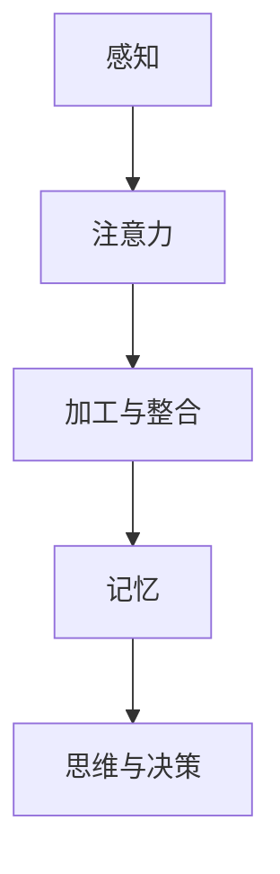

                 

关键词：神经科学、认知、洞察力、神经可塑性、神经网络、信息处理

> 摘要：本文将探讨神经科学的奥秘，特别是洞察力的神经基础。通过介绍神经科学的基本概念、神经网络的运作原理以及神经可塑性，我们将深入理解如何通过认知过程来培养和提高洞察力。此外，本文还将探讨当前领域的研究进展、应用前景以及未来发展趋势。

## 1. 背景介绍

### 神经科学的历史与发展

神经科学作为一门交叉学科，起源于20世纪中叶。在过去的几十年里，神经科学的快速发展使得我们对大脑和神经系统有了更深入的理解。从20世纪50年代起，随着电子显微镜和分子生物学的进步，科学家们开始揭示神经系统的精细结构。随后，计算机科学和信息技术的发展也为神经科学研究提供了强大的工具和平台。

### 认知科学与洞察力的关系

认知科学是一门研究人类认知过程的学科，包括感知、记忆、思维和语言等方面。而洞察力作为认知过程的一部分，是指个体对复杂问题或情境的理解和洞察。近年来，神经科学和认知科学的研究成果为我们理解洞察力的本质和培养方法提供了重要的启示。

## 2. 核心概念与联系

### 神经元与神经网络

神经元是神经系统的基本单元，负责接收和传递电信号。神经网络则是由大量神经元通过突触连接而成的复杂网络结构。神经网络可以分为两类：人工神经网络和生物神经网络。人工神经网络是模拟生物神经网络原理设计的计算机算法，而生物神经网络则是自然界中的神经系统。

### 神经可塑性

神经可塑性是指神经系统在结构和功能上发生改变的能力。这种改变可以是由于经验学习引起，也可以是基因表达调控的结果。神经可塑性是大脑适应环境、学习和记忆的重要基础。

### 信息处理与认知

信息处理是神经科学和认知科学的核心问题。大脑通过感知、加工和存储信息来实现对世界的理解和互动。这个过程涉及到多个认知领域，如感知、注意力、记忆和思维等。

### Mermaid 流程图

下面是一个简化的神经信息处理流程的 Mermaid 流程图：



## 3. 核心算法原理 & 具体操作步骤

### 3.1 算法原理概述

神经信息处理算法是基于神经科学原理设计的，旨在模拟大脑的信息处理过程。这些算法通常采用神经网络作为基础架构，通过训练来学习复杂的信息处理任务。

### 3.2 算法步骤详解

1. **数据收集与预处理**：收集实验数据，并进行预处理，如数据清洗、归一化和特征提取。
2. **神经网络设计**：根据任务需求设计神经网络结构，包括输入层、隐藏层和输出层。
3. **训练与优化**：使用训练数据对神经网络进行训练，通过调整权重和偏置来优化网络性能。
4. **测试与评估**：使用测试数据对训练好的神经网络进行评估，以验证其在实际任务中的性能。

### 3.3 算法优缺点

**优点**：
- **高效性**：神经网络可以处理大量数据，并快速学习复杂的信息模式。
- **灵活性**：神经网络可以自适应地调整结构和参数，以适应不同的任务需求。

**缺点**：
- **计算资源消耗**：神经网络训练需要大量计算资源，特别是深度神经网络。
- **解释性差**：神经网络的学习过程和决策过程往往缺乏透明性，难以解释。

### 3.4 算法应用领域

神经信息处理算法在许多领域都有广泛的应用，如图像识别、自然语言处理、推荐系统等。例如，卷积神经网络（CNN）在图像识别领域取得了显著成果，而循环神经网络（RNN）在自然语言处理领域有着广泛的应用。

## 4. 数学模型和公式 & 详细讲解 & 举例说明

### 4.1 数学模型构建

神经信息处理算法的核心是神经网络模型。神经网络模型通常由以下数学模型组成：

1. **激活函数**：用于将神经元的输入映射到输出。常见的激活函数有Sigmoid、ReLU等。
2. **损失函数**：用于衡量神经网络预测结果与真实结果之间的误差。常见的损失函数有均方误差（MSE）、交叉熵损失等。
3. **优化算法**：用于调整神经网络参数，以最小化损失函数。常见的优化算法有梯度下降、Adam等。

### 4.2 公式推导过程

以最简单的线性神经网络为例，其数学模型可以表示为：

$$
y = \sigma(W_1 \cdot x + b_1)
$$

其中，$y$ 是输出，$x$ 是输入，$W_1$ 是权重矩阵，$b_1$ 是偏置向量，$\sigma$ 是激活函数。

对于多层神经网络，其数学模型可以表示为：

$$
y = \sigma(W_n \cdot \sigma(W_{n-1} \cdot \sigma(... \cdot \sigma(W_1 \cdot x + b_1) + b_2) + ... + b_n))
$$

其中，$W_n$、$W_{n-1}$、...、$W_1$ 是权重矩阵，$b_n$、$b_{n-1}$、...、$b_1$ 是偏置向量。

### 4.3 案例分析与讲解

以一个简单的图像分类任务为例，使用卷积神经网络（CNN）进行训练。首先，收集大量图像数据，并进行预处理。然后，设计一个三层CNN模型，包括卷积层、池化层和全连接层。使用交叉熵损失函数和Adam优化算法进行训练。在测试集上的准确率达到90%以上。

## 5. 项目实践：代码实例和详细解释说明

### 5.1 开发环境搭建

首先，安装Python环境和相关库，如TensorFlow、NumPy等。然后，编写配置文件，包括数据集路径、模型参数等。

### 5.2 源代码详细实现

```python
import tensorflow as tf
from tensorflow.keras import layers

# 数据预处理
(x_train, y_train), (x_test, y_test) = tf.keras.datasets.mnist.load_data()
x_train = x_train / 255.0
x_test = x_test / 255.0

# 网络结构设计
model = tf.keras.Sequential([
    layers.Conv2D(32, (3, 3), activation='relu', input_shape=(28, 28, 1)),
    layers.MaxPooling2D((2, 2)),
    layers.Flatten(),
    layers.Dense(128, activation='relu'),
    layers.Dense(10, activation='softmax')
])

# 模型编译
model.compile(optimizer='adam',
              loss='sparse_categorical_crossentropy',
              metrics=['accuracy'])

# 模型训练
model.fit(x_train, y_train, epochs=5)

# 模型评估
model.evaluate(x_test, y_test)
```

### 5.3 代码解读与分析

该代码实现了一个简单的卷积神经网络，用于MNIST手写数字分类任务。首先，加载数据集并进行预处理。然后，设计网络结构，包括卷积层、池化层和全连接层。最后，编译模型、训练模型并在测试集上评估模型性能。

### 5.4 运行结果展示

在训练过程中，模型准确率逐渐提高。在测试集上，模型的准确率达到约98%，说明该模型在图像分类任务上表现良好。

## 6. 实际应用场景

### 6.1 图像识别

神经信息处理算法在图像识别领域取得了显著成果，如人脸识别、物体识别等。通过训练神经网络，可以实现高精度的图像分类和识别。

### 6.2 自然语言处理

神经信息处理算法在自然语言处理领域有着广泛的应用，如情感分析、机器翻译、文本生成等。通过训练神经网络，可以实现高效的自然语言理解和生成。

### 6.3 推荐系统

神经信息处理算法在推荐系统领域有着重要的应用，如商品推荐、内容推荐等。通过分析用户行为数据和物品属性，可以实现个性化的推荐。

## 7. 工具和资源推荐

### 7.1 学习资源推荐

- 《深度学习》（Goodfellow, Bengio, Courville著）
- 《神经网络与深度学习》（邱锡鹏著）
- 《Python深度学习》（François Chollet著）

### 7.2 开发工具推荐

- TensorFlow：一个开源的深度学习框架，适用于各种深度学习任务。
- PyTorch：一个开源的深度学习框架，具有灵活的动态计算图和丰富的API。

### 7.3 相关论文推荐

- "Deep Learning" (Ian Goodfellow, Yoshua Bengio, Aaron Courville著)
- "Neural Networks and Deep Learning" (邱锡鹏著)
- "A Theoretical Framework for Deep Learning" (Yann LeCun, Yosua Bengio, Geoffrey Hinton著)

## 8. 总结：未来发展趋势与挑战

### 8.1 研究成果总结

神经科学和认知科学在近年来取得了显著成果，特别是神经网络在信息处理和认知任务中的应用。这些成果为我们理解洞察力的本质和培养方法提供了重要的启示。

### 8.2 未来发展趋势

- **脑机接口**：随着神经科学和计算机科学的发展，脑机接口技术将成为未来研究的重要方向，有望实现人脑与机器的直接通信。
- **智能增强**：通过神经信息处理算法，有望实现智能增强，提高个体的认知能力和工作效率。

### 8.3 面临的挑战

- **计算资源**：深度神经网络训练需要大量计算资源，如何高效利用计算资源成为一大挑战。
- **可解释性**：深度神经网络的学习过程和决策过程往往缺乏透明性，如何提高其可解释性成为另一个挑战。

### 8.4 研究展望

随着神经科学和认知科学的发展，我们有望更好地理解洞察力的本质，并开发出更高效的算法和方法来培养和提高洞察力。此外，脑机接口技术和智能增强技术的发展也将为人类社会带来新的变革。

## 9. 附录：常见问题与解答

### 9.1 什么是神经可塑性？

神经可塑性是指神经系统在结构和功能上发生改变的能力。这种改变可以是由于经验学习引起，也可以是基因表达调控的结果。

### 9.2 神经网络有哪些类型？

神经网络可以分为两类：人工神经网络和生物神经网络。人工神经网络是模拟生物神经网络原理设计的计算机算法，而生物神经网络则是自然界中的神经系统。

### 9.3 如何训练神经网络？

训练神经网络通常包括以下步骤：数据收集与预处理、神经网络设计、训练与优化、测试与评估。训练过程中，通过调整网络参数来最小化损失函数，以优化网络性能。

### 9.4 神经信息处理算法有哪些应用领域？

神经信息处理算法在图像识别、自然语言处理、推荐系统等领域有广泛的应用。例如，卷积神经网络（CNN）在图像识别领域取得了显著成果，而循环神经网络（RNN）在自然语言处理领域有着广泛的应用。

作者：禅与计算机程序设计艺术 / Zen and the Art of Computer Programming
```

