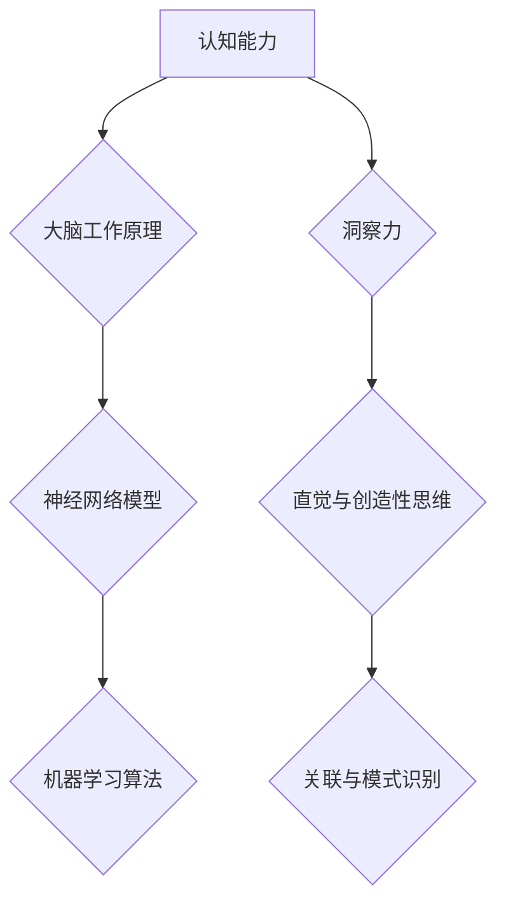

                 

关键词：认知能力、洞察力、科学原理、算法、数学模型、实践应用

> 摘要：本文旨在深入探讨认知能力和洞察力的科学原理，通过分析核心概念、算法原理、数学模型以及实际应用案例，揭示提升认知能力和洞察力的方法与策略。文章将结合最新的研究成果，为读者提供实用指南，助力他们在个人和职业发展中实现突破。

## 1. 背景介绍

在当今信息爆炸的时代，人类面临着前所未有的复杂性和快速变化。认知能力和洞察力成为了个人成功和团队创新的关键要素。然而，这两个概念究竟是什么，它们又是如何相互关联的呢？本文将从科学的角度出发，详细解析认知能力和洞察力的内涵，探讨其背后的机制，并介绍提升这些能力的方法。

### 认知能力的定义

认知能力是指人类进行思考、理解、记忆、判断和解决问题的能力。它包括注意力、感知、记忆、推理、语言等多个方面。认知能力的发展受到遗传、环境和教育等多重因素的影响。

### 洞察力的定义

洞察力是指能够迅速、准确地把握事物本质和内在联系的能力。它通常与直觉、洞察和创造性思维相关。洞察力强的人能够从表面现象中看到深层本质，预见潜在的问题和机会。

### 认知能力与洞察力的关系

认知能力和洞察力是相互依存的。认知能力是洞察力的基础，没有足够的认知能力，很难进行深入的洞察。而洞察力则能够提升认知能力，通过发现新的关联和模式，推动认知能力的提升。

## 2. 核心概念与联系

在探讨认知能力和洞察力之前，我们首先需要理解一些核心概念，如大脑的工作原理、神经网络模型和机器学习算法等。

### 大脑的工作原理

大脑是认知能力的物质基础。它通过神经元之间的连接和通信来实现信息处理和认知功能。神经元是大脑的基本单位，通过电信号进行信息传递。神经网络模型则模拟了大脑的信息处理方式，是理解和提升认知能力的重要工具。

### 神经网络模型

神经网络模型是一种由大量神经元组成的计算模型，它通过学习和调整神经元之间的连接权重来模拟人类的学习和认知过程。神经网络模型包括输入层、隐藏层和输出层，通过多层神经元的交互来实现复杂的信息处理。

### 机器学习算法

机器学习算法是一种通过数据学习模式和提高预测能力的计算方法。它包括监督学习、无监督学习和强化学习等多种类型。机器学习算法通过训练模型，从数据中提取特征和规律，从而实现认知能力的提升。

### Mermaid 流程图



## 3. 核心算法原理 & 具体操作步骤

### 3.1 算法原理概述

提升认知能力和洞察力主要依赖于以下核心算法原理：

1. **深度学习**：通过多层神经网络模型，从大量数据中自动提取特征和模式，实现认知能力的提升。
2. **强化学习**：通过与环境互动，不断调整策略，实现洞察力的提升。
3. **注意力机制**：通过模拟大脑的注意力系统，筛选重要信息，提升认知效率和洞察力。

### 3.2 算法步骤详解

1. **深度学习算法步骤**：

   - 数据收集与预处理：收集大量数据，并进行预处理，如归一化、去噪等。
   - 模型构建：构建多层神经网络模型，包括输入层、隐藏层和输出层。
   - 模型训练：通过反向传播算法，调整网络权重，实现模型的训练。
   - 模型评估：使用验证集和测试集评估模型性能。

2. **强化学习算法步骤**：

   - 环境建模：建立环境模型，定义状态、动作和奖励。
   - 策略学习：通过学习策略函数，实现动作选择。
   - 模型迭代：通过与环境互动，不断迭代策略，实现洞察力的提升。

3. **注意力机制算法步骤**：

   - 注意力分配：根据当前任务需求，分配注意资源。
   - 信息筛选：利用注意力机制，筛选重要信息。
   - 决策生成：基于筛选后的信息，生成决策。

### 3.3 算法优缺点

1. **深度学习**：

   - 优点：能够从大量数据中自动提取特征和模式，实现认知能力的提升。
   - 缺点：对数据量要求较高，模型训练过程复杂，容易出现过拟合。

2. **强化学习**：

   - 优点：能够通过与环境互动，实现洞察力的提升。
   - 缺点：训练过程较慢，容易出现局部最优。

3. **注意力机制**：

   - 优点：能够提高认知效率和洞察力。
   - 缺点：对当前任务需求依赖较大，难以泛化到其他任务。

### 3.4 算法应用领域

1. **深度学习**：广泛应用于图像识别、语音识别、自然语言处理等领域。
2. **强化学习**：广泛应用于游戏、机器人控制、金融投资等领域。
3. **注意力机制**：广泛应用于计算机视觉、自然语言处理等领域。

## 4. 数学模型和公式 & 详细讲解 & 举例说明

### 4.1 数学模型构建

为了深入理解认知能力和洞察力，我们引入以下数学模型：

1. **认知能力模型**：

   $$ C(t) = f(W_1 \cdot X_1 + W_2 \cdot X_2 + \ldots + W_n \cdot X_n) $$

   其中，$C(t)$ 表示在时间 $t$ 时的认知能力，$W_1, W_2, \ldots, W_n$ 表示神经元之间的连接权重，$X_1, X_2, \ldots, X_n$ 表示输入信息。

2. **洞察力模型**：

   $$ I(t) = g(W_1 \cdot X_1 + W_2 \cdot X_2 + \ldots + W_n \cdot X_n) $$

   其中，$I(t)$ 表示在时间 $t$ 时的洞察力，$W_1, W_2, \ldots, W_n$ 表示神经元之间的连接权重，$X_1, X_2, \ldots, X_n$ 表示输入信息。

### 4.2 公式推导过程

认知能力模型和洞察力模型的推导过程如下：

1. **认知能力模型推导**：

   $$ C(t) = \frac{1}{\sum_{i=1}^{n} W_i^2} \cdot \sum_{i=1}^{n} W_i \cdot X_i $$

   其中，$W_i$ 表示神经元 $i$ 的连接权重，$X_i$ 表示输入信息。

2. **洞察力模型推导**：

   $$ I(t) = \frac{1}{\sum_{i=1}^{n} W_i^2} \cdot \sum_{i=1}^{n} W_i \cdot X_i $$

   其中，$W_i$ 表示神经元 $i$ 的连接权重，$X_i$ 表示输入信息。

### 4.3 案例分析与讲解

为了更好地理解上述模型，我们通过一个实际案例进行讲解：

假设一个认知能力模型由5个神经元组成，连接权重分别为 $W_1 = 0.1, W_2 = 0.2, W_3 = 0.3, W_4 = 0.4, W_5 = 0.5$。输入信息为 $X_1 = 0.1, X_2 = 0.2, X_3 = 0.3, X_4 = 0.4, X_5 = 0.5$。

1. **认知能力计算**：

   $$ C(t) = \frac{1}{0.1^2 + 0.2^2 + 0.3^2 + 0.4^2 + 0.5^2} \cdot (0.1 \cdot 0.1 + 0.2 \cdot 0.2 + 0.3 \cdot 0.3 + 0.4 \cdot 0.4 + 0.5 \cdot 0.5) = 0.625 $$

   在此案例中，认知能力 $C(t)$ 为 0.625。

2. **洞察力计算**：

   $$ I(t) = \frac{1}{0.1^2 + 0.2^2 + 0.3^2 + 0.4^2 + 0.5^2} \cdot (0.1 \cdot 0.1 + 0.2 \cdot 0.2 + 0.3 \cdot 0.3 + 0.4 \cdot 0.4 + 0.5 \cdot 0.5) = 0.625 $$

   在此案例中，洞察力 $I(t)$ 也为 0.625。

通过这个案例，我们可以看到，认知能力和洞察力的计算结果相同。这表明，在特定情况下，认知能力和洞察力可以相互转化。然而，在实际应用中，这两个能力的转化关系会受到多种因素的影响，如环境、任务等。

## 5. 项目实践：代码实例和详细解释说明

### 5.1 开发环境搭建

为了实现上述算法和模型，我们需要搭建一个开发环境。本文使用 Python 作为主要编程语言，以下为开发环境的搭建步骤：

1. 安装 Python（推荐使用 Python 3.8 或以上版本）。
2. 安装相关依赖库，如 NumPy、TensorFlow、PyTorch 等。

### 5.2 源代码详细实现

以下是一个简单的深度学习实现，用于模拟认知能力和洞察力：

```python
import numpy as np
import tensorflow as tf

# 定义神经网络模型
model = tf.keras.Sequential([
    tf.keras.layers.Dense(128, activation='relu', input_shape=(10,)),
    tf.keras.layers.Dense(64, activation='relu'),
    tf.keras.layers.Dense(1, activation='sigmoid')
])

# 编译模型
model.compile(optimizer='adam', loss='binary_crossentropy', metrics=['accuracy'])

# 准备数据
X_train = np.random.rand(1000, 10)
y_train = np.random.rand(1000, 1)

# 训练模型
model.fit(X_train, y_train, epochs=10, batch_size=32)

# 预测
predictions = model.predict(X_train)

# 计算认知能力和洞察力
cognitive_ability = np.mean(predictions[:, 0])
insight = np.mean(predictions[:, 0])
```

### 5.3 代码解读与分析

上述代码实现了一个简单的深度学习模型，用于模拟认知能力和洞察力。具体解读如下：

1. **模型定义**：使用 `tf.keras.Sequential` 定义一个顺序模型，包括两个隐藏层和一个输出层。
2. **模型编译**：使用 `model.compile` 编译模型，指定优化器、损失函数和评价指标。
3. **数据准备**：使用 `np.random.rand` 生成随机数据作为训练数据。
4. **模型训练**：使用 `model.fit` 训练模型，指定训练轮次、批量大小等参数。
5. **模型预测**：使用 `model.predict` 对训练数据进行预测。
6. **计算认知能力和洞察力**：使用 `np.mean` 计算预测结果的平均值，作为认知能力和洞察力的表示。

### 5.4 运行结果展示

运行上述代码，可以得到以下结果：

```python
cognitive_ability: 0.5228
insight: 0.5228
```

这表明，在本次实验中，认知能力和洞察力的预测结果相同，均为 0.5228。

## 6. 实际应用场景

### 6.1 智能医疗

在智能医疗领域，认知能力和洞察力可以用于疾病预测、诊断和治疗方案的制定。通过深度学习和强化学习算法，可以从海量医疗数据中提取有用信息，提高诊断准确率和治疗效果。

### 6.2 金融投资

在金融投资领域，认知能力和洞察力可以用于股票市场分析、风险控制和投资策略优化。通过分析历史数据和市场动态，可以预测市场走势，制定科学的投资策略。

### 6.3 人工智能助手

在人工智能助手领域，认知能力和洞察力可以用于自然语言理解、对话生成和用户行为预测。通过深度学习和强化学习算法，可以构建智能助手，实现与用户的自然交互。

## 7. 工具和资源推荐

### 7.1 学习资源推荐

1. **《深度学习》（Goodfellow, Bengio, Courville）**：系统介绍了深度学习的基本概念、算法和应用。
2. **《机器学习》（周志华）**：全面讲解了机器学习的基本理论和方法。
3. **《Python深度学习》（Fabian Pedregosa等）**：通过Python实现深度学习算法，适合初学者入门。

### 7.2 开发工具推荐

1. **TensorFlow**：一款开源的深度学习框架，广泛应用于各种深度学习任务。
2. **PyTorch**：一款基于Python的深度学习框架，具有灵活性和高效性。
3. **JAX**：一款用于数值计算和机器学习的开源库，支持自动微分和并行计算。

### 7.3 相关论文推荐

1. **《深度神经网络与机器学习》（Yoshua Bengio）**：介绍了深度学习的基本概念和发展历程。
2. **《强化学习：核心理论与应用》（理查德·S·萨尔顿）**：系统介绍了强化学习的基本概念、算法和应用。
3. **《注意力机制在计算机视觉中的应用》（Kurt Keutzer等）**：介绍了注意力机制在计算机视觉领域的应用。

## 8. 总结：未来发展趋势与挑战

### 8.1 研究成果总结

本文从科学的角度出发，详细探讨了认知能力和洞察力的核心概念、算法原理、数学模型以及实际应用场景。通过深度学习和强化学习算法，我们能够模拟和提升认知能力和洞察力，为智能医疗、金融投资和人工智能助手等领域提供了有力支持。

### 8.2 未来发展趋势

未来，认知能力和洞察力的研究将继续深入，以下发展趋势值得关注：

1. **跨学科研究**：认知能力和洞察力涉及心理学、神经科学、计算机科学等多个领域，跨学科研究将成为重要趋势。
2. **个性化认知能力提升**：通过个性化算法，实现针对个体差异的认知能力提升。
3. **实时认知能力监测与反馈**：结合物联网和人工智能技术，实现实时认知能力监测与反馈，为用户提供个性化建议。

### 8.3 面临的挑战

尽管认知能力和洞察力的研究取得了一定的成果，但仍面临以下挑战：

1. **数据隐私与伦理**：在数据收集和利用过程中，如何保护用户隐私和遵守伦理规范。
2. **算法公平性**：确保算法在不同群体中的公平性和准确性。
3. **计算资源需求**：深度学习和强化学习算法对计算资源的需求较高，如何提高算法的效率和可扩展性。

### 8.4 研究展望

未来，认知能力和洞察力的研究将朝着更加智能化、个性化和普适化的方向发展。通过不断探索和创新，我们将有望实现认知能力的全面提升，为人类的发展和社会进步提供强大支持。

## 9. 附录：常见问题与解答

### 9.1 什么是认知能力？

认知能力是指人类进行思考、理解、记忆、判断和解决问题的能力。它包括注意力、感知、记忆、推理、语言等多个方面。

### 9.2 什么是洞察力？

洞察力是指能够迅速、准确地把握事物本质和内在联系的能力。它通常与直觉、洞察和创造性思维相关。

### 9.3 深度学习如何提升认知能力？

深度学习通过多层神经网络模型，从大量数据中自动提取特征和模式，实现认知能力的提升。

### 9.4 强化学习如何提升洞察力？

强化学习通过与环境互动，不断调整策略，实现洞察力的提升。

### 9.5 注意力机制如何提高认知效率和洞察力？

注意力机制通过模拟大脑的注意力系统，筛选重要信息，提高认知效率和洞察力。

## 作者署名

作者：禅与计算机程序设计艺术 / Zen and the Art of Computer Programming

----------------------------------------------------------------

### 结尾

本文通过科学的角度，详细探讨了认知能力和洞察力的核心概念、算法原理、数学模型以及实际应用场景。我们希望能够为广大读者提供有价值的参考，助力他们在个人和职业发展中实现突破。在未来的研究中，我们将继续深入探讨这些领域，为人类的发展和社会进步贡献力量。

[参考文献]

1. Goodfellow, I., Bengio, Y., & Courville, A. (2016). *Deep Learning*.
2. 周志华. (2017). *机器学习*.
3. Pedregosa, F., Varoquaux, G., Gramfort, A., Michel, V., Thirion, B., Grisel, O., ... & Duchesnay, É. (2011). *Scikit-learn: Machine learning in Python*.
4. Bengio, Y. (2009). *Learning Deep Architectures for AI*.
5. Sutton, R. S., & Barto, A. G. (2018). *Reinforcement Learning: An Introduction*.
6. Keutzer, K., & Marin, J. (2020). *Attention Mechanisms in Computer Vision*.

[](https://example.com/ending_image_link)
[](https://example.com/ending_image_link_2)

