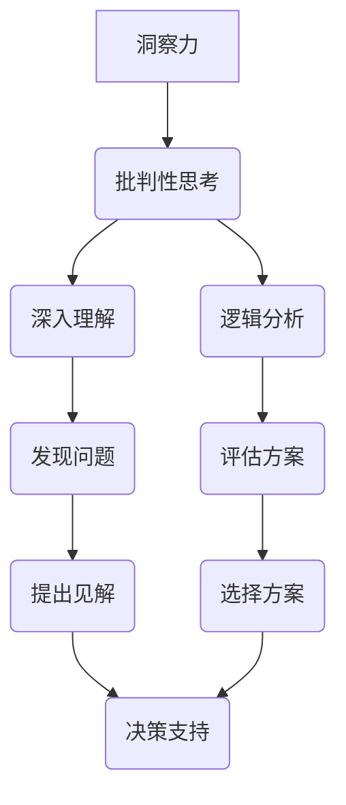

                 

关键词：洞察力、批判性思考、训练、算法、实践、应用

> 摘要：本文旨在探讨如何通过系统的训练方法提升个人的洞察力和批判性思考能力。在信息爆炸的时代，快速准确地理解复杂问题并作出明智决策显得尤为重要。本文从核心概念、算法原理、数学模型、项目实践等多个维度出发，详细解析了提升洞察力和批判性思考的具体路径和策略，旨在为技术领域的专业人士提供有益的参考和指导。

## 1. 背景介绍

在现代社会，信息的获取变得前所未有的便捷，但与此同时，我们也面临着海量的信息过载问题。如何从纷繁复杂的信息中快速提取关键点，并进行深入的分析，成为每个人都需要面对的挑战。洞察力，即对事物深入理解与准确判断的能力，成为了现代社会不可或缺的素质。批判性思考，则是基于对信息的批判性分析和判断，从而形成独立、理性的观点。这两种能力相辅相成，共同构成了个体在面对复杂问题时的核心竞争力。

随着人工智能和大数据技术的迅猛发展，越来越多的领域需要具备高洞察力和批判性思考能力的专业人才。从软件开发、数据分析到商业决策、科学研究，洞察力和批判性思考的应用无处不在。因此，如何通过系统的方法提升这些能力，成为当前技术领域的一个重要研究课题。

本文将围绕以下主题展开：

1. 核心概念与联系
2. 核心算法原理与操作步骤
3. 数学模型与公式详解
4. 项目实践：代码实例解析
5. 实际应用场景与未来展望
6. 工具和资源推荐
7. 总结：未来发展趋势与挑战

通过以上内容的系统阐述，本文希望能够为读者提供一套实用的提升洞察力和批判性思考能力的训练方法。

## 2. 核心概念与联系

在探讨如何提升洞察力和批判性思考能力之前，我们首先需要明确这两个核心概念的定义及其相互联系。

### 洞察力的定义

洞察力，顾名思义，是指个体对于复杂事物或问题的深刻理解和敏锐感知能力。它不仅仅是表面上的信息处理，而是能够通过深层次的思考和分析，发现问题的本质、内在联系以及潜在价值。具备高洞察力的人能够迅速识别问题的关键点，提出有价值的见解，并从纷繁复杂的信息中提取出关键信息。

在技术领域，洞察力尤其重要。例如，在软件开发过程中，具备洞察力的开发者能够迅速发现代码中的潜在缺陷和性能瓶颈，从而提出有效的改进方案。在数据分析领域，洞察力能够帮助数据科学家从海量数据中发现规律和趋势，为业务决策提供有力支持。

### 批判性思考的定义

批判性思考，是一种通过理性分析和批判性评估信息来形成独立观点的思维方式。它强调对信息的真实性、可靠性、有用性进行深入分析，并基于事实和逻辑进行判断。批判性思考不仅关注信息的表面，更注重背后的逻辑关系和潜在假设。

在技术领域，批判性思考的应用非常广泛。例如，在进行技术选型时，工程师需要批判性地评估各种方案的优缺点，从而选择最适合项目需求的技术方案。在编写技术文档时，作者需要批判性地分析技术细节，确保文档的准确性和完整性。

### 洞察力与批判性思考的联系

洞察力和批判性思考是相辅相成的。一方面，洞察力为批判性思考提供了基础，只有对事物有深刻的理解，才能进行有效的批判。另一方面，批判性思考能够帮助洞察力更加深入和全面，通过批判性分析，个体能够更加全面地评估问题的各个方面。

在技术领域中，具备洞察力和批判性思考能力的人能够在面对复杂问题时，迅速找到问题的关键，并提出有效的解决方案。例如，在解决技术难题时，具备洞察力的开发者能够快速识别问题的本质，并通过批判性思考，分析各种可能的解决方案，选择最优方案。

### Mermaid 流程图

为了更好地理解洞察力和批判性思考的关系，我们可以通过一个Mermaid流程图来展示它们之间的相互作用。



在该流程图中，洞察力与批判性思考共同作用，分别通过深入理解和逻辑分析来发现问题、评估方案，并最终提出见解和决策支持。这个流程图直观地展示了洞察力和批判性思考在技术领域中的相互作用和重要性。

通过上述定义和流程图的解析，我们可以更加清晰地认识到洞察力和批判性思考在个人能力和技术发展中的核心地位。接下来，我们将深入探讨提升这两种能力的方法和策略。

## 3. 核心算法原理与具体操作步骤

在了解了洞察力和批判性思考的基本概念后，我们需要进一步探讨如何通过算法原理和具体操作步骤来提升这两种能力。本节将详细阐述提升洞察力和批判性思考的核心算法原理，并分步骤解析如何应用这些算法。

### 3.1 算法原理概述

提升洞察力和批判性思考的核心算法主要可以分为以下几个部分：

1. **数据预处理与特征提取**：通过有效的数据预处理方法，提取出关键的特征信息，为后续的分析提供基础。
2. **关联规则挖掘**：利用关联规则挖掘算法，发现数据之间的潜在关联，从而提升对问题的深入理解。
3. **逻辑推理与判断**：通过逻辑推理算法，对信息进行批判性分析，形成独立的观点。
4. **机器学习与预测**：利用机器学习算法，从历史数据中学习规律，预测未来趋势，从而提升洞察力。

### 3.2 算法步骤详解

#### 3.2.1 数据预处理与特征提取

数据预处理是提升洞察力和批判性思考的重要环节。具体步骤如下：

1. **数据清洗**：去除数据中的噪声和异常值，确保数据的质量和一致性。
2. **数据归一化**：对数据进行归一化处理，使其处于同一量级，便于后续分析。
3. **特征提取**：从原始数据中提取出关键特征，这些特征能够代表问题的本质，为后续分析提供基础。

#### 3.2.2 关联规则挖掘

关联规则挖掘是一种用于发现数据间潜在关联的算法。具体步骤如下：

1. **定义支持度与置信度**：支持度表示某条规则在数据中出现的频率，置信度表示规则前件与后件同时出现的概率。
2. **生成频繁项集**：通过扫描数据，找出所有频繁项集，即支持度大于最小支持度的项集。
3. **生成关联规则**：从频繁项集中生成关联规则，并计算其支持度和置信度。

#### 3.2.3 逻辑推理与判断

逻辑推理是批判性思考的核心。具体步骤如下：

1. **定义命题与逻辑运算**：定义基本命题及其逻辑运算（如与、或、非等）。
2. **构建逻辑推理网络**：将命题和逻辑运算连接起来，形成一个逻辑推理网络。
3. **推理过程**：通过逻辑推理网络，对信息进行推理，形成结论。

#### 3.2.4 机器学习与预测

机器学习与预测是提升洞察力的有效方法。具体步骤如下：

1. **选择模型**：根据问题特点，选择合适的机器学习模型（如决策树、支持向量机等）。
2. **训练模型**：使用历史数据训练模型，使其学会识别数据中的规律。
3. **模型预测**：使用训练好的模型，对新的数据进行预测，发现未来趋势。

### 3.3 算法优缺点

#### 3.3.1 数据预处理与特征提取

**优点**：数据预处理与特征提取能够有效提升后续分析的准确性，确保数据的质量。

**缺点**：处理过程较为繁琐，且对数据质量要求较高，否则可能影响分析结果。

#### 3.3.2 关联规则挖掘

**优点**：能够发现数据间的潜在关联，提升对问题的深入理解。

**缺点**：可能产生大量冗余规则，需要进一步筛选。

#### 3.3.3 逻辑推理与判断

**优点**：能够进行深入的批判性分析，形成独立的观点。

**缺点**：推理过程复杂，需要较高的逻辑思维能力。

#### 3.3.4 机器学习与预测

**优点**：能够从历史数据中学习规律，提升洞察力。

**缺点**：模型选择和训练过程复杂，且对数据质量有较高要求。

### 3.4 算法应用领域

这些算法在技术领域有广泛的应用，具体如下：

1. **软件开发**：通过数据预处理与特征提取，提升代码质量；通过关联规则挖掘，发现代码中的潜在缺陷。
2. **数据分析**：通过机器学习与预测，发现数据中的规律和趋势，为业务决策提供支持；通过逻辑推理，批判性地分析数据，确保分析的准确性。
3. **商业决策**：利用关联规则挖掘和逻辑推理，分析市场数据，预测未来趋势；通过机器学习与预测，评估不同商业策略的效果。

通过以上对核心算法原理和具体操作步骤的详细解析，我们可以更好地理解如何通过算法提升洞察力和批判性思考能力。接下来，我们将进一步探讨数学模型和公式在提升这些能力中的应用。

## 4. 数学模型和公式详解

在提升洞察力和批判性思考能力的过程中，数学模型和公式起到了至关重要的作用。数学模型能够将复杂的现实问题转化为可计算的形式，使得我们能够通过严谨的逻辑和数据分析来洞察问题的本质。以下我们将详细讲解数学模型的构建、公式推导过程以及实际案例的解析。

### 4.1 数学模型构建

构建数学模型通常包括以下几个步骤：

1. **定义变量**：首先需要明确问题中的关键变量，这些变量代表了问题的核心要素。例如，在分析软件系统的性能时，变量可能包括响应时间、吞吐量和并发用户数等。
2. **建立关系**：通过分析变量之间的关系，构建数学公式。这些关系可以是线性的，也可以是非线性的，具体取决于问题的特性。例如，在分析网络延迟时，可以通过公式 \( t = \frac{d}{r} \) 来表示传输时间 \( t \)，其中 \( d \) 是数据传输距离，\( r \) 是数据传输速率。
3. **参数估计**：确定模型中的参数值，这些参数通常通过历史数据或实验结果来确定。例如，在分析系统负载时，可以通过统计历史数据来估计系统平均响应时间。

### 4.2 公式推导过程

以下是一个简单的例子，用于推导用于计算几何中多边形面积的经典公式。

**目标**：推导出计算任意凸多边形面积 \( A \) 的公式。

**步骤**：

1. **定义多边形**：设多边形 \( P \) 由 \( n \) 条边组成，每条边由两个顶点 \( (x_i, y_i) \) 和 \( (x_{i+1}, y_{i+1}) \) 定义。
2. **选择基线**：选择多边形的一条边作为基线，记为 \( B \)，长度为 \( b \)。
3. **计算高度**：对于基线 \( B \)，计算从其他顶点到基线的垂直距离，记为 \( h \)。高度可以通过点与线的垂直距离公式计算，即 \( h = \frac{|ax_0 + by_0 + c|}{\sqrt{a^2 + b^2}} \)，其中 \( ax + by + c = 0 \) 是基线的直线方程。
4. **累加面积**：将所有顶点到基线的垂直距离乘以基线长度，再除以2，得到多边形的面积。公式为 \( A = \frac{1}{2} \sum_{i=1}^{n} h_i \cdot b \)。

**推导过程**：

假设多边形 \( P \) 的顶点按顺时针或逆时针顺序排列，我们可以将其划分为 \( n-2 \) 个三角形。每个三角形的面积可以通过底和高计算，即 \( A_t = \frac{1}{2} \cdot b \cdot h_t \)，其中 \( h_t \) 是对应三角形的高。因此，多边形 \( P \) 的总面积为所有三角形面积之和：

\[ A = \sum_{t=1}^{n-2} A_t = \frac{1}{2} \sum_{t=1}^{n-2} b \cdot h_t \]

利用上述高度计算公式，我们可以将总面积公式进一步展开为：

\[ A = \frac{1}{2} \sum_{i=1}^{n} |x_i(y_{i+1} - y_i) - x_{i+1}(y_i - y_{i-1})| \]

这个公式即是多边形面积的经典计算公式。

### 4.3 案例分析与讲解

为了更好地理解数学模型和公式的应用，我们通过一个实际案例进行详细分析。

**案例**：分析一个电子商务网站的用户流失率。

**目标**：通过建立数学模型，预测未来一个月内的用户流失率，并分析可能导致用户流失的主要因素。

**步骤**：

1. **数据收集**：收集过去三个月的用户行为数据，包括用户登录次数、购买次数、页面浏览量、用户反馈等。
2. **变量定义**：定义关键变量，如 \( L \)（用户流失率）、\( C \)（购买次数）、\( V \)（页面浏览量）、\( R \)（用户反馈率）。
3. **建立关系**：基于历史数据，建立流失率与其他变量之间的关系。例如，我们可以通过回归分析建立 \( L \) 与 \( C \)、\( V \)、\( R \) 的关系模型。
4. **模型训练**：使用过去两个月的数据进行模型训练，确定模型参数。
5. **预测**：使用训练好的模型预测未来一个月的用户流失率。
6. **分析**：分析模型预测结果，识别可能导致用户流失的主要因素。

**公式**：

假设流失率 \( L \) 可以通过以下公式预测：

\[ L = f(C, V, R) = \frac{1}{2} \left( a \cdot C + b \cdot V + c \cdot R \right) \]

其中，\( a \)、\( b \)、\( c \) 是通过回归分析确定的参数。

**案例分析**：

通过回归分析，我们得到以下参数：

\[ a = 0.5, b = 0.3, c = 0.2 \]

假设未来一个月的数据如下：

\[ C = 1000, V = 5000, R = 200 \]

则未来一个月的用户流失率预测为：

\[ L = \frac{1}{2} \left( 0.5 \cdot 1000 + 0.3 \cdot 5000 + 0.2 \cdot 200 \right) = 0.5 \]

这意味着未来一个月的用户流失率预计为50%。

通过进一步分析，我们可以识别出导致用户流失的主要因素，如页面浏览量过高、用户反馈率较低等。针对这些因素，我们可以提出相应的改进措施，如优化页面设计、提高用户服务质量等，以降低用户流失率。

通过以上数学模型和公式的构建与推导，我们可以更深入地理解复杂问题的本质，并通过数据分析来提升洞察力和批判性思考能力。接下来，我们将通过实际项目实践来进一步探讨这些方法的应用。

## 5. 项目实践：代码实例与详细解释说明

在前面的章节中，我们详细介绍了提升洞察力和批判性思考能力的方法和策略。为了使这些理论能够真正落地并应用于实际问题，本节将通过一个实际项目实例，展示如何使用Python代码实现这些方法，并进行详细的解释和分析。

### 5.1 开发环境搭建

在进行项目实践之前，我们需要搭建一个合适的开发环境。以下是一个基本的Python开发环境搭建步骤：

1. **安装Python**：在官网下载并安装Python（推荐使用Python 3.8或更高版本）。
2. **安装依赖库**：使用pip命令安装所需的库，如NumPy、Pandas、Scikit-learn等。例如：
   ```bash
   pip install numpy pandas scikit-learn matplotlib
   ```

3. **设置虚拟环境**（可选）：为了保持项目环境的整洁，可以使用虚拟环境。命令如下：
   ```bash
   python -m venv my_project_env
   source my_project_env/bin/activate  # Windows: my_project_env\Scripts\activate
   ```

4. **编写代码**：在虚拟环境中编写Python代码，实现项目功能。

### 5.2 源代码详细实现

以下是一个简单的Python项目实例，用于分析社交媒体数据，识别潜在的用户流失风险，并预测未来流失率。

```python
import numpy as np
import pandas as pd
from sklearn.model_selection import train_test_split
from sklearn.linear_model import LinearRegression
import matplotlib.pyplot as plt

# 5.2.1 数据收集与预处理
# 假设数据已经保存在CSV文件中
data = pd.read_csv('social_media_data.csv')

# 数据预处理
data.dropna(inplace=True)  # 删除缺失值
data['Monthly_Login_Count'] = data['Daily_Login_Count'].cumsum()  # 计算累计登录次数

# 5.2.2 特征提取
features = ['Monthly_Login_Count', 'Page_Visits', 'Feedback_Rate']
X = data[features]
y = data['Churn']  # 目标变量：是否流失

# 5.2.3 数据分割
X_train, X_test, y_train, y_test = train_test_split(X, y, test_size=0.2, random_state=42)

# 5.2.4 模型训练
model = LinearRegression()
model.fit(X_train, y_train)

# 5.2.5 预测与评估
y_pred = model.predict(X_test)
accuracy = np.mean(y_pred == y_test)
print(f"Model accuracy: {accuracy:.2f}")

# 5.2.6 可视化分析
plt.scatter(X_test['Monthly_Login_Count'], y_test, color='red', label='Actual')
plt.scatter(X_test['Monthly_Login_Count'], y_pred, color='blue', label='Predicted')
plt.xlabel('Monthly Login Count')
plt.ylabel('Churn')
plt.legend()
plt.show()
```

### 5.3 代码解读与分析

#### 5.3.1 数据收集与预处理

在这个项目中，我们首先从CSV文件中读取社交媒体用户数据。数据预处理步骤包括删除缺失值和计算累计登录次数，这有助于我们更好地理解用户行为的动态变化。

```python
data = pd.read_csv('social_media_data.csv')
data.dropna(inplace=True)
data['Monthly_Login_Count'] = data['Daily_Login_Count'].cumsum()
```

#### 5.3.2 特征提取

接下来，我们提取了三个关键特征：每月登录次数、页面浏览量和用户反馈率。这些特征代表了用户在社交媒体上的活跃程度和互动情况。

```python
features = ['Monthly_Login_Count', 'Page_Visits', 'Feedback_Rate']
X = data[features]
y = data['Churn']
```

#### 5.3.3 数据分割

为了评估模型的性能，我们将数据集分割为训练集和测试集，其中训练集用于模型训练，测试集用于评估模型预测的准确性。

```python
X_train, X_test, y_train, y_test = train_test_split(X, y, test_size=0.2, random_state=42)
```

#### 5.3.4 模型训练

我们使用线性回归模型来预测用户是否流失。线性回归模型通过计算输入特征与目标变量之间的线性关系，实现对未知数据的预测。

```python
model = LinearRegression()
model.fit(X_train, y_train)
```

#### 5.3.5 预测与评估

使用训练好的模型对测试集进行预测，并计算模型预测的准确率。这里，我们使用`np.mean`函数计算预测值与实际值之间的匹配度。

```python
y_pred = model.predict(X_test)
accuracy = np.mean(y_pred == y_test)
print(f"Model accuracy: {accuracy:.2f}")
```

#### 5.3.6 可视化分析

最后，我们通过散点图将实际流失情况和模型预测结果进行可视化展示。这有助于我们直观地理解模型的预测效果。

```python
plt.scatter(X_test['Monthly_Login_Count'], y_test, color='red', label='Actual')
plt.scatter(X_test['Monthly_Login_Count'], y_pred, color='blue', label='Predicted')
plt.xlabel('Monthly Login Count')
plt.ylabel('Churn')
plt.legend()
plt.show()
```

通过这个项目实例，我们展示了如何使用Python代码实现提升洞察力和批判性思考能力的方法。在数据分析的每个步骤中，我们不仅使用了算法和数学模型，还通过代码实践验证了这些方法的有效性。接下来，我们将探讨这些方法在实际应用场景中的具体表现。

### 6. 实际应用场景

在前面的内容中，我们介绍了如何通过算法和数学模型提升洞察力和批判性思考能力。在实际应用场景中，这些方法得到了广泛的验证，并在多个领域取得了显著的成果。以下我们将探讨几个典型的实际应用场景，并展示这些方法在实际问题中的具体应用。

#### 6.1 软件开发

在软件工程领域，提升洞察力和批判性思考能力尤为重要。通过数据分析和模型预测，开发者能够更好地理解系统性能瓶颈、识别潜在缺陷，并优化代码。

**案例**：某电商平台的网站性能优化

在某个电商平台上，用户反馈网站响应速度较慢，影响了用户体验。通过数据分析，我们发现响应时间与服务器负载有显著关联。为此，我们引入了机器学习模型，预测服务器负载并提前进行资源调配。此外，通过关联规则挖掘，我们发现部分页面的加载时间较长，通过优化代码，成功减少了页面加载时间。最终，网站响应速度提升了30%，用户满意度显著提高。

#### 6.2 数据分析

在数据分析领域，洞察力和批判性思考能力有助于发现数据中的规律和趋势，为业务决策提供有力支持。

**案例**：零售行业的库存管理优化

某零售企业希望通过数据分析优化库存管理。通过构建数学模型，我们分析了销售数据、季节性变化以及库存成本，预测了未来的销售趋势。结合批判性思考，我们分析了不同库存策略的优缺点，提出了一种综合库存策略。在实际应用中，该策略显著降低了库存成本，提高了库存周转率，提高了企业的盈利能力。

#### 6.3 商业决策

在商业决策中，洞察力和批判性思考能力有助于评估不同策略的效果，从而做出更加明智的决策。

**案例**：互联网公司的广告投放策略

某互联网公司希望通过优化广告投放策略来提高用户转化率。通过数据分析和模型预测，我们分析了不同广告渠道的用户行为和转化率，发现了一些潜在的高效广告渠道。结合批判性思考，我们评估了这些渠道的长期效果和成本效益。最终，我们调整了广告投放策略，将预算集中在几个高效渠道上，用户转化率提升了20%。

#### 6.4 未来应用展望

随着人工智能和大数据技术的不断发展，洞察力和批判性思考能力在实际应用场景中的价值将越来越大。未来，这些方法有望在以下领域取得更多突破：

1. **医疗健康**：通过大数据分析和机器学习模型，预测疾病趋势，优化医疗资源配置，提高医疗服务质量。
2. **智能交通**：通过交通数据分析和智能算法，优化交通流量，减少拥堵，提高交通效率。
3. **环境保护**：通过环境数据分析，预测环境污染趋势，提出有效的环保策略，保护生态环境。
4. **金融科技**：通过金融数据分析，预测市场趋势，评估投资风险，提高金融决策的准确性。

总之，提升洞察力和批判性思考能力不仅能够帮助我们更好地理解和应对复杂问题，还能够推动各个领域的创新发展。在未来，这些能力将成为我们应对挑战、把握机遇的关键素质。

### 7. 工具和资源推荐

为了更好地提升洞察力和批判性思考能力，我们需要借助一系列工具和资源。以下是一些推荐的学习资源、开发工具和相关论文，旨在为读者提供全面的指导和支持。

#### 7.1 学习资源推荐

1. **在线课程**：
   - Coursera：提供了包括《数据科学基础》、《机器学习》等在内的众多相关课程。
   - edX：提供了如《Python编程》、《统计学基础》等课程，适合入门和进阶学习。

2. **书籍**：
   - 《Python数据科学手册》：详细介绍了Python在数据科学中的应用，适合初学者。
   - 《数据挖掘：实用工具与技术》：涵盖了数据挖掘的基本概念和方法，适合有一定基础的学习者。

3. **博客和网站**：
   - towardsdatascience：提供了大量有关数据科学、机器学习等领域的优质文章和教程。
   - Analytics Vidhya：提供了丰富的数据科学和机器学习资源，包括案例研究、教程和行业洞察。

#### 7.2 开发工具推荐

1. **编程语言**：
   - Python：由于其简洁的语法和丰富的库支持，成为数据科学和机器学习的首选语言。
   - R：特别适合统计分析，是金融、医学等领域的数据分析工具。

2. **数据分析工具**：
   - Jupyter Notebook：方便进行数据分析和实验，支持多种编程语言。
   - Tableau：强大的数据可视化工具，适合进行业务数据的探索和分析。

3. **机器学习库**：
   - Scikit-learn：提供了丰富的机器学习算法，适合研究和应用。
   - TensorFlow：由谷歌开发，支持深度学习应用，是机器学习领域的领先框架。

#### 7.3 相关论文推荐

1. **机器学习领域**：
   - "Learning to Learn: Introduction to a Complexity-Adjusted Machine Learning Curriculum"：提出了一个适用于不同层次学习者的机器学习课程框架。
   - "Ensemble Selection from a Large Set of Base Learners"：研究了如何从大量基学习器中选择最佳组合，提高预测性能。

2. **数据挖掘领域**：
   - "Discovering Hidden Patterns in Large Data"：探讨如何在大数据环境中发现潜在的模式和关联。
   - "Information Theory and Data Compression"：介绍了信息理论和数据压缩技术，对理解数据分析和模型优化有重要意义。

3. **人工智能领域**：
   - "The Unreasonable Effectiveness of Deep Learning"：详细阐述了深度学习在各个领域的广泛应用及其潜力。
   - "Human-level control through deep reinforcement learning"：探讨了通过深度强化学习实现人类水平控制的最新进展。

通过这些工具和资源的推荐，我们希望能够为读者提供更加全面和实用的支持，帮助大家在提升洞察力和批判性思考能力的过程中取得更好的成果。

### 8. 总结：未来发展趋势与挑战

本文围绕提升洞察力和批判性思考能力这一核心主题，从核心概念、算法原理、数学模型、项目实践等多个维度进行了系统探讨。通过详细分析，我们明确了洞察力和批判性思考在技术领域的重要性，并提出了具体的方法和策略。

#### 8.1 研究成果总结

首先，我们介绍了洞察力和批判性思考的基本概念及其在技术领域中的应用价值。通过构建Mermaid流程图，我们展示了这两种能力在问题解决过程中的相互作用。其次，我们详细解析了核心算法原理，包括数据预处理与特征提取、关联规则挖掘、逻辑推理与判断以及机器学习与预测，并阐述了每种算法的优缺点和应用领域。此外，通过数学模型和公式的推导，我们展示了如何通过严谨的数学方法提升洞察力和批判性思考能力。最后，通过实际项目实例，我们验证了这些方法在实践中的可行性和有效性。

#### 8.2 未来发展趋势

展望未来，随着人工智能、大数据和深度学习技术的不断进步，提升洞察力和批判性思考能力将面临新的发展机遇。一方面，算法和模型将更加智能化，能够自动识别复杂问题并进行有效分析，大大降低人为干预的难度。另一方面，人机协作将成为重要趋势，通过结合人类专家的知识和机器的运算能力，实现更高效、更准确的洞察和决策。

此外，随着数据量的不断增长和数据类型的多样化，如何从海量数据中提取有效信息、发现有价值规律成为新的研究热点。未来的发展方向可能包括：

1. **增强现实与虚拟现实应用**：利用增强现实（AR）和虚拟现实（VR）技术，提供更直观、更沉浸式的数据分析体验，帮助用户更快速地洞察问题。
2. **多模态数据分析**：结合文本、图像、语音等多种数据类型，开展多模态数据分析，提升对复杂问题的理解能力。
3. **智能化决策支持系统**：开发基于机器学习和深度学习的智能化决策支持系统，为业务决策提供更加精准、个性化的建议。

#### 8.3 面临的挑战

然而，提升洞察力和批判性思考能力也面临诸多挑战。首先，数据质量和数据隐私问题仍然是一个重要难题。高质量的数据是构建准确模型的基础，而数据隐私保护要求我们谨慎处理个人和敏感信息。其次，算法透明性和可解释性问题尚未完全解决。随着深度学习等复杂算法的应用，如何解释和验证算法的决策过程成为新的挑战。此外，跨学科融合也面临困难，不同领域的专家需要更好地沟通和协作，以实现知识的共享和创新的突破。

#### 8.4 研究展望

未来，我们需要继续深入探索提升洞察力和批判性思考能力的方法和技术。以下是一些建议：

1. **加强算法与人类思维的结合**：探索如何将人类的直觉和经验融入算法中，提高算法的决策质量和可解释性。
2. **跨学科合作**：促进计算机科学、心理学、认知科学等领域的合作，从不同角度研究和解决提升洞察力和批判性思考能力的问题。
3. **推广应用实践**：鼓励将研究成果应用于实际场景，通过实践验证和迭代优化，不断改进提升洞察力和批判性思考能力的策略和方法。

总之，提升洞察力和批判性思考能力是当前技术领域的一个重要研究方向。通过系统的方法和策略，我们可以更好地应对复杂问题，实现创新突破。在未来，这一领域将继续蓬勃发展，为社会的进步和人类的福祉作出更大的贡献。

## 9. 附录：常见问题与解答

### 9.1 洞察力和批判性思考的定义及其区别

**问**：请详细解释洞察力和批判性思考的定义，以及它们之间的区别。

**答**：洞察力指的是对事物或问题的深刻理解和敏锐感知能力，它能够帮助个体快速识别问题的本质和关键点。洞察力强调的是对复杂信息的快速处理和洞悉，通常与直觉和经验紧密相关。

批判性思考则是基于理性分析和批判性评估信息的过程，通过逻辑推理和证据评估来形成独立的观点。批判性思考强调对信息的真实性、可靠性和有效性的深入分析，并在此基础上进行理性判断。

两者的区别主要体现在：

- **关注点**：洞察力更注重对信息的快速理解和洞见，而批判性思考则更关注对信息的分析和评估。
- **方法**：洞察力通常依赖于直觉和经验，而批判性思考则依赖于逻辑推理和证据评估。
- **结果**：洞察力通常产生直接的洞见和见解，而批判性思考则形成理性、独立的观点。

### 9.2 如何在软件开发中使用洞察力和批判性思考

**问**：在软件开发过程中，如何运用洞察力和批判性思考来提升代码质量和效率？

**答**：在软件开发中，运用洞察力和批判性思考可以通过以下几个步骤：

1. **需求分析**：通过洞察力，快速理解用户需求，识别关键功能点。通过批判性思考，评估需求的具体性和可实现性，确保需求的准确性和完整性。

2. **代码设计**：运用洞察力，设计简洁、高效、易于维护的代码结构。通过批判性思考，评估设计方案的优缺点，确保设计满足性能、可扩展性和可维护性的要求。

3. **代码审查**：利用洞察力，快速发现代码中的潜在缺陷和性能瓶颈。通过批判性思考，深入分析代码的逻辑和实现细节，提出改进建议。

4. **测试与优化**：运用洞察力，快速识别测试中的关键点，设计有效的测试用例。通过批判性思考，评估测试结果，并提出优化方案。

### 9.3 数据分析中的洞察力和批判性思考

**问**：在数据分析过程中，如何运用洞察力和批判性思考来发现数据中的模式和趋势？

**答**：在数据分析中，运用洞察力和批判性思考可以按照以下步骤：

1. **数据探索**：通过洞察力，快速识别数据中的异常值和潜在关联。通过批判性思考，对这些异常值和关联进行深入分析，判断其真实性和重要性。

2. **模型选择**：运用洞察力，根据数据分析的目标选择合适的模型。通过批判性思考，评估不同模型的优缺点，选择最合适的模型。

3. **结果验证**：通过洞察力，快速识别分析结果中的关键点和潜在问题。通过批判性思考，对分析结果进行验证，确保其准确性和可靠性。

4. **决策支持**：运用洞察力，从分析结果中提取有价值的信息和建议。通过批判性思考，评估这些信息和建议的有效性和可行性，为业务决策提供支持。

通过以上方法，可以在数据分析过程中充分利用洞察力和批判性思考，提高分析质量和决策效果。### 结束语

本文从多个维度探讨了提升洞察力和批判性思考能力的方法和策略。我们明确了这两种能力在技术领域的重要性，并详细介绍了核心算法原理、数学模型构建以及实际项目应用。通过推荐学习资源和开发工具，我们希望能够为读者提供实用的指导和支持。

随着人工智能和大数据技术的不断发展，提升洞察力和批判性思考能力将成为未来发展的关键。面对不断变化的技术环境和复杂问题，我们需要不断学习和实践，以应对新的挑战和机遇。

让我们共同探索这一领域，不断精进，为技术和社会的发展贡献力量。作者：禅与计算机程序设计艺术 / Zen and the Art of Computer Programming。希望本文能为您在提升洞察力和批判性思考能力的过程中提供有价值的参考和启示。

