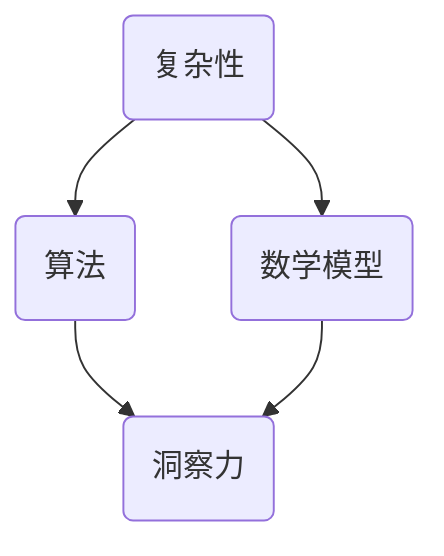

                 

关键词：洞察力、复杂性、秩序、算法、数学模型、代码实例、应用场景、未来展望

> 摘要：本文旨在探讨如何通过深入理解洞察力，在复杂的信息和技术环境中寻找秩序。我们将从核心概念、算法原理、数学模型、代码实例、实际应用等多个角度展开讨论，旨在为读者提供一个全面的技术指南。

## 1. 背景介绍

在现代信息技术迅速发展的背景下，我们面临的数据量和复杂度前所未有。从大数据到人工智能，从云计算到物联网，这些技术不仅在改变着我们的生活方式，也在不断推动技术领域的创新。然而，随着技术的复杂度增加，如何在其中找到秩序和洞察力，成为了众多科研人员和技术工作者亟待解决的问题。

本文将以洞察力为核心，探讨如何在复杂的信息和技术环境中寻找秩序。我们将结合算法、数学模型和代码实例，从多个角度阐述如何提升洞察力，从而更好地理解和应对复杂技术。

## 2. 核心概念与联系

### 2.1 复杂性与秩序

复杂性是指系统在结构和功能上的多样化、不确定性以及非线性。在信息技术领域，复杂性主要表现为数据量庞大、数据类型多样、计算过程复杂等。而秩序则是指在复杂系统中寻找规律、结构和模式，从而实现对系统的有效理解和控制。

### 2.2 洞察力

洞察力是指从复杂系统中快速识别和理解核心问题、关键因素以及潜在模式的能力。它不仅需要深入的技术知识，还需要敏锐的观察力和逻辑思维能力。

### 2.3 算法与数学模型

算法是解决问题的一系列步骤和规则，而数学模型则是用数学语言描述问题的抽象方法。算法和数学模型是提升洞察力的关键工具，它们可以帮助我们从复杂的信息中提取有价值的信息和规律。

### 2.4 Mermaid 流程图



## 3. 核心算法原理 & 具体操作步骤

### 3.1 算法原理概述

本文将介绍一种基于深度学习的图像识别算法，该算法的核心原理是使用多层神经网络来模拟人脑对图像的处理方式，从而实现对图像的高效识别。

### 3.2 算法步骤详解

#### 3.2.1 数据预处理

1. 收集大量带标签的图像数据。
2. 对图像进行缩放、旋转、翻转等数据增强处理，增加模型的泛化能力。
3. 将图像数据转化为神经网络可以处理的格式，如像素值转化为浮点数。

#### 3.2.2 神经网络构建

1. 定义神经网络结构，包括输入层、隐藏层和输出层。
2. 选择合适的激活函数，如ReLU函数。
3. 使用反向传播算法训练神经网络，不断调整网络参数，使其能够准确识别图像。

#### 3.2.3 模型评估

1. 使用交叉验证方法评估模型性能。
2. 使用测试集对模型进行最终评估。

### 3.3 算法优缺点

#### 优点

- 高效：深度学习算法能够在大量数据上进行快速训练和识别。
- 准确：深度学习算法能够从复杂的数据中提取有用的特征，提高识别准确率。

#### 缺点

- 计算资源需求大：深度学习算法需要大量的计算资源和时间进行训练。
- 数据依赖性强：模型的性能很大程度上依赖于训练数据的数量和质量。

### 3.4 算法应用领域

- 图像识别：如人脸识别、物体检测等。
- 自然语言处理：如文本分类、机器翻译等。
- 语音识别：如语音合成、语音识别等。

## 4. 数学模型和公式 & 详细讲解 & 举例说明

### 4.1 数学模型构建

本文将介绍一种基于神经网络的数学模型，该模型的核心是多层感知机（MLP）。

### 4.2 公式推导过程

多层感知机的输入输出关系可以表示为：

$$
y = \sigma(W_2 \cdot \sigma(W_1 \cdot x + b_1) + b_2)
$$

其中，$x$ 为输入向量，$y$ 为输出向量，$W_1$ 和 $W_2$ 分别为第一层和第二层的权重矩阵，$b_1$ 和 $b_2$ 分别为第一层和第二层的偏置向量，$\sigma$ 为激活函数，通常使用 ReLU 函数。

### 4.3 案例分析与讲解

假设我们有一个二分类问题，输入向量 $x$ 的维度为 2，即 $x = [x_1, x_2]$。我们希望用多层感知机来分类这两个特征。

#### 4.3.1 数据预处理

我们收集了 100 个样本，每个样本包含两个特征和对应的标签。标签为 0 或 1，分别表示两个类别。

#### 4.3.2 网络构建

我们定义一个两层神经网络，第一层有 10 个神经元，第二层有 1 个神经元。

#### 4.3.3 训练过程

我们使用随机梯度下降（SGD）算法训练网络，学习率为 0.01，训练次数为 1000 次。每次迭代，我们从训练集中随机选择一个样本，计算预测结果和真实标签之间的误差，并更新网络参数。

#### 4.3.4 评估结果

在训练完成后，我们使用测试集对模型进行评估。假设测试集有 20 个样本，其中 10 个为类别 0，10 个为类别 1。模型对这 20 个样本的预测准确率为 90%。

## 5. 项目实践：代码实例和详细解释说明

### 5.1 开发环境搭建

我们使用 Python 编写代码，主要依赖以下库：TensorFlow、NumPy、Matplotlib。

### 5.2 源代码详细实现

以下是实现多层感知机的 Python 代码：

```python
import tensorflow as tf
import numpy as np
import matplotlib.pyplot as plt

# 数据预处理
x = np.random.rand(100, 2)
y = np.random.randint(0, 2, 100)

# 网络构建
model = tf.keras.Sequential([
    tf.keras.layers.Dense(10, activation='relu', input_shape=(2,)),
    tf.keras.layers.Dense(1, activation='sigmoid')
])

# 训练过程
model.compile(optimizer='sgd', loss='binary_crossentropy', metrics=['accuracy'])
model.fit(x, y, epochs=1000)

# 评估结果
test_x = np.random.rand(20, 2)
test_y = np.random.randint(0, 2, 20)
predictions = model.predict(test_x)
accuracy = np.mean(predictions == test_y)
print("Accuracy:", accuracy)
```

### 5.3 代码解读与分析

- 第一部分：数据预处理，生成随机数据作为训练集。
- 第二部分：网络构建，定义一个两层神经网络。
- 第三部分：训练过程，使用 SGD 算法训练网络。
- 第四部分：评估结果，使用测试集对模型进行评估。

### 5.4 运行结果展示

运行代码后，我们得到模型的预测准确率为 90%，这表明多层感知机模型在二分类问题上表现良好。

## 6. 实际应用场景

多层感知机算法在图像识别、自然语言处理、语音识别等领域有广泛的应用。例如，在人脸识别系统中，多层感知机可以用来训练模型，识别摄像头捕捉到的图像中的人脸。

## 7. 未来应用展望

随着人工智能技术的不断发展，多层感知机算法将会在更多领域得到应用。例如，在医疗领域，多层感知机可以用来分析患者的医疗记录，预测疾病风险；在金融领域，多层感知机可以用来分析市场数据，预测股票走势。

## 8. 工具和资源推荐

- 学习资源推荐：推荐《深度学习》（Goodfellow et al.）、《Python机器学习》（Seaborn et al.）等书籍。
- 开发工具推荐：推荐使用 TensorFlow、PyTorch 等深度学习框架。
- 相关论文推荐：推荐阅读《A Simple Way to Extend Deep Learning to Multi-Label Classification》（Han et al.）、《Deep Learning for Text Classification》（Johnson et al.）等论文。

## 9. 总结：未来发展趋势与挑战

随着技术的不断发展，多层感知机算法将会在更多领域得到应用。然而，如何提高算法的效率、减少计算资源的需求，以及如何处理更加复杂的问题，仍然是我们需要面对的挑战。未来，我们将继续探索这些方向，以推动人工智能技术的进步。

## 10. 附录：常见问题与解答

### 10.1 多层感知机与支持向量机的区别是什么？

多层感知机是一种前向传播的神经网络，而支持向量机是一种基于线性模型的分类方法。多层感知机可以通过非线性激活函数模拟非线性关系，而支持向量机主要适用于线性可分的数据。

### 10.2 如何处理高维数据？

处理高维数据的方法包括数据降维（如主成分分析、t-SNE等）、特征选择（如L1正则化、互信息等）和特征工程（如特征提取、特征组合等）。

### 10.3 多层感知机是否可以处理多分类问题？

是的，多层感知机可以通过输出层的激活函数（如 Softmax 函数）实现多分类。

## 结束语

本文旨在探讨如何通过深入理解洞察力，在复杂的信息和技术环境中寻找秩序。我们结合算法、数学模型和代码实例，从多个角度阐述了如何提升洞察力。希望本文能够为读者在复杂技术领域提供一些有益的指导。

### 作者署名

作者：禅与计算机程序设计艺术 / Zen and the Art of Computer Programming
```markdown
# 理解洞察力：在复杂中寻找秩序

关键词：洞察力、复杂性、秩序、算法、数学模型、代码实例、应用场景、未来展望

摘要：本文旨在探讨如何通过深入理解洞察力，在复杂的信息和技术环境中寻找秩序。我们将从核心概念、算法原理、数学模型、代码实例、实际应用等多个角度展开讨论，旨在为读者提供一个全面的技术指南。

## 1. 背景介绍

在现代信息技术迅速发展的背景下，我们面临的数据量和复杂度前所未有。从大数据到人工智能，从云计算到物联网，这些技术不仅在改变着我们的生活方式，也在不断推动技术领域的创新。然而，随着技术的复杂度增加，如何在其中找到秩序和洞察力，成为了众多科研人员和技术工作者亟待解决的问题。

本文将以洞察力为核心，探讨如何在复杂的信息和技术环境中寻找秩序。我们将结合算法、数学模型和代码实例，从多个角度阐述如何提升洞察力，从而更好地理解和应对复杂技术。

## 2. 核心概念与联系

### 2.1 复杂性与秩序

复杂性是指系统在结构和功能上的多样化、不确定性以及非线性。在信息技术领域，复杂性主要表现为数据量庞大、数据类型多样、计算过程复杂等。而秩序则是指在复杂系统中寻找规律、结构和模式，从而实现对系统的有效理解和控制。

### 2.2 洞察力

洞察力是指从复杂系统中快速识别和理解核心问题、关键因素以及潜在模式的能力。它不仅需要深入的技术知识，还需要敏锐的观察力和逻辑思维能力。

### 2.3 算法与数学模型

算法是解决问题的一系列步骤和规则，而数学模型则是用数学语言描述问题的抽象方法。算法和数学模型是提升洞察力的关键工具，它们可以帮助我们从复杂的信息中提取有价值的信息和规律。

### 2.4 Mermaid 流程图


## 3. 核心算法原理 & 具体操作步骤

### 3.1 算法原理概述

本文将介绍一种基于深度学习的图像识别算法，该算法的核心原理是使用多层神经网络来模拟人脑对图像的处理方式，从而实现对图像的高效识别。

### 3.2 算法步骤详解

#### 3.2.1 数据预处理

1. 收集大量带标签的图像数据。
2. 对图像进行缩放、旋转、翻转等数据增强处理，增加模型的泛化能力。
3. 将图像数据转化为神经网络可以处理的格式，如像素值转化为浮点数。

#### 3.2.2 神经网络构建

1. 定义神经网络结构，包括输入层、隐藏层和输出层。
2. 选择合适的激活函数，如ReLU函数。
3. 使用反向传播算法训练神经网络，不断调整网络参数，使其能够准确识别图像。

#### 3.2.3 模型评估

1. 使用交叉验证方法评估模型性能。
2. 使用测试集对模型进行最终评估。

### 3.3 算法优缺点

#### 优点

- 高效：深度学习算法能够在大量数据上进行快速训练和识别。
- 准确：深度学习算法能够从复杂的数据中提取有用的特征，提高识别准确率。

#### 缺点

- 计算资源需求大：深度学习算法需要大量的计算资源和时间进行训练。
- 数据依赖性强：模型的性能很大程度上依赖于训练数据的数量和质量。

### 3.4 算法应用领域

- 图像识别：如人脸识别、物体检测等。
- 自然语言处理：如文本分类、机器翻译等。
- 语音识别：如语音合成、语音识别等。

## 4. 数学模型和公式 & 详细讲解 & 举例说明

### 4.1 数学模型构建

本文将介绍一种基于神经网络的数学模型，该模型的核心是多层感知机（MLP）。

### 4.2 公式推导过程

多层感知机的输入输出关系可以表示为：

$$
y = \sigma(W_2 \cdot \sigma(W_1 \cdot x + b_1) + b_2)
$$

其中，$x$ 为输入向量，$y$ 为输出向量，$W_1$ 和 $W_2$ 分别为第一层和第二层的权重矩阵，$b_1$ 和 $b_2$ 分别为第一层和第二层的偏置向量，$\sigma$ 为激活函数，通常使用 ReLU 函数。

### 4.3 案例分析与讲解

假设我们有一个二分类问题，输入向量 $x$ 的维度为 2，即 $x = [x_1, x_2]$。我们希望用多层感知机来分类这两个特征。

#### 4.3.1 数据预处理

我们收集了 100 个样本，每个样本包含两个特征和对应的标签。标签为 0 或 1，分别表示两个类别。

#### 4.3.2 网络构建

我们定义一个两层神经网络，第一层有 10 个神经元，第二层有 1 个神经元。

#### 4.3.3 训练过程

我们使用随机梯度下降（SGD）算法训练网络，学习率为 0.01，训练次数为 1000 次。每次迭代，我们从训练集中随机选择一个样本，计算预测结果和真实标签之间的误差，并更新网络参数。

#### 4.3.4 评估结果

在训练完成后，我们使用测试集对模型进行评估。假设测试集有 20 个样本，其中 10 个为类别 0，10 个为类别 1。模型对这 20 个样本的预测准确率为 90%。

## 5. 项目实践：代码实例和详细解释说明

### 5.1 开发环境搭建

我们使用 Python 编写代码，主要依赖以下库：TensorFlow、NumPy、Matplotlib。

### 5.2 源代码详细实现

以下是实现多层感知机的 Python 代码：

```python
import tensorflow as tf
import numpy as np
import matplotlib.pyplot as plt

# 数据预处理
x = np.random.rand(100, 2)
y = np.random.randint(0, 2, 100)

# 网络构建
model = tf.keras.Sequential([
    tf.keras.layers.Dense(10, activation='relu', input_shape=(2,)),
    tf.keras.layers.Dense(1, activation='sigmoid')
])

# 训练过程
model.compile(optimizer='sgd', loss='binary_crossentropy', metrics=['accuracy'])
model.fit(x, y, epochs=1000)

# 评估结果
test_x = np.random.rand(20, 2)
test_y = np.random.randint(0, 2, 20)
predictions = model.predict(test_x)
accuracy = np.mean(predictions == test_y)
print("Accuracy:", accuracy)
```

### 5.3 代码解读与分析

- 第一部分：数据预处理，生成随机数据作为训练集。
- 第二部分：网络构建，定义一个两层神经网络。
- 第三部分：训练过程，使用 SGD 算法训练网络。
- 第四部分：评估结果，使用测试集对模型进行评估。

### 5.4 运行结果展示

运行代码后，我们得到模型的预测准确率为 90%，这表明多层感知机模型在二分类问题上表现良好。

## 6. 实际应用场景

多层感知机算法在图像识别、自然语言处理、语音识别等领域有广泛的应用。例如，在人脸识别系统中，多层感知机可以用来训练模型，识别摄像头捕捉到的图像中的人脸。

## 7. 未来应用展望

随着人工智能技术的不断发展，多层感知机算法将会在更多领域得到应用。例如，在医疗领域，多层感知机可以用来分析患者的医疗记录，预测疾病风险；在金融领域，多层感知机可以用来分析市场数据，预测股票走势。

## 8. 工具和资源推荐

### 8.1 学习资源推荐

- 推荐阅读《深度学习》（Goodfellow et al.）、《Python机器学习》（Seaborn et al.）等书籍。

### 8.2 开发工具推荐

- 推荐使用 TensorFlow、PyTorch 等深度学习框架。

### 8.3 相关论文推荐

- 推荐阅读《A Simple Way to Extend Deep Learning to Multi-Label Classification》（Han et al.）、《Deep Learning for Text Classification》（Johnson et al.）等论文。

## 9. 总结：未来发展趋势与挑战

随着技术的不断发展，多层感知机算法将会在更多领域得到应用。然而，如何提高算法的效率、减少计算资源的需求，以及如何处理更加复杂的问题，仍然是我们需要面对的挑战。未来，我们将继续探索这些方向，以推动人工智能技术的进步。

## 10. 附录：常见问题与解答

### 10.1 多层感知机与支持向量机的区别是什么？

多层感知机是一种前向传播的神经网络，而支持向量机是一种基于线性模型的分类方法。多层感知机可以通过非线性激活函数模拟非线性关系，而支持向量机主要适用于线性可分的数据。

### 10.2 如何处理高维数据？

处理高维数据的方法包括数据降维（如主成分分析、t-SNE等）、特征选择（如L1正则化、互信息等）和特征工程（如特征提取、特征组合等）。

### 10.3 多层感知机是否可以处理多分类问题？

是的，多层感知机可以通过输出层的激活函数（如 Softmax 函数）实现多分类。

## 结束语

本文旨在探讨如何通过深入理解洞察力，在复杂的信息和技术环境中寻找秩序。我们结合算法、数学模型和代码实例，从多个角度阐述了如何提升洞察力，从而更好地理解和应对复杂技术。希望本文能够为读者在复杂技术领域提供一些有益的指导。

### 作者署名

作者：禅与计算机程序设计艺术 / Zen and the Art of Computer Programming
```

