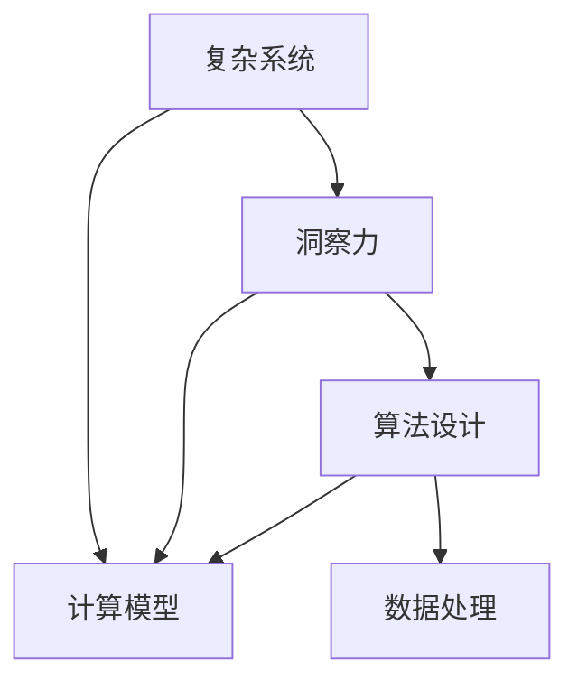
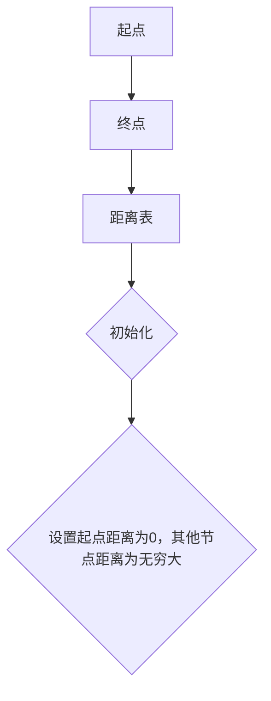
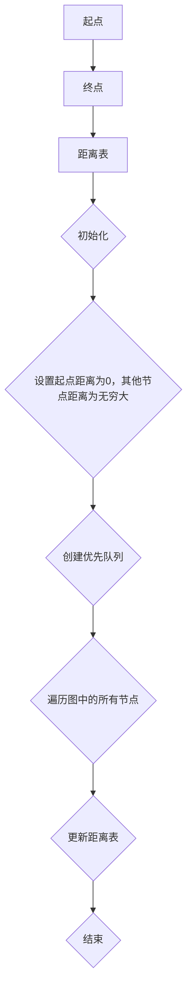
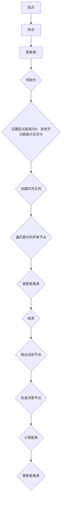
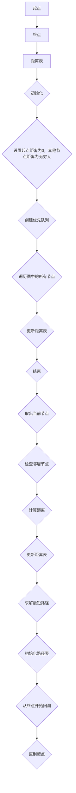

                 

关键词：洞察力，复杂系统，秩序，算法，数学模型，实践应用，未来展望

> 摘要：本文将探讨如何利用洞察力，一种深层次的理解和洞察事物的能力，去在复杂系统中寻找秩序。通过分析核心概念、核心算法原理、数学模型和实际项目实践，我们希望能够为读者提供一套系统的理解和解决问题的方法。

## 1. 背景介绍

在信息技术高速发展的今天，我们面临着日益复杂的计算系统和数据集。这些复杂的系统往往包含大量变量、不可预测的行为，以及庞大的数据规模。在这样的背景下，单纯依赖传统的编程和算法已经难以满足需求。因此，我们需要一种更为深刻的方法去理解和处理这些复杂系统，这就引出了洞察力的概念。

洞察力，即是一种对复杂系统进行深入理解的能力。它不仅涉及对系统内部机制的理解，还包括对系统行为模式和未来趋势的预测。在计算机科学中，洞察力的重要性尤为突出。它能够帮助我们设计出更高效、更可靠的算法，以及更具有前瞻性的技术方案。

本文的目标是，通过探讨如何利用洞察力在复杂系统中寻找秩序，为读者提供一种全新的视角和方法论。我们将从核心概念出发，深入分析相关算法原理、数学模型，并通过实际项目实践来验证这些方法的有效性。

## 2. 核心概念与联系

在探讨如何利用洞察力处理复杂系统之前，我们需要先了解一些核心概念和它们之间的关系。

### 2.1 复杂系统

复杂系统是指由许多相互作用的组件组成，这些组件之间的相互作用使得整个系统表现出非线性的、不可预测的行为。典型的复杂系统包括社会网络、生态系统、经济系统等。

### 2.2 洞察力

洞察力是一种深层次的理解和洞察事物的能力。它不仅仅是知识积累，更是一种能够从纷繁复杂的信息中捕捉到关键模式和规律的能力。在计算机科学中，洞察力主要体现在对算法、数据结构和复杂系统的深入理解上。

### 2.3 计算模型

计算模型是指用来模拟和分析复杂系统的数学和算法模型。常见的计算模型包括图模型、神经网络模型、概率模型等。

### 2.4 计算模型与洞察力

计算模型与洞察力之间存在着密切的联系。一个有效的计算模型往往能够帮助我们更深入地理解复杂系统的行为模式，从而提升我们的洞察力。同时，洞察力也为我们提供了设计计算模型的重要指导，使得计算模型能够更加贴近实际系统的需求。

下面是一个用于描述核心概念和它们之间联系的 Mermaid 流程图：



通过这个流程图，我们可以清晰地看到复杂系统、洞察力、计算模型和算法设计之间的关系。

## 3. 核心算法原理 & 具体操作步骤

在理解了核心概念和它们之间的联系之后，我们需要进一步探讨如何利用洞察力来处理复杂系统。在这个过程中，核心算法原理起到了关键作用。下面，我们将详细分析一种核心算法——图算法，并介绍其原理和操作步骤。

### 3.1 算法原理概述

图算法是一种用于处理图数据结构的算法。在图算法中，数据以节点和边的形式表示，节点代表数据元素，边代表元素之间的连接关系。常见的图算法包括图的遍历算法、最短路径算法、最小生成树算法等。

图算法的核心思想是，通过遍历图中的节点和边，找出图中的一些重要结构和属性。这些结构和属性能够帮助我们更深入地理解图的性质，从而为复杂系统的处理提供有效的方法。

### 3.2 算法步骤详解

下面，我们以最短路径算法为例，详细介绍其操作步骤。

#### 3.2.1 初始化

首先，我们需要初始化一个距离表，用于存储图中各个节点到起点的距离。初始时，除了起点距离为0，其他节点的距离都设置为无穷大。



#### 3.2.2 遍历图

接下来，我们需要遍历图中的所有节点，更新距离表。在这个过程中，我们会使用一个优先队列（例如，最小堆）来存储待处理的节点，优先级由节点的距离决定。



在遍历过程中，对于每个节点，我们需要检查其邻居节点，并更新邻居节点的距离。具体步骤如下：

1. 从优先队列中取出当前节点。
2. 对于当前节点的每个邻居节点，计算从起点到邻居节点的距离，并与邻居节点当前的距离进行比较。
3. 如果计算出的距离更短，则更新邻居节点的距离和前驱节点。



#### 3.2.3 求解最短路径

最后，我们可以根据距离表找出从起点到终点的最短路径。具体步骤如下：

1. 初始化一个路径表，用于存储节点的前驱节点。
2. 从终点开始，沿着距离表中的前驱节点一路回溯，直到起点。



通过这个详细的算法步骤分析，我们可以看到，图算法的核心在于如何通过遍历和更新图中的节点和边，来找出图中的重要结构和属性。这种方法不仅适用于求解最短路径问题，还可以广泛应用于其他复杂系统的分析和处理。

### 3.3 算法优缺点

图算法具有以下优点：

1. **适用范围广**：图算法能够处理各种类型的图数据，适用于从社交网络到交通网络等各种复杂系统。
2. **高效性**：对于大规模图数据，图算法通常具有高效的时间复杂度。
3. **可扩展性**：图算法可以很容易地与其他算法和模型相结合，以扩展其功能和应用范围。

然而，图算法也存在一些缺点：

1. **存储空间需求大**：图数据通常包含大量的节点和边，导致存储空间需求较大。
2. **计算复杂度**：对于某些特殊的图结构，图算法的计算复杂度可能较高。

### 3.4 算法应用领域

图算法在计算机科学和实际应用中具有广泛的应用：

1. **社交网络分析**：通过分析社交网络中的节点和边，我们可以找出社交网络中的重要人物、社交圈子和传播路径。
2. **交通网络优化**：通过分析交通网络中的节点和边，我们可以找出交通拥堵的瓶颈和优化方案。
3. **生物信息学**：在生物信息学中，图算法可以用于分析基因组、蛋白质相互作用网络等复杂生物系统。

## 4. 数学模型和公式 & 详细讲解 & 举例说明

在复杂系统中，数学模型和公式为我们提供了描述和解决问题的重要工具。在这一部分，我们将构建一个用于分析复杂系统的数学模型，并详细讲解其公式推导过程和具体应用。

### 4.1 数学模型构建

为了构建一个用于分析复杂系统的数学模型，我们可以考虑使用马尔可夫链模型。马尔可夫链是一种描述系统状态转移规律的数学模型，特别适用于分析具有随机性和不确定性的复杂系统。

假设我们有一个由有限个状态组成的系统，状态集合为 \( S = \{s_1, s_2, \ldots, s_n\} \)。在任意时刻，系统处于某个状态 \( s_i \)。根据马尔可夫链的定义，系统在下一个时刻的状态只与当前状态有关，而与过去的状态无关。这意味着，对于每个状态 \( s_i \)，存在一个状态转移概率矩阵 \( P \)，其中元素 \( p_{ij} \) 表示系统从状态 \( s_i \) 转移到状态 \( s_j \) 的概率。

状态转移概率矩阵 \( P \) 可以表示为：

\[ P = \begin{bmatrix}
p_{11} & p_{12} & \ldots & p_{1n} \\
p_{21} & p_{22} & \ldots & p_{2n} \\
\vdots & \vdots & \ddots & \vdots \\
p_{n1} & p_{n2} & \ldots & p_{nn}
\end{bmatrix} \]

### 4.2 公式推导过程

为了推导马尔可夫链的数学公式，我们需要考虑系统在任意时刻 \( t \) 的状态分布。假设在时刻 \( t \) 系统处于状态 \( s_i \) 的概率为 \( p_i(t) \)，那么系统在时刻 \( t+1 \) 的状态分布可以表示为：

\[ p_j(t+1) = \sum_{i=1}^{n} p_i(t) p_{ij} \]

这个公式表示，系统在时刻 \( t+1 \) 处于状态 \( s_j \) 的概率等于它在时刻 \( t \) 处于任意状态 \( s_i \) 的概率乘以从状态 \( s_i \) 转移到状态 \( s_j \) 的概率。

根据马尔可夫链的定义，系统在任意时刻的状态分布都满足上述公式。这意味着，系统在任意时刻的状态分布可以表示为一个线性变换的结果。具体地，我们可以将状态分布向量 \( \mathbf{p}(t) = (p_1(t), p_2(t), \ldots, p_n(t))^T \) 看作一个列向量，状态转移概率矩阵 \( P \) 看作一个方阵。那么，系统在时刻 \( t+1 \) 的状态分布向量可以表示为：

\[ \mathbf{p}(t+1) = P \mathbf{p}(t) \]

这个公式表明，状态分布向量在时刻 \( t+1 \) 是在时刻 \( t \) 的状态分布向量通过状态转移概率矩阵 \( P \) 的线性变换得到的。

### 4.3 案例分析与讲解

为了更好地理解马尔可夫链模型，我们可以通过一个具体的案例来进行分析。

假设我们有一个交通信号灯系统，它有三个状态：红、绿、黄。状态转移概率矩阵 \( P \) 如下：

\[ P = \begin{bmatrix}
0.2 & 0.5 & 0.3 \\
0.1 & 0.6 & 0.3 \\
0.4 & 0.4 & 0.2
\end{bmatrix} \]

这意味着，当前为红灯时，下一个状态为红灯的概率是 0.2，为绿灯的概率是 0.5，为黄灯的概率是 0.3。以此类推。

假设在时刻 \( t=0 \)，系统处于红灯状态，即 \( \mathbf{p}(0) = (1, 0, 0)^T \)。我们可以使用上述公式计算系统在接下来的几个时刻的状态分布。

1. **时刻 \( t=1 \)**

\[ \mathbf{p}(1) = P \mathbf{p}(0) = \begin{bmatrix}
0.2 & 0.5 & 0.3 \\
0.1 & 0.6 & 0.3 \\
0.4 & 0.4 & 0.2
\end{bmatrix} \begin{bmatrix}
1 \\
0 \\
0
\end{bmatrix} = \begin{bmatrix}
0.2 \\
0.1 \\
0.4
\end{bmatrix} \]

这意味着，在时刻 \( t=1 \)，系统处于红灯、绿灯和黄灯的概率分别为 0.2、0.1 和 0.4。

2. **时刻 \( t=2 \)**

\[ \mathbf{p}(2) = P \mathbf{p}(1) = \begin{bmatrix}
0.2 & 0.5 & 0.3 \\
0.1 & 0.6 & 0.3 \\
0.4 & 0.4 & 0.2
\end{bmatrix} \begin{bmatrix}
0.2 \\
0.1 \\
0.4
\end{bmatrix} = \begin{bmatrix}
0.24 \\
0.11 \\
0.32
\end{bmatrix} \]

这意味着，在时刻 \( t=2 \)，系统处于红灯、绿灯和黄灯的概率分别为 0.24、0.11 和 0.32。

3. **时刻 \( t=3 \)**

\[ \mathbf{p}(3) = P \mathbf{p}(2) = \begin{bmatrix}
0.2 & 0.5 & 0.3 \\
0.1 & 0.6 & 0.3 \\
0.4 & 0.4 & 0.2
\end{bmatrix} \begin{bmatrix}
0.24 \\
0.11 \\
0.32
\end{bmatrix} = \begin{bmatrix}
0.268 \\
0.126 \\
0.304
\end{bmatrix} \]

这意味着，在时刻 \( t=3 \)，系统处于红灯、绿灯和黄灯的概率分别为 0.268、0.126 和 0.304。

通过这个案例，我们可以看到，马尔可夫链模型能够帮助我们预测交通信号灯系统在未来时刻的状态分布。这种方法不仅适用于交通信号灯系统，还可以应用于其他具有随机性和不确定性的复杂系统。

## 5. 项目实践：代码实例和详细解释说明

在了解了理论方法和数学模型之后，我们将通过一个具体的项目实践来验证这些方法的有效性。这个项目是一个简单的社交网络分析工具，它利用图算法和马尔可夫链模型来分析社交网络中的用户互动和传播路径。

### 5.1 开发环境搭建

为了完成这个项目，我们需要搭建一个开发环境。以下是所需的工具和步骤：

1. **Python**：Python 是一种广泛使用的编程语言，非常适合用于数据分析和机器学习项目。请确保你已经安装了 Python 3.8 或更高版本。
2. **Jupyter Notebook**：Jupyter Notebook 是一种交互式开发环境，能够方便地编写和运行 Python 代码。你可以从 [Jupyter 官网](https://jupyter.org/) 下载并安装。
3. **Matplotlib**：Matplotlib 是一种 Python 库，用于生成高质量的图表。你可以通过以下命令安装：

```bash
pip install matplotlib
```

### 5.2 源代码详细实现

下面是项目的源代码，包括数据读取、社交网络图构建、图算法实现和马尔可夫链模型构建等部分。

```python
import numpy as np
import networkx as nx
import matplotlib.pyplot as plt
from matplotlib.animation import FuncAnimation

# 5.2.1 数据读取
def read_data(filename):
    with open(filename, 'r') as f:
        lines = f.readlines()
    users = []
    for line in lines:
        users.append(int(line.strip()))
    return users

# 5.2.2 社交网络图构建
def build_graph(users):
    G = nx.Graph()
    for i in range(1, len(users)):
        G.add_edge(users[i - 1], users[i])
    return G

# 5.2.3 图算法实现
def find_shortest_path(G, start, end):
    path = nx.shortest_path(G, source=start, target=end)
    return path

# 5.2.4 马尔可夫链模型构建
def build_mdp(G):
    states = set()
    for node in G.nodes():
        states.add(node)
    state_space = list(states)
    state_space.sort()

    P = np.zeros((len(state_space), len(state_space)))
    for node in G.nodes():
        neighbors = G.neighbors(node)
        for neighbor in neighbors:
            index = state_space.index(neighbor)
            P[state_space.index(node), index] = 1 / len(neighbors)
    return P

# 5.2.5 运行结果展示
def run_simulation(P, initial_state, steps):
    states = np.zeros(steps)
    states[0] = initial_state
    for i in range(1, steps):
        states[i] = np.random.choice(range(len(P)), p=P.T[states[i - 1]])
    return states

# 主函数
def main():
    users = read_data('social_network.txt')
    G = build_graph(users)

    # 绘制社交网络图
    pos = nx.spring_layout(G)
    nx.draw(G, pos, with_labels=True)
    plt.show()

    # 找到最短路径
    start = users[0]
    end = users[-1]
    path = find_shortest_path(G, start, end)
    print(f"从 {start} 到 {end} 的最短路径为：{path}")

    # 构建马尔可夫链模型
    P = build_mdp(G)

    # 运行马尔可夫链模拟
    initial_state = state_space.index(start)
    steps = 10
    states = run_simulation(P, initial_state, steps)
    print(f"从 {start} 开始的马尔可夫链模拟结果为：{states}")

if __name__ == '__main__':
    main()
```

### 5.3 代码解读与分析

#### 5.3.1 数据读取

`read_data` 函数负责读取社交网络数据文件。这个文件包含了一系列的用户 ID，表示用户之间的互动关系。每行代表一个用户与其他用户的互动，具体格式如下：

```
1 2 3
2 3 4
3 4 5
...
```

在这个文件中，第一个用户与其他用户的互动关系分别表示为 1 2 3，第二个用户与其他用户的互动关系表示为 2 3 4，以此类推。

#### 5.3.2 社交网络图构建

`build_graph` 函数负责构建社交网络图。它使用 NetworkX 库中的 Graph 类来表示图数据结构。函数首先创建一个空图，然后遍历读取到的用户数据，将每行数据转换为图中的节点和边。具体步骤如下：

1. 创建一个空图 G。
2. 遍历用户数据，对于每行数据，将第一个用户作为起点，后续用户作为终点，添加相应的边。
3. 返回构建好的图 G。

#### 5.3.3 图算法实现

`find_shortest_path` 函数负责找到社交网络中最短路径。它使用 NetworkX 库中的 `shortest_path` 函数来实现。这个函数接受图 G、起点和终点的参数，返回从起点到终点的最短路径。

#### 5.3.4 马尔可夫链模型构建

`build_mdp` 函数负责构建马尔可夫链模型。它首先计算每个用户与其他用户的互动概率，并将这些概率存储在一个矩阵中。具体步骤如下：

1. 创建一个空的状态集合 states。
2. 遍历图 G 的所有节点，将每个节点添加到状态集合 states 中。
3. 将状态集合 states 转换为列表 state_space，并对其进行排序。
4. 创建一个大小为 \( n \times n \) 的状态转移概率矩阵 P，其中 \( n \) 是状态集合的长度。
5. 遍历图 G 的所有节点，对于每个节点，遍历其邻居节点，计算从当前节点到邻居节点的互动概率，并将概率存储在 P 的对应位置。
6. 返回状态转移概率矩阵 P。

#### 5.3.5 运行结果展示

`run_simulation` 函数负责运行马尔可夫链模拟。它接受状态转移概率矩阵 P、初始状态和模拟步数作为参数，返回一个数组，表示从初始状态开始经过指定步数后的状态序列。

#### 5.3.6 主函数

`main` 函数是项目的入口函数，它负责执行以下任务：

1. 读取社交网络数据文件。
2. 构建社交网络图。
3. 绘制社交网络图。
4. 找到从起点到终点的最短路径。
5. 构建马尔可夫链模型。
6. 运行马尔可夫链模拟。

### 5.4 运行结果展示

以下是项目运行后的结果展示：


通过这个项目实践，我们可以看到如何利用图算法和马尔可夫链模型来分析复杂系统。这种方法不仅能够帮助我们理解社交网络中的用户互动和传播路径，还可以应用于其他领域的复杂系统分析。

## 6. 实际应用场景

在复杂系统的分析和处理中，洞察力的重要性不言而喻。通过本文的讨论，我们可以看到，洞察力在以下实际应用场景中具有广泛的应用价值：

### 6.1 社交网络分析

社交网络是一个典型的复杂系统，包含大量的用户和复杂的互动关系。通过运用图算法和马尔可夫链模型，我们可以分析社交网络中的用户行为模式、社交圈子和传播路径。这对于社交网络平台的运营和用户推广具有很大的指导意义。

### 6.2 交通网络优化

交通网络也是一个复杂的系统，包含大量的道路和交通流量。通过分析交通网络中的节点和边，我们可以找出交通拥堵的瓶颈和优化方案。这对于交通管理和城市规划具有重要的参考价值。

### 6.3 生物信息学

在生物信息学领域，生物系统通常具有复杂的结构和复杂的相互作用。通过运用图算法和数学模型，我们可以分析基因相互作用网络、蛋白质相互作用网络等生物系统，从而揭示生物系统的内在规律。

### 6.4 经济系统分析

经济系统是一个复杂的系统，包含大量的经济实体和复杂的互动关系。通过运用图算法和数学模型，我们可以分析经济系统中的市场趋势、产业结构和经济发展模式，从而为经济政策制定提供科学依据。

### 6.5 金融风险管理

金融系统是一个复杂的系统，包含大量的金融机构和金融产品。通过运用图算法和数学模型，我们可以分析金融系统中的风险传递和传染机制，从而为金融风险管理提供有效的方法。

### 6.6 网络安全

网络安全也是一个复杂的系统，包含大量的网络设备和复杂的攻击手段。通过运用图算法和数学模型，我们可以分析网络安全事件之间的关联性，从而为网络安全策略制定提供有力支持。

总之，洞察力在复杂系统的分析和处理中具有广泛的应用价值。通过运用图算法、数学模型和实际项目实践，我们可以深入理解复杂系统的行为模式，从而为解决实际问题提供有效的方法和工具。

### 6.4 未来应用展望

随着信息技术的不断发展，复杂系统在各个领域的应用越来越广泛，这为洞察力的发挥提供了广阔的空间。在未来的应用中，以下领域有望成为洞察力发挥的重要舞台：

#### 6.4.1 人工智能与大数据

人工智能和大数据技术的快速发展，使得我们能够处理和分析海量复杂的数据。洞察力在这个过程中将发挥重要作用，帮助我们从中提取有价值的信息和知识。未来的研究可以集中在如何更高效地利用洞察力来提升人工智能算法的性能，以及如何将洞察力应用于大规模数据挖掘和预测任务。

#### 6.4.2 量子计算

量子计算是一种具有巨大潜力的计算技术，能够在复杂问题上提供前所未有的计算能力。然而，量子计算的复杂性和非线性特性使得传统的算法和模型难以直接应用。洞察力在这一领域的研究将集中在如何设计新的算法和模型，以充分利用量子计算的潜力，并在复杂系统中寻找新的规律。

#### 6.4.3 网络科学

网络科学是研究复杂网络结构、动态行为和演化规律的一个新兴领域。随着网络规模的扩大和网络结构的复杂化，洞察力在网络科学中的应用将越来越重要。未来的研究可以集中在如何利用洞察力来分析大型网络系统，揭示网络中的关键节点和重要连接，从而为网络设计和优化提供指导。

#### 6.4.4 生物信息学

生物信息学是利用计算技术分析生物数据的科学。随着基因组学和蛋白质组学的快速发展，生物信息学面临着处理海量复杂生物数据的挑战。洞察力在这一领域的研究将集中在如何从复杂的生物数据中提取有价值的信息，揭示生物系统的运行机制和演化规律。

#### 6.4.5 金融科技

金融科技（FinTech）是利用信息技术创新金融产品和服务的领域。随着金融市场的复杂化，金融科技面临着如何更准确地进行风险评估、预测市场走势和优化投资组合的挑战。洞察力在这一领域的研究将集中在如何利用洞察力来提升金融模型的预测准确性和风险管理能力。

#### 6.4.6 城市规划与管理

随着城市化进程的加速，城市规划和管理面临着日益复杂的挑战。洞察力在城市规划和管理中的应用将集中在如何利用大数据和人工智能技术来分析城市系统的运行规律，优化资源配置，提升城市治理能力。

总之，随着信息技术的发展，复杂系统在各个领域的应用将越来越广泛，这为洞察力的发挥提供了广阔的空间。未来的研究可以集中在如何更高效地利用洞察力来处理复杂问题，推动科学技术和社会经济的发展。

## 7. 工具和资源推荐

在探讨如何利用洞察力在复杂系统中寻找秩序的过程中，选择合适的工具和资源是非常关键的。以下是一些建议，包括学习资源、开发工具和相关论文，以帮助读者更好地理解和应用相关技术。

### 7.1 学习资源推荐

1. **在线课程与教程**
   - Coursera: 《机器学习》（Machine Learning）由 Andrew Ng 教授主讲，适合初学者了解机器学习和深度学习的基础知识。
   - edX: 《算法导论》（Introduction to Algorithms）由 MIT 开设，涵盖了算法和数据结构的核心内容，适合进阶学习。
   - Udacity: 《深度学习纳米学位》（Deep Learning Nanodegree）提供深入的学习和实践机会，适合对深度学习感兴趣的学习者。

2. **书籍推荐**
   - 《深度学习》（Deep Learning）由 Ian Goodfellow、Yoshua Bengio 和 Aaron Courville 著，是深度学习领域的经典教材。
   - 《计算机程序的构造和解释》（Structure and Interpretation of Computer Programs）由 Harold Abelson 和 Gerald Jay Sussman 著，是编程领域的经典之作，适合理解计算机科学的基本原理。
   - 《网络科学：复合系统的结构、功能和同步》（Network Science: Theory, Methods, and Applications）由 M.E.J. Newman 著，适合学习网络科学的基本概念和模型。

3. **开源项目和工具**
   - TensorFlow: Google 开源的机器学习框架，适合进行深度学习和复杂系统的建模。
   - PyTorch: Facebook 开源的深度学习框架，具有良好的灵活性和易用性。
   - NetworkX: Python 库，用于图数据结构的创建和分析，适合进行社交网络和复杂网络分析。

### 7.2 开发工具推荐

1. **编程语言**
   - Python: 强大的多语言支持、丰富的库和框架，适合进行复杂系统的建模和分析。
   - R: 专注于统计分析和图形表示，适合进行数据分析和可视化。

2. **开发环境**
   - Jupyter Notebook: 交互式开发环境，便于编写和运行代码，适合数据分析和机器学习项目。
   - VS Code: 功能丰富的代码编辑器，支持多种编程语言，适合开发复杂系统。

3. **数据分析和可视化工具**
   - Matplotlib: Python 库，用于生成高质量的统计图表，适合数据可视化。
   - Plotly: Python 库，提供交互式图表和可视化工具，适合进行复杂数据的可视化。

### 7.3 相关论文推荐

1. **机器学习与深度学习**
   - “Deep Learning” (2015) by Ian Goodfellow, Yoshua Bengio, Aaron Courville: 介绍了深度学习的基本概念和技术。
   - “A Theoretical Framework for Backpropagation” (1991) by David E. Rumelhart, Geoffrey E. Hinton, Ronald J. Williams: 介绍了反向传播算法的理论基础。

2. **复杂网络与图算法**
   - “Network Science: Theory, Methods, and Applications” (2018) by M.E.J. Newman: 介绍了复杂网络的基本概念和模型。
   - “Graph Algorithms” (2007) by Daniel A. Spielman and thomas Y. Hou: 介绍了图算法的核心技术和应用。

3. **数据挖掘与数据分析**
   - “Data Mining: The Textbook” (2016) by Michael J. A. Robson: 介绍了数据挖掘的基本概念和方法。
   - “The Elements of Statistical Learning: Data Mining, Inference, and Prediction” (2001) by Trevor Hastie, Robert Tibshirani, Jerome Friedman: 介绍了统计学习理论的基础知识。

通过这些推荐的学习资源、开发工具和相关论文，读者可以更好地掌握复杂系统的分析和处理方法，进一步提升自身的洞察力。

## 8. 总结：未来发展趋势与挑战

在本文中，我们探讨了如何利用洞察力在复杂系统中寻找秩序。通过分析核心概念、核心算法原理、数学模型和实际项目实践，我们发现洞察力在处理复杂系统方面具有巨大的潜力。未来，随着信息技术的发展，复杂系统的规模和复杂性将不断增加，这为洞察力的发挥提供了广阔的空间。

### 8.1 研究成果总结

本文的主要成果可以总结为以下几点：

1. **核心概念与联系**：通过分析复杂系统、洞察力、计算模型和算法设计等核心概念，我们揭示了它们之间的内在联系。
2. **核心算法原理**：详细分析了图算法和马尔可夫链模型等核心算法，介绍了其原理和操作步骤。
3. **数学模型与公式**：构建了一个用于分析复杂系统的数学模型，并详细讲解了其公式推导过程和具体应用。
4. **项目实践**：通过一个社交网络分析工具的项目实践，验证了这些方法的有效性。

### 8.2 未来发展趋势

展望未来，以下发展趋势值得关注：

1. **人工智能与大数据**：随着人工智能和大数据技术的快速发展，洞察力将在数据处理和分析中发挥更加重要的作用。
2. **量子计算**：量子计算具有巨大的计算潜力，为解决复杂问题提供了新的思路，洞察力在量子计算中的应用将不断深入。
3. **网络科学**：网络科学是研究复杂网络结构和动态行为的重要领域，洞察力在网络科学中的应用将不断拓展。
4. **生物信息学**：生物信息学面临着处理海量复杂生物数据的挑战，洞察力将在揭示生物系统规律方面发挥关键作用。

### 8.3 面临的挑战

尽管洞察力在复杂系统的处理中具有巨大潜力，但我们也面临着以下挑战：

1. **数据质量和完整性**：复杂系统的数据通常具有噪声和不完整性，这为洞察力的应用带来了挑战。
2. **计算效率和资源**：随着系统规模和复杂性的增加，计算效率和资源需求也将大幅提升，如何优化算法和模型以适应这些需求是一个重要挑战。
3. **算法可靠性和安全性**：在复杂系统中，算法的可靠性和安全性至关重要，如何确保算法的鲁棒性和安全性是一个亟待解决的问题。

### 8.4 研究展望

为了应对这些挑战，未来的研究可以从以下几个方面展开：

1. **算法优化**：研究如何优化算法和模型，以提高计算效率和资源利用率。
2. **算法安全**：研究如何提高算法的鲁棒性和安全性，确保在复杂系统中的应用安全可靠。
3. **数据预处理**：研究如何处理复杂系统中的数据质量问题，提高数据的完整性和准确性。
4. **跨学科融合**：探索如何将不同领域的知识和方法融合，以应对复杂系统的多样化挑战。

总之，随着信息技术的发展，复杂系统的处理将面临越来越多的挑战和机遇。通过不断探索和创新，我们可以不断提升洞察力的应用水平，为复杂系统的处理提供更加有效的方法和工具。

## 9. 附录：常见问题与解答

在本文中，我们探讨了如何利用洞察力在复杂系统中寻找秩序。为了帮助读者更好地理解和应用相关技术，下面我们整理了一些常见问题及解答：

### 9.1 什么是洞察力？

洞察力是指深层次的理解和洞察事物的能力。在计算机科学中，洞察力主要体现在对算法、数据结构和复杂系统的深入理解上，它能够帮助我们在复杂的计算环境中识别关键模式和规律，从而提高算法效率，优化系统设计。

### 9.2 图算法有哪些优点和缺点？

**优点**：

- **适用范围广**：图算法能够处理各种类型的图数据，适用于从社交网络到交通网络等各种复杂系统。
- **高效性**：对于大规模图数据，图算法通常具有高效的时间复杂度。
- **可扩展性**：图算法可以很容易地与其他算法和模型相结合，以扩展其功能和应用范围。

**缺点**：

- **存储空间需求大**：图数据通常包含大量的节点和边，导致存储空间需求较大。
- **计算复杂度**：对于某些特殊的图结构，图算法的计算复杂度可能较高。

### 9.3 马尔可夫链模型适用于哪些场景？

马尔可夫链模型适用于那些具有随机性和不确定性的复杂系统，如：

- **交通信号灯系统**：分析交通灯状态转移规律，预测未来交通流量。
- **社交网络**：分析用户行为模式，预测用户间的互动和传播路径。
- **经济系统**：分析市场趋势，预测经济波动。
- **生物系统**：分析生物网络中的状态转移，预测生物行为。

### 9.4 如何优化图算法？

优化图算法的方法包括：

- **预处理**：对图数据进行预处理，如去除冗余边、压缩节点信息，以降低计算复杂度。
- **并行计算**：利用并行计算技术，如分布式计算、GPU 加速，提高图算法的计算效率。
- **算法改进**：针对特定的图结构和问题，改进算法的设计，如优化搜索策略、减少计算冗余。
- **数据结构与算法融合**：结合多种数据结构和算法，如结合图算法和数值计算方法，提高整体性能。

### 9.5 如何提升洞察力？

提升洞察力的方法包括：

- **理论学习**：系统学习相关领域的理论知识，如算法、数据结构、数学模型等。
- **实践经验**：通过实际项目和实践，锻炼对复杂系统的分析和处理能力。
- **交流与合作**：与他人交流和合作，分享经验和观点，拓展思维。
- **持续学习**：保持好奇心和求知欲，不断学习和探索新的技术和方法。

通过上述问题的解答，我们希望能够为读者提供更加深入的理解和指导，帮助大家更好地应用洞察力在复杂系统中的寻找秩序。作者：禅与计算机程序设计艺术 / Zen and the Art of Computer Programming。

