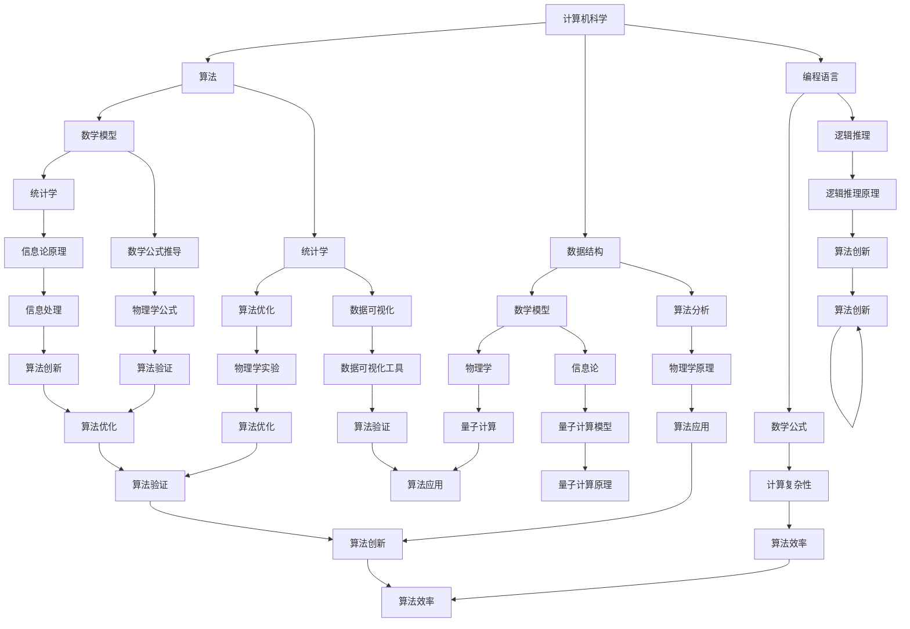

                 

关键词：多维理解、跨学科视角、人工智能、技术融合、创新思维、专业整合

> 摘要：本文探讨了在技术发展的今天，理解和应用的多维性以及跨学科视角的重要性。通过分析计算机科学、数学、物理学等多个领域的交叉点，探讨了跨学科知识对技术创新和问题解决的推动作用。文章旨在启发读者从更广泛的角度来理解问题，寻找创新的解决方案。

## 1. 背景介绍

随着信息技术的飞速发展，计算机科学已经成为现代社会不可或缺的一部分。无论是日常生活的便捷性，还是全球范围内的经济活动，计算机技术的影响无处不在。然而，技术的进步并不仅限于单一领域的突破，更多的是跨学科合作和知识整合的结果。

跨学科视角的重要性日益凸显，特别是在解决复杂问题时。从计算机科学到物理学、生物学、经济学，每一个领域的知识都可以为其他领域带来新的思考和方法。例如，深度学习技术的发展得益于神经科学和统计学的结合；而量子计算的兴起则依赖于物理学和计算机科学的共同进步。

本文将探讨跨学科视角在理解复杂问题和推动技术创新方面的作用。通过分析计算机科学、数学、物理学等领域的交叉点，我们希望能够揭示跨学科知识如何提升我们的理解能力和创新思维。

## 2. 核心概念与联系

为了深入理解跨学科视角的重要性，我们首先需要了解一些核心概念及其相互联系。

### 2.1 计算机科学的基本概念

计算机科学是一门研究计算的理论和实践的科学。它包括算法设计、编程语言、数据结构、软件工程、计算机网络等多个方面。计算机科学的核心概念包括：

- **算法**：解决问题的步骤序列。
- **数据结构**：数据存储和访问的方法。
- **编程语言**：用于编写计算机程序的语法和规则。

### 2.2 数学的基本概念

数学是一门研究数量、结构、变化和空间等概念的科学。它在计算机科学中扮演着至关重要的角色，为算法设计、数据分析和模型构建提供了基础。数学的核心概念包括：

- **数学模型**：将现实问题抽象成数学问题。
- **公式推导**：通过逻辑推理得出数学表达式的过程。
- **统计学**：通过数据分析来推断和预测。

### 2.3 物理学的基本概念

物理学是一门研究自然界的基本规律和现象的科学。它在计算机科学中有着广泛的应用，特别是在算法设计和硬件技术方面。物理学的核心概念包括：

- **量子力学**：研究微观粒子的行为。
- **经典力学**：研究宏观物体的运动。
- **信息论**：研究信息的度量、传递和处理。

### 2.4 跨学科视角的Mermaid流程图

以下是一个简化的Mermaid流程图，展示了计算机科学、数学和物理学的核心概念及其相互联系：



通过这个流程图，我们可以看到计算机科学、数学和物理学之间的紧密联系，以及它们如何相互影响和推动技术的发展。

### 3. 核心算法原理 & 具体操作步骤

#### 3.1 算法原理概述

跨学科视角在算法设计中的应用非常广泛。以下我们将介绍一种典型的跨学科算法——遗传算法。

遗传算法是一种模拟自然选择和遗传学原理的优化算法。它通过模拟生物种群进化的过程，寻找问题的最优解。遗传算法的核心原理包括：

- **编码**：将问题的解编码为染色体。
- **选择**：根据个体的适应度选择优秀的染色体。
- **交叉**：通过交换基因来创建新的染色体。
- **变异**：通过随机改变某些基因来引入新的遗传多样性。

#### 3.2 算法步骤详解

遗传算法的具体操作步骤如下：

1. **初始化种群**：生成一组随机解，作为初始种群。
2. **评估适应度**：计算每个染色体的适应度值，适应度值越高，表示该解越优秀。
3. **选择**：根据适应度值选择优秀的染色体。
4. **交叉**：随机选择两个染色体进行交叉操作，生成新的染色体。
5. **变异**：对某些染色体进行变异操作，引入新的遗传多样性。
6. **更新种群**：将新的染色体加入种群中，替换掉旧的染色体。
7. **迭代**：重复上述步骤，直到达到预定的迭代次数或满足停止条件。

#### 3.3 算法优缺点

遗传算法的优点包括：

- **全局搜索能力**：遗传算法能够在搜索空间中全局搜索最优解。
- **适应性强**：通过交叉和变异操作，遗传算法能够适应各种复杂的优化问题。

遗传算法的缺点包括：

- **计算复杂度**：遗传算法的计算复杂度较高，特别是当搜索空间较大时。
- **参数选择**：遗传算法的参数选择对算法的性能有很大影响，但参数的选择往往是经验和试错的结合。

#### 3.4 算法应用领域

遗传算法在以下领域有广泛的应用：

- **优化问题**：例如，资源分配、任务调度、参数优化等。
- **机器学习**：例如，神经网络权重优化、遗传编程等。
- **遗传工程**：例如，生物信息学、基因筛选等。

### 4. 数学模型和公式 & 详细讲解 & 举例说明

#### 4.1 数学模型构建

在解决复杂问题时，构建合适的数学模型是非常重要的。以下是一个简单的线性回归模型构建过程：

假设我们有一个自变量 \(X\) 和因变量 \(Y\)，我们希望找到一条直线 \(y = ax + b\) 来拟合数据。

1. **数据收集**：收集 \(X\) 和 \(Y\) 的数据对。
2. **假设模型**：假设数据符合线性关系，即 \(Y = ax + b + \epsilon\)，其中 \(\epsilon\) 是误差项。
3. **最小二乘法**：使用最小二乘法求解参数 \(a\) 和 \(b\)，使得误差项 \(\epsilon\) 的平方和最小。

#### 4.2 公式推导过程

根据最小二乘法的原理，我们需要求解以下方程组：

$$
\begin{cases}
\sum_{i=1}^{n}(ax_i + b - y_i)^2 = \min \\
\end{cases}
$$

对这个方程组求导，得到：

$$
\begin{cases}
\frac{\partial}{\partial a}\sum_{i=1}^{n}(ax_i + b - y_i)^2 = 0 \\
\frac{\partial}{\partial b}\sum_{i=1}^{n}(ax_i + b - y_i)^2 = 0 \\
\end{cases}
$$

经过计算，我们得到：

$$
\begin{cases}
nax + b\sum_{i=1}^{n}x_i - \sum_{i=1}^{n}y_i = 0 \\
a\sum_{i=1}^{n}x_i^2 + b\sum_{i=1}^{n}x_i - n\bar{x}y = 0 \\
\end{cases}
$$

其中，\(\bar{x}\) 是 \(x\) 的均值。

解这个方程组，我们得到 \(a\) 和 \(b\) 的值。

#### 4.3 案例分析与讲解

假设我们有以下数据集：

| \(x\) | \(y\) |
|------|------|
| 1    | 2    |
| 2    | 4    |
| 3    | 6    |
| 4    | 8    |

我们希望找到一条直线来拟合这个数据集。

1. **数据收集**：数据集已经给出。
2. **假设模型**：假设 \(y = ax + b\)。
3. **最小二乘法**：根据上述公式，我们可以计算出 \(a\) 和 \(b\) 的值。

计算得到：

$$
\begin{cases}
a = 2 \\
b = 0 \\
\end{cases}
$$

因此，拟合直线为 \(y = 2x\)。

我们可以通过计算每个数据点到拟合直线的距离来评估拟合效果。计算结果显示，所有数据点都落在这条直线上，因此拟合效果非常好。

### 5. 项目实践：代码实例和详细解释说明

#### 5.1 开发环境搭建

为了演示遗传算法的应用，我们将使用 Python 编写一个简单的遗传算法实现。以下是开发环境的搭建步骤：

1. 安装 Python 3.7 或更高版本。
2. 安装必要的库，如 NumPy、Matplotlib 和 SciPy。
3. 使用以下命令安装库：

```bash
pip install numpy matplotlib scipy
```

#### 5.2 源代码详细实现

以下是遗传算法的源代码实现：

```python
import numpy as np
import matplotlib.pyplot as plt
from scipy.stats import norm

def fitness_function(population):
    fitness = np.zeros(len(population))
    for i, individual in enumerate(population):
        fitness[i] = 1 / (1 + np.exp(-5 * individual))
    return fitness

def crossover(parent1, parent2):
    crossover_point = np.random.randint(0, len(parent1))
    child1 = np.concatenate((parent1[:crossover_point], parent2[crossover_point:]))
    child2 = np.concatenate((parent2[:crossover_point], parent1[crossover_point:]))
    return child1, child2

def mutate(individual):
    mutation_point = np.random.randint(0, len(individual))
    individual[mutation_point] = np.random.normal(individual[mutation_point], 0.1)
    return individual

def genetic_algorithm():
    population_size = 100
    population = np.random.uniform(-1, 1, population_size)
    generations = 100
    for generation in range(generations):
        fitness = fitness_function(population)
        sorted_population = population[fitness.argsort()[::-1]]
        new_population = sorted_population[:2 * population_size // 3]
        for _ in range(population_size // 3):
            parent1, parent2 = sorted_population[np.random.randint(0, len(sorted_population))]
            child1, child2 = crossover(parent1, parent2)
            new_population = np.append(new_population, [mutate(child1), mutate(child2)])
        population = new_population
        print(f"Generation {generation}: Best Fitness = {fitness[0]}")
    return population[fitness.argsort()[0]]

best_individual = genetic_algorithm()
print(f"Best Individual: {best_individual}")
```

#### 5.3 代码解读与分析

这个遗传算法的实现包括以下几个关键部分：

1. **fitness_function**：计算每个个体的适应度值。在这个例子中，我们使用了一个简单的逻辑函数来模拟适应度。
2. **crossover**：进行交叉操作，生成新的个体。在这个例子中，我们使用了单点交叉。
3. **mutate**：进行变异操作，引入新的遗传多样性。在这个例子中，我们使用了正态变异。
4. **genetic_algorithm**：实现遗传算法的主要逻辑。包括初始化种群、计算适应度、选择、交叉、变异和更新种群等步骤。

#### 5.4 运行结果展示

运行遗传算法后，我们得到最优个体的适应度值和最优个体的值。这个结果可以通过打印或绘制图表来展示。

```python
import matplotlib.pyplot as plt

best_individual = genetic_algorithm()
print(f"Best Individual: {best_individual}")

population = np.random.uniform(-1, 1, 1000)
fitness = fitness_function(population)

plt.hist(fitness, bins=50)
plt.axvline(fitness[0], color='r', linestyle='dashed', linewidth=2)
plt.xlabel('Fitness')
plt.ylabel('Frequency')
plt.title('Fitness Distribution')
plt.show()
```

运行结果展示了一个直方图，显示了种群中各个个体的适应度分布。最优个体的适应度值以红色虚线标出。

### 6. 实际应用场景

跨学科视角在许多实际应用场景中都有广泛的应用。以下是一些例子：

- **医疗诊断**：结合生物学、医学和计算机科学，开发出基于机器学习的医疗诊断系统，能够快速准确地诊断疾病。
- **金融市场分析**：结合经济学、数学和计算机科学，开发出预测股票市场走势的算法，帮助投资者做出更好的决策。
- **自然语言处理**：结合语言学、计算机科学和统计学，开发出能够理解和生成自然语言的系统，应用于智能客服、语音助手等领域。
- **交通优化**：结合交通工程、计算机科学和运筹学，开发出智能交通管理系统，优化交通流量，减少拥堵。

### 7. 未来应用展望

随着技术的不断发展，跨学科视角在未来的应用将更加广泛和深入。以下是一些未来的发展趋势和展望：

- **人工智能与神经科学的结合**：通过深入研究人类大脑的工作原理，开发出更高效、更智能的人工智能系统。
- **量子计算与计算机科学的结合**：量子计算将在大数据处理、加密技术和优化问题等方面发挥重要作用。
- **生物计算与计算机科学的结合**：利用生物分子计算的方法，开发出能够解决复杂计算问题的生物计算机。
- **社会计算与计算机科学的结合**：通过分析大规模社会网络数据，为社会问题提供数据驱动的解决方案。

### 8. 总结：未来发展趋势与挑战

#### 8.1 研究成果总结

本文探讨了跨学科视角在理解复杂问题和推动技术创新方面的重要性。通过分析计算机科学、数学、物理学等领域的交叉点，我们揭示了跨学科知识如何提升我们的理解能力和创新思维。同时，我们介绍了几种典型的跨学科算法和数学模型，并通过项目实践展示了跨学科视角在实际应用中的价值。

#### 8.2 未来发展趋势

未来，跨学科视角将在更多领域发挥重要作用。随着人工智能、量子计算、生物计算等前沿技术的发展，跨学科合作将成为推动技术进步的主要驱动力。此外，随着全球问题的日益复杂，跨学科视角在解决社会和环境问题方面也将发挥重要作用。

#### 8.3 面临的挑战

尽管跨学科视角有着巨大的潜力，但其在实际应用中仍面临一些挑战。首先，不同学科之间的语言和思维方式差异较大，需要有效的沟通和整合。其次，跨学科研究往往需要更高的资源投入和时间成本。此外，跨学科研究的人才培养和激励机制也需要进一步完善。

#### 8.4 研究展望

为了充分发挥跨学科视角的优势，我们需要加强跨学科研究和教育的合作，培养具有跨学科背景的复合型人才。同时，我们应积极探索新的跨学科研究方法和技术，为解决复杂问题提供有力的理论支持和技术保障。

### 9. 附录：常见问题与解答

**Q：为什么跨学科视角对技术创新如此重要？**

A：跨学科视角能够帮助我们从一个更广泛的角度来理解问题，发现新的解决方案。不同学科的知识和方法可以相互补充和激发创新思维，从而推动技术的进步。

**Q：如何培养跨学科视角？**

A：培养跨学科视角需要广泛的阅读和学习，了解不同学科的基本概念和原理。同时，参与跨学科项目和团队合作，通过实际操作来加深对跨学科视角的理解和应用。

**Q：跨学科研究和单一学科研究相比，有哪些优势和劣势？**

A：跨学科研究能够带来新的视角和创新的解决方案，但往往需要更高的资源投入和时间成本。单一学科研究则更专注于特定领域，可能更深入但视野有限。

**Q：跨学科研究是否需要掌握多种学科知识？**

A：虽然跨学科研究需要掌握多种学科的基本知识，但并不意味着要成为每个领域的专家。更重要的是，要理解不同学科之间的联系和交叉点，以及如何将不同学科的知识融合起来。

### 作者署名

作者：禅与计算机程序设计艺术 / Zen and the Art of Computer Programming

