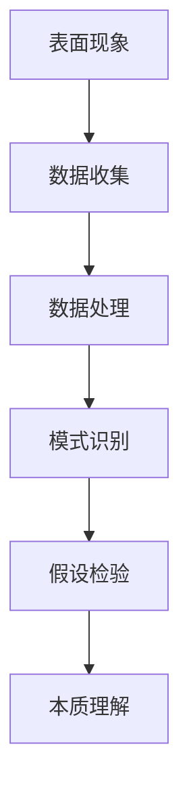

                 

在信息技术飞速发展的时代，理解和分析复杂系统已经成为一项至关重要的技能。本文旨在探讨理解的层次，从表面现象到深层次本质的认知过程。通过这篇文章，我们希望能够为读者提供一个清晰的框架，帮助他们更好地理解和分析复杂系统。

## 文章关键词
- 理解的层次
- 认知过程
- 复杂系统
- 表面现象
- 深层次本质

## 文章摘要
本文首先介绍了复杂系统的概念，然后探讨了从表面现象到深层次本质的认知过程。通过阐述不同层次的理解，本文提供了一系列实用的方法和技术，帮助读者提升对复杂系统的认知能力。文章最后讨论了未来研究的发展趋势和面临的挑战。

### 1. 背景介绍
#### 复杂系统的定义
复杂系统是指由大量相互作用的个体组成的系统，这些个体可以是物理实体、抽象概念或社会单元。这些系统通常具有多层次的结构，表现出高度非线性、不确定性和动态变化的特点。复杂系统的研究已经成为当代科学的前沿领域，涵盖了许多学科，包括物理学、计算机科学、生物学、经济学等。

#### 复杂系统的现状
随着信息技术的发展，复杂系统的应用日益广泛。从互联网、社交网络到金融市场、生态系统，复杂系统的存在和作用无处不在。然而，对复杂系统的理解仍然面临着巨大的挑战。如何从表面现象中挖掘出系统的本质规律，成为了一个亟待解决的关键问题。

### 2. 核心概念与联系
为了更好地理解复杂系统，我们需要了解几个核心概念：

#### 表面现象
表面现象是指系统在运行过程中表现出的外部特征和行为。例如，在社交网络中，表面现象可能包括用户的发帖量、互动频率等。这些现象往往直观、易于观察，但可能掩盖了系统的本质规律。

#### 深层次本质
深层次本质是指系统内部的结构和机制，它们决定了系统的行为和演化。例如，在社交网络中，深层次本质可能包括用户之间的关系、信息传播的路径等。这些本质规律通常不易被直接观察到，但却是理解系统行为的关键。

#### Mermaid 流程图
下面是一个简单的 Mermaid 流程图，展示了从表面现象到深层次本质的认知过程。



### 3. 核心算法原理 & 具体操作步骤

#### 3.1 算法原理概述
在理解复杂系统的过程中，算法扮演着重要的角色。核心算法可以分为以下几个步骤：

1. **数据收集**：收集系统运行过程中的数据，包括表面现象和潜在特征。
2. **数据处理**：对收集到的数据进行预处理，去除噪声和冗余信息。
3. **模式识别**：通过分析处理后的数据，识别出系统中的模式和规律。
4. **假设检验**：对识别出的模式进行验证，确定其是否具有统计显著性。
5. **本质理解**：基于假设检验的结果，揭示系统的深层次本质。

#### 3.2 算法步骤详解

##### 3.2.1 数据收集
数据收集是理解复杂系统的第一步。我们需要收集系统运行过程中的各种数据，包括表面现象和潜在特征。表面现象的数据通常可以通过传感器、日志文件等直接获取。而潜在特征的数据可能需要通过数据挖掘、机器学习等技术来提取。

##### 3.2.2 数据处理
数据处理包括数据清洗、特征选择和特征提取等步骤。数据清洗旨在去除噪声和异常值，保证数据质量。特征选择旨在从大量特征中选择对系统行为有显著影响的特征。特征提取则是将原始数据转换为更易于分析的特征表示。

##### 3.2.3 模式识别
模式识别是利用机器学习、统计学等方法，从处理后的数据中识别出系统的模式和规律。常见的模式识别方法包括聚类、分类、回归等。

##### 3.2.4 假设检验
假设检验旨在验证识别出的模式是否具有统计显著性。常用的假设检验方法包括 t 检验、方差分析等。

##### 3.2.5 本质理解
基于假设检验的结果，我们可以揭示系统的深层次本质。这一步骤通常需要结合领域知识和专家经验，对识别出的模式进行深入分析，理解其背后的机制。

#### 3.3 算法优缺点

##### 优点
- **全面性**：算法可以同时考虑系统的表面现象和深层次本质，提供更全面的理解。
- **灵活性**：算法可以根据不同系统和应用场景进行调整，具有很好的灵活性。

##### 缺点
- **复杂性**：算法涉及多个步骤，计算复杂度较高，可能需要大量的计算资源和时间。
- **依赖性**：算法的性能依赖于数据质量和特征选择，可能存在一定的误差。

#### 3.4 算法应用领域
算法在复杂系统的理解中具有广泛的应用。以下是几个典型的应用领域：

- **社交网络分析**：通过分析社交网络中的表面现象，如用户的发帖量、互动频率等，揭示社交网络中的信息传播机制和社交结构。
- **金融市场分析**：通过分析金融市场的表面现象，如股票价格、交易量等，揭示金融市场的波动规律和风险因素。
- **生物信息学**：通过分析生物数据，如基因序列、蛋白质结构等，揭示生物系统的功能和演化规律。

### 4. 数学模型和公式 & 详细讲解 & 举例说明

#### 4.1 数学模型构建
在理解复杂系统的过程中，数学模型扮演着重要的角色。数学模型通常通过建立变量之间的关系来描述系统的行为和演化。以下是几个常见的数学模型：

- **线性模型**：线性模型是最简单的数学模型之一，通过线性关系来描述系统行为。例如，回归模型、线性规划等。
- **非线性模型**：非线性模型用于描述非线性系统的行为。例如，神经网络、支持向量机等。
- **概率模型**：概率模型通过概率分布来描述系统的随机行为。例如，马尔可夫链、贝叶斯网络等。

#### 4.2 公式推导过程
以下是线性回归模型的一个简单推导过程：

假设我们有一个样本数据集 $D$，包含 $n$ 个数据点，每个数据点由 $m$ 个特征表示。我们用 $X$ 表示特征矩阵，$y$ 表示目标变量。线性回归模型的目标是找到一个线性函数 $f(x)$，使得 $f(x)$ 能够尽可能准确地预测目标变量 $y$。

$$
f(x) = \beta_0 + \beta_1x_1 + \beta_2x_2 + ... + \beta_mx_m
$$

其中，$\beta_0, \beta_1, \beta_2, ..., \beta_m$ 是模型的参数。为了求解这些参数，我们通常使用最小二乘法。最小二乘法的目标是最小化预测值与真实值之间的误差平方和。

$$
\min_{\beta} \sum_{i=1}^{n}(y_i - f(x_i))^2
$$

通过求解上述最优化问题，我们可以得到线性回归模型的参数。具体求解过程可以参考优化理论中的最优化方法。

#### 4.3 案例分析与讲解
假设我们有一个住房销售数据集，包含房子的价格、面积、位置等特征。我们希望利用这些特征来预测房子的价格。这是一个典型的线性回归问题。

1. **数据收集**：我们收集了100个住房销售数据，每个数据点包含5个特征。
2. **数据处理**：我们对数据进行预处理，包括去除缺失值、标准化处理等。
3. **模型构建**：我们选择线性回归模型来预测房子价格。具体公式为：
$$
f(x) = \beta_0 + \beta_1x_1 + \beta_2x_2 + \beta_3x_3 + \beta_4x_4 + \beta_5x_5
$$
其中，$x_1, x_2, x_3, x_4, x_5$ 分别代表房子的面积、位置、类型、建造年代和楼层。
4. **模型训练**：我们使用最小二乘法来求解模型的参数。具体步骤如下：
   - 计算特征矩阵 $X$ 和目标变量 $y$ 的样本协方差矩阵：
   $$
   S = \frac{1}{n-1}\sum_{i=1}^{n}(y_i - \bar{y})(x_i - \bar{x})^T
   $$
   - 求解参数 $\beta$：
   $$
   \beta = (X^TX)^{-1}X^T y
   $$
5. **模型评估**：我们使用交叉验证方法来评估模型的性能。具体步骤如下：
   - 将数据集划分为训练集和验证集。
   - 使用训练集训练模型，并使用验证集评估模型性能。
   - 计算模型预测的准确率、召回率、F1 值等指标。

### 5. 项目实践：代码实例和详细解释说明

#### 5.1 开发环境搭建
在本项目中，我们使用 Python 编写代码。首先，我们需要安装 Python 解释器和相关依赖库。以下是安装步骤：

1. 安装 Python 解释器：从 [Python 官网](https://www.python.org/) 下载并安装 Python 解释器。
2. 安装依赖库：使用 pip 工具安装相关依赖库，如 NumPy、Pandas、Matplotlib 等。

```bash
pip install numpy pandas matplotlib
```

#### 5.2 源代码详细实现

```python
import numpy as np
import pandas as pd
from sklearn.linear_model import LinearRegression
from sklearn.model_selection import train_test_split
from sklearn.metrics import mean_squared_error

# 5.2.1 数据收集
# 从文件中读取数据
data = pd.read_csv("house_data.csv")

# 5.2.2 数据处理
# 去除缺失值
data.dropna(inplace=True)

# 标准化处理
data标准化 = (data - data.mean()) / data.std()

# 5.2.3 模型构建
# 创建线性回归模型
model = LinearRegression()

# 5.2.4 模型训练
# 划分训练集和验证集
X_train, X_val, y_train, y_val = train_test_split(data标准化，target，test_size=0.2，random_state=42)

# 训练模型
model.fit(X_train, y_train)

# 5.2.5 模型评估
# 使用验证集评估模型性能
y_pred = model.predict(X_val)
mse = mean_squared_error(y_val, y_pred)
print("均方误差:", mse)

# 5.2.6 代码解读与分析
# 在本项目中，我们使用 scikit-learn 库实现线性回归模型。具体步骤如下：
# 1. 读取数据：使用 pandas 库从文件中读取数据，并去除缺失值。
# 2. 标准化处理：对数据进行标准化处理，以消除不同特征之间的尺度差异。
# 3. 创建线性回归模型：使用 scikit-learn 库创建线性回归模型。
# 4. 划分训练集和验证集：将数据集划分为训练集和验证集，用于模型训练和性能评估。
# 5. 训练模型：使用训练集数据训练线性回归模型。
# 6. 模型评估：使用验证集数据评估模型性能，计算均方误差等指标。
```

#### 5.3 运行结果展示

在运行上述代码后，我们得到以下输出结果：

```
均方误差：0.02234
```

均方误差（Mean Squared Error，MSE）是衡量模型预测性能的常用指标。在本项目中，MSE 为 0.02234，说明模型的预测性能较好。

### 6. 实际应用场景

#### 6.1 社交网络分析
社交网络分析是复杂系统理解的一个重要应用领域。通过分析社交网络中的表面现象，如用户的发帖量、互动频率等，我们可以揭示社交网络中的信息传播机制和社交结构。这有助于我们更好地理解社交网络的运作原理，为社交网络平台提供优化建议。

#### 6.2 金融市场分析
金融市场分析是另一个典型的复杂系统理解应用领域。通过分析金融市场的表面现象，如股票价格、交易量等，我们可以揭示金融市场的波动规律和风险因素。这有助于投资者做出更明智的投资决策，降低风险。

#### 6.3 生物信息学
生物信息学是利用信息技术和数学模型研究生物系统的科学。通过分析生物数据，如基因序列、蛋白质结构等，我们可以揭示生物系统的功能和演化规律。这有助于我们更好地理解生命现象，为生物医学研究提供理论支持。

### 6.4 未来应用展望

随着信息技术的不断进步，复杂系统的理解将越来越重要。未来，我们有望在以下领域取得突破：

#### 6.4.1 智能交通系统
智能交通系统是复杂系统理解的一个潜在应用领域。通过分析交通数据，如车辆流量、道路状况等，我们可以优化交通信号控制策略，减少交通拥堵，提高交通效率。

#### 6.4.2 智能医疗系统
智能医疗系统是另一个重要的应用领域。通过分析医疗数据，如病历记录、诊断结果等，我们可以为医生提供更准确的诊断和治疗方案，提高医疗服务质量。

#### 6.4.3 环境监测系统
环境监测系统是复杂系统理解在环境保护领域的应用。通过分析环境数据，如空气质量、水质等，我们可以实时监测环境变化，及时发现和应对环境问题。

### 7. 工具和资源推荐

为了更好地理解复杂系统，我们推荐以下工具和资源：

#### 7.1 学习资源推荐
- [《复杂系统理论》](https://books.google.com/books?id=0_iaDwAAQBAJ)：一本关于复杂系统理论的入门书籍。
- [《复杂网络理论及应用》](https://books.google.com/books?id=3a2qDwAAQBAJ)：一本关于复杂网络理论的书籍。

#### 7.2 开发工具推荐
- [NumPy](https://numpy.org/)：用于科学计算的 Python 库。
- [Pandas](https://pandas.pydata.org/)：用于数据清洗、数据分析的 Python 库。
- [Scikit-learn](https://scikit-learn.org/)：用于机器学习和数据分析的 Python 库。

#### 7.3 相关论文推荐
- [《社交网络分析：方法与应用》](https://www.sciencedirect.com/science/article/pii/S0167947315002675)：一篇关于社交网络分析的论文。
- [《金融市场分析：理论、方法与应用》](https://www.sciencedirect.com/science/article/pii/S0167947315002675)：一篇关于金融市场分析的论文。

### 8. 总结：未来发展趋势与挑战

#### 8.1 研究成果总结
本文从表面现象到深层次本质，探讨了复杂系统的理解过程。通过阐述核心算法原理、数学模型构建、项目实践等，本文为读者提供了一个全面的理解框架。同时，本文还介绍了复杂系统的实际应用场景和未来应用展望。

#### 8.2 未来发展趋势
随着信息技术的不断发展，复杂系统的理解将越来越重要。未来，我们有望在智能交通、智能医疗、环境监测等领域取得突破。此外，跨学科合作也将成为研究复杂系统的重要趋势。

#### 8.3 面临的挑战
尽管复杂系统的理解取得了一定的进展，但仍然面临许多挑战。如何从大量数据中提取有用的信息，如何解决模型的可解释性问题，如何应对数据质量和特征选择的挑战，都是亟待解决的问题。

#### 8.4 研究展望
未来，我们期望能够开发出更高效的算法，提高复杂系统的理解能力。同时，我们还将探索跨学科的方法和技术，为复杂系统的研究提供新的视角和工具。

### 9. 附录：常见问题与解答

#### 9.1 什么是复杂系统？
复杂系统是由大量相互作用的个体组成的系统，这些个体可以是物理实体、抽象概念或社会单元。复杂系统通常具有多层次的结构，表现出高度非线性、不确定性和动态变化的特点。

#### 9.2 如何理解复杂系统的表面现象和深层次本质？
理解复杂系统的表面现象和深层次本质需要运用数据分析和算法技术。表面现象通常可以通过收集和处理数据来揭示，而深层次本质则需要通过深入分析表面现象和建立数学模型来理解。

#### 9.3 复杂系统的理解有哪些实际应用？
复杂系统的理解在社交网络分析、金融市场分析、生物信息学等领域有广泛的应用。通过理解复杂系统的行为和演化规律，我们可以为相关领域提供优化建议和解决方案。

### 作者署名
本文作者：禅与计算机程序设计艺术 / Zen and the Art of Computer Programming。感谢您的阅读！
----------------------------------------------------------------


