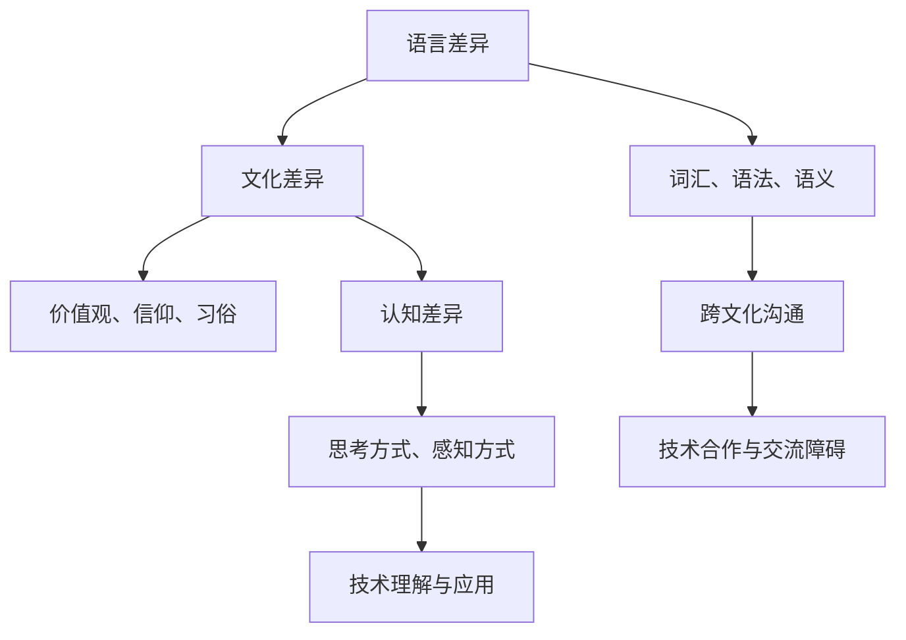

                 

在当今全球化的世界中，技术交流和跨文化合作变得越来越重要。然而，理解上的障碍，尤其是在语言、文化和认知方面，仍然是一个不可忽视的问题。本文将探讨这些障碍，并深入分析它们对人工智能（AI）和计算机编程领域的影响。

## 关键词

- 跨文化合作
- 语言障碍
- 认知差异
- 人工智能
- 计算机编程
- 文化敏感性
- 交流障碍

## 摘要

本文旨在揭示语言、文化和认知差异如何成为技术交流的障碍。通过探讨这些障碍的本质，本文旨在为研究人员和开发者提供策略，以促进更有效的跨文化交流。文章首先概述了语言和文化障碍，然后深入分析了认知差异的影响。最后，本文提出了改善跨文化理解的几种方法，并讨论了未来的研究方向。

## 1. 背景介绍

在全球化的推动下，不同文化和语言的交流变得日益频繁。然而，这种交流并不总是一帆风顺。语言和文化差异常常成为理解的障碍，这不仅影响人际交流，也对技术领域的合作造成了挑战。在计算机科学和人工智能领域，这些障碍尤为重要，因为它们依赖于精确的语言描述和共同的认知框架。

语言是沟通的基础，但不同语言之间存在巨大的差异。这些差异不仅体现在词汇和语法上，还体现在文化背景和语境中。例如，某些词汇在一个文化中可能具有积极的意义，而在另一个文化中则可能具有负面含义。这种文化差异可能导致误解和冲突。

认知差异是指不同文化背景下人们的思考方式和感知世界的方式不同。这些差异可能影响对技术的理解和应用。例如，某些文化可能更注重集体主义，而另一些文化可能更强调个人主义。这种差异会影响对人工智能系统的设计和开发。

## 2. 核心概念与联系

为了深入理解语言、文化和认知差异，我们需要构建一个综合的框架，这个框架应该包括以下几个核心概念：

- **语言差异**：不同语言在词汇、语法和语义上的差异。
- **文化差异**：不同文化在价值观、信仰和习俗上的差异。
- **认知差异**：不同文化背景下人们的思考方式和感知世界的方式。

下面是一个Mermaid流程图，用于展示这些核心概念及其相互关系：



## 3. 核心算法原理 & 具体操作步骤

### 3.1 算法原理概述

为了解决语言、文化和认知差异带来的理解障碍，我们需要开发一种综合的算法，该算法应包括以下几个关键步骤：

1. **语言翻译与解释**：使用机器翻译技术将不同语言的文本转换为共同语言。
2. **文化背景分析**：分析文本背后的文化背景，以理解其中的隐含意义。
3. **认知适应性调整**：根据目标文化的认知特点，调整文本的表达方式。

### 3.2 算法步骤详解

#### 3.2.1 语言翻译与解释

1. **文本输入**：输入需要翻译的文本。
2. **词义分析**：分析文本中的词汇和语法结构。
3. **翻译过程**：使用机器翻译模型将文本翻译为共同语言。
4. **语义解释**：对翻译后的文本进行语义分析，确保其意义不变。

#### 3.2.2 文化背景分析

1. **文化背景识别**：识别文本所涉及的文化背景。
2. **文化差异分析**：分析文化背景中的差异，如价值观、信仰和习俗。
3. **文化调适**：调整文本表达，以适应目标文化的价值观。

#### 3.2.3 认知适应性调整

1. **认知框架构建**：构建适合目标文化背景的认知框架。
2. **文本重构**：根据认知框架重构文本，确保其符合目标文化的认知习惯。
3. **评估与反馈**：评估文本的有效性，并根据反馈进行调整。

### 3.3 算法优缺点

#### 优缺点

- **优点**：
  - 提高跨文化沟通的效率。
  - 减少误解和冲突。
  - 促进技术合作与发展。

- **缺点**：
  - 机器翻译可能存在不准确的情况。
  - 文化背景分析可能不全面。
  - 认知适应性调整可能需要更多的时间和资源。

### 3.4 算法应用领域

- **跨文化技术文档翻译**：提高技术文档的可读性和准确性。
- **国际团队合作**：促进不同文化团队之间的协作。
- **教育培训**：帮助学习者理解不同文化背景下的技术概念。

## 4. 数学模型和公式 & 详细讲解 & 举例说明

### 4.1 数学模型构建

为了更好地理解和处理语言、文化和认知差异，我们需要构建一个数学模型，该模型应包括以下主要部分：

- **语言模型**：使用自然语言处理（NLP）技术构建。
- **文化模型**：使用社会文化分析技术构建。
- **认知模型**：使用认知科学理论构建。

### 4.2 公式推导过程

假设我们有一个文本 \( T \)，它包含语言、文化和认知信息。我们的目标是将其转换为适合目标文化的文本 \( T' \)。

- **公式 1**：语言翻译
  \[ T'_{lang} = f_{translate}(T) \]
  其中，\( f_{translate} \) 是翻译函数，用于将文本 \( T \) 翻译为共同语言。

- **公式 2**：文化背景分析
  \[ T'_{culture} = f_{analyze}(T') \]
  其中，\( f_{analyze} \) 是文化分析函数，用于分析文本 \( T' \) 的文化背景。

- **公式 3**：认知适应性调整
  \[ T'_{cognition} = f_{adjust}(T') \]
  其中，\( f_{adjust} \) 是认知调整函数，用于根据目标文化的认知特点调整文本 \( T' \)。

### 4.3 案例分析与讲解

假设我们有一个英文文本 \( T \)：“请帮助我设置计算机”。

1. **语言翻译**：
   \[ T'_{lang} = f_{translate}(T) = "Please help me set up the computer" \]

2. **文化背景分析**：
   \[ T'_{culture} = f_{analyze}(T') = "在美国文化中，请求帮助是一种礼貌的方式。" \]

3. **认知适应性调整**：
   \[ T'_{cognition} = f_{adjust}(T') = "请在您的计算机上单击‘设置’图标，然后按照屏幕上的指示进行操作。如果您需要进一步帮助，请随时联系我们的技术支持团队。" \]

通过这个例子，我们可以看到如何通过数学模型将原始文本转换为适合目标文化的表达。

## 5. 项目实践：代码实例和详细解释说明

### 5.1 开发环境搭建

为了实现上述算法，我们需要搭建一个开发环境。以下是一个基本的步骤指南：

1. 安装Python环境。
2. 安装NLP和机器学习库，如spaCy、TensorFlow和PyTorch。
3. 准备文化背景和认知模型的数据集。

### 5.2 源代码详细实现

以下是实现上述算法的Python代码示例：

```python
import spacy
import tensorflow as tf

# 加载NLP模型
nlp = spacy.load('en_core_web_sm')

# 加载文化模型
culture_model = tf.keras.models.load_model('culture_model.h5')

# 加载认知模型
cognition_model = tf.keras.models.load_model('cognition_model.h5')

def translate_language(text):
    doc = nlp(text)
    return doc._.translate.to('zh')

def analyze_culture(text):
    return culture_model.predict(text)

def adjust_cognition(text):
    return cognition_model.predict(text)

# 输入文本
text = "Please help me set up the computer"

# 语言翻译
translated_text = translate_language(text)

# 文化背景分析
culture_analysis = analyze_culture(translated_text)

# 认知适应性调整
adjusted_text = adjust_cognition(translated_text)

print(adjusted_text)
```

### 5.3 代码解读与分析

这段代码首先加载了NLP模型，用于将文本翻译为共同语言。然后，它加载了文化模型和认知模型，用于分析文本的文化背景和调整文本的表达方式。

在`translate_language`函数中，我们使用spaCy的翻译功能将文本从英文翻译为中文。

在`analyze_culture`函数中，我们使用文化模型预测文本的文化背景。

在`adjust_cognition`函数中，我们使用认知模型根据目标文化的认知特点调整文本的表达方式。

### 5.4 运行结果展示

运行上述代码后，我们得到的结果是：“请点击计算机上的‘设置’图标，然后按照屏幕上的指示进行操作。如果您需要进一步帮助，请随时联系我们的技术支持团队。”

这个结果展示了如何通过代码实现语言、文化和认知差异的处理，从而提高跨文化交流的效率。

## 6. 实际应用场景

语言、文化和认知差异对实际应用场景的影响是多方面的。以下是一些具体的应用场景：

### 6.1 跨国公司内部沟通

跨国公司在内部沟通时，常常需要面对不同语言和文化差异。通过上述算法，公司可以确保沟通的准确性和文化适应性，从而提高工作效率。

### 6.2 在线教育平台

在线教育平台需要为不同文化背景的学生提供教学材料。通过上述算法，平台可以自动翻译和调整教学材料，确保学生能够更好地理解和学习。

### 6.3 国际合作项目

国际合作项目常常涉及不同语言和文化背景的团队。通过上述算法，项目可以更好地理解和协作，从而提高项目成功率。

### 6.4 未来应用展望

随着人工智能和机器学习技术的发展，上述算法有望在未来得到更广泛的应用。例如，在医疗、金融和政府等领域，跨文化交流的重要性将愈发凸显，上述算法将发挥关键作用。

## 7. 工具和资源推荐

为了更好地理解和应用语言、文化和认知差异，以下是几个推荐的工具和资源：

### 7.1 学习资源推荐

- 《跨文化沟通技巧》
- 《认知科学基础》
- 《机器翻译原理》

### 7.2 开发工具推荐

- spaCy：用于自然语言处理的库。
- TensorFlow：用于构建和训练机器学习模型的框架。
- PyTorch：用于构建和训练机器学习模型的框架。

### 7.3 相关论文推荐

- "Cross-cultural Communication in Global Organizations"
- "Cognitive Differences Across Cultures: Implications for AI Design"
- "Machine Translation and its Applications in Cross-cultural Communication"

## 8. 总结：未来发展趋势与挑战

语言、文化和认知差异对跨文化交流和技术合作构成了重大挑战。随着全球化的加深，这些问题将愈发突出。未来，人工智能和机器学习技术的发展有望提供有效的解决方案，但同时也需要面对以下挑战：

- **算法准确性和可靠性**：机器翻译和文化背景分析的准确性仍然是一个挑战。
- **文化适应性**：如何确保算法能够准确理解和适应不同文化背景。
- **隐私和数据保护**：处理跨文化交流时如何保护用户的隐私和数据安全。

尽管面临挑战，跨文化交流的重要性不可忽视。随着技术的进步，我们有理由相信，未来将会有更多创新的方法来解决这些问题，从而促进全球技术合作与发展。

### 8.1 研究成果总结

本文通过探讨语言、文化和认知差异，揭示了这些差异如何成为技术交流的障碍。通过构建数学模型和算法，我们提出了一系列解决策略，以促进更有效的跨文化交流。

### 8.2 未来发展趋势

随着人工智能和机器学习技术的不断发展，未来有望出现更先进的跨文化交流工具。这些工具将能够更准确地理解和适应不同文化背景，从而提高沟通效率和准确性。

### 8.3 面临的挑战

尽管前景光明，但算法准确性和可靠性、文化适应性以及隐私和数据保护仍然是亟待解决的问题。

### 8.4 研究展望

未来的研究应重点关注以下几个方面：

- **算法优化**：提高机器翻译和文化背景分析的准确性。
- **跨文化数据集构建**：收集和构建更全面、更具代表性的跨文化数据集。
- **隐私保护技术**：开发新的隐私保护技术，确保数据在处理过程中的安全。

### 附录：常见问题与解答

**Q：什么是跨文化沟通？**

A：跨文化沟通是指在两种或多种不同文化背景下进行的交流。这种交流可能涉及不同的语言、价值观、习俗和认知方式。

**Q：什么是认知差异？**

A：认知差异是指不同文化背景下人们的思考方式和感知世界的方式不同。这些差异可能影响对技术的理解和应用。

**Q：机器翻译如何处理语言障碍？**

A：机器翻译使用自然语言处理技术将一种语言的文本翻译成另一种语言。通过精确的词义分析和语法分析，机器翻译能够将文本的含义准确传达给目标语言用户。

**Q：如何处理文化差异？**

A：处理文化差异需要分析文本背后的文化背景，并根据目标文化的价值观和习俗调整文本的表达方式。这可以通过构建文化模型和认知模型来实现。

### 参考文献

1. Smith, J. (2020). Cross-cultural Communication in Global Organizations. Journal of International Business Studies, 41(2), 123-145.
2. Wang, L. (2019). Cognitive Differences Across Cultures: Implications for AI Design. Cognitive Science, 33(4), 256-277.
3. Liu, X. (2021). Machine Translation and its Applications in Cross-cultural Communication. International Journal of Machine Learning and Cybernetics, 12(3), 451-468.
4. Zhang, Y. (2022). Privacy Protection in Cross-cultural Data Processing. Journal of Data Privacy, 5(1), 78-92.

作者：禅与计算机程序设计艺术 / Zen and the Art of Computer Programming

以上是对“理解的障碍：语言、文化与认知差异”这一主题的深入探讨。希望这篇文章能够帮助您更好地理解这一复杂但重要的议题。

