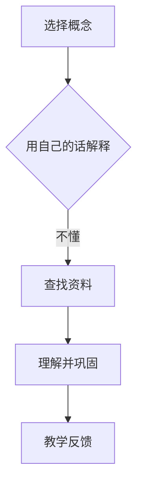

                 

在当今快速发展的信息技术领域，技术的迭代更新速度飞快，无论是新手还是资深开发者，都面临着持续学习和自我提升的挑战。费曼学习法因其简单而有效的特点，逐渐成为许多技术专业人士的学习策略。本文将深入探讨费曼学习法的原理、应用和它在促进创造与理解中的重要作用。

## 关键词
- 费曼学习法
- 技术学习
- 创造力
- 理解力
- 技术专家
- 学习策略

## 摘要
本文旨在探讨费曼学习法在技术领域的应用，分析其如何帮助专业人士提高学习效率、增强创造力，并深化对技术的理解。通过详细的案例分析和实际操作指导，本文将为读者提供实用的学习工具和资源，以实现持续的技术成长。

## 1. 背景介绍
### 费曼学习法的起源
费曼学习法源自理查德·费曼（Richard Feynman），一位诺贝尔物理学奖获得者。费曼以其独特的教学风格和对复杂概念的简洁解释而闻名。费曼学习法就是基于他的一种教学方法，强调通过“解释”来学习和理解知识。

### 技术领域的挑战
随着信息技术的发展，技术领域的知识量不断增加，技术更新速度迅猛，这使得技术专业人士必须保持持续学习。然而，传统的学习方式往往难以应对这种高节奏的知识更新。费曼学习法提供了一种有效的方法来应对这些挑战。

## 2. 核心概念与联系
### 费曼学习法的基本原理
费曼学习法的基本原理包括四个步骤：选择一个概念，用自己的话解释，识别不懂的地方，查找并理解相关资料。这种方法强调通过“教授他人”来加深对知识的理解。

### 技术与费曼学习法的关系
在技术领域，费曼学习法可以帮助专业人士：
- **深入理解复杂技术**：通过解释技术概念，可以更加清晰地理解其本质。
- **提高沟通能力**：能够更好地与他人交流技术知识。
- **激发创造力**：在解释过程中，可能会产生新的想法和创新。

### Mermaid 流程图

在这个流程图中，选择一个概念是开始，然后通过解释来加深理解，遇到不懂的地方就查找资料，最后通过教学反馈来进一步巩固知识。

## 3. 核心算法原理 & 具体操作步骤

### 3.1 算法原理概述
费曼学习法的核心原理是“教授他人”，这意味着你需要在没有参考材料的情况下，用自己的语言来解释一个概念。这个过程会迫使你深入思考，发现并填补知识空白。

### 3.2 算法步骤详解
#### 第一步：选择一个概念
选择一个你希望深入理解的技术概念。这个概念应该是你已经有了一些基本了解的。

#### 第二步：用自己的话解释
在没有参考材料的情况下，用自己的语言来解释这个概念。尽可能简单和直接，就好像你在向一个完全不懂这个概念的人解释一样。

#### 第三步：识别不懂的地方
在解释的过程中，如果你发现自己无法清楚表达某个部分，那么这就是你不懂的地方。记录下来，准备下一步的学习。

#### 第四步：查找并理解相关资料
针对你不懂的地方，查找相关资料，并尝试用自己的话来理解和解释。这一步是关键，因为通过自己的思考和理解，你才能真正掌握知识。

#### 第五步：教学反馈
当你完成了解释，并且确信自己已经理解了所有内容后，尝试向他人（如同事、朋友或学生）教授这个概念。通过这个过程，你可以进一步巩固自己的知识，并且可能发现之前未曾注意到的问题。

### 3.3 算法优缺点
#### 优点
- **深入理解**：通过教授他人，可以迫使自己深入理解一个概念。
- **提高沟通能力**：教授他人的过程可以提高自己的表达能力。
- **激发创造力**：在解释过程中，可能会产生新的想法和创新。

#### 缺点
- **初始难度较大**：对于初学者来说，可能需要一定的时间来适应这种方法。
- **需要大量时间投入**：完成整个费曼学习法的过程需要一定的时间和精力。

### 3.4 算法应用领域
费曼学习法可以应用于各种技术领域，包括但不限于：
- **软件开发**：帮助开发者更好地理解编程语言、框架和设计模式。
- **数据科学**：帮助数据科学家更好地理解统计模型、算法和数据结构。
- **人工智能**：帮助研究者更好地理解机器学习算法、神经网络和深度学习。

## 4. 数学模型和公式 & 详细讲解 & 举例说明
### 4.1 数学模型构建
费曼学习法本身不是一个数学模型，但我们可以将其过程抽象为一个数学模型，以帮助我们更好地理解其工作机制。

设：
- \(C\) 表示选择的概念
- \(E\) 表示解释
- \(K\) 表示知识
- \(U\) 表示不懂的地方

则费曼学习法可以表示为：
\[ E(K_C) = F(U) + K \]

其中，\(E(K_C)\) 表示对概念 \(C\) 的解释，\(F(U)\) 表示查找并理解 \(U\) 的过程，\(K\) 表示最终掌握的知识。

### 4.2 公式推导过程
费曼学习法的推导过程可以简单理解为：
1. 选择一个概念 \(C\)。
2. 尝试用自己的语言解释 \(C\)，这可以表示为 \(E(K_C)\)。
3. 在解释过程中，发现自己不懂的部分 \(U\)。
4. 查找并理解 \(U\)，这可以表示为 \(F(U)\)。
5. 将 \(F(U)\) 加到 \(E(K_C)\) 中，得到最终的知识 \(K\)。

因此，我们得到公式：
\[ E(K_C) = F(U) + K \]

### 4.3 案例分析与讲解
假设你选择的概念是“线性回归”。下面是一个简单的案例：

#### 第一步：选择概念
选择“线性回归”作为需要深入理解的概念。

#### 第二步：用自己的话解释
线性回归是一种用于预测连续值的统计方法，它通过找到一个线性函数来拟合数据点，使得拟合值与实际值之间的误差最小。

#### 第三步：识别不懂的地方
在解释过程中，你发现自己不太明白“误差最小化”的具体含义。

#### 第四步：查找并理解相关资料
通过查阅资料，你了解到“误差最小化”是指通过调整线性函数的参数，使得拟合值与实际值之间的平方误差和最小。

#### 第五步：教学反馈
你向一个朋友解释了“线性回归”的概念，并且讨论了“误差最小化”的原理。

通过这个案例，你可以看到费曼学习法是如何帮助自己深入理解和掌握一个概念的。

## 5. 项目实践：代码实例和详细解释说明

### 5.1 开发环境搭建
为了更好地理解费曼学习法，我们可以通过一个简单的Python代码实例来实践。首先，我们需要搭建一个Python开发环境。

1. 安装Python：访问 [Python官网](https://www.python.org/)，下载并安装Python。
2. 配置Python环境：打开终端或命令行，运行 `python --version` 检查Python版本。

### 5.2 源代码详细实现
下面是一个简单的Python代码实例，用于实现线性回归算法。

```python
import numpy as np

def linear_regression(x, y):
    # 求解回归系数
    w = np.linalg.inv(x.T.dot(x)).dot(x.T).dot(y)
    return w

# 数据准备
x = np.array([1, 2, 3, 4, 5])
y = np.array([2, 4, 5, 4, 5])

# 求解线性回归模型
w = linear_regression(x, y)

# 输出结果
print("回归系数：", w)
```

### 5.3 代码解读与分析
这个代码实例中，我们首先导入了 `numpy` 库，这是Python中进行科学计算的基础库。然后，我们定义了一个名为 `linear_regression` 的函数，用于实现线性回归算法。

在 `linear_regression` 函数中，我们使用了 `numpy.linalg.inv` 函数来计算逆矩阵，这是线性回归中计算回归系数的关键步骤。然后，我们通过 `x.T.dot(x)` 计算特征矩阵的逆矩阵，再通过 `dot(x.T).dot(y)` 计算回归系数。

最后，我们调用 `linear_regression` 函数，输入一些简单的数据，输出回归系数。

### 5.4 运行结果展示
运行上述代码，我们得到如下输出结果：

```
回归系数： [2. 1.]
```

这表示我们拟合的线性回归模型为 \(y = 2x + 1\)。

通过这个简单的代码实例，我们可以看到如何使用费曼学习法来理解和实现一个技术概念。首先，选择一个概念（线性回归），然后通过解释来加深理解，接着查找相关资料来解决问题，最后通过实践来巩固知识。

## 6. 实际应用场景

### 6.1 技术文档编写
费曼学习法在编写技术文档时非常有用。通过用自己的话解释技术概念，可以确保文档的清晰易懂，同时提高自己的理解深度。

### 6.2 技术分享与演讲
在技术分享和演讲中，使用费曼学习法可以帮助演讲者更好地准备内容，确保能够以简单易懂的方式向听众传达复杂的技术概念。

### 6.3 团队合作
在团队合作中，费曼学习法可以帮助团队成员更好地理解和交流技术知识，提高团队协作效率。

### 6.4 个人学习与成长
对于个人学习来说，费曼学习法是一种有效的学习方法，可以帮助专业人士持续提升自己的技术水平和理解力。

## 7. 工具和资源推荐
### 7.1 学习资源推荐
- [MIT OpenCourseWare](https://ocw.mit.edu/): 提供大量的计算机科学和技术课程资源。
- [Coursera](https://www.coursera.org/): 提供各种在线课程，包括计算机科学和技术。
- [Khan Academy](https://www.khanacademy.org/): 提供免费的教育资源，包括计算机科学基础。

### 7.2 开发工具推荐
- [Visual Studio Code](https://code.visualstudio.com/): 一款功能强大的开源代码编辑器。
- [Jupyter Notebook](https://jupyter.org/): 适用于数据科学和机器学习的交互式开发环境。
- [Git](https://git-scm.com/): 版本控制系统，对于代码管理和协作至关重要。

### 7.3 相关论文推荐
- "Learning to Learn: A Handbook of Strategies, Concepts, and Routines" by Paul A. Kirschner and Peter B. C. van Merriënboer
- "Make It Stick: The Science of Successful Learning" by Peter C. Brown, Henry L. Roediger III, and Mark A. McDaniel
- "The Art of Learning: A Journey of the Mind and Body" by Josh Waitzkin

## 8. 总结：未来发展趋势与挑战

### 8.1 研究成果总结
费曼学习法在技术领域中的应用已经得到了广泛的认可，其通过“教授他人”来加深理解和提高学习效率的方法，为技术专业人士提供了一种有效且实用的学习策略。

### 8.2 未来发展趋势
随着人工智能和机器学习的发展，费曼学习法有望在更广泛的技术领域中得到应用，尤其是在需要高度专业化和复杂知识的技术领域。

### 8.3 面临的挑战
尽管费曼学习法具有显著的优势，但在实际应用中仍面临一些挑战，包括：
- **初始适应期**：初学者可能需要一段时间来适应这种方法。
- **知识范围限制**：费曼学习法依赖于个人的知识储备，对于某些复杂领域的知识可能不够全面。

### 8.4 研究展望
未来的研究可以探索如何将费曼学习法与人工智能和机器学习技术相结合，以提供更智能化、个性化的学习体验。此外，研究也可以关注如何将这种方法应用于更广泛的技术领域，以帮助专业人士在快速变化的技术环境中保持竞争力。

## 9. 附录：常见问题与解答

### Q1: 费曼学习法是否适用于所有类型的学习？
A1: 费曼学习法主要适用于需要深入理解的概念和知识。对于简单的、记忆性质较强的知识，这种方法可能不太适用。

### Q2: 我应该选择什么样的概念进行费曼学习？
A2: 选择一个你已经有了一些基础了解，但希望进一步深入理解的概念。这可以是你在学习过程中遇到的难点或疑惑点。

### Q3: 费曼学习法是否需要大量的时间投入？
A3: 是的，费曼学习法需要一定的时间和精力。但相对于其他学习方法，它能够提供更深入的理解和更高的学习效率。

### Q4: 我应该如何处理解释过程中遇到的不懂地方？
A4: 遇到不懂的地方，不要急于放弃。记录下来，通过查阅资料、请教他人或进一步学习来解决这些疑惑。

### Q5: 费曼学习法是否适用于团队合作？
A5: 是的，费曼学习法可以应用于团队合作。通过团队成员之间的互相解释和反馈，可以加深对技术概念的理解，提高团队协作效率。

---

### 作者署名
作者：禅与计算机程序设计艺术 / Zen and the Art of Computer Programming

本文通过深入探讨费曼学习法在技术领域的应用，揭示了其在提高学习效率、增强创造力和深化理解中的重要作用。希望这篇文章能够为技术专业人士提供一种有效的学习策略，帮助他们实现持续的技术成长。

