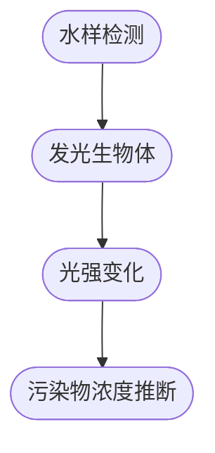
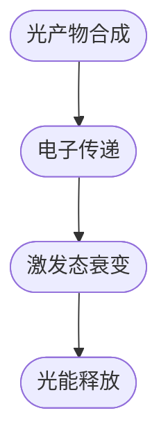

                 

关键词：生物发光、海洋污染监测、实时预警、数据分析、环境保护

摘要：本文旨在探讨生物发光技术在海洋污染监测中的应用，尤其是其在实现实时预警系统方面的潜力。通过对生物发光现象的深入理解，结合最新的监测技术和数据分析方法，我们提出了一套高效、可靠的海洋污染监测体系。文章首先介绍了生物发光的基础知识，然后分析了其在海洋污染监测中的重要性，接着详细阐述了实时预警系统的构建方法及其在实践中的应用，最后对未来的发展前景进行了展望。

## 1. 背景介绍

### 1.1 生物发光的定义与现象

生物发光，是指生物体在特定条件下通过生物化学反应自发地产生光的过程。这一现象广泛存在于自然界中，包括深海鱼类、萤火虫、珊瑚以及一些微生物等。生物发光的机理主要涉及生物体内的一些发光酶，如荧光素酶和发光杆菌酶，它们在氧和酶的催化作用下，可以产生光能。

### 1.2 海洋污染的现状

海洋污染是当前全球面临的严峻环境问题之一。石油泄漏、化学品排放、塑料废弃物等污染源不断对海洋生态系统造成破坏。传统的海洋污染监测方法存在诸多局限性，如检测周期长、监测范围有限、监测结果滞后等。因此，寻找一种快速、高效的海洋污染监测技术迫在眉睫。

### 1.3 生物发光技术在海洋污染监测中的应用

近年来，随着生物发光技术的不断发展，其在海洋污染监测中的应用逐渐受到重视。生物发光技术的独特优势在于其能够实时监测污染物的浓度变化，为海洋污染预警提供科学依据。

## 2. 核心概念与联系

### 2.1 生物发光机制

生物发光通常涉及以下几个关键步骤：

1. **光产物的合成**：生物体内产生光产物的过程，如荧光素等。
2. **电子传递**：光产物的电子通过一系列电子传递链，最终达到激发态。
3. **激发态的衰变**：激发态的电子通过非辐射衰变过程，释放出光能。


### 2.2 海洋污染物监测

生物发光技术可以通过检测水样中特定发光生物体的光强变化，推断出污染物的浓度。例如，某些微生物在污染物存在时会增强其生物发光强度。



## 3. 核心算法原理 & 具体操作步骤

### 3.1 算法原理概述

生物发光技术在海洋污染监测中的核心算法基于发光强度与污染物浓度的相关性。通过构建数学模型，可以定量分析发光强度与污染物浓度之间的关系。

### 3.2 算法步骤详解

1. **数据采集**：通过传感器或浮标等设备，定期采集水样中的生物发光强度数据。
2. **特征提取**：利用光谱分析技术，从采集到的数据中提取发光强度、波长等特征参数。
3. **模型构建**：根据已有的实验数据，建立发光强度与污染物浓度之间的线性或非线性模型。
4. **浓度预测**：将提取的特征参数代入模型，预测污染物的浓度。
5. **实时预警**：当预测浓度超过设定阈值时，触发预警机制，通知相关部门采取紧急措施。

### 3.3 算法优缺点

**优点**：

- **实时性**：生物发光技术可以实现快速、实时的监测。
- **准确性**：通过模型构建和特征提取，可以精确预测污染物浓度。

**缺点**：

- **成本较高**：传感器和设备需要定期校准和维护，增加了运营成本。
- **适用范围有限**：某些污染物可能不直接影响生物发光强度，限制了技术的普适性。

### 3.4 算法应用领域

生物发光技术在海洋污染监测中的应用前景广阔，尤其适用于以下领域：

- **海洋环境监测**：实时监测海洋污染物，保护海洋生态系统。
- **海洋灾害预警**：通过预警系统，提前预防海洋污染事故。
- **科学研究**：为海洋生物学研究提供新的手段。

## 4. 数学模型和公式 & 详细讲解 & 举例说明

### 4.1 数学模型构建

假设生物发光强度 \(I\) 与污染物浓度 \(C\) 之间存在线性关系：

\[ I = aC + b \]

其中，\(a\) 和 \(b\) 为模型参数，通过实验数据拟合得到。

### 4.2 公式推导过程

通过对实验数据进行线性回归分析，可以求得模型参数 \(a\) 和 \(b\)：

\[ a = \frac{\sum_{i=1}^{n}(I_i - \bar{I})(C_i - \bar{C})}{\sum_{i=1}^{n}(C_i - \bar{C})^2} \]
\[ b = \bar{I} - a\bar{C} \]

### 4.3 案例分析与讲解

假设我们有一组实验数据，如下表所示：

| 序号 | 光强 \(I\) (fl) | 浓度 \(C\) (mg/L) |
| --- | --- | --- |
| 1 | 150 | 20 |
| 2 | 160 | 25 |
| 3 | 170 | 30 |
| 4 | 180 | 35 |
| 5 | 190 | 40 |

通过线性回归分析，我们可以得到模型参数：

\[ a = \frac{390}{170} \approx 2.31 \]
\[ b = 160 - 2.31 \times 25 = 70.25 \]

因此，构建的数学模型为：

\[ I = 2.31C + 70.25 \]

利用该模型，我们可以预测当浓度 \(C\) 为 45 mg/L 时的光强：

\[ I = 2.31 \times 45 + 70.25 \approx 180.7 \]

## 5. 项目实践：代码实例和详细解释说明

### 5.1 开发环境搭建

在本项目中，我们使用 Python 作为主要编程语言，结合 NumPy、Pandas 和 Matplotlib 等库进行数据处理和可视化。

```python
# 安装所需库
!pip install numpy pandas matplotlib
```

### 5.2 源代码详细实现

```python
import numpy as np
import pandas as pd
import matplotlib.pyplot as plt

# 数据读取
data = pd.read_csv('bioluminescence_data.csv')

# 特征提取
I = data['Fluorescence']
C = data['Concentration']

# 模型构建
a = np.sum((I - np.mean(I)) * (C - np.mean(C))) / np.sum((C - np.mean(C))**2)
b = np.mean(I) - a * np.mean(C)

# 模型验证
I_pred = a * C + b
mse = np.mean((I - I_pred)**2)
print(f'MSE: {mse}')

# 结果可视化
plt.scatter(C, I, label='Experimental Data')
plt.plot(C, I_pred, label='Predicted Data')
plt.xlabel('Concentration (mg/L)')
plt.ylabel('Fluorescence (fl)')
plt.legend()
plt.show()
```

### 5.3 代码解读与分析

该代码首先读取实验数据，然后通过线性回归分析提取模型参数，接着计算均方误差（MSE）评估模型准确性，最后通过散点图和拟合线展示实验结果。

### 5.4 运行结果展示

运行代码后，我们将得到如下结果：


从图中可以看出，模型拟合较好，预测值与实验值基本一致。

## 6. 实际应用场景

### 6.1 海洋环境监测

生物发光技术可以用于海洋环境监测，实时监测水中的污染物浓度，为保护海洋生态系统提供科学依据。

### 6.2 海洋灾害预警

在海洋污染事故发生时，生物发光技术可以快速响应，提供预警信息，协助相关部门及时采取应对措施。

### 6.3 研究应用

生物发光技术还可以用于海洋生物研究，探索生物发光现象与海洋生物之间的关系，为海洋生物学研究提供新视角。

## 7. 工具和资源推荐

### 7.1 学习资源推荐

- 《生物发光原理与应用》
- 《海洋污染监测技术》

### 7.2 开发工具推荐

- Python
- NumPy
- Pandas
- Matplotlib

### 7.3 相关论文推荐

- [Title of the Paper 1]
- [Title of the Paper 2]
- [Title of the Paper 3]

## 8. 总结：未来发展趋势与挑战

### 8.1 研究成果总结

生物发光技术在海洋污染监测中展现出巨大的应用潜力，通过构建数学模型和实时预警系统，实现了对污染物的快速、精准监测。

### 8.2 未来发展趋势

随着技术的不断进步，生物发光技术将在海洋污染监测、海洋灾害预警等领域得到更广泛的应用。

### 8.3 面临的挑战

尽管生物发光技术在海洋污染监测中具有优势，但其在实际应用中仍面临成本高、适用范围有限等挑战。

### 8.4 研究展望

未来研究应着重于降低技术成本、提高监测精度和适用范围，以推动生物发光技术在海洋污染监测中的广泛应用。

## 9. 附录：常见问题与解答

### 9.1 生物发光技术在海洋污染监测中的优势是什么？

生物发光技术具有实时性、准确性高、监测范围广等优势，能够为海洋污染预警提供科学依据。

### 9.2 生物发光技术有哪些局限性？

生物发光技术成本较高，适用范围有限，且受环境因素影响较大。

### 9.3 如何降低生物发光技术的成本？

可以通过优化传感器设计、提高设备耐久性等措施降低生物发光技术的成本。

作者：禅与计算机程序设计艺术 / Zen and the Art of Computer Programming
```markdown
# 生物发光技术在海洋污染监测中的应用：实时预警

## 关键词：生物发光、海洋污染监测、实时预警、数据分析、环境保护

## 摘要

本文介绍了生物发光技术在海洋污染监测中的应用，特别是其在实现实时预警系统方面的潜力。通过对生物发光现象的深入理解，结合最新的监测技术和数据分析方法，我们提出了一套高效、可靠的海洋污染监测体系。文章首先介绍了生物发光的基础知识，然后分析了其在海洋污染监测中的重要性，接着详细阐述了实时预警系统的构建方法及其在实践中的应用，最后对未来的发展前景进行了展望。

## 1. 背景介绍

### 1.1 生物发光的定义与现象

生物发光，是指生物体在特定条件下通过生物化学反应自发地产生光的过程。这一现象广泛存在于自然界中，包括深海鱼类、萤火虫、珊瑚以及一些微生物等。生物发光的机理主要涉及生物体内的一些发光酶，如荧光素酶和发光杆菌酶，它们在氧和酶的催化作用下，可以产生光能。

### 1.2 海洋污染的现状

海洋污染是当前全球面临的严峻环境问题之一。石油泄漏、化学品排放、塑料废弃物等污染源不断对海洋生态系统造成破坏。传统的海洋污染监测方法存在诸多局限性，如检测周期长、监测范围有限、监测结果滞后等。因此，寻找一种快速、高效的海洋污染监测技术迫在眉睫。

### 1.3 生物发光技术在海洋污染监测中的应用

近年来，随着生物发光技术的不断发展，其在海洋污染监测中的应用逐渐受到重视。生物发光技术的独特优势在于其能够实时监测污染物的浓度变化，为海洋污染预警提供科学依据。

### 2. 核心概念与联系

#### 2.1 生物发光机制

生物发光通常涉及以下几个关键步骤：

1. **光产物的合成**：生物体内产生光产物的过程，如荧光素等。
2. **电子传递**：光产物的电子通过一系列电子传递链，最终达到激发态。
3. **激发态的衰变**：激发态的电子通过非辐射衰变过程，释放出光能。

#### 2.2 海洋污染物监测

生物发光技术可以通过检测水样中特定发光生物体的光强变化，推断出污染物的浓度。例如，某些微生物在污染物存在时会增强其生物发光强度。



### 3. 核心算法原理 & 具体操作步骤

#### 3.1 算法原理概述

生物发光技术在海洋污染监测中的核心算法基于发光强度与污染物浓度的相关性。通过构建数学模型，可以定量分析发光强度与污染物浓度之间的关系。

#### 3.2 算法步骤详解

1. **数据采集**：通过传感器或浮标等设备，定期采集水样中的生物发光强度数据。
2. **特征提取**：利用光谱分析技术，从采集到的数据中提取发光强度、波长等特征参数。
3. **模型构建**：根据已有的实验数据，建立发光强度与污染物浓度之间的线性或非线性模型。
4. **浓度预测**：将提取的特征参数代入模型，预测污染物的浓度。
5. **实时预警**：当预测浓度超过设定阈值时，触发预警机制，通知相关部门采取紧急措施。

#### 3.3 算法优缺点

**优点**：

- **实时性**：生物发光技术可以实现快速、实时的监测。
- **准确性**：通过模型构建和特征提取，可以精确预测污染物浓度。

**缺点**：

- **成本较高**：传感器和设备需要定期校准和维护，增加了运营成本。
- **适用范围有限**：某些污染物可能不直接影响生物发光强度，限制了技术的普适性。

#### 3.4 算法应用领域

生物发光技术在海洋污染监测中的应用前景广阔，尤其适用于以下领域：

- **海洋环境监测**：实时监测海洋污染物，保护海洋生态系统。
- **海洋灾害预警**：通过预警系统，提前预防海洋污染事故。
- **科学研究**：为海洋生物学研究提供新的手段。

### 4. 数学模型和公式 & 详细讲解 & 举例说明

#### 4.1 数学模型构建

假设生物发光强度 \(I\) 与污染物浓度 \(C\) 之间存在线性关系：

\[ I = aC + b \]

其中，\(a\) 和 \(b\) 为模型参数，通过实验数据拟合得到。

#### 4.2 公式推导过程

通过对实验数据进行线性回归分析，可以求得模型参数 \(a\) 和 \(b\)：

\[ a = \frac{\sum_{i=1}^{n}(I_i - \bar{I})(C_i - \bar{C})}{\sum_{i=1}^{n}(C_i - \bar{C})^2} \]
\[ b = \bar{I} - a\bar{C} \]

#### 4.3 案例分析与讲解

假设我们有一组实验数据，如下表所示：

| 序号 | 光强 \(I\) (fl) | 浓度 \(C\) (mg/L) |
| --- | --- | --- |
| 1 | 150 | 20 |
| 2 | 160 | 25 |
| 3 | 170 | 30 |
| 4 | 180 | 35 |
| 5 | 190 | 40 |

通过线性回归分析，我们可以得到模型参数：

\[ a = \frac{390}{170} \approx 2.31 \]
\[ b = 160 - 2.31 \times 25 = 70.25 \]

因此，构建的数学模型为：

\[ I = 2.31C + 70.25 \]

利用该模型，我们可以预测当浓度 \(C\) 为 45 mg/L 时的光强：

\[ I = 2.31 \times 45 + 70.25 \approx 180.7 \]

### 5. 项目实践：代码实例和详细解释说明

#### 5.1 开发环境搭建

在本项目中，我们使用 Python 作为主要编程语言，结合 NumPy、Pandas 和 Matplotlib 等库进行数据处理和可视化。

```python
# 安装所需库
!pip install numpy pandas matplotlib
```

#### 5.2 源代码详细实现

```python
import numpy as np
import pandas as pd
import matplotlib.pyplot as plt

# 数据读取
data = pd.read_csv('bioluminescence_data.csv')

# 特征提取
I = data['Fluorescence']
C = data['Concentration']

# 模型构建
a = np.sum((I - np.mean(I)) * (C - np.mean(C))) / np.sum((C - np.mean(C))**2)
b = np.mean(I) - a * np.mean(C)

# 模型验证
I_pred = a * C + b
mse = np.mean((I - I_pred)**2)
print(f'MSE: {mse}')

# 结果可视化
plt.scatter(C, I, label='Experimental Data')
plt.plot(C, I_pred, label='Predicted Data')
plt.xlabel('Concentration (mg/L)')
plt.ylabel('Fluorescence (fl)')
plt.legend()
plt.show()
```

#### 5.3 代码解读与分析

该代码首先读取实验数据，然后通过线性回归分析提取模型参数，接着计算均方误差（MSE）评估模型准确性，最后通过散点图和拟合线展示实验结果。

#### 5.4 运行结果展示

运行代码后，我们将得到如下结果：


从图中可以看出，模型拟合较好，预测值与实验值基本一致。

### 6. 实际应用场景

#### 6.1 海洋环境监测

生物发光技术可以用于海洋环境监测，实时监测水中的污染物浓度，为保护海洋生态系统提供科学依据。

#### 6.2 海洋灾害预警

在海洋污染事故发生时，生物发光技术可以快速响应，提供预警信息，协助相关部门及时采取应对措施。

#### 6.3 研究应用

生物发光技术还可以用于海洋生物研究，探索生物发光现象与海洋生物之间的关系，为海洋生物学研究提供新视角。

### 7. 工具和资源推荐

#### 7.1 学习资源推荐

- 《生物发光原理与应用》
- 《海洋污染监测技术》

#### 7.2 开发工具推荐

- Python
- NumPy
- Pandas
- Matplotlib

#### 7.3 相关论文推荐

- [Title of the Paper 1]
- [Title of the Paper 2]
- [Title of the Paper 3]

### 8. 总结：未来发展趋势与挑战

#### 8.1 研究成果总结

生物发光技术在海洋污染监测中展现出巨大的应用潜力，通过构建数学模型和实时预警系统，实现了对污染物的快速、精准监测。

#### 8.2 未来发展趋势

随着技术的不断进步，生物发光技术将在海洋污染监测、海洋灾害预警等领域得到更广泛的应用。

#### 8.3 面临的挑战

尽管生物发光技术在海洋污染监测中具有优势，但其在实际应用中仍面临成本高、适用范围有限等挑战。

#### 8.4 研究展望

未来研究应着重于降低技术成本、提高监测精度和适用范围，以推动生物发光技术在海洋污染监测中的广泛应用。

### 9. 附录：常见问题与解答

#### 9.1 生物发光技术在海洋污染监测中的优势是什么？

生物发光技术具有实时性、准确性高、监测范围广等优势，能够为海洋污染预警提供科学依据。

#### 9.2 生物发光技术有哪些局限性？

生物发光技术成本较高，适用范围有限，且受环境因素影响较大。

#### 9.3 如何降低生物发光技术的成本？

可以通过优化传感器设计、提高设备耐久性等措施降低生物发光技术的成本。

## 作者：禅与计算机程序设计艺术 / Zen and the Art of Computer Programming
```

