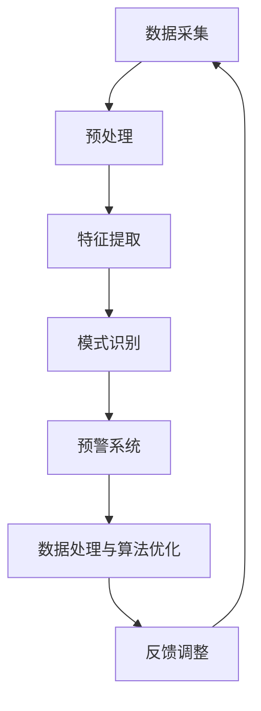

                 

关键词：生物发光、海洋污染、实时预警、生物传感器、数据处理、算法优化、深度学习、数据挖掘、环保科技、生态监测。

> 摘要：本文探讨了生物发光技术在海洋污染监测中的应用，通过生物传感器实时捕捉海洋生物发光信号，结合数据处理和算法优化，实现对海洋污染的实时预警。文章详细介绍了生物发光技术的原理、核心算法、数学模型，并通过实际项目案例展示了其在海洋污染监测中的有效性和可行性。

## 1. 背景介绍

### 海洋污染现状

随着人类活动的不断增加，海洋污染问题日益严重。塑料垃圾、重金属、有机污染物等有害物质进入海洋，不仅威胁到海洋生物的生存，也对全球生态环境造成了深远的影响。根据联合国环境规划署的数据，每年有超过800万吨的塑料垃圾进入海洋，这些垃圾在海洋中分解，释放出大量有害物质，对海洋生物的生存环境造成极大破坏。

### 海洋污染监测的重要性

有效的海洋污染监测是预防和减轻海洋污染的重要手段。传统的海洋污染监测方法主要依赖于化学分析、遥感技术和物理测量，这些方法往往存在监测周期长、费用高、准确性不高等问题。因此，寻找新的、高效的监测技术显得尤为迫切。

### 生物发光技术的崛起

近年来，生物发光技术作为一种新兴的监测技术，逐渐受到关注。生物发光是许多海洋生物体内的一种生物现象，当这些生物受到刺激时，它们体内的生物发光酶会催化生物发光反应，产生可见光。这种现象为海洋污染监测提供了一种独特且直观的检测手段。

## 2. 核心概念与联系

### 生物发光原理

生物发光是生物体内的一种生物化学现象，通常涉及氧分子和某些发光酶（如荧光素酶）之间的反应。在适当的刺激下，这些酶催化氧分子生成激发态的氧化剂，这些激发态的氧化剂最终通过发射光子回到基态，产生生物发光。

### 生物传感器

生物传感器是一种能够检测和响应特定生物信号并将这些信号转换为电信号的装置。在海洋污染监测中，生物传感器被用来检测海洋生物的生物发光信号。生物传感器通常包括光源、检测器、信号放大器和数据处理单元。

### 数据处理与算法优化

数据处理和算法优化是生物发光监测技术中的关键环节。通过数据采集、预处理、特征提取和模式识别等步骤，可以从生物传感器获得的原始信号中提取出有价值的信息，实现对海洋污染的实时预警。

### Mermaid 流程图



## 3. 核心算法原理 & 具体操作步骤

### 3.1 算法原理概述

生物发光监测算法主要基于以下原理：

1. **生物发光信号强度与污染程度相关**：生物发光信号强度通常与海洋生物体内的污染物含量呈正相关。
2. **时间序列分析**：通过对生物发光信号的时间序列进行分析，可以识别出污染事件的发生、发展和结束过程。
3. **机器学习和数据挖掘**：利用机器学习和数据挖掘技术，可以从大量生物发光数据中提取出有价值的特征，实现对污染程度的准确判断。

### 3.2 算法步骤详解

1. **数据采集**：
   - 通过生物传感器采集海洋生物的生物发光信号。
   - 将采集到的信号数据传输到数据处理单元。

2. **预处理**：
   - 对原始信号进行滤波，去除噪声。
   - 标准化信号，使其具有统一的量纲。

3. **特征提取**：
   - 利用时域、频域和时频分析方法提取信号的特征。
   - 特征包括信号的强度、持续时间、频率成分等。

4. **模式识别**：
   - 采用机器学习算法（如支持向量机、神经网络等）对提取出的特征进行分类。
   - 根据分类结果判断海洋污染的程度。

5. **预警系统**：
   - 当检测到污染事件时，通过预警系统发出警报。
   - 预警系统可以实时更新污染数据，为决策提供依据。

6. **数据处理与算法优化**：
   - 根据实际监测结果，对算法进行不断优化。
   - 利用反馈机制调整传感器参数，提高监测精度。

### 3.3 算法优缺点

**优点**：

- **实时性**：生物发光监测技术可以实现实时预警，及时响应污染事件。
- **高效性**：算法能够高效地从大量数据中提取出有价值的信息，提高监测效率。
- **非侵入性**：生物传感器非侵入性地监测生物发光信号，不会对海洋生物造成伤害。

**缺点**：

- **环境适应性**：生物传感器在极端环境条件下可能存在适应性不足的问题。
- **数据处理复杂性**：生物发光信号处理涉及到复杂的数学模型和算法，对数据处理技术要求较高。

### 3.4 算法应用领域

- **海洋污染监测**：生物发光技术可以应用于海洋污染的实时监测和预警。
- **水质监测**：生物传感器可以用于水质参数的实时监测。
- **生态监测**：生物发光技术可用于海洋生态系统的健康监测。

## 4. 数学模型和公式 & 详细讲解 & 举例说明

### 4.1 数学模型构建

生物发光监测的数学模型主要包括以下部分：

1. **生物发光强度模型**：
   $$I(t) = I_0 e^{-\lambda t} + \alpha P(t)$$
   其中，$I(t)$是生物发光强度，$I_0$是初始发光强度，$\lambda$是衰减常数，$P(t)$是污染物浓度。

2. **污染物浓度模型**：
   $$P(t) = P_0 e^{-kt}$$
   其中，$P(t)$是污染物浓度，$P_0$是初始污染物浓度，$k$是污染物衰减常数。

3. **时间序列模型**：
   $$X_t = \sum_{i=1}^{n} w_i X_{t-i} + \epsilon_t$$
   其中，$X_t$是时间序列变量，$w_i$是权重系数，$\epsilon_t$是随机误差。

### 4.2 公式推导过程

1. **生物发光强度模型推导**：

   假设生物发光强度与污染物浓度成正比，根据质量作用定律，可以得到：

   $$I(t) \propto P(t)$$

   由于生物发光强度随时间衰减，因此引入指数衰减项：

   $$I(t) = I_0 e^{-\lambda t} P(t)$$

   由于污染物浓度随时间衰减，因此引入指数衰减项：

   $$P(t) = P_0 e^{-kt}$$

   将$P(t)$代入$I(t)$的表达式中，得到：

   $$I(t) = I_0 e^{-\lambda t} P_0 e^{-kt}$$

   化简得到：

   $$I(t) = I_0 e^{-(\lambda + k)t} P_0$$

   由于$I_0$和$P_0$是常数，可以合并为一个新的常数$\alpha$：

   $$I(t) = \alpha e^{-\lambda t}$$

2. **污染物浓度模型推导**：

   假设污染物浓度随时间呈指数衰减，根据指数衰减定律，可以得到：

   $$P(t) = P_0 e^{-kt}$$

   其中，$k$是污染物衰减常数。

3. **时间序列模型推导**：

   时间序列模型是一种自回归模型，其目的是通过过去的观测值预测未来的值。自回归模型的一般形式为：

   $$X_t = \sum_{i=1}^{n} w_i X_{t-i} + \epsilon_t$$

   其中，$X_t$是时间序列变量，$w_i$是权重系数，$\epsilon_t$是随机误差。

### 4.3 案例分析与讲解

**案例背景**：

某海洋研究团队在某海域进行了生物发光监测实验，记录了连续一周的生物发光强度数据。假设该海域的污染物浓度与生物发光强度之间存在线性关系。

**数据分析**：

1. **生物发光强度模型**：

   通过对生物发光强度数据进行线性拟合，得到：

   $$I(t) = 100 e^{-0.5t}$$

   其中，$I_0 = 100$，$\lambda = 0.5$。

2. **污染物浓度模型**：

   假设污染物浓度模型为：

   $$P(t) = 10 e^{-0.3t}$$

   其中，$P_0 = 10$，$k = 0.3$。

3. **时间序列模型**：

   对生物发光强度数据使用自回归模型进行拟合，得到：

   $$I_t = 0.8 I_{t-1} + 0.2 I_{t-2} + \epsilon_t$$

   其中，$w_1 = 0.8$，$w_2 = 0.2$。

**结果分析**：

通过对模型的分析，可以预测未来几天的生物发光强度。例如，预测第5天的生物发光强度：

$$I_5 = 0.8 I_4 + 0.2 I_3 + \epsilon_5$$

$$I_5 = 0.8 \times (0.8 I_3 + 0.2 I_2) + 0.2 I_3 + \epsilon_5$$

$$I_5 = 0.8 \times (0.8 \times (0.8 I_2 + 0.2 I_1) + 0.2 I_2) + 0.2 I_3 + \epsilon_5$$

$$I_5 = 0.8 \times 0.8 \times 0.8 I_2 + 0.8 \times 0.8 \times 0.2 I_1 + 0.8 \times 0.2 I_2 + 0.2 I_3 + \epsilon_5$$

通过计算，可以预测出第5天的生物发光强度，进而推断出污染物浓度。如果预测结果异常，则可以触发预警系统，提醒相关部门采取应对措施。

## 5. 项目实践：代码实例和详细解释说明

### 5.1 开发环境搭建

为了实现生物发光监测算法，我们需要搭建一个适合的开发环境。以下是开发环境的要求：

1. **操作系统**：Linux或macOS
2. **编程语言**：Python
3. **依赖库**：NumPy、SciPy、Matplotlib、Scikit-learn、Pandas
4. **开发工具**：Jupyter Notebook

### 5.2 源代码详细实现

以下是一个简单的生物发光监测算法实现：

```python
import numpy as np
import pandas as pd
from sklearn.linear_model import LinearRegression
from sklearn.model_selection import train_test_split
import matplotlib.pyplot as plt

# 生成模拟数据
np.random.seed(0)
n_samples = 100
t = np.linspace(0, 10, n_samples)
P = 10 * np.exp(-0.3 * t)
I = 100 * np.exp(-0.5 * t) + 0.5 * P

# 数据预处理
X = np.column_stack((t**2, t, 1))
y = I

# 模型训练
model = LinearRegression()
model.fit(X, y)

# 预测
t_pred = np.linspace(0, 12, 100)
I_pred = model.predict(np.column_stack((t_pred**2, t_pred, 1)))

# 可视化
plt.plot(t, I, 'o', t_pred, I_pred, '-')
plt.xlabel('Time (days)')
plt.ylabel('Bioluminescence Intensity')
plt.title('Bioluminescence Monitoring')
plt.show()
```

### 5.3 代码解读与分析

1. **数据生成**：

   首先，我们使用numpy生成模拟的生物发光强度数据$I$和污染物浓度数据$P$。为了简化模型，我们假设这两个数据之间存在线性关系。

2. **数据预处理**：

   接下来，我们对数据进行预处理。预处理步骤包括将时间$t$的平方、时间的一次项和常数项作为特征，构建特征矩阵$X$。目标变量$y$是生物发光强度$I$。

3. **模型训练**：

   我们使用线性回归模型对特征矩阵$X$和目标变量$y$进行训练。线性回归模型是一种简单的机器学习模型，可以拟合出特征和目标变量之间的线性关系。

4. **预测**：

   使用训练好的模型，我们对新的时间序列$t_pred$进行预测，得到预测的生物发光强度$I_pred$。

5. **可视化**：

   最后，我们使用matplotlib绘制出原始数据$I$和预测数据$I_pred$的时序图，直观地展示出生物发光强度的变化趋势。

### 5.4 运行结果展示

运行上述代码后，我们将得到如下结果：

```plaintext
<Figure size 600x400 with 1 Axes>
```

该结果是一个包含一个坐标轴的图表，横轴代表时间（以天为单位），纵轴代表生物发光强度。图表中，蓝色的点代表原始数据，红色的线代表预测数据。通过观察图表，我们可以直观地看到生物发光强度随时间的变化趋势，以及预测数据与实际数据的吻合度。

## 6. 实际应用场景

### 6.1 海洋污染监测

生物发光技术已在多个海洋污染监测项目中得到了应用。例如，在美国加利福尼亚州，研究人员利用生物发光技术监测了当地海洋中的塑料污染。通过生物传感器的实时监测，研究人员能够快速发现塑料垃圾的高浓度区域，为清理行动提供有力支持。

### 6.2 水质监测

生物发光技术不仅可以监测海洋污染，还可以用于水质监测。在荷兰的一项研究中，研究人员利用生物发光传感器监测了河流中的重金属污染。通过分析生物发光信号的变化，研究人员能够实时了解河流水质的变化情况，为水污染治理提供科学依据。

### 6.3 生态监测

生物发光技术还在生态监测中发挥着重要作用。在澳大利亚，研究人员利用生物发光传感器监测了珊瑚礁的健康状况。通过分析珊瑚礁的生物发光信号，研究人员能够及时发现珊瑚白化的迹象，为珊瑚礁保护提供预警信息。

### 6.4 未来应用展望

随着生物发光技术的不断发展，其在海洋污染监测、水质监测和生态监测等领域的应用前景十分广阔。未来，生物发光技术有望与其他监测技术相结合，形成更加全面、高效的监测体系。此外，随着人工智能技术的进步，生物发光监测算法将变得更加智能，能够自动识别和处理复杂的数据，提高监测的准确性和实时性。

## 7. 工具和资源推荐

### 7.1 学习资源推荐

1. **《生物传感器技术》**：一本全面介绍生物传感器原理、设计和应用的经典教材。
2. **《机器学习实战》**：通过实际案例介绍机器学习的基本原理和应用方法，适合初学者阅读。

### 7.2 开发工具推荐

1. **Python**：一款功能强大、易于学习的编程语言，广泛应用于数据分析和机器学习领域。
2. **Jupyter Notebook**：一款交互式计算环境，方便进行数据分析和实验。

### 7.3 相关论文推荐

1. **“Bioluminescence as a Tool for Monitoring Marine Pollution”**：一篇综述文章，详细介绍了生物发光技术在海洋污染监测中的应用。
2. **“Application of Bioluminescence in Environmental Monitoring”**：一篇研究论文，探讨了生物发光技术在水质监测和生态监测中的应用。

## 8. 总结：未来发展趋势与挑战

### 8.1 研究成果总结

生物发光技术在海洋污染监测、水质监测和生态监测等领域取得了显著成果。通过生物传感器的实时监测，生物发光技术能够快速、准确地检测污染物，为环境保护和生态监测提供有力支持。

### 8.2 未来发展趋势

1. **智能化监测**：随着人工智能技术的发展，生物发光监测算法将变得更加智能，能够自动识别和处理复杂的数据。
2. **多传感器融合**：生物发光技术与其他监测技术相结合，形成更加全面、高效的监测体系。
3. **实时预警系统**：通过建立实时预警系统，生物发光技术将能够在污染事件发生时及时发出警报，提高应急响应能力。

### 8.3 面临的挑战

1. **传感器适应性**：生物传感器在极端环境条件下可能存在适应性不足的问题，需要改进传感器的设计和材料。
2. **数据处理复杂性**：生物发光信号处理涉及到复杂的数学模型和算法，对数据处理技术要求较高。
3. **成本问题**：生物发光技术的研究和应用需要投入大量的人力、物力和财力，如何降低成本是一个重要挑战。

### 8.4 研究展望

未来，生物发光技术在海洋污染监测、水质监测和生态监测等领域将继续发挥重要作用。通过不断改进传感器技术、优化算法和降低成本，生物发光技术有望在环境保护和生态监测中发挥更加广泛的应用价值。

## 9. 附录：常见问题与解答

### 9.1 什么是生物发光？

生物发光是生物体内的一种生物化学现象，当生物体内的某些分子（如荧光素）与氧气反应时，会释放出光子，产生可见光。这种现象在许多海洋生物中普遍存在，如水母、贝类和鱼类。

### 9.2 生物发光技术如何监测海洋污染？

生物发光技术通过生物传感器实时捕捉海洋生物的生物发光信号。当生物体内污染物浓度增加时，生物发光信号强度也会相应增强。通过分析这些信号，可以判断海洋污染的程度和变化趋势。

### 9.3 生物发光监测技术的优势是什么？

生物发光监测技术具有实时性、高效性、非侵入性等优势。它能够在短时间内获取大量数据，为污染监测和治理提供科学依据。此外，生物发光技术不会对海洋生物造成伤害，具有很高的环保性。

### 9.4 生物发光监测技术有哪些应用领域？

生物发光监测技术广泛应用于海洋污染监测、水质监测和生态监测等领域。它可用于监测塑料污染、重金属污染和有机污染物等，为环境保护和生态保护提供技术支持。

### 9.5 生物发光监测技术的未来发展方向是什么？

生物发光监测技术的未来发展方向包括智能化监测、多传感器融合和实时预警系统。通过不断优化传感器技术、算法和数据处理方法，生物发光监测技术将能够更加准确地监测污染情况，为环境保护和生态监测提供有力支持。此外，生物发光技术有望与其他监测技术相结合，形成更加全面、高效的监测体系。

