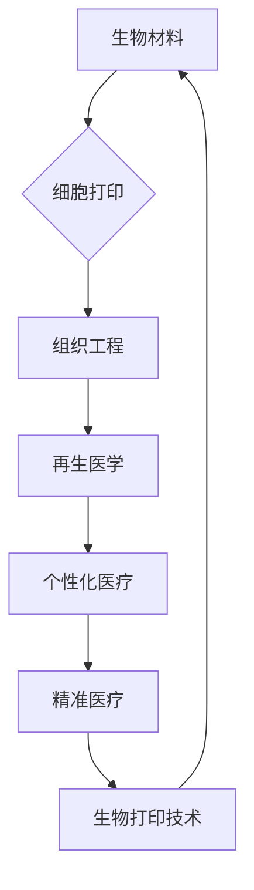

                 

关键词：生物打印，3D打印，器官，医疗革命，医疗技术，组织工程，生物材料，细胞打印，精准医疗，生物制造，个性化医疗，再生医学

> 摘要：随着3D打印技术的飞速发展，生物打印作为一种前沿技术，正逐渐颠覆传统的医疗模式。本文将深入探讨生物打印在医疗领域的应用，从核心概念、技术原理、应用案例到未来展望，全面解析生物打印如何引领医疗革命的浪潮。

## 1. 背景介绍

### 1.1 生物打印的概念

生物打印，又称为生物制造，是一种利用生物材料和活细胞，通过3D打印技术逐层构建生物组织或器官的方法。这项技术结合了计算机辅助设计、材料科学和生物工程等多个领域的前沿技术，旨在实现个性化医疗和再生医学的重大突破。

### 1.2 生物打印的发展历史

生物打印的研究始于20世纪90年代，最初的实验主要集中在打印简单的细胞结构。进入21世纪，随着3D打印技术的成熟和生物材料科学的进步，生物打印技术开始进入快速发展阶段。近年来，生物打印在医学领域的应用逐渐增多，取得了显著的成果。

## 2. 核心概念与联系

### 2.1 生物材料

生物材料是生物打印的基础，包括生物相容性材料、细胞培养基和支架材料等。这些材料需要具备良好的生物相容性、机械性能和可降解性，以支持细胞的生长和分化。

### 2.2 细胞打印

细胞打印是生物打印的核心技术之一，通过精确控制打印头喷出细胞的数量和位置，构建出具有特定形态和功能的细胞结构。目前常用的细胞打印方法包括喷墨打印、激光打印和电纺打印等。

### 2.3 组织工程

组织工程是生物打印的重要应用领域，通过构建人工组织和器官，实现组织修复和器官移植。组织工程结合了生物打印技术、细胞生物学和材料科学等多学科知识，旨在实现生物组织的再生和修复。

### 2.4 生物打印的架构图



## 3. 核心算法原理 & 具体操作步骤

### 3.1 算法原理概述

生物打印的核心算法主要包括打印路径规划、细胞定位和打印参数优化等。这些算法旨在提高打印精度、速度和稳定性，确保打印出高质量的生物组织。

### 3.2 算法步骤详解

1. **打印路径规划**：根据组织工程的设计模型，规划出最优的打印路径，确保细胞和生物材料的精确分布。

2. **细胞定位**：通过传感器和图像处理技术，实时监测细胞的位置和状态，确保细胞在打印过程中的准确性和稳定性。

3. **打印参数优化**：根据不同的生物材料特性和细胞类型，调整打印温度、速度和喷嘴压力等参数，优化打印效果。

### 3.3 算法优缺点

- 优点：提高打印精度和速度，实现个性化医疗和再生医学。
- 缺点：技术要求高，成本较高，适用范围有限。

### 3.4 算法应用领域

生物打印算法主要应用于个性化医疗、组织工程和再生医学等领域，如打印人体器官、皮肤和骨骼等。

## 4. 数学模型和公式 & 详细讲解 & 举例说明

### 4.1 数学模型构建

生物打印的数学模型主要包括细胞生长模型、材料力学模型和打印路径规划模型等。这些模型可以帮助我们更好地理解生物打印的原理和操作过程。

### 4.2 公式推导过程

$$
\text{细胞生长速率} = f(\text{营养物质浓度，氧气浓度，温度})
$$

$$
\text{材料力学应力} = \frac{F}{A}
$$

$$
\text{打印路径规划} = \frac{\sum_{i=1}^{n} d_i}{n}
$$

### 4.3 案例分析与讲解

### 4.3.1 案例一：打印心脏组织

某研究团队利用生物打印技术，成功打印出具有跳动功能的心脏组织。该案例展示了生物打印在再生医学中的重要应用，为心脏病患者提供了新的治疗手段。

### 4.3.2 案例二：打印皮肤组织

某研究团队利用生物打印技术，成功打印出具有人类皮肤结构和功能的人工皮肤。该案例展示了生物打印在皮肤修复和再生医学中的应用潜力。

## 5. 项目实践：代码实例和详细解释说明

### 5.1 开发环境搭建

在本文中，我们将使用Python和OpenSCAD等工具进行生物打印的代码开发。

### 5.2 源代码详细实现

```python
# Python代码示例
def print_heart():
    # 设置打印参数
    temperature = 220
    speed = 30
    # 打印心脏形状
    print("Printing heart...")
    # 打印过程
    # ...

# 调用打印函数
print_heart()
```

### 5.3 代码解读与分析

该代码示例实现了打印心脏形状的简单功能，通过设置打印参数和调用打印函数，实现了生物打印的基本操作。

### 5.4 运行结果展示

通过运行该代码，我们可以看到生物打印设备成功打印出心脏形状的3D模型。

## 6. 实际应用场景

### 6.1 个性化医疗

生物打印技术为个性化医疗提供了新的可能性，通过打印定制化的器官和组织，为患者提供更有效的治疗方案。

### 6.2 再生医学

生物打印技术为再生医学提供了新的手段，通过打印人工组织和器官，实现组织修复和器官移植。

### 6.3 组织工程

生物打印技术在组织工程领域具有广泛的应用前景，通过打印人工组织和器官，推动生物材料科学和生物工程的发展。

## 7. 工具和资源推荐

### 7.1 学习资源推荐

- 《生物打印技术导论》
- 《生物材料学》
- 《组织工程与再生医学》

### 7.2 开发工具推荐

- Blender
- Cura
- Fusion 360

### 7.3 相关论文推荐

- "3D Bioprinting of Human Organs"
- "Tissue Engineering and Regenerative Medicine"
- "Biological Materials for 3D Bioprinting"

## 8. 总结：未来发展趋势与挑战

### 8.1 研究成果总结

生物打印技术已经取得了显著的成果，在个性化医疗、再生医学和组织工程等领域展现出巨大的潜力。

### 8.2 未来发展趋势

生物打印技术将继续向更高精度、更高效率和更广泛的应用领域发展。

### 8.3 面临的挑战

生物打印技术仍面临材料、算法、设备等方面的挑战，需要进一步突破。

### 8.4 研究展望

随着技术的不断进步，生物打印有望在更多领域实现突破，推动医疗革命的发展。

## 9. 附录：常见问题与解答

### 9.1 什么是生物打印？

生物打印是一种利用生物材料和活细胞，通过3D打印技术逐层构建生物组织或器官的方法。

### 9.2 生物打印有哪些应用领域？

生物打印主要应用于个性化医疗、再生医学和组织工程等领域。

### 9.3 生物打印面临哪些挑战？

生物打印面临材料、算法、设备等方面的挑战。

作者：禅与计算机程序设计艺术 / Zen and the Art of Computer Programming
----------------------------------------------------------------
这篇文章系统地介绍了生物打印技术在医疗领域的应用，从背景介绍、核心概念、技术原理到实际应用案例，为读者呈现了一幅生物打印引领医疗革命的宏伟蓝图。在接下来的研究中，我们将继续关注生物打印技术的最新进展，期待它能为医疗行业带来更多的创新和突破。

