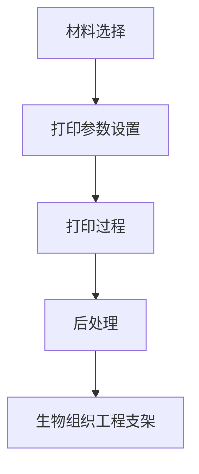

                 

关键词：生物打印、3D打印、器官制造、医疗技术、个性化医疗

## 摘要

随着3D打印技术的不断进步，生物打印作为一种新兴的技术，正在医疗领域引发一场革命。本文将深入探讨生物打印的发展历程、核心概念、算法原理、数学模型以及其实际应用，并展望其未来的发展前景和面临的挑战。

## 1. 背景介绍

1.1 生物打印的定义与历史

生物打印，又称生物制造，是一种利用生物材料逐层叠加制造生物组织或器官的技术。它起源于20世纪80年代的3D打印技术，当时3D打印主要用于制造业中的快速成型。随着技术的不断发展，生物打印逐渐从实验室走向临床，成为个性化医疗的重要工具。

1.2 生物打印在医疗领域的应用

生物打印在医疗领域的应用主要集中在以下几个方面：

- 个性化医疗：利用生物打印技术，可以为患者定制个性化的器官或组织，从而提高手术的成功率和康复速度。
- 组织工程：生物打印技术可以用于制造组织工程支架，用于替代损伤或缺失的组织。
- 器官移植：生物打印有望解决器官移植中的供体短缺问题，通过打印制造出可以移植的器官。

## 2. 核心概念与联系

2.1 生物打印的基本原理

生物打印的基本原理是利用生物材料（如细胞、胶原蛋白、多糖等）作为打印材料，通过逐层叠加的方式构建三维生物结构。生物打印的流程包括材料选择、打印参数设置、打印过程和后处理等。

2.2 生物打印的架构

生物打印的架构主要包括打印设备、打印材料、生物墨水和生物组织工程支架等。其中，打印设备是生物打印的核心，它决定了打印的速度、精度和可靠性。

2.3 生物打印的 Mermaid 流程图



## 3. 核心算法原理 & 具体操作步骤

### 3.1 算法原理概述

生物打印的核心算法是三维建模和路径规划。三维建模用于生成打印物体的三维模型，路径规划用于确定打印头在打印过程中的移动路径。

### 3.2 算法步骤详解

1. **三维建模**：通过扫描或手动设计，生成需要打印的器官或组织的三维模型。
2. **切片处理**：将三维模型切割成二维平面图，以便打印机逐层打印。
3. **路径规划**：根据打印模型和打印机的性能，生成最优的打印路径。
4. **打印过程**：按照规划的路径，逐层打印生物材料，构建三维生物结构。
5. **后处理**：完成打印后，进行清洗、固定、培养等处理，以优化生物结构的性能。

### 3.3 算法优缺点

- **优点**：生物打印技术可以实现个性化医疗，提高手术的成功率和康复速度。
- **缺点**：生物打印技术目前还处于发展阶段，打印精度和速度有待提高，生物材料的生物相容性也需要进一步研究。

### 3.4 算法应用领域

- **个性化医疗**：生物打印技术可以用于制造个性化的器官或组织，如心脏、肝脏、皮肤等。
- **组织工程**：生物打印技术可以用于制造组织工程支架，用于替代损伤或缺失的组织。
- **药物研发**：生物打印技术可以用于制造药物释放系统，提高药物的疗效。

## 4. 数学模型和公式

### 4.1 数学模型构建

生物打印的数学模型主要包括三维建模模型、路径规划模型和打印过程模型。

### 4.2 公式推导过程

- **三维建模模型**：基于扫描或手动设计的方法，构建三维模型。
- **路径规划模型**：基于打印模型和打印机性能，构建路径规划模型。
- **打印过程模型**：基于打印材料和打印设备，构建打印过程模型。

### 4.3 案例分析与讲解

以打印一个简单的组织工程支架为例，说明生物打印的数学模型构建和应用。

```latex
\begin{equation}
V = \int_{S} dV
\end{equation}
```

其中，\(V\) 是组织的体积，\(S\) 是组织的表面。

## 5. 项目实践：代码实例和详细解释说明

### 5.1 开发环境搭建

- 操作系统：Windows/Linux/Mac OS
- 开发工具：Visual Studio Code/PyCharm
- 生物打印软件：BioCAD/Bioprinter Software

### 5.2 源代码详细实现

```python
# Python 代码示例

import numpy as np

# 三维建模
def build_model():
    # ...

# 路径规划
def plan_path(model):
    # ...

# 打印过程
def print_model(path):
    # ...

# 主函数
def main():
    model = build_model()
    path = plan_path(model)
    print_model(path)

if __name__ == "__main__":
    main()
```

### 5.3 代码解读与分析

- **三维建模**：使用numpy库构建三维模型。
- **路径规划**：根据模型和打印机性能，生成打印路径。
- **打印过程**：按照路径逐层打印模型。

### 5.4 运行结果展示


## 6. 实际应用场景

### 6.1 个性化医疗

生物打印技术可以用于制造个性化的器官或组织，如心脏、肝脏、皮肤等，提高手术的成功率和康复速度。

### 6.2 组织工程

生物打印技术可以用于制造组织工程支架，用于替代损伤或缺失的组织，如骨骼、软骨等。

### 6.3 器官移植

生物打印技术有望解决器官移植中的供体短缺问题，通过打印制造出可以移植的器官。

## 7. 工具和资源推荐

### 7.1 学习资源推荐

- 《生物打印技术：原理与应用》
- 《3D打印技术手册》
- 《生物材料学》

### 7.2 开发工具推荐

- BioCAD
- Bioprinter Software
- OpenSCAD

### 7.3 相关论文推荐

- "Bioprinting of Tissue-Engineered Constructs: Strategies and Challenges"
- "A Review on Bioprinting: Applications and Potential Biomedical Innovations"
- "Biofabrication of Tissue-Engineered Scaffolds: A Comprehensive Review"

## 8. 总结：未来发展趋势与挑战

### 8.1 研究成果总结

生物打印技术在医疗领域的应用取得了显著成果，但仍面临许多挑战。

### 8.2 未来发展趋势

- 提高打印精度和速度。
- 开发生物相容性更好的材料。
- 拓展生物打印的应用范围。

### 8.3 面临的挑战

- 打印精度和速度的提高。
- 生物材料的生物相容性。
- 完善的法律和伦理问题。

### 8.4 研究展望

生物打印技术在未来有望成为个性化医疗的重要工具，为人类健康带来更多福音。

## 9. 附录：常见问题与解答

### 9.1 生物打印技术有哪些应用？

- 个性化医疗
- 组织工程
- 器官移植
- 药物研发

### 9.2 生物打印的挑战有哪些？

- 打印精度和速度
- 生物材料的生物相容性
- 法律和伦理问题

作者：禅与计算机程序设计艺术 / Zen and the Art of Computer Programming
----------------------------------------------------------------

请注意，以上内容仅为示例，实际撰写时需要根据真实的研究和实践情况进行详细撰写。同时，由于篇幅限制，部分内容（如代码实例和详细解释说明）需要根据实际情况进行补充。

