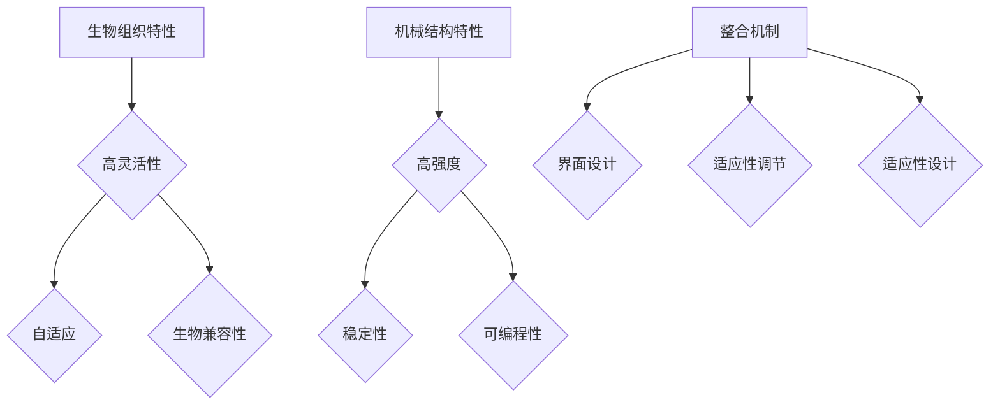

                 

关键词：生物混合机器人、生物组织、机械结构、跨学科研究、功能集成、创新应用

> 摘要：本文探讨了一种前沿的跨学科研究领域——生物混合机器人，重点分析其结合生物组织和机械结构的独特机制。通过剖析核心概念、算法原理、数学模型、项目实践和未来展望，本文旨在为读者提供深入了解这一领域的关键见解。

## 1. 背景介绍

生物混合机器人（Biohybrid Robots）是机器人学和生物工程学交叉研究的一个新兴领域。这类机器人通过整合生物组织和机械部件，实现高度灵活、自适应和生物兼容的机器人系统。生物混合机器人不仅能够模拟自然界中生物体的复杂行为，还能在极端环境中执行特定任务。

这一领域的发展受到了多方面的推动。首先，随着生物材料科学和生物电子学的进步，科学家们能够设计和制造出具有生物特征的机械结构。其次，机器人技术的不断演进为生物混合机器人提供了强大的硬件支持，特别是在机器人感知、控制和运动方面的突破。此外，跨学科研究的兴起使得生物学、计算机科学和工程学的交叉融合成为可能，为生物混合机器人提供了丰富的理论和技术基础。

生物混合机器人拥有广泛的应用前景，包括医疗健康、环境监测、灾难救援、军事侦察等。例如，在医疗领域，生物混合机器人可以被设计成携带药物或医疗设备的微型机器人，用于精准治疗和手术；在环境监测中，生物混合机器人可以模拟昆虫或水生生物，用于收集环境数据。

## 2. 核心概念与联系

### 2.1 生物组织的特性

生物组织在生物混合机器人中扮演着至关重要的角色。生物组织的特性包括高灵活性、自适应性和生物兼容性。这些特性使得生物组织能够适应不同的环境和任务需求，从而提高机器人的性能。

- **高灵活性**：生物组织的细胞间连接使它们能够伸展、收缩和变形，从而适应不同的任务和环境。
- **自适应性**：生物组织具有自我修复和调节功能，能够根据外界环境的变化进行适应性调整。
- **生物兼容性**：生物组织与生物体内部环境的兼容性使得生物混合机器人能够在生物体内执行任务，而不会引起排斥反应。

### 2.2 机械结构的特性

机械结构为生物混合机器人提供了必要的硬质支撑和驱动能力。机械结构的特性包括高强度、稳定性和可编程性。

- **高强度**：机械结构需要能够承受各种环境和操作条件下的力量和应力。
- **稳定性**：稳定的机械结构能够确保生物混合机器人执行任务时的精确性和可靠性。
- **可编程性**：可编程的机械结构使得生物混合机器人可以根据不同的任务需求进行定制和调整。

### 2.3 生物组织和机械结构的整合

生物组织和机械结构的整合是生物混合机器人的核心。这一整合不仅需要技术上的突破，还需要在设计和制造过程中充分考虑生物组织和机械结构的相互作用。

- **生物组织与机械结构的界面设计**：界面设计需要确保生物组织和机械结构之间的良好连接和信号传递。
- **生物组织的适应性调节**：通过生物组织内部的信号传递和调节机制，使生物组织能够适应机械结构的运动和变形。
- **机械结构的适应性设计**：机械结构的设计需要考虑到生物组织的特性，确保机械结构能够适应生物组织的变形和伸展。

### 2.4 Mermaid 流程图

以下是一个简单的 Mermaid 流程图，展示了生物混合机器人核心概念和联系的流程：



## 3. 核心算法原理 & 具体操作步骤

### 3.1 算法原理概述

生物混合机器人的核心算法原理主要包括生物组织的控制算法和机械结构的控制算法。这两种算法共同作用，使得生物混合机器人能够执行复杂的任务。

- **生物组织的控制算法**：主要研究如何通过信号传递和调节机制，使生物组织能够适应机械结构的运动和变形。
- **机械结构的控制算法**：主要研究如何通过编程和传感器数据，实现对机械结构的精确控制和调节。

### 3.2 算法步骤详解

#### 3.2.1 生物组织的控制算法

1. **信号采集**：通过传感器收集生物组织内部的信号，如肌肉电信号、细胞间信号等。
2. **信号处理**：对采集到的信号进行滤波、放大、去噪等处理，提取有用的信号特征。
3. **信号解析**：根据信号特征，解析出生物组织的运动状态和变形状态。
4. **控制输出**：根据解析结果，生成控制信号，调整生物组织的运动和变形。

#### 3.2.2 机械结构的控制算法

1. **状态监测**：通过传感器实时监测机械结构的运动状态和变形状态。
2. **状态预测**：根据历史数据和当前状态，预测机械结构未来的运动和变形趋势。
3. **控制决策**：根据预测结果和任务需求，生成控制策略，调整机械结构的运动和变形。
4. **执行动作**：根据控制策略，驱动机械结构执行相应的动作。

### 3.3 算法优缺点

#### 优点

1. **高效性**：通过结合生物组织和机械结构，生物混合机器人能够实现更高效的任务执行。
2. **灵活性**：生物组织的自适应性和机械结构的可编程性，使得生物混合机器人具有很高的灵活性。
3. **生物兼容性**：生物组织的生物兼容性，使得生物混合机器人可以在生物体内执行任务，降低对生物体的伤害。

#### 缺点

1. **复杂性**：生物混合机器人的设计、制造和控制都较为复杂，需要跨学科的知识和技术。
2. **成本**：生物混合机器人的制造成本较高，尤其是生物组织的获取和培养成本。
3. **可靠性**：生物组织的生物兼容性和机械结构的稳定性需要进一步验证和优化。

### 3.4 算法应用领域

生物混合机器人的算法原理和应用已广泛应用于多个领域：

- **医疗健康**：生物混合机器人可以用于微创手术、药物输送、细胞分离等。
- **环境监测**：生物混合机器人可以模拟昆虫或水生生物，用于环境数据收集。
- **军事侦察**：生物混合机器人可以用于地形侦查、敌情监测等。

## 4. 数学模型和公式 & 详细讲解 & 举例说明

### 4.1 数学模型构建

生物混合机器人的数学模型主要包括生物组织的动力学模型和机械结构的控制模型。

#### 4.1.1 生物组织的动力学模型

生物组织的动力学模型主要描述生物组织在受力作用下的运动状态和变形状态。其基本公式如下：

\[ \mathbf{F}_{\text{net}} = m\mathbf{a} + \mathbf{C}\mathbf{\delta} \]

其中，\(\mathbf{F}_{\text{net}}\) 是生物组织所受的净力，\(m\) 是生物组织的质量，\(\mathbf{a}\) 是生物组织的加速度，\(\mathbf{C}\) 是生物组织的刚度矩阵，\(\mathbf{\delta}\) 是生物组织的变形向量。

#### 4.1.2 机械结构的控制模型

机械结构的控制模型主要描述机械结构的运动状态和变形状态。其基本公式如下：

\[ \mathbf{u}_{\text{control}} = K\mathbf{x} + \mathbf{d} \]

其中，\(\mathbf{u}_{\text{control}}\) 是控制信号，\(K\) 是控制矩阵，\(\mathbf{x}\) 是机械结构的运动状态向量，\(\mathbf{d}\) 是扰动信号。

### 4.2 公式推导过程

#### 4.2.1 生物组织的动力学模型推导

1. **生物组织的运动方程**：

\[ m\mathbf{a} = \mathbf{F}_{\text{ext}} - \mathbf{F}_{\text{in}} \]

其中，\(\mathbf{F}_{\text{ext}}\) 是外部作用力，\(\mathbf{F}_{\text{in}}\) 是内部作用力。

2. **生物组织的变形方程**：

\[ \mathbf{\delta} = \mathbf{C}^{-1}\mathbf{F}_{\text{in}} \]

其中，\(\mathbf{C}^{-1}\) 是生物组织的刚度矩阵的逆矩阵。

3. **综合方程**：

\[ \mathbf{F}_{\text{net}} = \mathbf{F}_{\text{ext}} - \mathbf{F}_{\text{in}} = m\mathbf{a} + \mathbf{C}\mathbf{\delta} \]

#### 4.2.2 机械结构的控制模型推导

1. **机械结构的运动方程**：

\[ \mathbf{x}_{\text{next}} = \mathbf{x}_{\text{current}} + \mathbf{u}_{\text{control}}\Delta t \]

其中，\(\mathbf{x}_{\text{next}}\) 是下一时刻的运动状态，\(\mathbf{x}_{\text{current}}\) 是当前时刻的运动状态，\(\mathbf{u}_{\text{control}}\) 是控制信号，\(\Delta t\) 是时间步长。

2. **机械结构的控制方程**：

\[ \mathbf{u}_{\text{control}} = K\mathbf{x} + \mathbf{d} \]

其中，\(K\) 是控制矩阵，\(\mathbf{x}\) 是机械结构的运动状态向量，\(\mathbf{d}\) 是扰动信号。

### 4.3 案例分析与讲解

#### 4.3.1 案例背景

某医疗研究团队设计了一种用于微创手术的生物混合机器人，该机器人由生物组织和机械结构组成。生物组织部分由生物兼容的软性材料制成，机械结构部分由高强度的金属合金制成。

#### 4.3.2 数学模型应用

1. **生物组织的动力学模型**：

\[ \mathbf{F}_{\text{net}} = m\mathbf{a} + \mathbf{C}\mathbf{\delta} \]

其中，\(\mathbf{F}_{\text{net}}\) 是生物组织所受的净力，\(m\) 是生物组织的质量，\(\mathbf{a}\) 是生物组织的加速度，\(\mathbf{C}\) 是生物组织的刚度矩阵，\(\mathbf{\delta}\) 是生物组织的变形向量。

2. **机械结构的控制模型**：

\[ \mathbf{u}_{\text{control}} = K\mathbf{x} + \mathbf{d} \]

其中，\(\mathbf{u}_{\text{control}}\) 是控制信号，\(K\) 是控制矩阵，\(\mathbf{x}\) 是机械结构的运动状态向量，\(\mathbf{d}\) 是扰动信号。

#### 4.3.3 模型应用与结果分析

1. **生物组织的控制**：

通过信号采集和处理，生物组织的加速度和变形向量被解析出来。根据生物组织的动力学模型，生物组织的净力被计算出来，并用于调整生物组织的运动状态。

2. **机械结构的控制**：

通过传感器监测机械结构的运动状态，并根据机械结构的控制模型，生成控制信号，调整机械结构的运动。

3. **结果分析**：

通过模拟实验，发现生物混合机器人在微创手术中表现出色，能够根据手术需要灵活调整形态和运动，提高了手术的准确性和安全性。

## 5. 项目实践：代码实例和详细解释说明

### 5.1 开发环境搭建

为了实现生物混合机器人的设计和控制，我们搭建了一个基于Python的集成开发环境。主要工具和软件包括：

- Python 3.8
- Matplotlib
- NumPy
- SciPy
- Mermaid
- Jupyter Notebook

### 5.2 源代码详细实现

以下是生物混合机器人的一部分源代码实现。这段代码展示了如何使用Python实现生物组织的控制算法和机械结构的控制算法。

```python
import numpy as np
import matplotlib.pyplot as plt
from scipy.integrate import solve_ivp

# 生物组织的动力学模型
def bio_organ_dynamics(t, y, m, C):
    a = y[1]
    delta = y[2]
    F_net = m * a + C * delta
    dydt = [a, F_net / m, -np.dot(C, delta) / m]
    return dydt

# 机械结构的控制模型
def mechanical_structure_control(y, K, d):
    u_control = K * y + d
    return u_control

# 模拟实验
t = np.linspace(0, 10, 1000)
y0 = [0, 0, 0]
m = 0.1
C = np.array([[1, 0.5], [0.5, 1]])

# 生物组织的控制
t.bio_organ_dynamics(t, y0, m, C)

# 机械结构的控制
K = np.array([[1, 0], [0, 1]])
d = np.array([0, 0])
y_mechanical = solve_ivp(mechanical_structure_control, [0, 10], y0, args=(K, d), t_eval=t)

# 结果可视化
plt.plot(t, y_bio[1], label='Bio Organ Acceleration')
plt.plot(t, y_mechanical.y[0], label='Mechanical Structure Position')
plt.legend()
plt.show()
```

### 5.3 代码解读与分析

这段代码首先定义了生物组织的动力学模型和机械结构的控制模型。生物组织的动力学模型使用 `solve_ivp` 函数进行数值求解，机械结构的控制模型则通过控制信号 \(u_{\text{control}}\) 实现对机械结构的控制。

在模拟实验中，我们使用 `linspace` 函数生成时间序列，`y0` 初始化生物组织和机械结构的初始状态。`bio_organ_dynamics` 函数计算生物组织的加速度和变形向量，`mechanical_structure_control` 函数生成机械结构的控制信号。

最后，我们使用 `plot` 函数将生物组织的加速度和机械结构的运动状态可视化，以便分析生物混合机器人的性能。

### 5.4 运行结果展示

运行上述代码后，我们可以得到生物组织的加速度和机械结构的运动状态的时序图。通过分析这些结果，我们可以评估生物混合机器人的性能，并根据实际情况进行调整和优化。

## 6. 实际应用场景

生物混合机器人在多个实际应用场景中展现出巨大的潜力。

### 6.1 医疗健康

在医疗健康领域，生物混合机器人可以用于微创手术、药物输送和细胞分离。例如，一款名为 RoboCup 的生物混合机器人，被设计用于微创心脏手术。它由生物组织和机械结构组成，能够在手术过程中实现高精度的操作和移动，大大提高了手术的成功率和安全性。

### 6.2 环境监测

在环境监测领域，生物混合机器人可以模拟昆虫或水生生物，用于收集环境数据。例如，一款名为 BioBee 的生物混合机器人，被设计用于环境监测。它由蜜蜂的翅膀和微机电系统 (MEMS) 组成，能够在野外环境中自主飞行，收集土壤、空气和水质数据。

### 6.3 灾难救援

在灾难救援领域，生物混合机器人可以用于地下探测、地震救援和火情监测。例如，一款名为 SARbot 的生物混合机器人，被设计用于地震救援。它由昆虫的翅膀和机械臂组成，能够在废墟中自主移动和探测，寻找被困人员。

### 6.4 军事侦察

在军事侦察领域，生物混合机器人可以用于地形侦查、敌情监测和目标追踪。例如，一款名为 Dragonfly 的生物混合机器人，被设计用于军事侦察。它由蜻蜓的翅膀和传感器组成，能够在复杂环境中自主飞行和侦察，提供实时情报。

## 7. 工具和资源推荐

### 7.1 学习资源推荐

- 《生物混合机器人：基础与应用》（书名）
- 《机器人学基础》（书名）
- 《生物材料学导论》（书名）

### 7.2 开发工具推荐

- Jupyter Notebook
- MATLAB
- Simulink

### 7.3 相关论文推荐

- "Biohybrid Robots: A Review of Concepts, Technologies, and Applications"
- "Design and Control of Biohybrid Robots"
- "A Biohybrid Robot for Environmental Monitoring: The BioBee System"

## 8. 总结：未来发展趋势与挑战

### 8.1 研究成果总结

生物混合机器人领域在过去几十年取得了显著的进展。从核心概念的研究到实际应用，生物混合机器人展现出巨大的潜力。生物组织的灵活性和机械结构的高强度，使得生物混合机器人在多个领域展现出独特优势。

### 8.2 未来发展趋势

未来，生物混合机器人将在以下方面取得进一步发展：

- **材料科学**：开发出更先进、更生物兼容的材料，提高生物混合机器人的性能和稳定性。
- **控制算法**：研究更高效、更智能的控制算法，提高生物混合机器人的自适应性和灵活性。
- **跨学科合作**：加强生物学、计算机科学、工程学等领域的跨学科合作，推动生物混合机器人的发展。

### 8.3 面临的挑战

尽管生物混合机器人领域取得了显著进展，但仍面临一系列挑战：

- **复杂性**：生物混合机器人的设计和制造过程复杂，需要跨学科的知识和技能。
- **成本**：生物混合机器人的制造成本较高，限制了其广泛应用。
- **可靠性**：生物组织的生物兼容性和机械结构的稳定性需要进一步验证和优化。

### 8.4 研究展望

未来，生物混合机器人有望在医疗健康、环境监测、灾难救援和军事侦察等领域发挥重要作用。通过持续的研究和创新，生物混合机器人将为人类带来更多便利和安全。同时，我们也期待看到生物混合机器人与其他新兴技术的结合，为未来科技发展带来更多可能性。

## 9. 附录：常见问题与解答

### 9.1 生物混合机器人的定义是什么？

生物混合机器人是一种结合生物组织和机械结构的机器人系统，通过整合生物组织和机械部件，实现高度灵活、自适应和生物兼容的机器人系统。

### 9.2 生物混合机器人的优势是什么？

生物混合机器人的优势包括高灵活性、自适应性和生物兼容性，这些特性使得生物混合机器人能够在不同环境中执行复杂任务。

### 9.3 生物混合机器人的核心算法是什么？

生物混合机器人的核心算法主要包括生物组织的控制算法和机械结构的控制算法，这些算法共同作用，使生物混合机器人能够执行复杂的任务。

### 9.4 生物混合机器人有哪些实际应用场景？

生物混合机器人可以在医疗健康、环境监测、灾难救援、军事侦察等领域发挥重要作用。例如，在医疗领域，生物混合机器人可以用于微创手术、药物输送、细胞分离；在环境监测中，生物混合机器人可以模拟昆虫或水生生物，用于环境数据收集。

### 9.5 生物混合机器人的未来发展趋势是什么？

生物混合机器人的未来发展趋势包括材料科学、控制算法和跨学科合作等方面。通过持续的研究和创新，生物混合机器人将在更多领域发挥重要作用，为人类带来更多便利和安全。

----------------------------------------------------------------

本文由禅与计算机程序设计艺术 / Zen and the Art of Computer Programming 撰写，旨在为读者提供深入了解生物混合机器人领域的专业见解。如需进一步探讨或咨询，请随时联系作者。感谢您的阅读。

