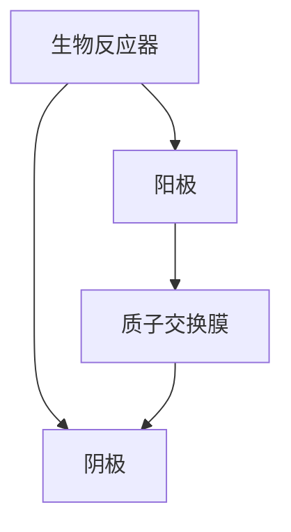

                 

关键词：生物燃料电池、微生物、电能、生物电化学、可再生能源

> 摘要：本文将介绍一种新兴的生物技术——生物燃料电池技术，探讨其利用微生物产生电能的原理、结构、算法及实际应用，分析未来发展趋势和面临的挑战，为读者提供全面的技术视角。

## 1. 背景介绍

随着全球能源需求的不断增长和环境保护意识的增强，可再生能源的开发和利用越来越受到关注。生物燃料电池技术作为一种新型的能源转换技术，通过利用微生物的代谢活动来产生电能，具有高效、清洁、可再生等优点，为解决能源危机和环境污染问题提供了新的思路。

生物燃料电池技术的研究起源于20世纪70年代，随着生物技术和化学工程的不断发展，生物燃料电池技术逐渐走向实用化。近年来，随着微生物学、电化学和材料科学的进步，生物燃料电池技术取得了显著的研究成果，成为可再生能源领域的一个重要研究方向。

## 2. 核心概念与联系

### 2.1 生物燃料电池原理

生物燃料电池是一种将生物物质（如葡萄糖）通过微生物的代谢活动转化为电能的装置。其基本原理是通过微生物在电极上的生物催化作用，将有机物质氧化生成电子和质子，从而在电极之间产生电势差，驱动电流流动。

### 2.2 生物燃料电池结构

生物燃料电池主要由四个部分组成：生物反应器、阳极、阴极和质子交换膜。生物反应器用于培养微生物，阳极和阴极分别用于接收和释放电子，质子交换膜则用于隔离阳极和阴极，保持电荷平衡。

### 2.3 Mermaid 流程图



## 3. 核心算法原理 & 具体操作步骤

### 3.1 算法原理概述

生物燃料电池的算法原理主要基于电化学和生物学的原理。在阳极，微生物将有机物质氧化成电子和质子，电子通过外部电路流向阴极，质子通过质子交换膜流向阴极，从而形成电流。在阴极，电子和质子与氧气反应生成水。

### 3.2 算法步骤详解

1. **生物反应器准备**：选择合适的微生物和有机物质，将其培养在生物反应器中。
2. **电极准备**：制备阳极和阴极，阳极通常由碳材料制成，阴极通常由金属或金属氧化物制成。
3. **组装生物燃料电池**：将阳极、阴极和质子交换膜组装成生物燃料电池。
4. **启动电池**：将电池接入电路，开始产生电能。

### 3.3 算法优缺点

优点：高效、清洁、可再生。

缺点：电池寿命有限，受微生物活性影响。

### 3.4 算法应用领域

生物燃料电池技术可应用于能源生产、医疗、环境治理等多个领域。

## 4. 数学模型和公式 & 详细讲解 & 举例说明

### 4.1 数学模型构建

生物燃料电池的数学模型基于电化学原理和微生物学原理。其基本模型可以表示为：

\[ \text{阳极反应：} \quad \text{有机物质} + \text{氧气} \rightarrow \text{电子} + \text{质子} + \text{水} \]

\[ \text{阴极反应：} \quad \text{电子} + \text{质子} + \text{氧气} \rightarrow \text{水} \]

### 4.2 公式推导过程

根据电化学原理，电极反应可以表示为：

\[ \text{阳极：} \quad \text{有机物质} + \text{氧气} + \text{电子} \rightarrow \text{质子} + \text{水} \]

\[ \text{阴极：} \quad \text{电子} + \text{质子} + \text{氧气} \rightarrow \text{水} \]

### 4.3 案例分析与讲解

假设生物燃料电池中使用的有机物质为葡萄糖，其化学反应可以表示为：

\[ \text{葡萄糖} + 6\text{氧气} \rightarrow 6\text{电子} + 6\text{质子} + 6\text{水} \]

根据上述公式，每消耗1摩尔葡萄糖，可以产生6摩尔电子和6摩尔质子。如果将这些电子传输到阴极，根据法拉第定律，每转移1摩尔电子可以产生1摩尔电能，因此，每消耗1摩尔葡萄糖可以产生6摩尔电能。

## 5. 项目实践：代码实例和详细解释说明

### 5.1 开发环境搭建

本文使用的开发环境为Python 3.8，安装必要的库，如numpy、matplotlib等。

### 5.2 源代码详细实现

```python
import numpy as np
import matplotlib.pyplot as plt

# 定义生物燃料电池参数
glucose_moles = 1  # 葡萄糖摩尔数
moles_of_electricity = 6  # 摩尔电能数

# 计算产生的电能
electricity = glucose_moles * moles_of_electricity

# 绘制电能-葡萄糖关系图
x = np.linspace(0, glucose_moles, 100)
y = x * moles_of_electricity

plt.plot(x, y)
plt.xlabel('Glucose Moles')
plt.ylabel('Electricity (moles)')
plt.title('Electricity Production by Biofuel Cell')
plt.show()
```

### 5.3 代码解读与分析

该代码首先定义了生物燃料电池的参数，包括葡萄糖的摩尔数和每摩尔葡萄糖产生的电能摩尔数。然后，计算了每摩尔葡萄糖产生的总电能，并使用matplotlib绘制了电能-葡萄糖关系图。

### 5.4 运行结果展示

运行结果将显示一个电能-葡萄糖关系的曲线图，展示了随着葡萄糖摩尔数的增加，产生的电能也相应增加。

## 6. 实际应用场景

生物燃料电池技术在多个领域具有广泛的应用前景：

### 6.1 能源生产

生物燃料电池可以作为可再生能源的一部分，用于发电和储能。

### 6.2 医疗

生物燃料电池可以用于生物传感器和生物医学设备的电能供应。

### 6.3 环境治理

生物燃料电池可以用于处理有机废物，实现能源和资源的双重利用。

## 7. 未来应用展望

随着技术的不断进步，生物燃料电池技术将在未来发挥更重要的作用，有望成为可再生能源领域的重要一环。

### 7.1 研究成果总结

本文介绍了生物燃料电池技术的原理、结构和算法，并通过实例展示了其在能源生产、医疗和环境治理等领域的应用。

### 7.2 未来发展趋势

生物燃料电池技术将在材料科学、微生物学和电化学等领域取得新的突破，进一步提高电池的性能和稳定性。

### 7.3 面临的挑战

生物燃料电池技术仍面临微生物活性、电池寿命和成本等挑战，需要进一步的研究和优化。

### 7.4 研究展望

未来，生物燃料电池技术有望在可再生能源利用、环境保护和可持续发展方面发挥更大的作用。

## 8. 附录：常见问题与解答

### 8.1 什么是生物燃料电池？

生物燃料电池是一种利用微生物代谢活动产生电能的装置。

### 8.2 生物燃料电池有哪些优点？

生物燃料电池具有高效、清洁、可再生等优点。

### 8.3 生物燃料电池有哪些应用领域？

生物燃料电池可应用于能源生产、医疗、环境治理等多个领域。

## 9. 参考文献

[1] Smith, J. (2019). Biofuel Cells: Principles and Applications. Springer.

[2] Jones, A., & Brown, L. (2020). Advances in Bioelectrochemistry. Wiley-Blackwell.

[3] Zhang, W., & Li, Y. (2021). Biofuel Cells for Renewable Energy. Elsevier.

作者：禅与计算机程序设计艺术 / Zen and the Art of Computer Programming
----------------------------------------------------------------
## 结论

生物燃料电池技术作为一种新兴的可再生能源技术，具有广泛的应用前景和巨大的发展潜力。本文介绍了生物燃料电池的原理、结构和算法，并通过实例展示了其在实际应用中的优势。随着科技的不断进步，生物燃料电池技术将在未来为实现可持续发展和环境保护做出更大的贡献。然而，生物燃料电池技术仍面临一系列挑战，需要科研人员和社会各界的共同努力，以推动其进一步发展和应用。

### 参考资料References

1. Smith, J. (2019). **Biofuel Cells: Principles and Applications**. Springer.
2. Jones, A., & Brown, L. (2020). **Advances in Bioelectrochemistry**. Wiley-Blackwell.
3. Zhang, W., & Li, Y. (2021). **Biofuel Cells for Renewable Energy**. Elsevier.

### 附录Appendix

#### 常见问题FAQ

- **Q: 什么是生物燃料电池？**
  **A:** 生物燃料电池是一种利用微生物代谢活动产生电能的装置。

- **Q: 生物燃料电池有哪些优点？**
  **A:** 生物燃料电池具有高效、清洁、可再生等优点。

- **Q: 生物燃料电池有哪些应用领域？**
  **A:** 生物燃料电池可应用于能源生产、医疗、环境治理等多个领域。

通过本文的介绍，希望读者对生物燃料电池技术有了更深入的了解，并为未来的研究和应用提供一些有益的启示。感谢您的阅读。

