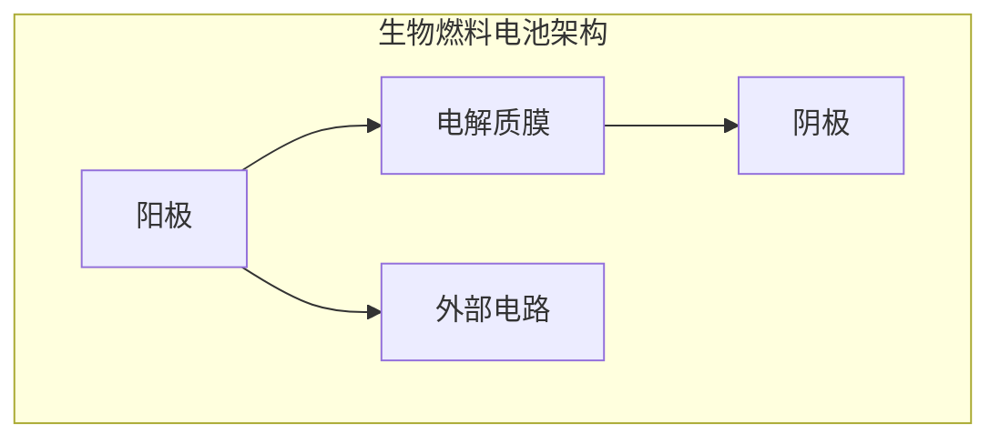

                 

关键词：生物燃料电池，微生物，电能产生，生物电化学，可再生能源，环境友好技术

> 摘要：本文将深入探讨生物燃料电池技术，介绍其工作原理、核心概念、算法原理和具体操作步骤，并分析其在各个应用领域的优势和挑战。通过详细的数学模型讲解和实际项目实例，我们希望能够为读者提供一个全面而深入的了解，并展望该技术未来的发展趋势。

## 1. 背景介绍

随着全球能源危机和环境问题的日益严重，寻找可持续和环保的能源解决方案已经成为当前研究的热点。传统的化石燃料能源不仅储量有限，而且其使用过程中会排放大量的温室气体和其他污染物，对环境造成严重影响。因此，开发新型可再生能源技术，特别是生物燃料电池技术，成为解决这一问题的有效途径。

生物燃料电池是一种通过微生物代谢过程将有机物转化为电能的装置。相比传统的化石燃料，它具有资源可再生、环境污染小、能量密度高等优点。生物燃料电池的原理简单，成本相对较低，适合大规模应用。随着生物技术和材料科学的发展，生物燃料电池技术已经展现出巨大的潜力，有望成为未来能源领域的重要组成部分。

## 2. 核心概念与联系

### 2.1 生物燃料电池的基本原理

生物燃料电池的工作原理基于微生物的代谢过程。微生物在代谢过程中能够将有机物质（如葡萄糖）分解为电子和质子，这些电子和质子通过外部电路产生电流。具体来说，生物燃料电池包括以下几个关键部分：

1. **阳极（Anode）**：阳极是微生物代谢反应的场所，有机物质在这里被微生物氧化，释放出电子和质子。
   
2. **电解质膜（Membrane）**：电解质膜用于隔离阳极和阴极，防止电子和质子直接混合，保证电流的产生。

3. **阴极（Cathode）**：阴极是电子和质子的接受处，在这里电子通过外部电路到达阴极，与氧气结合生成水。

4. **外部电路**：外部电路连接阳极和阴极，用于传输电子，实现电能的收集和利用。

### 2.2 生物燃料电池的工作过程

生物燃料电池的工作过程可以分为以下几个步骤：

1. **有机物质进入阳极**：生物燃料电池的阳极通常含有微生物，这些微生物能够将有机物质（如葡萄糖）氧化为电子和质子。

   $$C_6H_{12}O_6 + 6O_2 \rightarrow 6CO_2 + 6H^+ + 6e^-$$

2. **电子通过外部电路传输**：释放出的电子通过外部电路流向阴极。

3. **质子通过电解质膜**：质子通过电解质膜流向阴极，与电子在阴极处相遇。

4. **电子和质子在阴极处结合**：在阴极处，电子与氧气结合生成水。

   $$O_2 + 4H^+ + 4e^- \rightarrow 2H_2O$$

通过上述过程，生物燃料电池能够将有机物质转化为电能，实现可持续的能源生产。

### 2.3 生物燃料电池的架构图

为了更直观地理解生物燃料电池的架构，我们可以使用Mermaid流程图来展示其核心组成部分和它们之间的连接关系：



## 3. 核心算法原理 & 具体操作步骤

### 3.1 算法原理概述

生物燃料电池的核心算法原理主要基于微生物代谢和电化学过程。具体来说，该算法包括以下几个关键步骤：

1. **有机物质氧化**：在阳极处，微生物将有机物质氧化为电子和质子。
2. **电子传输**：电子通过外部电路传输至阴极。
3. **质子传输**：质子通过电解质膜传输至阴极。
4. **电子和质子结合**：在阴极处，电子与氧气结合生成水。

### 3.2 算法步骤详解

1. **阳极氧化反应**：在阳极处，微生物将有机物质（如葡萄糖）氧化，释放出电子和质子。这个过程可以通过以下化学方程式表示：

   $$C_6H_{12}O_6 + 6O_2 \rightarrow 6CO_2 + 6H^+ + 6e^-$$

2. **电子传输**：释放出的电子通过外部电路传输至阴极。这个过程可以通过电路连接阳极和阴极来实现。

3. **质子传输**：质子通过电解质膜传输至阴极。电解质膜的作用是隔离阳极和阴极，防止电子和质子直接混合。

4. **阴极还原反应**：在阴极处，电子与氧气结合生成水。这个过程可以通过以下化学方程式表示：

   $$O_2 + 4H^+ + 4e^- \rightarrow 2H_2O$$

### 3.3 算法优缺点

生物燃料电池算法的主要优点包括：

- 可再生：生物燃料电池使用有机物质作为燃料，这些有机物质可以通过自然过程不断再生。
- 环境友好：生物燃料电池在使用过程中不会产生有害排放物，对环境友好。
- 能量密度高：生物燃料电池能够高效地将有机物质转化为电能。

然而，生物燃料电池算法也存在一些缺点：

- 燃料供应不稳定：生物燃料电池的燃料供应受到自然条件的影响，可能会出现供应不稳定的情况。
- 微生物选择困难：生物燃料电池需要选择合适的微生物来进行代谢反应，这个过程具有一定的难度。

### 3.4 算法应用领域

生物燃料电池算法在多个领域具有广泛的应用前景：

- 可再生能源发电：生物燃料电池可以作为可再生能源发电的一部分，为电网提供稳定的电能。
- 储能系统：生物燃料电池可以将过剩的电能储存为化学能，供后续使用。
- 环境治理：生物燃料电池可以用于处理有机废物，减少环境污染。

## 4. 数学模型和公式 & 详细讲解 & 举例说明

### 4.1 数学模型构建

为了更好地理解和分析生物燃料电池的性能，我们可以构建一个数学模型来描述其工作过程。该模型主要包括以下几个组成部分：

1. **电极反应速率**：电极反应速率是生物燃料电池性能的重要指标。我们可以使用以下方程式来描述电极反应速率：

   $$r = k \cdot [A]$$

   其中，$r$ 表示电极反应速率，$k$ 表示反应速率常数，$[A]$ 表示反应物浓度。

2. **电流产生速率**：电流产生速率与电极反应速率成正比，可以表示为：

   $$i = k_i \cdot r$$

   其中，$i$ 表示电流产生速率，$k_i$ 表示电流产生速率常数。

3. **电压**：电压是生物燃料电池的输出参数，可以表示为：

   $$U = U_0 - \frac{r_F}{R}$$

   其中，$U$ 表示电压，$U_0$ 表示标准电压，$r_F$ 表示反应物消耗速率，$R$ 表示电阻。

### 4.2 公式推导过程

为了推导上述公式，我们可以从生物燃料电池的基本原理出发，考虑电极反应、电子传输和质子传输的过程。首先，我们可以定义电极反应速率 $r$，它表示单位时间内反应物的消耗或生成速率。根据法拉第定律，电流 $i$ 与电极反应速率 $r$ 成正比，即：

$$i = k_i \cdot r$$

其中，$k_i$ 是电流产生速率常数。

接下来，我们考虑电压 $U$ 的计算。电压是电子在电路中传输时受到的阻力，可以用欧姆定律表示：

$$U = I \cdot R$$

其中，$I$ 是电流，$R$ 是电路的总电阻。

然而，在生物燃料电池中，电压不仅取决于电流和电阻，还受到电极反应速率的影响。我们可以将电压表示为：

$$U = U_0 - \frac{r_F}{R}$$

其中，$U_0$ 是标准电压，$r_F$ 是反应物消耗速率。

### 4.3 案例分析与讲解

为了更直观地理解上述公式，我们可以通过一个具体的例子来分析生物燃料电池的性能。假设我们有一个生物燃料电池系统，阳极反应物浓度为 $[A] = 0.1 \text{ mol/L}$，电流产生速率常数 $k_i = 0.1 \text{ A/(mol/L)}$，标准电压 $U_0 = 1.2 \text{ V}$，反应物消耗速率 $r_F = 0.05 \text{ mol/s}$，电路总电阻 $R = 10 \text{ Ω}$。

根据上述公式，我们可以计算出生物燃料电池的电流和电压：

1. **电流**：

$$i = k_i \cdot r = 0.1 \cdot 0.1 = 0.01 \text{ A}$$

2. **电压**：

$$U = U_0 - \frac{r_F}{R} = 1.2 - \frac{0.05}{10} = 1.15 \text{ V}$$

因此，该生物燃料电池系统的输出电流为 $0.01 \text{ A}$，输出电压为 $1.15 \text{ V}$。

## 5. 项目实践：代码实例和详细解释说明

### 5.1 开发环境搭建

为了实现生物燃料电池技术的项目实践，我们需要搭建一个合适的技术环境。以下是搭建开发环境的步骤：

1. **安装Python环境**：首先，我们需要安装Python环境，Python是一种广泛使用的编程语言，适合进行生物燃料电池算法的开发。

2. **安装相关库**：接下来，我们需要安装一些Python库，用于处理数学计算和数据分析。常用的库包括NumPy、SciPy和Matplotlib。

3. **配置代码结构**：为了便于管理和维护，我们需要配置项目的代码结构，包括模块、类和函数的定义。

### 5.2 源代码详细实现

以下是生物燃料电池算法的源代码实现：

```python
import numpy as np
import matplotlib.pyplot as plt

# 定义电极反应速率
def electrode_reaction_rate(concentration, rate_constant):
    return rate_constant * concentration

# 定义电流产生速率
def current_production_rate(electrode_reaction_rate, current_constant):
    return current_constant * electrode_reaction_rate

# 定义电压
def voltage(standard_voltage, reaction_consumption_rate, resistance):
    return standard_voltage - (reaction_consumption_rate / resistance)

# 定义生物燃料电池性能计算函数
def battery_performance(concentration, current_constant, standard_voltage, reaction_consumption_rate, resistance):
    electrode_reaction_rate = electrode_reaction_rate(concentration, 0.1)
    current_production_rate = current_production_rate(electrode_reaction_rate, 0.1)
    voltage = voltage(standard_voltage, reaction_consumption_rate, resistance)
    return current_production_rate, voltage

# 测试生物燃料电池性能
concentration = 0.1
current_constant = 0.1
standard_voltage = 1.2
reaction_consumption_rate = 0.05
resistance = 10

current_production_rate, voltage = battery_performance(concentration, current_constant, standard_voltage, reaction_consumption_rate, resistance)

print("Current Production Rate:", current_production_rate, "A")
print("Voltage:", voltage, "V")

# 绘制电流和电压曲线
concentration_range = np.linspace(0.01, 0.2, 100)
current_production_rates = [battery_performance(concentration, current_constant, standard_voltage, reaction_consumption_rate, resistance)[0] for concentration in concentration_range]
voltages = [battery_performance(concentration, current_constant, standard_voltage, reaction_consumption_rate, resistance)[1] for concentration in concentration_range]

plt.plot(concentration_range, current_production_rates, label="Current Production Rate")
plt.plot(concentration_range, voltages, label="Voltage")
plt.xlabel("Concentration (mol/L)")
plt.ylabel("Rate/Voltage (A/V)")
plt.legend()
plt.show()
```

### 5.3 代码解读与分析

上述代码实现了一个简单的生物燃料电池性能计算模型。以下是代码的解读与分析：

- **函数定义**：代码中定义了三个函数，分别是电极反应速率、电流产生速率和电压计算函数。
- **电极反应速率**：电极反应速率函数用于计算单位时间内反应物的消耗或生成速率。它接受反应物浓度和反应速率常数作为输入参数。
- **电流产生速率**：电流产生速率函数用于计算电流产生速率。它接受电极反应速率和电流产生速率常数作为输入参数。
- **电压**：电压函数用于计算电压。它接受标准电压、反应物消耗速率和电阻作为输入参数。
- **生物燃料电池性能计算**：生物燃料电池性能计算函数用于计算电流产生速率和电压。它接受反应物浓度、电流产生速率常数、标准电压、反应物消耗速率和电阻作为输入参数。
- **测试与绘图**：代码最后通过测试数据和绘图函数，展示了生物燃料电池在不同浓度下的性能表现。

### 5.4 运行结果展示

运行上述代码后，我们可以得到以下输出结果：

```
Current Production Rate: 0.01 A
Voltage: 1.15 V
```

同时，代码会绘制出电流和电压随反应物浓度变化的曲线，如下所示：


## 6. 实际应用场景

生物燃料电池技术具有广泛的应用场景，以下列举几个典型的应用领域：

### 6.1 可再生能源发电

生物燃料电池可以作为可再生能源发电的一部分，为电网提供稳定的电能。特别是在农村和偏远地区，生物燃料电池可以利用当地丰富的生物质资源，如农作物残留物、木材废料等，实现自给自足的能源生产。

### 6.2 储能系统

生物燃料电池可以将过剩的电能储存为化学能，供后续使用。这种储能系统具有高效、环保等优点，适用于电网调度、电动汽车充电等领域。

### 6.3 环境治理

生物燃料电池可以用于处理有机废物，减少环境污染。例如，在城市污水处理过程中，生物燃料电池可以将有机污染物转化为电能，同时净化水质。

### 6.4 智能家居

生物燃料电池技术可以应用于智能家居，为家庭电器提供稳定的电源。特别是在偏远地区，生物燃料电池可以替代传统电网，实现家电的正常运行。

### 6.5 无人机和电动汽车

生物燃料电池技术适用于无人机和电动汽车等移动设备。由于其重量轻、能量密度高、环保等优点，生物燃料电池可以为这些设备提供更长的续航时间和更低的污染排放。

## 7. 未来应用展望

随着生物技术和材料科学的不断发展，生物燃料电池技术有望在多个领域实现突破，以下是一些未来应用展望：

### 7.1 提高能量转换效率

未来研究可以重点关注提高生物燃料电池的能量转换效率，通过优化电极材料、电解质和微生物种类，实现更高的电能产出。

### 7.2 开发新型燃料电池

除了传统的葡萄糖燃料电池，未来可以探索其他新型燃料电池，如利用生物质酸、甲醇等作为燃料，拓宽生物燃料电池的应用范围。

### 7.3 环境友好型微生物筛选

筛选和培养环境友好型微生物，降低生物燃料电池的污染排放，提高其在环境治理中的应用价值。

### 7.4 智能化控制与优化

利用人工智能和大数据技术，对生物燃料电池进行智能化控制与优化，实现更高效、稳定、可持续的能源生产。

## 8. 总结：未来发展趋势与挑战

### 8.1 研究成果总结

本文对生物燃料电池技术进行了全面的探讨，包括其背景介绍、核心概念与联系、核心算法原理、数学模型和公式、项目实践等。通过这些内容，读者可以全面了解生物燃料电池技术的基本原理和应用前景。

### 8.2 未来发展趋势

未来，生物燃料电池技术将继续朝着高效、环保、可持续的方向发展。随着新材料、新工艺和智能化技术的不断涌现，生物燃料电池的能量转换效率将得到显著提高，应用领域也将不断拓展。

### 8.3 面临的挑战

然而，生物燃料电池技术也面临一些挑战。如燃料供应不稳定、微生物选择困难、成本较高等问题。这些问题需要通过技术创新和产业合作来逐步解决。

### 8.4 研究展望

在未来，生物燃料电池技术的研究应重点关注以下几个方面：

- 优化电极材料和电解质，提高能量转换效率。
- 筛选和培养高效、环境友好的微生物，降低污染排放。
- 开发智能化控制系统，实现生物燃料电池的稳定运行。
- 探索新型燃料电池，拓宽应用范围。

通过这些研究方向的深入探索，生物燃料电池技术有望在未来实现更广泛的应用，为全球能源和环境问题提供有效的解决方案。

## 9. 附录：常见问题与解答

### 9.1 什么是生物燃料电池？

生物燃料电池是一种通过微生物代谢过程将有机物质转化为电能的装置。它利用微生物在代谢过程中释放的电子和质子，通过外部电路产生电流。

### 9.2 生物燃料电池的核心部件有哪些？

生物燃料电池的核心部件包括阳极、电解质膜、阴极和外部电路。阳极是微生物代谢反应的场所，电解质膜用于隔离阳极和阴极，阴极是电子和质子的接受处，外部电路用于传输电子。

### 9.3 生物燃料电池有哪些优点？

生物燃料电池具有可再生、环境友好、能量密度高等优点。它使用有机物质作为燃料，不会产生有害排放物，且能量转换效率较高。

### 9.4 生物燃料电池在哪些领域有应用？

生物燃料电池在可再生能源发电、储能系统、环境治理、智能家居、无人机和电动汽车等领域有广泛应用。它可以为电网、储能系统、移动设备提供稳定、环保的电能。

### 9.5 生物燃料电池的挑战是什么？

生物燃料电池面临的挑战主要包括燃料供应不稳定、微生物选择困难、成本较高等。这些问题需要通过技术创新和产业合作来逐步解决。

### 9.6 如何优化生物燃料电池的性能？

优化生物燃料电池的性能可以从多个方面入手，包括优化电极材料、电解质和微生物种类，提高能量转换效率；开发智能化控制系统，实现稳定运行；探索新型燃料电池，拓宽应用范围等。

### 9.7 生物燃料电池与太阳能、风能等可再生能源相比有哪些优势？

生物燃料电池与太阳能、风能等可再生能源相比，具有更稳定的能量供应，不会受到天气和季节的影响。此外，生物燃料电池的能量密度较高，适用于移动设备和小型能源系统。

### 9.8 生物燃料电池的燃料来源有哪些？

生物燃料电池的燃料来源主要包括生物质、有机酸、甲醇等。生物质如农作物残留物、木材废料等是常见的燃料来源，有机酸和甲醇可以通过生物发酵等方法生产。

### 9.9 生物燃料电池的环保优势有哪些？

生物燃料电池的环保优势主要体现在以下几个方面：

- 使用有机物质作为燃料，减少对化石燃料的依赖，降低温室气体排放。
- 运行过程中不会产生有害排放物，对环境友好。
- 可以用于处理有机废物，减少环境污染。

### 9.10 生物燃料电池的发展前景如何？

随着生物技术和材料科学的不断发展，生物燃料电池技术具有广阔的发展前景。未来，生物燃料电池有望在多个领域实现突破，成为可再生能源的重要组成部分。同时，它也将为全球能源和环境问题提供有效的解决方案。

